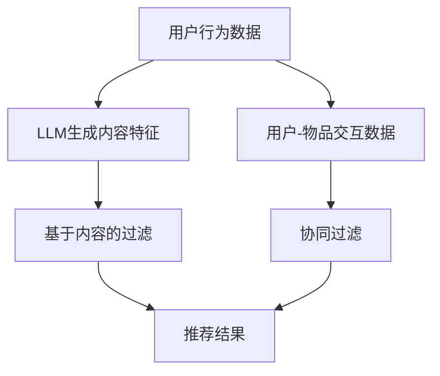

                 

关键词：语言模型，推荐系统，深度学习，人工智能，数据挖掘

> 摘要：本文将深入探讨将语言模型（LLM）应用于推荐系统（RS）的方法。通过介绍LLM的核心原理、与推荐系统的结合方式以及具体实现步骤，本文旨在为读者提供一个全面的技术视角，以便更好地理解和应用这一先进的方法。

## 1. 背景介绍

随着互联网和大数据技术的发展，推荐系统已经成为许多在线服务的重要组成部分。传统的推荐系统主要通过基于内容的过滤（Content-based Filtering）、协同过滤（Collaborative Filtering）等方法来提供个性化的推荐。然而，这些方法在面对复杂的用户行为和多样化的内容时，往往表现不佳。为了解决这一问题，近年来，深度学习和自然语言处理（NLP）技术逐渐被引入到推荐系统中。

语言模型（Language Model，LLM）是自然语言处理领域的一个重要研究方向，它通过学习大规模的语料库，能够预测单词或短语的下一个可能出现的词。LLM在文本生成、机器翻译、情感分析等领域取得了显著的成果。然而，将LLM应用于推荐系统仍然是一个相对较新的研究方向。本文将介绍如何将LLM与推荐系统相结合，以提升推荐效果。

## 2. 核心概念与联系

### 2.1. 语言模型原理

语言模型（LLM）是一种概率模型，它通过学习大量文本数据，预测给定输入序列后下一个可能出现的单词或短语的分布。常见的语言模型包括n元语法模型、递归神经网络（RNN）模型、长短时记忆网络（LSTM）模型以及Transformer模型等。

#### 2.1.1. n元语法模型

n元语法模型是一种基于统计的简单语言模型，它假设一个词的出现概率仅与它的前n-1个词相关。具体来说，n元语法模型通过统计文本中相邻n个词的共现频率来预测下一个词。

#### 2.1.2. 递归神经网络（RNN）

递归神经网络（RNN）是一种能够处理序列数据的神经网络模型。RNN通过在网络中引入递归结构，使得当前时刻的输出能够依赖于之前时刻的输入。然而，传统的RNN存在梯度消失和梯度爆炸问题，难以在长序列上建模。

#### 2.1.3. 长短时记忆网络（LSTM）

长短时记忆网络（LSTM）是RNN的一种变体，它通过引入门控机制，有效地解决了梯度消失问题。LSTM能够捕捉长序列中的长期依赖关系，在文本生成、语音识别等领域表现出色。

#### 2.1.4. Transformer模型

Transformer模型是近年来在自然语言处理领域取得突破性成果的一种新型神经网络架构。与传统的RNN和LSTM不同，Transformer模型采用自注意力机制（Self-Attention）来处理序列数据，能够并行计算，提高了计算效率。同时，Transformer模型也在机器翻译、文本分类等任务中取得了卓越的性能。

### 2.2. 推荐系统原理

推荐系统（Recommendation System，RS）是一种信息过滤技术，旨在为用户提供个性化的信息推荐。推荐系统的主要目标是解决“信息过载”问题，帮助用户发现感兴趣的内容或商品。

#### 2.2.1. 基于内容的过滤

基于内容的过滤（Content-based Filtering）方法通过分析用户的历史行为和内容特征，为用户推荐与其兴趣相似的内容。这种方法的关键在于内容特征的提取和匹配。

#### 2.2.2. 协同过滤

协同过滤（Collaborative Filtering）方法通过分析用户之间的相似度，为用户推荐相似用户喜欢的内容。协同过滤方法可以分为基于用户的协同过滤（User-based Collaborative Filtering）和基于项目的协同过滤（Item-based Collaborative Filtering）。

### 2.3. LLMS和RS的联系

将LLM应用于推荐系统，可以从以下几个角度进行：

#### 2.3.1. 基于内容的过滤

利用LLM生成内容特征，提高基于内容的过滤效果。LLM能够生成丰富的语义信息，有助于发现用户潜在的兴趣点。

#### 2.3.2. 协同过滤

利用LLM对用户和物品进行嵌入表示，提升协同过滤的精度。通过LLM生成的嵌入向量，可以更好地捕捉用户和物品之间的相似性。

#### 2.3.3. 深度学习模型融合

将LLM与其他深度学习模型（如卷积神经网络（CNN）、循环神经网络（RNN）等）结合，构建多模态推荐系统，提高推荐效果。

### 2.4. Mermaid流程图

以下是一个简单的Mermaid流程图，展示了LLM与推荐系统的结合方式：

## 3. 核心算法原理 & 具体操作步骤

### 3.1. 算法原理概述

本文将介绍一种基于Transformer模型的LLM AS RS方法。该方法主要包括以下几个步骤：

1. 数据预处理：对用户行为数据和物品特征进行预处理，包括文本清洗、分词、去停用词等。
2. 语言模型训练：使用预训练的Transformer模型对用户行为数据进行训练，生成内容特征。
3. 用户-物品嵌入：利用语言模型生成的内容特征，对用户和物品进行嵌入表示。
4. 推荐算法融合：将用户-物品嵌入向量与协同过滤方法相结合，生成推荐结果。

### 3.2. 算法步骤详解

#### 3.2.1. 数据预处理

数据预处理是推荐系统的重要环节，它直接影响到后续模型的训练效果。在本方法中，我们需要对用户行为数据和物品特征进行预处理。

1. 用户行为数据预处理：对用户行为数据进行清洗，去除无效数据和噪声。对于文本数据，需要进行分词、去停用词等操作，以提取出有效的语义信息。
2. 物品特征预处理：对于物品特征，需要进行编码和标准化处理，以便于后续的嵌入表示。

#### 3.2.2. 语言模型训练

在本方法中，我们使用预训练的Transformer模型对用户行为数据进行训练，生成内容特征。

1. 模型选择：选择预训练的Transformer模型，如BERT、GPT等。
2. 数据处理：将用户行为数据转化为模型的输入，并进行训练。
3. 模型优化：通过训练，优化模型参数，使其能够更好地生成内容特征。

#### 3.2.3. 用户-物品嵌入

利用语言模型生成的内容特征，对用户和物品进行嵌入表示。

1. 用户嵌入：将用户行为数据输入到语言模型中，提取用户嵌入向量。
2. 物品嵌入：将物品特征输入到语言模型中，提取物品嵌入向量。

#### 3.2.4. 推荐算法融合

将用户-物品嵌入向量与协同过滤方法相结合，生成推荐结果。

1. 计算用户-物品相似度：计算用户嵌入向量和物品嵌入向量之间的相似度。
2. 排序生成推荐列表：根据用户-物品相似度，对物品进行排序，生成推荐列表。

### 3.3. 算法优缺点

#### 优点

1. 高效的内容特征提取：语言模型能够生成丰富的语义信息，有助于发现用户潜在的兴趣点。
2. 融合多种推荐算法：将语言模型与协同过滤方法相结合，提高了推荐效果。

#### 缺点

1. 计算成本较高：语言模型训练和嵌入表示过程需要大量的计算资源。
2. 对数据质量要求较高：用户行为数据的质量直接影响语言模型的训练效果。

### 3.4. 算法应用领域

基于LLM的推荐系统方法可以广泛应用于以下领域：

1. 社交网络：为用户推荐感兴趣的朋友、动态和话题。
2. 电子商务：为用户推荐商品、店铺和购物车。
3. 新闻推荐：为用户推荐感兴趣的新闻和文章。

## 4. 数学模型和公式 & 详细讲解 & 举例说明

### 4.1. 数学模型构建

在本文中，我们主要关注Transformer模型和协同过滤方法的数学模型。下面分别介绍这两种方法的数学模型。

#### 4.1.1. Transformer模型

Transformer模型采用自注意力机制（Self-Attention）来处理序列数据。在Transformer模型中，每个词的注意力得分取决于该词与其他词的相关性。具体来说，自注意力机制可以表示为：

$$
\text{Attention}(Q, K, V) = \text{softmax}\left(\frac{QK^T}{\sqrt{d_k}}\right)V
$$

其中，$Q$、$K$和$V$分别表示查询向量、键向量和值向量，$d_k$表示键向量的维度。

#### 4.1.2. 协同过滤

协同过滤方法主要通过计算用户之间的相似度来生成推荐列表。在基于用户的协同过滤方法中，用户-物品相似度可以表示为：

$$
\sim

