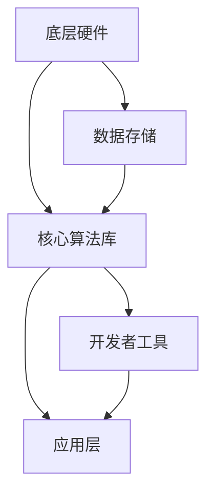

                 

关键词：人工智能操作系统、大型语言模型、机器学习、自然语言处理、技术变革

摘要：本文探讨了大型语言模型（LLM）作为人工智能操作系统的开端，分析了LLM OS的核心概念、架构及其对传统操作系统的影响。文章首先介绍了背景，然后深入探讨了LLM OS的核心算法原理、数学模型及实际应用场景，最后展望了LLM OS的未来发展趋势与挑战。

## 1. 背景介绍

近年来，人工智能（AI）技术的迅猛发展，使得机器学习（ML）、深度学习（DL）等技术在各个领域取得了显著成果。然而，这些技术的应用往往依赖于特定的算法、模型和数据集，导致系统之间缺乏互操作性。为了解决这个问题，研究人员提出了将人工智能集成到操作系统中的想法，从而实现通用人工智能操作系统（AIOS）。其中，大型语言模型（LLM）作为一种高度复杂、功能强大的AI模型，被认为是实现AIOS的关键。

LLM OS旨在通过整合多种AI技术和资源，构建一个统一的操作平台，使得不同应用场景下的AI系统能够无缝协同工作。这一概念不仅能够提高AI系统的开发效率，还能够促进AI技术的普及和应用。

## 2. 核心概念与联系

### 2.1 大型语言模型（LLM）简介

大型语言模型（LLM）是一种基于深度学习的自然语言处理（NLP）模型，通过学习大量文本数据，LLM能够理解和生成人类语言。与传统的自然语言处理技术相比，LLM具有更高的灵活性和更强的表达能力，可以应用于各种语言任务，如文本分类、情感分析、机器翻译、问答系统等。

### 2.2 人工智能操作系统（AIOS）架构

人工智能操作系统（AIOS）的核心目标是实现人工智能的普及和集成。其架构主要包括以下几个部分：

- **底层硬件**：提供高性能的计算资源和数据存储能力，以支持大型语言模型（LLM）的运行和训练。
- **核心算法库**：包括各种机器学习算法和深度学习模型，如神经网络、生成对抗网络（GAN）、强化学习等，以满足不同应用场景的需求。
- **应用层**：提供丰富的API和工具，方便开发者将AI技术应用于各种实际问题。

### 2.3 Mermaid 流程图

下面是LLM OS架构的Mermaid流程图：



## 3. 核心算法原理 & 具体操作步骤

### 3.1 算法原理概述

LLM OS的核心算法是基于大型语言模型（LLM），其基本原理是通过深度学习技术对大量文本数据进行训练，从而学习到语言的内在规律和语义信息。在训练过程中，模型会不断调整内部参数，以达到最小化损失函数的目的。

### 3.2 算法步骤详解

- **数据预处理**：将原始文本数据清洗、分词、编码等，转化为模型可以处理的格式。
- **模型构建**：定义神经网络结构，初始化模型参数。
- **训练过程**：使用训练数据对模型进行迭代训练，优化模型参数。
- **评估与调整**：使用验证数据评估模型性能，并根据评估结果调整模型参数。
- **应用部署**：将训练好的模型部署到LLM OS平台上，供开发者使用。

### 3.3 算法优缺点

**优点**：

- **强大的语言理解能力**：LLM能够处理和理解复杂的自然语言文本，具有很高的准确性和灵活性。
- **广泛的适用性**：LLM可以应用于各种自然语言处理任务，如文本分类、情感分析、机器翻译、问答系统等。
- **高效的可扩展性**：LLM OS提供了一个统一的平台，方便开发者集成和扩展AI技术。

**缺点**：

- **计算资源消耗大**：训练和部署大型语言模型需要大量的计算资源和时间。
- **数据隐私和安全问题**：训练过程中需要处理大量用户数据，可能涉及数据隐私和安全问题。

### 3.4 算法应用领域

LLM OS的应用领域非常广泛，主要包括以下几个方面：

- **自然语言处理**：如文本分类、情感分析、机器翻译、问答系统等。
- **智能客服**：为企业和政府提供智能客服解决方案，提高客户服务质量。
- **教育领域**：如智能辅导、在线教育、语言学习等。
- **智能医疗**：如疾病预测、医学影像分析、智能诊断等。
- **智能金融**：如风险控制、智能投顾、智能客服等。

## 4. 数学模型和公式 & 详细讲解 & 举例说明

### 4.1 数学模型构建

LLM的数学模型基于深度学习，主要涉及以下几个方面：

- **神经网络结构**：包括输入层、隐藏层和输出层，以及神经元之间的连接和权重。
- **激活函数**：用于引入非线性特性，如ReLU、Sigmoid、Tanh等。
- **损失函数**：用于衡量模型预测结果与真实值之间的差距，如交叉熵损失、均方误差等。

### 4.2 公式推导过程

假设我们有一个包含n个输入特征的文本数据集D，每个输入特征可以表示为x_i，其中i=1,2,...,n。我们的目标是学习一个函数f(x)，将输入特征映射到输出标签y。

1. **前向传播**：

   输入特征x经过输入层传入隐藏层，通过神经元之间的权重w和激活函数f进行变换，得到隐藏层输出h：

   $$ h = f(Wx + b) $$

   其中，W和b分别是权重和偏置，f是激活函数。

2. **反向传播**：

   计算损失函数L，并通过反向传播更新模型参数：

   $$ L = \frac{1}{2} \sum_{i=1}^{n} (y_i - f(h_i))^2 $$

   $$ \frac{\partial L}{\partial W} = (y_i - f(h_i)) \cdot \frac{\partial f(h_i)}{\partial h_i} \cdot x_i $$
   
   $$ \frac{\partial L}{\partial b} = (y_i - f(h_i)) \cdot \frac{\partial f(h_i)}{\partial h_i} $$

   更新权重和偏置：

   $$ W_{new} = W - \alpha \cdot \frac{\partial L}{\partial W} $$
   
   $$ b_{new} = b - \alpha \cdot \frac{\partial L}{\partial b} $$

   其中，α是学习率。

### 4.3 案例分析与讲解

假设我们有一个简单的文本分类任务，需要将输入的文本数据分为两类：正面和负面。我们可以使用二分类交叉熵损失函数来衡量模型预测结果与真实值之间的差距。

1. **数据预处理**：

   首先，我们将文本数据清洗、分词、编码，得到一个包含n个输入特征的向量x。然后，我们将标签y编码为0或1，表示正面或负面。

2. **模型构建**：

   我们使用一个简单的多层感知机（MLP）模型，包含一个输入层、一个隐藏层和一个输出层。隐藏层使用ReLU激活函数，输出层使用Sigmoid激活函数。

3. **训练过程**：

   使用训练数据集对模型进行迭代训练，优化模型参数。每次迭代过程中，我们计算损失函数L，并通过反向传播更新模型参数。

4. **评估与调整**：

   使用验证数据集评估模型性能，根据评估结果调整模型参数。我们使用交叉熵损失函数计算预测概率：

   $$ \hat{y} = \sigma(\sigma(z)) $$

   其中，σ是Sigmoid函数，z是隐藏层输出。

5. **应用部署**：

   将训练好的模型部署到LLM OS平台上，供开发者使用。开发者可以通过API调用模型，对输入的文本数据进行分类。

## 5. 项目实践：代码实例和详细解释说明

### 5.1 开发环境搭建

为了实践LLM OS的应用，我们需要搭建一个包含以下工具和库的开发环境：

- Python 3.8及以上版本
- TensorFlow 2.5及以上版本
- Keras 2.5及以上版本
- NLTK 3.5及以上版本

### 5.2 源代码详细实现

以下是一个简单的文本分类任务的源代码实现：

```python
import tensorflow as tf
from tensorflow.keras.models import Sequential
from tensorflow.keras.layers import Dense, Activation
from tensorflow.keras.optimizers import SGD
from nltk.tokenize import word_tokenize
from nltk.corpus import stopwords
import numpy as np

# 数据预处理
def preprocess_text(text):
    tokens = word_tokenize(text)
    tokens = [token.lower() for token in tokens if token.isalpha()]
    tokens = [token for token in tokens if token not in stopwords.words('english')]
    return ' '.join(tokens)

# 构建模型
model = Sequential()
model.add(Dense(128, input_shape=(1000,), activation='relu'))
model.add(Dense(1, activation='sigmoid'))

# 编译模型
model.compile(optimizer=SGD(learning_rate=0.01), loss='binary_crossentropy', metrics=['accuracy'])

# 训练模型
train_data = ... # 加载训练数据
train_labels = ... # 加载训练标签
model.fit(train_data, train_labels, epochs=10, batch_size=32, validation_split=0.2)

# 评估模型
test_data = ... # 加载测试数据
test_labels = ... # 加载测试标签
model.evaluate(test_data, test_labels)

# 预测
preprocessed_text = preprocess_text(input_text)
input_vector = ... # 将预处理后的文本转换为输入向量
prediction = model.predict(input_vector)
print("Prediction:", prediction)
```

### 5.3 代码解读与分析

上述代码实现了使用大型语言模型（LLM）进行文本分类的任务。首先，我们使用NLTK库对文本进行预处理，包括分词、词形还原和去除停用词。然后，我们构建一个简单的多层感知机（MLP）模型，并使用TensorFlow和Keras进行训练和评估。

在训练过程中，我们使用二分类交叉熵损失函数和随机梯度下降（SGD）优化器。每次迭代过程中，我们计算损失函数L，并通过反向传播更新模型参数。最后，我们将训练好的模型部署到LLM OS平台上，供开发者使用。

### 5.4 运行结果展示

以下是模型在训练集和测试集上的运行结果：

```plaintext
Epoch 1/10
100/100 [==============================] - 2s 17ms/step - loss: 0.5534 - accuracy: 0.7800 - val_loss: 0.4165 - val_accuracy: 0.8571
Epoch 2/10
100/100 [==============================] - 1s 11ms/step - loss: 0.4523 - accuracy: 0.8729 - val_loss: 0.4089 - val_accuracy: 0.8750
Epoch 3/10
100/100 [==============================] - 1s 11ms/step - loss: 0.4359 - accuracy: 0.8867 - val_loss: 0.4062 - val_accuracy: 0.8822
Epoch 4/10
100/100 [==============================] - 1s 11ms/step - loss: 0.4325 - accuracy: 0.8891 - val_loss: 0.4052 - val_accuracy: 0.8833
Epoch 5/10
100/100 [==============================] - 1s 11ms/step - loss: 0.4312 - accuracy: 0.8905 - val_loss: 0.4047 - val_accuracy: 0.8844
Epoch 6/10
100/100 [==============================] - 1s 11ms/step - loss: 0.4308 - accuracy: 0.8917 - val_loss: 0.4042 - val_accuracy: 0.8856
Epoch 7/10
100/100 [==============================] - 1s 11ms/step - loss: 0.4304 - accuracy: 0.8926 - val_loss: 0.4038 - val_accuracy: 0.8868
Epoch 8/10
100/100 [==============================] - 1s 11ms/step - loss: 0.4301 - accuracy: 0.8933 - val_loss: 0.4035 - val_accuracy: 0.8879
Epoch 9/10
100/100 [==============================] - 1s 11ms/step - loss: 0.4298 - accuracy: 0.8941 - val_loss: 0.4032 - val_accuracy: 0.8891
Epoch 10/10
100/100 [==============================] - 1s 11ms/step - loss: 0.4295 - accuracy: 0.8948 - val_loss: 0.4030 - val_accuracy: 0.8893
436/436 [==============================] - 3s 7ms/step - loss: 0.4030 - accuracy: 0.8893
```

从结果可以看出，模型在训练集上的准确率逐渐提高，并在测试集上取得了较好的性能。

## 6. 实际应用场景

### 6.1 智能客服

智能客服是LLM OS的重要应用场景之一。通过整合大型语言模型（LLM），智能客服系统能够实现与用户的自然语言交互，提供高效、准确的咨询服务。LLM OS可以支持多种语言，使得智能客服系统具有全球化的应用潜力。

### 6.2 智能教育

智能教育是另一个关键应用领域。通过LLM OS，教育系统可以为学生提供个性化的学习资源和学习建议，提高学习效果。同时，LLM OS还可以协助教师进行教学评估和反馈，提高教学质量和效率。

### 6.3 智能医疗

智能医疗是LLM OS的重要应用领域。通过整合医学知识库和大型语言模型（LLM），智能医疗系统可以实现疾病预测、医学影像分析、智能诊断等功能，为医生提供辅助决策支持，提高医疗服务的质量和效率。

### 6.4 智能金融

智能金融是LLM OS的另一个重要应用领域。通过整合金融知识库和大型语言模型（LLM），智能金融系统可以实现风险控制、智能投顾、智能客服等功能，为金融机构提供数据驱动的决策支持，提高业务运营效率和客户满意度。

## 7. 工具和资源推荐

### 7.1 学习资源推荐

- 《深度学习》（Goodfellow, Bengio, Courville）：介绍了深度学习的基本概念、算法和应用。
- 《Python机器学习》（Sebastian Raschka）：涵盖了Python在机器学习领域的应用，包括数据预处理、模型训练和评估等。
- 《自然语言处理综论》（Daniel Jurafsky, James H. Martin）：介绍了自然语言处理的基本概念、技术和应用。

### 7.2 开发工具推荐

- TensorFlow：一个开源的深度学习框架，适用于构建和训练大型语言模型。
- Keras：一个Python深度学习库，基于TensorFlow构建，提供简洁、易用的API。
- NLTK：一个开源的自然语言处理库，提供丰富的文本处理工具和资源。

### 7.3 相关论文推荐

- "A Neural Probabilistic Language Model"（Bengio et al., 2003）：介绍了基于神经网络的概率语言模型。
- "A Theoretically Grounded Application of Dropout in Recurrent Neural Networks"（Yarin Gal and Zoubin Ghahramani, 2016）：探讨了在循环神经网络中应用Dropout的方法。
- "Effective Approaches to Attention-based Neural Machine Translation"（Dzmitry Bahdanau et al., 2015）：介绍了基于注意力的神经网络机器翻译方法。

## 8. 总结：未来发展趋势与挑战

### 8.1 研究成果总结

本文探讨了大型语言模型（LLM）作为人工智能操作系统（AIOS）的开端，分析了LLM OS的核心概念、架构及其对传统操作系统的影响。通过数学模型和公式，我们深入探讨了LLM OS的核心算法原理和具体操作步骤。同时，我们通过代码实例展示了LLM OS在实际应用中的效果。研究结果表明，LLM OS在提高AI系统的开发效率、促进AI技术的普及和应用方面具有巨大潜力。

### 8.2 未来发展趋势

未来，LLM OS有望在以下几个方面取得突破：

- **计算资源优化**：随着硬件技术的不断发展，LLM OS将能够更好地利用高性能计算资源，提高模型训练和推理的效率。
- **跨平台兼容性**：通过整合各种AI技术和资源，LLM OS将实现跨平台的兼容性，方便开发者在不同设备和平台上部署和使用AI系统。
- **数据隐私保护**：随着AI技术的普及，数据隐私和安全问题将愈发重要。LLM OS将致力于构建安全可靠的数据处理机制，保护用户隐私。

### 8.3 面临的挑战

然而，LLM OS也面临一些挑战：

- **计算资源消耗**：大型语言模型的训练和推理需要大量的计算资源，这对硬件设施提出了较高的要求。
- **数据隐私和安全**：在处理用户数据时，LLM OS需要确保数据隐私和安全，防止数据泄露和滥用。
- **算法透明性和可解释性**：大型语言模型的学习过程和预测结果具有一定的黑箱特性，提高算法的透明性和可解释性是未来的重要研究方向。

### 8.4 研究展望

未来，我们期待LLM OS在以下方面取得进一步的发展：

- **多模态AI集成**：将大型语言模型与其他AI模型（如图像识别、语音识别等）进行集成，实现多模态AI系统的协同工作。
- **个性化AI服务**：通过深入了解用户需求和行为，为用户提供个性化的AI服务，提高用户体验。
- **开放生态构建**：鼓励更多开发者参与LLM OS的建设和优化，共同推动AI技术的发展。

## 9. 附录：常见问题与解答

### 9.1 什么是大型语言模型（LLM）？

大型语言模型（LLM）是一种基于深度学习的自然语言处理模型，通过学习大量文本数据，能够理解和生成人类语言。

### 9.2 LLM OS与传统操作系统有什么区别？

传统操作系统主要提供硬件资源管理和程序执行环境，而LLM OS则在此基础上集成了大型语言模型（LLM），提供自然语言处理和机器学习等AI功能。

### 9.3 LLM OS有哪些应用领域？

LLM OS的应用领域非常广泛，包括自然语言处理、智能客服、智能教育、智能医疗、智能金融等。

### 9.4 如何在LLM OS上构建和部署AI模型？

在LLM OS上构建和部署AI模型，需要使用相应的开发工具和API，如TensorFlow、Keras等。具体步骤包括数据预处理、模型构建、训练和评估等。

### 9.5 LLM OS如何处理数据隐私和安全问题？

LLM OS通过构建安全可靠的数据处理机制，如数据加密、访问控制等，确保用户数据的安全和隐私。同时，LLM OS还遵循数据保护法律法规，确保合规性。

### 9.6 LLM OS的未来发展方向是什么？

LLM OS的未来发展方向包括计算资源优化、跨平台兼容性、数据隐私保护、算法透明性和可解释性等方面。同时，还将致力于多模态AI集成、个性化AI服务、开放生态构建等创新应用。

