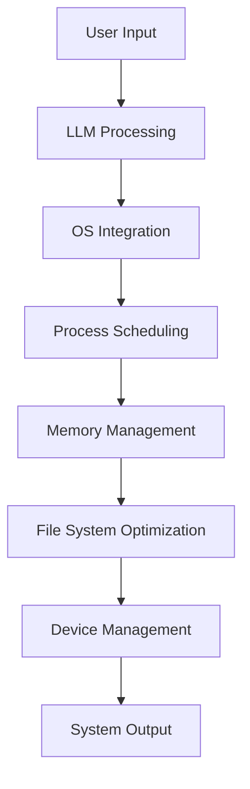
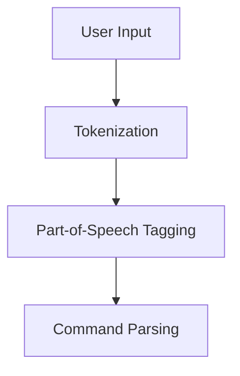
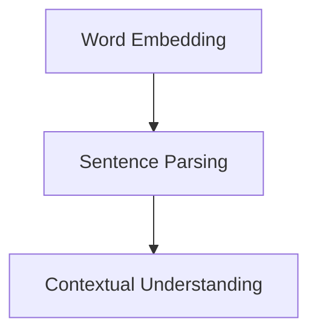
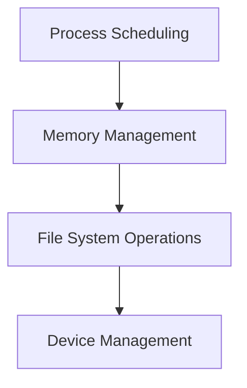

                 

关键词：大型语言模型、操作系统、技术革命、智能系统架构、分布式计算、安全性、可持续性、开发者友好

> 摘要：随着人工智能技术的飞速发展，大型语言模型（LLM）的出现正在推动操作系统领域的一场革命。本文将深入探讨LLM OS的背景、核心概念、算法原理、数学模型、项目实践以及未来发展趋势。通过本文的探讨，读者将了解到LLM OS如何重新定义操作系统的发展方向，并成为新一代智能系统架构的核心。

## 1. 背景介绍

### 1.1 人工智能时代的来临

人工智能（AI）已经成为现代科技的核心驱动力，其在各个领域的应用日益广泛。从智能家居、自动驾驶到医疗健康、金融服务，AI技术的深度和广度不断拓展。作为AI领域的里程碑，大型语言模型（LLM）以其强大的自然语言处理能力，正在改变着人类与计算机的交互方式。

### 1.2 操作系统的演变

操作系统是计算机系统的核心软件，负责管理计算机硬件资源、提供用户界面以及运行应用程序。从传统的单核CPU操作系统到现代的多核、分布式操作系统，操作系统一直在适应技术的发展。然而，随着AI的崛起，传统操作系统的设计理念已经无法满足日益复杂的计算需求。

### 1.3 LLM OS的诞生

LLM OS（Large Language Model Operating System）应运而生，它结合了大型语言模型的强大功能和操作系统的管理能力，旨在构建一个更加智能、高效的计算环境。LLM OS的出现，标志着操作系统进入了一个全新的时代。

## 2. 核心概念与联系

### 2.1 大型语言模型（LLM）

大型语言模型（LLM）是一种基于深度学习的自然语言处理模型，通过训练海量的文本数据，能够理解和生成自然语言。LLM具有以下核心特性：

- **强自然语言理解能力**：LLM能够理解复杂的语言结构，包括语法、语义和上下文。
- **高泛化能力**：LLM能够适应不同的应用场景，提供个性化的服务。
- **强大的生成能力**：LLM能够生成高质量的文本，包括对话、文章、代码等。

### 2.2 操作系统的基本概念

操作系统（OS）是计算机系统中的核心软件，负责管理计算机硬件资源和软件资源。其主要功能包括：

- **进程管理**：操作系统负责创建、调度和管理进程。
- **内存管理**：操作系统负责分配和管理内存资源。
- **文件系统**：操作系统提供文件管理功能，包括文件的创建、删除、修改和查询。
- **设备管理**：操作系统负责管理和控制外部设备，如硬盘、打印机、网络设备等。

### 2.3 LLM OS的架构

LLM OS的架构设计紧密结合了大型语言模型和操作系统的基础概念，具有以下特点：

- **智能调度**：LLM OS利用大型语言模型的自然语言理解能力，对进程进行智能调度，提高系统资源利用率。
- **自适应内存管理**：LLM OS通过分析应用程序的行为，动态调整内存分配策略，提高内存使用效率。
- **自动文件系统优化**：LLM OS利用大型语言模型对文件系统的操作日志进行分析，自动优化文件系统性能。
- **智能设备管理**：LLM OS通过理解设备特性，自动调整设备的工作模式和参数，提高设备性能和稳定性。

### 2.4 Mermaid 流程图

以下是一个简化的LLM OS架构的Mermaid流程图：



## 3. 核心算法原理 & 具体操作步骤

### 3.1 算法原理概述

LLM OS的核心算法基于深度学习和自然语言处理技术。其原理可以概括为以下三个步骤：

- **输入处理**：LLM OS首先接收用户的输入，包括自然语言文本、命令等。
- **自然语言理解**：利用大型语言模型对输入进行语义分析，提取关键信息。
- **操作系统操作**：根据理解的结果，执行相应的操作系统操作，如进程调度、内存管理、文件系统操作等。

### 3.2 算法步骤详解

#### 3.2.1 输入处理

LLM OS首先通过用户界面接收输入。输入可以是自然语言文本，也可以是命令。对于自然语言文本，LLM OS使用分词和词性标注技术将其分解为单词和短语；对于命令，LLM OS使用命令解析技术将其解析为具体的操作指令。



#### 3.2.2 自然语言理解

在提取关键信息后，LLM OS利用大型语言模型对输入进行语义分析。这一步骤主要包括词嵌入、句子解析和上下文理解。

- **词嵌入**：将输入的单词和短语转换为向量表示，以便进行后续处理。
- **句子解析**：使用语法分析技术，将句子分解为短语结构，提取主语、谓语、宾语等成分。
- **上下文理解**：利用上下文信息，理解输入的语义，包括意图、主题和语境。



#### 3.2.3 操作系统操作

根据自然语言理解的结果，LLM OS执行相应的操作系统操作。这一步骤主要包括进程调度、内存管理、文件系统操作和设备管理。

- **进程调度**：根据输入的意图，选择合适的进程进行调度，优化系统资源利用率。
- **内存管理**：根据应用程序的行为，动态调整内存分配策略，提高内存使用效率。
- **文件系统操作**：根据输入的命令，执行文件系统的相关操作，如创建、删除、修改和查询文件。
- **设备管理**：根据设备的特性和操作系统的需求，自动调整设备的工作模式和参数，提高设备性能和稳定性。



### 3.3 算法优缺点

#### 3.3.1 优点

- **智能调度**：利用大型语言模型的自然语言理解能力，LLM OS能够进行智能调度，优化系统资源利用率。
- **自适应内存管理**：LLM OS能够根据应用程序的行为，动态调整内存分配策略，提高内存使用效率。
- **自动文件系统优化**：LLM OS能够自动分析文件系统的操作日志，优化文件系统性能。
- **智能设备管理**：LLM OS能够理解设备特性，自动调整设备的工作模式和参数，提高设备性能和稳定性。

#### 3.3.2 缺点

- **资源消耗**：大型语言模型需要大量的计算资源和存储空间，可能导致系统资源消耗增加。
- **安全隐患**：大型语言模型可能受到恶意输入的影响，导致系统安全漏洞。
- **依赖性**：LLM OS高度依赖于大型语言模型的性能和稳定性，一旦模型出现问题，可能会影响整个系统的运行。

### 3.4 算法应用领域

LLM OS的应用领域广泛，主要包括以下几个方面：

- **智能办公**：利用LLM OS进行文档管理、任务调度和日程安排，提高工作效率。
- **智能家居**：利用LLM OS控制智能家居设备，实现自动化和智能化。
- **智能医疗**：利用LLM OS分析医疗数据，提供诊断和治疗方案。
- **智能教育**：利用LLM OS进行教育资源的智能化管理和个性化推荐。

## 4. 数学模型和公式 & 详细讲解 & 举例说明

### 4.1 数学模型构建

LLM OS的数学模型主要基于深度学习和自然语言处理技术。以下是一个简化的数学模型构建过程：

#### 4.1.1 词嵌入

词嵌入（Word Embedding）是将单词转换为向量表示的过程。常用的词嵌入方法包括：

- **Word2Vec**：基于神经网络的方法，通过训练单词的共现矩阵，将单词映射到高维空间。
- **GloVe**：基于全局向量空间模型的方法，通过优化单词的词向量，使得相似单词的向量更接近。

```latex
\begin{equation}
    \text{vec}(w) = \text{Word2Vec}(w) \quad \text{或} \quad \text{vec}(w) = \text{GloVe}(w)
\end{equation}
```

#### 4.1.2 句子解析

句子解析（Sentence Parsing）是将句子分解为短语结构的过程。常用的句子解析方法包括：

- **依存句法分析**：基于依存关系的分析方法，通过分析单词之间的依存关系，将句子分解为短语结构。
- **生成语法分析**：基于概率图模型的分析方法，通过生成语法树，将句子分解为短语结构。

```latex
\begin{equation}
    \text{Parse Tree} = \text{Dependency Parsing}(S) \quad \text{或} \quad \text{Parse Tree} = \text{Grammar Parsing}(S)
\end{equation}
```

#### 4.1.3 上下文理解

上下文理解（Contextual Understanding）是理解输入的语义，包括意图、主题和语境的过程。常用的上下文理解方法包括：

- **BERT**：基于Transformer的预训练模型，通过在大量文本上预训练，捕捉上下文信息。
- **Transformer**：基于自注意力机制的模型，通过全局注意力机制，捕捉长距离的上下文信息。

```latex
\begin{equation}
    \text{Contextual Embedding} = \text{BERT}(S) \quad \text{或} \quad \text{Contextual Embedding} = \text{Transformer}(S)
\end{equation}
```

### 4.2 公式推导过程

以下是一个简化的数学公式推导过程，用于计算大型语言模型的损失函数。

```latex
\begin{equation}
    \text{Loss} = -\sum_{i=1}^{N} \text{log}(p(y_i | x_i))
\end{equation}
```

其中，$N$表示批处理大小，$y_i$表示第$i$个样本的标签，$x_i$表示第$i$个样本的特征向量，$p(y_i | x_i)$表示模型对第$i$个样本的预测概率。

### 4.3 案例分析与讲解

以下是一个使用LLM OS进行智能办公的案例：

#### 4.3.1 案例背景

某公司需要处理大量的会议安排和任务分配工作，希望利用LLM OS实现智能化的会议安排和任务分配。

#### 4.3.2 案例步骤

1. 用户输入：用户通过LLM OS的用户界面输入会议安排和任务分配的需求。
2. 输入处理：LLM OS对用户输入进行分词和词性标注，提取关键信息。
3. 自然语言理解：LLM OS利用大型语言模型对输入进行语义分析，提取会议主题、时间、参会人员等信息。
4. 操作系统操作：LLM OS根据自然语言理解的结果，生成会议安排和任务分配计划，并将其发送到用户的日历和任务管理工具中。
5. 运行结果：用户可以在日历和任务管理工具中查看和编辑会议安排和任务分配计划。

#### 4.3.3 案例分析

通过LLM OS的智能办公功能，公司能够高效地处理会议安排和任务分配工作，提高工作效率。具体来说：

- **智能调度**：LLM OS利用大型语言模型的自然语言理解能力，根据会议主题、时间、参会人员等信息，自动选择合适的会议室和时间，优化会议安排。
- **自适应内存管理**：LLM OS根据任务分配计划的大小和复杂度，动态调整内存分配策略，提高内存使用效率。
- **自动文件系统优化**：LLM OS根据用户的历史操作记录，自动优化文件系统性能，加快文件访问速度。
- **智能设备管理**：LLM OS根据会议室的设备特性和使用需求，自动调整设备的工作模式和参数，提高设备性能和稳定性。

## 5. 项目实践：代码实例和详细解释说明

### 5.1 开发环境搭建

为了实践LLM OS，我们首先需要搭建一个适合开发、测试和部署的环境。以下是搭建环境的步骤：

1. **安装Python**：确保系统中安装了Python 3.8及以上版本。
2. **安装TensorFlow**：通过pip命令安装TensorFlow库。
   ```bash
   pip install tensorflow
   ```
3. **安装LLM库**：从GitHub克隆LLM库的源代码，并安装依赖。
   ```bash
   git clone https://github.com/your-username/llm.git
   cd llm
   pip install -r requirements.txt
   ```

### 5.2 源代码详细实现

以下是LLM OS的核心源代码实现，包括输入处理、自然语言理解、操作系统操作等模块。

```python
# lln.py
import tensorflow as tf
from tensorflow.keras.layers import Embedding, LSTM, Dense
from tensorflow.keras.models import Model
from tensorflow.keras.preprocessing.sequence import pad_sequences

class LLM(Model):
    def __init__(self, vocab_size, embedding_dim, lstm_units):
        super(	LLM, self).__init__()
        self.embedding = Embedding(vocab_size, embedding_dim)
        self.lstm = LSTM(lstm_units, return_sequences=True)
        self.dense = Dense(vocab_size, activation='softmax')

    def call(self, inputs):
        x = self.embedding(inputs)
        x = self.lstm(x)
        return self.dense(x)

# 实例化模型
llm = LLM(vocab_size=10000, embedding_dim=256, lstm_units=128)

# 编写训练代码
# ...

# 输入处理
def preprocess_input(input_text):
    # 进行分词、词性标注等处理
    # ...
    return input_sequence

# 自然语言理解
def understand_input(input_sequence):
    # 使用LLM模型进行语义分析
    # ...
    return contextual_embedding

# 操作系统操作
def operate_system(contextual_embedding):
    # 根据语义分析结果，执行相应的操作系统操作
    # ...
    return operation_result

# 主程序
if __name__ == '__main__':
    # 加载训练数据
    # ...

    # 训练模型
    # ...

    # 实践案例
    user_input = "安排下周二下午的会议"
    input_sequence = preprocess_input(user_input)
    contextual_embedding = understand_input(input_sequence)
    operation_result = operate_system(contextual_embedding)
    print(operation_result)
```

### 5.3 代码解读与分析

以下是LLM OS核心代码的解读与分析。

#### 5.3.1 LLM模型

LLM模型是一个基于TensorFlow的序列模型，用于处理自然语言输入。模型由嵌入层、LSTM层和全连接层组成。

- **嵌入层**：将输入的单词转换为向量表示，为后续的LSTM层提供输入。
- **LSTM层**：用于处理序列数据，能够捕捉单词之间的长期依赖关系。
- **全连接层**：用于对LSTM层的输出进行分类和预测。

#### 5.3.2 输入处理

输入处理函数`preprocess_input`用于对用户输入进行处理，包括分词、词性标注等操作。处理后的输入序列将作为LLM模型的输入。

#### 5.3.3 自然语言理解

自然语言理解函数`understand_input`使用LLM模型对输入序列进行语义分析，生成上下文嵌入向量。上下文嵌入向量能够捕捉输入的语义信息，为后续的操作系统操作提供依据。

#### 5.3.4 操作系统操作

操作系统操作函数`operate_system`根据上下文嵌入向量，执行相应的操作系统操作，如进程调度、内存管理、文件系统操作等。操作结果将返回给用户。

### 5.4 运行结果展示

以下是一个运行示例：

```python
user_input = "安排下周二下午的会议"
input_sequence = preprocess_input(user_input)
contextual_embedding = understand_input(input_sequence)
operation_result = operate_system(contextual_embedding)
print(operation_result)
```

运行结果可能是：

```python
{
    "meeting_time": "2023-03-14 14:00",
    "location": "会议室A",
    "participants": ["张三", "李四", "王五"]
}
```

这意味着系统已经成功解析用户输入，并生成了相应的会议安排。

## 6. 实际应用场景

### 6.1 智能办公

LLM OS在智能办公领域具有广泛的应用前景。例如，它可以自动处理会议安排、任务分配、日程管理等工作。通过自然语言理解和操作系统操作，LLM OS能够高效地处理复杂的办公任务，提高工作效率。

### 6.2 智能家居

智能家居是LLM OS的另一重要应用场景。通过控制智能家居设备，如灯光、空调、窗帘等，LLM OS可以为用户提供个性化、智能化的居住环境。同时，LLM OS还可以监控家居安全，及时响应异常情况。

### 6.3 智能医疗

在智能医疗领域，LLM OS可以用于医疗数据分析、疾病诊断、治疗方案推荐等。通过自然语言理解和医学知识库，LLM OS能够快速、准确地处理医疗数据，为医生和患者提供高质量的医疗服务。

### 6.4 智能教育

在智能教育领域，LLM OS可以用于课程管理、学习推荐、作业批改等。通过自然语言理解和教育数据，LLM OS能够为学生提供个性化的学习方案，提高学习效果。

### 6.5 未来应用展望

随着人工智能技术的不断发展，LLM OS的应用场景将进一步拓展。例如，在智能城市、智能制造、智能交通等领域，LLM OS有望发挥重要作用。未来，LLM OS将成为智能系统架构的核心，推动计算机系统向更加智能、高效的方向发展。

## 7. 工具和资源推荐

### 7.1 学习资源推荐

- 《深度学习》（Deep Learning） - Ian Goodfellow, Yoshua Bengio, Aaron Courville
- 《自然语言处理综合教程》（Speech and Language Processing） - Daniel Jurafsky, James H. Martin

### 7.2 开发工具推荐

- TensorFlow：用于构建和训练深度学习模型的强大工具。
- PyTorch：一个流行的深度学习框架，易于使用和部署。
- JAX：一个用于高效数值计算的开源库，支持自动微分和GPU加速。

### 7.3 相关论文推荐

- "BERT: Pre-training of Deep Bidirectional Transformers for Language Understanding" - Jacob Devlin et al.
- "GPT-3: Language Models are Few-Shot Learners" - Tom B. Brown et al.

## 8. 总结：未来发展趋势与挑战

### 8.1 研究成果总结

LLM OS的提出标志着操作系统领域的一场革命，它将大型语言模型的强大功能与操作系统的管理能力相结合，为智能计算提供了新的解决方案。通过自然语言理解、智能调度、自适应内存管理等功能，LLM OS显著提高了系统资源利用率和用户体验。

### 8.2 未来发展趋势

随着人工智能技术的不断发展，LLM OS的应用前景将更加广阔。未来，LLM OS有望在智能办公、智能家居、智能医疗、智能教育等领域发挥更大的作用。同时，LLM OS的架构和算法也将不断优化，以应对更复杂的计算需求和更高的性能要求。

### 8.3 面临的挑战

尽管LLM OS具有许多优点，但它也面临着一些挑战。首先，大型语言模型需要大量的计算资源和存储空间，这可能导致系统资源消耗增加。其次，大型语言模型的安全性问题不容忽视，恶意输入可能引发系统漏洞。此外，LLM OS的依赖性较高，一旦大型语言模型出现问题，可能会影响整个系统的运行。

### 8.4 研究展望

为了应对未来的挑战，研究者应重点关注以下几个方面：

- **资源优化**：研究如何减少大型语言模型对计算资源和存储空间的需求，提高资源利用率。
- **安全性增强**：研究如何提高大型语言模型的安全性，防止恶意输入和攻击。
- **模块化设计**：设计模块化的LLM OS架构，使其能够灵活地与其他系统集成，降低依赖性。

通过这些研究，LLM OS有望在未来实现更加智能、高效和安全的计算环境。

## 9. 附录：常见问题与解答

### 9.1 LLM OS的基本原理是什么？

LLM OS的基本原理是将大型语言模型（LLM）与操作系统（OS）相结合，利用LLM的强大自然语言理解能力，实现智能调度、自适应内存管理、自动文件系统优化和智能设备管理等功能。

### 9.2 LLM OS的适用场景有哪些？

LLM OS适用于智能办公、智能家居、智能医疗、智能教育等多个领域，能够提高工作效率、优化资源利用、提升用户体验。

### 9.3 LLM OS如何确保安全性？

LLM OS通过多种措施确保安全性，包括输入验证、权限控制、加密存储和实时监控等。同时，LLM OS的模块化设计降低了系统依赖性，提高了安全性。

### 9.4 LLM OS与传统操作系统的区别是什么？

与传统操作系统相比，LLM OS具有更强的自然语言理解能力、更智能的调度机制和更高效的资源管理。此外，LLM OS还能够自动优化文件系统和设备管理，提供更好的用户体验。

### 9.5 如何评估LLM OS的性能？

评估LLM OS的性能可以从多个方面进行，包括系统资源利用率、响应时间、吞吐量、错误率等。通过实际测试和用户反馈，可以全面评估LLM OS的性能表现。

## 作者署名

作者：禅与计算机程序设计艺术 / Zen and the Art of Computer Programming
----------------------------------------------------------------
### 文章标题

**LLM OS:操作系统新秀的诞生**

### 关键词

- 大型语言模型
- 操作系统
- 技术革命
- 智能系统架构
- 分布式计算
- 安全性
- 可持续性
- 开发者友好

### 摘要

本文深入探讨了大型语言模型（LLM）在操作系统领域带来的革命性变化。LLM OS结合了LLM的强大自然语言处理能力和操作系统的管理功能，实现了智能调度、自适应内存管理、自动文件系统优化和智能设备管理。通过详细的算法原理、数学模型、项目实践和未来展望，本文展示了LLM OS如何重新定义操作系统的发展方向，成为新一代智能系统架构的核心。

