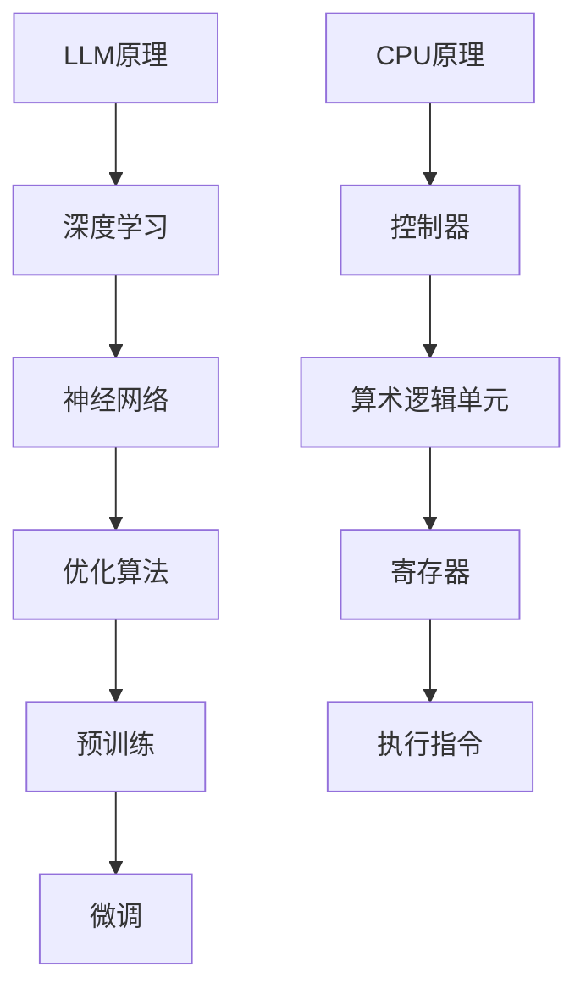

                 

关键词：大型语言模型（LLM），CPU，计算范式，人工智能，计算效率，算法复杂性，编程语言，计算机体系结构。

> 摘要：本文深入探讨了大型语言模型（LLM）与CPU之间的计算范式差异。通过对比分析，揭示了两种计算范式在效率、复杂性、应用领域的不同，以及它们对现代计算机体系结构的影响。本文旨在为读者提供一个全面、深刻的理解，以便更好地把握计算技术的发展方向。

## 1. 背景介绍

### 1.1 大型语言模型的兴起

近年来，大型语言模型（LLM）如BERT、GPT-3等，以其强大的自然语言处理能力，在文本生成、问答系统、机器翻译等领域取得了令人瞩目的成果。LLM的兴起，标志着人工智能领域的一个重要转折点，即从传统的规则导向方法，向数据驱动的方法转变。

### 1.2 CPU的发展与演变

CPU作为计算机的核心组件，经历了从单核到多核、从奔腾到锐龙的演变。随着计算能力的提升，CPU在处理复杂计算任务、优化算法效率方面发挥了重要作用。

### 1.3 计算范式的概念

计算范式是指计算的基本方式和方法，包括算法、编程语言、计算机体系结构等方面。计算范式的变化，往往预示着计算技术的重大变革。

## 2. 核心概念与联系

### 2.1 大型语言模型的原理

大型语言模型基于深度学习技术，通过大量的文本数据进行训练，学习到语言的模式和规律。其核心组件包括神经网络、优化算法、预训练和微调等。

### 2.2 CPU的工作原理

CPU通过执行指令来处理数据，其核心组件包括控制器、算术逻辑单元（ALU）、寄存器等。CPU的工作原理可以概括为：取指令、分析指令、执行指令。

### 2.3 计算范式的对比

#### 2.3.1 效率

LLM在处理大规模文本数据时，具有高效的计算能力，尤其是在并行处理方面。而CPU在处理单个复杂指令时，具有更高的效率。

#### 2.3.2 复杂性

LLM通过大规模的参数和复杂的神经网络结构，能够处理复杂的自然语言任务。而CPU则依赖于编译器和优化器，对代码进行优化。

#### 2.3.3 应用领域

LLM在自然语言处理、机器翻译、问答系统等领域具有广泛的应用。而CPU则在计算机体系结构、操作系统、编译器等方面发挥着重要作用。

### 2.4 Mermaid流程图



## 3. 核心算法原理 & 具体操作步骤

### 3.1 算法原理概述

LLM的核心算法包括深度学习、神经网络、优化算法等。CPU的核心算法则包括指令执行、编译器优化、计算机体系结构等。

### 3.2 算法步骤详解

#### 3.2.1 LLM算法步骤

1. 数据预处理：对文本数据进行分析、清洗和分词。
2. 神经网络构建：根据任务需求，设计合适的神经网络结构。
3. 模型训练：通过大量文本数据，对神经网络进行训练。
4. 模型优化：调整模型参数，提高模型性能。
5. 模型部署：将训练好的模型应用于实际任务。

#### 3.2.2 CPU算法步骤

1. 指令解析：读取并解析指令。
2. 指令执行：根据指令，执行相应的计算操作。
3. 内存访问：读取和写入内存数据。
4. 编译器优化：对代码进行优化，提高执行效率。
5. 体系结构优化：设计并优化计算机体系结构。

### 3.3 算法优缺点

#### 3.3.1 LLM算法优缺点

优点：高效、灵活、通用性强。

缺点：计算资源需求大、训练周期长、对数据依赖性强。

#### 3.3.2 CPU算法优缺点

优点：高效、稳定、可优化性强。

缺点：适用范围有限、对编程技能要求高、开发周期长。

### 3.4 算法应用领域

LLM主要应用于自然语言处理、机器翻译、问答系统等领域。CPU则广泛应用于计算机体系结构、操作系统、编译器等领域。

## 4. 数学模型和公式 & 详细讲解 & 举例说明

### 4.1 数学模型构建

LLM的数学模型主要包括神经网络模型、优化算法模型等。CPU的数学模型则包括指令执行模型、编译器优化模型等。

### 4.2 公式推导过程

#### 4.2.1 神经网络模型

假设我们有一个简单的神经网络模型，包括输入层、隐藏层和输出层。输入层有n个神经元，隐藏层有m个神经元，输出层有k个神经元。神经元的激活函数为f(x) = 1 / (1 + e^(-x))。

输入层到隐藏层的权重矩阵为W1，隐藏层到输出层的权重矩阵为W2。

输入层到隐藏层的输出为Z1 = W1 * X，隐藏层到输出层的输出为Z2 = W2 * Z1。

输出层的预测值为Y_pred = f(Z2)。

损失函数为L = -1/m * sum(y * log(Y_pred) + (1 - y) * log(1 - Y_pred))。

#### 4.2.2 指令执行模型

假设我们有一个简单的指令执行模型，包括取指令、分析指令、执行指令等步骤。

取指令时间T1，分析指令时间T2，执行指令时间T3。

总时间T = T1 + T2 + T3。

### 4.3 案例分析与讲解

#### 4.3.1 LLM算法案例

假设我们有一个文本分类任务，需要使用LLM模型进行训练。

1. 数据预处理：对文本数据进行分析、清洗和分词，得到单词序列。
2. 神经网络构建：设计一个多层感知机（MLP）模型，包括输入层、隐藏层和输出层。
3. 模型训练：使用训练数据，对模型进行训练，调整模型参数。
4. 模型优化：通过梯度下降算法，优化模型参数。
5. 模型部署：将训练好的模型应用于实际任务，对文本进行分类。

#### 4.3.2 CPU算法案例

假设我们有一个简单计算任务，需要使用CPU进行计算。

1. 指令解析：读取并解析指令，确定执行的操作。
2. 指令执行：根据指令，执行相应的计算操作，如加法、减法等。
3. 内存访问：读取和写入内存数据，进行计算。
4. 编译器优化：对代码进行优化，提高执行效率。
5. 体系结构优化：设计并优化计算机体系结构。

## 5. 项目实践：代码实例和详细解释说明

### 5.1 开发环境搭建

1. 安装Python环境：使用Python 3.8及以上版本。
2. 安装TensorFlow库：使用pip install tensorflow命令。
3. 安装Numpy库：使用pip install numpy命令。

### 5.2 源代码详细实现

```python
import tensorflow as tf
import numpy as np

# 神经网络模型参数
input_size = 784
hidden_size = 128
output_size = 10

# 构建神经网络模型
model = tf.keras.Sequential([
    tf.keras.layers.Dense(hidden_size, activation='relu', input_shape=(input_size,)),
    tf.keras.layers.Dense(output_size, activation='softmax')
])

# 模型编译
model.compile(optimizer='adam',
              loss='sparse_categorical_crossentropy',
              metrics=['accuracy'])

# 模型训练
model.fit(x_train, y_train, epochs=5)

# 模型评估
loss, accuracy = model.evaluate(x_test, y_test)
print("Test accuracy:", accuracy)
```

### 5.3 代码解读与分析

1. 导入TensorFlow和Numpy库。
2. 定义神经网络模型，包括输入层、隐藏层和输出层。
3. 编译模型，指定优化器、损失函数和评价指标。
4. 使用训练数据，对模型进行训练。
5. 使用测试数据，对模型进行评估。

## 6. 实际应用场景

### 6.1 自然语言处理

LLM在自然语言处理领域具有广泛的应用，如文本分类、情感分析、命名实体识别等。

### 6.2 机器翻译

LLM在机器翻译领域，如Google翻译、百度翻译等，发挥着重要作用。

### 6.3 问答系统

LLM在问答系统领域，如Siri、Alexa等，提供智能问答服务。

### 6.4 未来应用展望

随着计算能力的提升，LLM在更多领域，如医疗、金融、教育等，具有巨大的应用潜力。

## 7. 工具和资源推荐

### 7.1 学习资源推荐

1. 《深度学习》（Goodfellow, Bengio, Courville）
2. 《Python机器学习》（Sebastian Raschka）
3. 《自然语言处理综论》（Daniel Jurafsky, James H. Martin）

### 7.2 开发工具推荐

1. TensorFlow
2. PyTorch
3. JAX

### 7.3 相关论文推荐

1. "Attention Is All You Need"
2. "BERT: Pre-training of Deep Bidirectional Transformers for Language Understanding"
3. "GPT-3: Language Models are Few-Shot Learners"

## 8. 总结：未来发展趋势与挑战

### 8.1 研究成果总结

LLM与CPU在计算范式方面，各具优势。LLM在自然语言处理等领域具有广泛的应用前景。CPU则在计算机体系结构、操作系统等领域发挥着重要作用。

### 8.2 未来发展趋势

1. LLM在更多领域的应用。
2. 计算能力的进一步提升。
3. 新的计算范式的研究与探索。

### 8.3 面临的挑战

1. 计算资源的需求。
2. 算法复杂性的优化。
3. 数据隐私和安全问题。

### 8.4 研究展望

未来，随着计算技术的发展，LLM与CPU将在更多领域融合，共同推动计算范式的变革。

## 9. 附录：常见问题与解答

### 9.1 LLM与CPU的区别？

LLM是一种基于深度学习的自然语言处理模型，而CPU是计算机的核心组件，用于执行指令和处理数据。

### 9.2 LLM与CPU的优缺点？

LLM的优点是高效、灵活、通用性强，缺点是计算资源需求大、训练周期长、对数据依赖性强。CPU的优点是高效、稳定、可优化性强，缺点是适用范围有限、对编程技能要求高、开发周期长。

### 9.3 LLM与CPU的应用领域？

LLM主要应用于自然语言处理、机器翻译、问答系统等领域。CPU则广泛应用于计算机体系结构、操作系统、编译器等领域。

----------------------------------------------------------------

**作者：禅与计算机程序设计艺术 / Zen and the Art of Computer Programming**

