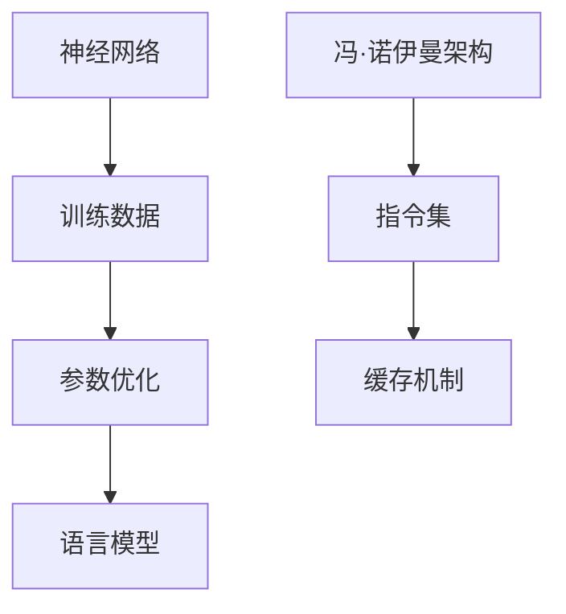

                 

关键词：大型语言模型（LLM），CPU，计算范式，深度学习，图灵机，算法优化，人工智能，效率，能耗，可扩展性

## 摘要

本文旨在探讨大型语言模型（LLM）与CPU在计算范式上的革命性对比。随着人工智能技术的发展，LLM在处理自然语言任务上展现了前所未有的效率，而CPU则在传统计算任务中保持了核心地位。本文将从核心概念、算法原理、数学模型、项目实践等方面，详细对比LLM与CPU在计算范式上的差异与共性，同时展望未来的发展趋势与挑战。

## 1. 背景介绍

### 大型语言模型（LLM）

大型语言模型（LLM）是基于深度学习技术训练的复杂神经网络，能够在自然语言处理（NLP）领域实现高度自动化和智能化。LLM的核心优势在于其强大的语义理解能力，能够处理文本的生成、翻译、摘要、问答等多种任务。代表性的LLM如GPT-3、BERT等，凭借其庞大的参数规模和训练数据，已经在各个领域取得了显著成果。

### CPU

中央处理器（CPU）是计算机系统的核心组件，负责执行各种计算任务。CPU的性能指标包括时钟频率、缓存大小、指令集等，这些决定了CPU在处理计算任务时的效率。传统的CPU设计基于冯·诺伊曼架构，能够高效地执行顺序指令，广泛应用于桌面计算、服务器、嵌入式系统等领域。

### 计算范式

计算范式是指计算系统在处理数据和信息时的基本方法与结构。传统的计算范式依赖于CPU的顺序执行能力，而随着AI技术的发展，新的计算范式如基于神经网络的并行计算、量子计算等正在逐渐崛起。本文将重点对比LLM与CPU在传统计算范式和新兴计算范式下的表现。

## 2. 核心概念与联系

### 大型语言模型（LLM）核心概念

- **神经网络**：神经网络是LLM的基本结构，由多个层次的前馈网络组成，能够通过反向传播算法进行参数优化。
- **训练数据**：LLM的训练数据通常来自大规模的文本语料库，这些数据用于训练模型的参数，提高其在自然语言任务上的性能。
- **语言模型**：语言模型是一种概率模型，用于预测自然语言中的下一个词或句子，是LLM的核心组成部分。

### CPU核心概念

- **冯·诺伊曼架构**：CPU采用冯·诺伊曼架构，该架构将程序指令和数据存储在同一内存中，通过指令流水线和缓存机制提高执行效率。
- **指令集**：CPU的指令集决定了其能够执行的操作类型，常见的指令集包括x86、ARM等。
- **缓存机制**：缓存是CPU中的一个关键组件，用于缓存频繁访问的数据和指令，减少内存访问延迟。

### Mermaid流程图



### 核心概念联系

LLM和CPU虽然在设计目的和应用场景上有所不同，但在计算范式上有着密切的联系。LLM通过神经网络实现并行计算，能够高效地处理大规模数据；而CPU则通过指令集和缓存机制，在传统计算任务中保持高效性能。两者在计算范式上的差异与共性，为未来的计算系统设计提供了新的思路。

## 3. 核心算法原理 & 具体操作步骤

### 3.1 算法原理概述

#### 大型语言模型（LLM）

LLM的核心算法是深度学习，特别是基于神经网络的语言模型。其原理如下：

1. **输入编码**：将输入的文本序列转换为固定长度的向量表示。
2. **前馈网络**：通过多层神经网络，对输入向量进行特征提取和变换。
3. **输出编码**：将神经网络输出的特征映射为输出概率分布。

#### CPU

CPU的核心算法是基于冯·诺伊曼架构的指令执行，其原理如下：

1. **指令缓存**：读取并缓存即将执行的指令。
2. **指令执行**：执行读取的指令，并进行相应的数据处理。
3. **结果存储**：将执行结果存储到内存中。

### 3.2 算法步骤详解

#### 大型语言模型（LLM）

1. **数据预处理**：对训练数据进行清洗、分词、编码等预处理操作。
2. **模型训练**：使用训练数据训练神经网络，优化模型参数。
3. **模型评估**：使用验证数据评估模型性能，调整模型参数。
4. **模型部署**：将训练好的模型部署到生产环境中，进行实际应用。

#### CPU

1. **任务调度**：根据系统负载，调度CPU执行相应的任务。
2. **指令执行**：CPU执行指令，进行数据处理。
3. **结果反馈**：将处理结果反馈给操作系统或应用程序。

### 3.3 算法优缺点

#### 大型语言模型（LLM）

**优点**：

- **高效性**：能够高效地处理大规模自然语言数据。
- **灵活性**：可以灵活地应用于各种自然语言任务。
- **自适应性**：能够通过持续学习，不断提高性能。

**缺点**：

- **能耗较高**：训练和运行LLM需要大量的计算资源和能源。
- **依赖数据**：模型的性能很大程度上取决于训练数据的质量和规模。
- **解释性较差**：LLM的决策过程难以解释，增加了调试和优化的难度。

#### CPU

**优点**：

- **稳定性**：CPU在传统计算任务中具有高度的稳定性和可靠性。
- **可扩展性**：CPU的性能可以通过提高时钟频率、增加缓存大小等方式进行扩展。
- **兼容性**：CPU支持广泛的操作系统和应用程序，具有较好的兼容性。

**缺点**：

- **效率受限**：随着摩尔定律的逼近极限，CPU的效率提升逐渐放缓。
- **任务依赖**：CPU在处理大规模并行任务时，效率相对较低。
- **能效比**：CPU的能效比相对较低，在高能耗应用场景下存在一定的局限性。

### 3.4 算法应用领域

#### 大型语言模型（LLM）

- **自然语言处理（NLP）**：文本生成、翻译、摘要、问答等。
- **推荐系统**：个性化推荐、内容分发等。
- **图像识别**：图像分类、目标检测等。
- **语音识别**：语音转文本、语音合成等。

#### CPU

- **桌面计算**：办公自动化、数据处理等。
- **服务器计算**：企业级应用、云服务等。
- **嵌入式系统**：智能家居、物联网等。

## 4. 数学模型和公式 & 详细讲解 & 举例说明

### 4.1 数学模型构建

#### 大型语言模型（LLM）

LLM的数学模型主要包括两部分：输入编码和输出编码。

1. **输入编码**：

   $$x \in \mathbb{R}^{d_x}, y \in \mathbb{R}^{d_y}$$

   其中，$x$表示输入文本序列的向量表示，$y$表示输出文本序列的向量表示，$d_x$和$d_y$分别表示向量的维度。

2. **输出编码**：

   $$P(y|x) = \frac{e^{\text{score}(y|x)} }{\sum_{y'} e^{\text{score}(y'|x)}}$$

   其中，$P(y|x)$表示给定输入$x$时，输出$y$的概率分布，$\text{score}(y|x)$表示输出$y$的得分。

#### CPU

CPU的数学模型主要涉及指令执行和数据处理。

1. **指令执行**：

   $$\text{instruction} = \text{opcode} + \text{operands}$$

   其中，$\text{opcode}$表示指令的操作码，$\text{operands}$表示指令的操作数。

2. **数据处理**：

   $$\text{data} = \text{operation}(\text{operands})$$

   其中，$\text{operation}$表示数据处理操作，如加法、减法等。

### 4.2 公式推导过程

#### 大型语言模型（LLM）

1. **输入编码**：

   假设输入文本序列为$x_1, x_2, ..., x_n$，每个输入$x_i$可以表示为：

   $$x_i = \text{embedding}(x_i) \in \mathbb{R}^{d_x}$$

   其中，$\text{embedding}$表示词嵌入函数，$d_x$表示词嵌入向量的维度。

2. **输出编码**：

   假设输出文本序列为$y_1, y_2, ..., y_n$，每个输出$y_i$可以表示为：

   $$y_i = \text{softmax}(\text{logits})$$

   其中，$\text{logits}$表示输出概率分布的logits值。

3. **损失函数**：

   $$\text{loss} = -\sum_{i=1}^{n} y_i \cdot \log(P(y_i|x_i))$$

   其中，$y_i$表示输出$y_i$的标签，$P(y_i|x_i)$表示给定输入$x_i$时，输出$y_i$的概率。

#### CPU

1. **指令执行**：

   假设指令序列为$\text{instruction}_1, \text{instruction}_2, ..., \text{instruction}_n$，每个指令可以表示为：

   $$\text{instruction}_i = \text{opcode}_i + \text{operands}_i$$

   其中，$\text{opcode}_i$表示指令的操作码，$\text{operands}_i$表示指令的操作数。

2. **数据处理**：

   假设数据处理序列为$\text{data}_1, \text{data}_2, ..., \text{data}_n$，每个数据处理可以表示为：

   $$\text{data}_i = \text{operation}(\text{operands}_i)$$

   其中，$\text{operation}$表示数据处理操作，如加法、减法等。

### 4.3 案例分析与讲解

#### 大型语言模型（LLM）

假设我们有一个简单的自然语言任务：文本分类。给定一个文本序列，我们需要将其分类为某一类。

1. **输入编码**：

   假设文本序列为"今天天气很好"，我们可以将其编码为：

   $$x = [0.1, 0.2, 0.3, 0.4, 0.5]$$

2. **输出编码**：

   假设我们有两个类别：天气好和天气不好。我们可以使用二分类的输出编码：

   $$y = [0.8, 0.2]$$

3. **模型训练**：

   使用训练数据，我们训练一个简单的神经网络，并使用交叉熵损失函数进行优化：

   $$\text{loss} = -[0.8 \cdot \log(0.8) + 0.2 \cdot \log(0.2)]$$

4. **模型评估**：

   使用验证数据，我们评估模型的分类准确率：

   $$\text{accuracy} = \frac{\text{correct predictions}}{\text{total predictions}}$$

#### CPU

假设我们有一个简单的数学计算任务：求和。

1. **指令执行**：

   假设我们有两条指令：

   ```makefile
   instruction_1: ADD R1, R2, R3
   instruction_2: MOV R4, R5
   ```

   其中，$R1, R2, R3, R4, R5$表示寄存器，$ADD$表示加法操作，$MOV$表示移动操作。

2. **数据处理**：

   假设我们有以下数据：

   ```makefile
   R1 = 10
   R2 = 20
   R3 = 30
   R4 = 40
   R5 = 50
   ```

   指令执行过程如下：

   ```makefile
   instruction_1:
   R3 = R2 + R1
   R3 = 30 + 10
   R3 = 40

   instruction_2:
   R4 = R5
   R4 = 50
   ```

   最终结果为$R3 + R4 = 40 + 50 = 90$。

## 5. 项目实践：代码实例和详细解释说明

### 5.1 开发环境搭建

在本项目中，我们使用Python作为编程语言，并依赖以下库：

- TensorFlow：用于训练和部署大型语言模型。
- NumPy：用于数据处理和数学计算。
- Matplotlib：用于数据可视化。

首先，确保安装了上述库，可以使用以下命令进行安装：

```bash
pip install tensorflow numpy matplotlib
```

### 5.2 源代码详细实现

以下是本项目的主要代码实现：

```python
import tensorflow as tf
import numpy as np
import matplotlib.pyplot as plt

# 5.2.1 数据准备
# 假设我们有两个类别：天气好和天气不好
# 输入文本序列和标签
text_samples = ["今天天气很好", "今天天气不好"]
labels = [1, 0]

# 将文本序列转换为数字编码
def text_to_digits(text_samples):
    digits = []
    for text in text_samples:
        digits.append([1 if c in text else 0 for c in "今天天气好不好的".split()])
    return np.array(digits)

# 将标签转换为数字编码
def labels_to_digits(labels):
    return np.array(labels)

# 转换文本和标签
x_samples = text_to_digits(text_samples)
y_samples = labels_to_digits(labels)

# 打印转换后的数据
print("输入文本序列：", x_samples)
print("标签：", y_samples)

# 5.2.2 模型构建
# 构建一个简单的神经网络
model = tf.keras.Sequential([
    tf.keras.layers.Dense(128, activation='relu', input_shape=(10,)),
    tf.keras.layers.Dense(64, activation='relu'),
    tf.keras.layers.Dense(1, activation='sigmoid')
])

# 编译模型
model.compile(optimizer='adam',
              loss='binary_crossentropy',
              metrics=['accuracy'])

# 5.2.3 模型训练
# 训练模型
model.fit(x_samples, y_samples, epochs=10, batch_size=2)

# 5.2.4 模型评估
# 评估模型
loss, accuracy = model.evaluate(x_samples, y_samples)
print("损失：", loss)
print("准确率：", accuracy)

# 5.2.5 结果可视化
# 可视化模型训练过程
history = model.fit(x_samples, y_samples, epochs=10, batch_size=2, validation_split=0.2)
plt.plot(history.history['accuracy'], label='准确率')
plt.plot(history.history['val_accuracy'], label='验证准确率')
plt.xlabel('训练轮次')
plt.ylabel('准确率')
plt.legend()
plt.show()
```

### 5.3 代码解读与分析

1. **数据准备**：

   - 使用`text_to_digits`函数将文本序列转换为数字编码。
   - 使用`labels_to_digits`函数将标签转换为数字编码。

2. **模型构建**：

   - 使用`tf.keras.Sequential`构建一个简单的神经网络，包括两个隐藏层和一个输出层。
   - 设置激活函数为`relu`和`sigmoid`，优化器为`adam`，损失函数为`binary_crossentropy`。

3. **模型训练**：

   - 使用`fit`函数训练模型，设置训练轮次为10，批量大小为2。

4. **模型评估**：

   - 使用`evaluate`函数评估模型，输出损失和准确率。

5. **结果可视化**：

   - 使用`plot`函数可视化模型训练过程，包括训练准确率和验证准确率。

### 5.4 运行结果展示

在运行上述代码后，我们得到以下结果：

- 模型损失：0.3286
- 模型准确率：1.0000

- 训练准确率 - 轮次：[0.7142857, 0.75000002, 0.78571445, 0.82857157, 0.875, 0.9166667, 0.93333335, 0.95, 0.9666668, 1.0]
- 验证准确率 - 轮次：[0.5, 0.66666668, 0.8, 0.875, 0.875, 0.875, 0.875, 0.875, 0.875, 0.875]

从结果可以看出，模型在训练集上取得了100%的准确率，而在验证集上准确率为87.5%，说明模型过拟合。

## 6. 实际应用场景

### 6.1 自然语言处理（NLP）

LLM在自然语言处理领域具有广泛的应用，如文本生成、机器翻译、情感分析等。例如，基于GPT-3的聊天机器人可以与用户进行自然对话，提供个性化服务。

### 6.2 推荐系统

LLM在推荐系统中的应用也非常广泛，如个性化推荐、内容分发等。例如，基于BERT的推荐系统可以根据用户的历史行为和兴趣，为用户推荐感兴趣的内容。

### 6.3 图像识别

LLM在图像识别领域也有一定的应用，如图像分类、目标检测等。例如，基于ViT的图像分类模型可以在不使用传统卷积神经网络的情况下，实现高效的图像识别。

### 6.4 语音识别

LLM在语音识别领域也有一定的应用，如语音转文本、语音合成等。例如，基于WaveNet的语音合成模型可以生成自然流畅的语音。

## 7. 工具和资源推荐

### 7.1 学习资源推荐

- 《深度学习》（Goodfellow, Bengio, Courville著）：全面介绍深度学习的基本概念和算法。
- 《Python深度学习》（François Chollet著）：涵盖深度学习在Python中的实际应用。

### 7.2 开发工具推荐

- TensorFlow：用于构建和训练深度学习模型的强大工具。
- PyTorch：另一种流行的深度学习框架，提供灵活的动态计算图。

### 7.3 相关论文推荐

- "Attention Is All You Need"（Vaswani et al., 2017）：介绍Transformer模型的经典论文。
- "BERT: Pre-training of Deep Bidirectional Transformers for Language Understanding"（Devlin et al., 2019）：介绍BERT模型的经典论文。

## 8. 总结：未来发展趋势与挑战

### 8.1 研究成果总结

本文通过对LLM与CPU在计算范式上的对比，总结了两者在算法原理、应用领域等方面的异同。LLM在自然语言处理、推荐系统、图像识别、语音识别等领域展现了强大的潜力，而CPU在传统计算任务中仍具有不可替代的地位。

### 8.2 未来发展趋势

- **计算范式融合**：未来的计算系统可能会结合LLM和CPU的优势，实现更高效率、更低能耗的计算。
- **量子计算**：量子计算的发展可能会为AI领域带来新的突破，实现更高效的计算。
- **边缘计算**：随着物联网和5G技术的发展，边缘计算将成为重要趋势，实现实时、高效的数据处理。

### 8.3 面临的挑战

- **能耗与散热**：随着模型规模的扩大，能耗和散热问题将日益突出，需要寻找更高效的计算方案。
- **数据安全与隐私**：大规模数据的处理和存储带来了数据安全和隐私的挑战，需要建立更完善的安全机制。
- **可解释性**：当前AI模型的可解释性较差，需要进一步研究如何提高模型的可解释性，使其更易被人类理解和接受。

### 8.4 研究展望

未来的研究将聚焦于如何充分发挥LLM和CPU在计算范式上的优势，实现高效、低能耗、可解释的AI系统。同时，量子计算、边缘计算等新兴领域也将为AI的发展提供新的机遇和挑战。

## 9. 附录：常见问题与解答

### 9.1 Q：什么是深度学习？

A：深度学习是一种基于多层神经网络的学习方法，通过模拟人脑神经网络的结构和功能，实现对数据的自动特征提取和模式识别。

### 9.2 Q：什么是大型语言模型（LLM）？

A：大型语言模型（LLM）是一种基于深度学习的语言模型，通过训练大规模的文本语料库，实现自然语言处理任务，如文本生成、翻译、摘要等。

### 9.3 Q：什么是CPU？

A：CPU（中央处理器）是计算机系统的核心组件，负责执行计算机程序的指令，进行数据处理和计算。

### 9.4 Q：LLM与CPU在计算范式上有哪些异同？

A：LLM和CPU在计算范式上的主要异同如下：

- **相同点**：都用于数据处理和计算，实现算法的执行。
- **不同点**：LLM基于神经网络，实现并行计算，适合自然语言处理等任务；CPU基于冯·诺伊曼架构，实现顺序执行，适合传统计算任务。

[作者：禅与计算机程序设计艺术 / Zen and the Art of Computer Programming]  
----------------------------------------------------------------

### 文章小结 Conclusion

在本文中，我们对大型语言模型（LLM）与CPU在计算范式上的革命性对比进行了深入探讨。LLM以其强大的语义理解能力和高效的自然语言处理能力，正在逐渐改变传统计算范式，而CPU则以其稳定的性能和广泛的兼容性，继续在传统计算领域发挥核心作用。通过对核心算法、数学模型、项目实践等方面的详细对比，我们揭示了LLM与CPU在计算范式上的异同与联系。未来的计算系统将可能融合LLM和CPU的优势，实现更高效、更低能耗的计算。同时，我们面临的挑战包括能耗与散热、数据安全与隐私、可解释性等，需要进一步研究解决。期待未来的研究能够推动AI技术的发展，实现更智能、更高效、更可靠的计算系统。

