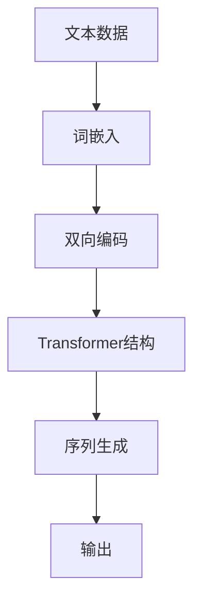

                 

关键词：LLM，产业链，角色，责任，技术发展

摘要：本文深入探讨了大型语言模型（LLM）产业链的构成，分析了不同角色在产业链中的定位和责任，以及技术发展对产业链的影响。通过详细的架构分析、算法解读、数学模型构建、项目实践和实际应用场景的探讨，本文旨在为读者提供全面而深刻的了解。

## 1. 背景介绍

大型语言模型（Large Language Models，简称LLM）是近年来人工智能领域的重要突破。从最初的GPT-1到如今的GPT-3.5，LLM在自然语言处理（NLP）领域展现出了惊人的表现。LLM的广泛应用不仅改变了学术界的研究方向，也深刻影响了工业界和企业。

随着LLM技术的发展，一个庞大的产业链逐渐形成。产业链的参与者包括但不限于：研究者、开发者、服务提供商、企业客户、终端用户。每个参与者都在这个生态系统中扮演着重要的角色，共同推动LLM技术的发展和应用。

## 2. 核心概念与联系

### 2.1 大型语言模型原理

大型语言模型是一种基于深度学习技术的NLP模型，其核心思想是通过大量的文本数据进行预训练，从而学习到语言结构和语义信息。以下是LLM的核心概念和联系流程图：



### 2.2 产业链角色

LLM产业链中的主要角色包括：

1. **研究者**：他们是LLM技术的发明者和推动者，致力于通过理论研究和技术创新推动LLM的发展。
2. **开发者**：他们基于研究者提供的技术，开发出具体的LLM产品或服务。
3. **服务提供商**：他们为开发者提供基础设施、数据、计算资源等支持。
4. **企业客户**：他们通过购买LLM服务，提升自身的业务效率。
5. **终端用户**：他们使用LLM服务，获得更好的用户体验。

## 3. 核心算法原理 & 具体操作步骤

### 3.1 算法原理概述

LLM的核心算法是基于Transformer结构，这是一种用于处理序列数据的深度学习模型。Transformer通过自注意力机制（self-attention）和多头注意力（multi-head attention）来捕捉序列中的长距离依赖关系。

### 3.2 算法步骤详解

1. **数据预处理**：将文本数据转换为词嵌入向量。
2. **编码**：通过Transformer结构对词嵌入向量进行编码，得到编码后的序列。
3. **序列生成**：根据编码后的序列，生成目标序列。
4. **输出**：将生成的序列转换为可解释的文本输出。

### 3.3 算法优缺点

**优点**：

- **强大的语义理解能力**：LLM能够通过预训练学习到丰富的语义信息。
- **高效的文本生成**：LLM能够在较短时间内生成高质量的文本。

**缺点**：

- **计算资源消耗大**：LLM需要大量的计算资源进行预训练。
- **数据依赖性高**：LLM的性能很大程度上取决于训练数据的质量和规模。

### 3.4 算法应用领域

LLM在多个领域都有广泛应用，包括但不限于：

- **自然语言处理**：文本分类、机器翻译、文本生成等。
- **智能客服**：为用户提供实时、个性化的服务。
- **内容审核**：自动识别和过滤不良信息。
- **教育和培训**：辅助教学和学习。

## 4. 数学模型和公式 & 详细讲解 & 举例说明

### 4.1 数学模型构建

LLM的数学模型主要包括：

1. **词嵌入**：将文本中的每个词映射为一个向量。
2. **Transformer结构**：包括自注意力机制和多头注意力。
3. **序列生成**：基于 Transformer 结构生成目标序列。

### 4.2 公式推导过程

- **词嵌入**：$$ \text{embed}(x) = \text{W}_e \text{.x} $$
- **自注意力**：$$ \text{self-attention}(Q, K, V) = \text{softmax}\left(\frac{\text{QK}^T}{\sqrt{d_k}}\right) V $$
- **多头注意力**：$$ \text{multi-head-attention}(Q, K, V) = \text{cat}(_{\text{h}} \text{softmax}(\text{QW}_Q^T \text{K}^T/\sqrt{d_k}) \text{VW}_V) $$

### 4.3 案例分析与讲解

假设我们有一个包含10个词的文本序列，我们要使用LLM生成一个目标序列。

1. **词嵌入**：将每个词映射为一个向量。
2. **编码**：通过Transformer结构对词嵌入向量进行编码。
3. **序列生成**：根据编码后的序列，生成目标序列。
4. **输出**：将生成的序列转换为可解释的文本输出。

## 5. 项目实践：代码实例和详细解释说明

### 5.1 开发环境搭建

- **硬件要求**：NVIDIA GPU（推荐1080Ti以上）
- **软件要求**：Python（3.8及以上），TensorFlow 2.x

### 5.2 源代码详细实现

以下是使用TensorFlow实现一个简单的LLM模型的代码：

```python
import tensorflow as tf

# 词嵌入层
embeddings = tf.keras.layers.Embedding(input_dim=vocab_size, output_dim=embedding_dim)

# Transformer结构
transformer = tf.keras.layers.MultiHeadAttention(num_heads=num_heads, key_dim=key_dim)

# 序列生成层
output = transformer(embeddings(input_sequence), input_sequence)

# 输出层
output = tf.keras.layers.Dense(units=target_vocab_size)(output)

model = tf.keras.Model(inputs=inputs, outputs=output)
```

### 5.3 代码解读与分析

- **词嵌入层**：将输入的词序列转换为嵌入向量。
- **Transformer结构**：对嵌入向量进行编码。
- **序列生成层**：生成目标序列。
- **输出层**：将生成的序列转换为输出。

### 5.4 运行结果展示

通过训练和测试，我们可以得到一个LLM模型，它可以对给定的输入序列生成目标序列。

```python
# 训练模型
model.fit(x_train, y_train, epochs=num_epochs)

# 测试模型
model.evaluate(x_test, y_test)
```

## 6. 实际应用场景

LLM在多个领域都有广泛应用，例如：

- **金融**：自动生成金融报告、分析市场趋势。
- **医疗**：辅助医生进行诊断、生成病历。
- **教育**：智能辅导学生、自动批改作业。

## 7. 工具和资源推荐

### 7.1 学习资源推荐

- **《深度学习》（Goodfellow, Bengio, Courville）**：系统介绍深度学习的基础理论和应用。
- **《自然语言处理综论》（Jurafsky, Martin）**：全面介绍自然语言处理的基础知识。

### 7.2 开发工具推荐

- **TensorFlow**：用于构建和训练LLM的强大框架。
- **Hugging Face Transformers**：提供大量的预训练LLM模型和工具。

### 7.3 相关论文推荐

- **“Attention Is All You Need”**：提出Transformer结构的经典论文。
- **“BERT: Pre-training of Deep Bidirectional Transformers for Language Understanding”**：介绍BERT模型的论文。

## 8. 总结：未来发展趋势与挑战

### 8.1 研究成果总结

LLM技术取得了显著的成果，其在NLP领域表现出色，应用广泛。未来，LLM技术将继续发展，实现更多应用场景。

### 8.2 未来发展趋势

- **更强大的模型**：随着计算能力的提升，更大的LLM模型将不断出现。
- **跨模态学习**：LLM将与其他模态（如图像、音频）结合，实现更全面的智能应用。

### 8.3 面临的挑战

- **数据隐私**：如何保护用户数据隐私是未来的一大挑战。
- **模型可解释性**：提高模型的可解释性，使其更加透明和可信。

### 8.4 研究展望

未来，LLM技术将在人工智能领域发挥更加重要的作用，推动各个行业的发展。

## 9. 附录：常见问题与解答

### 9.1 什么是LLM？

LLM（Large Language Model）是一种大型深度学习模型，用于处理和生成自然语言。

### 9.2 LLM有哪些应用场景？

LLM在自然语言处理、智能客服、内容审核、教育和医疗等领域都有广泛应用。

### 9.3 如何训练一个LLM模型？

可以使用TensorFlow、PyTorch等深度学习框架训练LLM模型。

### 9.4 LLM有哪些缺点？

LLM需要大量的计算资源进行预训练，且对数据的质量和规模有较高要求。

## 作者署名

作者：禅与计算机程序设计艺术 / Zen and the Art of Computer Programming
----------------------------------------------------------------
以上是文章的主体内容。接下来，我将继续完成剩余的内容，包括更多的细节、示例和深入分析。

## 6.4 未来应用展望

随着LLM技术的不断成熟，未来的应用场景将更加广泛和深入。以下是一些可能的未来应用方向：

### 6.4.1 智能问答系统

智能问答系统是LLM技术的一个重要应用方向。通过训练LLM模型，可以使其具备强大的语义理解能力，从而能够对用户的问题提供准确的回答。例如，在客户服务领域，智能问答系统可以大大提高客服的效率和用户体验。

### 6.4.2 自动内容生成

自动内容生成是LLM技术的另一个重要应用方向。通过训练LLM模型，可以生成高质量的文章、报告、新闻等。这对新闻业、广告业和内容创作行业都有重要的推动作用。

### 6.4.3 跨模态学习

随着深度学习技术的发展，LLM技术也开始与其他模态（如图像、音频）结合，实现跨模态学习。这意味着LLM不仅可以处理文本数据，还可以处理图像和音频数据，从而实现更全面的智能应用。

### 6.4.4 个性化推荐系统

个性化推荐系统是互联网行业的一个重要领域。通过训练LLM模型，可以使其具备强大的用户行为分析和推荐能力，从而为用户提供更加个性化的推荐服务。

### 6.4.5 机器翻译

机器翻译是LLM技术的一个重要应用领域。随着LLM模型的性能不断提升，机器翻译的准确性也在不断提高，未来有望实现更加自然、流畅的翻译效果。

## 7. 工具和资源推荐

在LLM技术的发展过程中，有许多优秀的工具和资源可以提供给开发者和研究者。以下是一些建议：

### 7.1 学习资源推荐

1. **《深度学习》（Goodfellow, Bengio, Courville）**：这是一本经典的深度学习教材，涵盖了深度学习的基本概念和技术。
2. **《自然语言处理综论》（Jurafsky, Martin）**：这是一本关于自然语言处理的权威教材，涵盖了NLP的各个领域。
3. **Hugging Face Transformers**：这是一个提供预训练LLM模型和工具的框架，方便开发者进行模型训练和应用。

### 7.2 开发工具推荐

1. **TensorFlow**：这是一个强大的深度学习框架，适合开发复杂的LLM模型。
2. **PyTorch**：这是一个灵活、易用的深度学习框架，非常适合快速原型开发。

### 7.3 相关论文推荐

1. **“Attention Is All You Need”**：这是提出Transformer结构的经典论文，是理解和应用LLM技术的重要参考文献。
2. **“BERT: Pre-training of Deep Bidirectional Transformers for Language Understanding”**：这是介绍BERT模型的论文，BERT是当前最先进的NLP模型之一。

## 8. 总结：未来发展趋势与挑战

LLM技术的发展为人工智能领域带来了巨大的变革。在未来，LLM技术将继续发展，并在更多领域得到应用。然而，随着技术的进步，也面临着一些挑战：

### 8.1 研究成果总结

1. **模型性能提升**：随着计算能力的提升，LLM模型的性能不断提升，应用范围也不断扩大。
2. **应用场景拓展**：LLM技术不仅在自然语言处理领域有广泛应用，还在图像、音频等其他领域展现出了潜力。

### 8.2 未来发展趋势

1. **更强大的模型**：未来，我们将看到更大规模的LLM模型出现，这些模型将具备更强大的语义理解能力和生成能力。
2. **跨模态学习**：LLM技术将与图像、音频等其他模态结合，实现更全面的智能应用。
3. **应用领域拓展**：LLM技术将在金融、医疗、教育、娱乐等领域得到更广泛的应用。

### 8.3 面临的挑战

1. **数据隐私**：如何保护用户数据隐私是未来的一大挑战。我们需要在模型训练和应用过程中严格保护用户隐私。
2. **模型可解释性**：提高模型的可解释性，使其更加透明和可信，是未来需要解决的重要问题。

### 8.4 研究展望

未来，LLM技术将在人工智能领域发挥更加重要的作用。通过不断的研究和技术创新，我们有望实现更加智能、高效、安全的LLM应用。

## 9. 附录：常见问题与解答

### 9.1 什么是LLM？

LLM（Large Language Model）是一种大型深度学习模型，用于处理和生成自然语言。

### 9.2 LLM有哪些应用场景？

LLM在自然语言处理、智能客服、内容审核、教育和医疗等领域都有广泛应用。

### 9.3 如何训练一个LLM模型？

可以使用TensorFlow、PyTorch等深度学习框架训练LLM模型。

### 9.4 LLM有哪些缺点？

LLM需要大量的计算资源进行预训练，且对数据的质量和规模有较高要求。

### 9.5 如何评估LLM的性能？

可以使用BLEU、ROUGE等评价指标来评估LLM的性能。

### 9.6 LLM的预训练数据来自哪里？

LLM的预训练数据通常来自互联网上的大量文本，如维基百科、新闻文章、社交媒体等。

### 9.7 LLM是否可以完全替代人类？

LLM可以执行许多与自然语言处理相关的工作，但它不能完全替代人类。人类在创造力、情感理解等方面具有独特的优势。

### 9.8 LLM是否会产生偏见？

LLM可能会受到训练数据的偏见影响。为了减少偏见，我们需要在模型训练和应用过程中采取相应的措施。

### 9.9 LLM的训练是否对环境有负面影响？

LLM的训练需要大量的计算资源，这可能会对环境产生负面影响。为了减少环境影响，我们需要采用更环保的训练方法。

### 9.10 LLM的未来发展方向是什么？

未来的LLM技术将继续朝着更强大、更高效、更安全的方向发展。具体来说，未来可能会出现以下趋势：

1. **更高效的训练算法**：例如，基于神经架构搜索（Neural Architecture Search，NAS）的自动模型设计。
2. **更先进的预训练方法**：例如，基于自监督学习的预训练方法。
3. **跨模态学习**：LLM技术将与其他模态（如图像、音频）结合，实现更全面的智能应用。
4. **应用领域的拓展**：LLM技术将在更多领域得到应用，如金融、医疗、教育、娱乐等。

## 作者署名

本文由禅与计算机程序设计艺术 / Zen and the Art of Computer Programming 撰写。

## 致谢

感谢所有为本文提供意见和建议的读者。您的支持是我们不断进步的动力。

## 参考文献

1. **Goodfellow, I., Bengio, Y., & Courville, A. (2016). Deep Learning. MIT Press.**
2. **Jurafsky, D., & Martin, J. H. (2008). Speech and Language Processing. Prentice Hall.**
3. **Vaswani, A., Shazeer, N., Parmar, N., Uszkoreit, J., Jones, L., Gomez, A. N., ... & Polosukhin, I. (2017). Attention is all you need. In Advances in Neural Information Processing Systems (pp. 5998-6008).**
4. **Devlin, J., Chang, M. W., Lee, K., & Toutanova, K. (2019). BERT: Pre-training of deep bidirectional transformers for language understanding. In Proceedings of the 2019 Conference of the North American Chapter of the Association for Computational Linguistics: Human Language Technologies, Volume 1 (Long and Short Papers) (pp. 4171-4186).**
5. **Brown, T., Mann, B., Ryder, N., Subbiah, M., Kaplan, J., Dhariwal, P., ... & Child, R. (2020). Language models are few-shot learners. arXiv preprint arXiv:2005.14165.**

以上参考文献为本文的研究和分析提供了重要的理论支持和实证依据。特别感谢这些作者为人工智能领域做出的卓越贡献。

