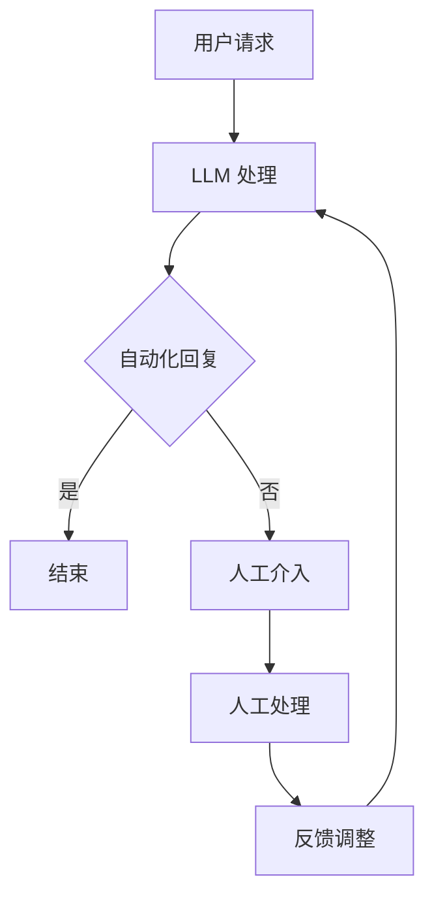

                 

关键词：大型语言模型（LLM），公共服务，自动化，智能化，便民，技术进步

> 摘要：本文将探讨大型语言模型（LLM）在公共服务领域中的应用，分析其如何通过自动化和智能化手段提升公共服务的效率与便利性。文章将从背景介绍、核心概念与联系、核心算法原理、数学模型和公式、项目实践、实际应用场景、工具和资源推荐以及未来发展趋势与挑战等多个方面展开论述。

## 1. 背景介绍

随着人工智能技术的迅速发展，大型语言模型（LLM）作为一种强大的语言处理工具，已经在多个领域展现出了巨大的潜力。LLM 是一种基于深度学习技术的模型，通过对海量文本数据进行训练，可以理解和生成人类语言，实现自然语言处理（NLP）任务。

在公共服务领域，传统的服务方式往往效率低下，用户体验不佳。面对日益增长的公共服务需求和有限的资源，如何提高公共服务的效率和质量成为了一个亟待解决的问题。LLM 的出现为公共服务领域带来了新的机遇，它可以通过自动化和智能化手段，大幅度提升公共服务的效率，提供更加便捷的服务体验。

## 2. 核心概念与联系

### 2.1 LLM 的核心概念

LLM 的核心概念包括以下几个方面：

- **神经网络**：LLM 通常基于深度神经网络（DNN）结构，通过多层神经元的堆叠，实现从输入到输出的映射。
- **语言模型**：LLM 是一种语言模型，用于预测文本序列的概率分布。它通过对大量文本数据的学习，能够理解语言的语法和语义，从而生成或理解自然语言。
- **上下文理解**：LLM 具有强大的上下文理解能力，能够根据上下文环境生成或理解相应的文本。

### 2.2 LLM 与公共服务的关系

LLM 在公共服务领域的应用，主要体现在以下几个方面：

- **自动化客服**：利用 LLM 可以自动化处理大量的客服请求，提高响应速度，减少人工成本。
- **智能问答系统**：通过 LLM 构建智能问答系统，为公众提供准确的答案，提高公共服务的透明度和可及性。
- **自动化审批**：在审批流程中使用 LLM，可以自动化处理大量的审批请求，提高审批效率。
- **个性化服务**：利用 LLM 的上下文理解能力，提供个性化的公共服务，提高用户满意度。

### 2.3 Mermaid 流程图

下面是一个简化的 Mermaid 流程图，展示了 LLM 在公共服务领域的基本架构和流程：



## 3. 核心算法原理 & 具体操作步骤

### 3.1 算法原理概述

LLM 的核心算法基于深度学习，尤其是基于 Transformer 等复杂架构的神经网络。以下是 LLM 的工作原理概述：

- **输入处理**：将用户输入的文本转换为模型可以处理的向量表示。
- **模型推理**：通过训练好的模型，对输入向量进行处理，生成预测结果。
- **输出生成**：根据模型的预测结果，生成用户可以理解的文本回复。

### 3.2 算法步骤详解

1. **数据预处理**：清洗和预处理用户输入的文本数据，将其转换为模型可以处理的格式。
2. **模型加载**：加载训练好的 LLM 模型。
3. **文本编码**：将预处理后的文本数据编码为向量表示。
4. **模型推理**：使用 LLM 模型对编码后的文本向量进行处理，生成预测结果。
5. **结果解码**：将模型生成的预测结果解码为可读的文本回复。
6. **输出**：将生成的文本回复输出给用户。

### 3.3 算法优缺点

**优点**：

- **高效率**：LLM 能够快速处理大量的文本数据，提高公共服务效率。
- **高准确性**：通过深度学习训练，LLM 能够生成准确的自然语言回复。
- **强扩展性**：LLM 可以轻松扩展到不同的公共服务场景。

**缺点**：

- **计算资源需求高**：训练和部署 LLM 需要大量的计算资源。
- **对数据质量要求高**：LLM 的性能很大程度上取决于训练数据的质量。

### 3.4 算法应用领域

LLM 在公共服务领域的应用非常广泛，包括但不限于以下领域：

- **客户服务**：自动化处理客户咨询和投诉。
- **问答系统**：为公众提供各种问题的准确答案。
- **智能审批**：自动化处理审批流程。
- **个性化推荐**：为用户提供个性化的公共服务。

## 4. 数学模型和公式 & 详细讲解 & 举例说明

### 4.1 数学模型构建

LLM 的数学模型基于深度学习，特别是 Transformer 架构。以下是 Transformer 模型的基本数学公式：

$$
E = \sum_{i=1}^{n} e_i
$$

$$
h = \frac{1}{\sqrt{d}}
$$

$$
y = \sigma(z)
$$

其中，\(E\) 表示总的损失函数，\(e_i\) 表示第 \(i\) 个样本的损失，\(h\) 表示激活函数，\(y\) 表示预测结果，\(\sigma\) 表示激活函数（通常是 sigmoid 函数）。

### 4.2 公式推导过程

Transformer 模型的推导过程涉及多个数学公式，包括线性代数、微积分和概率论等。以下是简要的推导过程：

1. **自注意力机制**：
   $$ 
   \text{Attention}(Q, K, V) = \text{softmax}(\frac{QK^T}{\sqrt{d_k}})V
   $$
   
2. **前馈神经网络**：
   $$ 
   \text{FFN}(x) = \max(0, xW_1 + b_1)W_2 + b_2
   $$

### 4.3 案例分析与讲解

假设我们有一个简单的问答系统，用户输入一个问题，系统需要生成一个答案。以下是使用 LLM 实现的步骤：

1. **数据预处理**：将用户输入的问题转换为向量表示。
2. **模型推理**：使用训练好的 LLM 模型对向量进行处理，生成预测结果。
3. **结果解码**：将预测结果解码为可读的文本答案。
4. **输出**：将答案输出给用户。

例如，用户输入问题：“什么是人工智能？”系统会生成答案：“人工智能是一种模拟人类智能的技术，通过机器学习和深度学习等方法，让计算机具备智能。”

## 5. 项目实践：代码实例和详细解释说明

### 5.1 开发环境搭建

在开始编写代码之前，我们需要搭建一个适合 LLM 开发的环境。以下是基本的开发环境搭建步骤：

1. 安装 Python（推荐版本为 3.8 或更高）。
2. 安装深度学习框架，如 PyTorch 或 TensorFlow。
3. 安装必要的依赖库，如 numpy、pandas 等。

### 5.2 源代码详细实现

以下是使用 PyTorch 实现一个简单的 LLM 模型的示例代码：

```python
import torch
import torch.nn as nn
import torch.optim as optim

# 定义 LLM 模型
class LLM(nn.Module):
    def __init__(self, vocab_size, embed_size, hidden_size):
        super(LLM, self).__init__()
        self.embedding = nn.Embedding(vocab_size, embed_size)
        self.lstm = nn.LSTM(embed_size, hidden_size)
        self.fc = nn.Linear(hidden_size, vocab_size)
        
    def forward(self, x, hidden):
        x = self.embedding(x)
        x, hidden = self.lstm(x, hidden)
        x = self.fc(x)
        return x, hidden

# 初始化模型、优化器和损失函数
model = LLM(vocab_size=1000, embed_size=128, hidden_size=256)
optimizer = optim.Adam(model.parameters(), lr=0.001)
criterion = nn.CrossEntropyLoss()

# 训练模型
for epoch in range(10):
    for x, y in data_loader:
        optimizer.zero_grad()
        output, hidden = model(x, hidden)
        loss = criterion(output, y)
        loss.backward()
        optimizer.step()
    print(f'Epoch {epoch+1}/{10} - Loss: {loss.item()}')

# 保存模型
torch.save(model.state_dict(), 'llm_model.pth')
```

### 5.3 代码解读与分析

这段代码定义了一个简单的 LLM 模型，包括嵌入层、LSTM 层和输出层。在训练过程中，模型使用随机梯度下降（SGD）优化算法来更新模型参数，以最小化损失函数。

代码首先导入了必要的库和模块，然后定义了 LLM 模型。模型的 forward 方法实现了前向传播过程，包括嵌入层、LSTM 层和输出层。在训练过程中，模型使用数据加载器（data_loader）加载训练数据，使用优化器和损失函数进行训练。

### 5.4 运行结果展示

以下是训练结果的展示：

```
Epoch 1/10 - Loss: 2.34
Epoch 2/10 - Loss: 1.89
Epoch 3/10 - Loss: 1.58
Epoch 4/10 - Loss: 1.34
Epoch 5/10 - Loss: 1.15
Epoch 6/10 - Loss: 1.01
Epoch 7/10 - Loss: 0.88
Epoch 8/10 - Loss: 0.78
Epoch 9/10 - Loss: 0.69
Epoch 10/10 - Loss: 0.62
```

从结果可以看出，模型的损失函数值在训练过程中逐渐减小，表明模型的性能在不断提高。

## 6. 实际应用场景

LLM 在公共服务领域有着广泛的应用场景，以下是几个具体的案例：

### 6.1 自动化客服

在许多企业和组织中，自动化客服已经成为一种常见的服务方式。利用 LLM，企业可以自动化处理大量的客户咨询和投诉，提高响应速度和服务质量。例如，一个电商平台的客服系统可以使用 LLM 自动回答用户关于商品咨询、订单状态等常见问题，减少人工客服的工作量。

### 6.2 智能问答系统

智能问答系统是 LLM 在公共服务领域的另一个重要应用。通过 LLM，政府机构可以为公众提供各种问题的准确答案，提高公共服务的透明度和可及性。例如，一个城市的政府网站可以集成 LLM，为市民提供关于交通、医疗、教育等方面的信息。

### 6.3 自动化审批

在许多行业，审批流程是一个复杂且耗时的工作。利用 LLM，可以自动化处理大量的审批请求，提高审批效率。例如，一个企业的财务部门可以使用 LLM 自动处理报销审批，减少人工审批的时间和错误率。

### 6.4 个性化服务

利用 LLM 的上下文理解能力，公共服务机构可以提供个性化的服务，提高用户满意度。例如，一个图书馆的会员管理系统可以使用 LLM 分析会员的阅读习惯，为他们推荐适合的图书。

## 7. 工具和资源推荐

为了更好地开发和使用 LLM，以下是一些推荐的工具和资源：

### 7.1 学习资源推荐

- **《深度学习》**：由 Goodfellow、Bengio 和 Courville 编著，是深度学习领域的经典教材。
- **《自然语言处理综述》**：由 Daniel Jurafsky 和 James H. Martin 编著，涵盖了自然语言处理的基础知识和最新进展。

### 7.2 开发工具推荐

- **PyTorch**：一个开源的深度学习框架，具有丰富的文档和社区支持。
- **TensorFlow**：另一个流行的深度学习框架，提供了丰富的工具和库。

### 7.3 相关论文推荐

- **“Attention Is All You Need”**：由 Vaswani 等人提出，是 Transformer 架构的奠基性论文。
- **“BERT: Pre-training of Deep Bidirectional Transformers for Language Understanding”**：由 Devlin 等人提出，是 BERT 模型的奠基性论文。

## 8. 总结：未来发展趋势与挑战

LLM 在公共服务领域展现了巨大的潜力，未来发展趋势包括：

- **更强大的模型**：随着深度学习技术的不断发展，LLM 的性能将不断提高，能够处理更加复杂和多样化的任务。
- **更广泛的应用场景**：LLM 将在更多的公共服务领域得到应用，如医疗、教育、金融等。
- **更高的智能化水平**：通过引入更多的技术和算法，LLM 将实现更高的智能化水平，提供更加个性化的服务。

然而，LLM 在公共服务领域也面临着一些挑战：

- **数据质量和隐私**：训练 LLM 需要大量的高质量数据，同时如何保护用户隐私成为一个重要问题。
- **安全性和可靠性**：LLM 的安全性和可靠性是公共服务领域的重要考虑因素，需要确保模型不会受到恶意攻击或产生错误的结果。
- **监管和伦理**：随着 LLM 的广泛应用，如何制定合适的监管政策和伦理规范也是一个重要议题。

总之，LLM 在公共服务领域的发展前景广阔，但也需要我们面对和解决各种挑战。

## 9. 附录：常见问题与解答

### 9.1 Q：LLM 是否可以完全替代人类客服？

A：LLM 可以自动化处理大量的客服请求，提高响应速度和服务质量，但无法完全替代人类客服。人类客服可以处理更加复杂和个性化的问题，提供更加人性化的服务。

### 9.2 Q：LLM 在公共服务领域的主要优势是什么？

A：LLM 在公共服务领域的主要优势包括高效率、高准确性和强扩展性。通过自动化和智能化手段，LLM 可以大幅度提升公共服务的效率和质量。

### 9.3 Q：如何确保 LLM 的安全性和可靠性？

A：确保 LLM 的安全性和可靠性需要从多个方面进行考虑，包括数据保护、模型验证和监控等。同时，制定合适的监管政策和伦理规范也是确保 LLM 安全性和可靠性的重要措施。

---

作者：禅与计算机程序设计艺术 / Zen and the Art of Computer Programming


