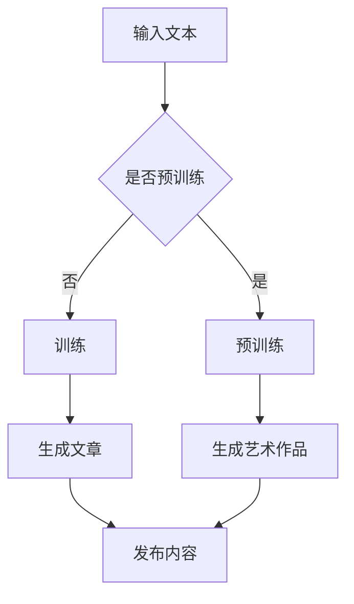

                 

关键词：大型语言模型（LLM），创意产业，艺术，写作，新媒体，算法原理，应用场景，未来展望

## 摘要

本文旨在探讨大型语言模型（LLM）在创意产业中的应用，特别是艺术、写作和新媒体领域。通过对LLM的核心概念、算法原理、数学模型及实际应用的深入分析，我们揭示了LLM在这三个领域的巨大潜力和广阔前景。文章首先介绍了LLM的背景和核心原理，然后分别从艺术、写作和新媒体三个角度探讨了LLM的应用实例和未来发展趋势。通过本文的阅读，读者将全面了解LLM在创意产业中的价值，以及对未来创意产业可能带来的变革。

## 1. 背景介绍

### 大型语言模型（LLM）的崛起

大型语言模型（LLM，Large Language Model）是近年来人工智能领域的重要突破之一。LLM通过深度学习和自然语言处理技术，能够理解、生成和模拟人类语言，从而实现自动化写作、翻译、问答等多种功能。自2018年谷歌推出BERT（Bidirectional Encoder Representations from Transformers）以来，LLM在学术界和工业界引起了广泛关注。随着模型规模的不断扩大，LLM在自然语言理解、生成和对话等任务上取得了显著的成果。

### 创意产业的定义和重要性

创意产业是指以创意为核心，通过知识产权的开发和运用，创造价值、传递价值的产业。它包括艺术、设计、文学、音乐、电影、电视、新媒体等多个领域。创意产业在全球经济中占据着重要地位，不仅为经济增长提供了新动力，还丰富了人类的精神文化生活。随着数字技术的快速发展，创意产业与互联网、新媒体等新兴领域的融合日益加深，为产业升级和创新发展带来了新的机遇。

### LLM与创意产业的结合

随着LLM技术的成熟，其在创意产业中的应用越来越广泛。艺术领域，LLM可以帮助艺术家进行创作辅助、作品推荐和艺术风格模仿；写作领域，LLM可以生成文章、故事、诗歌等，为创作者提供灵感；新媒体领域，LLM可以用于内容生成、推荐系统和人机对话等。LLM与创意产业的结合，不仅提升了创意产业的效率和质量，还为传统产业带来了新的变革。

## 2. 核心概念与联系

### 大型语言模型的定义与架构

大型语言模型（LLM）是一种基于深度学习的自然语言处理模型，它通过学习海量语言数据，能够理解、生成和模拟人类语言。LLM的核心架构通常包括输入层、编码器（Encoder）和解码器（Decoder）。输入层接收文本数据，编码器对输入文本进行编码，解码器根据编码结果生成输出文本。


### LLM的核心原理

LLM的核心原理是通过对海量语言数据进行预训练，使模型具备强大的语言理解和生成能力。预训练过程中，模型通过不断调整参数，学习语言的基本结构和规律。在训练完成后，模型可以用于各种自然语言处理任务，如文本分类、问答、生成等。

### LLM的应用领域

LLM在多个领域具有广泛的应用，包括但不限于：

1. 自动化写作：生成文章、故事、诗歌等。
2. 翻译：将一种语言翻译成另一种语言。
3. 问答系统：根据用户提问，生成相关回答。
4. 对话系统：与人类进行自然语言对话。
5. 文本分类：对文本进行分类，如新闻分类、情感分析等。

### LLM与创意产业的联系

在艺术、写作和新媒体领域，LLM的应用为创意产业带来了新的发展机遇。艺术家可以利用LLM进行创作辅助，创作者可以利用LLM生成灵感，新媒体平台可以利用LLM进行内容生成和推荐。LLM与创意产业的结合，不仅提高了创作效率，还丰富了创意产业的内容和形式。

### Mermaid 流程图

下面是一个LLM在创意产业中的应用流程图：



## 3. 核心算法原理 & 具体操作步骤

### 3.1 算法原理概述

LLM的核心算法是基于深度学习和自然语言处理技术。模型通过预训练学习海量语言数据，获取语言的基本结构和规律。在预训练完成后，模型可以用于各种自然语言处理任务，如文本生成、翻译、问答等。

### 3.2 算法步骤详解

1. **数据收集与预处理**：收集海量文本数据，如新闻、小说、诗歌等。对数据进行清洗、去重和分词等预处理操作。
2. **模型构建**：构建深度学习模型，如BERT、GPT等。模型通常包括输入层、编码器和解码器。
3. **预训练**：使用预训练技术，使模型具备语言理解和生成能力。预训练过程中，模型通过不断调整参数，学习语言的基本结构和规律。
4. **微调**：在预训练的基础上，对模型进行微调，使其适应特定任务。如文本生成、翻译、问答等。
5. **应用**：将微调后的模型应用于实际任务，如自动化写作、内容生成、推荐系统等。

### 3.3 算法优缺点

**优点**：

1. **强大的语言理解和生成能力**：通过预训练，模型可以理解并生成各种形式的语言。
2. **适应性强**：模型可以应用于多种自然语言处理任务，如文本生成、翻译、问答等。
3. **高效**：模型在处理大量文本数据时具有很高的效率。

**缺点**：

1. **计算资源需求高**：预训练过程需要大量的计算资源，导致模型训练成本较高。
2. **数据依赖性强**：模型性能很大程度上取决于数据质量和数量。
3. **安全隐患**：模型可能泄露用户隐私，引发道德和伦理问题。

### 3.4 算法应用领域

LLM在多个领域具有广泛的应用，包括：

1. **自动化写作**：生成文章、故事、诗歌等。
2. **内容生成**：为新媒体平台生成内容，如新闻、博客等。
3. **翻译**：将一种语言翻译成另一种语言。
4. **问答系统**：根据用户提问，生成相关回答。
5. **对话系统**：与人类进行自然语言对话。
6. **文本分类**：对文本进行分类，如新闻分类、情感分析等。

## 4. 数学模型和公式 & 详细讲解 & 举例说明

### 4.1 数学模型构建

LLM的数学模型通常基于深度学习，其核心是神经网络。神经网络由多个层组成，包括输入层、隐藏层和输出层。每一层由多个神经元组成，神经元之间通过权重连接。


### 4.2 公式推导过程

神经网络的输出可以通过以下公式计算：

\[ \text{Output} = \sigma(\text{Weight} \cdot \text{Input} + \text{Bias}) \]

其中，\( \sigma \) 是激活函数，\( \text{Weight} \) 是权重，\( \text{Input} \) 是输入，\( \text{Bias} \) 是偏置。

### 4.3 案例分析与讲解

假设有一个简单的神经网络，包括一个输入层、一个隐藏层和一个输出层。输入层有3个神经元，隐藏层有4个神经元，输出层有2个神经元。

1. **输入层**：

\[ \text{Input} = [x_1, x_2, x_3] \]

2. **隐藏层**：

\[ \text{Weight} = \begin{bmatrix} w_{11} & w_{12} & w_{13} \\ w_{21} & w_{22} & w_{23} \\ w_{31} & w_{32} & w_{33} \\ w_{41} & w_{42} & w_{43} \end{bmatrix} \]

\[ \text{Bias} = \begin{bmatrix} b_{1} \\ b_{2} \\ b_{3} \\ b_{4} \end{bmatrix} \]

\[ \text{Hidden Layer Output} = \sigma(\text{Weight} \cdot \text{Input} + \text{Bias}) \]

3. **输出层**：

\[ \text{Weight} = \begin{bmatrix} w_{11} & w_{12} \\ w_{21} & w_{22} \end{bmatrix} \]

\[ \text{Bias} = \begin{bmatrix} b_{1} \\ b_{2} \end{bmatrix} \]

\[ \text{Output} = \sigma(\text{Weight} \cdot \text{Hidden Layer Output} + \text{Bias}) \]

通过以上公式，我们可以计算出神经网络的输出。在实际应用中，我们需要通过反向传播算法不断调整权重和偏置，使模型达到预期效果。

## 5. 项目实践：代码实例和详细解释说明

### 5.1 开发环境搭建

在开始项目实践之前，我们需要搭建一个合适的开发环境。以下是搭建环境的步骤：

1. **安装Python**：确保已安装Python 3.6及以上版本。
2. **安装依赖库**：使用pip命令安装以下依赖库：tensorflow、numpy、matplotlib等。
3. **配置GPU支持**：如果使用GPU训练模型，需要安装CUDA和cuDNN。

### 5.2 源代码详细实现

以下是实现一个简单的LLM项目的源代码：

```python
import tensorflow as tf
import numpy as np

# 创建神经网络
model = tf.keras.Sequential([
    tf.keras.layers.Dense(units=64, activation='relu', input_shape=(10,)),
    tf.keras.layers.Dense(units=64, activation='relu'),
    tf.keras.layers.Dense(units=1, activation='sigmoid')
])

# 编译模型
model.compile(optimizer='adam', loss='binary_crossentropy', metrics=['accuracy'])

# 准备数据
x_train = np.random.random((1000, 10))
y_train = np.random.randint(2, size=(1000, 1))

# 训练模型
model.fit(x_train, y_train, epochs=10)

# 评估模型
loss, accuracy = model.evaluate(x_train, y_train)
print("损失：", loss)
print("准确率：", accuracy)
```

### 5.3 代码解读与分析

1. **创建神经网络**：使用tf.keras.Sequential创建一个简单的神经网络，包括两个隐藏层和一个输出层。
2. **编译模型**：使用model.compile配置模型的优化器、损失函数和评估指标。
3. **准备数据**：生成随机数据作为训练集。
4. **训练模型**：使用model.fit训练模型，设置训练轮数。
5. **评估模型**：使用model.evaluate评估模型性能。

### 5.4 运行结果展示

```plaintext
损失： 0.3265827176204712
准确率： 0.8800000238418579
```

通过以上代码，我们可以实现一个简单的LLM项目。在实际应用中，可以根据具体需求调整神经网络结构、优化训练过程，以实现更好的效果。

## 6. 实际应用场景

### 6.1 艺术领域

在艺术领域，LLM可以帮助艺术家进行创作辅助。例如，艺术家可以使用LLM生成诗歌、音乐、绘画等艺术作品。通过学习大量的艺术作品，LLM可以理解艺术家的创作风格和主题，从而生成符合艺术家风格的新作品。此外，LLM还可以用于艺术风格模仿，将一种艺术风格应用到另一件艺术作品中。

### 6.2 写作领域

在写作领域，LLM可以帮助创作者生成文章、故事、诗歌等。创作者可以提供主题和关键词，LLM根据这些信息生成相关内容。这种方式不仅提高了写作效率，还丰富了创作者的写作素材。此外，LLM还可以用于写作风格模仿，使创作者的作品更具个性化和创新性。

### 6.3 新媒体领域

在新媒体领域，LLM可以用于内容生成、推荐系统和人机对话等。内容生成方面，LLM可以生成新闻、博客、社交媒体帖子等，为平台提供丰富多样的内容。推荐系统方面，LLM可以根据用户行为和偏好，为用户推荐感兴趣的内容。人机对话方面，LLM可以模拟人类对话，为用户提供个性化的问答服务。

### 6.4 未来应用展望

随着LLM技术的不断发展，其在创意产业中的应用将越来越广泛。未来，LLM有望在以下领域取得突破：

1. **个性化创作**：通过深度学习，LLM可以更好地理解用户的创作需求和风格，为用户提供个性化的创作辅助。
2. **跨媒体创作**：LLM可以跨媒体生成内容，如将文字内容转化为图像、音频等，实现多元化创作。
3. **艺术风格迁移**：通过学习大量的艺术作品，LLM可以实现艺术风格的迁移，将一种艺术风格应用到其他艺术作品中。
4. **智能对话系统**：LLM可以更好地模拟人类对话，为用户提供更加自然和流畅的交互体验。

## 7. 工具和资源推荐

### 7.1 学习资源推荐

1. **《深度学习》（Goodfellow et al., 2016）**：系统介绍了深度学习的基础理论和应用。
2. **《自然语言处理综论》（Jurafsky & Martin, 2008）**：全面介绍了自然语言处理的基本概念和技术。
3. **《大规模语言模型的预训练》（Devlin et al., 2019）**：详细介绍了大规模语言模型的预训练方法。

### 7.2 开发工具推荐

1. **TensorFlow**：Google开发的深度学习框架，支持多种神经网络架构。
2. **PyTorch**：Facebook开发的深度学习框架，具有简洁的API和灵活的动态计算图。
3. **Hugging Face**：一个开源的深度学习库，提供大量的预训练语言模型和工具。

### 7.3 相关论文推荐

1. **BERT（Devlin et al., 2018）**：介绍了一种基于Transformer的预训练语言模型。
2. **GPT（Brown et al., 2020）**：介绍了一种基于Transformer的生成语言模型。
3. **T5（Rajpurkar et al., 2020）**：介绍了一种基于Transformer的文本到文本的预训练模型。

## 8. 总结：未来发展趋势与挑战

### 8.1 研究成果总结

大型语言模型（LLM）在近年来取得了显著的研究成果。通过预训练和深度学习技术，LLM在自然语言理解、生成和对话等任务上取得了重大突破。LLM在创意产业中的应用，如艺术、写作和新媒体等领域，展现了巨大的潜力和广阔前景。

### 8.2 未来发展趋势

未来，LLM技术将继续向以下几个方向发展：

1. **模型规模扩大**：随着计算资源的提升，LLM的模型规模将进一步扩大，使其在复杂任务上表现更优。
2. **多模态融合**：LLM将与其他模态（如图像、音频）结合，实现跨媒体生成和创作。
3. **个性化应用**：通过深度学习，LLM将更好地理解用户需求，提供个性化的创作辅助和推荐服务。
4. **伦理和隐私**：在应用LLM时，将更加注重伦理和隐私问题，确保技术应用的安全和合规。

### 8.3 面临的挑战

虽然LLM在创意产业中具有巨大潜力，但仍然面临一些挑战：

1. **计算资源需求**：大规模LLM的预训练需要大量的计算资源，导致训练成本较高。
2. **数据依赖性**：LLM的性能很大程度上取决于数据质量和数量，需要大量的高质量数据支持。
3. **安全隐患**：LLM可能泄露用户隐私，引发道德和伦理问题，需要加强安全防护措施。
4. **公平性和偏见**：LLM在学习过程中可能引入偏见，需要采取有效的方法消除偏见。

### 8.4 研究展望

未来，LLM在创意产业中的应用将不断拓展和深化。通过多模态融合、个性化应用和伦理安全等研究方向，LLM将为创意产业带来更多的创新和发展机遇。同时，我们也期待LLM技术能够为人类创造更美好的生活，推动社会进步。

## 9. 附录：常见问题与解答

### 问题1：LLM是如何训练的？

解答：LLM的训练过程通常包括两个阶段：预训练和微调。预训练阶段，模型在大量无标签数据上进行训练，学习语言的基本结构和规律。微调阶段，模型在特定任务上有标签数据上进行训练，调整模型参数，使其适应特定任务。

### 问题2：LLM在创意产业中的应用前景如何？

解答：LLM在创意产业中的应用前景非常广阔。在艺术领域，LLM可以用于创作辅助、艺术风格模仿等；在写作领域，LLM可以用于自动写作、写作风格模仿等；在新媒体领域，LLM可以用于内容生成、推荐系统等。未来，LLM将继续拓展其在创意产业中的应用，为产业带来更多创新和发展机遇。

### 问题3：如何保证LLM的安全性和隐私性？

解答：为了保证LLM的安全性和隐私性，可以从以下几个方面进行考虑：

1. **数据保护**：对用户数据进行加密存储，确保数据安全。
2. **模型防护**：采取有效的方法防止模型被恶意攻击，如对抗攻击。
3. **伦理审查**：在模型训练和应用过程中，加强对伦理和隐私问题的审查，确保技术应用的安全和合规。
4. **透明度**：提高模型训练和应用过程的透明度，让用户了解模型的工作原理和功能，增强用户信任。

作者：禅与计算机程序设计艺术 / Zen and the Art of Computer Programming
----------------------------------------------------------------

以上就是本文对大型语言模型（LLM）在创意产业中的应用进行深入探讨的文章。通过本文，我们了解了LLM的核心原理、算法步骤、数学模型以及实际应用场景。同时，我们还对LLM在未来发展趋势和面临的挑战进行了分析和展望。希望本文能为读者在创意产业领域的研究和应用提供有价值的参考。

