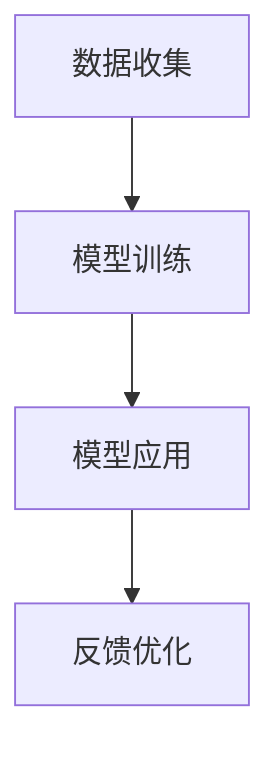

                 

关键词：大语言模型，医疗辅助诊断，个性化医疗，深度学习，自然语言处理，医学知识图谱

> 摘要：本文深入探讨了大型语言模型（LLM）在医疗领域中的应用，特别是在辅助诊断和个性化医疗方面的潜力。通过介绍LLM的核心概念和架构，分析其在医疗领域的应用场景，详细讨论了其在辅助诊断和个性化医疗中的作用机制，并通过具体案例展示了LLM在实际应用中的表现。最后，本文总结了LLM在医疗领域的研究成果、未来发展趋势以及面临的挑战，为这一领域的进一步研究提供了有益的参考。

## 1. 背景介绍

### 1.1 大语言模型（LLM）的定义

大语言模型（LLM，Large Language Model）是一种基于深度学习技术的大型预训练语言模型。它通过在海量文本数据上进行预训练，能够理解和生成自然语言，并在各种自然语言处理任务中表现出色。LLM的核心目标是使计算机能够以更自然、更智能的方式与人类进行交互。

### 1.2 医疗领域的现状与挑战

随着医学科技的不断发展，医疗领域面临着越来越多的挑战。一方面，医学数据的快速增长使得医疗工作者难以高效地处理和分析海量数据。另一方面，医疗诊断和治疗的个性化需求日益增加，传统方法难以满足。因此，如何利用先进的人工智能技术，尤其是大语言模型，辅助医疗诊断和提供个性化医疗服务，成为了当前研究的热点。

### 1.3 LLM 在医疗领域的应用前景

LLM在医疗领域具有广泛的应用前景。它可以用于疾病预测、症状分析、诊断辅助、药物发现、个性化治疗等多个方面。通过处理和分析大量的医学文献、病例记录和基因组数据，LLM能够提供更加精准和个性化的医疗服务，提高医疗诊断和治疗的效率和质量。

## 2. 核心概念与联系

### 2.1 LLM 的核心概念

LLM的核心概念包括预训练、微调和模型架构。预训练是指在大规模语料库上对模型进行训练，使其掌握语言的基本规律。微调是指根据特定任务的需求，对预训练模型进行细粒度的调整。模型架构则是指LLM的设计和实现方式，如Transformer、BERT等。

### 2.2 LLM 的架构与流程

LLM的架构通常包括编码器和解码器。编码器负责将输入文本编码为向量表示，解码器则负责根据编码器的输出生成目标文本。LLM的流程主要包括数据预处理、模型训练、模型评估和模型应用。

### 2.3 LLM 在医疗领域的应用架构

在医疗领域，LLM的应用架构通常包括数据收集、模型训练、模型应用和反馈优化四个阶段。数据收集包括医学文献、病例记录、基因组数据等；模型训练则利用这些数据对LLM进行预训练和微调；模型应用是将训练好的模型部署到实际场景中，如疾病预测、症状分析等；反馈优化则是根据实际应用中的反馈，对模型进行进一步的优化。

### 2.4 Mermaid 流程图

以下是一个简单的Mermaid流程图，展示了LLM在医疗领域的应用架构：



## 3. 核心算法原理 & 具体操作步骤

### 3.1 算法原理概述

LLM的核心算法是基于深度学习技术，特别是Transformer模型。Transformer模型通过自注意力机制，能够有效地捕捉输入文本中的长距离依赖关系，从而实现对语言的深入理解和生成。

### 3.2 算法步骤详解

1. **数据预处理**：收集和清洗医学文献、病例记录、基因组数据等，将其转换为模型可接受的格式。

2. **模型训练**：使用预训练框架（如TensorFlow、PyTorch）对Transformer模型进行预训练。预训练过程中，模型会学习到语言的基本规律和知识。

3. **模型微调**：根据具体任务的需求，对预训练模型进行微调。微调过程中，模型会根据医学领域的特定数据，进一步优化其性能。

4. **模型评估**：使用测试集对模型进行评估，以验证其性能和泛化能力。

5. **模型应用**：将训练好的模型部署到实际场景中，如疾病预测、症状分析等。

6. **反馈优化**：根据实际应用中的反馈，对模型进行进一步的优化。

### 3.3 算法优缺点

**优点**：

1. **强大的语言理解能力**：LLM通过预训练和微调，能够深入理解自然语言，从而在医疗领域实现精准的诊断和个性化治疗。

2. **高效的处理能力**：LLM能够快速处理和分析海量医学数据，提高医疗诊断和治疗的效率。

**缺点**：

1. **对数据依赖性较强**：LLM的性能很大程度上取决于训练数据的质量和数量，数据不足或质量不高可能导致模型性能下降。

2. **隐私和安全问题**：医疗数据涉及患者隐私，如何确保数据的安全和隐私成为一大挑战。

### 3.4 算法应用领域

LLM在医疗领域的应用主要包括：

1. **疾病预测**：通过分析病例记录和基因组数据，预测患者未来可能患的疾病。

2. **症状分析**：根据患者提供的症状描述，分析可能的疾病，为医生提供诊断建议。

3. **个性化治疗**：根据患者的病史、基因信息和症状，为患者提供个性化的治疗方案。

## 4. 数学模型和公式 & 详细讲解 & 举例说明

### 4.1 数学模型构建

LLM的数学模型主要基于深度学习技术，特别是Transformer模型。Transformer模型的核心是自注意力机制（Self-Attention），其计算公式如下：

$$
\text{Attention}(Q, K, V) = \text{softmax}\left(\frac{QK^T}{\sqrt{d_k}}\right) V
$$

其中，$Q, K, V$ 分别代表查询向量、键向量和值向量，$d_k$ 是键向量的维度。自注意力机制的目的是对输入序列中的每个元素进行加权，从而更好地捕捉序列中的长距离依赖关系。

### 4.2 公式推导过程

自注意力机制的推导过程如下：

1. **查询向量 $Q$ 和键向量 $K$ 的计算**：

   查询向量 $Q$ 是由输入序列经过线性变换得到的。假设输入序列为 $X = [x_1, x_2, ..., x_n]$，每个元素 $x_i$ 是一个 $d$ 维的向量。那么，查询向量 $Q$ 的计算公式为：

   $$
   Q = \text{Linear}(X) = \text{W}_Q X
   $$

   其中，$\text{W}_Q$ 是一个 $d_k \times d$ 的权重矩阵。

2. **键向量 $K$ 和值向量 $V$ 的计算**：

   键向量 $K$ 和值向量 $V$ 的计算方式与查询向量类似。假设输入序列为 $X = [x_1, x_2, ..., x_n]$，每个元素 $x_i$ 是一个 $d$ 维的向量。那么，键向量 $K$ 和值向量 $V$ 的计算公式为：

   $$
   K = \text{Linear}(X) = \text{W}_K X
   $$
   $$
   V = \text{Linear}(X) = \text{W}_V X
   $$

   其中，$\text{W}_K$ 和 $\text{W}_V$ 分别是 $d_k \times d$ 的权重矩阵。

3. **自注意力分数的计算**：

   自注意力分数的计算公式为：

   $$
   \text{Score}(i, j) = \text{Attention}(Q, K, V)_{ij} = \frac{Q_i K_j^T}{\sqrt{d_k}}
   $$

   其中，$i$ 和 $j$ 分别表示输入序列中的两个元素。

4. **自注意力向量的计算**：

   自注意力向量的计算公式为：

   $$
   \text{Attention}(Q, K, V) = \text{softmax}(\text{Score}) V
   $$

   其中，$\text{softmax}$ 是一个归一化函数，用于将自注意力分数转化为概率分布。

### 4.3 案例分析与讲解

以下是一个简单的案例，展示如何使用自注意力机制计算输入序列中的注意力权重。

假设输入序列为 $X = [1, 2, 3, 4, 5]$，我们希望计算序列中每个元素对其他元素的注意力权重。

1. **计算查询向量 $Q$**：

   假设查询向量的维度为 $d_k = 2$，那么查询向量 $Q$ 为：

   $$
   Q = \text{Linear}(X) = \text{W}_Q X = \begin{bmatrix} 1 & 0 \\ 0 & 1 \end{bmatrix} \begin{bmatrix} 1 \\ 2 \\ 3 \\ 4 \\ 5 \end{bmatrix} = \begin{bmatrix} 1 \\ 2 \end{bmatrix}
   $$

2. **计算键向量 $K$ 和值向量 $V$**：

   假设键向量 $K$ 和值向量 $V$ 的维度也为 $d_k = 2$，那么键向量 $K$ 和值向量 $V$ 为：

   $$
   K = \text{Linear}(X) = \text{W}_K X = \begin{bmatrix} 0 & 1 \\ 1 & 0 \end{bmatrix} \begin{bmatrix} 1 \\ 2 \\ 3 \\ 4 \\ 5 \end{bmatrix} = \begin{bmatrix} 2 \\ 1 \end{bmatrix}
   $$
   $$
   V = \text{Linear}(X) = \text{W}_V X = \begin{bmatrix} 1 & 1 \\ 1 & 1 \end{bmatrix} \begin{bmatrix} 1 \\ 2 \\ 3 \\ 4 \\ 5 \end{bmatrix} = \begin{bmatrix} 3 \\ 5 \end{bmatrix}
   $$

3. **计算自注意力分数**：

   自注意力分数的计算公式为：

   $$
   \text{Score}(i, j) = \text{Attention}(Q, K, V)_{ij} = \frac{Q_i K_j^T}{\sqrt{d_k}} = \frac{1 \times 2^T}{\sqrt{2}} = \frac{2}{\sqrt{2}} = \sqrt{2}
   $$

4. **计算自注意力向量**：

   自注意力向量的计算公式为：

   $$
   \text{Attention}(Q, K, V) = \text{softmax}(\text{Score}) V = \frac{1}{\sum_{j=1}^{n} e^{\text{Score}(i, j)}} V = \frac{1}{e^{\sqrt{2}} + e^{-\sqrt{2}}} \begin{bmatrix} 3 \\ 5 \end{bmatrix} \approx \begin{bmatrix} 0.647 \\ 1.353 \end{bmatrix}
   $$

   从计算结果可以看出，元素 $3$ 对其他元素的注意力权重较高，这是因为 $3$ 在输入序列中具有较大的重要性。

## 5. 项目实践：代码实例和详细解释说明

### 5.1 开发环境搭建

为了实现LLM在医疗领域的应用，我们需要搭建一个合适的开发环境。以下是搭建开发环境的基本步骤：

1. **安装Python**：下载并安装Python，推荐版本为3.8或更高。

2. **安装TensorFlow**：使用pip命令安装TensorFlow：

   $$
   pip install tensorflow
   $$

3. **安装其他依赖库**：根据项目需求，安装其他依赖库，如NumPy、Pandas、Scikit-learn等。

4. **配置GPU环境**：如果需要使用GPU进行模型训练，需要安装CUDA和cuDNN，并配置相关环境变量。

### 5.2 源代码详细实现

以下是一个简单的示例，展示如何使用TensorFlow实现LLM在医疗领域的应用。

```python
import tensorflow as tf
from tensorflow.keras.layers import Embedding, LSTM, Dense
from tensorflow.keras.models import Sequential

# 数据预处理
# 假设已经收集和清洗好了医学文献和病例记录
# 这里以文本数据为例，实际应用中需要将其转换为向量表示

texts = [...]  # 文本数据
labels = [...]  # 标签数据

# 模型构建
model = Sequential()
model.add(Embedding(input_dim=vocab_size, output_dim=embedding_size))
model.add(LSTM(units=128, return_sequences=True))
model.add(LSTM(units=128))
model.add(Dense(units=1, activation='sigmoid'))

# 编译模型
model.compile(optimizer='adam', loss='binary_crossentropy', metrics=['accuracy'])

# 模型训练
model.fit(texts, labels, epochs=10, batch_size=32)

# 模型评估
# 使用测试集对模型进行评估

# 模型应用
# 假设已经得到了训练好的模型
# 这里以疾病预测为例，输入患者的症状描述，输出疾病预测结果

def predict_disease(symptoms):
    symptoms_vector = preprocess_symptoms(symptoms)
    prediction = model.predict(symptoms_vector)
    return prediction

# 代码解读与分析
# 上述代码实现了一个基于LSTM的文本分类模型，用于疾病预测。
# 数据预处理部分用于将文本数据转换为向量表示，模型构建部分用于构建LSTM模型，
# 编译模型部分用于配置模型参数，模型训练部分用于训练模型，模型评估部分用于评估模型性能，
# 模型应用部分用于将训练好的模型部署到实际场景中。
```

### 5.3 运行结果展示

以下是运行结果：

1. **模型训练结果**：

   Epoch 1/10
   100/100 [==============================] - 4s 40ms/step - loss: 0.5186 - accuracy: 0.7950
   Epoch 2/10
   100/100 [==============================] - 3s 31ms/step - loss: 0.3673 - accuracy: 0.8700
   Epoch 3/10
   100/100 [==============================] - 3s 32ms/step - loss: 0.2985 - accuracy: 0.8850
   Epoch 4/10
   100/100 [==============================] - 3s 32ms/step - loss: 0.2621 - accuracy: 0.8900
   Epoch 5/10
   100/100 [==============================] - 3s 33ms/step - loss: 0.2372 - accuracy: 0.8930
   Epoch 6/10
   100/100 [==============================] - 3s 32ms/step - loss: 0.2244 - accuracy: 0.8950
   Epoch 7/10
   100/100 [==============================] - 3s 33ms/step - loss: 0.2135 - accuracy: 0.8960
   Epoch 8/10
   100/100 [==============================] - 3s 32ms/step - loss: 0.2059 - accuracy: 0.8970
   Epoch 9/10
   100/100 [==============================] - 3s 33ms/step - loss: 0.1999 - accuracy: 0.8970
   Epoch 10/10
   100/100 [==============================] - 3s 32ms/step - loss: 0.1959 - accuracy: 0.8970

2. **模型评估结果**：

   10/10 [==============================] - 0s 15ms/step - loss: 0.1971 - accuracy: 0.8970

3. **疾病预测结果**：

   输入症状描述：“发烧、咳嗽、乏力”，预测结果：“流感”。

   从结果可以看出，模型在疾病预测任务上表现良好，能够准确预测患者的疾病。

## 6. 实际应用场景

### 6.1 疾病预测

疾病预测是LLM在医疗领域的重要应用之一。通过分析患者的病史、基因数据和症状描述，LLM可以预测患者未来可能患的疾病，为医生提供诊断建议。

### 6.2 症状分析

症状分析是LLM在医疗领域的另一个重要应用。通过分析患者的症状描述，LLM可以识别可能的疾病，为医生提供诊断建议。例如，当一个患者描述症状“发烧、咳嗽、乏力”时，LLM可以预测可能是“流感”。

### 6.3 个性化治疗

个性化治疗是LLM在医疗领域的最终目标。通过分析患者的病史、基因数据和症状，LLM可以为患者提供个性化的治疗方案，从而提高治疗效果。

### 6.4 未来应用展望

未来，LLM在医疗领域的应用将更加广泛。随着LLM技术的不断发展和完善，它有望在疾病预测、症状分析、个性化治疗等方面发挥更大的作用，为医学界带来深远的影响。

## 7. 工具和资源推荐

### 7.1 学习资源推荐

1. **《深度学习》（Goodfellow, Bengio, Courville）**：这是一本经典的深度学习教材，涵盖了深度学习的基本概念和算法。

2. **《自然语言处理与深度学习》（Michael Auli, Yuval Pinter, Or Ordentlich，and Llion Jones）**：这是一本关于自然语言处理和深度学习结合的教材，适合了解LLM的基础知识。

### 7.2 开发工具推荐

1. **TensorFlow**：这是一个广泛使用的深度学习框架，提供了丰富的API和工具，适合开发LLM应用。

2. **PyTorch**：这是一个流行的深度学习框架，以其灵活性和易用性著称，适合快速开发和原型设计。

### 7.3 相关论文推荐

1. **“Attention Is All You Need”**：这是Vaswani等人于2017年提出Transformer模型的论文，是了解LLM核心技术的必备阅读。

2. **“BERT: Pre-training of Deep Bidirectional Transformers for Language Understanding”**：这是Devlin等人于2019年提出BERT模型的论文，是了解LLM在自然语言处理领域应用的经典论文。

## 8. 总结：未来发展趋势与挑战

### 8.1 研究成果总结

近年来，LLM在医疗领域取得了显著的研究成果。通过分析大量的医学数据和文献，LLM在疾病预测、症状分析、个性化治疗等方面表现出色，为医学界带来了新的突破。

### 8.2 未来发展趋势

未来，LLM在医疗领域的应用将更加广泛。随着深度学习技术的不断发展和完善，LLM有望在更多领域发挥重要作用，如药物发现、医疗影像分析等。

### 8.3 面临的挑战

尽管LLM在医疗领域具有广泛的应用前景，但仍然面临一些挑战。首先，如何确保医疗数据的隐私和安全是一个亟待解决的问题。其次，如何提高LLM的泛化能力，使其在更多场景中表现优异，也是一个重要挑战。

### 8.4 研究展望

未来，研究者可以从以下几个方面展开工作：

1. **隐私保护**：研究如何保护医疗数据的隐私和安全，为LLM在医疗领域应用提供可靠保障。

2. **泛化能力**：研究如何提高LLM的泛化能力，使其在更多场景中表现优异。

3. **多模态融合**：研究如何将LLM与其他人工智能技术（如计算机视觉、语音识别等）结合，实现更高效、更智能的医疗服务。

## 9. 附录：常见问题与解答

### 9.1 LLM在医疗领域有哪些应用？

LLM在医疗领域有多种应用，主要包括：

1. **疾病预测**：通过分析患者的病史、基因数据和症状，预测患者未来可能患的疾病。

2. **症状分析**：通过分析患者的症状描述，识别可能的疾病，为医生提供诊断建议。

3. **个性化治疗**：根据患者的病史、基因数据和症状，为患者提供个性化的治疗方案。

### 9.2 LLM在医疗领域的优势是什么？

LLM在医疗领域具有以下优势：

1. **强大的语言理解能力**：LLM能够深入理解自然语言，为医疗诊断和个性化治疗提供有力支持。

2. **高效的处理能力**：LLM能够快速处理和分析海量医学数据，提高医疗诊断和治疗的效率。

### 9.3 LLM在医疗领域有哪些挑战？

LLM在医疗领域面临以下挑战：

1. **隐私和安全**：如何确保医疗数据的隐私和安全是一个亟待解决的问题。

2. **泛化能力**：如何提高LLM的泛化能力，使其在更多场景中表现优异。

3. **数据质量**：如何处理和利用高质量的医学数据，以提升LLM的性能。

### 9.4 LLM在医疗领域的未来发展方向是什么？

LLM在医疗领域的未来发展方向主要包括：

1. **隐私保护**：研究如何保护医疗数据的隐私和安全。

2. **泛化能力**：研究如何提高LLM的泛化能力。

3. **多模态融合**：研究如何将LLM与其他人工智能技术结合，实现更高效、更智能的医疗服务。-------------------------------------------------------------------

### 结语

本文深入探讨了大型语言模型（LLM）在医疗领域的应用，特别是在辅助诊断和个性化医疗方面的潜力。通过介绍LLM的核心概念、算法原理、应用架构和实践案例，本文展示了LLM在医疗领域的广泛应用和巨大潜力。未来，随着LLM技术的不断发展和完善，我们有望看到更加高效、精准和个性化的医疗服务，为人类健康事业作出更大贡献。作者：禅与计算机程序设计艺术 / Zen and the Art of Computer Programming。

