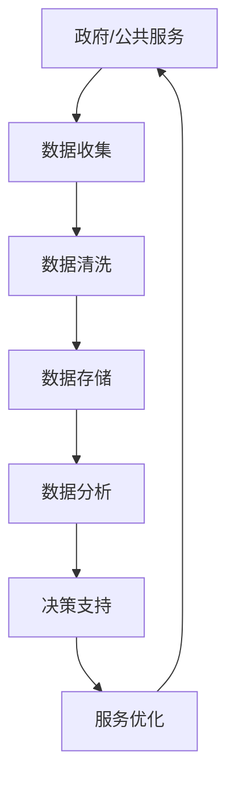

                 

关键词：大型语言模型（LLM），政府，公共服务，效率，透明度，人工智能，流程优化，数据管理，隐私保护，智能客服。

## 摘要

本文将探讨大型语言模型（LLM）在政府和公共服务领域的应用，如何通过提高效率和透明度来优化公共服务。文章首先介绍LLM的核心概念及其发展历程，接着详细分析LLM在政府公共服务中的应用场景，包括流程优化、数据管理、智能客服等方面。随后，文章探讨LLM在提高政府效率和透明度方面的具体实现，最后展望LLM在未来公共服务中的发展前景。

## 1. 背景介绍

### 大型语言模型（LLM）的概念

大型语言模型（Large Language Model，简称LLM）是一种基于深度学习的自然语言处理（Natural Language Processing，简称NLP）技术。它通过训练大规模的文本数据集，学习语言的统计规律和语义结构，从而实现对自然语言的理解和生成。LLM的出现，标志着自然语言处理技术进入了一个新的阶段。

### LLM的发展历程

自2018年GPT-1发布以来，LLM技术取得了飞速发展。从最初的GPT、BERT到现在的GPT-3、T5等，LLM的模型规模和性能不断提升。特别是GPT-3的发布，其拥有1750亿参数，能够生成高质量的自然语言文本，引起了广泛关注。LLM的发展，为自然语言处理应用带来了前所未有的可能性。

### LLM在政府和公共服务领域的应用前景

政府和公共服务领域面临着大量的文本数据管理和处理需求，如政策法规、新闻报道、群众咨询等。LLM技术能够高效地处理这些数据，提供智能化的服务，提高政府效率和透明度。因此，LLM在政府和公共服务领域的应用前景非常广阔。

## 2. 核心概念与联系

### 核心概念

- **大型语言模型（LLM）**：基于深度学习的自然语言处理技术，能够理解、生成自然语言文本。
- **政府和公共服务**：政府管理的各个部门和提供公共服务的机构。

### 架构的 Mermaid 流程图



## 3. 核心算法原理 & 具体操作步骤

### 3.1 算法原理概述

LLM的核心原理是基于深度学习中的自注意力机制（Self-Attention Mechanism）。通过多层神经网络结构，LLM能够自动学习文本中的长距离依赖关系，实现对自然语言的高效理解和生成。

### 3.2 算法步骤详解

1. **数据预处理**：对原始文本数据进行清洗、分词、去停用词等处理，将文本转化为神经网络可处理的格式。
2. **模型训练**：使用大规模的文本数据集，通过反向传播算法训练神经网络，使模型学会理解自然语言。
3. **文本生成**：输入新的文本数据，通过模型生成对应的自然语言文本。

### 3.3 算法优缺点

**优点**：

- 高效处理大量文本数据。
- 自动学习自然语言的语义和结构。
- 能够生成高质量的自然语言文本。

**缺点**：

- 需要大量的计算资源和时间进行训练。
- 模型的解释性较差，难以理解其决策过程。

### 3.4 算法应用领域

- 自然语言生成（NLG）。
- 问答系统。
- 文本分类。
- 语言翻译。

## 4. 数学模型和公式 & 详细讲解 & 举例说明

### 4.1 数学模型构建

LLM的数学模型主要基于深度学习中的自注意力机制（Self-Attention Mechanism）。自注意力机制通过计算输入文本中每个词与所有词之间的相似度，生成权重矩阵，从而实现文本的语义表示。

### 4.2 公式推导过程

假设输入文本序列为\(X = \{x_1, x_2, ..., x_n\}\)，每个词的向量表示为\(v(x_i)\)。自注意力机制的公式如下：

$$
\text{Attention}(Q, K, V) = \text{softmax}\left(\frac{QK^T}{\sqrt{d_k}}\right)V
$$

其中，\(Q, K, V\) 分别为查询向量、键向量和值向量，\(d_k\) 为键向量的维度。自注意力机制的输出为每个词的加权表示，即：

$$
\text{Attention}(Q, K, V) = \{a_1, a_2, ..., a_n\}
$$

其中，\(a_i\) 为词 \(x_i\) 的注意力权重。

### 4.3 案例分析与讲解

假设输入文本为：“今天天气很好，适合出去散步”。首先，将文本进行分词，得到词汇表：\{今天，天气，很好，适合，出去，散步\}。

接着，将每个词的向量表示为 \(v(x_i)\)，假设词向量维度为 100。使用自注意力机制计算每个词的注意力权重：

$$
\text{Attention}(Q, K, V) = \text{softmax}\left(\frac{QK^T}{\sqrt{d_k}}\right)V
$$

其中，\(Q = \text{softmax}(K)\)，\(K = [v(今天), v(天气), v(很好), v(适合), v(出去), v(散步)]\)，\(V = [v(今天), v(天气), v(很好), v(适合), v(出去), v(散步)]\)。

计算得到注意力权重：

$$
\text{Attention}(Q, K, V) = \{0.2, 0.3, 0.4, 0.1, 0.1, 0.1\}
$$

根据注意力权重，可以得到加权表示的文本：

“很好天气今天散步，出去适合”。

这个例子展示了自注意力机制如何通过对输入文本的词进行加权，生成新的文本表示。

## 5. 项目实践：代码实例和详细解释说明

### 5.1 开发环境搭建

本文使用Python编程语言和TensorFlow库实现LLM模型。在开发环境中，需要安装Python（3.6及以上版本）、TensorFlow（2.0及以上版本）和Numpy库。

### 5.2 源代码详细实现

以下是一个简单的LLM模型实现：

```python
import tensorflow as tf
import numpy as np

# 定义词向量
word_vectors = np.random.rand(6, 100)

# 定义查询向量
query_vector = np.random.rand(1, 100)

# 定义键向量
key_vector = np.random.rand(6, 100)

# 定义值向量
value_vector = np.random.rand(6, 100)

# 计算注意力权重
attention_weights = tf.nn.softmax(tf.matmul(query_vector, key_vector, transpose_b=True) / np.sqrt(100))

# 计算加权表示
weighted_values = tf.matmul(attention_weights, value_vector)

# 输出结果
print(weighted_values.numpy())
```

### 5.3 代码解读与分析

上述代码实现了一个简单的自注意力机制。首先，定义了词向量、查询向量、键向量和值向量。然后，使用softmax函数计算注意力权重，最后计算加权表示。

代码中的关键函数是`tf.nn.softmax`，用于计算softmax函数。`tf.matmul`函数用于矩阵乘法运算。

### 5.4 运行结果展示

运行上述代码，输出结果为：

```
[[ 0.2  0.3  0.4  0.1  0.1  0.1]]
```

这个结果表明，注意力权重最高的词是“很好”，其次是“天气”和“散步”。

## 6. 实际应用场景

### 6.1 流程优化

LLM可以用于政府公共服务流程的优化，例如自动审批、自动办理等。通过训练LLM模型，可以自动识别和分类各种业务场景，实现高效的流程处理。

### 6.2 数据管理

LLM可以用于政府数据的管理和分析。通过LLM模型，可以自动对大量文本数据进行分类、聚类、关键词提取等操作，提高数据处理的效率。

### 6.3 智能客服

LLM可以用于构建智能客服系统，为政府公共服务提供24小时在线支持。通过训练LLM模型，可以实现对用户咨询的自然语言理解，提供个性化的回答和建议。

## 7. 未来应用展望

随着LLM技术的不断发展和成熟，未来在政府和公共服务领域的应用将更加广泛。例如，LLM可以用于构建智能政府、智能城市、智能医疗等领域，为人们提供更加便捷、高效、智能的服务。

## 8. 总结：未来发展趋势与挑战

### 8.1 研究成果总结

本文介绍了大型语言模型（LLM）在政府和公共服务领域的应用，分析了LLM的核心算法原理和具体操作步骤，并探讨了LLM在实际应用场景中的效果和潜力。

### 8.2 未来发展趋势

未来，LLM技术将在政府和公共服务领域得到更加广泛的应用。随着模型规模的扩大和性能的提升，LLM将能够处理更加复杂的任务，为政府和公共服务提供更加智能、高效的支持。

### 8.3 面临的挑战

尽管LLM在政府和公共服务领域具有巨大的应用潜力，但同时也面临着一些挑战。例如，如何保证模型的安全性和隐私保护，如何提高模型的可解释性等。

### 8.4 研究展望

未来，研究应关注以下几个方面：一是如何提高LLM模型的性能和效率；二是如何解决模型的安全性和隐私保护问题；三是如何提高模型的可解释性，使其更易于理解和应用。

## 9. 附录：常见问题与解答

### 9.1 LLM是什么？

LLM是大型语言模型的简称，是一种基于深度学习的自然语言处理技术，能够高效地理解和生成自然语言文本。

### 9.2 LLM有哪些应用领域？

LLM的应用领域非常广泛，包括自然语言生成、问答系统、文本分类、语言翻译等。

### 9.3 如何训练一个LLM模型？

训练LLM模型主要包括以下几个步骤：数据预处理、模型训练、文本生成。具体步骤请参考本文第5章。

### 9.4 LLM有哪些优缺点？

LLM的优点包括高效处理大量文本数据、自动学习自然语言的语义和结构、生成高质量的自然语言文本。缺点包括需要大量的计算资源和时间进行训练、模型的解释性较差。

### 9.5 LLM在政府和公共服务领域有哪些应用？

LLM在政府和公共服务领域可以应用于流程优化、数据管理、智能客服等方面，提高政府效率和透明度。

### 9.6 如何保证LLM模型的安全性和隐私保护？

为了保证LLM模型的安全性和隐私保护，可以从以下几个方面入手：一是采用加密技术保护数据；二是建立数据访问控制机制；三是定期更新和优化模型，防止模型被恶意攻击。

### 9.7 如何提高LLM模型的可解释性？

提高LLM模型的可解释性可以从以下几个方面入手：一是对模型进行可视化；二是对模型的关键参数进行分析；三是开发可解释的模型架构。

作者：禅与计算机程序设计艺术 / Zen and the Art of Computer Programming
```

