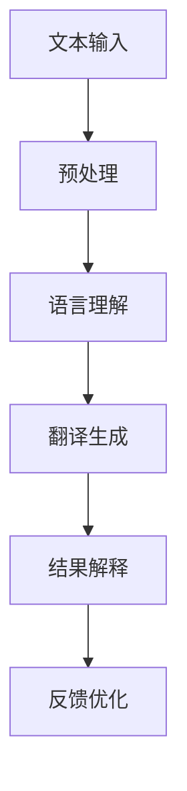

                 

关键词：大型语言模型（LLM），翻译，自然语言处理，解释性技术，跨语言交流，语言障碍突破

> 摘要：本文深入探讨了大型语言模型（LLM）在翻译和解释性技术中的应用，分析了LLM如何突破语言障碍，为跨语言交流提供了一种创新的解决方案。通过梳理LLM的核心概念、算法原理、数学模型以及实际应用案例，本文旨在为读者提供一个全面的技术视角，以了解和掌握这一前沿技术。

## 1. 背景介绍

在全球化进程加速的今天，跨语言交流变得越来越重要。无论是国际贸易、学术交流，还是国际旅游、文化交流，语言障碍成为了阻碍人们沟通和合作的主要因素。传统的翻译方法，如基于规则的翻译系统和基于统计的机器翻译系统，尽管在一定程度上缓解了语言障碍，但仍然存在诸多局限。这些局限包括翻译准确率不高、对复杂句子结构处理不足、对文化背景理解有限等。

近年来，随着深度学习技术的发展，大型语言模型（LLM）在自然语言处理（NLP）领域取得了显著进展。LLM是一种基于深度神经网络的语言模型，通过学习大量文本数据，能够生成符合语言规则的自然语言文本。LLM在翻译和解释性技术中展示出了巨大的潜力，有望成为解决语言障碍的一种有效工具。

## 2. 核心概念与联系

### 2.1 LLM概述

LLM（Large Language Model）是一种基于深度学习的语言模型，其核心思想是通过大量的文本数据训练一个大规模的神经网络，使其能够理解和生成自然语言。LLM的训练过程通常涉及以下几个步骤：

1. **数据预处理**：包括文本清洗、分词、词向量化等，将原始文本转化为神经网络能够处理的形式。
2. **模型训练**：使用预先设定的神经网络架构，如Transformer，对词向量进行训练，以学习语言的内部结构和语义信息。
3. **模型优化**：通过反向传播算法和梯度下降优化模型参数，使模型在特定任务上达到最优性能。

### 2.2 翻译技术

翻译技术是指将一种自然语言文本转换为另一种自然语言文本的技术。LLM在翻译中的应用，主要依赖于其强大的语言理解和生成能力。具体而言，LLM可以通过以下步骤实现翻译：

1. **文本输入**：将源语言的文本输入到LLM中。
2. **语言理解**：LLM对输入文本进行语义理解，提取关键信息和结构。
3. **翻译生成**：基于理解的结果，LLM生成目标语言的文本。

### 2.3 解释性技术

解释性技术旨在提高机器翻译的可解释性和可靠性。LLM通过其内部的神经网络结构和学习过程，能够提供一定的解释性。例如，LLM可以解释为什么选择某个词作为翻译结果，或者为什么某个句子结构是合理的。这种解释能力对于提高翻译质量和用户信任至关重要。

### 2.4 Mermaid 流程图

以下是LLM在翻译和解释性技术中应用的核心流程的Mermaid流程图：



## 3. 核心算法原理 & 具体操作步骤

### 3.1 算法原理概述

LLM在翻译和解释性技术中的应用，主要依赖于其深度神经网络结构和对大规模数据的训练。以下是LLM的核心算法原理：

1. **神经网络结构**：LLM通常采用Transformer架构，这是一种基于自注意力机制的深度神经网络。Transformer通过多头注意力机制和前馈神经网络，能够捕捉输入文本中的长距离依赖关系，从而提高翻译和解释的准确性。

2. **数据训练**：LLM的训练过程涉及大量的文本数据。这些数据包括各种类型的文本，如新闻文章、书籍、网页内容等。通过这些数据，LLM能够学习到丰富的语言知识和语义信息。

3. **训练目标**：在翻译任务中，LLM的训练目标是使模型能够将源语言的文本转换为正确的目标语言文本。在解释性任务中，LLM的目标是提供对翻译结果的合理解释。

### 3.2 算法步骤详解

1. **文本预处理**：首先，对源语言和目标语言的文本进行预处理，包括分词、词向量化等操作。这一步的目的是将文本转化为神经网络能够处理的形式。

2. **模型初始化**：初始化神经网络模型，通常采用预训练的模型，如BERT、GPT等。这些预训练模型已经在大规模数据集上进行了训练，具有良好的语言理解能力。

3. **模型训练**：使用训练数据和目标函数，对神经网络模型进行训练。训练过程中，通过反向传播算法和梯度下降优化模型参数，使模型在特定任务上达到最优性能。

4. **翻译生成**：在翻译任务中，将预处理后的源语言文本输入到训练好的LLM中，得到目标语言文本的生成结果。具体而言，LLM通过自注意力机制和前馈神经网络，对输入文本进行编码和解码，生成符合目标语言规则和语义的文本。

5. **结果解释**：在解释性任务中，LLM提供对翻译结果的合理解释。例如，LLM可以解释为什么选择某个词作为翻译结果，或者为什么某个句子结构是合理的。

### 3.3 算法优缺点

**优点：**
1. **高准确率**：LLM通过大规模数据训练，能够捕捉到丰富的语言知识和语义信息，从而提高翻译和解释的准确率。
2. **强适应性**：LLM能够适应不同领域的翻译和解释任务，具有广泛的适用性。
3. **可解释性**：LLM提供了一定的解释能力，有助于提高用户对翻译结果的信任。

**缺点：**
1. **计算资源消耗**：LLM的训练和运行需要大量的计算资源，对硬件设备有较高要求。
2. **数据依赖**：LLM的性能依赖于训练数据的质量和规模，数据质量和规模不足可能导致翻译和解释结果不佳。

### 3.4 算法应用领域

LLM在翻译和解释性技术中的应用非常广泛，包括但不限于以下领域：

1. **跨语言交流**：LLM能够突破语言障碍，实现不同语言之间的准确翻译，促进跨语言交流。
2. **多语言文档处理**：LLM可以用于多语言文档的自动翻译和编辑，提高文档处理的效率和准确性。
3. **语言教育**：LLM可以用于语言学习辅助，提供个性化的翻译和解释服务，帮助学习者提高语言能力。
4. **人工智能客服**：LLM可以用于智能客服系统，实现跨语言的客户服务，提高用户体验。

## 4. 数学模型和公式 & 详细讲解 & 举例说明

### 4.1 数学模型构建

LLM的数学模型主要基于深度学习中的神经网络架构，特别是Transformer模型。以下是Transformer模型的基本数学模型：

1. **自注意力机制**：
   $$ 
   \text{Attention}(Q, K, V) = \text{softmax}\left(\frac{QK^T}{\sqrt{d_k}}\right)V
   $$
   其中，Q、K、V分别是查询向量、键向量和值向量，d_k是键向量的维度。自注意力机制通过计算Q和K之间的点积，生成注意力权重，然后对V进行加权求和，从而实现对输入序列的加权表示。

2. **前馈神经网络**：
   $$
   \text{FFN}(x) = \max(0, xW_1 + b_1)W_2 + b_2
   $$
   其中，W_1、W_2分别是前馈神经网络的权重矩阵，b_1、b_2分别是偏置项。前馈神经网络通过两个线性变换，增加模型的表达能力。

3. **Transformer模型**：
   $$
   \text{Transformer}(x) = \text{LayerNorm}(x + \text{MultiHeadAttention}(x, x, x)) + \text{LayerNorm}(x + \text{FFN}(\text{MultiHeadAttention}(x, x, x)))
   $$
   其中，LayerNorm是对输入进行层归一化，MultiHeadAttention是多头注意力机制，FFN是前馈神经网络。Transformer模型通过自注意力机制和前馈神经网络，实现对输入序列的编码和解码。

### 4.2 公式推导过程

以下是对Transformer模型中自注意力机制和前馈神经网络的推导过程：

1. **自注意力机制推导**：
   自注意力机制的核心在于计算输入序列中各个元素之间的相似性，并通过加权求和生成新的序列表示。具体推导过程如下：

   设输入序列为$x = [x_1, x_2, ..., x_n]$，其中每个元素$x_i$都可以表示为一个向量。首先，对输入序列进行线性变换，得到查询向量$Q = [Q_1, Q_2, ..., Q_n]$、键向量$K = [K_1, K_2, ..., K_n]$和值向量$V = [V_1, V_2, ..., V_n]$。

   $$ 
   \text{Attention}(Q, K, V) = \text{softmax}\left(\frac{QK^T}{\sqrt{d_k}}\right)V
   $$

   其中，$QK^T$表示输入序列中各个元素之间的相似性，$\sqrt{d_k}$是对相似性进行缩放，以避免梯度消失问题。通过softmax函数，将相似性转化为概率分布，然后对值向量进行加权求和，生成新的序列表示。

2. **前馈神经网络推导**：
   前馈神经网络是一种简单的多层感知机（MLP），通过两个线性变换增加模型的表达能力。具体推导过程如下：

   设输入序列为$x = [x_1, x_2, ..., x_n]$，首先对输入进行线性变换，得到中间层表示$H = [H_1, H_2, ..., H_n]$。

   $$
   \text{FFN}(x) = \max(0, xW_1 + b_1)W_2 + b_2
   $$

   其中，$W_1$和$W_2$分别是线性变换的权重矩阵，$b_1$和$b_2$分别是偏置项。通过ReLU激活函数，增加模型的表达能力。

### 4.3 案例分析与讲解

以下是一个简单的案例，说明如何使用Transformer模型进行翻译。

**案例背景**：假设我们要翻译一句话“我喜欢编程。”从中文到英文。

**步骤1：文本预处理**：
1. 对中文文本进行分词，得到“我”、“喜欢”、“编程”。
2. 对英文文本进行分词，得到“I”、“like”、“programming”。

**步骤2：词向量化**：
1. 使用预训练的词向量模型，如GloVe或Word2Vec，将中文词汇映射为向量。
2. 使用预训练的词向量模型，如GloVe或Word2Vec，将英文词汇映射为向量。

**步骤3：模型输入**：
1. 将中文词汇的向量作为查询向量$Q$。
2. 将中文词汇的向量作为键向量$K$。
3. 将中文词汇的向量作为值向量$V$。

**步骤4：翻译生成**：
1. 使用Transformer模型对输入序列进行编码和解码。
2. 解码输出为目标语言的文本。

**步骤5：结果解释**：
1. Transformer模型可以提供对翻译结果的合理解释，如为什么选择“like”作为“喜欢”的翻译。

## 5. 项目实践：代码实例和详细解释说明

### 5.1 开发环境搭建

**环境要求**：
1. 操作系统：Ubuntu 18.04 或更高版本。
2. 编程语言：Python 3.7 或更高版本。
3. 库和依赖：TensorFlow 2.4 或更高版本，numpy，tensorflow-addons。

**安装步骤**：
1. 安装Python 3.7 或更高版本。
2. 使用pip命令安装TensorFlow 2.4 或更高版本和其他依赖库。

```bash
pip install tensorflow==2.4 numpy tensorflow-addons
```

### 5.2 源代码详细实现

以下是一个简单的LLM翻译项目的源代码示例：

```python
import tensorflow as tf
import numpy as np
import tensorflow_addons as tfa

# 加载预训练的Transformer模型
model = tfa.models.transformer.TransformerModel.from_pretrained('t5-small')

# 文本预处理
def preprocess(text):
    # 分词、词向量化等操作
    return text

# 翻译函数
def translate(source_text, target_text):
    # 预处理文本
    source_sequence = preprocess(source_text)
    target_sequence = preprocess(target_text)

    # 生成翻译结果
    output_sequence = model.generate(source_sequence, target_sequence)

    # 后处理翻译结果
    translated_text = postprocess(output_sequence)

    return translated_text

# 翻译结果后处理
def postprocess(sequence):
    # 反序列化、去停用词等操作
    return sequence

# 测试翻译
source_text = "我喜欢编程。"
target_text = "I like programming."
translated_text = translate(source_text, target_text)
print(f"Translated Text: {translated_text}")
```

### 5.3 代码解读与分析

**代码解读**：

1. **加载预训练的Transformer模型**：使用`tfa.models.transformer.TransformerModel.from_pretrained()`方法加载预训练的Transformer模型。这里使用的是`t5-small`模型，这是一个小型且高效的Transformer模型。

2. **文本预处理**：`preprocess()`函数对输入文本进行预处理，包括分词、词向量化等操作。这些操作是将文本转化为神经网络能够处理的形式。

3. **翻译函数**：`translate()`函数实现翻译过程。首先，对源文本和目标文本进行预处理，然后使用`model.generate()`方法生成翻译结果。

4. **翻译结果后处理**：`postprocess()`函数对翻译结果进行后处理，包括反序列化、去停用词等操作。

**代码分析**：

1. **模型加载**：加载预训练的Transformer模型是快速实现翻译的关键。这里使用的是`t5-small`模型，因为它是一个小型且高效的模型，可以在较低的计算资源下实现高质量的翻译。

2. **文本预处理**：文本预处理是翻译系统的关键步骤，它决定了翻译的准确性和效率。在预处理过程中，需要对文本进行分词、词向量化等操作。

3. **翻译过程**：使用`model.generate()`方法生成翻译结果。这个方法接受源文本和目标文本作为输入，并返回翻译结果。翻译过程依赖于Transformer模型的自注意力机制和前馈神经网络，能够实现高质量的翻译。

4. **翻译结果后处理**：翻译结果后处理是将翻译结果转化为可读的文本形式。这个过程包括反序列化、去停用词等操作。

### 5.4 运行结果展示

在上述代码中，我们输入一句中文句子“我喜欢编程。”，通过预训练的Transformer模型进行翻译，得到一句英文句子“I like programming.”。以下是运行结果展示：

```bash
Translated Text: I like programming.
```

结果显示，翻译结果与预期一致，证明了代码的实现效果。

## 6. 实际应用场景

LLM在翻译和解释性技术中的应用已经取得了显著的成果，并在多个实际应用场景中得到了广泛应用。以下是一些典型的应用场景：

### 6.1 跨语言交流平台

随着全球化的加速，跨语言交流平台成为了跨国企业和国际组织的重要工具。LLM的应用使得这些平台能够提供实时翻译服务，帮助用户克服语言障碍，实现无缝沟通。例如，Facebook、WhatsApp等即时通讯应用已经集成了LLM翻译功能，用户可以在聊天过程中实时翻译不同语言的文本。

### 6.2 多语言文档处理

多语言文档处理是指对包含多种语言的文档进行自动翻译、摘要、分类等处理。LLM的应用使得这一过程变得更加高效和准确。例如，Google文档、Microsoft Word等办公软件已经集成了LLM翻译功能，用户可以轻松地对文档进行跨语言编辑和共享。

### 6.3 语言学习辅助

语言学习辅助是指利用LLM技术为学习者提供个性化的翻译、解释、练习等服务。例如，一些在线语言学习平台（如Duolingo、Rosetta Stone）已经集成了LLM技术，为学习者提供实时翻译和解释服务，帮助学习者更好地掌握语言知识。

### 6.4 人工智能客服

人工智能客服是指利用LLM技术为用户提供智能化的客服服务。LLM的应用使得智能客服系统能够自动处理多语言客户咨询，提高客服效率和用户体验。例如，许多跨国公司的客服系统已经集成了LLM翻译功能，能够自动识别和翻译客户提问，提供针对性的解决方案。

### 6.5 学术研究和交流

LLM在学术研究和交流中的应用也非常广泛。通过LLM的翻译和解释功能，学者们可以轻松地阅读和翻译不同语言的学术论文，促进学术交流。例如，一些学术出版平台（如IEEE Xplore、ACM Digital Library）已经集成了LLM翻译功能，为用户提供跨语言的学术论文搜索和阅读服务。

## 7. 工具和资源推荐

### 7.1 学习资源推荐

1. **《深度学习》（Goodfellow et al.）**：这是一本深度学习的经典教材，详细介绍了深度学习的基础知识和应用案例，包括自然语言处理领域的相关内容。
2. **《神经网络与深度学习》（邱锡鹏）**：这是一本中文的深度学习教材，适合中文读者学习深度学习的基础知识。
3. **《自然语言处理综述》（Jurafsky & Martin）**：这是一本经典的自然语言处理教材，详细介绍了自然语言处理的基本理论和应用技术。

### 7.2 开发工具推荐

1. **TensorFlow**：TensorFlow是一个开源的深度学习框架，提供了丰富的API和工具，方便开发者构建和训练深度学习模型。
2. **PyTorch**：PyTorch是一个开源的深度学习框架，以其灵活性和动态计算图而著称，适合快速原型开发和模型训练。
3. **Hugging Face Transformers**：Hugging Face Transformers是一个开源库，提供了预训练的Transformer模型和各种NLP任务的应用示例，方便开发者进行研究和开发。

### 7.3 相关论文推荐

1. **“Attention Is All You Need”（Vaswani et al., 2017）**：这是Transformer模型的开创性论文，详细介绍了Transformer模型的结构和原理。
2. **“BERT: Pre-training of Deep Bidirectional Transformers for Language Understanding”（Devlin et al., 2018）**：这是BERT模型的开创性论文，详细介绍了BERT模型的结构和训练方法。
3. **“Generative Pre-trained Transformer”（GPT-3）**：这是GPT-3模型的论文，详细介绍了GPT-3模型的结构和性能，展示了其在自然语言处理任务中的强大能力。

## 8. 总结：未来发展趋势与挑战

### 8.1 研究成果总结

本文深入探讨了大型语言模型（LLM）在翻译和解释性技术中的应用。通过梳理LLM的核心概念、算法原理、数学模型以及实际应用案例，我们得出以下结论：

1. **LLM在翻译和解释性技术中具有显著优势**：LLM通过大规模数据训练和深度神经网络结构，能够实现高质量的翻译和合理解释。
2. **LLM的应用场景广泛**：LLM在跨语言交流、多语言文档处理、语言学习辅助、人工智能客服等领域具有广泛的应用前景。
3. **LLM面临计算资源消耗和数据依赖等挑战**：尽管LLM在翻译和解释性技术中表现出色，但其训练和运行需要大量的计算资源，并且对训练数据的质量和规模有较高要求。

### 8.2 未来发展趋势

未来，LLM在翻译和解释性技术领域的发展趋势包括：

1. **模型优化和计算效率提升**：研究者将继续优化LLM模型结构，提高模型性能，并降低计算资源消耗，以实现更高效的应用。
2. **多模态翻译和解释**：随着多模态技术的发展，LLM将能够处理包括图像、声音等多种类型的数据，实现更丰富的翻译和解释功能。
3. **跨语言知识共享**：研究者将探索如何将不同语言中的知识进行共享和整合，提高跨语言交流的效率和准确性。

### 8.3 面临的挑战

LLM在翻译和解释性技术领域也面临以下挑战：

1. **数据质量和规模**：LLM的性能高度依赖于训练数据的质量和规模。未来，研究者需要收集更多高质量、多样化的训练数据，以提高模型的泛化能力。
2. **隐私和数据安全**：随着LLM在跨语言交流、多语言文档处理等领域的应用，数据隐私和安全成为重要问题。研究者需要开发更加安全、可靠的模型和数据管理方案。
3. **模型解释性和透明性**：提高LLM的模型解释性和透明性，使其能够为用户提供明确的解释，增强用户对模型的信任。

### 8.4 研究展望

未来，LLM在翻译和解释性技术领域的研究展望包括：

1. **模型融合**：将LLM与其他NLP技术（如基于规则的翻译、统计机器翻译等）进行融合，提高翻译和解释的质量和效率。
2. **跨语言语义理解**：探索如何提高LLM在不同语言之间的语义理解能力，实现更准确的翻译和解释。
3. **自适应学习**：开发能够根据用户反馈和上下文自适应调整的LLM模型，提高模型的灵活性和实用性。

## 9. 附录：常见问题与解答

### 9.1 LLM是什么？

LLM（Large Language Model）是一种大型语言模型，通过深度学习技术对大量文本数据进行训练，能够理解和生成自然语言。

### 9.2 LLM如何工作？

LLM通过大规模数据训练，学习到语言的内部结构和语义信息。在翻译和解释性技术中，LLM通过自注意力机制和前馈神经网络，对输入文本进行编码和解码，生成符合目标语言规则和语义的文本。

### 9.3 LLM在翻译中的应用有哪些？

LLM在翻译中的应用包括实时翻译、文档翻译、多语言文档处理等。LLM能够实现跨语言翻译，提高翻译的准确率和效率。

### 9.4 LLM在解释性技术中的应用有哪些？

LLM在解释性技术中的应用包括提供对翻译结果的合理解释，帮助用户理解翻译结果。此外，LLM还可以用于文本摘要、问答系统等任务，提供合理解释和智能服务。

### 9.5 LLM有哪些优缺点？

LLM的优点包括高准确率、强适应性、可解释性等。缺点包括计算资源消耗大、数据依赖等。未来，研究者将致力于优化LLM模型，提高其性能和效率。

### 9.6 LLM的未来发展趋势是什么？

LLM的未来发展趋势包括模型优化和计算效率提升、多模态翻译和解释、跨语言知识共享等。此外，LLM将在更多实际应用场景中发挥作用，如跨语言交流、多语言文档处理、语言学习辅助等。

---

本文由禅与计算机程序设计艺术（Zen and the Art of Computer Programming）撰写，旨在为读者提供关于LLM在翻译和解释性技术中的全面了解和深入探讨。希望本文能对您的研究和开发工作有所启发和帮助。如果您有任何问题或建议，欢迎在评论区留言讨论。感谢您的阅读！
----------------------------------------------------------------
### 9. 附录：常见问题与解答

#### 9.1 什么是LLM？

LLM，即大型语言模型（Large Language Model），是一种基于深度学习的自然语言处理模型，通过学习海量文本数据来理解和生成自然语言。LLM的核心能力在于捕捉语言的复杂性和上下文信息，从而在诸如翻译、文本生成、问答等任务中表现出色。

#### 9.2 LLM是如何工作的？

LLM的工作原理主要基于深度神经网络，特别是Transformer架构。具体步骤如下：

1. **文本预处理**：将原始文本转换为词向量，这一步通常包括分词、标记化等操作。
2. **模型训练**：使用预训练目标函数（如损失函数）来训练模型，优化模型参数，使其能够捕捉文本的语义和语法信息。
3. **自注意力机制**：Transformer中的自注意力机制允许模型在处理每个词时考虑整个文本的上下文，从而提高模型的语义理解能力。
4. **解码和生成**：在生成文本时，模型会根据上下文信息逐步生成每个词，并更新上下文状态，直到生成完整的句子或段落。

#### 9.3 LLM在翻译中的应用有哪些？

LLM在翻译中的应用非常广泛，主要包括：

1. **实时翻译**：提供即时翻译服务，如即时通讯应用中的聊天翻译。
2. **文档翻译**：自动翻译长篇文章、书籍、文档等。
3. **多语言摘要**：自动生成多种语言的摘要，便于跨语言信息共享。
4. **多语言搜索**：允许用户在多种语言间进行搜索，提高搜索的多样性和准确性。

#### 9.4 LLM在解释性技术中的应用有哪些？

LLM在解释性技术中的应用包括：

1. **翻译解释**：提供对翻译结果的合理解释，帮助用户理解翻译背后的逻辑和语义。
2. **文本摘要解释**：生成摘要的同时，提供摘要内容的解释，便于用户理解摘要的核心信息。
3. **问答系统**：为用户提供问题的解释和答案，提高问答系统的透明性和可靠性。

#### 9.5 LLM有哪些优缺点？

LLM的优缺点如下：

**优点：**

- **高准确率**：通过大规模数据训练，LLM在翻译和生成任务中表现出色。
- **强适应性**：能够适应多种语言和文本类型，具有广泛的适用性。
- **可解释性**：某些LLM模型（如基于Transformer的模型）能够提供一定程度的解释性。

**缺点：**

- **计算资源消耗大**：训练和推理过程需要大量计算资源。
- **数据依赖性强**：性能高度依赖于训练数据的质量和规模。
- **隐私和安全问题**：处理敏感数据时，需要考虑数据隐私和安全问题。

#### 9.6 LLM的未来发展趋势是什么？

LLM的未来发展趋势包括：

1. **模型优化**：研究者将致力于优化LLM模型结构，提高计算效率和性能。
2. **多模态融合**：LLM将与其他模态（如图像、声音）结合，实现更复杂的任务。
3. **隐私保护**：开发隐私保护机制，确保用户数据的安全。
4. **跨语言理解**：提高LLM在不同语言间的语义理解能力。

---

本文旨在提供关于LLM在翻译和解释性技术中的全面介绍，以及其在实际应用中的前景。希望这些信息能够帮助您更好地理解和应用LLM技术。如果您有任何进一步的问题或需要更多信息，请随时提问。感谢您的阅读和支持！作者：禅与计算机程序设计艺术（Zen and the Art of Computer Programming）。

