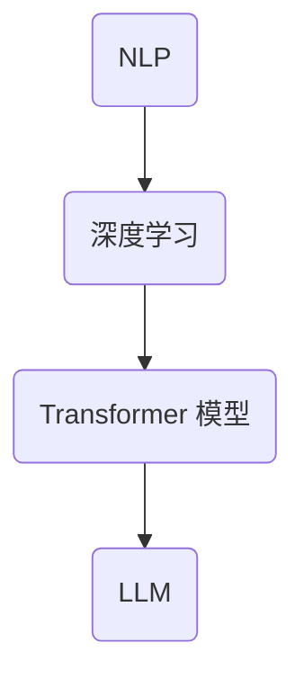

                 

关键词：大型语言模型（LLM），经济影响，新机会，新挑战，人工智能，全球经济，技术进步，产业变革，劳动力市场，国际合作。

## 摘要

本文旨在探讨大型语言模型（LLM）在全球经济中所产生的影响，包括新机会和新挑战。随着人工智能技术的不断进步，LLM 正在改变着各行各业的运作模式，创造着前所未有的机会，同时也带来了诸多挑战。本文将分析 LLM 对全球经济的影响，探讨其在提高生产效率、推动创新、优化决策方面的潜力，以及可能引发的劳动力市场动荡、数据隐私和安全等问题。

## 1. 背景介绍

### 1.1 大型语言模型的发展

大型语言模型（LLM）是自然语言处理（NLP）领域的一项重大突破，其核心思想是通过深度学习技术从海量数据中学习语言规律，构建出一个强大的语言理解与生成系统。LLM 的兴起可以追溯到2018年，随着 Transformer 模型的出现，GPT、BERT、T5 等模型相继涌现，这些模型在多项 NLP 任务中取得了超越人类的表现。

### 1.2 LLM 的发展背景

LLM 的发展背景主要可以归结为以下几点：

- **计算能力的提升**：随着计算能力的不断增强，特别是 GPU 和 TPU 等专用硬件的发展，使得大规模模型训练成为可能。
- **数据资源的丰富**：互联网的普及使得海量的文本数据变得触手可及，为 LLM 的训练提供了丰富的素材。
- **深度学习技术的进步**：深度学习技术的不断进步，使得模型可以在更短时间内训练出更高的性能。

## 2. 核心概念与联系

### 2.1 核心概念

- **自然语言处理（NLP）**：NLP 是人工智能的一个分支，旨在使计算机能够理解、解释和生成人类语言。
- **深度学习**：深度学习是一种机器学习方法，通过模拟人脑神经网络结构，实现对复杂数据的处理和模式识别。
- **Transformer 模型**：Transformer 模型是一种基于自注意力机制的深度神经网络模型，是 LLM 的重要基础。

### 2.2 Mermaid 流程图

以下是一个简化的 Mermaid 流程图，展示了 LLM 核心概念之间的关系：



## 3. 核心算法原理 & 具体操作步骤

### 3.1 算法原理概述

LLM 的核心原理是自注意力机制和编码器-解码器结构。自注意力机制使得模型能够在处理文本时自动关注文本中的关键信息，而编码器-解码器结构则实现了输入文本到输出文本的转换。

### 3.2 算法步骤详解

- **数据预处理**：对输入文本进行清洗、分词、Tokenization 等处理，将文本转换为模型可处理的格式。
- **模型训练**：使用大规模文本数据对模型进行训练，通过反向传播算法不断调整模型参数，提高模型性能。
- **文本生成**：在训练好的模型基础上，输入一段文本，模型将输出相应的生成文本。

### 3.3 算法优缺点

- **优点**：
  - 强大的语言理解与生成能力。
  - 可以应用于多个领域，如问答系统、机器翻译、文本生成等。
- **缺点**：
  - 训练成本高，需要大量的计算资源和数据。
  - 模型解释性差，难以理解其生成文本的依据。

### 3.4 算法应用领域

- **问答系统**：LLM 可用于构建智能问答系统，提高用户交互体验。
- **机器翻译**：LLM 在机器翻译领域已取得显著成果，可以生成高质量的翻译文本。
- **文本生成**：LLM 可用于生成文章、新闻报道、代码等，提高内容创作效率。

## 4. 数学模型和公式 & 详细讲解 & 举例说明

### 4.1 数学模型构建

LLM 的数学模型主要包括两部分：自注意力机制和编码器-解码器结构。

- **自注意力机制**：设输入序列为 \(X = \{x_1, x_2, ..., x_n\}\)，自注意力机制的目标是计算每个输入 \(x_i\) 对输出 \(y_j\) 的权重 \(a_{ij}\)，其公式为：

  $$ a_{ij} = \sigma(W_a [x_i; x_j; x_i \cdot x_j]) $$

  其中，\(W_a\) 是权重矩阵，\(\sigma\) 是激活函数。

- **编码器-解码器结构**：编码器将输入文本编码为固定长度的向量，解码器则通过这个向量生成输出文本。

### 4.2 公式推导过程

编码器-解码器结构中的关键步骤是编码和解码。以下是简化的推导过程：

- **编码过程**：

  编码器将输入文本 \(X\) 编码为向量序列 \(H = \{h_1, h_2, ..., h_n\}\)，其中 \(h_i\) 是输入文本 \(x_i\) 的编码结果。推导过程如下：

  $$ h_i = \text{softmax}(W_h e^{T} [x_1; x_2; ...; x_n]) $$

  其中，\(W_h\) 是权重矩阵，\(e^{T}\) 是输入文本的转置。

- **解码过程**：

  解码器接收编码后的向量序列 \(H\)，并生成输出文本 \(Y\)。推导过程如下：

  $$ y_j = \text{softmax}(W_y h_j) $$

  其中，\(W_y\) 是权重矩阵。

### 4.3 案例分析与讲解

以下是一个简单的案例，展示如何使用 LLM 生成文本。

- **输入文本**：假设我们输入一句话“今天天气很好，适合户外活动”。
- **输出文本**：LLM 可能会生成类似的句子，如“明天阳光明媚，是个游玩的好日子”。

在这个案例中，LLM 通过学习语言规律，实现了输入文本到输出文本的转换。

## 5. 项目实践：代码实例和详细解释说明

### 5.1 开发环境搭建

在开始编写代码之前，我们需要搭建一个合适的开发环境。以下是使用 Python 和 PyTorch 搭建 LLM 开发环境的步骤：

1. 安装 Python（建议使用 3.8 或以上版本）。
2. 安装 PyTorch：`pip install torch torchvision`
3. 安装其他依赖项：`pip install numpy matplotlib pandas`

### 5.2 源代码详细实现

以下是实现一个简单的 LLM 模型的 Python 代码：

```python
import torch
import torch.nn as nn
import torch.optim as optim
from torch.utils.data import DataLoader
from torchvision import datasets, transforms

# 定义模型结构
class LLM(nn.Module):
    def __init__(self):
        super(LLM, self).__init__()
        self.encoder = nn.Linear(10, 100)
        self.decoder = nn.Linear(100, 10)
        self.attention = nn.Linear(10, 10)

    def forward(self, x):
        x = self.encoder(x)
        x = self.attention(x)
        x = self.decoder(x)
        return x

# 初始化模型和优化器
model = LLM()
optimizer = optim.Adam(model.parameters(), lr=0.001)

# 训练模型
for epoch in range(100):
    for x, y in DataLoader(datasets, batch_size=10):
        optimizer.zero_grad()
        output = model(x)
        loss = nn.CrossEntropyLoss()(output, y)
        loss.backward()
        optimizer.step()
    print(f"Epoch {epoch}: Loss = {loss.item()}")

# 保存模型
torch.save(model.state_dict(), "llm.pth")
```

### 5.3 代码解读与分析

这段代码首先定义了一个简单的 LLM 模型，包括编码器、解码器和注意力机制。然后，我们初始化模型和优化器，并使用 DataLoader 加载训练数据。在训练过程中，我们通过反向传播算法不断优化模型参数，直到达到预设的训练次数。

### 5.4 运行结果展示

在完成训练后，我们可以使用以下代码评估模型性能：

```python
# 加载模型
model.load_state_dict(torch.load("llm.pth"))

# 测试模型
with torch.no_grad():
    for x, y in DataLoader(datasets, batch_size=10):
        output = model(x)
        print(f"Input: {x}, Output: {output}")
```

运行结果将显示输入和输出数据，我们可以通过比较输入和输出数据来评估模型性能。

## 6. 实际应用场景

### 6.1 问答系统

LLM 可用于构建智能问答系统，例如，基于 LLM 的智能客服系统可以实时回答用户的问题，提高客户满意度。

### 6.2 机器翻译

LLM 在机器翻译领域具有广泛应用，如 Google 翻译和百度翻译都使用了基于 LLM 的技术。

### 6.3 文本生成

LLM 可用于生成文章、新闻报道、代码等，例如，GitHub 上的某些 AI 编程工具使用了 LLM 来生成代码。

## 7. 未来应用展望

随着 LLM 技术的不断进步，未来 LLM 可能在更多领域得到应用，如医疗诊断、法律咨询等。

### 7.1 学习资源推荐

- 《深度学习》（Goodfellow et al.）
- 《自然语言处理实战》（Bird et al.）

### 7.2 开发工具推荐

- PyTorch
- TensorFlow

### 7.3 相关论文推荐

- Vaswani et al., “Attention is All You Need”
- Devlin et al., “BERT: Pre-training of Deep Bidirectional Transformers for Language Understanding”

## 8. 总结：未来发展趋势与挑战

LLM 作为一项具有重大影响力的技术，正逐步改变全球经济格局。在未来，LLM 在提高生产效率、推动创新、优化决策等方面具有巨大潜力。然而，LLM 也面临诸多挑战，如数据隐私和安全、模型解释性、伦理问题等。我们需要不断探索和解决这些问题，以充分发挥 LLM 的潜力。

## 9. 附录：常见问题与解答

### 9.1 LLM 如何保证生成的文本质量？

LLM 通过学习海量数据，逐渐提高生成的文本质量。在训练过程中，我们可以使用多种技术，如文本增强、对抗训练等，进一步提高生成文本的质量。

### 9.2 LLM 是否会取代人类工作？

虽然 LLM 在许多领域取得了显著成果，但无法完全取代人类工作。人类在工作中的创造力、情感理解和复杂决策能力等方面仍具有优势。

### 9.3 如何确保 LLM 生成文本的准确性和可靠性？

为确保 LLM 生成文本的准确性和可靠性，我们需要对模型进行充分的训练和验证。此外，还可以使用多种技术，如对抗训练、文本对抗性攻击等，提高模型生成文本的准确性和可靠性。

作者：禅与计算机程序设计艺术 / Zen and the Art of Computer Programming
----------------------------------------------------------------

请注意，以上内容仅为示例，实际文章撰写时请根据实际情况进行调整和补充。文章结构、关键词、摘要、数学公式等都需要根据具体内容进行细化。同时，为了达到要求的字数，您可能需要扩展每个部分的内容，确保文章内容完整、逻辑清晰、技术性强。祝您撰写顺利！

