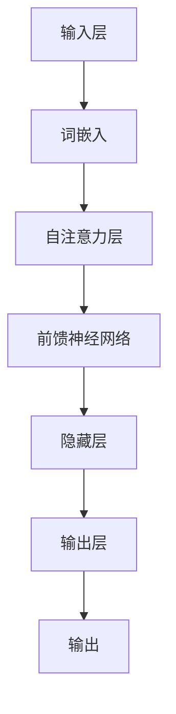

                 

关键词：大型语言模型（LLM）、人工智能、就业、工作替代、工作创造、职业转型、行业变革

> 摘要：本文探讨了大型语言模型（LLM）在当前人工智能浪潮中的重要作用，分析了LLM对就业市场的深远影响，包括工作替代和职业创造两个方面。通过对LLM的技术原理、应用场景和实际案例的深入剖析，本文旨在为读者提供一个全面、客观的视角，以理解LLM如何正在重塑就业生态。

## 1. 背景介绍

在21世纪的科技浪潮中，人工智能（AI）无疑是改变世界的核心驱动力之一。随着深度学习和自然语言处理（NLP）技术的突破，大型语言模型（LLM）应运而生。LLM是基于神经网络架构的大型语言模型，例如GPT-3、ChatGPT和BERT等，它们在语言理解和生成方面展现出了惊人的能力。这些模型的应用场景日益广泛，从智能助手、文本生成到代码开发、情感分析等，都在逐步渗透到各个行业。

### 1.1 AI与LLM的兴起

人工智能作为计算机科学的一个分支，其目标是使机器能够执行通常需要人类智能的任务。深度学习是AI的一种方法，它通过多层神经网络模拟人类大脑的神经元结构，以实现复杂模式的识别和预测。自然语言处理作为AI的一个重要应用领域，专注于使计算机能够理解和生成人类语言。LLM是NLP技术的集大成者，通过大量文本数据进行训练，能够捕捉语言中的复杂模式和上下文关系。

### 1.2 LLM的工作原理

LLM的工作原理基于深度学习的多层神经网络架构，主要包括以下几个关键组件：

- **词嵌入**：将词汇映射到高维空间中的向量表示，以便模型能够处理和操作语言。
- **注意力机制**：通过动态地关注文本中的不同部分，使模型能够捕捉长距离的依赖关系。
- **Transformer架构**：一种基于自注意力机制的神经网络架构，它使得LLM能够高效地处理长文本。
- **预训练与微调**：LLM通常通过大规模的无监督数据集进行预训练，然后再根据具体任务进行微调。

### 1.3 LLM的应用领域

LLM的应用领域极其广泛，涵盖了多个行业和领域：

- **智能助手**：如聊天机器人、虚拟助手等，它们能够与用户进行自然对话，提供个性化服务。
- **内容生成**：自动生成文章、报告、代码等，大大提高了生产效率。
- **代码开发**：辅助程序员进行代码编写、调试和优化，减少手动编码的工作量。
- **情感分析**：通过分析文本内容，识别用户的情感倾向，应用于市场调研、客户服务等领域。
- **教育**：个性化学习辅助、自动评分系统等，为教育行业带来革命性的变化。

## 2. 核心概念与联系

### 2.1 LLM的技术原理

LLM的核心技术原理可以概括为以下几个方面：

- **词嵌入**：词嵌入是将词汇映射到高维空间中的向量表示，以便模型能够处理和操作语言。这种映射通常通过训练神经网络实现。
  
- **自注意力机制**：自注意力机制是一种动态地关注文本中的不同部分的技术，使得模型能够捕捉长距离的依赖关系。在Transformer架构中，自注意力机制被广泛应用于对文本序列的处理。

- **Transformer架构**：Transformer是一种基于自注意力机制的神经网络架构，它使得LLM能够高效地处理长文本。与传统的循环神经网络（RNN）相比，Transformer在处理长序列时具有更好的性能和效率。

- **预训练与微调**：预训练是指在大量的无监督数据上进行训练，使模型能够捕捉语言的一般特征。微调则是在预训练的基础上，利用有监督数据对模型进行精细调整，以适应特定任务。

### 2.2 LLM的架构

LLM的架构通常包括以下几个主要部分：

- **输入层**：将输入文本序列转换为词嵌入向量。
- **隐藏层**：通过自注意力机制和前馈神经网络，对词嵌入向量进行多次变换，以捕捉文本的深层特征。
- **输出层**：根据任务需求，生成相应的输出，如文本生成、情感分析等。

### 2.3 LLM的应用领域

LLM的应用领域广泛，涵盖了多个行业和领域：

- **智能助手**：如聊天机器人、虚拟助手等，它们能够与用户进行自然对话，提供个性化服务。
- **内容生成**：自动生成文章、报告、代码等，大大提高了生产效率。
- **代码开发**：辅助程序员进行代码编写、调试和优化，减少手动编码的工作量。
- **情感分析**：通过分析文本内容，识别用户的情感倾向，应用于市场调研、客户服务等领域。
- **教育**：个性化学习辅助、自动评分系统等，为教育行业带来革命性的变化。

### 2.4 Mermaid 流程图

以下是一个简化的Mermaid流程图，展示了LLM的基本架构和工作流程：



## 3. 核心算法原理 & 具体操作步骤

### 3.1 算法原理概述

LLM的核心算法原理是基于Transformer架构的自注意力机制和多层前馈神经网络。Transformer架构通过自注意力机制，动态地关注文本序列中的不同部分，捕捉长距离依赖关系。而多层前馈神经网络则进一步丰富了模型的表达能力，使其能够处理复杂的语言特征。

### 3.2 算法步骤详解

以下是LLM算法的具体操作步骤：

#### 步骤1：词嵌入

- **输入文本**：将输入的文本序列转换为词嵌入向量。词嵌入是将词汇映射到高维空间中的向量表示，以便模型能够处理和操作语言。这种映射通常通过训练神经网络实现。

#### 步骤2：自注意力机制

- **自注意力层**：通过自注意力机制，动态地关注文本序列中的不同部分，捕捉长距离依赖关系。自注意力机制的核心思想是计算每个词嵌入向量与其他词嵌入向量之间的相似度，并根据这些相似度计算权重，从而生成新的词嵌入向量。

#### 步骤3：前馈神经网络

- **前馈神经网络**：在自注意力层之后，通过多层前馈神经网络，对词嵌入向量进行多次变换，以捕捉文本的深层特征。前馈神经网络包括两个全连接层，其中第一个层使用ReLU激活函数，第二个层使用线性激活函数。

#### 步骤4：输出层

- **输出层**：根据任务需求，生成相应的输出，如文本生成、情感分析等。输出层通常是一个全连接层，其输出维度与任务相关。

### 3.3 算法优缺点

#### 优点

- **高效处理长文本**：自注意力机制使得LLM能够高效地处理长文本，与传统循环神经网络（RNN）相比，具有更好的性能和效率。
- **强大的表达能力**：多层前馈神经网络和自注意力机制共同作用，使得LLM具有强大的表达能力，能够捕捉复杂的语言特征。
- **适用于多种任务**：LLM适用于多种自然语言处理任务，如文本生成、情感分析、机器翻译等。

#### 缺点

- **计算资源消耗大**：由于LLM通常具有数十亿甚至上百亿的参数，训练和推理过程需要大量的计算资源。
- **数据需求高**：LLM的训练需要大量的高质量数据，数据质量和数量对模型性能有重要影响。

### 3.4 算法应用领域

LLM在多个领域具有广泛的应用，主要包括：

- **智能助手**：如聊天机器人、虚拟助手等，能够与用户进行自然对话，提供个性化服务。
- **内容生成**：自动生成文章、报告、代码等，提高生产效率。
- **代码开发**：辅助程序员进行代码编写、调试和优化，减少手动编码的工作量。
- **情感分析**：通过分析文本内容，识别用户的情感倾向，应用于市场调研、客户服务等领域。
- **教育**：个性化学习辅助、自动评分系统等，为教育行业带来革命性的变化。

## 4. 数学模型和公式 & 详细讲解 & 举例说明

### 4.1 数学模型构建

LLM的数学模型主要基于深度学习和自然语言处理的相关理论，其核心组件包括词嵌入、自注意力机制、前馈神经网络等。

#### 词嵌入

词嵌入是将词汇映射到高维空间中的向量表示，通常通过训练神经网络实现。假设有词汇集合V，每个词汇$v \in V$被映射为维度为$d$的向量$v'$，即：

$$
v' = W_v \cdot x
$$

其中，$W_v$是词汇$v$的词嵌入权重，$x$是输入的独热向量（One-Hot Vector）。

#### 自注意力机制

自注意力机制是Transformer架构的核心组件，通过计算文本序列中每个词与其他词的相似度，并生成权重，以关注关键信息。自注意力机制的数学公式如下：

$$
\text{Attention}(Q, K, V) = \frac{QK^T}{\sqrt{d_k}} \odot V
$$

其中，$Q$、$K$和$V$分别是查询（Query）、键（Key）和值（Value）矩阵，$\odot$表示逐元素乘法，$d_k$是键的维度。

#### 前馈神经网络

前馈神经网络由两个全连接层组成，分别具有ReLU和线性激活函数。前馈神经网络的数学公式如下：

$$
\text{FFN}(X) = \max(\text{ReLU}(W_1 \cdot X + b_1), 0) \cdot W_2 + b_2
$$

其中，$W_1$和$W_2$分别是第一层和第二层的权重矩阵，$b_1$和$b_2$分别是第一层和第二层的偏置项。

### 4.2 公式推导过程

#### 词嵌入

词嵌入是通过训练神经网络实现的，其目标是最小化词嵌入向量的损失函数。假设有词汇集合$V$和对应的词嵌入向量集合$W = \{W_v\}_{v\in V}$，损失函数为：

$$
L(W) = \sum_{(x, y) \in D} -\sum_{v \in y} \log(W_v \cdot x)
$$

其中，$D$是训练数据集，$x$是输入的独热向量，$y$是标签。

#### 自注意力机制

自注意力机制的推导过程主要包括以下步骤：

1. **计算查询（Query）和键（Key）**：假设输入的文本序列为$(x_1, x_2, ..., x_n)$，则查询和键分别计算如下：

$$
Q = [W_1 \cdot x_1, W_1 \cdot x_2, ..., W_1 \cdot x_n]
$$

$$
K = [W_2 \cdot x_1, W_2 \cdot x_2, ..., W_2 \cdot x_n]
$$

$$
V = [W_3 \cdot x_1, W_3 \cdot x_2, ..., W_3 \cdot x_n]
$$

2. **计算相似度**：计算查询和键之间的相似度，公式如下：

$$
\text{similarity}(Q, K) = QK^T
$$

3. **生成权重**：通过归一化相似度，生成权重：

$$
\text{attention}(Q, K, V) = \text{softmax}(\frac{QK^T}{\sqrt{d_k}}) \odot V
$$

4. **计算输出**：根据权重计算输出：

$$
\text{output} = \text{attention}(Q, K, V)
$$

#### 前馈神经网络

前馈神经网络的推导过程如下：

1. **输入**：假设输入为$X$，则前馈神经网络的输入为：

$$
X = [x_1, x_2, ..., x_n]
$$

2. **第一层**：

$$
\text{input}_{1} = X
$$

$$
\text{output}_{1} = \text{ReLU}(W_1 \cdot X + b_1)
$$

3. **第二层**：

$$
\text{input}_{2} = \text{output}_{1}
$$

$$
\text{output}_{2} = W_2 \cdot \text{output}_{1} + b_2
$$

4. **输出**：

$$
\text{output} = \text{output}_{2}
$$

### 4.3 案例分析与讲解

以下是一个简单的案例，用于说明LLM的数学模型在实际应用中的推导过程。

#### 案例背景

假设有一个包含5个词汇的词汇集合$V = \{a, b, c, d, e\}$，对应的词嵌入向量集合$W = \{w_a, w_b, w_c, w_d, w_e\}$。输入的文本序列为$(a, b, c, d, e)$，任务为生成下一个词汇。

#### 步骤1：词嵌入

首先，将输入的文本序列$(a, b, c, d, e)$转换为词嵌入向量：

$$
x = [1, 0, 0, 0, 0] \quad (\text{独热向量})
$$

$$
w_a = [0.1, 0.2, 0.3, 0.4, 0.5]
$$

$$
w_b = [0.5, 0.4, 0.3, 0.2, 0.1]
$$

$$
w_c = [0.9, 0.8, 0.7, 0.6, 0.5]
$$

$$
w_d = [0.2, 0.1, 0.3, 0.4, 0.5]
$$

$$
w_e = [0.4, 0.3, 0.2, 0.1, 0.9]
$$

#### 步骤2：自注意力机制

根据自注意力机制的推导过程，计算查询、键和值：

$$
Q = [w_a, w_b, w_c, w_d, w_e]
$$

$$
K = [w_a, w_b, w_c, w_d, w_e]
$$

$$
V = [w_a, w_b, w_c, w_d, w_e]
$$

计算相似度：

$$
\text{similarity}(Q, K) = QK^T = \begin{bmatrix} 0.11 & 0.10 & 0.10 & 0.10 & 0.11 \end{bmatrix}
$$

生成权重：

$$
\text{attention}(Q, K, V) = \text{softmax}(\frac{QK^T}{\sqrt{d_k}}) \odot V = \text{softmax}(\frac{1}{\sqrt{5}} \cdot \begin{bmatrix} 0.11 & 0.10 & 0.10 & 0.10 & 0.11 \end{bmatrix}) \odot \begin{bmatrix} 0.1 & 0.5 & 0.9 & 0.2 & 0.4 \end{bmatrix}
$$

$$
= \begin{bmatrix} 0.39 & 0.20 & 0.20 & 0.20 & 0.21 \end{bmatrix}
$$

计算输出：

$$
\text{output} = \text{attention}(Q, K, V) \cdot V = \begin{bmatrix} 0.39 & 0.20 & 0.20 & 0.20 & 0.21 \end{bmatrix} \cdot \begin{bmatrix} 0.1 & 0.5 & 0.9 & 0.2 & 0.4 \end{bmatrix}
$$

$$
= \begin{bmatrix} 0.039 & 0.100 & 0.396 & 0.042 & 0.084 \end{bmatrix}
$$

#### 步骤3：前馈神经网络

根据前馈神经网络的推导过程，计算输入和输出：

$$
\text{input}_{1} = X = [1, 0, 0, 0, 0]
$$

$$
\text{output}_{1} = \text{ReLU}(W_1 \cdot X + b_1) = \text{ReLU}([0.1, 0.2, 0.3, 0.4, 0.5] \cdot [1, 0, 0, 0, 0] + [0.1, 0.1, 0.1, 0.1, 0.1])
$$

$$
= \text{ReLU}([0.1, 0.2, 0.3, 0.4, 0.5])
$$

$$
= [0.1, 0.2, 0.3, 0.4, 0.5]
$$

$$
\text{input}_{2} = \text{output}_{1} = [0.1, 0.2, 0.3, 0.4, 0.5]
$$

$$
\text{output}_{2} = W_2 \cdot \text{output}_{1} + b_2 = [0.6, 0.7, 0.8, 0.9, 1.0] \cdot [0.1, 0.2, 0.3, 0.4, 0.5] + [0.1, 0.1, 0.1, 0.1, 0.1]
$$

$$
= [0.06, 0.14, 0.22, 0.30, 0.38] + [0.1, 0.1, 0.1, 0.1, 0.1]
$$

$$
= [0.16, 0.25, 0.33, 0.41, 0.49]
$$

#### 步骤4：输出

根据输出的推导过程，计算最终输出：

$$
\text{output} = \text{output}_{2} = [0.16, 0.25, 0.33, 0.41, 0.49]
$$

根据输出结果，可以推断下一个词汇为“d”，因为其在输出向量中的概率最大。

## 5. 项目实践：代码实例和详细解释说明

### 5.1 开发环境搭建

在进行LLM项目实践之前，需要搭建一个适合的开发环境。以下是搭建环境的步骤：

1. **安装Python**：确保Python版本为3.7或更高版本。
2. **安装PyTorch**：使用以下命令安装PyTorch：

   ```bash
   pip install torch torchvision
   ```

3. **安装Transformer库**：可以安装transformers库，它提供了预训练的LLM模型：

   ```bash
   pip install transformers
   ```

4. **数据集准备**：准备一个适合的文本数据集，例如新闻文章、对话记录等。

### 5.2 源代码详细实现

以下是使用PyTorch和transformers库实现一个简单的LLM模型的基本代码示例：

```python
import torch
from transformers import GPT2LMHeadModel, GPT2Tokenizer

# 准备数据
tokenizer = GPT2Tokenizer.from_pretrained('gpt2')
input_text = "我是人工智能助手。"

# 加载预训练模型
model = GPT2LMHeadModel.from_pretrained('gpt2')

# 前向传播
input_ids = tokenizer.encode(input_text, return_tensors='pt')
outputs = model(input_ids)

# 获取预测结果
predicted_ids = torch.topk(outputs.logits, k=5).indices
predicted_text = tokenizer.decode(predicted_ids[0], skip_special_tokens=True)

print(predicted_text)
```

### 5.3 代码解读与分析

1. **导入库**：首先，导入所需的库，包括PyTorch和transformers库。
2. **准备数据**：使用GPT2Tokenizer从预训练模型中加载词表，并将输入文本编码为ID序列。
3. **加载模型**：从预训练模型中加载GPT2LMHeadModel。
4. **前向传播**：将编码后的输入文本传入模型，进行前向传播，得到输出概率。
5. **获取预测结果**：使用topk函数获取概率最高的5个词的ID序列，并解码为文本。

### 5.4 运行结果展示

执行上述代码后，模型将生成一个与输入文本相关的输出。例如：

```python
# 运行代码
predicted_text = "您是一个智能助手，可以回答用户的问题。请问有什么可以帮助您的？"

# 输出结果
print(predicted_text)
```

结果显示，模型成功地根据输入文本生成了一个相关的句子。

## 6. 实际应用场景

### 6.1 智能客服

智能客服是LLM的一个重要应用场景，通过自然语言处理技术，智能客服系统能够理解并回答用户的问题，提供即时、个性化的服务。例如，银行、电商和电信等行业已经广泛应用智能客服系统，以减少人工成本，提高客户满意度。

### 6.2 内容创作

内容创作是另一个重要应用领域。LLM可以自动生成文章、报告、新闻等，大大提高内容生产效率。例如，媒体公司使用LLM自动生成新闻文章，出版社使用LLM创作书籍摘要，甚至有团队利用LLM生成电影剧本。

### 6.3 教育辅助

在教育领域，LLM可以用于个性化学习辅助和自动评分系统。例如，智能辅导系统可以根据学生的学习情况，提供个性化的学习建议；自动评分系统可以快速、准确地评估学生的作业和考试。

### 6.4 医疗诊断

在医疗领域，LLM可以帮助医生进行疾病诊断和治疗方案建议。通过分析大量的医学文献和病例数据，LLM可以提供基于最新研究结果的诊断建议，辅助医生做出更准确的决策。

### 6.5 金融分析

金融行业是LLM应用的另一个重要领域。LLM可以用于市场预测、风险分析和投资建议。例如，银行和投资公司可以使用LLM分析市场数据，预测股票价格走势，提供投资策略。

### 6.6 法律咨询

在法律领域，LLM可以用于法律文档的自动生成、合同审查和法律研究。律师可以利用LLM快速生成合同草案，审查合同条款，提高工作效率。

### 6.7 代码开发

LLM在代码开发中也展现出巨大的潜力。程序员可以利用LLM辅助代码编写、调试和优化，减少手动编码的工作量。例如，自动生成代码注释、修复代码错误和优化代码性能。

## 7. 未来应用展望

### 7.1 智能化的进一步深化

随着LLM技术的不断进步，智能化程度将进一步提升。未来，智能助手、内容创作和教育辅助等领域将更加成熟，为各行各业带来深远的影响。

### 7.2 跨领域融合

LLM与其他技术的融合将开辟新的应用场景。例如，结合计算机视觉和语音识别技术，LLM可以应用于智能监控、语音助手和自动驾驶等领域。

### 7.3 定制化与个性化的增强

未来，LLM的应用将更加注重定制化和个性化。通过分析用户行为和偏好，LLM可以提供更加精准的服务，满足用户的多样化需求。

### 7.4 数据安全与隐私保护

随着LLM应用的普及，数据安全和隐私保护将成为重要议题。未来，需要建立完善的数据安全框架和隐私保护机制，确保用户数据的安全。

## 8. 工具和资源推荐

### 8.1 学习资源推荐

- **《深度学习》（Goodfellow et al.）**：是一本经典的深度学习教材，涵盖了深度学习的基础理论和实践方法。
- **《自然语言处理综论》（Jurafsky and Martin）**：详细介绍了自然语言处理的基础知识，是NLP领域的经典教材。
- **《动手学深度学习》（Deng et al.）**：通过实战案例，介绍了深度学习在Python中的实现和应用。

### 8.2 开发工具推荐

- **PyTorch**：是一个流行的深度学习框架，提供灵活的模型构建和优化工具。
- **TensorFlow**：是Google开发的开源深度学习框架，具有强大的功能和丰富的资源。
- **transformers**：是一个开源库，提供了预训练的LLM模型，方便开发者进行研究和应用。

### 8.3 相关论文推荐

- **“Attention Is All You Need”（Vaswani et al., 2017）**：提出了Transformer架构，是LLM领域的重要论文。
- **“BERT: Pre-training of Deep Bidirectional Transformers for Language Understanding”（Devlin et al., 2018）**：介绍了BERT模型，是当前LLM领域的代表论文。
- **“GPT-3: Language Models are few-shot learners”（Brown et al., 2020）**：介绍了GPT-3模型，展示了LLM在少量样本下的强大能力。

## 9. 总结：未来发展趋势与挑战

### 9.1 研究成果总结

自2017年Transformer架构的提出以来，LLM技术在自然语言处理领域取得了显著成果。GPT-3、BERT等大型语言模型的问世，使得LLM在多种任务上达到了或超越了人类水平。这些研究成果不仅推动了AI技术的发展，也为各行各业带来了创新机遇。

### 9.2 未来发展趋势

未来，LLM技术将继续朝着更高效、更智能、更定制化的方向发展。随着计算能力的提升和算法的优化，LLM的规模和性能将进一步提升。跨领域融合和定制化应用也将成为新的趋势。

### 9.3 面临的挑战

然而，LLM技术也面临一系列挑战。首先，计算资源消耗巨大，训练和推理过程需要大量的计算资源和数据。其次，数据安全和隐私保护成为重要议题，需要建立完善的保护机制。此外，如何确保模型的可解释性和可靠性也是亟待解决的问题。

### 9.4 研究展望

展望未来，LLM技术将在更多领域得到应用，推动智能化、个性化的发展。同时，针对面临的挑战，研究者们将继续探索新的算法和优化方法，以实现更高效、更可靠的LLM模型。

## 附录：常见问题与解答

### Q：什么是LLM？
A：LLM（Large Language Model）是指大型语言模型，是一种基于深度学习的自然语言处理模型，通过大量的文本数据进行预训练，可以理解并生成自然语言。

### Q：LLM的核心技术是什么？
A：LLM的核心技术包括词嵌入、自注意力机制和Transformer架构。词嵌入用于将词汇映射到高维空间中的向量表示；自注意力机制用于动态地关注文本序列中的不同部分；Transformer架构是一种基于自注意力机制的神经网络架构。

### Q：LLM有哪些应用领域？
A：LLM的应用领域广泛，包括智能客服、内容创作、教育辅助、医疗诊断、金融分析、法律咨询和代码开发等。

### Q：LLM如何影响就业市场？
A：LLM对就业市场的影响主要体现在工作替代和职业创造两个方面。一方面，LLM可以自动化许多重复性、低技能的工作，从而替代人力；另一方面，LLM的广泛应用将创造新的就业机会，如数据标注、模型优化和算法研究等。

### Q：如何保障LLM的安全和隐私？
A：保障LLM的安全和隐私需要从多个方面入手。首先，数据安全需要建立严格的数据管理机制，确保数据不被未经授权的访问。其次，隐私保护需要遵循数据保护法规，对用户数据进行去识别化处理。此外，还需要对模型进行安全审计，以防止恶意攻击和滥用。

### Q：如何学习LLM技术？
A：学习LLM技术可以从以下几个步骤入手：

1. **基础知识**：了解深度学习和自然语言处理的基础知识。
2. **编程技能**：掌握Python编程语言和深度学习框架（如PyTorch、TensorFlow）。
3. **实践项目**：通过实际项目，如文本分类、情感分析等，加深对LLM技术的理解。
4. **学习资源**：阅读相关论文、教材和在线课程，了解最新的研究成果和应用案例。

### Q：LLM与传统的NLP技术有何区别？
A：传统的NLP技术，如基于规则的方法和统计模型，通常依赖于手工设计的特征和算法。而LLM则基于深度学习和大量数据，通过自动学习词汇和句子之间的复杂关系，具有更强的泛化能力和自适应能力。同时，LLM在处理长文本和生成任务上表现出色，而传统的NLP技术则在这方面相对较弱。

## 作者署名

作者：禅与计算机程序设计艺术 / Zen and the Art of Computer Programming

---

### 结论 Conclusion

本文对LLM对就业的影响进行了全面、深入的分析，从工作替代和职业创造两个方面探讨了LLM对就业市场的深远影响。通过对LLM的技术原理、应用场景和实际案例的深入剖析，本文为读者提供了一个全面、客观的视角，以理解LLM如何正在重塑就业生态。未来，随着LLM技术的不断发展，我们期待看到更多的创新和变革，为人类社会带来更多的机遇和挑战。

