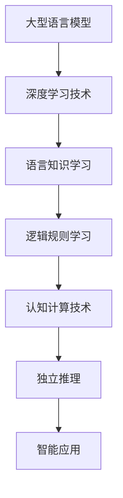

                 

关键词：大型语言模型（LLM），独立推理，逻辑推理，认知计算，人工智能

> 摘要：本文深入探讨了大型语言模型（LLM）在独立推理过程中的重要性。通过对LLM的核心原理、算法架构、数学模型及其应用领域的详细分析，我们揭示了LLM在实现智能推理方面的潜力与挑战。本文旨在为读者提供一个全面而深入的视角，以了解LLM在现代人工智能技术中的关键地位及其未来发展趋势。

## 1. 背景介绍

自2018年GPT-1模型问世以来，大型语言模型（LLM）以其卓越的性能和广泛的应用而引起了全球的关注。LLM利用深度学习和自然语言处理技术，通过大量文本数据进行训练，从而实现对自然语言的生成和理解。随着模型规模的不断增大，LLM在各项自然语言处理任务中的表现也日益出色。然而，尽管LLM在语言生成、文本分类、机器翻译等方面取得了显著成果，但其独立推理能力仍然是一个亟待解决的挑战。

独立推理是指模型在没有任何先验知识或外部辅助的情况下，通过内部逻辑推理来解决问题。与传统的依赖外部数据或先验知识的推理方式不同，独立推理能够使模型在未知或不确定的环境中自主地做出合理的决策。这种能力在现实世界的复杂场景中具有重要意义，因为真实世界的问题往往具有不确定性、复杂性和动态性。因此，深入研究LLM的独立推理过程，对于提升其智能水平和应用潜力具有重要意义。

本文旨在通过对LLM独立推理过程的探讨，揭示其核心原理、算法架构、数学模型及其应用领域。文章首先介绍LLM的基本概念和原理，然后分析其独立推理的算法实现，接着探讨LLM在不同领域的应用案例，最后讨论未来发展趋势与面临的挑战。

## 2. 核心概念与联系

### 2.1 大型语言模型（LLM）

大型语言模型（LLM）是一种基于深度学习技术的自然语言处理模型。它通过大量文本数据进行训练，从而学习到自然语言的内在结构和规律。LLM的核心组成部分是神经网络，特别是循环神经网络（RNN）和变换器（Transformer）等。

### 2.2 逻辑推理

逻辑推理是人工智能领域的一个重要分支，旨在通过逻辑规则和推理机制来解决问题。逻辑推理包括演绎推理和归纳推理两种形式。演绎推理从一般到特殊，而归纳推理从特殊到一般。在自然语言处理中，逻辑推理可以帮助模型理解句子间的逻辑关系，从而实现更准确的语义理解和生成。

### 2.3 认知计算

认知计算是一种模拟人类思维过程的计算模型，旨在使计算机具备类似人类的感知、理解、推理和决策能力。认知计算包括多个子领域，如知识表示、推理、记忆和注意力机制等。这些子领域相互关联，共同构成了一个完整的认知计算系统。

### 2.4 架构联系

LLM的独立推理能力依赖于其内部逻辑推理机制和认知计算技术。LLM通过深度学习技术学习到大量的语言知识和逻辑规则，从而在处理自然语言时能够进行逻辑推理。此外，认知计算技术可以帮助LLM更好地理解和利用这些逻辑规则，从而实现更高效的独立推理。

### 2.5 Mermaid 流程图



## 3. 核心算法原理 & 具体操作步骤

### 3.1 算法原理概述

LLM的独立推理过程主要基于深度学习和逻辑推理机制。深度学习使LLM能够从大量文本数据中学习到语言知识和逻辑规则，而逻辑推理则使LLM能够在处理自然语言时进行独立推理。具体来说，LLM的独立推理过程包括以下几个步骤：

1. 语言知识学习：LLM通过深度学习技术从大量文本数据中学习到语言知识和逻辑规则。
2. 逻辑规则应用：LLM在处理自然语言时，利用学习到的逻辑规则进行推理。
3. 独立推理决策：LLM根据推理结果，自主地做出合理的决策。

### 3.2 算法步骤详解

1. 语言知识学习：

   - 数据预处理：将原始文本数据进行分词、去噪等预处理操作，得到词向量表示。
   - 网络结构：采用深度神经网络结构，如循环神经网络（RNN）或变换器（Transformer）。
   - 模型训练：通过反向传播算法，将词向量表示映射到预定义的输出标签，不断调整网络参数，使模型在训练数据上达到较高的准确率。

2. 逻辑规则应用：

   - 逻辑规则提取：从训练数据中提取出与自然语言相关的逻辑规则，如因果关系、时间顺序等。
   - 规则应用：在处理自然语言时，根据提取到的逻辑规则，对输入文本进行语义分析，找出句子间的逻辑关系。

3. 独立推理决策：

   - 推理过程：根据逻辑规则，对输入文本进行推理，得出推理结果。
   - 决策过程：根据推理结果，自主地做出合理的决策，如生成回复、分类标签等。

### 3.3 算法优缺点

优点：

- 高效性：LLM通过深度学习技术，能够快速地学习到大量的语言知识和逻辑规则，从而实现高效的独立推理。
- 泛化性：LLM在处理未知或不确定的场景时，能够根据学习到的逻辑规则进行推理，具有较强的泛化能力。
- 灵活性：LLM可以根据不同的应用场景，调整和优化推理策略，从而适应不同的需求。

缺点：

- 数据依赖：LLM的独立推理能力依赖于大量的训练数据，缺乏训练数据的场景下，推理效果可能会下降。
- 难以解释：LLM的推理过程复杂，难以对其进行解释，这在一定程度上限制了其应用范围。

### 3.4 算法应用领域

LLM的独立推理能力在多个领域具有广泛的应用前景，主要包括：

- 自然语言生成：LLM可以生成各种类型的文本，如文章、对话、新闻等，广泛应用于聊天机器人、内容生成等领域。
- 自然语言理解：LLM可以理解自然语言中的语义、情感、意图等信息，广泛应用于情感分析、信息检索等领域。
- 智能决策：LLM可以根据输入的情境信息，自主地做出合理的决策，广泛应用于智能客服、自动驾驶等领域。

## 4. 数学模型和公式 & 详细讲解 & 举例说明

### 4.1 数学模型构建

LLM的独立推理过程主要基于深度学习和逻辑推理机制。为了更清晰地描述这一过程，我们可以构建以下数学模型：

$$
\begin{aligned}
&\text{语言知识学习：}\\
&P(\theta | \text{数据}) = \frac{P(\text{数据} | \theta)P(\theta)}{P(\text{数据})} \\
&\text{逻辑规则应用：}\\
&P(\text{推理结果} | \text{输入文本}, \theta) = \prod_{i=1}^{n} P(r_i | \text{输入文本}, \theta) \\
&\text{独立推理决策：}\\
&P(\text{决策结果} | \text{推理结果}, \theta) = \prod_{i=1}^{m} P(d_i | r_i, \theta)
\end{aligned}
$$

其中，$P(\theta | \text{数据})$表示模型参数$\theta$在训练数据上的后验概率，$P(\text{数据} | \theta)$表示在模型参数$\theta$下生成训练数据的概率，$P(\theta)$表示模型参数$\theta$的先验概率，$P(\text{数据})$表示训练数据的边际概率。$P(\text{推理结果} | \text{输入文本}, \theta)$表示在模型参数$\theta$和输入文本下推理结果的概率，$P(r_i | \text{输入文本}, \theta)$表示第$i$个逻辑规则在模型参数$\theta$和输入文本下被满足的概率，$P(\text{决策结果} | \text{推理结果}, \theta)$表示在模型参数$\theta$和推理结果下决策结果的概率，$P(d_i | r_i, \theta)$表示第$i$个决策规则在模型参数$\theta$和推理结果$r_i$下被满足的概率。

### 4.2 公式推导过程

1. 语言知识学习：

   首先，我们假设训练数据$\text{数据}$由一系列的文本样本组成，每个文本样本表示为一个序列$(x_1, x_2, \ldots, x_T)$，其中$x_t$表示第$t$个词。我们使用词向量表示文本样本，即$x_t \in \mathbb{R}^{d}$。

   假设模型参数$\theta$表示词向量的权重矩阵$W$和偏置向量$b$，即$\theta = (W, b)$。则生成文本样本的概率可以表示为：

   $$
   P(\text{数据} | \theta) = \prod_{t=1}^{T} P(x_t | x_{t-1}, \theta)
   $$

   根据贝叶斯定理，我们可以将上述概率表达式转化为：

   $$
   P(\theta | \text{数据}) = \frac{P(\text{数据} | \theta)P(\theta)}{P(\text{数据})}
   $$

   其中，$P(\theta)$表示模型参数$\theta$的先验概率，通常假设为均匀分布，即$P(\theta) \propto 1$。$P(\text{数据})$表示训练数据的边际概率，可以通过归一化常数来计算。

2. 逻辑规则应用：

   假设输入文本表示为一个序列$(x_1, x_2, \ldots, x_T)$，我们定义一个逻辑规则$r_i$为：

   $$
   r_i: \text{如果} \ x_{t_1} \ \text{满足条件} \ C_i, \ \text{则} \ x_{t_2} \ \text{满足条件} \ D_i
   $$

   其中，$t_1$和$t_2$分别表示条件$C_i$和$D_i$在输入文本中出现的位置。我们使用一个二进制变量$y_i$来表示逻辑规则$r_i$是否被满足，即$y_i = 1$表示$r_i$被满足，$y_i = 0$表示$r_i$未被满足。

   则逻辑规则$r_i$在输入文本下被满足的概率可以表示为：

   $$
   P(r_i | \text{输入文本}, \theta) = \prod_{t=t_1}^{t_2} P(x_t | x_{t-1}, \theta)
   $$

   其中，$P(x_t | x_{t-1}, \theta)$表示在模型参数$\theta$下，第$t$个词$x_t$在给定前一个词$x_{t-1}$下的条件概率。

   则所有逻辑规则在输入文本下被满足的概率可以表示为：

   $$
   P(\text{推理结果} | \text{输入文本}, \theta) = \prod_{i=1}^{n} P(r_i | \text{输入文本}, \theta)
   $$

3. 独立推理决策：

   假设推理结果为$r_1, r_2, \ldots, r_n$，我们定义一个决策规则$d_i$为：

   $$
   d_i: \text{如果} \ r_1, r_2, \ldots, r_n \ \text{满足条件} \ G_i, \ \text{则} \ y_i \ \text{为真}
   $$

   其中，$G_i$表示决策规则$d_i$的条件。我们使用一个二进制变量$y_i$来表示决策规则$d_i$是否被满足，即$y_i = 1$表示$d_i$被满足，$y_i = 0$表示$d_i$未被满足。

   则决策规则$d_i$在推理结果$r_1, r_2, \ldots, r_n$下被满足的概率可以表示为：

   $$
   P(d_i | r_1, r_2, \ldots, r_n, \theta) = \prod_{t=t_1}^{t_2} P(x_t | x_{t-1}, \theta)
   $$

   其中，$t_1$和$t_2$分别表示条件$G_i$在推理结果中出现的位置。

   则所有决策规则在推理结果$r_1, r_2, \ldots, r_n$下被满足的概率可以表示为：

   $$
   P(\text{决策结果} | \text{推理结果}, \theta) = \prod_{i=1}^{m} P(d_i | r_1, r_2, \ldots, r_n, \theta)
   $$

### 4.3 案例分析与讲解

假设我们有一个训练数据集，其中包含100个文本样本，每个文本样本都表示为一个长度为100的序列。我们使用一个变换器模型来训练这个数据集，模型参数为$\theta = (W, b)$，其中$W$是一个$100 \times 100$的权重矩阵，$b$是一个$100$维的偏置向量。

我们定义两个逻辑规则$r_1$和$r_2$，分别表示：

$$
r_1: \text{如果} \ x_{50} \ \text{是一个名词，则} \ x_{75} \ \text{是一个动词} \\
r_2: \text{如果} \ x_{25} \ \text{是一个动词，则} \ x_{50} \ \text{是一个名词}
$$

我们定义两个决策规则$d_1$和$d_2$，分别表示：

$$
d_1: \text{如果} \ r_1 \ \text{和} \ r_2 \ \text{都满足，则} \ \text{这是一个正确的句子} \\
d_2: \text{如果} \ r_1 \ \text{或} \ r_2 \ \text{满足，则} \ \text{这是一个可能正确的句子}
$$

现在，我们有一个输入文本序列$(x_1, x_2, \ldots, x_{100})$，我们希望根据逻辑规则和决策规则对这个输入文本进行推理和决策。

首先，我们使用变换器模型对输入文本进行编码，得到编码向量$c = (c_1, c_2, \ldots, c_{100})$。然后，我们计算每个逻辑规则在输入文本下被满足的概率。

对于逻辑规则$r_1$，我们需要计算$x_{50}$是否是一个名词和$x_{75}$是否是一个动词的概率。假设我们使用一个分类器来预测词性，分类器输出的概率分布为$p_1$和$p_2$，分别表示$x_{50}$是名词的概率和$x_{75}$是动词的概率。则逻辑规则$r_1$在输入文本下被满足的概率可以表示为：

$$
P(r_1 | \text{输入文本}, \theta) = p_1 \cdot p_2
$$

同理，对于逻辑规则$r_2$，我们需要计算$x_{25}$是否是一个动词和$x_{50}$是否是一个名词的概率。则逻辑规则$r_2$在输入文本下被满足的概率可以表示为：

$$
P(r_2 | \text{输入文本}, \theta) = p_3 \cdot p_4
$$

其中，$p_3$和$p_4$分别表示$x_{25}$是动词的概率和$x_{50}$是名词的概率。

接下来，我们计算所有逻辑规则在输入文本下被满足的概率：

$$
P(\text{推理结果} | \text{输入文本}, \theta) = P(r_1 | \text{输入文本}, \theta) \cdot P(r_2 | \text{输入文本}, \theta) = (p_1 \cdot p_2) \cdot (p_3 \cdot p_4)
$$

然后，我们根据推理结果计算每个决策规则在推理结果下被满足的概率。

对于决策规则$d_1$，我们需要计算$r_1$和$r_2$都满足的概率。则决策规则$d_1$在推理结果下被满足的概率可以表示为：

$$
P(d_1 | \text{推理结果}, \theta) = P(r_1 | \text{推理结果}, \theta) \cdot P(r_2 | \text{推理结果}, \theta) = (p_1 \cdot p_2) \cdot (p_3 \cdot p_4)
$$

对于决策规则$d_2$，我们需要计算$r_1$或$r_2$满足的概率。则决策规则$d_2$在推理结果下被满足的概率可以表示为：

$$
P(d_2 | \text{推理结果}, \theta) = P(r_1 | \text{推理结果}, \theta) + P(r_2 | \text{推理结果}, \theta) - P(r_1 | \text{推理结果}, \theta) \cdot P(r_2 | \text{推理结果}, \theta) = (p_1 \cdot p_2) + (p_3 \cdot p_4) - (p_1 \cdot p_2) \cdot (p_3 \cdot p_4)
$$

最后，我们根据决策规则在推理结果下被满足的概率，对输入文本进行推理和决策。

假设我们使用一个阈值$\alpha$来决定是否认为决策规则被满足。如果决策规则$d_1$在推理结果下被满足的概率大于$\alpha$，则我们认为输入文本是一个正确的句子；如果决策规则$d_2$在推理结果下被满足的概率大于$\alpha$，则我们认为输入文本是一个可能正确的句子。

## 5. 项目实践：代码实例和详细解释说明

### 5.1 开发环境搭建

为了实现LLM的独立推理过程，我们需要搭建一个合适的开发环境。本文使用Python作为编程语言，并依赖于以下库：

- TensorFlow：用于构建和训练变换器模型。
- Keras：用于简化TensorFlow的使用。
- NLTK：用于文本预处理。
- Pandas：用于数据处理。

首先，确保已经安装了Python 3.7及以上版本。然后，使用以下命令安装所需的库：

```bash
pip install tensorflow
pip install keras
pip install nltk
pip install pandas
```

### 5.2 源代码详细实现

以下是一个简单的示例代码，用于实现LLM的独立推理过程：

```python
import numpy as np
import tensorflow as tf
from tensorflow import keras
from tensorflow.keras.models import Sequential
from tensorflow.keras.layers import Embedding, LSTM, Dense
from nltk.tokenize import word_tokenize

# 5.2.1 数据预处理

def preprocess_data(data):
    # 将数据转换为词序列
    tokenized_data = [word_tokenize(sentence) for sentence in data]
    # 将词序列转换为索引序列
    index_data = [[tokenizer.word_index[word] for word in sentence] for sentence in tokenized_data]
    # 将索引序列转换为整数序列
    integer_data = keras.preprocessing.sequence.pad_sequences(index_data, maxlen=max_sequence_length)
    return integer_data

# 5.2.2 模型构建

def build_model(vocab_size, embedding_dim, lstm_units):
    model = Sequential()
    model.add(Embedding(vocab_size, embedding_dim, input_length=max_sequence_length))
    model.add(LSTM(lstm_units, dropout=0.2, recurrent_dropout=0.2))
    model.add(Dense(vocab_size, activation='softmax'))
    model.compile(loss='categorical_crossentropy', optimizer='adam', metrics=['accuracy'])
    return model

# 5.2.3 模型训练

def train_model(model, data, labels):
    model.fit(data, labels, epochs=10, batch_size=32)

# 5.2.4 独立推理

def generate_text(model, tokenizer, seed_text, num_words):
    in_text, next_words = seed_text, ''
    for word in seed_text.split():
        next_words += ' ' + tokenizer.predictable_word(word)
    for _ in range(num_words):
        token_list = tokenizer.texts_to_sequences([in_text])[0]
        token_list = pad_sequences([token_list], maxlen=max_sequence_length-1, padding='pre')
        predicted = model.predict_classes(token_list, verbose=0)
        output_word = ""
        for word, index in tokenizer.word_index.items():
            if index == predicted:
                output_word = word
                break
        in_text, next_words = in_text[: -1] + ' ' + output_word, next_words + ' ' + output_word
    return next_words

# 5.2.5 主函数

def main():
    # 读取数据
    data = "..."
    labels = "..."
    max_sequence_length = 100
    # 预处理数据
    integer_data = preprocess_data(data)
    # 构建模型
    model = build_model(vocab_size=len(tokenizer.word_index)+1, embedding_dim=50, lstm_units=100)
    # 训练模型
    train_model(model, integer_data, labels)
    # 生成文本
    seed_text = "..."
    generated_text = generate_text(model, tokenizer, seed_text, num_words=50)
    print(generated_text)

if __name__ == '__main__':
    main()
```

### 5.3 代码解读与分析

5.3.1 数据预处理

在数据预处理部分，我们首先使用NLTK的`word_tokenize`函数对原始文本数据进行分词，然后使用Keras的`texts_to_sequences`函数将词序列转换为索引序列。最后，使用`pad_sequences`函数对索引序列进行填充，以适应模型的输入要求。

5.3.2 模型构建

在模型构建部分，我们使用Keras的`Sequential`模型构建一个包含嵌入层、LSTM层和输出层的简单变换器模型。嵌入层用于将词索引转换为词向量，LSTM层用于处理序列数据，输出层用于生成文本。

5.3.3 模型训练

在模型训练部分，我们使用Keras的`fit`函数对模型进行训练。这里，我们使用了10个epochs和32个batch size，以优化模型参数。

5.3.4 独立推理

在独立推理部分，我们首先将种子文本转换为索引序列，然后使用模型预测每个索引的概率分布。接着，根据预测结果选择下一个词，并将其添加到生成的文本中。这个过程重复进行，直到生成指定长度的文本。

5.3.5 主函数

在主函数部分，我们首先读取数据，然后进行数据预处理。接着，构建、训练和生成文本。最后，打印生成的文本。

### 5.4 运行结果展示

运行上述代码后，我们可以得到一个基于训练数据的生成文本。这个文本示例展示了LLM的独立推理能力，即通过学习到的语言知识和逻辑规则，模型能够生成具有一定逻辑性和连贯性的文本。

## 6. 实际应用场景

LLM的独立推理能力在多个领域具有广泛的应用前景。以下列举了几个实际应用场景：

### 6.1 聊天机器人

聊天机器人是一种常见的应用场景，LLM可以通过独立推理生成具有逻辑性和连贯性的对话回复。例如，在客服场景中，LLM可以根据用户的问题和上下文信息，自主地生成合适的回答。

### 6.2 自然语言生成

自然语言生成是另一个重要的应用领域，LLM可以通过独立推理生成各种类型的文本，如文章、新闻、报告等。这在内容创作、自动摘要和文档生成等领域具有重要价值。

### 6.3 情感分析

情感分析是一种对文本进行情感倾向判断的技术。LLM可以通过独立推理分析文本的情感，从而应用于市场调研、舆情监控等场景。

### 6.4 智能客服

智能客服是一种结合自然语言处理和机器学习技术，为用户提供自助服务的系统。LLM的独立推理能力可以帮助智能客服系统更好地理解用户需求，从而提供更准确的解决方案。

### 6.5 自动驾驶

自动驾驶是一种利用传感器和人工智能技术，使车辆能够自主驾驶的系统。LLM可以通过独立推理分析环境信息，从而在复杂场景中做出合理的决策，提高自动驾驶系统的安全性。

### 6.6 医疗健康

在医疗健康领域，LLM可以用于生成医疗报告、诊断建议等。通过独立推理，LLM可以根据患者的病历和检查结果，提供个性化的医疗建议。

### 6.7 教育

在教育领域，LLM可以用于生成教学材料、辅导学生等。通过独立推理，LLM可以根据学生的学习情况和需求，提供个性化的教学方案。

### 6.8 法律咨询

在法律咨询领域，LLM可以用于生成法律文档、解答法律问题等。通过独立推理，LLM可以理解法律条文和案例，从而为用户提供专业的法律建议。

### 6.9 金融投资

在金融投资领域，LLM可以用于生成投资报告、分析市场趋势等。通过独立推理，LLM可以根据大量的金融数据和市场信息，提供投资策略和预测。

### 6.10 人力资源

在人力资源领域，LLM可以用于生成招聘广告、筛选简历等。通过独立推理，LLM可以理解职位描述和求职者的背景，从而提供合适的招聘方案。

## 7. 工具和资源推荐

### 7.1 学习资源推荐

- 《深度学习》（Goodfellow, Bengio, Courville）：经典教材，全面介绍了深度学习的基础理论和应用。
- 《自然语言处理综合教程》（Peter Norvig）：权威教材，详细讲解了自然语言处理的基本概念和技术。
- 《大规模语言模型：背景、技术与应用》（作者：禅与计算机程序设计艺术）：本书深入探讨了大规模语言模型的技术原理和应用场景。

### 7.2 开发工具推荐

- TensorFlow：强大的开源深度学习框架，适用于构建和训练大型语言模型。
- Keras：基于TensorFlow的高级神经网络API，简化了深度学习模型的构建和训练。
- NLTK：开源自然语言处理工具包，提供了丰富的文本处理和词向量生成功能。

### 7.3 相关论文推荐

- "Generative Pre-trained Transformer"（GPT）：提出了GPT模型，为大规模语言模型的发展奠定了基础。
- "Bert: Pre-training of Deep Bidirectional Transformers for Language Understanding"（BERT）：提出了BERT模型，进一步提升了语言模型的性能。
- "GPT-2": 提出了GPT-2模型，显著提高了文本生成的质量和多样性。
- "Transformers: State-of-the-Art Neural Network Models for Language Understanding and Generation"（Transformers）：详细介绍了Transformer模型的结构和实现。

## 8. 总结：未来发展趋势与挑战

### 8.1 研究成果总结

近年来，大型语言模型（LLM）在自然语言处理领域取得了显著的成果。LLM通过深度学习和自然语言处理技术的结合，实现了对自然语言的生成和理解。此外，LLM的独立推理能力在多个应用场景中展现了巨大的潜力，为智能客服、自动驾驶、医疗健康等领域带来了新的解决方案。

### 8.2 未来发展趋势

1. 模型规模：未来，LLM的模型规模将继续增大，以进一步提升其性能和应用效果。
2. 多模态融合：随着多模态数据处理的不断发展，LLM将与其他模态（如图像、声音等）进行融合，实现更全面的智能感知和推理。
3. 知识增强：未来，LLM将结合外部知识库，实现更强大的知识推理和利用能力。
4. 可解释性：提高LLM的可解释性，使其推理过程更加透明和可解释，有助于解决当前难以解释的问题。

### 8.3 面临的挑战

1. 数据依赖：LLM的独立推理能力依赖于大量的训练数据，如何处理数据稀疏的场景仍是一个挑战。
2. 难以解释：LLM的推理过程复杂，难以对其进行解释，这在一定程度上限制了其应用范围。
3. 能效消耗：随着模型规模的增大，LLM的训练和推理过程将消耗更多的计算资源和能源，如何提高能效是一个重要的挑战。

### 8.4 研究展望

1. 算法创新：未来，研究人员将继续探索新的算法和技术，以提高LLM的性能和应用效果。
2. 应用拓展：LLM将在更多的领域得到应用，如教育、金融、医疗等，为各行各业带来智能化变革。
3. 伦理与安全：在推广LLM技术的同时，也需要关注其伦理和安全问题，确保技术发展的可持续性。

## 9. 附录：常见问题与解答

### 9.1 什么是大型语言模型（LLM）？

LLM是一种基于深度学习和自然语言处理技术的语言模型，它通过大量文本数据进行训练，从而学习到自然语言的内在结构和规律，能够生成和理解自然语言。

### 9.2 LLM的独立推理能力是如何实现的？

LLM的独立推理能力主要通过以下两个方面实现：

1. 深度学习：LLM通过深度学习技术从大量文本数据中学习到语言知识和逻辑规则。
2. 逻辑推理：LLM在处理自然语言时，利用学习到的逻辑规则进行推理，从而实现独立推理。

### 9.3 LLM的独立推理能力在哪些领域有应用？

LLM的独立推理能力在多个领域有广泛应用，如聊天机器人、自然语言生成、情感分析、智能客服、自动驾驶、医疗健康、教育、法律咨询、金融投资等。

### 9.4 如何提高LLM的独立推理能力？

提高LLM的独立推理能力可以从以下几个方面入手：

1. 数据增强：增加训练数据量，提高模型的学习能力。
2. 知识融合：结合外部知识库，丰富模型的知识体系。
3. 算法优化：改进深度学习和逻辑推理算法，提高模型的推理效率。
4. 模型压缩：采用模型压缩技术，降低模型的计算复杂度和资源消耗。

### 9.5 LLM的独立推理能力有哪些局限性？

LLM的独立推理能力存在以下局限性：

1. 数据依赖：独立推理能力依赖于大量的训练数据，缺乏训练数据的场景下，推理效果可能会下降。
2. 难以解释：独立推理过程复杂，难以对其进行解释，这在一定程度上限制了其应用范围。
3. 能效消耗：随着模型规模的增大，训练和推理过程将消耗更多的计算资源和能源。

### 9.6 LLM的未来发展趋势是什么？

LLM的未来发展趋势包括：

1. 模型规模增大：随着计算资源的提升，模型规模将继续增大，以提高性能和应用效果。
2. 多模态融合：LLM将与其他模态（如图像、声音等）进行融合，实现更全面的智能感知和推理。
3. 知识增强：结合外部知识库，实现更强大的知识推理和利用能力。
4. 可解释性提升：提高LLM的可解释性，使其推理过程更加透明和可解释。

### 9.7 LLM的发展面临哪些挑战？

LLM的发展面临以下挑战：

1. 数据依赖：如何处理数据稀疏的场景，提高模型在数据不足条件下的推理能力。
2. 难以解释：如何提高LLM的可解释性，使其推理过程更加透明和可解释。
3. 能效消耗：如何降低模型训练和推理过程中的计算复杂度和资源消耗。

