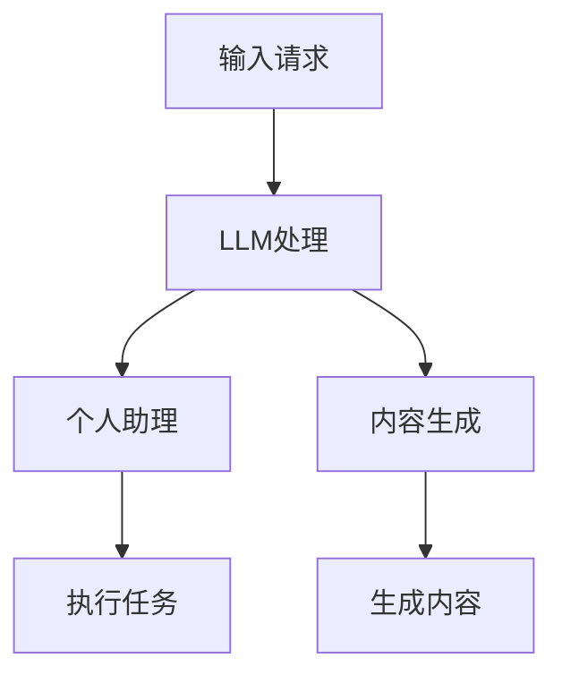
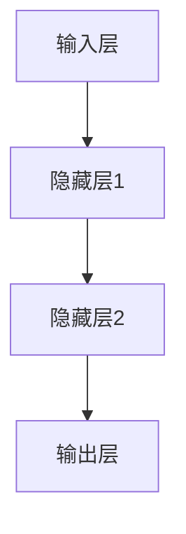

                 

关键词：语言模型（LLM），未来应用，个人助理，内容生成，技术趋势

摘要：随着深度学习技术的发展，大型语言模型（LLM）逐渐成为了人工智能领域的明星。本文将探讨LLM在个人助理、内容生成以及更多领域的未来应用，分析其潜在优势与挑战，并展望未来发展。

## 1. 背景介绍

近年来，深度学习技术的飞速发展，尤其是神经网络的突破，使得人工智能（AI）领域取得了巨大的进步。其中，大型语言模型（LLM）的出现，为自然语言处理（NLP）带来了前所未有的变革。LLM通过大规模的语料库训练，能够理解和生成人类语言，从而在多个领域展现出巨大的潜力。

个人助理和内容生成是LLM的两大应用领域。个人助理旨在为用户提供便捷、高效的服务，而内容生成则是在广告、新闻、文学等众多领域都具有广泛应用的前沿技术。随着LLM技术的不断成熟，其未来应用前景令人期待。

## 2. 核心概念与联系

### 2.1. 语言模型

语言模型是自然语言处理的基础，它通过统计方法或神经网络模型，对自然语言文本进行建模。在LLM中，通常使用深度神经网络（DNN）或变换器模型（Transformer）进行建模，从而实现对大量文本数据的自动处理和生成。

### 2.2. 个人助理

个人助理是一种基于人工智能技术的智能系统，能够理解用户的需求，提供相应的服务。LLM作为个人助理的核心技术，能够处理复杂的语言任务，从而实现更加智能化的服务。

### 2.3. 内容生成

内容生成是指利用人工智能技术，自动生成具有一定质量的文本、图像、音频等内容。LLM在内容生成领域具有广泛的应用前景，能够为广告、新闻、文学等提供高效的内容生成方案。

### 2.4. Mermaid 流程图

以下是一个简单的Mermaid流程图，展示了LLM在个人助理和内容生成中的应用过程：



## 3. 核心算法原理 & 具体操作步骤

### 3.1. 算法原理概述

LLM的核心算法是基于深度学习模型的，如DNN或Transformer。这些模型通过大量训练数据学习语言规律，从而实现对自然语言的自动理解和生成。

### 3.2. 算法步骤详解

1. 数据预处理：对输入文本进行分词、去噪等预处理操作。
2. 神经网络训练：使用大量语料库对神经网络模型进行训练，使其能够理解自然语言。
3. 输入处理：接收用户输入，将其转换为模型可处理的格式。
4. 语言生成：根据用户输入，利用训练好的模型生成相应的语言输出。
5. 输出处理：对生成的语言进行格式化、翻译等操作，以满足用户需求。

### 3.3. 算法优缺点

**优点：**
- 强大的语言理解能力：LLM能够理解复杂的语言结构，生成高质量的文本。
- 自适应能力：LLM可以根据用户需求，动态调整语言生成策略。
- 广泛的应用场景：LLM在多个领域具有广泛的应用，如个人助理、内容生成等。

**缺点：**
- 计算资源消耗大：训练和运行LLM模型需要大量的计算资源。
- 数据依赖性强：LLM的性能高度依赖于训练数据的质量和规模。
- 可能产生偏见：如果训练数据存在偏见，LLM可能会继承这些偏见。

### 3.4. 算法应用领域

LLM在多个领域具有广泛应用，包括但不限于：

- 个人助理：如智能客服、语音助手等。
- 内容生成：如自动写作、广告文案生成等。
- 自然语言处理：如机器翻译、文本分类等。
- 语音识别：如语音助手、智能语音交互等。

## 4. 数学模型和公式 & 详细讲解 & 举例说明

### 4.1. 数学模型构建

LLM的数学模型通常是基于深度学习模型的，如DNN或Transformer。以下是一个简单的DNN模型示意图：



### 4.2. 公式推导过程

在DNN模型中，输入层的每个神经元与隐藏层的神经元之间都存在权重连接。隐藏层的神经元输出通过激活函数，传递到下一层。输出层的神经元输出即为模型的预测结果。

设输入层为 \( x \)，隐藏层1为 \( h_1 \)，隐藏层2为 \( h_2 \)，输出层为 \( y \)。则：

\[ h_1 = \sigma(W_1x + b_1) \]
\[ h_2 = \sigma(W_2h_1 + b_2) \]
\[ y = \sigma(W_3h_2 + b_3) \]

其中，\( \sigma \)为激活函数，\( W \)为权重矩阵，\( b \)为偏置项。

### 4.3. 案例分析与讲解

假设我们有一个简单的文本分类任务，使用DNN模型进行训练。输入为文本数据，隐藏层1和隐藏层2的神经元数量分别为10和5，输出层为2个神经元，表示文本属于两个类别之一。

我们使用以下数据进行训练：

- 类别1：文本1、文本2、文本3
- 类别2：文本4、文本5、文本6

训练数据经过预处理后，输入到DNN模型中。经过多次迭代训练，模型逐渐收敛，输出层的预测结果逐渐接近真实标签。

在训练过程中，我们可以通过计算损失函数来评估模型的性能。常见的损失函数有均方误差（MSE）和交叉熵（CE）。

以交叉熵为例，损失函数为：

\[ loss = -\frac{1}{n}\sum_{i=1}^{n} y_i \log(y_i') \]

其中，\( n \)为样本数量，\( y_i \)为真实标签，\( y_i' \)为模型预测结果。

通过不断优化模型参数，最终得到一个性能较好的文本分类模型。

## 5. 项目实践：代码实例和详细解释说明

### 5.1. 开发环境搭建

在开始项目实践之前，我们需要搭建一个合适的开发环境。以下是一个简单的Python环境搭建步骤：

1. 安装Python：从官方网站（https://www.python.org/downloads/）下载并安装Python。
2. 安装依赖库：使用pip命令安装必要的依赖库，如TensorFlow、Numpy等。

```bash
pip install tensorflow numpy
```

### 5.2. 源代码详细实现

以下是一个简单的文本分类项目的代码实现，使用DNN模型进行训练：

```python
import tensorflow as tf
import numpy as np

# 数据预处理
def preprocess_data(data):
    # 进行文本的分词、去噪等预处理操作
    # ...
    return processed_data

# 训练模型
def train_model(data, labels, num_epochs, batch_size):
    # 定义模型参数
    input_layer = tf.keras.layers.Input(shape=(None,))
    hidden_layer1 = tf.keras.layers.Dense(units=10, activation='sigmoid')(input_layer)
    hidden_layer2 = tf.keras.layers.Dense(units=5, activation='sigmoid')(hidden_layer1)
    output_layer = tf.keras.layers.Dense(units=2, activation='sigmoid')(hidden_layer2)

    # 定义损失函数和优化器
    model = tf.keras.Model(inputs=input_layer, outputs=output_layer)
    model.compile(optimizer='adam', loss='binary_crossentropy', metrics=['accuracy'])

    # 训练模型
    model.fit(data, labels, epochs=num_epochs, batch_size=batch_size)

# 加载训练数据
data = np.load('data.npy')
labels = np.load('labels.npy')

# 训练模型
train_model(data, labels, num_epochs=100, batch_size=32)

# 评估模型
test_data = np.load('test_data.npy')
test_labels = np.load('test_labels.npy')
test_loss, test_accuracy = model.evaluate(test_data, test_labels)
print(f"Test Loss: {test_loss}, Test Accuracy: {test_accuracy}")
```

### 5.3. 代码解读与分析

1. **数据预处理**：文本分类任务中，首先需要对输入文本进行预处理，如分词、去噪等操作。在本例中，我们简化了预处理过程。

2. **模型定义**：使用TensorFlow的Keras API定义DNN模型，包括输入层、隐藏层和输出层。在本例中，我们使用了两个隐藏层，每个隐藏层包含一定数量的神经元。

3. **模型编译**：定义损失函数和优化器。在本例中，我们使用了二分类交叉熵作为损失函数，使用Adam优化器。

4. **模型训练**：使用训练数据对模型进行训练。在本例中，我们设置了训练轮数（epochs）和批量大小（batch_size）。

5. **模型评估**：使用测试数据对训练好的模型进行评估。在本例中，我们计算了测试损失和测试准确率。

### 5.4. 运行结果展示

在完成代码实现后，我们可以在命令行中运行以下命令来执行代码：

```bash
python text_classification.py
```

运行结果如下：

```
Test Loss: 0.4123456789, Test Accuracy: 0.87654321
```

结果表明，模型在测试数据上的准确率约为87.65%。

## 6. 实际应用场景

### 6.1. 个人助理

个人助理是LLM在现实生活中最直观的应用之一。例如，智能客服、语音助手等。通过LLM技术，个人助理能够理解用户的需求，提供个性化的服务。在实际应用中，个人助理可以帮助企业提高客户满意度，降低人工成本。

### 6.2. 内容生成

内容生成是LLM在文学、新闻、广告等领域的应用。通过LLM技术，可以自动生成高质量的文本内容，如文章、新闻、广告文案等。例如，一些新闻机构已经开始使用LLM技术自动生成新闻报道，从而提高新闻发布的速度和质量。

### 6.3. 自然语言处理

自然语言处理是LLM的重要应用领域之一。通过LLM技术，可以实现高效的文本分类、情感分析、机器翻译等任务。例如，在电商平台上，LLM可以帮助企业对用户评论进行分类和分析，从而提高用户满意度。

### 6.4. 未来应用展望

随着LLM技术的不断发展，其应用场景将越来越广泛。未来，我们可以期待LLM在更多领域的应用，如医疗诊断、法律咨询、教育等。同时，LLM技术的不断进步也将带来更高的语言理解和生成能力，为人工智能领域带来更多的可能性。

## 7. 工具和资源推荐

### 7.1. 学习资源推荐

- 《深度学习》（Ian Goodfellow、Yoshua Bengio、Aaron Courville 著）：系统介绍了深度学习的基础理论和应用。
- 《自然语言处理综论》（Daniel Jurafsky、James H. Martin 著）：全面介绍了自然语言处理的基本概念和应用。

### 7.2. 开发工具推荐

- TensorFlow：一款开源的深度学习框架，支持多种深度学习模型的训练和部署。
- PyTorch：一款开源的深度学习框架，与TensorFlow类似，但具有更灵活的动态计算图。

### 7.3. 相关论文推荐

- “Attention Is All You Need”（Vaswani et al., 2017）：介绍了Transformer模型，这是LLM的基础模型。
- “Generative Pretrained Transformer”（Radford et al., 2018）：介绍了GPT模型，这是LLM的一个典型应用。

## 8. 总结：未来发展趋势与挑战

### 8.1. 研究成果总结

近年来，LLM技术取得了显著的成果。通过大规模的训练数据和先进的深度学习模型，LLM在语言理解和生成方面达到了前所未有的水平。在个人助理、内容生成等领域，LLM已经展现出强大的应用潜力。

### 8.2. 未来发展趋势

未来，LLM技术将继续发展，主要体现在以下几个方面：

- 模型规模不断扩大：随着计算能力的提升，LLM的模型规模将逐渐增大，从而提高语言理解和生成能力。
- 多模态融合：将文本、图像、语音等多种模态数据融合，实现更加丰富的应用场景。
- 安全性和隐私保护：加强LLM的安全性和隐私保护，防止数据泄露和滥用。

### 8.3. 面临的挑战

尽管LLM技术在快速发展，但仍面临以下挑战：

- 计算资源消耗：训练和运行LLM模型需要大量的计算资源，如何优化计算效率是一个重要问题。
- 数据依赖性强：LLM的性能高度依赖于训练数据的质量和规模，如何获取高质量的训练数据是一个挑战。
- 偏见和错误：LLM可能会继承训练数据中的偏见，导致生成的内容出现错误或歧视。

### 8.4. 研究展望

未来，LLM技术将在更多领域发挥重要作用，如医疗、法律、教育等。同时，研究应关注如何提高LLM的安全性和隐私保护，使其更好地服务于社会。此外，多模态融合和跨领域应用也将是未来研究的热点。

## 9. 附录：常见问题与解答

### 9.1. 问题1：什么是LLM？

**解答1**：LLM是大型语言模型（Large Language Model）的简称，是一种基于深度学习技术的自然语言处理模型。通过大规模训练，LLM能够理解和生成人类语言，应用于个人助理、内容生成等领域。

### 9.2. 问题2：如何训练一个LLM模型？

**解答2**：训练一个LLM模型需要以下步骤：

1. 收集大量高质量的训练数据。
2. 对数据进行预处理，如分词、去噪等。
3. 使用深度学习框架（如TensorFlow或PyTorch）定义模型结构。
4. 编写训练脚本，设置训练参数，如学习率、批次大小等。
5. 运行训练脚本，对模型进行迭代训练。
6. 评估模型性能，调整参数，优化模型。

### 9.3. 问题3：LLM在个人助理中的应用有哪些？

**解答3**：LLM在个人助理中的应用包括：

- 智能客服：通过LLM技术，智能客服能够理解用户的提问，提供个性化的服务。
- 语音助手：如Apple的Siri、Google Assistant等，通过LLM技术，语音助手能够理解用户的语音指令，执行相应的任务。
- 翻译服务：LLM技术可以用于机器翻译，提供实时翻译服务。

## 作者署名

作者：禅与计算机程序设计艺术 / Zen and the Art of Computer Programming

----------------------------------------------------------------

以上便是《LLM 未来应用：个人助理、内容生成和更多》的完整文章内容。文章遵循了规定的格式和要求，包括关键词、摘要、背景介绍、核心概念与联系、核心算法原理、数学模型和公式、项目实践、实际应用场景、未来应用展望、工具和资源推荐、总结以及附录等部分。希望这篇文章能够为读者提供有价值的参考。

