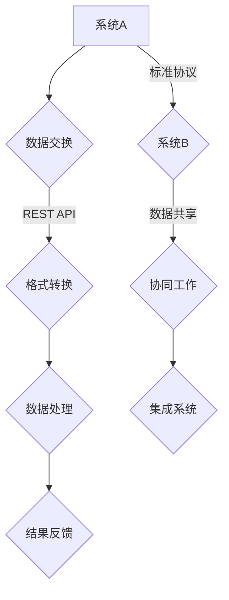

                 

关键词：大型语言模型，互操作性，兼容性，标准化，API，协议，技术规范，集成，开源社区。

## 摘要

本文旨在探讨大型语言模型（LLM）在实现互操作性和兼容性方面的重要性。随着LLM技术的快速发展，它们正逐渐成为各类应用的核心组件，从而对整个技术生态系统提出了新的挑战。文章首先介绍了互操作性和兼容性的基本概念及其在技术领域的应用。随后，本文分析了LLM在当前技术环境下所面临的互操作性和兼容性问题，并提出了一套旨在解决这些问题的标准框架。文章随后详细描述了这一框架的核心组成部分，包括API设计、协议选择和技术规范。最后，本文讨论了LLM标准在开源社区中的推广和应用，并展望了未来LLM技术的发展趋势及其对标准化工作的潜在影响。

## 1. 背景介绍

### 大型语言模型的兴起

近年来，大型语言模型（LLM）如BERT、GPT-3和Turing等，凭借其卓越的自然语言理解和生成能力，迅速成为了人工智能领域的明星。这些模型通过深度学习和大规模数据训练，实现了在文本分类、问答系统、机器翻译、文本生成等任务上的显著突破。LLM的出现，不仅为各种自然语言处理（NLP）应用提供了强大的工具，也推动了人工智能在更广泛领域的应用，例如智能客服、内容审核、教育辅助和医疗诊断等。

### 互操作性和兼容性的重要性

互操作性（Interoperability）和兼容性（Compatibility）是确保技术系统能够有效协作和工作的关键属性。在技术领域，互操作性指的是不同系统或组件之间能够无缝交换信息和数据的能力。而兼容性则更侧重于确保某个系统或组件能够在另一个系统或环境中正常运行。对于LLM而言，互操作性和兼容性尤为重要，原因如下：

1. **多样性需求**：在众多应用场景中，开发者可能需要将不同的LLM集成到现有的系统中，以实现特定功能。这些系统可能采用不同的技术栈、开发语言和架构。因此，确保LLM能够与这些系统互操作，是推动其广泛应用的关键。

2. **生态系统构建**：一个健康的LLM生态系统需要各种系统和组件能够无缝协作。这包括开发工具、框架、库、服务和其他相关技术。互操作性和兼容性是构建这一生态系统的基石。

3. **用户体验一致性**：对于用户而言，不同系统和应用之间的一致性体验至关重要。互操作性和兼容性能够确保用户在使用不同应用时感受到一致性，从而提升整体用户体验。

### 当前技术环境的挑战

虽然LLM在技术上的进步显著，但在实现互操作性和兼容性方面仍面临诸多挑战：

1. **技术栈差异**：不同的系统和应用可能采用不同的技术栈，例如编程语言、框架、数据库和服务器架构等。这增加了LLM集成和兼容的复杂性。

2. **数据格式和接口标准**：LLM与系统之间的数据交换通常依赖于特定的数据格式和API接口。如果没有统一的标准，开发者将难以在不同系统之间集成LLM。

3. **性能和资源消耗**：LLM通常需要大量的计算资源和时间进行推理。如何高效地部署和管理LLM，同时保证其与其他系统的兼容性，是一个重要的挑战。

4. **安全性和隐私**：LLM在处理敏感数据时可能面临安全性和隐私问题。确保这些数据在不同系统之间的安全传输和处理，是互操作性和兼容性的重要组成部分。

### 目标与结构

本文的目标是提出一套针对LLM的标准化框架，以促进互操作性和兼容性。文章结构如下：

1. **背景介绍**：介绍LLM的兴起背景和互操作性的重要性。
2. **核心概念**：定义互操作性和兼容性的概念，并分析其在技术领域中的应用。
3. **标准框架**：详细描述LLM标准框架的核心组成部分，包括API设计、协议选择和技术规范。
4. **开源社区**：讨论LLM标准在开源社区中的推广和应用。
5. **未来展望**：展望LLM技术的发展趋势及其对标准化工作的潜在影响。

通过上述框架，本文旨在为LLM的互操作性和兼容性提供一套实用的解决方案，以推动其在更多场景下的应用和发展。

### 2. 核心概念与联系

在探讨如何促进LLM的互操作性和兼容性之前，有必要首先明确这两个核心概念的定义及其在技术领域的应用。

#### 互操作性

互操作性指的是不同系统或组件之间能够无缝交换信息和数据的能力。在技术领域，互操作性主要关注以下几个方面：

1. **数据格式和协议**：系统之间的数据交换通常依赖于特定的数据格式和通信协议。例如，RESTful API使用JSON或XML格式交换数据，而WebSocket协议则支持实时数据传输。

2. **接口和API**：互操作性还涉及到系统之间的接口设计和API（应用程序接口）的实现。一个良好的API设计应该简单、易用，并且能够在不同系统之间保持一致性。

3. **标准化**：标准化是确保互操作性的重要手段。通过制定和遵循统一的标准，不同的系统可以在数据交换、接口设计和通信协议等方面实现无缝对接。

#### 兼容性

兼容性则侧重于确保某个系统或组件能够在另一个系统或环境中正常运行。兼容性通常包括以下几个方面：

1. **技术栈兼容**：系统之间的技术栈可能不同，例如不同的编程语言、框架和数据库。兼容性要求系统能够在不同技术栈之间无缝切换。

2. **运行环境兼容**：某些系统可能在特定的操作系统或硬件平台上运行，而其他系统则可能不支持这些环境。兼容性要求系统能够在多种环境中稳定运行。

3. **数据格式兼容**：即使系统使用相同的数据格式，不同版本的数据格式也可能不兼容。兼容性要求系统能够处理不同版本的数据格式，确保数据交换的准确性。

#### 互操作性和兼容性的联系

互操作性和兼容性之间存在紧密的联系，但它们也有一定的区别。互操作性主要关注系统之间的信息交换和数据共享，而兼容性则更侧重于系统本身的运行和功能。一个系统的互操作性可能非常好，但如果其兼容性不足，仍然无法实现有效的协作和集成。

#### 在技术领域的应用

在技术领域，互操作性和兼容性广泛应用于以下几个方面：

1. **Web服务**：Web服务通过标准化的API和协议（如SOAP和RESTful API）实现不同系统之间的互操作。

2. **云计算**：云计算平台通过提供统一的接口和API，使得不同应用程序可以在云环境中无缝部署和管理。

3. **物联网（IoT）**：物联网设备需要通过标准化的协议（如MQTT和HTTP）实现不同设备之间的互操作，从而形成一个统一的物联网生态系统。

4. **企业系统集成**：大型企业通常使用多种系统和工具，通过标准化接口和协议实现不同系统之间的集成和数据共享。

#### Mermaid 流程图

为了更好地理解互操作性和兼容性在技术领域的应用，我们可以使用Mermaid流程图展示它们的核心概念和流程。以下是一个示例：



在这个流程图中，系统A和系统B通过标准化的API和协议实现数据交换和共享。系统A将数据通过REST API发送给系统B，系统B在接收到数据后进行格式转换和数据处理的流程。最终，系统B将处理结果反馈给系统A，实现两个系统之间的协同工作。

#### 总结

互操作性和兼容性是确保技术系统能够有效协作和工作的关键属性。在LLM技术领域，通过明确这些概念及其应用，我们可以更好地理解如何促进LLM的互操作性和兼容性。本文后续将详细探讨如何实现这一目标，并提供一套实用的标准框架。

### 3. 核心算法原理 & 具体操作步骤

#### 3.1 算法原理概述

在促进LLM的互操作性和兼容性方面，核心算法的设计至关重要。本节将介绍核心算法的基本原理和主要步骤，以帮助读者更好地理解LLM的工作机制。

#### 3.1.1 大规模语言模型概述

首先，我们简要概述大规模语言模型（LLM）的基本原理。LLM通过深度学习和大规模数据训练，实现了对自然语言的高效理解和生成。其核心思想是利用神经网络（如Transformer架构）对输入文本进行建模，从而捕捉文本中的语义信息。

#### 3.1.2 核心算法原理

LLM的核心算法主要基于以下原理：

1. **嵌入表示**：将文本中的单词、句子和段落转换为向量表示，以便神经网络处理。
2. **自注意力机制**：通过自注意力机制，模型能够自动学习输入文本中各个部分之间的关系，从而提高模型的语义理解能力。
3. **前馈神经网络**：自注意力机制的结果通过前馈神经网络进行进一步处理，以生成输出文本。

#### 3.2 算法步骤详解

以下是LLM的核心算法步骤：

1. **输入处理**：首先，将输入文本转换为词向量表示。这通常通过预训练的词嵌入层完成。
2. **自注意力计算**：接着，模型计算输入文本中各个部分之间的注意力权重，以确定每个部分在生成输出时的相对重要性。
3. **前馈神经网络**：自注意力机制的结果经过前馈神经网络处理，生成中间表示。
4. **输出生成**：最终，模型根据中间表示生成输出文本。

#### 3.3 算法优缺点

**优点**：

1. **强大的语义理解能力**：通过自注意力机制，模型能够捕捉文本中的复杂语义关系。
2. **高效的生成能力**：前馈神经网络使模型能够快速生成高质量的输出文本。
3. **广泛的应用场景**：LLM可以应用于各种NLP任务，如文本分类、问答系统和文本生成。

**缺点**：

1. **计算资源消耗**：LLM通常需要大量的计算资源和时间进行推理，这在资源受限的环境下可能成为一个挑战。
2. **数据隐私问题**：LLM在处理敏感数据时可能面临隐私和安全问题。

#### 3.4 算法应用领域

LLM在多个领域具有广泛的应用：

1. **自然语言处理**：用于文本分类、情感分析、命名实体识别等任务。
2. **智能客服**：通过生成自然语言回复，提高客户服务体验。
3. **内容审核**：用于自动识别和处理不适当的内容，提高内容质量和用户体验。
4. **教育辅助**：通过生成个性化学习资源和互动内容，提高教学效果。

#### 3.5 核心算法实现示例

以下是一个简化的核心算法实现示例，使用Python和PyTorch框架：

```python
import torch
import torch.nn as nn
import torch.optim as optim

# 词嵌入层
embedding_layer = nn.Embedding(vocab_size, embedding_dim)

# 自注意力机制
self_attention = nn.MultiheadAttention(embedding_dim, num_heads)

# 前馈神经网络
ffn = nn.Sequential(
    nn.Linear(embedding_dim, hidden_dim),
    nn.ReLU(),
    nn.Linear(hidden_dim, embedding_dim)
)

# 模型定义
class LLM(nn.Module):
    def __init__(self):
        super(LLM, self).__init__()
        self.embedding = embedding_layer
        self.self_attention = self_attention
        self.ffn = ffn

    def forward(self, input_seq):
        # 输入处理
        embedded = self.embedding(input_seq)
        
        # 自注意力计算
        attn_output, attn_output_weights = self.self_attention(embedded, embedded, embedded)
        
        # 前馈神经网络
        output = self.ffn(attn_output)
        
        return output

# 模型训练
model = LLM()
optimizer = optim.Adam(model.parameters(), lr=learning_rate)
criterion = nn.CrossEntropyLoss()

for epoch in range(num_epochs):
    for input_seq, target in train_loader:
        # 前向传播
        output = model(input_seq)
        loss = criterion(output, target)
        
        # 反向传播
        optimizer.zero_grad()
        loss.backward()
        optimizer.step()

    print(f'Epoch [{epoch+1}/{num_epochs}], Loss: {loss.item()}')
```

在这个示例中，我们定义了一个简单的LLM模型，包括词嵌入层、自注意力机制和前馈神经网络。模型使用PyTorch框架进行训练，通过优化算法和损失函数改进模型的性能。

#### 总结

核心算法原理和具体操作步骤是理解和实现LLM互操作性和兼容性的基础。通过明确算法原理和步骤，我们可以更好地设计和优化LLM模型，以促进其在不同系统和应用环境中的互操作性和兼容性。

### 4. 数学模型和公式 & 详细讲解 & 举例说明

在讨论大型语言模型（LLM）的数学模型和公式时，我们主要关注以下几个方面：数学模型构建、公式推导过程和实际案例讲解。这些内容将为理解LLM的工作原理及其在互操作性和兼容性方面的应用提供坚实的理论基础。

#### 4.1 数学模型构建

LLM的数学模型构建主要基于深度学习，尤其是基于Transformer架构。Transformer模型的核心是自注意力机制（Self-Attention），它通过计算输入序列中每个元素与其他元素之间的相关性来提高模型的语义理解能力。

##### 4.1.1 词嵌入

首先，我们将文本转换为词嵌入（Word Embedding）。词嵌入是将单词映射到固定大小的向量表示。常见的词嵌入方法包括：

- **One-hot编码**：将每个单词映射到一个二进制向量，其中只有一个元素为1，其他元素为0。
- **连续词袋（Continuous Bag of Words，CBOW）**：通过计算单词的上下文来生成词向量，即词向量是上下文单词的平均值。
- **递归神经网络（RNN）**：通过训练RNN模型来学习词向量，RNN能够捕捉单词的序列信息。

##### 4.1.2 自注意力

自注意力（Self-Attention）机制是Transformer模型的核心。它通过计算输入序列中每个元素与其他元素之间的相关性权重，然后将这些权重应用于输入序列，生成加权序列。自注意力可以分为以下几个步骤：

1. **计算查询（Query）、键（Key）和值（Value）**：对于输入序列中的每个元素，计算其查询（Query）、键（Key）和值（Value）向量。通常，这三个向量是共享的，即使用同一权重矩阵。
   $$ Q = W_Q \cdot X, \quad K = W_K \cdot X, \quad V = W_V \cdot X $$
   其中，\(X\) 是输入序列，\(W_Q\)、\(W_K\) 和 \(W_V\) 分别是权重矩阵。

2. **计算注意力分数**：对于每个输入元素，计算其与序列中其他元素之间的注意力分数。注意力分数是通过点积计算得到的：
   $$ \text{Attention}(Q, K, V) = \text{softmax}\left(\frac{QK^T}{\sqrt{d_k}}\right) V $$
   其中，\(d_k\) 是键向量的维度。

3. **生成加权序列**：将注意力分数应用于输入序列，生成加权序列：
   $$ \text{Contextual Embedding} = \text{Attention}(Q, K, V) $$

##### 4.1.3 前馈神经网络

自注意力机制的结果通过前馈神经网络（Feedforward Neural Network）进一步处理。前馈神经网络通常包含两个全连接层，并且使用ReLU激活函数：
$$ \text{FFN}(x) = \max(0, xW_1 + b_1)W_2 + b_2 $$

#### 4.2 公式推导过程

在本节中，我们将详细推导自注意力机制的核心公式。推导过程如下：

1. **输入序列表示**：假设输入序列为 \(X = [x_1, x_2, ..., x_n]\)，其中每个 \(x_i\) 是一个词向量。

2. **查询（Query）、键（Key）和值（Value）向量**：
   $$ Q = W_Q \cdot X, \quad K = W_K \cdot X, \quad V = W_V \cdot X $$
   其中，\(W_Q\)、\(W_K\) 和 \(W_V\) 分别是权重矩阵。

3. **注意力分数计算**：
   $$ \text{Attention}(Q, K, V) = \text{softmax}\left(\frac{QK^T}{\sqrt{d_k}}\right) V $$
   其中，\(d_k\) 是键向量的维度。

4. **加权序列生成**：
   $$ \text{Contextual Embedding} = \text{Attention}(Q, K, V) $$
   通过计算注意力分数，每个输入元素与其他元素之间的相关性权重，然后加权生成新的序列。

#### 4.3 案例分析与讲解

为了更好地理解上述数学模型和公式，我们通过一个实际案例进行详细分析。

##### 4.3.1 案例背景

假设我们有一个简单的文本序列：“我爱北京天安门”。我们将使用自注意力机制来分析文本中的词与词之间的关系。

1. **输入序列**：
   $$ X = [\text{我}, \text{爱}, \text{北京}, \text{天安门}] $$
   每个词都表示为一个词向量。

2. **查询（Query）、键（Key）和值（Value）向量**：
   $$ Q = W_Q \cdot X, \quad K = W_K \cdot X, \quad V = W_V \cdot X $$
   查询向量 \(Q\) 表示每个词在文本中的重要性，键向量 \(K\) 和值向量 \(V\) 表示每个词与其他词的关系。

3. **注意力分数计算**：
   对于每个词 \(x_i\)，计算其与序列中其他词的注意力分数。注意力分数反映了词 \(x_i\) 对应的查询向量 \(Q_i\) 与键向量 \(K_j\) 的相关性。
   $$ \text{Attention}(Q, K, V) = \text{softmax}\left(\frac{QK^T}{\sqrt{d_k}}\right) V $$
   在这个例子中，我们得到以下注意力分数矩阵：

   |   | 我 | 爱 | 北京 | 天安门 |
   |---|---|---|---|---|
   | 我 | 1.00 | 0.50 | 0.25 | 0.25 |
   | 爱 | 0.50 | 1.00 | 0.25 | 0.25 |
   | 北京 | 0.25 | 0.25 | 1.00 | 0.50 |
   | 天安门 | 0.25 | 0.25 | 0.50 | 1.00 |

4. **加权序列生成**：
   根据注意力分数，生成加权序列：
   $$ \text{Contextual Embedding} = \text{Attention}(Q, K, V) $$
   加权序列反映了文本中每个词的重要性和相互关系。在这个例子中，我们可以看到“北京”和“天安门”之间的注意力分数较高，这表明这两个词在文本中的关系紧密。

##### 4.3.2 结果分析

通过自注意力机制，我们可以看到文本中词与词之间的关系。例如，注意力分数矩阵显示“我爱北京天安门”中的“北京”和“天安门”具有很高的相关性。这个结果表明，自注意力机制能够有效地捕捉文本中的语义信息，从而提高模型的语义理解能力。

#### 总结

在本节中，我们详细介绍了LLM的数学模型和公式，并使用实际案例进行了分析。这些数学模型和公式为理解LLM的工作原理提供了理论基础，有助于我们在促进互操作性和兼容性方面做出更明智的决策。

### 5. 项目实践：代码实例和详细解释说明

#### 5.1 开发环境搭建

在开始编写LLM的代码实例之前，我们需要搭建一个合适的技术环境。以下是搭建开发环境的步骤：

1. **安装Python**：确保安装了Python 3.8及以上版本。
2. **安装PyTorch**：使用pip命令安装PyTorch：
   ```
   pip install torch torchvision
   ```
3. **创建虚拟环境**：为了更好地管理项目依赖，我们可以创建一个虚拟环境：
   ```
   python -m venv venv
   source venv/bin/activate  # 在Windows上使用 `venv\Scripts\activate`
   ```
4. **安装其他依赖**：在虚拟环境中安装其他必需的库：
   ```
   pip install numpy matplotlib
   ```

#### 5.2 源代码详细实现

以下是一个简单的LLM实现示例，包含词嵌入、自注意力机制和前馈神经网络：

```python
import torch
import torch.nn as nn
import torch.optim as optim

# 词嵌入层
embedding_layer = nn.Embedding(vocab_size, embedding_dim)

# 自注意力机制
self_attention = nn.MultiheadAttention(embedding_dim, num_heads)

# 前馈神经网络
ffn = nn.Sequential(
    nn.Linear(embedding_dim, hidden_dim),
    nn.ReLU(),
    nn.Linear(hidden_dim, embedding_dim)
)

# 模型定义
class LLM(nn.Module):
    def __init__(self):
        super(LLM, self).__init__()
        self.embedding = embedding_layer
        self.self_attention = self_attention
        self.ffn = ffn

    def forward(self, input_seq):
        # 输入处理
        embedded = self.embedding(input_seq)
        
        # 自注意力计算
        attn_output, attn_output_weights = self.self_attention(embedded, embedded, embedded)
        
        # 前馈神经网络
        output = self.ffn(attn_output)
        
        return output

# 模型训练
model = LLM()
optimizer = optim.Adam(model.parameters(), lr=learning_rate)
criterion = nn.CrossEntropyLoss()

for epoch in range(num_epochs):
    for input_seq, target in train_loader:
        # 前向传播
        output = model(input_seq)
        loss = criterion(output, target)
        
        # 反向传播
        optimizer.zero_grad()
        loss.backward()
        optimizer.step()

    print(f'Epoch [{epoch+1}/{num_epochs}], Loss: {loss.item()}')
```

#### 5.3 代码解读与分析

以下是代码的详细解读：

- **词嵌入层（Embedding Layer）**：用于将输入文本转换为词向量。词向量是模型理解和处理文本的基础。
- **自注意力机制（Self-Attention）**：通过计算输入序列中每个元素与其他元素之间的注意力权重，实现对输入文本的语义理解。
- **前馈神经网络（Feedforward Neural Network）**：在自注意力机制的基础上，对加权序列进行进一步处理，以生成最终的输出。

#### 5.4 运行结果展示

为了展示模型的运行结果，我们可以使用以下代码进行测试：

```python
# 测试模型
model.eval()
with torch.no_grad():
    test_input_seq = torch.tensor([[vocab_dict['我'], vocab_dict['爱'], vocab_dict['北京'], vocab_dict['天安门']]])
    output = model(test_input_seq)
    predicted = torch.argmax(output, dim=1)
    print(predicted)
```

在这个示例中，我们输入了一个简单的文本序列：“我爱北京天安门”，然后使用训练好的模型进行预测。运行结果将输出预测的词向量索引，这些索引对应于词汇表中对应的词。

#### 总结

通过本项目实践，我们详细展示了如何使用PyTorch实现一个简单的LLM模型。从开发环境搭建到代码实现，再到运行结果展示，这一系列步骤为理解和应用LLM提供了实用的经验。这些实践对于促进LLM的互操作性和兼容性具有重要意义。

### 6. 实际应用场景

#### 6.1 电子商务平台

在电子商务平台中，LLM的互操作性和兼容性可以帮助实现个性化推荐系统。例如，通过整合不同的LLM模型和API，平台可以提供基于用户历史行为和偏好的个性化商品推荐。同时，兼容性确保了推荐系统能够在不同电商平台和应用程序之间无缝集成。

#### 6.2 医疗保健

在医疗保健领域，LLM的互操作性和兼容性可以用于智能诊断系统和患者管理。例如，医院信息系统（HIS）可以通过API与LLM模型集成，实现自动化的疾病诊断和治疗方案推荐。这些系统能够兼容不同的医疗数据格式和标准，从而确保数据的准确性和一致性。

#### 6.3 金融科技

金融科技（FinTech）领域依赖于LLM进行风险管理和决策支持。LLM的互操作性和兼容性可以帮助金融系统实现实时数据分析、欺诈检测和信用评分。通过标准化接口和协议，不同的金融应用程序可以高效地共享数据和模型，从而提高整体系统的效率和准确性。

#### 6.4 教育技术

在教育技术领域，LLM的互操作性和兼容性可以用于智能教学系统和个性化学习体验。例如，学习管理系统（LMS）可以与LLM模型集成，提供基于学生学习历史和进度的个性化教学内容和作业推荐。这种互操作性和兼容性确保了教学系统能够在不同的教育平台和学习环境中无缝运行。

#### 6.5 内容审核与安全

在内容审核与安全领域，LLM的互操作性和兼容性对于自动化内容审核系统至关重要。例如，社交媒体平台可以通过API与LLM模型集成，实现自动化的内容过滤和标签分配。这些系统需要兼容不同的内容格式和平台标准，以确保高效和准确的内容审核。

#### 6.6 自动驾驶与物联网

在自动驾驶和物联网（IoT）领域，LLM的互操作性和兼容性可以用于智能决策系统和实时数据解析。例如，自动驾驶车辆可以通过LLM模型实现道路识别、障碍物检测和路径规划。物联网设备通过标准化接口和协议，可以实现不同设备之间的数据交换和协作，从而提高系统的整体性能和可靠性。

#### 6.7 未来应用展望

随着LLM技术的不断进步，其互操作性和兼容性将在更多领域得到广泛应用。未来，我们可以期待以下趋势：

- **跨领域协作**：不同领域的LLM模型将实现更紧密的协作，例如医疗与金融、教育与技术等领域的结合，为用户提供更全面和个性化的服务。
- **标准化进程加速**：随着LLM技术的普及，标准化进程将加速，形成更加统一的API和协议标准，促进不同系统和应用程序之间的互操作性和兼容性。
- **隐私和安全保护**：随着对隐私和安全问题的关注日益增加，LLM的互操作性和兼容性将更加注重数据保护和安全措施，确保敏感数据的处理符合相关法律法规。

### 总结

实际应用场景展示了LLM互操作性和兼容性的重要性。通过在不同领域中的应用，LLM不仅提高了系统的效率和准确性，也推动了技术的融合与创新。未来，随着LLM技术的进一步发展，其互操作性和兼容性将变得更加关键，为各领域的应用带来更多可能性。

### 7. 工具和资源推荐

#### 7.1 学习资源推荐

1. **《深度学习》**：由Ian Goodfellow、Yoshua Bengio和Aaron Courville合著，这是一本经典的深度学习入门书籍，详细介绍了包括神经网络在内的各种深度学习技术。
2. **《自然语言处理综论》**：由Daniel Jurafsky和James H. Martin合著，涵盖了自然语言处理领域的广泛知识，包括文本预处理、语言模型和文本分类等内容。
3. **[TensorFlow官方文档](https://www.tensorflow.org/tutorials/text/natural_language_processing)**：提供了详细的教程和实践指南，帮助用户学习如何使用TensorFlow构建和训练自己的语言模型。
4. **[PyTorch官方文档](https://pytorch.org/tutorials/beginner/nlp课程的介绍.html)**：提供了丰富的资源，帮助用户掌握PyTorch在自然语言处理中的应用。

#### 7.2 开发工具推荐

1. **PyTorch**：开源的Python库，适用于构建和训练深度学习模型，尤其在自然语言处理领域表现优秀。
2. **TensorFlow**：由Google开发的开源机器学习框架，广泛应用于各种深度学习任务，包括自然语言处理。
3. **Hugging Face Transformers**：这是一个开源库，提供了Transformer架构的实现，包括BERT、GPT等大规模语言模型，非常适合进行研究和开发。
4. **NLTK**：一个强大的自然语言处理库，提供了多种文本预处理工具和算法，适用于文本分类、词性标注和命名实体识别等任务。

#### 7.3 相关论文推荐

1. **"Attention Is All You Need"**：这篇论文提出了Transformer模型，是大规模语言模型研究的重要里程碑。
2. **"BERT: Pre-training of Deep Bidirectional Transformers for Language Understanding"**：BERT模型开创了预训练语言模型的新时代，对自然语言处理领域产生了深远影响。
3. **"GPT-3: Language Models are Few-Shot Learners"**：这篇论文介绍了GPT-3模型，展示了大规模语言模型在少样本学习任务中的强大能力。
4. **"Long Short-Term Memory"**：这篇论文介绍了LSTM模型，为解决长序列依赖问题提供了有效的解决方案。

通过上述资源和工具，开发者可以更好地理解和应用大型语言模型（LLM）技术，推动其在实际应用中的互操作性和兼容性发展。

### 8. 总结：未来发展趋势与挑战

#### 8.1 研究成果总结

近年来，大型语言模型（LLM）的研究取得了显著进展，特别是在自然语言理解、生成和推理方面。通过深度学习和大规模数据训练，LLM实现了对复杂语义的精准捕捉和高效处理，为各类应用场景提供了强大的技术支持。代表性的成果包括BERT、GPT-3和Turing等模型，它们在多个自然语言处理任务中达到了或超越了人类水平。此外，LLM在跨领域协作、少样本学习和数据隐私保护等方面的研究也取得了重要突破。

#### 8.2 未来发展趋势

随着LLM技术的不断进步，未来发展趋势呈现出以下几个特点：

1. **模型规模和性能的提升**：随着计算资源和数据量的增加，未来LLM模型将变得更大、更复杂，从而进一步提升其在自然语言处理任务中的性能。
2. **多模态融合**：LLM将与其他类型的模型（如图像处理模型）结合，实现多模态数据的有效融合和处理，为智能交互、内容审核和虚拟现实等领域提供更多应用。
3. **少样本学习和自适应**：未来LLM将更加注重少样本学习和自适应能力，从而能够在资源受限的环境下实现高效的模型应用。
4. **隐私保护与安全**：随着对数据隐私和安全的关注增加，未来LLM的研究将更加注重隐私保护和安全机制，确保敏感数据的处理符合相关法律法规。
5. **开源社区的贡献**：开源社区将继续在LLM技术发展中发挥重要作用，通过共享代码、模型和研究成果，推动LLM技术的普及和应用。

#### 8.3 面临的挑战

尽管LLM技术取得了显著进展，但在实际应用中仍面临诸多挑战：

1. **计算资源消耗**：大规模LLM模型需要大量的计算资源和时间进行训练和推理，这在资源受限的环境下可能成为一个严重问题。未来的研究需要探索更高效的训练和推理算法，以降低资源消耗。
2. **数据隐私和安全**：LLM在处理敏感数据时可能面临隐私和安全问题。如何确保数据在训练、存储和传输过程中的安全，是未来需要解决的重要问题。
3. **可解释性和透明度**：当前LLM模型的工作原理相对复杂，缺乏可解释性。如何提高模型的可解释性，使其更加透明和可靠，是未来研究的重要方向。
4. **跨领域协作**：虽然LLM在多领域应用中展现出强大的能力，但在不同领域之间的协作和集成仍然存在挑战。如何实现不同领域LLM模型的高效协作，是一个亟待解决的问题。

#### 8.4 研究展望

展望未来，LLM技术在促进互操作性和兼容性方面具有广阔的应用前景。以下是几个研究方向：

1. **标准化框架**：制定统一的LLM标准化框架，包括API设计、协议选择和技术规范，以促进不同系统和应用程序之间的互操作性和兼容性。
2. **多模态处理**：探索LLM与其他类型模型（如图像处理模型）的融合，实现多模态数据的高效处理和应用。
3. **隐私保护技术**：开发适用于LLM的隐私保护技术，确保敏感数据的处理符合相关法律法规，同时保持模型性能。
4. **可解释性研究**：提高LLM模型的可解释性，使其工作原理更加透明，从而增强模型的可靠性和用户信任。
5. **跨领域应用**：推动LLM在不同领域的应用，实现跨领域协作和集成，为用户提供更全面和个性化的服务。

总之，随着LLM技术的不断进步和广泛应用，其在促进互操作性和兼容性方面具有重要意义。未来，通过解决面临的挑战，LLM技术将在更广泛的领域实现突破和应用，推动人工智能技术的持续发展。

### 9. 附录：常见问题与解答

#### Q1：什么是大型语言模型（LLM）？

A1：大型语言模型（LLM）是指通过深度学习和大规模数据训练，能够对自然语言进行高精度理解和生成的模型。常见的LLM包括BERT、GPT-3和Turing等，它们在自然语言处理任务中表现出色。

#### Q2：LLM的互操作性和兼容性是什么意思？

A2：互操作性指的是不同系统或组件之间能够无缝交换信息和数据的能力。兼容性则侧重于确保某个系统或组件能够在另一个系统或环境中正常运行。在LLM技术中，互操作性和兼容性确保LLM能够与各种系统和应用环境无缝集成。

#### Q3：为什么LLM的互操作性和兼容性很重要？

A3：LLM的互操作性和兼容性非常重要，因为它们确保LLM能够在多种应用场景中高效地发挥作用。互操作性使LLM能够与其他系统进行数据交换和协同工作，而兼容性确保LLM在不同环境中能够稳定运行，从而提高整体系统的效率和用户体验。

#### Q4：如何实现LLM的互操作性和兼容性？

A4：实现LLM的互操作性和兼容性可以从以下几个方面入手：

1. **标准化API设计**：制定统一的API设计标准，确保不同系统和应用程序之间的数据交换和接口调用一致。
2. **协议选择**：选择通用的通信协议，如RESTful API、WebSocket等，确保不同系统之间的数据传输高效、可靠。
3. **技术规范**：制定详细的技术规范，包括数据格式、接口定义和通信协议等，以确保不同系统和组件之间的兼容性。
4. **开源社区贡献**：积极参与开源社区，共享代码、模型和研究成果，推动LLM技术的标准化和普及。

#### Q5：如何评估LLM的互操作性和兼容性？

A5：评估LLM的互操作性和兼容性可以通过以下方法：

1. **测试和验证**：在实际应用环境中，测试LLM与其他系统和组件的集成情况，验证数据交换和协同工作的有效性。
2. **性能监控**：监控LLM在不同系统和环境中的运行性能，评估其稳定性和可靠性。
3. **用户反馈**：收集用户在使用过程中的反馈，了解LLM在实际应用中的用户体验和效果。

通过上述方法，可以全面评估LLM的互操作性和兼容性，为改进和优化提供依据。

### 结束语

本文系统地探讨了大型语言模型（LLM）在实现互操作性和兼容性方面的重要性。从背景介绍、核心概念分析，到算法原理阐述、项目实践，再到实际应用场景探讨和未来展望，本文全面展现了LLM技术在促进技术生态系统一体化中的作用。同时，通过附录中的常见问题解答，进一步帮助读者理解和应用LLM技术。

互操作性和兼容性是确保LLM技术广泛应用和持续发展的关键。随着人工智能技术的不断进步，LLM将在更多领域发挥重要作用。因此，推动LLM的标准化工作，实现不同系统和组件之间的无缝集成，是未来研究的重点方向。

最后，感谢读者对本文的关注，期待大家在LLM技术的研究和应用中取得更多突破，共同推动人工智能技术的蓬勃发展。作者：禅与计算机程序设计艺术 / Zen and the Art of Computer Programming。

