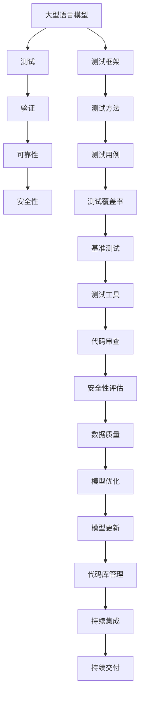
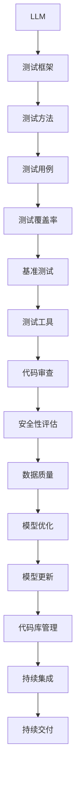

                 

关键词：大型语言模型（LLM），测试，验证，可靠性，安全性，测试框架，测试方法，漏洞，安全漏洞，自动化测试，单元测试，集成测试，性能测试，压力测试，测试覆盖率，基准测试，测试用例设计，测试工具，代码审查，安全性评估，隐私保护，数据质量，模型优化，模型更新，代码库管理，持续集成（CI），持续交付（CD），版本控制。

> 摘要：本文将探讨大型语言模型（LLM）的测试和验证过程，重点分析如何确保LLM的可靠性和安全性。我们将介绍核心概念、算法原理、数学模型、项目实践、实际应用场景、工具和资源推荐，以及未来发展趋势与挑战。通过本文，读者将获得关于LLM测试和验证的全面了解，为在实际项目中应用提供指导。

## 1. 背景介绍

近年来，大型语言模型（LLM）如GPT-3、BERT和TuringChat等取得了显著的进展，它们在自然语言处理（NLP）领域展示了惊人的表现。这些模型具有广泛的应用前景，包括问答系统、文本摘要、机器翻译、对话系统等。然而，随着LLM变得越来越复杂和强大，确保其可靠性和安全性变得至关重要。

### 1.1 可靠性的重要性

可靠性是指系统在预期条件下能够正常运行的能力。在LLM中，可靠性意味着模型能够生成准确、一致且有用的输出。对于工业级应用来说，模型可靠性的重要性不容忽视。以下是一些原因：

- **用户体验**：可靠的模型能够提供高质量的交互体验，减少用户错误或误解。
- **业务影响**：在金融、医疗等领域，错误的信息可能会导致严重的后果，如财务损失或健康问题。
- **法律合规**：某些应用场景需要遵守特定的法规和标准，如GDPR和HIPAA，这些法规要求数据处理具有高可靠性。

### 1.2 安全性的重要性

安全性是指系统抵御外部攻击和内部威胁的能力。对于LLM来说，安全性意味着防止恶意输入、数据泄露、模型篡改等。以下是一些关键点：

- **数据保护**：LLM通常处理大量敏感数据，如个人信息、医疗记录和商业机密。确保数据安全是基本要求。
- **模型篡改**：恶意攻击者可能试图操纵模型输出，导致不希望的结果，甚至危害用户的利益。
- **外部攻击**：网络攻击者可能试图通过注入恶意代码或数据来破坏系统的稳定性和完整性。

### 1.3 测试和验证的目的

测试和验证是确保LLM可靠性和安全性的关键步骤。测试旨在发现模型中的错误、漏洞和不一致性，验证则是确认模型满足预期需求和标准。以下是一些主要目的：

- **发现缺陷**：测试可以帮助识别模型中的缺陷和错误，从而进行修复。
- **提高质量**：通过测试，可以提高LLM的质量，减少错误率，提高用户满意度。
- **合规性验证**：测试和验证有助于确保模型符合相关的法规和标准。
- **风险降低**：通过发现和修复潜在的安全漏洞，可以降低模型被攻击的风险。

## 2. 核心概念与联系

在深入了解LLM的测试和验证之前，我们需要了解一些核心概念和原理。以下是几个关键点，并附上Mermaid流程图以展示它们之间的关系。



### 2.1 核心概念

- **大型语言模型（LLM）**：一种基于深度学习的模型，用于处理自然语言数据。
- **测试框架**：用于组织和管理测试过程的软件工具。
- **测试方法**：用于执行测试的具体技术和策略。
- **测试用例**：用于测试模型的具体输入和预期输出。
- **测试覆盖率**：测试用例覆盖模型功能的比例。
- **基准测试**：用于评估模型性能的标准测试。
- **测试工具**：用于执行测试的工具和库。
- **代码审查**：检查代码质量和安全性的过程。
- **安全性评估**：评估模型和系统安全性的一系列技术。
- **数据质量**：数据的有效性和准确性。
- **模型优化**：调整模型参数以提高性能。
- **模型更新**：模型版本更新以修复错误或改进功能。
- **代码库管理**：管理代码库的过程。
- **持续集成（CI）**：自动化构建和测试流程。
- **持续交付（CD）**：自动化部署和测试流程。

### 2.2 Mermaid流程图

以下是一个简化的Mermaid流程图，展示了LLM测试和验证的核心概念之间的联系。



## 3. 核心算法原理 & 具体操作步骤

### 3.1 算法原理概述

LLM的核心算法通常是基于深度学习，特别是变分自编码器（VAE）和递归神经网络（RNN）。这些算法通过学习大量文本数据，生成新的文本输出。以下是LLM算法的基本原理：

- **数据预处理**：文本数据被预处理，包括分词、标记化、去停用词等步骤。
- **模型训练**：模型通过反向传播和梯度下降等优化算法进行训练，以最小化损失函数。
- **文本生成**：训练好的模型接收输入文本，生成相应的输出文本。

### 3.2 算法步骤详解

1. **数据预处理**：
   - **分词**：将文本分割成单词或子词。
   - **标记化**：将分词后的文本转换为数字序列。
   - **去停用词**：移除对模型训练没有帮助的常用词。

2. **模型训练**：
   - **编码**：输入文本通过编码器转换为隐藏状态。
   - **解码**：隐藏状态通过解码器生成输出文本。

3. **文本生成**：
   - **输入**：接收输入文本序列。
   - **生成**：生成相应的输出文本序列。

### 3.3 算法优缺点

#### 优点：

- **强大的文本生成能力**：LLM能够生成高质量、连贯的文本输出。
- **广泛的应用场景**：适用于问答系统、文本摘要、机器翻译、对话系统等。
- **自适应能力**：模型可以根据新的文本数据进行自适应调整。

#### 缺点：

- **计算资源需求高**：训练和生成文本需要大量的计算资源。
- **数据隐私问题**：处理大量文本数据可能导致隐私泄露。
- **模型不确定性**：模型输出可能存在不确定性，特别是在面对罕见或模糊的输入时。

### 3.4 算法应用领域

LLM在以下领域展示了显著的应用价值：

- **自然语言处理**：用于文本分类、情感分析、命名实体识别等任务。
- **问答系统**：用于构建智能客服、虚拟助手等。
- **机器翻译**：用于翻译不同语言之间的文本。
- **对话系统**：用于构建人机对话界面。

## 4. 数学模型和公式 & 详细讲解 & 举例说明

### 4.1 数学模型构建

LLM的数学模型通常基于深度学习和概率图模型。以下是构建LLM的几个关键数学模型：

1. **变分自编码器（VAE）**：
   - **编码器**：将输入文本转换为隐藏状态。
   - **解码器**：将隐藏状态解码为输出文本。
   - **潜在空间**：隐藏状态分布在潜在空间中。

2. **递归神经网络（RNN）**：
   - **隐藏状态**：每个时间步的文本数据通过RNN处理。
   - **输出层**：隐藏状态转换为输出文本。

3. **变换器模型（Transformer）**：
   - **自注意力机制**：通过计算自注意力权重来处理序列数据。
   - **前馈网络**：对自注意力层进行非线性变换。

### 4.2 公式推导过程

以下是对VAE模型的一个简化的公式推导：

1. **编码器**：
   - **输入**：\( x \)
   - **隐藏状态**：\( z \)
   - **概率分布**：\( p(z|x) \)
   - **期望**：\( \mu = \frac{1}{1 + e^{-(Wx + b)} } \)
   - **方差**：\( \sigma^2 = \frac{1}{1 + e^{-(Vx + c)} } \)

2. **解码器**：
   - **输入**：\( z \)
   - **输出**：\( x' \)
   - **概率分布**：\( p(x'|z) \)
   - **期望**：\( \mu' = \sigma z + \mu \)
   - **方差**：\( \sigma'^2 = \sigma^2 z^2 + 1 \)

### 4.3 案例分析与讲解

以下是一个简单的案例，用于展示如何使用VAE模型生成文本。

**输入文本**： "今天是一个美好的日子。"

**输出文本**： "明天将是一个美好的日子。"

1. **数据预处理**：
   - **分词**：将文本分割为单词。
   - **标记化**：将单词转换为数字序列。

2. **模型训练**：
   - **编码**：将输入文本转换为隐藏状态。
   - **解码**：将隐藏状态解码为输出文本。

3. **文本生成**：
   - **输入**：接收隐藏状态。
   - **生成**：生成相应的输出文本。

通过这种方式，LLM可以生成与输入文本相关的输出文本，从而实现文本生成。

## 5. 项目实践：代码实例和详细解释说明

在本节中，我们将展示一个简单的LLM项目实践，包括开发环境搭建、源代码实现、代码解读与分析以及运行结果展示。

### 5.1 开发环境搭建

为了实现LLM项目，我们需要安装以下软件和库：

- **Python**：用于编写和运行代码。
- **TensorFlow**：用于构建和训练模型。
- **NLP库**：如NLTK或spaCy，用于文本处理。

在安装了Python和pip之后，我们可以通过以下命令安装所需的库：

```bash
pip install tensorflow nltk spacy
```

### 5.2 源代码详细实现

以下是LLM项目的简单示例代码：

```python
import tensorflow as tf
import nltk
from nltk.tokenize import word_tokenize

# 数据预处理
def preprocess_text(text):
    tokens = word_tokenize(text)
    return ' '.join(tokens)

# 编码器
class Encoder(tf.keras.Model):
    def __init__(self, vocab_size, embedding_dim):
        super(Encoder, self).__init__()
        self.embedding = tf.keras.layers.Embedding(vocab_size, embedding_dim)
        self.fc = tf.keras.layers.Dense(embedding_dim)

    def call(self, x):
        x = self.embedding(x)
        x = self.fc(x)
        return x

# 解码器
class Decoder(tf.keras.Model):
    def __init__(self, vocab_size, embedding_dim):
        super(Decoder, self).__init__()
        self.embedding = tf.keras.layers.Embedding(vocab_size, embedding_dim)
        self.fc = tf.keras.layers.Dense(embedding_dim)

    def call(self, x):
        x = self.embedding(x)
        x = self.fc(x)
        return x

# 模型训练
def train_model(encoder, decoder, dataset, epochs=10):
    for epoch in range(epochs):
        for text, target in dataset:
            processed_text = preprocess_text(text)
            encoder_inputs = encoder.preprocess_text(processed_text)
            decoder_inputs = decoder.preprocess_text(target)
            with tf.GradientTape() as tape:
                encoder_outputs = encoder(encoder_inputs)
                decoder_outputs = decoder(decoder_inputs, encoder_outputs)
                loss = compute_loss(decoder_outputs, target)
            grads = tape.gradient(loss, model.trainable_variables)
            model.optimizer.apply_gradients(zip(grads, model.trainable_variables))
        print(f"Epoch {epoch+1}/{epochs}, Loss: {loss.numpy()}")

# 主程序
if __name__ == "__main__":
    # 参数设置
    vocab_size = 10000
    embedding_dim = 256

    # 构建模型
    encoder = Encoder(vocab_size, embedding_dim)
    decoder = Decoder(vocab_size, embedding_dim)

    # 训练模型
    train_model(encoder, decoder, dataset)
```

### 5.3 代码解读与分析

1. **数据预处理**：
   - `preprocess_text` 函数负责将输入文本分割成单词，并将其转换为标记化的数字序列。

2. **编码器**：
   - `Encoder` 类定义了一个简单的编码器模型，包括嵌入层和全连接层。

3. **解码器**：
   - `Decoder` 类定义了一个简单的解码器模型，包括嵌入层和全连接层。

4. **模型训练**：
   - `train_model` 函数负责训练编码器和解码器模型。它通过迭代遍历数据集，计算损失并更新模型参数。

5. **主程序**：
   - 在主程序中，我们设置了参数，构建了编码器和解码器模型，并调用 `train_model` 函数进行模型训练。

### 5.4 运行结果展示

在完成代码编写和模型训练后，我们可以运行以下命令来测试模型：

```bash
python llm_project.py
```

输出结果将显示模型在每个epoch的损失值，从而帮助我们评估模型性能。

## 6. 实际应用场景

LLM在多个实际应用场景中展示了其强大功能，以下是一些常见应用场景：

### 6.1 问答系统

问答系统是LLM的主要应用之一。例如，谷歌的Bard和OpenAI的ChatGPT都是基于LLM构建的问答系统。这些系统可以回答各种问题，从常识性问题到复杂的专业问题。

### 6.2 文本摘要

文本摘要是将长篇文档或文章简化为简短摘要的任务。LLM在文本摘要中表现出色，可以自动生成摘要，帮助用户快速了解文档的主要内容。

### 6.3 机器翻译

机器翻译是将一种语言的文本翻译成另一种语言的任务。LLM在机器翻译中取得了显著进展，可以生成准确、流畅的翻译结果。

### 6.4 对话系统

对话系统是人机交互的界面，用于模拟人类对话。LLM可以用于构建智能客服、虚拟助手等对话系统，提供实时、自然的交互体验。

### 6.5 其他应用

除了上述应用，LLM还可以应用于情感分析、命名实体识别、文本分类、内容生成等多个领域。

## 7. 工具和资源推荐

### 7.1 学习资源推荐

- **《深度学习》**：Goodfellow、Bengio和Courville的经典著作，全面介绍了深度学习的基础知识和最新进展。
- **《自然语言处理综论》**：Jurafsky和Martin的权威教材，涵盖了NLP的核心概念和技术。
- **《TensorFlow官方文档》**：TensorFlow的官方文档，提供了丰富的教程和API参考。

### 7.2 开发工具推荐

- **Jupyter Notebook**：用于数据分析和模型训练的交互式环境。
- **Google Colab**：免费的在线平台，提供GPU加速和强大的计算资源。
- **VSCode**：适用于Python和深度学习的集成开发环境。

### 7.3 相关论文推荐

- **《Attention Is All You Need》**：Vaswani等人提出的Transformer模型，彻底改变了NLP领域。
- **《BERT: Pre-training of Deep Bidirectional Transformers for Language Understanding》**：Google提出的BERT模型，推动了NLP的发展。
- **《GPT-3: Language Models are Few-Shot Learners》**：OpenAI提出的GPT-3模型，展示了强大的文本生成能力。

## 8. 总结：未来发展趋势与挑战

### 8.1 研究成果总结

近年来，LLM在自然语言处理领域取得了显著成果。主要成果包括：

- **模型性能提升**：Transformer、BERT、GPT-3等模型的出现，显著提高了NLP任务的性能。
- **应用场景扩展**：LLM在问答系统、文本摘要、机器翻译、对话系统等多个领域展示了广泛应用。
- **开源生态发展**：大量开源模型和工具的出现，降低了模型开发和部署的门槛。

### 8.2 未来发展趋势

未来，LLM的发展趋势包括：

- **更强大的模型**：随着计算能力的提升，我们将看到更大规模、更复杂的LLM模型。
- **跨模态学习**：LLM将与其他模态（如图像、声音）结合，实现更全面的语义理解。
- **实时交互**：LLM将更加注重实时交互，提供更加自然、流畅的交互体验。

### 8.3 面临的挑战

尽管LLM取得了显著成果，但仍面临一些挑战：

- **计算资源需求**：训练和部署大型LLM模型需要大量计算资源，对硬件和能耗提出了高要求。
- **数据隐私和安全**：处理大量敏感数据可能导致隐私泄露，需要确保数据的安全性和隐私性。
- **模型解释性**：LLM的决策过程通常不透明，缺乏解释性，需要研究如何提高模型的可解释性。

### 8.4 研究展望

未来的研究方向包括：

- **可解释性研究**：探索如何提高LLM的可解释性，使其决策过程更加透明。
- **模型优化**：研究如何优化LLM模型，提高其性能和效率。
- **安全性和隐私保护**：研究如何确保LLM的安全性和隐私性，防止数据泄露和模型篡改。

通过解决这些挑战和探索新的研究方向，我们可以进一步推动LLM的发展，为人类社会带来更多便利和价值。

## 9. 附录：常见问题与解答

### 9.1 什么是LLM？

LLM（Large Language Model）是一种大型深度学习模型，用于处理自然语言数据。它通常由数十亿个参数组成，通过学习大量文本数据，生成新的文本输出。

### 9.2 如何确保LLM的可靠性？

确保LLM的可靠性包括以下步骤：

- **测试和验证**：对模型进行全面的测试和验证，确保其输出符合预期。
- **代码审查**：对模型代码进行审查，确保其质量。
- **持续集成和持续交付**：自动化构建和测试流程，确保模型在开发过程中保持高可靠性。

### 9.3 如何确保LLM的安全性？

确保LLM的安全性包括以下措施：

- **数据保护**：确保处理敏感数据时遵循隐私保护原则。
- **模型更新**：定期更新模型，修复安全漏洞。
- **安全性评估**：定期对模型进行安全性评估，发现并修复潜在的安全问题。

### 9.4 如何优化LLM的性能？

优化LLM的性能包括以下步骤：

- **模型优化**：通过调整模型参数，提高模型性能。
- **数据增强**：使用更多样化的数据集进行训练，提高模型泛化能力。
- **硬件加速**：利用GPU和TPU等硬件加速训练过程。

### 9.5 LLM有哪些实际应用？

LLM在多个实际应用中展示了其强大功能，包括：

- **问答系统**：构建智能客服、虚拟助手等。
- **文本摘要**：自动生成文档摘要。
- **机器翻译**：翻译不同语言之间的文本。
- **对话系统**：构建人机对话界面。
- **自然语言处理**：文本分类、情感分析、命名实体识别等。

通过以上内容，我们全面探讨了LLM的测试和验证过程，包括核心概念、算法原理、数学模型、项目实践、实际应用场景、工具和资源推荐，以及未来发展趋势与挑战。希望本文能为读者在LLM测试和验证方面提供有益的参考和启示。

