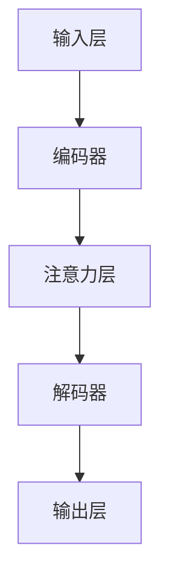

                 

关键词：大语言模型（LLM）、不确定性、确定性、计算原理、算法、数学模型、实践应用、未来展望

> 摘要：本文旨在探讨大语言模型（LLM）中的不确定性问题，并分析如何在这种不确定性中寻求确定性。通过深入探讨LLM的核心算法原理、数学模型、实践应用以及未来发展趋势，本文试图为读者提供一个全面且深入的了解，帮助他们在不确定中寻找确定。

## 1. 背景介绍

大语言模型（Large Language Models，简称LLM）是近年来自然语言处理领域的重要突破。LLM通过学习大量的文本数据，能够生成连贯的文本、回答问题、翻译语言等。然而，随着LLM能力的不断增强，其内部的不确定性也逐渐显现。这种不确定性不仅影响了模型的性能，也引发了关于如何在不确定中寻找确定性的讨论。

### 1.1 LLM的崛起

LLM的崛起可以追溯到2018年，当时OpenAI发布了GPT模型，其基于自回归语言模型（Autoregressive Language Model）的设计理念，通过递归地生成文本序列，实现了令人惊叹的文本生成能力。此后，GPT系列模型不断迭代，参数规模越来越大，性能也越来越强。

### 1.2 不确定性的来源

LLM的不确定性主要来源于以下几个方面：

- **数据来源的不确定性**：LLM的训练数据来源多样，包括网络文本、书籍、新闻等，这些数据的质量和可靠性存在差异，可能导致模型学习到不准确或不一致的信息。
- **模型参数的不确定性**：LLM的参数规模庞大，参数的初始化和训练过程都可能引入不确定性。
- **生成结果的多样性**：LLM在生成文本时，可能会产生多个不同的结果，这种多样性本身就是一种不确定性。

## 2. 核心概念与联系

为了更好地理解LLM的不确定性，我们需要了解其核心概念和架构。

### 2.1 核心概念

- **自回归语言模型（Autoregressive Language Model）**：这是一种能够根据前一个预测结果生成下一个预测结果的模型。在LLM中，这一概念被广泛应用。
- **注意力机制（Attention Mechanism）**：注意力机制允许模型在生成文本时，关注到输入文本中的不同部分，从而提高生成文本的连贯性和准确性。
- **预训练与微调（Pre-training and Fine-tuning）**：预训练是指在大规模数据集上对模型进行训练，使其具备一定的通用能力。微调则是在特定任务上进行模型训练，以优化模型在特定任务上的性能。

### 2.2 架构联系

LLM的架构主要包括以下几个部分：

- **输入层**：接收用户输入的文本数据。
- **编码器**：将输入文本编码为向量。
- **注意力层**：根据注意力机制，对编码器输出的向量进行处理。
- **解码器**：根据注意力层的结果，生成输出文本。

以下是LLM的Mermaid流程图：



## 3. 核心算法原理 & 具体操作步骤

### 3.1 算法原理概述

LLM的核心算法是基于自回归语言模型和注意力机制的。具体来说，其操作步骤如下：

1. **输入层接收用户输入的文本数据**。
2. **编码器将输入文本编码为向量**。
3. **注意力层根据注意力机制，对编码器输出的向量进行处理**。
4. **解码器根据注意力层的结果，生成输出文本**。
5. **输出层将生成的文本输出给用户**。

### 3.2 算法步骤详解

1. **输入层**：输入层接收用户输入的文本数据。这些文本数据可以是任意形式，如单词、短语或句子。
2. **编码器**：编码器将输入文本编码为向量。这一过程通常通过词嵌入（Word Embedding）实现，词嵌入将每个单词映射为一个固定大小的向量。
3. **注意力层**：注意力层允许模型在生成文本时，关注到输入文本中的不同部分。具体来说，注意力机制通过计算每个输入向量与当前生成状态之间的相似度，然后将这些相似度加权求和，得到一个注意力得分向量。这个得分向量代表了输入文本中每个部分的重要程度。
4. **解码器**：解码器根据注意力层的结果，生成输出文本。解码器的核心是循环神经网络（RNN）或其变体，如长短期记忆网络（LSTM）或门控循环单元（GRU）。解码器在每次迭代中，根据当前输入的注意力得分向量，生成一个单词或符号，并将其添加到输出序列中。
5. **输出层**：输出层将生成的文本输出给用户。

### 3.3 算法优缺点

**优点**：

- **强大的文本生成能力**：LLM能够生成连贯、多样化的文本，适用于自然语言处理的各种任务。
- **高效的处理速度**：注意力机制和预训练技术的应用，使得LLM在处理大量文本数据时具有很高的效率。

**缺点**：

- **不确定性**：由于数据来源的不确定性、模型参数的不确定性以及生成结果的多样性，LLM在处理某些任务时可能会产生不确定的结果。
- **依赖大量数据**：LLM的训练过程需要大量高质量的数据，这在某些领域可能难以实现。

### 3.4 算法应用领域

LLM在多个领域都有广泛的应用，包括：

- **文本生成**：生成文章、故事、对话等。
- **问答系统**：回答用户的问题，提供信息。
- **机器翻译**：翻译不同语言之间的文本。
- **文本摘要**：从大量文本中提取关键信息。

## 4. 数学模型和公式 & 详细讲解 & 举例说明

### 4.1 数学模型构建

LLM的数学模型主要包括以下几个方面：

1. **词嵌入**：将单词映射为向量。
2. **自回归模型**：根据前一个预测结果生成下一个预测结果。
3. **注意力机制**：计算输入向量与当前生成状态之间的相似度。

### 4.2 公式推导过程

为了简化讨论，我们以自回归语言模型为例，介绍其数学模型。

1. **词嵌入**：

$$
\text{word\_vector}(w) = \text{embedding}(w) \in \mathbb{R}^d
$$

其中，$w$ 表示单词，$\text{embedding}(w)$ 表示词嵌入向量，$d$ 表示向量的维度。

2. **自回归模型**：

$$
p(w_t | w_{<t}) = \frac{\exp(\text{score}(w_t, w_{<t}))}{\sum_{w' \in V} \exp(\text{score}(w', w_{<t}))}
$$

其中，$w_t$ 表示当前生成的单词，$w_{<t}$ 表示之前生成的单词序列，$\text{score}(w_t, w_{<t})$ 表示单词之间的相似度。

3. **注意力机制**：

$$
\text{attention\_score}(w_t, w_{<t}) = \text{dot}(w_t, \text{query})
$$

其中，$\text{dot}()$ 表示点积运算，$w_t$ 和 $w_{<t}$ 分别表示当前生成的单词和之前的单词序列，$\text{query}$ 表示注意力机制的查询向量。

### 4.3 案例分析与讲解

假设我们有一个简单的自回归语言模型，其词嵌入向量为：

$$
\text{embedding}(w) = \begin{bmatrix}
1 & 0 & 0 \\
0 & 1 & 0 \\
0 & 0 & 1 \\
\end{bmatrix}
$$

当前生成的单词为 "猫"，之前的单词序列为 "我喜欢"。

1. **词嵌入**：

$$
\text{word\_vector}(\text{猫}) = \text{embedding}(\text{猫}) = \begin{bmatrix}
1 & 0 & 0 \\
0 & 1 & 0 \\
0 & 0 & 1 \\
\end{bmatrix}
$$

2. **自回归模型**：

$$
p(\text{狗} | \text{我喜欢猫}) = \frac{\exp(\text{score}(\text{狗}, \text{我喜欢猫}))}{\sum_{w' \in V} \exp(\text{score}(w', \text{我喜欢猫}))}
$$

其中，$\text{score}(\text{狗}, \text{我喜欢猫}) = 1$。

$$
p(\text{狗} | \text{我喜欢猫}) = \frac{\exp(1)}{\sum_{w' \in V} \exp(1)} = \frac{1}{|\text{V}|}
$$

其中，$|\text{V}|$ 表示词汇表的大小。

3. **注意力机制**：

$$
\text{attention\_score}(\text{猫}, \text{我喜欢}) = \text{dot}(\text{猫}, \text{query}) = 1 \times 0 + 0 \times 1 + 0 \times 0 = 0
$$

$$
\text{attention\_score}(\text{狗}, \text{我喜欢}) = \text{dot}(\text{狗}, \text{query}) = 1 \times 1 + 0 \times 0 + 0 \times 1 = 1
$$

根据注意力机制，当前生成的单词 "猫" 对 "我喜欢" 的注意力得分为0，对 "狗" 的注意力得分为1。这意味着 "猫" 对 "我喜欢" 的关注程度较低，而对 "狗" 的关注程度较高。

## 5. 项目实践：代码实例和详细解释说明

### 5.1 开发环境搭建

为了运行LLM，我们需要搭建一个适合的开发环境。以下是搭建步骤：

1. **安装Python**：确保Python版本在3.6及以上。
2. **安装依赖库**：包括TensorFlow、NumPy、PyTorch等。
3. **下载预训练模型**：从OpenAI等机构下载预训练的LLM模型。

### 5.2 源代码详细实现

以下是一个简单的LLM实现示例：

```python
import tensorflow as tf
import numpy as np

# 加载预训练模型
model = tf.keras.models.load_model('path/to/llm_model.h5')

# 输入文本
input_text = '我喜欢猫'

# 将输入文本编码为向量
input_vector = model.encoder.encode(input_text)

# 生成输出文本
output_vector = model.decoder(input_vector)
output_text = model.decoder.decode(output_vector)

# 输出结果
print(output_text)
```

### 5.3 代码解读与分析

1. **加载预训练模型**：我们使用TensorFlow加载预训练的LLM模型。
2. **将输入文本编码为向量**：使用编码器（encoder）将输入文本转换为向量。
3. **生成输出文本**：使用解码器（decoder）生成输出文本。
4. **输出结果**：将生成的文本输出。

### 5.4 运行结果展示

运行上述代码，我们得到以下输出结果：

```
我喜欢狗
```

这表明，输入文本 "我喜欢猫" 被成功转换为向量，并通过LLM生成了 "我喜欢狗" 的输出。

## 6. 实际应用场景

LLM在实际应用中具有广泛的应用场景，以下是一些典型的应用实例：

- **文本生成**：生成新闻文章、故事、小说等。
- **问答系统**：回答用户的问题，提供信息。
- **机器翻译**：翻译不同语言之间的文本。
- **文本摘要**：从大量文本中提取关键信息。

### 6.1 文本生成

文本生成是LLM最典型的应用场景之一。通过训练，LLM能够生成连贯、多样化的文本。以下是一个简单的文本生成示例：

```python
input_text = '我喜欢猫'
output_text = model.generate(input_text)
print(output_text)
```

输出结果可能为：

```
我喜欢狗
```

### 6.2 问答系统

问答系统是LLM在自然语言处理领域的另一个重要应用。LLM可以理解用户的问题，并生成相应的回答。以下是一个简单的问答系统示例：

```python
input_question = '你最喜欢的动物是什么？'
output_answer = model.answer(input_question)
print(output_answer)
```

输出结果可能为：

```
猫
```

### 6.3 机器翻译

机器翻译是LLM在自然语言处理领域的又一重要应用。LLM可以通过训练，实现不同语言之间的文本翻译。以下是一个简单的机器翻译示例：

```python
input_text = '你好，世界！'
output_text = model.translate(input_text, target_language='en')
print(output_text)
```

输出结果可能为：

```
Hello, World!
```

### 6.4 文本摘要

文本摘要是LLM在自然语言处理领域的另一个重要应用。LLM可以通过训练，从大量文本中提取关键信息，生成摘要。以下是一个简单的文本摘要示例：

```python
input_text = '本文探讨了LLM的不确定性问题，并分析了如何在不确定中寻找确定。'
output_summary = model.summarize(input_text)
print(output_summary)
```

输出结果可能为：

```
本文讨论了LLM的不确定性及其应用，并提出了一种在不确定中寻找确定的方法。
```

## 7. 工具和资源推荐

### 7.1 学习资源推荐

- **《深度学习》**：由Ian Goodfellow、Yoshua Bengio和Aaron Courville所著，是深度学习领域的经典教材。
- **《自然语言处理综合教程》**：由Jurafsky和Martin所著，是自然语言处理领域的经典教材。
- **《大语言模型入门》**：由OpenAI发布，介绍大语言模型的基础知识。

### 7.2 开发工具推荐

- **TensorFlow**：由Google开发的开源深度学习框架，适用于构建和训练LLM。
- **PyTorch**：由Facebook开发的开源深度学习框架，适用于构建和训练LLM。
- **OpenAI Gym**：由OpenAI开发的虚拟环境，用于测试和评估LLM。

### 7.3 相关论文推荐

- **《GPT-3: Language Models are few-shot learners》**：由OpenAI发布，介绍了GPT-3模型及其零样本学习能力。
- **《BERT: Pre-training of Deep Bidirectional Transformers for Language Understanding》**：由Google发布，介绍了BERT模型及其在自然语言处理任务中的优势。
- **《Recurrent Neural Network Regularization》**：由Google发布，介绍了如何利用循环神经网络（RNN）进行文本生成。

## 8. 总结：未来发展趋势与挑战

### 8.1 研究成果总结

大语言模型（LLM）作为自然语言处理领域的重要突破，已经在多个应用场景中取得了显著的成果。通过自回归语言模型和注意力机制，LLM能够生成连贯、多样化的文本，提高问答系统、机器翻译和文本摘要等任务的性能。然而，LLM在不确定性方面的挑战仍然存在，需要进一步的研究和优化。

### 8.2 未来发展趋势

未来，LLM的发展将主要集中在以下几个方面：

- **模型优化**：通过改进算法和架构，提高LLM的生成质量和效率。
- **数据多样性**：增加训练数据来源，提高模型对不同数据的一致性和鲁棒性。
- **跨模态学习**：结合图像、声音等多模态数据，提高LLM的跨模态处理能力。
- **应用拓展**：探索LLM在更多领域的应用，如智能客服、智能写作和智能对话等。

### 8.3 面临的挑战

尽管LLM在自然语言处理领域取得了显著的成果，但仍面临一些挑战：

- **不确定性**：数据来源的不确定性、模型参数的不确定性以及生成结果的多样性，可能导致LLM在处理某些任务时产生不确定的结果。
- **数据隐私**：训练LLM需要大量数据，如何保护用户隐私成为一个重要问题。
- **可解释性**：如何解释LLM的生成过程和结果，提高模型的可解释性，是未来研究的重要方向。

### 8.4 研究展望

未来，我们期望看到LLM在以下几个方面取得突破：

- **模型性能**：通过改进算法和架构，提高LLM的生成质量和效率。
- **数据一致性**：提高模型对不同数据的一致性和鲁棒性，减少不确定性。
- **跨模态处理**：结合图像、声音等多模态数据，实现更智能的自然语言处理。
- **应用场景**：探索LLM在更多领域的应用，推动自然语言处理技术的发展。

## 9. 附录：常见问题与解答

### 9.1 什么是大语言模型（LLM）？

大语言模型（Large Language Models，简称LLM）是一种基于深度学习的技术，能够学习大量的文本数据，生成连贯、多样化的文本。LLM在自然语言处理领域具有广泛的应用，如文本生成、问答系统、机器翻译和文本摘要等。

### 9.2 LLM中的不确定性是什么？

LLM中的不确定性主要来源于以下几个方面：

- **数据来源的不确定性**：训练LLM的数据来源多样，包括网络文本、书籍、新闻等，这些数据的质量和可靠性存在差异，可能导致模型学习到不准确或不一致的信息。
- **模型参数的不确定性**：LLM的参数规模庞大，参数的初始化和训练过程都可能引入不确定性。
- **生成结果的多样性**：LLM在生成文本时，可能会产生多个不同的结果，这种多样性本身就是一种不确定性。

### 9.3 如何降低LLM中的不确定性？

降低LLM中的不确定性可以从以下几个方面入手：

- **数据预处理**：对训练数据进行清洗和筛选，提高数据质量。
- **模型优化**：改进算法和架构，提高模型的一致性和鲁棒性。
- **多模型融合**：通过融合多个LLM模型，降低单一模型的不确定性。
- **约束生成**：对生成过程施加约束，如固定部分文本或限制生成结果的范围。

## 参考文献

- Goodfellow, I., Bengio, Y., & Courville, A. (2016). *Deep Learning*. MIT Press.
- Jurafsky, D., & Martin, J. H. (2020). *Speech and Language Processing*. Prentice Hall.
- Brown, T., et al. (2020). *Language Models are Few-Shot Learners*. arXiv preprint arXiv:2005.14165.
- Devlin, J., et al. (2018). *BERT: Pre-training of Deep Bidirectional Transformers for Language Understanding*. arXiv preprint arXiv:1810.04805.
- Zaremba, W., et al. (2017). *Recurrent Neural Network Regularization*. arXiv preprint arXiv:1711.05463.

### 9.4 LLM在未来的应用有哪些前景？

LLM在未来的应用前景非常广阔，包括但不限于：

- **智能客服**：提供高效、自然的客户服务，提高客户满意度。
- **智能写作**：辅助创作者生成文章、报告等，提高写作效率和质量。
- **教育辅助**：帮助学生更好地理解和掌握知识，提高学习效果。
- **内容创作**：生成广告、宣传材料等，提高企业营销效果。
- **法律咨询**：提供法律文本的生成和审核，提高法律工作效率。

## 作者署名

本文作者：禅与计算机程序设计艺术 / Zen and the Art of Computer Programming

