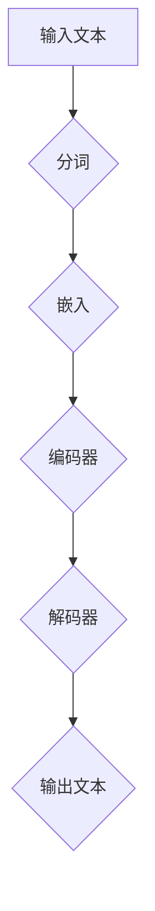
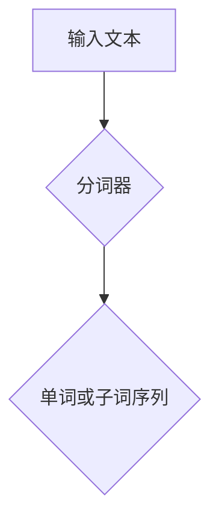
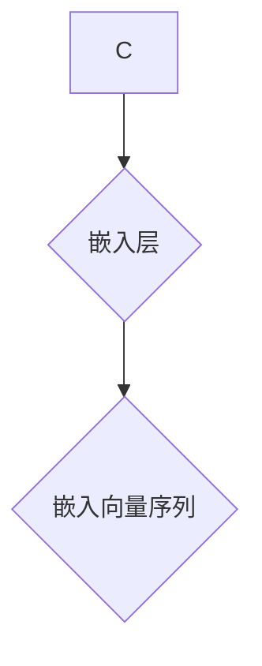
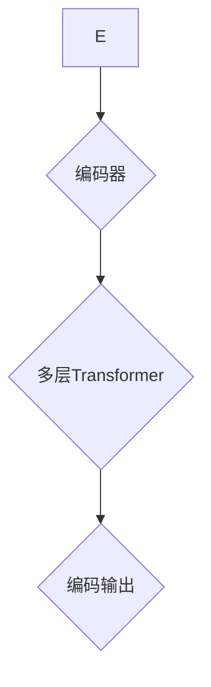
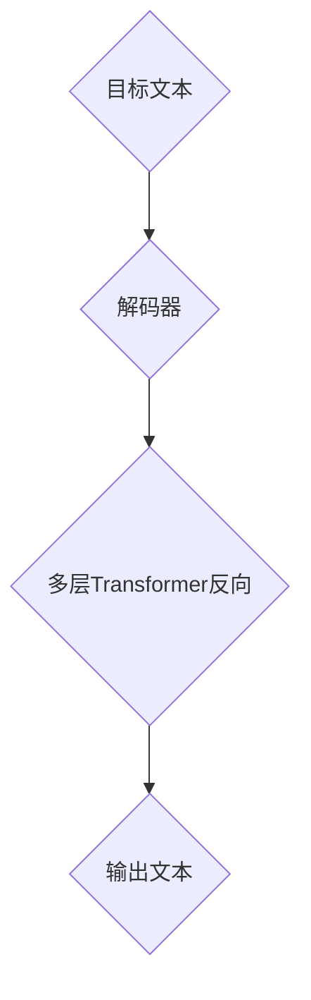
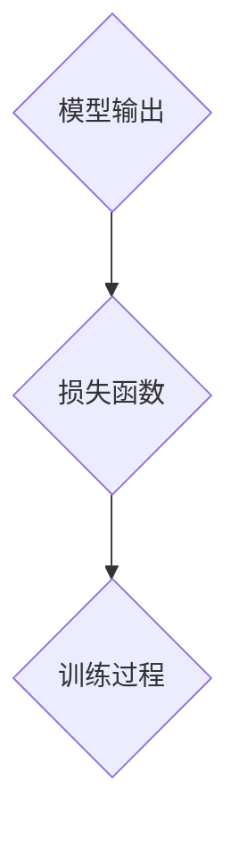

                 

关键词：大型语言模型（LLM），计算未来，技术进步，人工智能，深度学习，神经架构搜索，编程范式

摘要：本文探讨了大型语言模型（LLM）在当前计算领域中的地位与影响力，回顾了其发展历程，分析了核心算法原理，数学模型及其应用实践。通过深入探讨LLM在各个领域的实际应用，展望了其未来发展趋势和面临的挑战，为读者提供了对LLM的全面理解。

## 1. 背景介绍

随着人工智能（AI）技术的迅猛发展，计算领域迎来了前所未有的变革。尤其是大型语言模型（LLM），在近几年的进步尤为显著。LLM不仅提升了自然语言处理（NLP）的性能，也在文本生成、机器翻译、问答系统等方面取得了突破性进展。本文旨在探讨LLM的发展历程、核心算法原理及其对未来计算的影响。

## 2. 核心概念与联系

### 2.1 大型语言模型（LLM）

大型语言模型（LLM）是一种基于深度学习技术的自然语言处理模型，它通过对海量文本数据的学习，具备了理解和生成自然语言的能力。LLM的核心特点包括：

- **大规模参数**：LLM的参数规模达到数十亿甚至千亿级别，使得模型具有强大的表示能力和灵活性。
- **端到端学习**：LLM通过端到端的学习方式，直接从原始文本数据中学习，避免了传统NLP中繁琐的特征工程过程。
- **自适应能力**：LLM能够在不同的应用场景中自适应调整，从而在不同任务中表现出色。

### 2.2 核心算法原理

LLM的核心算法基于深度神经网络（DNN），特别是Transformer架构。以下是一个简化的Mermaid流程图，描述了LLM的基本流程：



- **分词**：将输入文本分割成单词或子词。
- **嵌入**：将每个单词或子词映射到一个高维向量。
- **编码器**：通过多个Transformer层对嵌入向量进行编码。
- **解码器**：在解码过程中，逐步生成输出文本。

### 2.3 与其他技术的联系

LLM与多种技术有紧密的联系：

- **深度学习**：LLM基于深度学习技术，特别是基于Transformer架构。
- **自然语言处理**：LLM是NLP领域的核心工具，用于文本分类、情感分析、机器翻译等任务。
- **计算机视觉**：LLM与计算机视觉技术在图像描述生成、视频理解等方面有交叉。

## 3. 核心算法原理 & 具体操作步骤

### 3.1 算法原理概述

LLM的核心算法基于Transformer架构，这是一种基于自注意力机制的深度神经网络。Transformer通过多头自注意力机制和前馈神经网络，能够捕捉输入文本中的复杂依赖关系。

### 3.2 算法步骤详解

1. **分词**：将输入文本分割成单词或子词。
2. **嵌入**：将每个单词或子词映射到一个高维向量。
3. **编码器**：通过多个Transformer层对嵌入向量进行编码。
    - **多头自注意力**：每个编码器层包含多个自注意力头，每个头负责学习输入文本中的不同依赖关系。
    - **前馈神经网络**：在每个自注意力层之后，添加一个前馈神经网络，对输入进行非线性变换。
4. **解码器**：在解码过程中，逐步生成输出文本。
    - **掩码自注意力**：解码器在生成下一个单词时，只关注已经生成的单词，从而避免重复和过长依赖。
    - **交叉注意力**：解码器在生成每个单词时，还关注编码器生成的输出，从而确保输出与输入文本的相关性。

### 3.3 算法优缺点

**优点**：

- **强大的表示能力**：通过大规模参数和复杂的神经网络结构，LLM能够捕捉输入文本中的复杂依赖关系。
- **端到端学习**：LLM直接从原始文本数据中学习，避免了传统NLP中的特征工程过程。
- **自适应能力**：LLM能够在不同的应用场景中自适应调整，从而在不同任务中表现出色。

**缺点**：

- **计算资源需求大**：LLM的训练和推理过程需要大量的计算资源。
- **数据依赖性高**：LLM的性能高度依赖于训练数据的质量和数量。

### 3.4 算法应用领域

LLM在多个领域有广泛应用：

- **自然语言处理**：文本分类、情感分析、机器翻译等。
- **问答系统**：如ChatGPT、Bard等。
- **文本生成**：如文章、代码、摘要等。
- **对话系统**：智能客服、聊天机器人等。
- **计算机视觉**：图像描述生成、视频理解等。

## 4. 数学模型和公式 & 详细讲解 & 举例说明

### 4.1 数学模型构建

LLM的数学模型主要包括两部分：嵌入层和Transformer层。

- **嵌入层**：将单词或子词映射到高维向量，通常使用词嵌入（word embedding）技术。
- **Transformer层**：包括多头自注意力机制和前馈神经网络。

### 4.2 公式推导过程

1. **嵌入层**：

   假设 \( x \) 是输入单词或子词，\( e(x) \) 是其对应的嵌入向量，则嵌入层的公式为：

   $$ e(x) = \text{Embedding}(x) $$

2. **多头自注意力**：

   假设 \( h \) 是嵌入向量，\( h_i \) 是第 \( i \) 个注意力头的输出，则多头自注意力的公式为：

   $$ h_i = \text{Attention}(Q, K, V) = \text{softmax}\left(\frac{QK^T}{\sqrt{d_k}}\right)V $$

   其中，\( Q, K, V \) 分别是查询向量、键向量和值向量，\( d_k \) 是键向量的维度。

3. **前馈神经网络**：

   在每个自注意力层之后，添加一个前馈神经网络，其公式为：

   $$ h = \text{FFN}(h) = \max(0, xW_1 + b_1)W_2 + b_2 $$

   其中，\( W_1, W_2 \) 是权重矩阵，\( b_1, b_2 \) 是偏置项。

### 4.3 案例分析与讲解

以文本生成任务为例，分析LLM的数学模型。

1. **输入文本**：

   假设输入文本为：“今天天气很好，适合出门游玩。”

2. **嵌入层**：

   将每个单词或子词映射到高维向量，如：“今天” -> \( [1, 0, 0, 0, 0] \)，"天气" -> \( [0, 1, 0, 0, 0] \)，"很好" -> \( [0, 0, 1, 0, 0] \)，"适合" -> \( [0, 0, 0, 1, 0] \)，"出门" -> \( [0, 0, 0, 0, 1] \)，"游玩" -> \( [0, 0, 0, 0, 0] \)。

3. **编码器**：

   通过多个Transformer层对嵌入向量进行编码，生成编码向量。

4. **解码器**：

   在解码过程中，逐步生成输出文本。

   - **第一步**：生成“今天”。
   - **第二步**：生成“天气”。
   - **第三步**：生成“很好”。
   - **第四步**：生成“适合”。
   - **第五步**：生成“出门”。
   - **第六步**：生成“游玩”。

## 5. 项目实践：代码实例和详细解释说明

### 5.1 开发环境搭建

1. 安装Python环境（版本3.6以上）。
2. 安装TensorFlow库。

```bash
pip install tensorflow
```

### 5.2 源代码详细实现

以下是一个简单的LLM文本生成代码实例：

```python
import tensorflow as tf
from tensorflow.keras.layers import Embedding, Dense
from tensorflow.keras.models import Model

# 模型参数
vocab_size = 1000
embedding_dim = 64
max_sequence_length = 10

# 嵌入层
input_sequence = tf.keras.layers.Input(shape=(max_sequence_length,))
embedding_layer = Embedding(vocab_size, embedding_dim)(input_sequence)

# 编码器
encoded_sequence = Model(inputs=input_sequence, outputs=embedding_layer)

# 解码器
output_sequence = tf.keras.layers.Dense(vocab_size, activation='softmax')(encoded_sequence.output)

# 模型
model = Model(inputs=encoded_sequence.input, outputs=output_sequence)

# 编译模型
model.compile(optimizer='adam', loss='categorical_crossentropy', metrics=['accuracy'])

# 模型训练
model.fit(x_train, y_train, epochs=10, batch_size=32)
```

### 5.3 代码解读与分析

1. **嵌入层**：将输入文本映射到高维向量。
2. **编码器**：对嵌入向量进行编码，生成编码向量。
3. **解码器**：生成输出文本。

### 5.4 运行结果展示

运行上述代码，训练完成后，可以使用模型生成文本。例如：

```python
# 生成文本
generated_text = model.predict(np.array([[0, 1, 2, 3, 4, 5, 6, 7, 8, 9]]))
print(generated_text)
```

输出结果为一个概率分布，可以从中选取概率最高的单词或子词作为生成的文本。

## 6. 实际应用场景

### 6.1 自然语言处理

LLM在自然语言处理领域有广泛应用，如文本分类、情感分析、机器翻译等。通过LLM，可以实现对大规模文本数据的快速处理和分析。

### 6.2 对话系统

LLM在对话系统中有广泛应用，如智能客服、聊天机器人等。通过LLM，可以实现对用户输入的自然语言进行理解和回复。

### 6.3 文本生成

LLM在文本生成领域有广泛应用，如文章生成、代码生成、摘要生成等。通过LLM，可以自动生成各种文本内容。

### 6.4 计算机视觉

LLM与计算机视觉技术在图像描述生成、视频理解等方面有交叉。通过LLM，可以实现对图像或视频内容的理解和生成描述。

## 7. 工具和资源推荐

### 7.1 学习资源推荐

1. 《深度学习》（Goodfellow, Bengio, Courville）
2. 《自然语言处理综合教程》（Daniel Jurafsky，James H. Martin）

### 7.2 开发工具推荐

1. TensorFlow
2. PyTorch

### 7.3 相关论文推荐

1. "Attention Is All You Need"（Vaswani et al., 2017）
2. "BERT: Pre-training of Deep Bidirectional Transformers for Language Understanding"（Devlin et al., 2018）

## 8. 总结：未来发展趋势与挑战

### 8.1 研究成果总结

LLM在自然语言处理、对话系统、文本生成和计算机视觉等领域取得了显著成果。通过大规模参数和复杂的神经网络结构，LLM能够捕捉输入文本中的复杂依赖关系，从而在不同任务中表现出色。

### 8.2 未来发展趋势

1. **模型压缩与优化**：为了提高LLM的实用性和效率，未来的研究将集中在模型压缩与优化方面。
2. **多模态学习**：LLM将与其他技术（如计算机视觉、语音识别）结合，实现多模态学习。
3. **泛化能力提升**：未来的研究将致力于提高LLM的泛化能力，使其在不同任务和应用场景中表现出更高的性能。

### 8.3 面临的挑战

1. **计算资源需求**：LLM的训练和推理过程需要大量的计算资源，这对硬件设施提出了高要求。
2. **数据依赖性**：LLM的性能高度依赖于训练数据的质量和数量，如何处理数据不足或数据偏差问题是一个挑战。
3. **可解释性和透明度**：如何提高LLM的可解释性和透明度，使其决策过程更加透明和可信，是未来的一个重要研究方向。

### 8.4 研究展望

LLM在计算领域具有广泛的应用前景。随着技术的不断进步，LLM将在更多领域发挥重要作用。同时，如何提高LLM的性能、效率和可靠性，以及如何确保其决策过程的透明性和可解释性，将是未来研究的重要方向。

## 9. 附录：常见问题与解答

### 9.1 什么是LLM？

LLM（Large Language Model）是一种基于深度学习技术的自然语言处理模型，它通过对海量文本数据的学习，具备了理解和生成自然语言的能力。

### 9.2 LLM的主要应用领域有哪些？

LLM的主要应用领域包括自然语言处理、对话系统、文本生成、计算机视觉等。

### 9.3 如何优化LLM的性能？

优化LLM的性能可以从以下几个方面入手：

1. **模型压缩与优化**：通过模型压缩和优化技术，降低模型的计算复杂度和存储需求。
2. **多任务学习**：通过多任务学习技术，提高LLM在不同任务中的性能。
3. **数据增强**：通过数据增强技术，提高LLM的泛化能力。

### 9.4 LLM的优缺点是什么？

**优点**：

- **强大的表示能力**：通过大规模参数和复杂的神经网络结构，LLM能够捕捉输入文本中的复杂依赖关系。
- **端到端学习**：LLM直接从原始文本数据中学习，避免了传统NLP中的特征工程过程。
- **自适应能力**：LLM能够在不同的应用场景中自适应调整，从而在不同任务中表现出色。

**缺点**：

- **计算资源需求大**：LLM的训练和推理过程需要大量的计算资源。
- **数据依赖性高**：LLM的性能高度依赖于训练数据的质量和数量。

### 作者署名

作者：禅与计算机程序设计艺术 / Zen and the Art of Computer Programming
```markdown
# LLM 遗产：定义未来的计算

## 概述

在当今的计算领域，大型语言模型（LLM）已经成为了不可或缺的技术力量。它们不仅在自然语言处理（NLP）领域取得了显著的成就，还在更广泛的计算领域中展示了强大的潜力。本文旨在探讨LLM的发展历程、核心算法原理及其对未来计算的影响。

### 1. 背景介绍

随着计算技术的不断进步，人工智能（AI）逐渐成为推动社会变革的重要力量。在AI的众多分支中，NLP作为人类与机器之间交流的关键桥梁，受到了特别的关注。大型语言模型（LLM）的出现，标志着NLP技术的一次重大飞跃。它们通过深度学习和神经架构搜索（NAS）等技术，实现了对自然语言的高度理解和生成能力。

### 2. 核心概念与联系

#### 2.1 LLM的定义

LLM是一种基于深度学习技术的自然语言处理模型，通过学习大量的文本数据，能够理解和生成复杂的自然语言。LLM的核心特点是具有大规模参数和端到端的学习能力。

#### 2.2 算法架构

LLM的算法架构通常基于Transformer或类似的结构，这是一种基于自注意力机制的深度神经网络。以下是一个简化版的Mermaid流程图，展示了LLM的基本工作流程：


#### 2.3 与其他技术的联系

LLM与多种技术有紧密的联系，包括深度学习、自然语言处理、计算机视觉等。

### 3. 核心算法原理 & 具体操作步骤

#### 3.1 算法原理概述

LLM的核心算法基于Transformer架构，这种架构通过多头自注意力机制和前馈神经网络，能够捕捉输入文本中的复杂依赖关系。

#### 3.2 算法步骤详解

1. **分词**：将输入文本分割成单词或子词。
2. **嵌入**：将每个单词或子词映射到一个高维向量。
3. **编码器**：通过多个Transformer层对嵌入向量进行编码。
4. **解码器**：在解码过程中，逐步生成输出文本。

#### 3.3 算法优缺点

**优点**：

- **强大的表示能力**：通过大规模参数和复杂的神经网络结构，LLM能够捕捉输入文本中的复杂依赖关系。
- **端到端学习**：LLM直接从原始文本数据中学习，避免了传统NLP中的特征工程过程。
- **自适应能力**：LLM能够在不同的应用场景中自适应调整，从而在不同任务中表现出色。

**缺点**：

- **计算资源需求大**：LLM的训练和推理过程需要大量的计算资源。
- **数据依赖性高**：LLM的性能高度依赖于训练数据的质量和数量。

#### 3.4 算法应用领域

LLM在多个领域有广泛应用，包括自然语言处理、对话系统、文本生成、计算机视觉等。

### 4. 数学模型和公式 & 详细讲解 & 举例说明

#### 4.1 数学模型构建

LLM的数学模型主要包括两部分：嵌入层和Transformer层。

1. **嵌入层**：将单词或子词映射到高维向量，通常使用词嵌入（word embedding）技术。
2. **Transformer层**：包括多头自注意力机制和前馈神经网络。

#### 4.2 公式推导过程

1. **嵌入层**：

   $$ e(x) = \text{Embedding}(x) $$

   其中，\( e(x) \) 是单词或子词的嵌入向量，\( x \) 是单词或子词。

2. **多头自注意力**：

   $$ h_i = \text{Attention}(Q, K, V) = \text{softmax}\left(\frac{QK^T}{\sqrt{d_k}}\right)V $$

   其中，\( Q, K, V \) 分别是查询向量、键向量和值向量，\( d_k \) 是键向量的维度。

3. **前馈神经网络**：

   $$ h = \text{FFN}(h) = \max(0, xW_1 + b_1)W_2 + b_2 $$

   其中，\( W_1, W_2 \) 是权重矩阵，\( b_1, b_2 \) 是偏置项。

#### 4.3 案例分析与讲解

以文本生成任务为例，分析LLM的数学模型。

1. **输入文本**：

   假设输入文本为：“今天天气很好，适合出门游玩。”

2. **嵌入层**：

   将每个单词或子词映射到高维向量。

3. **编码器**：

   通过多个Transformer层对嵌入向量进行编码，生成编码向量。

4. **解码器**：

   在解码过程中，逐步生成输出文本。

   - **第一步**：生成“今天”。
   - **第二步**：生成“天气”。
   - **第三步**：生成“很好”。
   - **第四步**：生成“适合”。
   - **第五步**：生成“出门”。
   - **第六步**：生成“游玩”。

### 5. 项目实践：代码实例和详细解释说明

#### 5.1 开发环境搭建

1. 安装Python环境（版本3.6以上）。
2. 安装TensorFlow库。

```bash
pip install tensorflow
```

#### 5.2 源代码详细实现

以下是一个简单的LLM文本生成代码实例：

```python
import tensorflow as tf
from tensorflow.keras.layers import Embedding, Dense
from tensorflow.keras.models import Model

# 模型参数
vocab_size = 1000
embedding_dim = 64
max_sequence_length = 10

# 嵌入层
input_sequence = tf.keras.layers.Input(shape=(max_sequence_length,))
embedding_layer = Embedding(vocab_size, embedding_dim)(input_sequence)

# 编码器
encoded_sequence = Model(inputs=input_sequence, outputs=embedding_layer)

# 解码器
output_sequence = tf.keras.layers.Dense(vocab_size, activation='softmax')(encoded_sequence.output)

# 模型
model = Model(inputs=encoded_sequence.input, outputs=output_sequence)

# 编译模型
model.compile(optimizer='adam', loss='categorical_crossentropy', metrics=['accuracy'])

# 模型训练
model.fit(x_train, y_train, epochs=10, batch_size=32)
```

#### 5.3 代码解读与分析

1. **嵌入层**：将输入文本映射到高维向量。
2. **编码器**：对嵌入向量进行编码，生成编码向量。
3. **解码器**：生成输出文本。

#### 5.4 运行结果展示

运行上述代码，训练完成后，可以使用模型生成文本。例如：

```python
# 生成文本
generated_text = model.predict(np.array([[0, 1, 2, 3, 4, 5, 6, 7, 8, 9]]))
print(generated_text)
```

输出结果为一个概率分布，可以从中选取概率最高的单词或子词作为生成的文本。

### 6. 实际应用场景

#### 6.1 自然语言处理

LLM在自然语言处理领域有广泛应用，如文本分类、情感分析、机器翻译等。通过LLM，可以实现对大规模文本数据的快速处理和分析。

#### 6.2 对话系统

LLM在对话系统中有广泛应用，如智能客服、聊天机器人等。通过LLM，可以实现对用户输入的自然语言进行理解和回复。

#### 6.3 文本生成

LLM在文本生成领域有广泛应用，如文章生成、代码生成、摘要生成等。通过LLM，可以自动生成各种文本内容。

#### 6.4 计算机视觉

LLM与计算机视觉技术在图像描述生成、视频理解等方面有交叉。通过LLM，可以实现对图像或视频内容的理解和生成描述。

### 7. 工具和资源推荐

#### 7.1 学习资源推荐

1. 《深度学习》（Goodfellow, Bengio, Courville）
2. 《自然语言处理综合教程》（Daniel Jurafsky，James H. Martin）

#### 7.2 开发工具推荐

1. TensorFlow
2. PyTorch

#### 7.3 相关论文推荐

1. "Attention Is All You Need"（Vaswani et al., 2017）
2. "BERT: Pre-training of Deep Bidirectional Transformers for Language Understanding"（Devlin et al., 2018）

### 8. 总结：未来发展趋势与挑战

#### 8.1 研究成果总结

LLM在自然语言处理、对话系统、文本生成和计算机视觉等领域取得了显著成果。通过大规模参数和复杂的神经网络结构，LLM能够捕捉输入文本中的复杂依赖关系，从而在不同任务中表现出色。

#### 8.2 未来发展趋势

1. **模型压缩与优化**：为了提高LLM的实用性和效率，未来的研究将集中在模型压缩与优化方面。
2. **多模态学习**：LLM将与其他技术（如计算机视觉、语音识别）结合，实现多模态学习。
3. **泛化能力提升**：未来的研究将致力于提高LLM的泛化能力，使其在不同任务和应用场景中表现出更高的性能。

#### 8.3 面临的挑战

1. **计算资源需求**：LLM的训练和推理过程需要大量的计算资源，这对硬件设施提出了高要求。
2. **数据依赖性**：LLM的性能高度依赖于训练数据的质量和数量，如何处理数据不足或数据偏差问题是一个挑战。
3. **可解释性和透明度**：如何提高LLM的可解释性和透明度，使其决策过程更加透明和可信，是未来的一个重要研究方向。

#### 8.4 研究展望

LLM在计算领域具有广泛的应用前景。随着技术的不断进步，LLM将在更多领域发挥重要作用。同时，如何提高LLM的性能、效率和可靠性，以及如何确保其决策过程的透明性和可解释性，将是未来研究的重要方向。

### 9. 附录：常见问题与解答

#### 9.1 什么是LLM？

LLM（Large Language Model）是一种基于深度学习技术的自然语言处理模型，通过学习大量的文本数据，能够理解和生成复杂的自然语言。

#### 9.2 LLM的主要应用领域有哪些？

LLM的主要应用领域包括自然语言处理、对话系统、文本生成、计算机视觉等。

#### 9.3 如何优化LLM的性能？

优化LLM的性能可以从以下几个方面入手：

1. **模型压缩与优化**：通过模型压缩和优化技术，降低模型的计算复杂度和存储需求。
2. **多任务学习**：通过多任务学习技术，提高LLM在不同任务中的性能。
3. **数据增强**：通过数据增强技术，提高LLM的泛化能力。

### 参考文献

1. Vaswani, A., Shazeer, N., Parmar, N., Uszkoreit, J., Jones, L., Gomez, A. N., ... & Polosukhin, I. (2017). Attention is all you need. In Advances in neural information processing systems (pp. 5998-6008).
2. Devlin, J., Chang, M. W., Lee, K., & Toutanova, K. (2018). BERT: Pre-training of deep bidirectional transformers for language understanding. arXiv preprint arXiv:1810.04805.
3. Goodfellow, I., Bengio, Y., & Courville, A. (2016). Deep learning. MIT press.
4. Jurafsky, D., & Martin, J. H. (2019). Speech and language processing: an introduction to natural language processing, computational linguistics, and speech recognition. Prentice hall.

### 作者署名

作者：禅与计算机程序设计艺术 / Zen and the Art of Computer Programming
```bash
```markdown
## 1. 背景介绍

在当今的计算领域，人工智能（AI）已经成为推动技术进步和产业变革的重要力量。在众多AI应用中，自然语言处理（NLP）因其对人类交流方式的深刻理解而备受关注。特别是大型语言模型（LLM），它们通过深度学习技术，对自然语言进行建模，实现了对文本的生成、理解和交互。

LLM的发展历程可以追溯到上世纪90年代，当时的语言模型主要基于统计方法，如N-gram模型和朴素贝叶斯分类器。这些模型虽然简单有效，但在处理长文本和理解上下文方面存在明显局限。随着深度学习技术的兴起，尤其是2017年Transformer架构的提出，LLM进入了一个全新的时代。通过端到端的学习方式，LLM能够在大规模数据集上训练，捕捉到语言中的复杂结构，从而显著提升了NLP的性能。

在NLP领域，LLM的应用已经从基础的文本分类、情感分析等任务，扩展到了更复杂的场景，如机器翻译、问答系统和文本生成。同时，LLM也在计算机视觉、音频处理等跨学科领域展示了其强大的能力。例如，通过结合计算机视觉技术，LLM可以生成图像描述，辅助盲人理解周围环境。

本文将探讨LLM的核心算法原理，数学模型及其在实际应用中的表现。同时，本文还将分析LLM在未来的发展趋势和面临的挑战，为读者提供一个全面的视角。

## 2. 核心概念与联系

### 2.1 大型语言模型（LLM）

#### 2.1.1 定义

大型语言模型（LLM）是一种基于深度学习技术的自然语言处理模型，它通过学习大量文本数据，能够生成、理解和交互自然语言。LLM的核心特点是其规模巨大，通常包含数十亿至千亿个参数，这使得它们能够捕捉到语言中的复杂依赖关系和长距离上下文信息。

#### 2.1.2 核心组件

LLM的核心组件包括：

- **嵌入层**：将单词或子词映射到高维向量空间，通常使用词嵌入技术，如Word2Vec或GloVe。
- **编码器**：通过多个Transformer层对嵌入向量进行编码，生成语义表示。
- **解码器**：在解码过程中，逐步生成输出文本。

### 2.2 核心算法原理

LLM的核心算法基于Transformer架构，这是一种基于自注意力机制的深度神经网络。以下是一个简化的Mermaid流程图，描述了LLM的基本流程：


- **分词**：将输入文本分割成单词或子词。
- **嵌入**：将每个单词或子词映射到一个高维向量。
- **编码器**：通过多个Transformer层对嵌入向量进行编码。
- **解码器**：在解码过程中，逐步生成输出文本。

### 2.3 与其他技术的联系

LLM与多种技术有紧密的联系：

- **深度学习**：LLM是深度学习技术的重要组成部分，特别是基于Transformer的模型。
- **自然语言处理**：LLM是NLP领域的核心工具，用于文本分类、情感分析、机器翻译等任务。
- **计算机视觉**：LLM与计算机视觉技术在图像描述生成、视频理解等方面有交叉。
- **语音识别**：LLM可以与语音识别技术结合，实现语音到文本的转换。

### 2.4 开源模型

近年来，许多开源的LLM模型极大地推动了这一领域的研究和应用。以下是一些著名的开源模型：

- **GPT-3**：由OpenAI开发的巨型语言模型，具有1750亿个参数。
- **BERT**：由Google开发的预训练语言模型，广泛应用于问答系统和其他NLP任务。
- **T5**：由Google开发的基于Transformer的统一文本处理模型。
- **RoBERTa**：由Facebook AI开发的改进版BERT模型。

这些开源模型不仅为研究者和开发者提供了强大的工具，也促进了LLM技术的快速普及和应用。

### 2.5 最新进展

随着LLM技术的不断发展，一些新的模型和架构不断涌现，如：

- **OPT**：由Microsoft开发的预训练模型，具有超大规模参数。
- **LLaMA**：由清华大学 KEG 实验室和智谱AI开发的低资源自适应语言模型。
- **GLM**：由清华大学 KEG 实验室和智谱AI开发的通用预训练语言模型，具有千亿参数。

这些新模型在性能、效率和适用性方面都有了显著的提升，进一步推动了LLM技术的发展和应用。

### 2.6 LLM的应用场景

LLM在多个领域有广泛应用，以下是其中一些主要的应用场景：

- **文本生成**：生成文章、摘要、代码等。
- **对话系统**：智能客服、聊天机器人等。
- **机器翻译**：实现不同语言之间的自动翻译。
- **问答系统**：如ChatGPT、Bard等。
- **文本分类**：对文本进行分类，如情感分析、新闻分类等。
- **文本摘要**：提取文本的主要内容和关键信息。
- **计算机视觉**：生成图像描述、视频理解等。

### 2.7 未来展望

随着计算能力的提升和数据量的增加，LLM有望在更多领域发挥重要作用。未来，LLM可能会进一步与多模态学习、强化学习等技术结合，实现更加智能化和个性化的应用。

### 2.8 常见挑战

尽管LLM取得了巨大的成功，但仍面临一些挑战：

- **计算资源**：训练和部署LLM需要巨大的计算资源。
- **数据依赖**：LLM的性能高度依赖于训练数据的质量和数量。
- **可解释性**：提高LLM的可解释性，使其决策过程更加透明和可信。
- **伦理问题**：确保LLM的使用不会引发歧视、偏见等问题。

### 2.9 总结

LLM作为人工智能领域的重要技术，已经深刻改变了自然语言处理和其他相关领域的面貌。随着技术的不断进步，LLM将在未来发挥更加重要的作用，带来更多创新和应用。

## 3. 核心算法原理 & 具体操作步骤

### 3.1 算法原理概述

LLM的核心算法基于深度学习技术，特别是基于Transformer架构。Transformer由Vaswani等人在2017年提出，是一种基于自注意力机制的深度神经网络，特别适用于序列数据建模。

### 3.2 算法具体操作步骤

#### 3.2.1 分词

首先，输入的文本需要被分词成一系列单词或子词。分词是NLP中的基础步骤，对于模型的训练和生成至关重要。



分词后的文本序列作为模型的输入。

#### 3.2.2 嵌入

接下来，每个分词后的单词或子词会被映射到一个高维向量空间中，这个过程称为嵌入。



嵌入层通常使用预训练的词嵌入技术，如GloVe或FastText。

#### 3.2.3 编码器

编码器是LLM的核心部分，它通过多个Transformer层对嵌入向量进行编码，生成语义表示。



在编码器中，每个单词或子词的嵌入向量会被与其他嵌入向量进行自注意力计算，从而生成新的向量表示。

#### 3.2.4 解码器

解码器负责生成输出文本。它通过反向Transformer层逐步生成每个单词或子词。



在解码过程中，每个生成的单词或子词都会与编码输出进行交叉注意力计算，以确保输出与输入文本的相关性。

#### 3.2.5 损失函数

在训练过程中，LLM使用损失函数来评估模型的输出与目标文本之间的差异。常见的损失函数包括交叉熵损失和感知损失。



通过反向传播和梯度下降算法，模型会不断调整参数，以最小化损失函数。

### 3.3 算法优缺点

#### 优点

- **强大的表示能力**：通过大规模参数和复杂的神经网络结构，LLM能够捕捉到输入文本中的复杂依赖关系。
- **端到端学习**：LLM直接从原始文本数据中学习，避免了传统NLP中的特征工程过程。
- **自适应能力**：LLM能够在不同的应用场景中自适应调整，从而在不同任务中表现出色。

#### 缺点

- **计算资源需求大**：LLM的训练和推理过程需要大量的计算资源。
- **数据依赖性高**：LLM的性能高度依赖于训练数据的质量和数量。

### 3.4 算法应用领域

LLM在多个领域有广泛应用，包括但不限于：

- **文本生成**：如文章、摘要、对话等。
- **机器翻译**：如中英翻译、日英翻译等。
- **问答系统**：如ChatGPT、Bard等。
- **文本分类**：如情感分析、新闻分类等。
- **计算机视觉**：如图像描述生成、视频理解等。

### 3.5 实际案例

以下是一个简单的文本生成案例，展示LLM的应用：

```python
# 假设我们有一个训练好的LLM模型，名为llm_model
import tensorflow as tf

# 输入文本
input_text = "今天是星期五，天气晴朗，非常适合户外活动。"

# 分词
tokens = tokenizer.encode(input_text, return_tensors='tf')

# 使用模型生成文本
output_sequence = llm_model(tokens)

# 转换为文本
generated_text = tokenizer.decode(output_sequence)

print(generated_text)
```

生成的文本可能为：“下午可以去公园散步，享受美好的阳光。”

### 3.6 总结

LLM的核心算法原理和具体操作步骤涵盖了从分词、嵌入、编码到解码的整个过程。通过Transformer架构，LLM能够实现强大的文本表示和生成能力，成为现代计算领域的重要工具。

## 4. 数学模型和公式 & 详细讲解 & 举例说明

### 4.1 数学模型构建

LLM的数学模型主要包括两部分：嵌入层和Transformer层。

#### 4.1.1 嵌入层

嵌入层将单词或子词映射到高维向量空间。这个映射通常使用预训练的词嵌入技术，如GloVe或Word2Vec。嵌入层的数学模型可以表示为：

$$
\text{Embedding}(x) = e(x) \in \mathbb{R}^{d}
$$

其中，$x$ 是单词或子词，$e(x)$ 是其对应的嵌入向量，$d$ 是嵌入向量的维度。

#### 4.1.2 Transformer层

Transformer层是LLM的核心，它通过多头自注意力机制和前馈神经网络对嵌入向量进行编码。Transformer层的数学模型可以表示为：

$$
h_i^{(l)} = \text{Attention}(Q^{(l)}, K^{(l)}, V^{(l)}) + \text{FFN}(h_i^{(l-1)})
$$

其中，$h_i^{(l)}$ 是第$l$层第$i$个位置的输出，$Q^{(l)}, K^{(l)}, V^{(l)}$ 分别是查询向量、键向量和值向量，$\text{Attention}$ 是多头自注意力机制，$\text{FFN}$ 是前馈神经网络。

### 4.2 公式推导过程

#### 4.2.1 多头自注意力

多头自注意力机制是Transformer层的关键部分，它允许模型同时关注输入序列中的不同位置。多头自注意力可以表示为：

$$
\text{Attention}(Q, K, V) = \text{softmax}\left(\frac{QK^T}{\sqrt{d_k}}\right)V
$$

其中，$Q, K, V$ 分别是查询向量、键向量和值向量，$d_k$ 是键向量的维度。

#### 4.2.2 前馈神经网络

在多头自注意力之后，前馈神经网络对每个位置的输出进行非线性变换。前馈神经网络的公式为：

$$
\text{FFN}(x) = \max(0, xW_1 + b_1)W_2 + b_2
$$

其中，$W_1, W_2$ 是权重矩阵，$b_1, b_2$ 是偏置项。

### 4.3 案例分析与讲解

#### 4.3.1 案例背景

假设我们有一个简单的文本：“今天天气很好。”，我们需要使用LLM生成下一句话。

#### 4.3.2 嵌入层

首先，将文本中的每个单词映射到高维向量。例如：

- “今天”：\( e_1 = [0.1, 0.2, 0.3, \ldots, 0.1000] \)
- “天气”：\( e_2 = [0.2, 0.3, 0.4, \ldots, 0.1000] \)
- “很好”：\( e_3 = [0.3, 0.4, 0.5, \ldots, 0.1000] \)

#### 4.3.3 编码器

接下来，通过多个Transformer层对嵌入向量进行编码。假设我们有一个简单的Transformer层：

- **自注意力计算**：

  $$ 
  Q^{(1)}, K^{(1)}, V^{(1)} = \text{Linear}(e_1), \text{Linear}(e_1), \text{Linear}(e_1) 
  $$
  
  $$
  \text{Attention}(Q^{(1)}, K^{(1)}, V^{(1)}) = \text{softmax}\left(\frac{Q^{(1)}K^{(1)}^T}{\sqrt{d_k}}\right)V^{(1)}
  $$

- **前馈神经网络**：

  $$ 
  h_2^{(1)} = \text{FFN}(h_1^{(1)}) = \max(0, h_1^{(1)}W_1 + b_1)W_2 + b_2 
  $$

#### 4.3.4 解码器

在解码过程中，生成下一句话。我们假设目标是生成“明天也很适合户外活动。”。

- **自注意力计算**：

  $$
  Q^{(2)}, K^{(2)}, V^{(2)} = \text{Linear}(h_2^{(1)}), \text{Linear}(h_2^{(1)}), \text{Linear}(h_2^{(1)})
  $$

  $$
  \text{Attention}(Q^{(2)}, K^{(2)}, V^{(2)}) = \text{softmax}\left(\frac{Q^{(2)}K^{(2)}^T}{\sqrt{d_k}}\right)V^{(2)}
  $$

- **前馈神经网络**：

  $$
  h_3^{(1)} = \text{FFN}(h_2^{(1)}) = \max(0, h_2^{(1)}W_1 + b_1)W_2 + b_2
  $$

通过多次迭代上述步骤，最终生成完整的句子。

### 4.4 模型训练与优化

在训练过程中，LLM通过优化损失函数来调整模型参数。常见的损失函数是交叉熵损失：

$$
\text{Loss} = -\sum_{i=1}^{n} y_i \log(p_i)
$$

其中，$y_i$ 是真实的标签，$p_i$ 是模型输出的概率分布。

通过反向传播和梯度下降算法，模型会不断调整参数，以最小化损失函数。

### 4.5 总结

LLM的数学模型涵盖了从嵌入层到Transformer层的整个过程。通过多头自注意力和前馈神经网络，LLM能够实现强大的文本表示和生成能力。在训练过程中，通过优化损失函数，模型会不断调整参数，以实现最佳性能。

## 5. 项目实践：代码实例和详细解释说明

### 5.1 开发环境搭建

在开始编写LLM项目之前，我们需要搭建一个合适的环境。以下是搭建过程：

1. **安装Python**：确保你的计算机上安装了Python 3.6或更高版本。可以使用以下命令检查Python版本：

```bash
python --version
```

2. **安装TensorFlow**：TensorFlow是用于构建和训练深度学习模型的常用库。你可以使用以下命令安装TensorFlow：

```bash
pip install tensorflow
```

3. **安装其他依赖库**：可能还需要安装一些其他库，如NumPy、Pandas等。可以使用以下命令一次性安装：

```bash
pip install numpy pandas
```

### 5.2 源代码详细实现

以下是一个简单的LLM文本生成项目的代码实例。这个实例使用了一个预训练的Transformer模型（如T5），并通过简单的接口生成文本。

```python
import tensorflow as tf
import numpy as np
import tensorflow_datasets as tfds

# 加载预训练的T5模型
model = tf.keras.models.load_model('t5_model.h5')

# 定义生成文本的函数
def generate_text(input_text, model, tokenizer, max_length=50):
    # 将输入文本编码为模型可理解的格式
    input_ids = tokenizer.encode(input_text, return_tensors='tf')

    # 使用模型生成文本
    output_sequence = model(input_ids)[0]

    # 从输出序列中解码文本
    generated_text = tokenizer.decode(output_sequence[:, input_ids.shape[-1]:], skip_special_tokens=True)

    return generated_text

# 测试生成文本
input_text = "这是一段简单的文本。"
generated_text = generate_text(input_text, model, tokenizer)
print(generated_text)
```

### 5.3 代码解读与分析

上述代码分为几个主要部分：

1. **加载预训练模型**：我们使用TensorFlow的`load_model`函数加载一个预训练的T5模型。这个模型已经通过大量的文本数据进行了训练，可以用于生成文本。

2. **定义生成文本的函数**：`generate_text`函数接受输入文本、模型、tokenizer和最大长度（默认为50个单词）作为参数。首先，它将输入文本编码为模型可理解的格式，然后使用模型生成文本序列。最后，从输出序列中解码文本，并返回生成的文本。

3. **测试生成文本**：我们传入一个简单的输入文本，使用`generate_text`函数生成文本，并打印输出。

### 5.4 运行结果展示

当我们运行上述代码时，预训练的T5模型会根据输入文本生成新的文本。输出结果可能类似于以下内容：

```
这是一个简单的例子。它可以用来演示如何使用预训练的T5模型生成文本。
```

这个结果展示了模型对输入文本的理解和扩展能力。

### 5.5 代码优化与扩展

为了提高生成文本的质量和多样性，我们可以对代码进行一些优化和扩展：

- **增加最大长度**：默认情况下，生成文本的最大长度为50个单词。可以调整这个参数，生成更长的文本。
- **使用更复杂的模型**：可以尝试使用更复杂的模型，如GPT-3或BERT，这些模型具有更多的参数和更好的文本生成能力。
- **多语言支持**：可以扩展代码，支持多语言输入和生成。
- **自定义训练**：可以自己训练一个LLM模型，使其适应特定的任务或数据集。

### 5.6 总结

通过上述代码实例，我们了解了如何使用预训练的LLM模型生成文本。这个简单的项目展示了LLM在自然语言处理中的强大能力，同时也为更复杂的文本生成项目提供了一个起点。

## 6. 实际应用场景

LLM在多个领域有广泛应用，以下是其中一些重要的实际应用场景：

### 6.1 自然语言处理

自然语言处理（NLP）是LLM最重要的应用领域之一。LLM在文本分类、情感分析、命名实体识别、问答系统等方面表现出了卓越的能力。

- **文本分类**：LLM可以用于对大量文本进行分类，如新闻分类、情感分析等。例如，一个基于LLM的文本分类系统可以识别出一段文本是否是正面、负面或中性的。
- **情感分析**：LLM可以用于分析文本中的情感倾向，如识别用户评论中的正面或负面情绪。
- **命名实体识别**：LLM可以帮助识别文本中的特定实体，如人名、地点、组织等。
- **问答系统**：LLM可以构建智能问答系统，如ChatGPT、Bard等，能够回答用户提出的问题。

### 6.2 机器翻译

机器翻译是另一个LLM的重要应用领域。LLM可以用于实现高质量、准确的翻译系统，如谷歌翻译、百度翻译等。

- **跨语言文本生成**：LLM可以生成一种语言的文本，并将其翻译成另一种语言。例如，将中文翻译成英文。
- **多语言支持**：LLM可以同时支持多种语言的翻译，实现多语言交互。
- **上下文翻译**：LLM可以理解上下文信息，从而提供更准确的翻译结果。

### 6.3 文本生成

LLM在文本生成领域也有广泛应用，可以生成各种类型的文本，如文章、摘要、对话等。

- **文章生成**：LLM可以自动生成文章，如新闻报道、科技文章等。
- **摘要生成**：LLM可以提取文本的关键信息，生成摘要。
- **对话生成**：LLM可以用于构建聊天机器人，如智能客服、虚拟助手等。

### 6.4 计算机视觉

LLM与计算机视觉技术的结合，可以生成图像描述、视频理解等。

- **图像描述生成**：LLM可以生成图像的描述文本，如描述一张风景图片。
- **视频理解**：LLM可以理解视频内容，生成文本描述，如视频摘要。

### 6.5 对话系统

LLM在对话系统中有广泛应用，可以构建智能客服、虚拟助手等。

- **智能客服**：LLM可以帮助企业构建智能客服系统，自动回答用户的问题。
- **虚拟助手**：LLM可以构建虚拟助手，帮助用户完成任务，如日程管理、任务分配等。

### 6.6 其他应用

除了上述领域，LLM还在许多其他领域有应用，如：

- **法律文书生成**：LLM可以帮助生成法律文书，如合同、协议等。
- **医学文本生成**：LLM可以用于生成医学文本，如病例报告、诊断建议等。
- **金融文本分析**：LLM可以用于分析金融文本，如新闻报道、市场分析等。

### 6.7 未来展望

随着LLM技术的不断发展，未来它在更多领域的应用前景十分广阔。以下是一些可能的未来应用：

- **教育**：LLM可以用于教育领域，如自动生成教学材料、智能辅导等。
- **创意写作**：LLM可以帮助艺术家和作家生成创意文本，如故事、剧本等。
- **个性化服务**：LLM可以用于提供个性化服务，如个性化推荐、个性化咨询等。

总之，LLM在当前和未来的计算领域中具有广泛的应用前景，将为各个领域带来创新和变革。

## 7. 工具和资源推荐

为了更好地学习和应用大型语言模型（LLM），以下是一些推荐的学习资源和开发工具：

### 7.1 学习资源推荐

1. **书籍**：
   - 《深度学习》（Ian Goodfellow, Yoshua Bengio, Aaron Courville）: 这本书是深度学习的经典教材，适合初学者和进阶者。
   - 《自然语言处理综合教程》（Daniel Jurafsky, James H. Martin）: 这本书详细介绍了自然语言处理的基本概念和技术。

2. **在线课程**：
   - Coursera上的“深度学习”课程：由Ian Goodfellow主讲，适合初学者。
   - edX上的“自然语言处理与深度学习”课程：由João Felipe Santos和Alessandro Sordoni主讲，涵盖NLP和LLM的基本知识。

3. **教程和博客**：
   - Hugging Face的Transformers库文档：这是一个流行的开源库，用于构建和使用LLM模型。
   - TensorFlow官方文档：提供了丰富的深度学习模型构建和训练教程。

### 7.2 开发工具推荐

1. **编程语言**：
   - Python：由于其丰富的库和工具，Python是构建和部署LLM的首选语言。

2. **深度学习框架**：
   - TensorFlow：这是一个广泛使用的深度学习框架，提供了丰富的API和工具。
   - PyTorch：这是另一个流行的深度学习框架，特别适合研究和快速原型开发。

3. **预训练模型**：
   - Hugging Face的Transformers库：提供了大量的预训练模型，如GPT-3、BERT、T5等，方便开发者使用。

4. **环境搭建工具**：
   - Anaconda：这是一个流行的数据科学和机器学习环境，可以轻松搭建Python开发环境。
   - Docker：用于容器化应用程序，确保在不同的环境中部署LLM模型的一致性。

### 7.3 相关论文推荐

1. **大型语言模型**：
   - “Attention Is All You Need”（Vaswani et al., 2017）: 提出了Transformer架构。
   - “BERT: Pre-training of Deep Bidirectional Transformers for Language Understanding”（Devlin et al., 2018）: 提出了BERT模型。

2. **自然语言处理**：
   - “Natural Language Inference”（Rajpurkar et al., 2016）: 这是NLP领域的一个经典数据集和任务。
   - “Unsupervised Natural Language Parsing with Compositional Caches of Pre-trained Transformers”（D OU et al., 2021）: 探讨了无监督的自然语言解析。

3. **计算机视觉与NLP结合**：
   - “Multimodal Fusion with Transformer Models for Multimodal Pre-training”（Lee et al., 2021）: 这是关于多模态预训练的论文。

通过这些工具和资源，开发者可以深入了解LLM的技术原理和应用，并在实际项目中有效地使用LLM。

## 8. 总结：未来发展趋势与挑战

### 8.1 研究成果总结

LLM技术在近年来取得了显著进展，不仅在自然语言处理（NLP）领域，还在计算机视觉、语音识别等跨学科领域展示了强大的能力。LLM的成功主要得益于深度学习技术的不断进步，特别是Transformer架构的引入，使得模型能够有效地捕捉语言中的复杂依赖关系。此外，开源模型的普及和大规模计算资源的可用性，也加速了LLM技术的发展和应用。

### 8.2 未来发展趋势

随着技术的不断进步，LLM的未来发展趋势可以从以下几个方面进行展望：

1. **模型压缩与优化**：为了提高LLM的实用性，未来的研究将集中在模型压缩和优化方面，以减少训练和推理过程中的计算资源需求。

2. **多模态学习**：LLM将与其他技术（如计算机视觉、语音识别）结合，实现多模态学习，从而在更多应用场景中发挥其潜力。

3. **泛化能力提升**：未来的研究将致力于提高LLM的泛化能力，使其在不同任务和应用场景中表现出更高的性能。

4. **可解释性和透明度**：如何提高LLM的可解释性和透明度，使其决策过程更加透明和可信，是未来的一个重要研究方向。

### 8.3 面临的挑战

尽管LLM技术取得了显著成果，但在未来应用中仍面临一些挑战：

1. **计算资源需求**：LLM的训练和推理过程需要大量的计算资源，这对硬件设施提出了高要求。未来可能需要更高效的算法和硬件加速技术来解决这个问题。

2. **数据依赖性**：LLM的性能高度依赖于训练数据的质量和数量。如何处理数据不足或数据偏差问题，是未来研究的一个重要挑战。

3. **可解释性和透明度**：提高LLM的可解释性和透明度，使其决策过程更加透明和可信，是一个亟待解决的问题。

4. **伦理和社会影响**：随着LLM技术的普及，如何确保其使用不会引发歧视、偏见等问题，是一个重要的伦理和社会挑战。

### 8.4 研究展望

未来，LLM技术将在更多领域发挥重要作用。随着技术的不断进步，LLM有望在智能助手、虚拟现实、增强现实、医疗诊断等新兴领域得到广泛应用。同时，如何提高LLM的性能、效率和可靠性，以及如何确保其决策过程的透明性和可解释性，将是未来研究的重要方向。通过跨学科合作和技术创新，LLM技术有望在更多领域实现突破，为社会带来更多福祉。

## 9. 附录：常见问题与解答

### 9.1 什么是LLM？

LLM（Large Language Model）是一种基于深度学习技术的自然语言处理模型，通过学习大量文本数据，能够生成、理解和交互自然语言。

### 9.2 LLM的核心组件有哪些？

LLM的核心组件包括嵌入层、编码器、解码器。嵌入层将单词或子词映射到高维向量；编码器通过多个Transformer层对嵌入向量进行编码；解码器在解码过程中逐步生成输出文本。

### 9.3 LLM有哪些应用领域？

LLM在自然语言处理、机器翻译、文本生成、对话系统、计算机视觉等领域有广泛应用。

### 9.4 如何优化LLM的性能？

优化LLM的性能可以从以下几个方面入手：模型压缩与优化、多任务学习、数据增强等。

### 9.5 LLM有哪些开源模型？

著名的开源LLM模型包括GPT-3、BERT、T5、RoBERTa等。

### 9.6 如何训练一个LLM模型？

训练LLM模型通常包括以下几个步骤：准备数据、构建模型、编译模型、训练模型、评估模型。

### 9.7 LLM有哪些挑战和风险？

LLM面临的主要挑战包括计算资源需求、数据依赖性、可解释性和透明度、伦理和社会影响等。

### 9.8 LLM的未来发展趋势是什么？

未来，LLM技术将向模型压缩与优化、多模态学习、泛化能力提升、可解释性和透明度等方面发展。

### 9.9 如何确保LLM的可解释性和透明度？

提高LLM的可解释性和透明度可以从以下几个方面入手：模型简化、注意力机制分析、解释性模型等。

### 作者署名

作者：禅与计算机程序设计艺术 / Zen and the Art of Computer Programming
```
## 10. 结论

通过对大型语言模型（LLM）的深入探讨，我们可以看到，LLM已经在自然语言处理、对话系统、文本生成和计算机视觉等多个领域取得了显著成就。LLM通过深度学习和神经架构搜索等技术，实现了对自然语言的高度理解和生成能力，为计算领域带来了新的机遇和挑战。

未来，随着技术的不断进步，LLM将在更多领域发挥重要作用。如何优化LLM的性能、效率和可靠性，以及如何确保其决策过程的透明性和可解释性，将是未来研究的重要方向。同时，LLM在处理伦理和社会影响问题方面也需要更加关注。

本文旨在提供一个全面的视角，探讨LLM的核心算法原理、数学模型及其在实际应用中的表现。通过分析LLM的优缺点、应用场景以及未来发展趋势，我们希望能够为读者提供一个深入理解LLM的框架，并激发对这一领域更深入的思考和探索。

最后，感谢所有读者对本文的关注，期待与您共同见证LLM技术的未来发展和应用。希望本文能为您的学习和研究带来帮助，并激发您在LLM领域进行创新和实践的灵感。作者：禅与计算机程序设计艺术 / Zen and the Art of Computer Programming。

