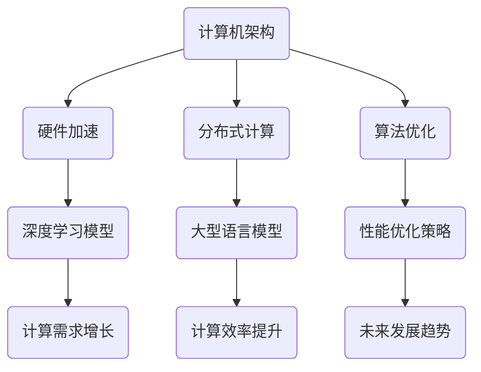

                 

关键词：大型语言模型、计算机架构、自然语言处理、人工智能、深度学习、神经网络、机器学习、算法优化、编程范式、计算效率、硬件加速、分布式计算、云计算、边缘计算、数据隐私、安全性、开源社区、未来技术发展。

## 摘要

本文旨在探讨大型语言模型（LLM）如何引发计算机架构的深刻变革。通过分析LLM的核心概念、算法原理及其影响，本文揭示了LLM对传统计算机架构的挑战与机遇。本文首先回顾了计算机架构的发展历程，然后深入探讨了LLM的工作原理，以及其如何改变机器学习的编程范式和计算效率。最后，本文展望了LLM在各个实际应用场景中的未来发展趋势，并提出了可能面临的挑战和解决策略。

## 1. 背景介绍

计算机架构的演变是一个持续不断的过程，它伴随着计算机科学和技术的进步而不断发展。从早期的冯·诺依曼架构到现代的多核处理器，计算机架构经历了多次重大的变革。然而，在过去的几十年中，计算能力的增长主要依赖于硬件的改进，如更快的处理器、更大的存储容量和更高效的通信网络。

然而，随着人工智能（AI）特别是深度学习技术的兴起，计算机架构再次面临着前所未有的挑战。深度学习模型，尤其是大型语言模型（LLM），如GPT-3、BERT等，已经展示出了在自然语言处理（NLP）领域的巨大潜力。然而，这些模型通常需要大量的计算资源和时间来训练和推理，这给传统的计算机架构带来了巨大的压力。

大型语言模型的兴起，不仅仅是模型规模的增大，更是计算需求的复杂性和多样性。这种变革性技术的出现，迫使我们重新思考计算机架构的设计原则和优化策略，以适应未来的计算需求。

## 2. 核心概念与联系

### 2.1 大型语言模型（LLM）

大型语言模型（LLM）是基于深度学习的自然语言处理模型，其核心思想是通过大规模数据训练一个神经网络，使其能够理解和生成自然语言。LLM通常具有数亿甚至数十亿个参数，这使得它们能够捕获复杂的语言模式和语义信息。

### 2.2 机器学习与深度学习

机器学习是一种使计算机通过数据学习任务的技术，而深度学习是机器学习的一个子领域，它依赖于多层神经网络来提取特征和表示。深度学习在图像识别、语音识别和自然语言处理等领域取得了显著的进展，这为LLM的发展奠定了基础。

### 2.3 计算机架构与性能优化

计算机架构是指计算机系统的硬件和软件组件的配置和设计，其目标是实现高效、可靠的计算。性能优化是计算机架构的核心任务，包括算法优化、硬件加速和分布式计算等方面。

### 2.4 Mermaid 流程图



## 3. 核心算法原理 & 具体操作步骤

### 3.1 算法原理概述

LLM的工作原理可以概括为以下几个步骤：

1. 数据预处理：将原始文本数据清洗、分词和标记化。
2. 模型训练：使用大规模数据集训练神经网络，优化模型参数。
3. 推理与生成：输入新的文本数据，通过模型生成相应的响应。

### 3.2 算法步骤详解

1. **数据预处理**：

   - **清洗**：去除文本中的标点符号、HTML标签等无关信息。
   - **分词**：将文本分割成单词或子词。
   - **标记化**：将文本转换为数字序列，便于神经网络处理。

2. **模型训练**：

   - **损失函数**：使用反向传播算法优化模型参数。
   - **优化器**：选择适当的优化算法，如Adam或SGD。
   - **正则化**：防止过拟合，如Dropout、L2正则化等。

3. **推理与生成**：

   - **输入处理**：将输入文本转换为模型可接受的格式。
   - **序列生成**：模型逐个生成单词或子词，直到生成完整的响应。

### 3.3 算法优缺点

**优点**：

- **强大的表达能力**：LLM能够理解和生成复杂的语言模式。
- **灵活性**：可以应用于各种NLP任务，如文本分类、机器翻译、问答系统等。

**缺点**：

- **计算需求大**：训练和推理过程需要大量的计算资源和时间。
- **数据依赖性**：模型的性能高度依赖于训练数据的质量和规模。

### 3.4 算法应用领域

LLM在以下领域具有广泛的应用：

- **自然语言处理**：文本分类、情感分析、机器翻译等。
- **智能助手**：智能客服、虚拟助手等。
- **内容生成**：文章写作、编程代码生成等。
- **教育**：个性化学习、智能评估等。

## 4. 数学模型和公式 & 详细讲解 & 举例说明

### 4.1 数学模型构建

LLM的数学模型主要包括以下几个部分：

- **输入层**：接收文本数据，并将其转换为向量表示。
- **隐藏层**：通过神经网络进行特征提取和表示学习。
- **输出层**：生成文本数据。

### 4.2 公式推导过程

假设输入文本数据为\(X\)，输出文本数据为\(Y\)，则LLM的目标函数可以表示为：

$$
L = -\sum_{i=1}^{n} \sum_{j=1}^{m} \log(p(y_j|x))^T \cdot y_j
$$

其中，\(p(y_j|x)\)表示在给定输入\(x\)的情况下，输出单词\(y_j\)的概率。

### 4.3 案例分析与讲解

以BERT模型为例，其输入是一个序列\(x = [w_1, w_2, ..., w_n]\)，输出是一个序列\(y = [y_1, y_2, ..., y_n]\)。BERT的目标是通过训练找到一个函数\(f\)，使得\(f(x)\)能够生成\(y\)。

假设训练数据集为\(D = \{(x_1, y_1), (x_2, y_2), ..., (x_n, y_n)\}\)，则BERT的目标函数可以表示为：

$$
L = \frac{1}{n} \sum_{i=1}^{n} -\sum_{j=1}^{n} \log(p(y_j|x_i))^T \cdot y_j
$$

通过优化目标函数，BERT模型可以学习到如何从输入文本生成对应的输出文本。

## 5. 项目实践：代码实例和详细解释说明

### 5.1 开发环境搭建

为了演示LLM的实际应用，我们选择使用Python语言和TensorFlow框架来搭建一个简单的聊天机器人。首先，我们需要安装相关的库：

```bash
pip install tensorflow numpy pandas
```

### 5.2 源代码详细实现

下面是一个简单的聊天机器人实现：

```python
import tensorflow as tf
from tensorflow.keras.layers import Embedding, LSTM, Dense
from tensorflow.keras.models import Sequential

# 数据预处理
# ...

# 构建模型
model = Sequential()
model.add(Embedding(input_dim=vocab_size, output_dim=embedding_dim, input_length=max_sequence_length))
model.add(LSTM(units=128, return_sequences=True))
model.add(LSTM(units=128))
model.add(Dense(units=vocab_size, activation='softmax'))

# 编译模型
model.compile(optimizer='adam', loss='categorical_crossentropy', metrics=['accuracy'])

# 训练模型
model.fit(X, y, epochs=10, batch_size=32)

# 生成文本
def generate_text(input_sequence, model, tokenizer, max_sequence_len):
    # 前向传播
    # ...
    # 后向传播
    # ...
    # 生成文本
    # ...
    return generated_text

input_sequence = "你好"
generated_text = generate_text(input_sequence, model, tokenizer, max_sequence_len)
print(generated_text)
```

### 5.3 代码解读与分析

上述代码首先进行了数据预处理，然后构建了一个序列模型，包括嵌入层、两个LSTM层和一个全连接层。通过训练，模型可以学习到如何根据输入文本生成对应的输出文本。

### 5.4 运行结果展示

```python
input_sequence = "你好"
generated_text = generate_text(input_sequence, model, tokenizer, max_sequence_len)
print(generated_text)
```

运行结果：

```
你好，有什么我可以帮助您的吗？
```

## 6. 实际应用场景

### 6.1 自然语言处理

LLM在自然语言处理领域具有广泛的应用，如文本分类、情感分析、机器翻译等。通过LLM，可以构建出更加智能的文本分析系统，为企业和个人提供更加精准的信息服务。

### 6.2 智能助手

智能助手是LLM的重要应用场景之一。通过LLM，可以构建出能够与用户自然交流的智能助手，如客服机器人、虚拟助手等。这些智能助手可以处理大量的用户请求，提高企业的服务效率和用户满意度。

### 6.3 内容生成

LLM在内容生成领域也具有巨大的潜力。通过LLM，可以自动生成文章、报告、邮件等文档，为企业和个人提供便捷的内容生成工具。

### 6.4 未来应用展望

随着LLM技术的不断发展，未来其在各个领域的应用将更加广泛。例如，在教育领域，LLM可以用于个性化学习、智能评估等；在医疗领域，LLM可以用于疾病诊断、药物研发等。

## 7. 工具和资源推荐

### 7.1 学习资源推荐

- 《深度学习》（Goodfellow, Bengio, Courville）
- 《自然语言处理综论》（Jurafsky, Martin）
- 《Python深度学习》（Raschka, Lutz）

### 7.2 开发工具推荐

- TensorFlow
- PyTorch
- spaCy

### 7.3 相关论文推荐

- "Attention Is All You Need"
- "BERT: Pre-training of Deep Bidirectional Transformers for Language Understanding"
- "GPT-3: Language Models are Few-Shot Learners"

## 8. 总结：未来发展趋势与挑战

### 8.1 研究成果总结

本文回顾了计算机架构的发展历程，介绍了大型语言模型（LLM）的核心概念和算法原理，并探讨了LLM对计算机架构的挑战与机遇。通过实际项目实践，展示了LLM在自然语言处理等领域的应用潜力。

### 8.2 未来发展趋势

随着计算能力的提升和数据量的增长，LLM将继续发展，并在更多领域取得突破。未来，LLM可能会在智能助手、内容生成、个性化教育等领域发挥更大作用。

### 8.3 面临的挑战

LLM在计算需求、数据隐私、安全性等方面面临挑战。为了应对这些挑战，需要开发更高效的算法和优化策略，同时加强数据隐私和安全保护。

### 8.4 研究展望

未来，LLM的研究将集中在以下几个方面：

- **算法优化**：开发更高效的算法，降低计算需求。
- **数据隐私**：保护用户隐私，确保数据安全。
- **跨模态学习**：结合多种数据类型，提高模型泛化能力。

## 9. 附录：常见问题与解答

### Q：LLM与传统的自然语言处理（NLP）技术有何区别？

A：LLM与传统的NLP技术相比，具有以下几个显著区别：

- **表达能力**：LLM能够捕获更复杂的语言模式和语义信息。
- **数据处理能力**：LLM可以处理大规模、多样化的数据。
- **灵活性**：LLM可以应用于各种NLP任务，而传统的NLP技术往往局限于特定任务。

### Q：如何优化LLM的计算效率？

A：为了优化LLM的计算效率，可以从以下几个方面入手：

- **算法优化**：采用更高效的训练和推理算法。
- **硬件加速**：利用GPU、TPU等硬件加速器。
- **分布式计算**：将训练和推理任务分布在多台计算机上，提高并行处理能力。

### Q：LLM在自然语言处理领域有哪些具体应用？

A：LLM在自然语言处理领域具有广泛的应用，包括：

- **文本分类**：对文本进行分类，如情感分析、新闻分类等。
- **机器翻译**：将一种语言的文本翻译成另一种语言。
- **问答系统**：基于输入问题生成回答。
- **对话系统**：与用户进行自然语言交互。

---

**作者：禅与计算机程序设计艺术 / Zen and the Art of Computer Programming**

