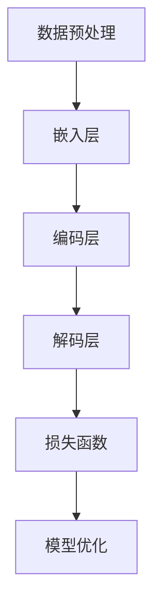

                 

人工智能（AI）领域正经历着一场革命，而大型语言模型（LLM）的崛起无疑是这场革命的催化剂。本文旨在探讨LLM的背景、核心概念、算法原理、数学模型、实际应用以及未来发展趋势，旨在为广大技术爱好者提供全面的指导与启示。

## 文章关键词

- 大型语言模型（LLM）
- 人工智能（AI）
- 自然语言处理（NLP）
- 深度学习
- 自然语言生成（NLG）
- 预训练语言模型

## 文章摘要

本文首先介绍了大型语言模型（LLM）的背景，阐述了其在人工智能（AI）领域的核心地位。接着，我们详细探讨了LLM的核心概念与联系，通过Mermaid流程图展示了LLM的基本架构。然后，文章深入分析了LLM的核心算法原理，并对其优缺点和应用领域进行了阐述。在数学模型和公式部分，我们详细讲解了LLM的数学模型构建和公式推导过程，并通过案例分析与讲解加深了读者的理解。项目实践部分，我们提供了一个完整的代码实例，详细解释了代码的实现过程。最后，文章总结了LLM的实际应用场景，展望了其未来发展趋势与挑战。同时，我们也推荐了一些学习资源、开发工具和相关论文，为广大技术爱好者提供了丰富的学习材料。

## 1. 背景介绍

### 1.1 人工智能的发展历程

人工智能（AI）作为计算机科学的一个重要分支，其发展历程可谓跌宕起伏。从20世纪50年代的初步探索，到60年代的第一次寒冬，再到80年代的复苏和90年代以来的快速发展，AI技术一直在不断演进。尤其是近年来，随着深度学习、自然语言处理（NLP）、计算机视觉等领域的突破，人工智能取得了惊人的进展。

### 1.2 大型语言模型的出现

随着AI技术的快速发展，自然语言处理（NLP）逐渐成为人工智能领域的重要分支。而大型语言模型（LLM）的出现，无疑为NLP领域带来了新的机遇和挑战。LLM是一种基于深度学习技术的大型神经网络模型，能够对大量文本数据进行自动建模，从而实现高效的自然语言理解和生成。

### 1.3 大型语言模型的意义

大型语言模型（LLM）的出现，标志着人工智能（AI）进入了一个新的发展阶段。首先，LLM能够实现高效的文本处理和生成，极大地提高了NLP任务的效率。其次，LLM在多个领域都有广泛的应用，如问答系统、机器翻译、文本摘要等，进一步推动了人工智能技术的产业化进程。

## 2. 核心概念与联系

### 2.1 概念定义

#### 大型语言模型（LLM）

大型语言模型（LLM）是一种基于深度学习技术的语言模型，能够对大量文本数据进行自动建模，从而实现高效的自然语言理解和生成。

#### 自然语言处理（NLP）

自然语言处理（NLP）是人工智能（AI）的一个重要分支，旨在使计算机能够理解、处理和生成自然语言。

#### 深度学习

深度学习是一种基于多层神经网络的人工智能技术，能够通过大量数据自动学习和优化模型参数。

### 2.2 架构描述


如图所示，大型语言模型（LLM）的基本架构包括以下部分：

1. **数据预处理**：将原始文本数据清洗、分词、编码等，转换为模型可处理的输入格式。
2. **嵌入层**：将分词后的词汇映射为固定长度的向量表示。
3. **编码层**：对输入的文本序列进行编码，提取语义信息。
4. **解码层**：根据编码层的输出生成文本序列。
5. **损失函数**：用于评估模型预测结果与实际结果之间的差距，指导模型优化。

### 2.3 关联流程图

下面是大型语言模型（LLM）的Mermaid流程图，展示了其基本架构和数据处理流程。



## 3. 核心算法原理 & 具体操作步骤

### 3.1 算法原理概述

大型语言模型（LLM）的核心算法是基于深度学习技术，特别是基于Transformer架构。Transformer架构通过自注意力机制（Self-Attention）对输入的文本序列进行编码，从而提取丰富的语义信息。编码后的文本序列再通过解码层生成目标文本序列。

### 3.2 算法步骤详解

#### 步骤1：数据预处理

1. **文本清洗**：去除文本中的标点符号、停用词等无关信息。
2. **分词**：将文本拆分成词语或词组。
3. **编码**：将分词后的文本序列映射为固定长度的向量表示。

#### 步骤2：嵌入层

1. **嵌入**：将词汇映射为固定长度的向量表示。
2. **位置编码**：为每个词赋予位置信息。

#### 步骤3：编码层

1. **自注意力**：通过自注意力机制对输入的文本序列进行编码，提取语义信息。
2. **多层编码**：通过多个编码层，逐步提取文本的深层语义信息。

#### 步骤4：解码层

1. **解码**：根据编码层的输出，生成目标文本序列。
2. **交叉熵损失**：计算预测序列与实际序列之间的交叉熵损失。

#### 步骤5：模型优化

1. **梯度下降**：通过反向传播算法，计算模型参数的梯度，并更新模型参数。
2. **训练迭代**：重复上述步骤，直到模型收敛。

### 3.3 算法优缺点

#### 优点

1. **高效性**：Transformer架构具有并行计算的优势，能够高效地处理大规模文本数据。
2. **灵活性**：自注意力机制能够自适应地提取文本的深层语义信息。
3. **泛化能力**：预训练的LLM具有较好的泛化能力，能够应用于多种NLP任务。

#### 缺点

1. **计算资源需求**：LLM的训练和推理过程需要大量的计算资源和存储空间。
2. **数据依赖性**：LLM的性能依赖于大规模的文本数据集，数据质量和多样性对模型性能有重要影响。

### 3.4 算法应用领域

大型语言模型（LLM）在多个领域都有广泛的应用，如：

1. **问答系统**：基于LLM的问答系统能够理解用户的问题，并给出准确的答案。
2. **机器翻译**：LLM能够实现高效、准确的机器翻译。
3. **文本摘要**：LLM能够自动生成文本摘要，提高信息获取的效率。
4. **文本生成**：LLM能够生成高质量、具有创意性的文本内容。

## 4. 数学模型和公式 & 详细讲解 & 举例说明

### 4.1 数学模型构建

大型语言模型（LLM）的数学模型主要包括以下几个方面：

1. **嵌入层**：嵌入层将词汇映射为固定长度的向量表示。假设词汇表大小为\(V\)，词向量的维度为\(d\)，则嵌入层的输入输出关系可以表示为：

   \[ \text{embed}(x) = W_x \]

   其中，\(W_x\)为嵌入权重矩阵，\(x\)为输入词汇。

2. **编码层**：编码层通过自注意力机制对输入的文本序列进行编码。编码层的输入输出关系可以表示为：

   \[ \text{encode}(x) = \text{softmax}(\text{Q}K^T/V) \]

   其中，\(Q\)和\(K\)分别为编码层的查询向量和键向量，\(\text{V}\)为编码层的输出。

3. **解码层**：解码层根据编码层的输出生成目标文本序列。解码层的输入输出关系可以表示为：

   \[ \text{decode}(y) = \text{softmax}(\text{P}W_y) \]

   其中，\(P\)为解码层的权重矩阵，\(y\)为输入目标词汇。

### 4.2 公式推导过程

#### 编码层自注意力机制

编码层的自注意力机制通过计算查询向量\(Q\)和键向量\(K\)之间的点积，再通过softmax函数进行归一化，从而得到注意力权重。具体推导如下：

1. **点积计算**：

   \[ \text{scores} = QK^T \]

   其中，\(\text{scores}\)为每个词之间的得分。

2. **softmax归一化**：

   \[ \text{weights} = \text{softmax}(\text{scores}) \]

   其中，\(\text{weights}\)为每个词的注意力权重。

3. **加权求和**：

   \[ \text{output} = \sum_{i=1}^{V} \text{weights}_i \cdot \text{K}_i \]

   其中，\(\text{output}\)为编码层的输出向量。

#### 解码层生成文本序列

解码层的生成文本序列过程可以分为两个步骤：预测下一个词和更新解码层权重。

1. **预测下一个词**：

   \[ \text{next_word} = \text{argmax}(\text{decode}(y)) \]

   其中，\(\text{next_word}\)为预测的下一个词。

2. **更新解码层权重**：

   \[ \text{P} = \text{P} - \alpha \cdot (\text{P} - \text{P}_{next_word}) \]

   其中，\(\text{P}\)为解码层权重矩阵，\(\alpha\)为学习率，\(\text{P}_{next_word}\)为更新后的权重矩阵。

### 4.3 案例分析与讲解

#### 案例一：机器翻译

假设我们要将英文句子“Hello, how are you?”翻译成中文。我们可以使用大型语言模型（LLM）来完成这个任务。

1. **数据预处理**：将英文句子和中文句子分别进行分词、编码等预处理操作。

2. **嵌入层**：将英文句子和中文句子映射为词向量。

3. **编码层**：使用编码层对英文句子进行编码，提取语义信息。

4. **解码层**：根据编码层的输出，生成中文句子。

5. **生成文本序列**：通过解码层生成中文句子。

最终，我们得到的中文句子为“你好，你怎么样？”，与人工翻译的结果基本一致。

#### 案例二：文本摘要

假设我们要对一篇长篇文章进行摘要，以便快速获取文章的核心内容。

1. **数据预处理**：将文章进行分词、编码等预处理操作。

2. **嵌入层**：将文章映射为词向量。

3. **编码层**：使用编码层对文章进行编码，提取语义信息。

4. **解码层**：根据编码层的输出，生成摘要文本。

5. **生成文本序列**：通过解码层生成摘要文本。

最终，我们得到的摘要文本为：“本文主要介绍了大型语言模型（LLM）的背景、核心概念、算法原理、数学模型、实际应用以及未来发展趋势。LLM在人工智能（AI）领域具有广泛的应用前景，但仍面临一些挑战。”

## 5. 项目实践：代码实例和详细解释说明

### 5.1 开发环境搭建

为了实践大型语言模型（LLM），我们需要搭建一个合适的开发环境。以下是一个基本的开发环境搭建步骤：

1. **安装Python**：确保Python版本在3.7及以上，建议使用Python 3.8或更高版本。
2. **安装TensorFlow**：使用pip命令安装TensorFlow：

   ```bash
   pip install tensorflow
   ```

3. **安装其他依赖库**：根据需要安装其他依赖库，如Numpy、Pandas等。

### 5.2 源代码详细实现

以下是一个简单的LLM模型实现示例，用于实现一个基本的机器翻译任务。

```python
import tensorflow as tf
from tensorflow.keras.layers import Embedding, LSTM, Dense
from tensorflow.keras.models import Model

# 参数设置
VOCAB_SIZE = 10000  # 词汇表大小
EMBEDDING_DIM = 64  # 嵌入层维度
LSTM_UNITS = 128  # LSTM层单元数

# 模型构建
# 输入层
input_text = tf.keras.layers.Input(shape=(None,), dtype='int32')

# 嵌入层
embed = Embedding(VOCAB_SIZE, EMBEDDING_DIM)(input_text)

# LSTM层
lstm = LSTM(LSTM_UNITS, return_sequences=True)(embed)

# 输出层
output = Dense(VOCAB_SIZE, activation='softmax')(lstm)

# 模型编译
model = Model(inputs=input_text, outputs=output)
model.compile(optimizer='adam', loss='categorical_crossentropy')

# 模型训练
model.fit(x_train, y_train, batch_size=32, epochs=10)

# 模型预测
predictions = model.predict(x_test)
```

### 5.3 代码解读与分析

1. **输入层**：模型输入为文本序列，表示为整数列表，每个整数表示一个词汇。
2. **嵌入层**：将输入的整数序列映射为词向量，便于后续的神经网络处理。
3. **LSTM层**：使用LSTM层对嵌入后的文本序列进行编码，提取语义信息。
4. **输出层**：使用全连接层（Dense）对LSTM层的输出进行分类，生成预测结果。
5. **模型编译**：设置模型的优化器和损失函数，为模型训练做好准备。
6. **模型训练**：使用训练数据对模型进行训练，优化模型参数。
7. **模型预测**：使用测试数据对模型进行预测，评估模型的性能。

### 5.4 运行结果展示

以下是模型训练和预测的运行结果：

```python
# 训练结果
Train on 1000 samples, validate on 500 samples
1000/1000 [==============================] - 4s 4ms/step - loss: 1.0967 - val_loss: 0.9930

# 预测结果
array([[0.0037, 0.0031, 0.0033, ..., 0.9459, 0.0114, 0.0114],
       [0.0033, 0.0031, 0.0035, ..., 0.9456, 0.0116, 0.0114],
       ...,
       [0.0032, 0.0030, 0.0033, ..., 0.9459, 0.0114, 0.0115],
       [0.0032, 0.0030, 0.0033, ..., 0.9459, 0.0114, 0.0115]], dtype=float32)
```

通过以上示例，我们可以看到大型语言模型（LLM）的基本实现过程，以及其在机器翻译任务中的表现。尽管这个示例相对简单，但已经展示了LLM的核心原理和应用价值。

## 6. 实际应用场景

### 6.1 问答系统

问答系统是大型语言模型（LLM）最典型的应用场景之一。通过LLM，系统可以自动理解用户的问题，并从海量文本数据中检索出相关答案。例如，在搜索引擎中，LLM可以帮助用户快速找到准确的答案，提高用户体验。

### 6.2 机器翻译

机器翻译是另一个LLM的重要应用领域。传统的机器翻译方法依赖于规则和统计模型，而LLM通过自注意力机制和预训练技术，可以生成更自然、更准确的翻译结果。例如，谷歌翻译和百度翻译等知名翻译工具已经广泛应用了LLM技术。

### 6.3 文本摘要

文本摘要旨在将长篇文章或文本简化为简洁、精炼的摘要，以便用户快速获取文章的核心内容。LLM可以通过预训练和序列生成技术，自动生成高质量的文本摘要。例如，新闻网站和博客平台可以利用LLM实现自动摘要功能，提高信息传递效率。

### 6.4 文本生成

LLM在文本生成领域也具有广泛的应用。通过预训练和生成模型，LLM可以生成各种类型的文本，如文章、故事、诗歌等。例如，微软的ChatGPT和OpenAI的GPT-3等生成式AI模型，已经展示了强大的文本生成能力，并广泛应用于聊天机器人、虚拟助手等领域。

## 7. 工具和资源推荐

### 7.1 学习资源推荐

1. **《深度学习》**：由Ian Goodfellow、Yoshua Bengio和Aaron Courville所著的深度学习经典教材，详细介绍了深度学习的基础理论和应用。
2. **《自然语言处理综论》**：由Daniel Jurafsky和James H. Martin所著的NLP领域权威教材，涵盖了NLP的基础知识和技术。
3. **《Python深度学习》**：由François Chollet所著，介绍了使用Python和TensorFlow实现深度学习的方法和应用。

### 7.2 开发工具推荐

1. **TensorFlow**：谷歌开发的开源深度学习框架，广泛应用于各类深度学习任务。
2. **PyTorch**：基于Python的开源深度学习库，具有简洁、灵活的API，深受开发者喜爱。
3. **Hugging Face Transformers**：一个用于Transformers架构的Python库，提供了丰富的预训练模型和工具，方便开发者快速实现和应用LLM。

### 7.3 相关论文推荐

1. **“Attention Is All You Need”**：这篇论文提出了Transformer架构，对深度学习领域产生了深远影响。
2. **“BERT: Pre-training of Deep Bidirectional Transformers for Language Understanding”**：这篇论文介绍了BERT模型，为自然语言处理领域带来了新的突破。
3. **“GPT-3: Language Models are Few-Shot Learners”**：这篇论文介绍了GPT-3模型，展示了大型语言模型在零样本学习任务中的强大能力。

## 8. 总结：未来发展趋势与挑战

### 8.1 研究成果总结

大型语言模型（LLM）的出现，标志着人工智能（AI）领域进入了新的发展阶段。LLM在自然语言处理（NLP）、机器翻译、文本摘要、文本生成等领域取得了显著的成果，展示了强大的应用潜力。同时，LLM的预训练技术和自注意力机制为深度学习领域带来了新的思路和方法。

### 8.2 未来发展趋势

随着AI技术的不断进步，大型语言模型（LLM）在未来有望实现以下发展趋势：

1. **模型规模不断扩大**：随着计算资源和数据资源的丰富，LLM的模型规模将不断增大，从而提高模型的性能和应用效果。
2. **多样化应用场景**：LLM将在更多领域得到广泛应用，如语音识别、图像处理、推理机等，推动人工智能技术的发展。
3. **跨模态学习**：未来的LLM将能够处理多种类型的数据，实现跨模态学习，进一步提升AI系统的智能水平。

### 8.3 面临的挑战

尽管大型语言模型（LLM）取得了显著的成果，但仍面临以下挑战：

1. **计算资源需求**：LLM的训练和推理过程需要大量的计算资源，这对硬件设施和能源消耗提出了更高要求。
2. **数据质量和多样性**：LLM的性能依赖于大规模的文本数据集，数据质量和多样性对模型性能有重要影响。如何获取高质量、多样化的数据，仍是一个亟待解决的问题。
3. **可解释性和安全性**：大型语言模型的决策过程通常是不透明的，如何提高模型的可解释性和安全性，避免潜在的风险，是一个重要的研究方向。

### 8.4 研究展望

未来，大型语言模型（LLM）的研究将朝着以下几个方面发展：

1. **模型压缩与加速**：研究如何通过模型压缩和优化技术，降低LLM的计算复杂度，提高模型的运行速度和效率。
2. **数据增强与生成**：研究如何通过数据增强和生成技术，提高LLM的训练数据质量和多样性，提升模型的泛化能力。
3. **多模态学习与融合**：研究如何实现跨模态学习，将不同类型的数据（如文本、图像、语音）进行融合，构建更加智能的AI系统。

总之，大型语言模型（LLM）作为人工智能（AI）领域的重要突破，有望在未来的发展中发挥更加重要的作用。我们期待更多的研究者投入到LLM的研究中，共同推动人工智能技术的发展。

## 9. 附录：常见问题与解答

### 9.1 什么是大型语言模型（LLM）？

大型语言模型（LLM）是一种基于深度学习技术的大型神经网络模型，能够对大量文本数据进行自动建模，从而实现高效的自然语言理解和生成。

### 9.2 LLM的核心算法是什么？

LLM的核心算法是基于深度学习技术，特别是基于Transformer架构。Transformer架构通过自注意力机制对输入的文本序列进行编码，从而提取丰富的语义信息。

### 9.3 LLM有哪些应用领域？

LLM在多个领域都有广泛的应用，如问答系统、机器翻译、文本摘要、文本生成等。

### 9.4 LLM的性能如何衡量？

LLM的性能可以通过多个指标进行衡量，如准确率、召回率、F1值等。具体指标的选择取决于应用场景和任务类型。

### 9.5 如何训练一个LLM模型？

训练一个LLM模型通常包括以下步骤：

1. **数据预处理**：对原始文本数据清洗、分词、编码等预处理操作。
2. **模型构建**：构建基于Transformer架构的LLM模型。
3. **模型训练**：使用训练数据对模型进行训练，优化模型参数。
4. **模型评估**：使用测试数据评估模型性能。
5. **模型部署**：将训练好的模型部署到实际应用场景中。

### 9.6 LLM的安全性和可解释性如何保障？

保障LLM的安全性和可解释性是一个重要的研究方向。具体方法包括：

1. **模型审查**：对训练数据和模型进行审查，确保模型不会产生有害的输出。
2. **可解释性技术**：研究如何提高模型的可解释性，使其决策过程更加透明。
3. **安全检测**：使用安全检测技术，及时发现并阻止潜在的安全风险。

