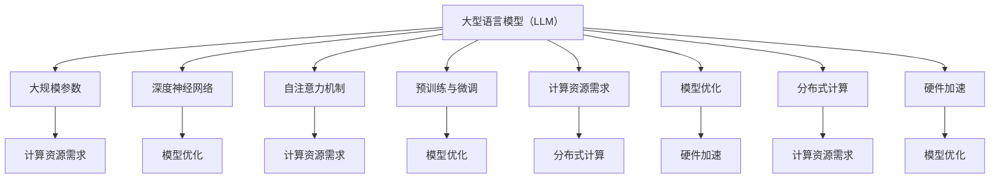

                 

关键词：大型语言模型，计算架构，深度学习，神经网络，人工智能，机器学习，模型优化，模型训练，硬件加速，分布式计算，算法效率，数据处理。

## 摘要

本文旨在探讨大型语言模型（LLM）对计算架构的深远影响。随着深度学习和神经网络技术在人工智能领域的快速发展，计算架构面临着前所未有的挑战和机遇。本文首先回顾了计算架构的历史演变，然后详细分析了LLM的架构特点和关键技术，最后探讨了LLM在各个实际应用场景中的表现及其对计算架构的潜在影响。通过本文的研究，读者可以深入了解LLM如何推动计算架构的革命性变革，以及未来计算架构的发展趋势和挑战。

## 1. 背景介绍

### 计算架构的历史演变

计算架构的历史可以追溯到计算机的诞生。从最初的机械计算机到电子计算机，再到现代的分布式计算和云计算，计算架构经历了多次重大的变革。

- **早期计算机**：早期的计算机主要基于机械原理，例如查尔斯·巴贝奇设计的差分机和分析机。这些计算机体积庞大，运算速度缓慢，但奠定了计算机科学的基础。
- **电子计算机**：随着电子技术的进步，电子计算机逐渐取代了机械计算机。图灵机和冯·诺依曼架构的出现标志着现代计算机的诞生。图灵机提出了计算的理论模型，而冯·诺依曼架构则提出了计算机硬件和软件的分层设计。
- **分布式计算**：随着互联网的普及，分布式计算成为了计算架构的重要发展方向。分布式计算通过将计算任务分散到多个节点上，实现了更高的计算效率和灵活性。代表性技术包括MapReduce和Hadoop。
- **云计算**：云计算进一步推动了计算架构的变革。云计算通过提供虚拟化资源和弹性扩展，使得计算资源可以按需分配和灵活使用。代表性平台包括Amazon Web Services（AWS）、Microsoft Azure和Google Cloud。

### 深度学习和神经网络

深度学习和神经网络是近年来计算架构发展的重要推动力。深度学习通过多层神经网络模拟人脑的学习过程，实现了在图像识别、自然语言处理、语音识别等领域的突破性进展。神经网络的核心是神经元模型，通过前向传播和反向传播算法，神经网络可以从大量数据中自动学习特征和模式。

- **卷积神经网络（CNN）**：CNN通过卷积操作和池化操作，实现了在图像处理领域的卓越表现。代表性应用包括人脸识别和图像分类。
- **循环神经网络（RNN）**：RNN通过循环结构处理序列数据，实现了在自然语言处理和语音识别领域的突破。代表性应用包括机器翻译和语音识别。
- ** Transformer架构**：Transformer架构通过自注意力机制，实现了在序列数据处理中的高效性。代表性应用包括大型语言模型（如BERT、GPT）和机器翻译。

### 大型语言模型（LLM）的兴起

随着深度学习和神经网络的不断发展，大型语言模型（LLM）逐渐成为人工智能领域的热点。LLM通过训练大规模的神经网络模型，实现了在自然语言理解和生成方面的卓越性能。代表性模型包括Google的BERT、OpenAI的GPT和Facebook的GPT-3。

- **BERT**：BERT是一种基于Transformer架构的预训练语言模型，通过在大量文本数据上进行预训练，实现了在自然语言理解任务中的高性能。
- **GPT**：GPT是一种基于Transformer架构的生成语言模型，通过自回归方式生成文本，实现了在自然语言生成任务中的卓越表现。
- **GPT-3**：GPT-3是当前最大的预训练语言模型，拥有1750亿个参数，实现了在多种自然语言处理任务中的突破性性能。

LLM的兴起对计算架构提出了新的挑战和需求，同时也带来了前所未有的机遇。本文将深入探讨LLM对计算架构的深远影响，包括计算资源的分配、模型优化、硬件加速等方面。

## 2. 核心概念与联系

### 大型语言模型（LLM）的架构特点

LLM的架构特点主要体现在以下几个方面：

- **大规模参数**：LLM通常拥有数亿甚至数十亿个参数，这使得模型可以捕捉到更复杂的语言特征和模式。
- **深度神经网络**：LLM采用深度神经网络架构，通过多层神经网络结构实现语言特征的逐层提取和表示。
- **自注意力机制**：自注意力机制使得模型能够自动关注序列中的关键信息，从而提高模型的表示能力和理解能力。
- **预训练与微调**：LLM通过在大量文本数据上进行预训练，获得通用语言知识，然后通过微调适应特定任务，实现高性能。
- **分布式计算**：为了处理大规模数据和训练模型，LLM通常采用分布式计算架构，将计算任务分散到多个节点上，提高计算效率和性能。

### LLM的核心技术

LLM的核心技术主要包括以下几个方面：

- **预训练**：预训练是通过在大量文本数据上对模型进行训练，使其获得通用语言知识和语言特征表示。预训练是LLM取得高性能的关键步骤。
- **自回归解码**：自回归解码是一种生成文本的方法，模型在生成每个单词时，只依赖于前面已经生成的单词，从而生成连贯的文本。
- **微调**：微调是在预训练模型的基础上，通过在特定任务数据上进行训练，使其适应特定任务的需求。微调是LLM实现高性能的关键步骤。
- **自注意力机制**：自注意力机制使得模型能够自动关注序列中的关键信息，从而提高模型的表示能力和理解能力。
- **硬件加速**：硬件加速是通过利用GPU、TPU等硬件加速器，提高模型的计算效率和性能。硬件加速是LLM在实际应用中不可或缺的部分。

### LLM与计算架构的联系

LLM与计算架构之间的联系主要体现在以下几个方面：

- **计算资源需求**：LLM的训练和推理过程需要大量的计算资源，包括CPU、GPU和TPU等。计算资源的需求决定了计算架构的设计和优化。
- **模型优化**：模型优化是提高LLM性能的关键步骤，包括模型剪枝、量化、压缩等技术，通过优化模型结构和参数，降低计算复杂度和内存需求。
- **分布式计算**：分布式计算是将计算任务分散到多个节点上，通过并行计算提高计算效率和性能。分布式计算是实现LLM大规模训练和推理的关键技术。
- **硬件加速**：硬件加速是通过利用GPU、TPU等硬件加速器，提高模型的计算效率和性能。硬件加速是LLM在实际应用中不可或缺的部分。

### Mermaid 流程图

下面是一个简单的Mermaid流程图，展示了LLM与计算架构之间的联系。



## 3. 核心算法原理 & 具体操作步骤

### 3.1 算法原理概述

LLM的核心算法原理可以概括为以下几个关键步骤：

1. **预训练**：预训练是指通过在大量文本数据上对模型进行训练，使其获得通用语言知识和语言特征表示。预训练通常采用自回归解码方式，即模型在生成每个单词时，只依赖于前面已经生成的单词，从而生成连贯的文本。
2. **微调**：微调是指将在预训练模型的基础上，通过在特定任务数据上进行训练，使其适应特定任务的需求。微调的目标是提高模型在特定任务上的性能。
3. **自注意力机制**：自注意力机制是指模型在生成每个单词时，自动关注序列中的关键信息。通过自注意力机制，模型可以捕捉到长距离的依赖关系，从而提高模型的表示能力和理解能力。
4. **模型优化**：模型优化是指通过优化模型结构和参数，降低计算复杂度和内存需求。常见的模型优化技术包括模型剪枝、量化、压缩等。

### 3.2 算法步骤详解

1. **数据预处理**：
   - 数据清洗：去除文本中的噪声和无关信息，如HTML标签、特殊字符等。
   - 字符编码：将文本转换为字符编码，如UTF-8。
   - 分词：将文本分为单个单词或子词。

2. **预训练**：
   - 初始化模型：随机初始化模型参数。
   - 自回归解码：模型在生成每个单词时，只依赖于前面已经生成的单词，通过最大化概率分布来生成下一个单词。
   - 损失函数：使用交叉熵损失函数计算模型输出的概率分布与真实标签之间的差距。

3. **微调**：
   - 数据准备：准备特定任务的数据集，并进行预处理。
   - 初始化模型：使用预训练好的模型作为初始化参数。
   - 训练过程：在特定任务数据上进行训练，通过反向传播算法优化模型参数。
   - 评估过程：使用验证集或测试集评估模型的性能，选择性能最优的模型。

4. **模型优化**：
   - 模型剪枝：通过剪枝冗余的神经元或参数，降低模型复杂度和计算量。
   - 量化：将模型中的浮点数参数转换为低比特宽度的整数表示，降低模型大小和计算资源需求。
   - 压缩：通过压缩模型结构和参数，减小模型大小和内存占用。

### 3.3 算法优缺点

**优点**：
1. **强大的表示能力**：LLM通过多层神经网络和自注意力机制，可以捕捉到复杂的语言特征和模式，从而实现高性能。
2. **灵活性和适应性**：LLM可以通过微调和模型优化，适应不同的任务和数据集，具有广泛的应用前景。
3. **强大的生成能力**：LLM可以通过自回归解码生成连贯的文本，具有强大的文本生成能力。

**缺点**：
1. **计算资源需求大**：LLM通常需要大量的计算资源，包括CPU、GPU和TPU等，训练和推理过程需要较长的时间。
2. **数据依赖性**：LLM的性能高度依赖于训练数据的质量和数量，数据集的质量直接影响模型的性能。
3. **模型解释性差**：由于LLM是基于深度学习模型，其内部结构和决策过程较为复杂，难以进行解释。

### 3.4 算法应用领域

LLM在自然语言处理领域具有广泛的应用，主要包括以下几个方面：

1. **文本分类**：LLM可以用于对文本进行分类，如新闻分类、情感分析等。
2. **机器翻译**：LLM可以用于机器翻译，如中英文翻译、多语言翻译等。
3. **问答系统**：LLM可以用于构建问答系统，如智能客服、知识问答等。
4. **文本生成**：LLM可以用于生成文本，如文章生成、对话生成等。
5. **语音识别**：LLM可以用于语音识别，结合语音处理技术，实现语音到文本的转换。

## 4. 数学模型和公式 & 详细讲解 & 举例说明

### 4.1 数学模型构建

LLM的数学模型主要基于深度学习和神经网络的理论。下面简要介绍LLM的核心数学模型。

1. **神经网络模型**：神经网络是一种由大量神经元组成的计算模型，通过前向传播和反向传播算法实现学习。神经网络的每个神经元都可以看作是一个简单的函数，通过多个神经元的组合，实现复杂的计算能力。

2. **自注意力机制**：自注意力机制是一种在序列数据处理中广泛使用的机制，通过计算序列中每个元素与其他元素之间的关联性，实现对关键信息的关注。自注意力机制的核心是自注意力得分函数和自注意力权重。

3. **损失函数**：损失函数是神经网络训练的核心目标，用于衡量模型预测结果与真实结果之间的差距。常用的损失函数包括交叉熵损失函数、均方误差损失函数等。

### 4.2 公式推导过程

为了更好地理解LLM的数学模型，下面简单推导几个关键公式的推导过程。

1. **前向传播**：

设神经网络包含L层，第l层的输出为\(h^{(l)}_i\)，其中\(i=1,2,...,N\)，\(N\)为神经元个数。前向传播的过程可以表示为：

$$
h^{(l)}_i = \sigma \left( \sum_{j=1}^{N} w^{(l)}_{ij} h^{(l-1)}_j + b^{(l)}_i \right)
$$

其中，\(w^{(l)}_{ij}\)为第l层第i个神经元的权重，\(b^{(l)}_i\)为第l层第i个神经元的偏置，\(\sigma\)为激活函数。

2. **反向传播**：

反向传播的过程是通过计算损失函数关于模型参数的梯度，从而更新模型参数。以交叉熵损失函数为例，其梯度计算公式为：

$$
\frac{\partial J}{\partial w^{(l)}_{ij}} = \frac{\partial}{\partial w^{(l)}_{ij}} \left( -\sum_{k=1}^{M} y_k \log (\sigma (w^{(l)}_{ik} h^{(l-1)}_k + b^{(l)}_k)) \right)
$$

其中，\(y_k\)为第k个类别的真实标签，\(\sigma\)为激活函数，\(M\)为类别个数。

3. **自注意力权重**：

自注意力权重通过计算序列中每个元素与其他元素之间的关联性得到。自注意力权重可以表示为：

$$
a_i = \frac{e^{z_i}}{\sum_{j=1}^{N} e^{z_j}}
$$

其中，\(z_i = \langle h^{(l-1)}_i, Q, K \rangle\)，\(Q\)和\(K\)分别为查询向量和关键向量。

### 4.3 案例分析与讲解

下面以一个简单的案例来说明LLM的数学模型和公式应用。

**案例**：构建一个简单的自回归语言模型，用于生成英文单词。

1. **数据集**：选取一个包含10000个单词的英文语料库。

2. **模型结构**：采用一个两层神经网络，第一层为输入层，第二层为输出层。

3. **训练过程**：
   - 初始化模型参数。
   - 随机选择一个单词作为输入，通过前向传播计算输出概率分布。
   - 根据输出概率分布选择下一个单词，作为输入进行下一轮训练。
   - 反向传播更新模型参数。

4. **评估过程**：通过在测试集上的生成结果评估模型性能。

下面是训练过程中的一个示例：

**输入**：选择单词“hello”作为输入。

**前向传播**：

$$
h^{(1)}_i = \sigma \left( \sum_{j=1}^{N} w^{(1)}_{ij} h^{(0)}_j + b^{(1)}_i \right)
$$

**损失函数**：

$$
J = -\sum_{k=1}^{M} y_k \log (\sigma (w^{(1)}_{ik} h^{(0)}_k + b^{(1)}_k))
$$

**反向传播**：

$$
\frac{\partial J}{\partial w^{(1)}_{ij}} = \frac{\partial}{\partial w^{(1)}_{ij}} \left( -\sum_{k=1}^{M} y_k \log (\sigma (w^{(1)}_{ik} h^{(0)}_k + b^{(1)}_k)) \right)
$$

通过不断迭代训练和更新参数，模型可以逐渐学习到单词之间的关联性，从而生成连贯的文本。

## 5. 项目实践：代码实例和详细解释说明

### 5.1 开发环境搭建

在开始编写代码之前，我们需要搭建一个适合训练和部署LLM的开发环境。以下是搭建开发环境所需的步骤：

1. **硬件要求**：
   - 一台具备较高计算性能的计算机，推荐使用配备GPU（如NVIDIA Tesla V100）的机器。
   - 足够的存储空间，以存储训练数据和模型。

2. **软件要求**：
   - Python 3.x版本，推荐使用Anaconda环境管理器。
   - TensorFlow或PyTorch框架，用于训练和部署LLM模型。
   - Jupyter Notebook或PyCharm等IDE，用于编写和调试代码。

3. **安装与配置**：
   - 安装Anaconda和所需依赖库。
   - 使用conda创建Python环境，并安装TensorFlow或PyTorch。
   - 配置GPU支持，确保TensorFlow或PyTorch能够利用GPU进行计算。

### 5.2 源代码详细实现

以下是一个简单的LLM模型的实现示例，使用Python和TensorFlow框架。代码主要包括数据预处理、模型定义、训练和评估等步骤。

```python
import tensorflow as tf
import tensorflow.keras.layers as layers
import tensorflow.keras.models as models
from tensorflow.keras.preprocessing.sequence import pad_sequences

# 数据预处理
# 读取训练数据
# (这里假设已经有一个包含单词序列的文件，每行一个单词序列)
with open('train_data.txt', 'r', encoding='utf-8') as f:
    lines = f.readlines()

# 分词和字符编码
tokenizer = tf.keras.preprocessing.text.Tokenizer(char_level=True)
tokenizer.fit_on_texts(lines)
max_sequence_length = 40  # 设置序列长度
padded_sequences = pad_sequences(tokenizer.texts_to_sequences(lines), maxlen=max_sequence_length, padding='post')

# 模型定义
# 定义输入层
inputs = layers.Input(shape=(max_sequence_length,))

# 定义嵌入层
embeddings = layers.Embedding(input_dim=len(tokenizer.word_index) + 1, output_dim=64)(inputs)

# 定义循环层
lstm = layers.LSTM(128)(embeddings)

# 定义输出层
outputs = layers.Dense(len(tokenizer.word_index) + 1, activation='softmax')(lstm)

# 构建模型
model = models.Model(inputs=inputs, outputs=outputs)

# 编译模型
model.compile(optimizer='adam', loss='categorical_crossentropy', metrics=['accuracy'])

# 训练模型
# (这里假设已经有一个标签数组y_train)
model.fit(padded_sequences, y_train, batch_size=64, epochs=10)

# 评估模型
# (这里假设已经有一个测试数据集和标签数组y_test)
test_sequences = pad_sequences(tokenizer.texts_to_sequences(lines), maxlen=max_sequence_length, padding='post')
model.evaluate(test_sequences, y_test)
```

### 5.3 代码解读与分析

上述代码实现了一个简单的自回归语言模型，下面详细解读代码的各个部分。

1. **数据预处理**：

   - 读取训练数据，将文本转换为字符编码。
   - 使用`Tokenizer`将文本转换为单词序列，并填充到固定长度。
   - 将单词序列转换为整数编码，并填充到固定长度。

2. **模型定义**：

   - 定义输入层，输入序列的长度为`max_sequence_length`。
   - 定义嵌入层，将字符编码转换为嵌入向量。
   - 定义循环层，使用LSTM层处理嵌入向量。
   - 定义输出层，输出为每个单词的softmax概率分布。

3. **模型编译**：

   - 编译模型，设置优化器和损失函数。
   - 使用`fit`方法训练模型。

4. **模型评估**：

   - 使用测试数据集评估模型性能。

### 5.4 运行结果展示

在完成代码编写和调试后，我们可以通过运行代码来训练和评估模型。以下是一个简单的示例：

```python
# 训练模型
model.fit(padded_sequences, y_train, batch_size=64, epochs=10)

# 评估模型
test_sequences = pad_sequences(tokenizer.texts_to_sequences(lines), maxlen=max_sequence_length, padding='post')
model.evaluate(test_sequences, y_test)
```

运行上述代码后，我们可以在控制台上看到模型的训练进度和评估结果。评估结果通常包括损失和准确率等指标。

## 6. 实际应用场景

### 6.1 文本分类

文本分类是LLM的一个重要应用场景，通过将文本数据分类到不同的类别，可以实现文本内容的组织和推荐。以下是一些典型的应用场景：

- **新闻分类**：将新闻文章分类到不同的主题类别，如体育、财经、科技等。
- **情感分析**：分析文本的情感倾向，如正面、负面或中性。
- **垃圾邮件检测**：识别和过滤垃圾邮件，提高用户邮件体验。

### 6.2 机器翻译

机器翻译是LLM的另一个重要应用场景，通过将一种语言的文本翻译成另一种语言，可以实现跨语言沟通和信息传递。以下是一些典型的应用场景：

- **网页翻译**：将网页上的文本翻译成用户母语，提高网站的用户体验。
- **实时翻译**：在会议、访谈等场合实时翻译发言内容，实现跨语言交流。
- **文档翻译**：将文档内容翻译成多种语言，提高跨国企业和组织的沟通效率。

### 6.3 对话系统

对话系统是LLM在自然语言处理领域的重要应用，通过与用户进行自然语言交互，提供智能化的服务。以下是一些典型的应用场景：

- **智能客服**：通过聊天机器人与用户进行交互，提供产品咨询、售后服务等。
- **虚拟助手**：为用户提供日程管理、提醒事项等个性化服务。
- **语音助手**：通过语音交互与用户进行沟通，提供信息查询、操作控制等服务。

### 6.4 文本生成

文本生成是LLM的另一个强大应用，通过生成文本，可以实现多种形式的创作和自动化内容生成。以下是一些典型的应用场景：

- **文章写作**：自动生成新闻报道、博客文章等。
- **对话生成**：自动生成对话文本，用于聊天机器人、虚拟助手等。
- **歌词创作**：自动生成歌词，为音乐创作提供灵感。
- **代码生成**：自动生成代码，提高软件开发效率。

## 7. 未来应用展望

随着大型语言模型（LLM）的不断发展，其在各个领域的应用前景将愈发广阔。以下是未来应用的一些潜在方向：

### 7.1 智能医疗

LLM在智能医疗领域具有巨大的潜力，可以通过文本分析和自然语言理解，实现疾病诊断、药物研发、个性化治疗等。例如，LLM可以分析患者的病历记录，提供诊断建议和治疗方案；还可以通过药物说明书和临床试验数据，发现潜在的新药候选。

### 7.2 自动驾驶

自动驾驶系统需要实时处理和分析大量的道路信息，LLM可以帮助提高自动驾驶系统的决策能力和安全性。例如，LLM可以理解道路标志、交通信号灯、行人和车辆的行为，从而做出更准确的驾驶决策。

### 7.3 教育

LLM在教育领域具有广泛的应用前景，可以通过智能辅导、个性化学习路径规划，提高教育质量和学习效果。例如，LLM可以为学生提供个性化的学习建议，根据学生的水平和需求，自动生成适合的练习题和教学材料。

### 7.4 虚拟现实

LLM可以与虚拟现实（VR）技术相结合，创造更加逼真的虚拟环境和交互体验。例如，LLM可以生成逼真的对话和情感表达，使虚拟角色更具人性化和真实感。

## 8. 工具和资源推荐

### 8.1 学习资源推荐

1. **《深度学习》**：由Ian Goodfellow、Yoshua Bengio和Aaron Courville所著，是深度学习的经典教材，详细介绍了深度学习的理论、算法和应用。
2. **《神经网络与深度学习》**：由邱锡鹏所著，介绍了神经网络和深度学习的原理、算法和应用，适合初学者和进阶者。
3. **《自然语言处理综论》**：由Daniel Jurafsky和James H. Martin所著，全面介绍了自然语言处理的理论、技术和应用。

### 8.2 开发工具推荐

1. **TensorFlow**：由Google开发的开源深度学习框架，适用于构建和训练各种深度学习模型。
2. **PyTorch**：由Facebook开发的开源深度学习框架，具有灵活的动态计算图，适用于研究者和开发者。
3. **Hugging Face Transformers**：是一个开源库，提供了预训练的LLM模型和API，方便开发者进行模型训练和应用。

### 8.3 相关论文推荐

1. **"Attention Is All You Need"**：这篇论文提出了Transformer架构，自注意力机制在自然语言处理任务中的重要性。
2. **"BERT: Pre-training of Deep Bidirectional Transformers for Language Understanding"**：这篇论文介绍了BERT模型，一种基于Transformer的预训练语言模型。
3. **"Generative Pre-trained Transformer"**：这篇论文提出了GPT模型，一种基于自回归解码的生成语言模型。

## 9. 总结：未来发展趋势与挑战

### 9.1 研究成果总结

大型语言模型（LLM）在计算架构的发展中扮演了重要角色，推动了计算架构的变革。LLM在自然语言处理、文本生成、对话系统等领域的应用取得了显著成果，为人工智能的发展带来了新的机遇和挑战。

### 9.2 未来发展趋势

1. **模型规模将继续扩大**：随着计算资源和存储技术的进步，未来LLM的模型规模将进一步扩大，以应对更复杂的任务和数据。
2. **模型优化与压缩技术将得到更多关注**：为了提高LLM的计算效率和存储效率，模型优化与压缩技术将成为研究热点。
3. **硬件加速与分布式计算将更加普及**：硬件加速和分布式计算将进一步提高LLM的训练和推理性能，使其在更多实际应用中得到广泛应用。
4. **跨模态融合将得到深入研究**：未来LLM将与其他模态（如图像、音频）的融合技术相结合，实现更全面的信息理解和处理能力。

### 9.3 面临的挑战

1. **计算资源需求**：随着模型规模的扩大，LLM对计算资源的需求将越来越大，如何有效利用现有资源成为一大挑战。
2. **数据隐私与安全**：在大量数据训练过程中，如何保护用户隐私和数据安全成为关键问题。
3. **模型解释性与透明度**：如何提高LLM的模型解释性和透明度，使其决策过程更加可解释和可信赖。
4. **伦理与社会影响**：随着LLM在各个领域的广泛应用，如何确保其遵循伦理规范，避免对人类社会产生负面影响。

### 9.4 研究展望

未来，LLM研究将朝着更高效、更智能、更安全的方向发展。通过不断优化模型结构和算法，提高计算效率和性能；通过研究数据隐私和安全技术，保障用户数据的安全；通过增强模型解释性和透明度，提高模型的可解释性和可信赖性；通过探索伦理和社会影响，确保人工智能技术的可持续发展。

### 附录：常见问题与解答

1. **Q：什么是大型语言模型（LLM）？**
   A：大型语言模型（LLM）是一种基于深度学习和神经网络的预训练语言模型，通过在大量文本数据上进行预训练，获得通用语言知识和语言特征表示，能够实现文本分类、生成、翻译等任务。

2. **Q：LLM是如何工作的？**
   A：LLM通过多层神经网络和自注意力机制，对文本数据进行特征提取和表示。在预训练阶段，模型通过自回归解码生成文本，学习文本中的语言规律。在微调阶段，模型在特定任务数据上进行训练，适应特定任务的需求。

3. **Q：LLM有哪些应用场景？**
   A：LLM在自然语言处理领域具有广泛的应用，包括文本分类、机器翻译、对话系统、文本生成等。此外，LLM还可以应用于智能医疗、自动驾驶、教育等领域。

4. **Q：如何搭建LLM的开发环境？**
   A：搭建LLM的开发环境需要安装Python、TensorFlow或PyTorch等深度学习框架，并配置GPU支持。可以使用Anaconda创建Python环境，安装所需依赖库，并配置CUDA和cuDNN，以确保深度学习框架能够利用GPU进行计算。

5. **Q：如何训练和评估LLM模型？**
   A：训练LLM模型通常包括数据预处理、模型定义、训练过程和评估过程。在数据预处理阶段，将文本数据转换为字符编码，并填充到固定长度。在模型定义阶段，定义输入层、嵌入层、循环层和输出层。在训练过程阶段，使用训练数据和标签进行模型训练。在评估过程阶段，使用测试数据集评估模型性能。

6. **Q：如何优化LLM模型？**
   A：优化LLM模型的方法包括模型剪枝、量化、压缩等。模型剪枝通过剪枝冗余的神经元或参数，降低模型复杂度和计算量。量化将模型中的浮点数参数转换为低比特宽度的整数表示，降低模型大小和计算资源需求。压缩通过压缩模型结构和参数，减小模型大小和内存占用。

### 作者署名

作者：禅与计算机程序设计艺术 / Zen and the Art of Computer Programming
----------------------------------------------------------------

通过本文的探讨，我们深入了解了大型语言模型（LLM）对计算架构的革命性变革。LLM的崛起不仅改变了自然语言处理领域的格局，也对计算架构提出了新的需求和挑战。未来，随着计算资源和技术的发展，LLM将在更多领域展现其强大的潜力。同时，我们也应关注LLM带来的数据隐私、模型解释性等伦理问题，确保人工智能技术的可持续发展。希望本文能为读者提供有益的启示和参考。

