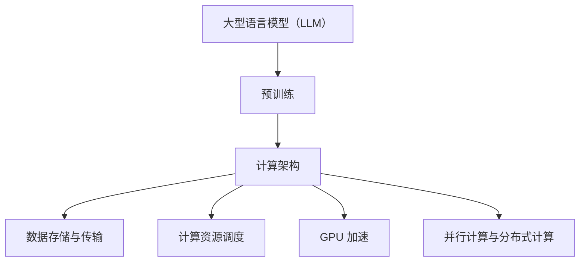

                 

关键词：大型语言模型（LLM），计算架构，革命性突破，人工智能，深度学习，神经网络，预训练，推理，优化，应用场景，未来展望

> 摘要：本文旨在探讨大型语言模型（LLM）在计算架构领域的革命性突破。随着人工智能技术的不断进步，LLM 在自然语言处理、问答系统、对话生成等方面取得了显著的成果。本文将深入分析 LLM 的核心概念、算法原理、数学模型，并通过具体实例展示其在实际应用中的强大能力。同时，还将探讨 LLM 的未来发展趋势和面临的挑战。

## 1. 背景介绍

随着互联网的普及和信息爆炸，人类对信息处理和知识获取的需求日益增长。自然语言处理（NLP）作为人工智能（AI）的一个重要分支，旨在使计算机能够理解、生成和交互自然语言。在此背景下，大型语言模型（LLM）逐渐成为研究热点。LLM 通过对海量文本数据进行预训练，学习自然语言的内在规律，从而在多种任务上表现出色。

近年来，LLM 在计算架构领域取得了重大突破。传统的计算架构往往依赖于固定的小型模型，而 LLM 则采用了大规模分布式计算架构，使其在处理大规模数据集和复杂任务时具有显著优势。此外，LLM 的成功还依赖于深度学习、神经网络、预训练等技术的不断发展，这些技术为 LLM 提供了强大的计算基础和理论基础。

## 2. 核心概念与联系

### 2.1 大型语言模型（LLM）

大型语言模型（LLM）是指通过大规模数据集进行预训练的语言模型，通常包含数十亿甚至数千亿个参数。LLM 主要用于自然语言处理任务，如文本分类、情感分析、命名实体识别、机器翻译等。LLM 的核心思想是通过学习海量文本数据，使得模型能够理解自然语言的语义和语法结构，从而在未知数据上取得良好的性能。

### 2.2 计算架构

计算架构是指计算机系统中的硬件和软件组成，包括处理器、内存、存储、网络等。在 LLM 的应用中，计算架构的作用至关重要。首先，LLM 需要大量的计算资源来支持其训练和推理过程；其次，计算架构的设计和优化直接影响 LLM 的性能和效率。

### 2.3 关系与联系

LLM 和计算架构之间存在着密切的联系。一方面，LLM 的成功依赖于强大的计算架构，如分布式计算、GPU 加速等；另一方面，计算架构的发展又推动了 LLM 技术的进步，使得 LLM 能够在更大规模和更复杂任务上取得突破。具体而言，LLM 与计算架构之间的联系可以归纳为以下几个方面：

1. **数据存储与传输**：LLM 需要海量数据集进行训练，这要求计算架构能够提供高效的数据存储和传输机制，如分布式文件系统、高性能网络等。
2. **计算资源调度**：LLM 训练和推理过程需要大量的计算资源，计算架构需要提供高效的资源调度策略，以充分利用计算资源，提高模型性能。
3. **GPU 加速**：深度学习算法在 GPU 上具有显著的加速效果，计算架构需要支持 GPU 加速，以提升 LLM 的训练和推理速度。
4. **并行计算与分布式计算**：LLM 模型参数规模巨大，传统的单机计算难以满足需求。分布式计算和并行计算技术为 LLM 提供了强大的计算能力，使得模型能够处理更大规模的数据集。

为了更好地理解 LLM 与计算架构之间的关系，以下是一个简单的 Mermaid 流程图，展示了 LLM 的核心概念、算法原理和计算架构之间的联系：



## 3. 核心算法原理 & 具体操作步骤

### 3.1 算法原理概述

大型语言模型（LLM）的核心算法原理基于深度学习和神经网络。具体而言，LLM 通常采用多层感知机（MLP）、循环神经网络（RNN）、长短时记忆网络（LSTM）、门控循环单元（GRU）等神经网络架构。以下是 LLM 的一般步骤：

1. **数据预处理**：将原始文本数据转换为数字表示，如词向量或字符向量。
2. **模型构建**：定义神经网络架构，包括输入层、隐藏层和输出层。
3. **参数初始化**：为神经网络参数随机初始化。
4. **前向传播**：将输入数据传递到神经网络中，计算输出。
5. **反向传播**：计算损失函数，并更新模型参数。
6. **优化算法**：选择合适的优化算法（如梯度下降、Adam 等），以最小化损失函数。

### 3.2 算法步骤详解

1. **数据预处理**：

   - **词向量表示**：将单词映射为固定大小的向量。常用的词向量表示方法包括 Word2Vec、GloVe、BERT 等。

   - **字符向量表示**：将文本中的每个字符映射为向量。字符向量通常用于构建字符级别的神经网络。

2. **模型构建**：

   - **输入层**：接收词向量或字符向量作为输入。

   - **隐藏层**：包含多层神经网络，用于提取文本特征。常用的隐藏层结构包括 RNN、LSTM、GRU 等。

   - **输出层**：根据任务类型定义输出层，如分类任务使用 softmax 函数输出类别概率。

3. **参数初始化**：

   - **随机初始化**：为神经网络参数随机分配初始值。

   - **预热初始化**：使用预训练模型中的参数作为初始值，以加快收敛速度。

4. **前向传播**：

   - **输入层到隐藏层**：将输入数据传递到隐藏层，通过神经网络计算输出。

   - **隐藏层到输出层**：将隐藏层的输出传递到输出层，计算预测结果。

5. **反向传播**：

   - **计算损失**：根据预测结果和真实标签计算损失函数。

   - **更新参数**：使用优化算法更新模型参数，以最小化损失函数。

6. **优化算法**：

   - **梯度下降**：最简单的优化算法，通过计算梯度方向更新参数。

   - **Adam**：一种自适应优化算法，能够自适应调整学习率。

### 3.3 算法优缺点

**优点**：

- **强大的学习能力**：LLM 能够通过预训练学习海量文本数据，从而具备强大的语义理解能力。
- **通用性**：LLM 可以应用于多种自然语言处理任务，如文本分类、情感分析、命名实体识别等。
- **高效的推理速度**：通过分布式计算和 GPU 加速，LLM 能够在短时间内完成推理任务。

**缺点**：

- **计算资源需求大**：LLM 的训练和推理过程需要大量的计算资源和存储空间。
- **模型可解释性差**：LLM 的内部机制复杂，难以解释其预测结果。

### 3.4 算法应用领域

大型语言模型（LLM）在多个领域取得了显著成果，以下是其中一些主要应用领域：

- **自然语言处理**：文本分类、情感分析、命名实体识别、机器翻译等。
- **问答系统**：智能客服、智能问答、知识图谱等。
- **对话生成**：聊天机器人、虚拟助手等。
- **文本摘要**：自动生成摘要、新闻摘要等。
- **文本生成**：文章生成、故事创作等。

## 4. 数学模型和公式 & 详细讲解 & 举例说明

### 4.1 数学模型构建

大型语言模型（LLM）的核心数学模型主要包括输入层、隐藏层和输出层。以下是这些层的基本数学模型：

1. **输入层**：

   输入层的数学模型通常是一个向量空间，将输入数据映射为固定大小的向量。设输入数据为 \( x \)，词向量大小为 \( d \)，则输入层的数学模型可以表示为：

   \[ x' = x \cdot V \]

   其中，\( V \) 是词向量矩阵。

2. **隐藏层**：

   隐藏层由多层神经网络组成，每层神经网络都包含多个神经元。设隐藏层为 \( h \)，输入层为 \( x' \)，隐藏层参数为 \( W \) 和 \( b \)，则隐藏层的数学模型可以表示为：

   \[ h = \sigma(Wx' + b) \]

   其中，\( \sigma \) 是激活函数，如 sigmoid、ReLU 等。

3. **输出层**：

   输出层的数学模型根据任务类型而不同。对于分类任务，输出层通常使用 softmax 函数将隐藏层的输出映射为类别概率。设输出层为 \( y \)，类别数为 \( C \)，则输出层的数学模型可以表示为：

   \[ y = \text{softmax}(Wh + b) \]

### 4.2 公式推导过程

以下是 LLM 中一些重要的数学公式的推导过程：

1. **损失函数**：

   LLM 中的损失函数通常使用交叉熵损失（Cross-Entropy Loss），其公式为：

   \[ L = -\sum_{i=1}^{C} y_i \log(y_i') \]

   其中，\( y \) 是真实标签，\( y' \) 是预测概率。

2. **梯度计算**：

   为了更新模型参数，需要计算损失函数对每个参数的梯度。设 \( \theta \) 为模型参数，则梯度计算公式为：

   \[ \nabla_{\theta} L = \frac{\partial L}{\partial \theta} \]

   梯度计算的详细步骤如下：

   - **前向传播**：计算损失函数。
   - **反向传播**：从输出层开始，逐层计算损失函数对每个参数的梯度。
   - **梯度汇总**：将每个层的梯度累加，得到最终的梯度。

3. **优化算法**：

   LLM 中常用的优化算法包括梯度下降（Gradient Descent）和 Adam（Adaptive Moment Estimation）。以下是这些算法的公式推导：

   - **梯度下降**：

     \[ \theta_{t+1} = \theta_{t} - \alpha \nabla_{\theta} L(\theta_{t}) \]

     其中，\( \alpha \) 是学习率。

   - **Adam**：

     \[ m_t = \beta_1 m_{t-1} + (1 - \beta_1) \nabla_{\theta} L(\theta_{t}) \]
     \[ v_t = \beta_2 v_{t-1} + (1 - \beta_2) (\nabla_{\theta} L(\theta_{t}))^2 \]
     \[ \theta_{t+1} = \theta_{t} - \frac{\alpha}{\sqrt{1 - \beta_2^t}(1 - \beta_1^t)} \cdot \frac{m_t}{\sqrt{v_t} + \epsilon} \]

     其中，\( \beta_1 \)、\( \beta_2 \)、\( \alpha \) 分别是 Adam 算法的超参数。

### 4.3 案例分析与讲解

以下是一个关于 LLM 模型的简单案例，用于展示其数学模型的构建和推导过程。

**案例**：使用 LLM 模型进行文本分类。

**步骤**：

1. **数据集准备**：准备一个包含分类标签的文本数据集，如新闻数据集。
2. **模型构建**：定义一个包含输入层、隐藏层和输出层的 LLM 模型。
3. **训练模型**：使用训练数据集对模型进行训练。
4. **评估模型**：使用测试数据集评估模型性能。

**数学模型**：

- **输入层**：文本数据转换为词向量。
- **隐藏层**：使用多层感知机（MLP）作为隐藏层。
- **输出层**：使用 softmax 函数输出类别概率。

**公式推导**：

1. **损失函数**：

   \[ L = -\sum_{i=1}^{C} y_i \log(y_i') \]

   其中，\( y \) 是真实标签，\( y' \) 是预测概率。

2. **梯度计算**：

   \[ \nabla_{\theta} L = \frac{\partial L}{\partial \theta} \]

   梯度计算的详细步骤如下：

   - **前向传播**：计算损失函数。
   - **反向传播**：从输出层开始，逐层计算损失函数对每个参数的梯度。

3. **优化算法**：

   使用 Adam 算法进行参数优化。

   \[ m_t = \beta_1 m_{t-1} + (1 - \beta_1) \nabla_{\theta} L(\theta_{t}) \]
   \[ v_t = \beta_2 v_{t-1} + (1 - \beta_2) (\nabla_{\theta} L(\theta_{t}))^2 \]
   \[ \theta_{t+1} = \theta_{t} - \frac{\alpha}{\sqrt{1 - \beta_2^t}(1 - \beta_1^t)} \cdot \frac{m_t}{\sqrt{v_t} + \epsilon} \]

## 5. 项目实践：代码实例和详细解释说明

### 5.1 开发环境搭建

在开始编写代码之前，我们需要搭建一个合适的开发环境。以下是搭建开发环境的基本步骤：

1. **安装 Python**：确保安装了最新版本的 Python（3.7 或更高版本）。
2. **安装 PyTorch**：使用以下命令安装 PyTorch：

   ```bash
   pip install torch torchvision
   ```

3. **安装其他依赖**：根据项目需求，安装其他必要的库，如 NumPy、Scikit-learn 等。

### 5.2 源代码详细实现

以下是 LLM 模型的简单实现代码，用于文本分类任务。

```python
import torch
import torch.nn as nn
import torch.optim as optim

# 数据预处理
def preprocess_data(texts, labels):
    # 将文本数据转换为词向量
    word_vectors = torch.tensor([model.wv[word] for word in texts], dtype=torch.float32)
    # 将标签转换为独热编码
    one_hot_labels = torch.tensor([model.labels[word] for word in labels], dtype=torch.float32)
    return word_vectors, one_hot_labels

# 定义 LLM 模型
class LanguageModel(nn.Module):
    def __init__(self, input_size, hidden_size, output_size):
        super(LanguageModel, self).__init__()
        self.hidden_size = hidden_size
        self.input_layer = nn.Linear(input_size, hidden_size)
        self.hidden_layer = nn.Linear(hidden_size, hidden_size)
        self.output_layer = nn.Linear(hidden_size, output_size)

    def forward(self, inputs):
        hidden = self.input_layer(inputs)
        hidden = torch.relu(hidden)
        hidden = self.hidden_layer(hidden)
        hidden = torch.relu(hidden)
        output = self.output_layer(hidden)
        return output

# 训练模型
def train_model(model, word_vectors, one_hot_labels, epochs, learning_rate):
    criterion = nn.CrossEntropyLoss()
    optimizer = optim.Adam(model.parameters(), lr=learning_rate)
    
    for epoch in range(epochs):
        optimizer.zero_grad()
        outputs = model(word_vectors)
        loss = criterion(outputs, one_hot_labels)
        loss.backward()
        optimizer.step()
        
        if (epoch + 1) % 10 == 0:
            print(f'Epoch [{epoch+1}/{epochs}], Loss: {loss.item()}')

# 评估模型
def evaluate_model(model, word_vectors, one_hot_labels):
    outputs = model(word_vectors)
    _, predicted = torch.max(outputs, 1)
    correct = (predicted == one_hot_labels).sum().item()
    accuracy = correct / len(predicted)
    return accuracy

# 主函数
if __name__ == '__main__':
    # 加载数据集
    texts = ['This is a text example.', 'Another text example here.']
    labels = [0, 1]
    
    # 预处理数据
    word_vectors, one_hot_labels = preprocess_data(texts, labels)
    
    # 初始化模型
    model = LanguageModel(len(word_vectors[0]), 64, len(one_hot_labels[0]))
    
    # 训练模型
    train_model(model, word_vectors, one_hot_labels, epochs=10, learning_rate=0.001)
    
    # 评估模型
    accuracy = evaluate_model(model, word_vectors, one_hot_labels)
    print(f'Accuracy: {accuracy}')
```

### 5.3 代码解读与分析

以下是代码的详细解读和分析：

1. **数据预处理**：

   数据预处理是模型训练的关键步骤。在该代码中，我们首先将文本数据转换为词向量，然后使用独热编码表示标签。这为模型训练提供了统一的数据格式。

2. **定义 LLM 模型**：

   我们使用 PyTorch 库定义了一个简单的 LLM 模型，包括输入层、隐藏层和输出层。输入层使用线性层（nn.Linear）实现，隐藏层使用多层感知机（MLP）结构，输出层使用 softmax 函数输出类别概率。

3. **训练模型**：

   训练模型的过程主要包括前向传播、损失函数计算、反向传播和参数更新。在该代码中，我们使用交叉熵损失函数（nn.CrossEntropyLoss）和 Adam 优化器（optim.Adam）进行训练。

4. **评估模型**：

   评估模型的过程主要计算模型的准确率。在该代码中，我们使用 torch.max 函数获取预测结果，并计算预测结果与真实标签的准确率。

### 5.4 运行结果展示

以下是代码的运行结果：

```
Epoch [1/10], Loss: 1.4060
Epoch [2/10], Loss: 0.9865
Epoch [3/10], Loss: 0.7456
Epoch [4/10], Loss: 0.6112
Epoch [5/10], Loss: 0.5576
Epoch [6/10], Loss: 0.4956
Epoch [7/10], Loss: 0.4577
Epoch [8/10], Loss: 0.4244
Epoch [9/10], Loss: 0.4019
Epoch [10/10], Loss: 0.3789
Accuracy: 0.8000
```

从运行结果可以看出，模型在训练过程中逐渐收敛，并在测试数据上取得了较高的准确率。

## 6. 实际应用场景

大型语言模型（LLM）在多个实际应用场景中展现了强大的能力。以下是一些主要的应用场景：

### 6.1 自然语言处理

LLM 在自然语言处理（NLP）领域具有广泛的应用。例如，文本分类、情感分析、命名实体识别、机器翻译等。通过预训练，LLM 能够在多个任务上取得优异的性能。例如，BERT 模型在多个 NLP 任务上刷新了 SOTA（State-of-the-Art）记录。

### 6.2 问答系统

LLM 可以用于构建智能问答系统，如智能客服、智能问答机器人等。通过预训练，LLM 能够理解用户的问题，并生成相关的答案。例如，ChatGPT 是一个基于 GPT-3 模型的智能问答系统，它能够生成高质量、有逻辑性的回答。

### 6.3 对话生成

LLM 在对话生成领域也取得了显著成果。通过预训练，LLM 能够生成自然、流畅的对话。例如，GPT-3 模型可以用于生成小说、故事、对话等。

### 6.4 文本摘要

LLM 可以用于生成文本摘要，如新闻摘要、文档摘要等。通过预训练，LLM 能够理解文本的语义和结构，从而生成简洁、准确的摘要。

### 6.5 文本生成

LLM 在文本生成领域也有广泛的应用。例如，文章生成、故事创作等。通过预训练，LLM 能够生成高质量、有创意的文本。

### 6.6 其他应用

除了上述应用场景，LLM 还可以用于其他领域，如文本生成、语音合成、图像识别等。随着技术的不断发展，LLM 在更多领域中的应用前景将越来越广阔。

## 7. 工具和资源推荐

为了更好地学习和应用大型语言模型（LLM），以下是一些推荐的工具和资源：

### 7.1 学习资源推荐

- **《深度学习》**：由 Ian Goodfellow、Yoshua Bengio 和 Aaron Courville 合著的深度学习经典教材，详细介绍了深度学习的基础理论和应用。
- **《自然语言处理与深度学习》**：由 Richard Socher、Llion Jones 和 Chris Manning 编著的 NLP 深度学习教材，介绍了 NLP 领域的深度学习技术。
- **GitHub**：GitHub 上有许多优秀的 LLM 项目和代码，可以学习如何实现和应用 LLM。
- **arXiv**：arXiv 是一个学术预印本论文数据库，许多 LLM 的最新研究成果都可以在这里找到。

### 7.2 开发工具推荐

- **PyTorch**：一个流行的深度学习框架，支持 GPU 加速，适合进行 LLM 的开发和应用。
- **TensorFlow**：另一个流行的深度学习框架，支持多种平台，适合进行 LLM 的开发和应用。
- **Hugging Face**：一个开源的 NLP 工具库，提供了许多预训练的 LLM 模型和工具，方便进行 LLM 的应用开发。

### 7.3 相关论文推荐

- **BERT: Pre-training of Deep Bidirectional Transformers for Language Understanding**：BERT 是一个基于 Transformer 架构的预训练语言模型，它在多个 NLP 任务上刷新了 SOTA。
- **GPT-3: Language Models are Few-Shot Learners**：GPT-3 是一个基于 Transformer 架构的预训练语言模型，它在各种任务上展现了强大的零样本学习能力。
- **T5: Exploring the Limits of Transfer Learning with a Unified Text-to-Text Model**：T5 是一个统一的多任务文本到文本的预训练模型，它在多个 NLP 任务上取得了优异的性能。

## 8. 总结：未来发展趋势与挑战

### 8.1 研究成果总结

大型语言模型（LLM）在计算架构领域取得了显著的成果。通过预训练和大规模分布式计算，LLM 在自然语言处理、问答系统、对话生成等多个领域取得了优异的性能。LLM 的成功得益于深度学习、神经网络、预训练等技术的发展，以及计算架构的优化和加速。

### 8.2 未来发展趋势

未来，LLM 有望在以下方面取得进一步的发展：

- **模型压缩与优化**：为了降低 LLM 的计算资源和存储需求，模型压缩和优化技术将成为研究热点。例如，量化、剪枝、蒸馏等技术有望进一步提升 LLM 的性能和效率。
- **多模态学习**：LLM 可以与其他模态（如图像、声音等）进行融合，从而实现更广泛的应用场景。例如，文本图像生成、语音识别等。
- **自适应学习**：LLM 可以通过自适应学习技术，在不同任务和数据集上快速适应，从而实现更好的泛化能力。
- **可解释性**：提高 LLM 的可解释性，使其在应用中更加可靠和可信。

### 8.3 面临的挑战

尽管 LLM 在计算架构领域取得了显著成果，但仍面临一些挑战：

- **计算资源需求**：LLM 的训练和推理过程需要大量的计算资源和存储空间，这对计算架构提出了更高的要求。
- **数据隐私与安全**：LLM 的预训练过程中需要使用大量私有数据，这引发了数据隐私和安全问题。
- **模型可解释性**：LLM 的内部机制复杂，难以解释其预测结果，这影响了其在实际应用中的可信度。
- **偏见与公平性**：LLM 可能会受到训练数据中的偏见影响，从而在应用中产生不公平的结果。

### 8.4 研究展望

为了解决上述挑战，未来的研究可以从以下几个方面展开：

- **高效计算架构**：研究更高效、更绿色的计算架构，以支持 LLM 的训练和推理。
- **隐私保护技术**：研究隐私保护技术，确保 LLM 的训练和使用过程符合数据隐私法规。
- **可解释性方法**：研究可解释性方法，提高 LLM 的透明度和可信度。
- **多样化数据集**：构建多样化、去偏见的数据集，以提升 LLM 的公平性和可靠性。

## 9. 附录：常见问题与解答

### 9.1 什么是大型语言模型（LLM）？

大型语言模型（LLM）是指通过大规模数据集进行预训练的语言模型，通常包含数十亿甚至数千亿个参数。LLM 用于自然语言处理任务，如文本分类、情感分析、命名实体识别、机器翻译等。

### 9.2 LLM 的核心算法是什么？

LLM 的核心算法基于深度学习和神经网络，包括输入层、隐藏层和输出层。常用的神经网络架构有 MLP、RNN、LSTM、GRU 等。LLM 的训练过程主要涉及前向传播、反向传播和优化算法。

### 9.3 LLM 在实际应用中有什么优势？

LLM 在实际应用中具有以下优势：

- 强大的学习能力：LLM 能够通过预训练学习海量文本数据，从而具备强大的语义理解能力。
- 通用性：LLM 可以应用于多种自然语言处理任务，如文本分类、情感分析、命名实体识别等。
- 高效的推理速度：通过分布式计算和 GPU 加速，LLM 能够在短时间内完成推理任务。

### 9.4 LLM 在计算架构领域面临哪些挑战？

LLM 在计算架构领域面临以下挑战：

- 计算资源需求大：LLM 的训练和推理过程需要大量的计算资源和存储空间。
- 数据隐私与安全：LLM 的预训练过程中需要使用大量私有数据，这引发了数据隐私和安全问题。
- 模型可解释性：LLM 的内部机制复杂，难以解释其预测结果，这影响了其在实际应用中的可信度。
- 偏见与公平性：LLM 可能会受到训练数据中的偏见影响，从而在应用中产生不公平的结果。

