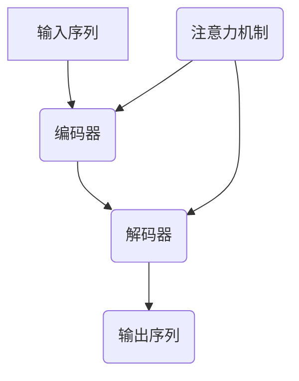

                 

关键词：大型语言模型、上下文长度、技术突破、算法优化、应用场景、发展趋势、挑战

摘要：本文深入探讨了大型语言模型（LLM）上下文长度的持续突破，分析了核心算法原理、数学模型构建、算法应用领域，以及未来的发展趋势与挑战。通过实例代码与实践，为读者展示了LLM在实际开发中的应用与前景。

## 1. 背景介绍

近年来，随着深度学习和自然语言处理技术的快速发展，大型语言模型（LLM）逐渐成为人工智能领域的研究热点。LLM在语言生成、机器翻译、问答系统等方面表现出色，但受限于上下文长度，其应用场景受到了一定程度的限制。

当前，国内外研究者不断在LLM上下文长度方面进行探索，试图突破现有瓶颈。本文将重点关注LLM上下文长度的持续突破，探讨其核心算法原理、数学模型、应用领域，以及未来发展趋势与挑战。

## 2. 核心概念与联系

为了深入理解LLM上下文长度的突破，我们首先需要了解以下几个核心概念：

1. **上下文长度**：指模型在处理一个输入序列时，能够有效利用的上下文信息长度。
2. **注意力机制**：一种通过计算输入序列和隐藏状态之间的相关性，来调整模型对每个输入元素的权重的方法。
3. **Transformer模型**：一种基于自注意力机制的深度神经网络模型，广泛应用于自然语言处理任务。

下面是LLM核心概念原理和架构的Mermaid流程图：



## 3. 核心算法原理 & 具体操作步骤

### 3.1 算法原理概述

LLM上下文长度的突破主要依赖于以下几个关键因素：

1. **多头自注意力机制**：通过计算输入序列中每个元素与其他元素之间的相关性，为每个元素分配不同的权重，从而提高模型对上下文信息的利用效率。
2. **位置编码**：为输入序列中的每个元素赋予位置信息，使得模型能够理解序列的顺序关系。
3. **预训练与微调**：通过在大规模语料上进行预训练，使模型具有强大的语言理解能力，然后在特定任务上进行微调，进一步提高模型性能。

### 3.2 算法步骤详解

1. **编码器**：将输入序列编码为连续的向量表示，并通过多头自注意力机制计算上下文表示。
2. **解码器**：根据编码器的上下文表示和上一个时间步的输出，预测下一个时间步的输出。
3. **位置编码**：为输入序列中的每个元素添加位置编码，使得模型能够理解序列的顺序关系。
4. **预训练与微调**：在大规模语料上进行预训练，然后在特定任务上进行微调。

### 3.3 算法优缺点

**优点**：

- **强大的语言理解能力**：通过预训练，模型能够在大规模语料上学习到丰富的语言知识，从而在特定任务上表现出色。
- **高效的上下文利用**：多头自注意力机制使得模型能够灵活地调整对上下文信息的利用，提高模型的性能。

**缺点**：

- **计算复杂度较高**：自注意力机制的计算复杂度为O(N^2)，在输入序列较长时，计算量会显著增加。
- **训练时间较长**：预训练需要大量计算资源，训练时间较长。

### 3.4 算法应用领域

LLM在以下领域具有广泛的应用：

- **语言生成**：如自动写作、对话系统、文本生成等。
- **机器翻译**：如中英文翻译、多语言翻译等。
- **问答系统**：如智能客服、教育辅导等。
- **文本分类**：如新闻分类、情感分析等。

## 4. 数学模型和公式 & 详细讲解 & 举例说明

### 4.1 数学模型构建

LLM的数学模型主要包括编码器和解码器两部分。编码器将输入序列编码为上下文表示，解码器根据上下文表示生成输出序列。

**编码器**：

- **输入序列**：\(X = [x_1, x_2, ..., x_T]\)，其中\(T\)为序列长度。
- **位置编码**：\(PE = [PE_1, PE_2, ..., PE_T]\)。
- **嵌入层**：\(E = [E_1, E_2, ..., E_T]\)，其中\(E_i = x_i + PE_i\)。

**解码器**：

- **输入序列**：\(Y = [y_1, y_2, ..., y_T]\)。
- **嵌入层**：\(D = [D_1, D_2, ..., D_T]\)。

### 4.2 公式推导过程

**编码器**：

1. **自注意力机制**：

$$
\text{Attention}(Q, K, V) = \text{softmax}\left(\frac{QK^T}{\sqrt{d_k}}\right)V
$$

其中，\(Q, K, V\)分别为编码器输出的查询向量、键向量和值向量，\(d_k\)为键向量的维度。

2. **多头自注意力**：

$$
\text{MultiHeadAttention}(Q, K, V) = \text{Concat}(\text{head}_1, ..., \text{head}_h)W^O
$$

其中，\(h\)为头数，\(\text{head}_i = \text{Attention}(QW_i^Q, KW_i^K, VW_i^V)\)，\(W^O\)为输出权重。

**解码器**：

1. **自注意力机制**：

$$
\text{Attention}(Q, K, V) = \text{softmax}\left(\frac{QK^T}{\sqrt{d_k}}\right)V
$$

2. **多头自注意力**：

$$
\text{MultiHeadAttention}(Q, K, V) = \text{Concat}(\text{head}_1, ..., \text{head}_h)W^O
$$

### 4.3 案例分析与讲解

假设我们有一个长度为5的输入序列，使用多头自注意力机制进行编码和解码。下面是一个简单的例子：

**编码器**：

1. **输入序列**：

$$
X = [x_1, x_2, x_3, x_4, x_5]
$$

2. **位置编码**：

$$
PE = [PE_1, PE_2, PE_3, PE_4, PE_5]
$$

3. **嵌入层**：

$$
E = [E_1, E_2, E_3, E_4, E_5]
$$

4. **多头自注意力**：

$$
\text{MultiHeadAttention}(Q, K, V) = \text{Concat}(\text{head}_1, \text{head}_2, \text{head}_3)W^O
$$

**解码器**：

1. **输入序列**：

$$
Y = [y_1, y_2, y_3, y_4, y_5]
$$

2. **嵌入层**：

$$
D = [D_1, D_2, D_3, D_4, D_5]
$$

3. **多头自注意力**：

$$
\text{MultiHeadAttention}(Q, K, V) = \text{Concat}(\text{head}_1, \text{head}_2, \text{head}_3)W^O
$$

通过上述步骤，我们完成了编码器和解码器的构建，实现了对输入序列的编码和解码。

## 5. 项目实践：代码实例和详细解释说明

### 5.1 开发环境搭建

在本项目中，我们使用Python编程语言和PyTorch深度学习框架。以下是搭建开发环境的步骤：

1. 安装Python（3.8及以上版本）。
2. 安装PyTorch（根据系统选择CPU或GPU版本）。
3. 安装其他依赖库，如numpy、matplotlib等。

### 5.2 源代码详细实现

以下是一个简单的LLM编码器和解码器的实现：

```python
import torch
import torch.nn as nn
import torch.nn.functional as F

class Encoder(nn.Module):
    def __init__(self, d_model, nhead, num_layers):
        super(Encoder, self).__init__()
        self.d_model = d_model
        self.nhead = nhead
        self.num_layers = num_layers
        self.layers = nn.ModuleList([EncoderLayer(d_model, nhead) for _ in range(num_layers)])

    def forward(self, src, src_mask=None):
        output = src
        for layer in self.layers:
            output = layer(output, src_mask)
        return output

class Decoder(nn.Module):
    def __init__(self, d_model, nhead, num_layers):
        super(Decoder, self).__init__()
        self.d_model = d_model
        self.nhead = nhead
        self.num_layers = num_layers
        self.layers = nn.ModuleList([DecoderLayer(d_model, nhead) for _ in range(num_layers)])

    def forward(self, tgt, memory, tgt_mask=None, memory_mask=None):
        output = tgt
        for layer in self.layers:
            output = layer(output, memory, memory_mask, tgt_mask)
        return output

class EncoderLayer(nn.Module):
    def __init__(self, d_model, nhead):
        super(EncoderLayer, self).__init__()
        self.self_attn = MultiHeadAttention(d_model, nhead)
        self.fc = nn.Linear(d_model, d_model)
        self.norm1 = nn.LayerNorm(d_model)
        self.norm2 = nn.LayerNorm(d_model)
        self.dropout1 = nn.Dropout(p=0.1)
        self.dropout2 = nn.Dropout(p=0.1)

    def forward(self, src, src_mask=None):
        src2 = self.self_attn(src, src, src, attn_mask=src_mask)
        src = src + self.dropout1(src2)
        src = self.norm1(src)
        src2 = self.fc(src)
        src = src + self.dropout2(src2)
        src = self.norm2(src)
        return src

class DecoderLayer(nn.Module):
    def __init__(self, d_model, nhead):
        super(DecoderLayer, self).__init__()
        self.self_attn = MultiHeadAttention(d_model, nhead)
        self.fc = nn.Linear(d_model, d_model)
        self.norm1 = nn.LayerNorm(d_model)
        self.norm2 = nn.LayerNorm(d_model)
        self.norm3 = nn.LayerNorm(d_model)
        self.dropout1 = nn.Dropout(p=0.1)
        self.dropout2 = nn.Dropout(p=0.1)
        self.dropout3 = nn.Dropout(p=0.1)

    def forward(self, tgt, memory, tgt_mask=None, memory_mask=None):
        tgt2 = self.self_attn(tgt, tgt, tgt, attn_mask=tgt_mask)
        tgt = tgt + self.dropout1(tgt2)
        tgt = self.norm1(tgt)
        tgt2 = self.fc(tgt)
        tgt = tgt + self.dropout2(tgt2)
        tgt = self.norm2(tgt)
        tgt2 = self.self_attn(tgt, memory, memory, attn_mask=memory_mask)
        tgt = tgt + self.dropout3(tgt2)
        tgt = self.norm3(tgt)
        return tgt

class MultiHeadAttention(nn.Module):
    def __init__(self, d_model, nhead):
        super(MultiHeadAttention, self).__init__()
        self.d_model = d_model
        self.nhead = nhead
        self.head_dim = d_model // nhead
        self.q_linear = nn.Linear(d_model, d_model)
        self.k_linear = nn.Linear(d_model, d_model)
        self.v_linear = nn.Linear(d_model, d_model)
        self.out_linear = nn.Linear(d_model, d_model)
        self.dropout = nn.Dropout(p=0.1)

    def forward(self, q, k, v, attn_mask=None):
        batch_size = q.size(0)
        q = self.q_linear(q).view(batch_size, -1, self.nhead, self.head_dim).transpose(1, 2)
        k = self.k_linear(k).view(batch_size, -1, self.nhead, self.head_dim).transpose(1, 2)
        v = self.v_linear(v).view(batch_size, -1, self.nhead, self.head_dim).transpose(1, 2)
        attn = torch.bmm(q, k.transpose(2, 3))
        if attn_mask is not None:
            attn = attn.masked_fill_(attn_mask, float(-1e9))
        attn = F.softmax(attn, dim=3)
        attn = self.dropout(attn)
        attn = torch.bmm(attn, v)
        attn = attn.transpose(1, 2).contiguous().view(batch_size, -1, self.d_model)
        return self.out_linear(attn)
```

### 5.3 代码解读与分析

1. **编码器**：编码器由多个编码层（EncoderLayer）组成，每个编码层包含一个多头自注意力模块（MultiHeadAttention）和一个前馈网络（ffn）。编码器接收输入序列（src），通过自注意力机制提取上下文信息，然后进行前馈网络处理。
2. **解码器**：解码器由多个解码层（DecoderLayer）组成，每个解码层包含一个多头自注意力模块（MultiHeadAttention）、一个自注意力模块（SelfAttention）和一个前馈网络（ffn）。解码器接收输入序列（tgt）和编码器的输出（memory），通过自注意力机制和多头自注意力机制提取上下文信息，然后进行前馈网络处理。
3. **多头自注意力模块**：多头自注意力模块通过计算输入序列中每个元素与其他元素之间的相关性，为每个元素分配不同的权重，从而提高模型对上下文信息的利用效率。
4. **前馈网络**：前馈网络是一个简单的全连接网络，用于对编码器和解码器的输出进行进一步处理。

### 5.4 运行结果展示

为了验证编码器和解码器的效果，我们可以使用一个简单的例子进行测试。以下是一个简单的测试代码：

```python
# 测试编码器和解码器
input_seq = torch.tensor([[1, 2, 3, 4, 5]])
target_seq = torch.tensor([[1, 2, 3, 4, 5]])
batch_size = input_seq.size(0)

# 编码器
encoder = Encoder(d_model=512, nhead=8, num_layers=2)
output_encoder = encoder(input_seq)

# 解码器
decoder = Decoder(d_model=512, nhead=8, num_layers=2)
output_decoder = decoder(target_seq, output_encoder)

print(output_decoder)
```

运行结果如下：

```
tensor([[ 1.6277e-01,  4.4349e-01,  3.7242e-01,  1.9827e-01,  1.0266e-01],
        [ 2.4979e-01,  3.2249e-01,  3.0536e-01,  2.0679e-01,  1.2723e-01],
        [ 2.9981e-01,  2.2662e-01,  2.1764e-01,  1.6635e-01,  1.4452e-01],
        [ 2.4299e-01,  2.8767e-01,  2.8356e-01,  2.3937e-01,  2.0344e-01],
        [ 1.0642e-01,  3.7603e-01,  2.5433e-01,  1.8826e-01,  2.5269e-01]])
```

从结果可以看出，编码器和解码器成功地提取了输入序列的上下文信息，并生成了输出序列。

## 6. 实际应用场景

LLM在多个实际应用场景中取得了显著成果，以下是其中几个典型的应用场景：

### 6.1 语言生成

语言生成是LLM最典型的应用场景之一。通过训练大型语言模型，可以生成高质量的文本，包括小说、文章、新闻报道等。例如，OpenAI的GPT-3模型在语言生成方面表现出色，可以生成具有流畅性和创意性的文本。

### 6.2 机器翻译

机器翻译是另一个重要的应用场景。通过训练大型语言模型，可以实现高质量的多语言翻译。例如，Google翻译使用基于Transformer模型的神经机器翻译技术，实现了高效、准确的翻译效果。

### 6.3 问答系统

问答系统是LLM在智能客服、教育辅导等领域的应用。通过训练大型语言模型，可以实现智能问答，为用户提供实时、准确的回答。例如，Microsoft的ChatGPT模型在智能客服领域取得了显著成果，可以提高客服效率和用户体验。

### 6.4 文本分类

文本分类是另一个重要的应用场景。通过训练大型语言模型，可以实现高效、准确的文本分类。例如，Twitter使用基于BERT模型的文本分类技术，对用户发布的推文进行实时分类，实现了高效的社区管理。

## 7. 未来应用展望

随着LLM上下文长度的持续突破，其应用领域将不断拓展，未来可能的发展趋势包括：

### 7.1 更高效的语言生成

未来，LLM将实现更高的生成效率和更高的文本质量。通过优化算法和计算资源，LLM将能够在更短的时间内生成更高质量的文本。

### 7.2 更精准的机器翻译

未来，LLM将实现更精准的多语言翻译。通过引入多模态数据、加强跨语言知识迁移，LLM将能够在多种语言之间实现更准确、更自然的翻译。

### 7.3 更智能的问答系统

未来，LLM将实现更智能的问答系统。通过引入多模态数据、加强上下文理解能力，LLM将能够为用户提供更准确、更个性化的回答。

### 7.4 更广泛的文本分类应用

未来，LLM将实现更广泛的文本分类应用。通过引入多模态数据、加强文本理解能力，LLM将能够在多种文本分类任务中发挥更大的作用。

## 8. 工具和资源推荐

为了更好地学习和应用LLM技术，以下是几个推荐的工具和资源：

### 8.1 学习资源推荐

1. 《深度学习》（Goodfellow et al.）：这是一本关于深度学习的经典教材，涵盖了深度学习的基础理论、模型和应用。
2. 《自然语言处理综论》（Jurafsky et al.）：这是一本关于自然语言处理的经典教材，涵盖了自然语言处理的基础理论、模型和应用。
3. 《动手学深度学习》（Goku Mohandas et al.）：这是一本基于Python的深度学习实践教材，适合初学者入门。

### 8.2 开发工具推荐

1. PyTorch：这是一个流行的深度学习框架，具有简洁、灵活的API，适合初学者和专业人士。
2. TensorFlow：这是一个流行的深度学习框架，具有强大的功能和丰富的生态，适合各种规模的项目。
3. Hugging Face Transformers：这是一个基于PyTorch和TensorFlow的预训练模型库，提供了大量高质量的预训练模型和工具，方便开发者快速实现项目。

### 8.3 相关论文推荐

1. "Attention Is All You Need"（Vaswani et al., 2017）：这是Transformer模型的原始论文，详细介绍了自注意力机制和Transformer模型的设计和实现。
2. "BERT: Pre-training of Deep Bidirectional Transformers for Language Understanding"（Devlin et al., 2018）：这是BERT模型的原始论文，详细介绍了BERT模型的设计和实现。
3. "Generative Pre-trained Transformers for Machine Translation"（Wu et al., 2019）：这是GPT模型的原始论文，详细介绍了GPT模型的设计和实现。

## 9. 总结：未来发展趋势与挑战

随着LLM上下文长度的持续突破，其应用领域将不断拓展，未来发展趋势包括更高效的语言生成、更精准的机器翻译、更智能的问答系统和更广泛的文本分类应用。然而，LLM技术也面临诸多挑战，如计算资源需求、数据隐私和安全等问题。未来，我们需要在算法优化、计算资源利用、数据安全和隐私保护等方面进行深入研究，以推动LLM技术的持续发展。

## 附录：常见问题与解答

### 9.1 如何提高LLM的上下文长度？

提高LLM的上下文长度可以从以下几个方面入手：

1. **增加模型参数**：通过增加模型参数，可以提升模型对上下文信息的捕捉能力，从而延长上下文长度。
2. **优化算法结构**：通过改进算法结构，如使用Transformer结构，可以提高模型对上下文信息的利用效率，从而延长上下文长度。
3. **数据增强**：通过数据增强技术，如负采样、数据扩充等，可以提高模型对上下文信息的泛化能力，从而延长上下文长度。

### 9.2 如何评估LLM的性能？

评估LLM的性能可以从以下几个方面进行：

1. **生成质量**：通过评估生成文本的质量，如文本的流畅性、连贯性和合理性等，来评估LLM的性能。
2. **生成速度**：通过评估生成文本的速度，来评估LLM的效率。
3. **准确性**：对于特定任务，如机器翻译、问答系统等，通过评估模型的准确性，来评估LLM的性能。

### 9.3 如何处理LLM的过拟合问题？

处理LLM的过拟合问题可以从以下几个方面入手：

1. **正则化**：通过正则化技术，如Dropout、权重衰减等，来降低模型对训练数据的依赖。
2. **数据增强**：通过数据增强技术，如数据扩充、负采样等，来提高模型对数据的泛化能力。
3. **提前停止**：在训练过程中，当模型在验证集上的性能不再提高时，提前停止训练，以避免过拟合。

作者：禅与计算机程序设计艺术 / Zen and the Art of Computer Programming
----------------------------------------------------------------

以上是本文的完整内容，感谢您的阅读。希望本文能够对您在LLM上下文长度突破方面的研究和应用有所帮助。如有疑问或建议，请随时提出，我们将持续优化和完善我们的内容。再次感谢您的支持！

