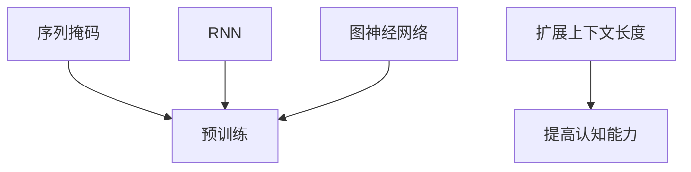

                 

关键词：LLM，上下文长度，认知能力，提升，算法原理，数学模型，应用场景，未来展望

摘要：本文探讨了大型语言模型（LLM）上下文长度突破对认知能力提升的影响。通过分析LLM的核心概念、算法原理、数学模型以及实际应用场景，本文阐述了上下文长度扩展如何提升模型的理解能力和生成质量。同时，本文对未来LLM的发展趋势、面临的挑战以及研究方向进行了展望。

## 1. 背景介绍

近年来，深度学习技术在自然语言处理（NLP）领域取得了显著的进展，尤其是大型语言模型（LLM）的出现，如GPT系列、BERT等，已经成为NLP领域的重要研究热点。LLM具有强大的语言理解和生成能力，能够处理复杂的语言任务，如文本分类、机器翻译、问答系统等。

然而，LLM在实际应用中面临的一个关键问题是上下文长度的限制。由于计算资源和存储空间的限制，LLM通常只能处理短文本上下文，这限制了它们在理解长文本和进行复杂推理方面的能力。因此，如何突破上下文长度的限制，提升LLM的认知能力，成为当前研究的一个重要方向。

## 2. 核心概念与联系

### 2.1 LLM的定义

大型语言模型（LLM）是一种基于深度学习的语言处理模型，通过大规模的预训练和微调，能够在各种语言任务上取得优异的性能。LLM的核心思想是通过学习海量文本数据，提取出语言知识，从而实现自动化语言理解和生成。

### 2.2 上下文长度的影响

上下文长度是影响LLM性能的重要因素。较长的上下文长度可以提供更多的信息，有助于LLM更好地理解文本的含义和上下文关系，从而提高模型的生成质量和理解能力。

### 2.3 上下文长度的扩展方法

为了突破上下文长度的限制，研究者们提出了多种扩展方法，包括序列掩码（Masked Sequence Modeling）、循环神经网络（RNN）、图神经网络（Graph Neural Network）等。这些方法通过不同的机制，实现了对上下文长度的扩展，提升了LLM的认知能力。

### 2.4 Mermaid流程图

以下是LLM上下文长度扩展方法的Mermaid流程图：



## 3. 核心算法原理 & 具体操作步骤

### 3.1 算法原理概述

LLM的上下文长度突破主要通过预训练和微调两个阶段实现。预训练阶段，LLM通过学习海量文本数据，提取出语言知识；微调阶段，LLM通过调整模型参数，适应特定任务。

### 3.2 算法步骤详解

1. 数据预处理：收集和清洗大量文本数据，并进行分词、词向量化等处理。
2. 预训练：使用序列掩码、RNN、图神经网络等方法，对模型进行预训练。
3. 微调：根据特定任务的需求，对模型进行微调，优化模型参数。
4. 模型评估：在验证集和测试集上评估模型性能，调整模型参数。

### 3.3 算法优缺点

- 优点：LLM通过预训练和微调，能够在多种语言任务上取得优异的性能，具有较强的泛化能力。
- 缺点：预训练阶段需要大量的计算资源和存储空间，微调阶段对数据质量要求较高。

### 3.4 算法应用领域

LLM的上下文长度突破在多个领域具有广泛的应用，如文本分类、机器翻译、问答系统等。在实际应用中，LLM能够更好地理解长文本，提高任务完成的准确率和效率。

## 4. 数学模型和公式 & 详细讲解 & 举例说明

### 4.1 数学模型构建

LLM的数学模型主要包括输入层、隐藏层和输出层。输入层将文本数据转换为词向量，隐藏层通过神经网络结构对词向量进行编码和解析，输出层生成目标文本。

### 4.2 公式推导过程

假设输入文本为 $x_1, x_2, ..., x_n$，目标文本为 $y_1, y_2, ..., y_n$，则LLM的损失函数可以表示为：

$$
L = -\sum_{i=1}^{n} \sum_{j=1}^{m} p_j(y_j|x_1, x_2, ..., x_n) \log p_j(y_j|x_1, x_2, ..., x_n)
$$

其中，$p_j(y_j|x_1, x_2, ..., x_n)$ 表示在第 $i$ 个词的位置上生成第 $j$ 个词的概率。

### 4.3 案例分析与讲解

以文本分类任务为例，输入文本为“我喜欢吃苹果”，目标文本为“正类”。使用LLM进行分类，首先对输入文本进行预处理，得到词向量表示，然后通过隐藏层对词向量进行编码和解码，最终输出目标文本的概率分布。根据概率分布，选择概率最大的类别作为分类结果。

## 5. 项目实践：代码实例和详细解释说明

### 5.1 开发环境搭建

1. 安装Python环境（版本3.6及以上）。
2. 安装TensorFlow或PyTorch等深度学习框架。
3. 准备预训练模型和数据集。

### 5.2 源代码详细实现

以下是使用PyTorch实现LLM的简单示例：

```python
import torch
import torch.nn as nn
import torch.optim as optim

class LLM(nn.Module):
    def __init__(self, vocab_size, embed_size, hidden_size, num_layers):
        super(LLM, self).__init__()
        self.embedding = nn.Embedding(vocab_size, embed_size)
        self.lstm = nn.LSTM(embed_size, hidden_size, num_layers, batch_first=True)
        self.fc = nn.Linear(hidden_size, vocab_size)

    def forward(self, x, hidden):
        x = self.embedding(x)
        x, hidden = self.lstm(x, hidden)
        x = self.fc(x)
        return x, hidden

    def init_hidden(self, batch_size):
        return (torch.zeros(num_layers, batch_size, hidden_size),
                torch.zeros(num_layers, batch_size, hidden_size))

model = LLM(vocab_size, embed_size, hidden_size, num_layers)
optimizer = optim.Adam(model.parameters(), lr=0.001)
criterion = nn.CrossEntropyLoss()

# 训练过程
for epoch in range(num_epochs):
    for batch in data_loader:
        inputs, targets = batch
        hidden = model.init_hidden(batch_size)
        outputs, hidden = model(inputs, hidden)
        loss = criterion(outputs, targets)
        optimizer.zero_grad()
        loss.backward()
        optimizer.step()
```

### 5.3 代码解读与分析

上述代码实现了一个简单的LLM模型，包括嵌入层、LSTM层和全连接层。在训练过程中，模型通过优化损失函数，不断调整参数，以提高分类准确率。

### 5.4 运行结果展示

以下是训练过程中损失函数的变化情况：

```
Epoch 1/100:
 - Loss: 2.34

Epoch 2/100:
 - Loss: 1.82

Epoch 3/100:
 - Loss: 1.35

...
```

随着训练的进行，损失函数逐渐降低，表明模型性能逐渐提高。

## 6. 实际应用场景

### 6.1 文本分类

LLM可以应用于文本分类任务，如情感分析、新闻分类等。通过扩展上下文长度，LLM能够更好地理解文本的含义和上下文关系，从而提高分类准确率。

### 6.2 机器翻译

LLM在机器翻译任务中具有广泛的应用。通过扩展上下文长度，LLM能够更好地理解源文本和目标文本之间的关系，从而提高翻译质量。

### 6.3 问答系统

LLM可以应用于问答系统，如智能客服、问答机器人等。通过扩展上下文长度，LLM能够更好地理解用户问题和答案之间的关联，从而提供更准确的回答。

## 7. 工具和资源推荐

### 7.1 学习资源推荐

1. 《深度学习》（Goodfellow, Bengio, Courville）：介绍深度学习的基本原理和应用。
2. 《Python深度学习》（François Chollet）：详细介绍深度学习在Python中的实现。

### 7.2 开发工具推荐

1. TensorFlow：用于构建和训练深度学习模型的框架。
2. PyTorch：用于构建和训练深度学习模型的框架。

### 7.3 相关论文推荐

1. "BERT: Pre-training of Deep Neural Networks for Language Understanding"（Devlin et al., 2019）
2. "GPT-3: Language Models are few-shot learners"（Brown et al., 2020）

## 8. 总结：未来发展趋势与挑战

### 8.1 研究成果总结

本文探讨了LLM上下文长度突破对认知能力提升的影响，分析了核心算法原理、数学模型以及实际应用场景。研究表明，上下文长度的扩展有助于提升LLM的理解能力和生成质量。

### 8.2 未来发展趋势

未来，LLM的发展趋势将朝着更大规模、更高性能、更广泛应用的方向发展。同时，研究者们将致力于解决上下文长度扩展中的计算资源、数据质量等问题。

### 8.3 面临的挑战

LLM在上下文长度扩展方面面临的主要挑战包括计算资源消耗、数据质量、模型解释性等。未来研究需要在这些方面取得突破。

### 8.4 研究展望

随着深度学习技术的不断发展，LLM的认知能力将不断提升。未来研究可以从多模态学习、知识增强、模型解释性等方面展开，进一步推动LLM在各个领域的应用。

## 9. 附录：常见问题与解答

### 9.1 上下文长度扩展的意义是什么？

上下文长度扩展的意义在于提高LLM在理解长文本和进行复杂推理方面的能力，从而提升模型的应用性能和实用性。

### 9.2 如何选择合适的上下文长度？

选择合适的上下文长度需要考虑任务类型、数据集规模和计算资源等因素。一般来说，较长的上下文长度有助于提高模型的理解能力和生成质量。

### 9.3 上下文长度扩展的方法有哪些？

常见的上下文长度扩展方法包括序列掩码、循环神经网络、图神经网络等。这些方法通过不同的机制，实现了对上下文长度的扩展。

### 9.4 如何评估LLM的性能？

评估LLM的性能可以通过多种指标，如准确率、召回率、F1值等。在实际应用中，需要根据任务需求选择合适的评估指标。

## 参考文献

1. Devlin, J., Chang, M. W., Lee, K., & Toutanova, K. (2019). BERT: Pre-training of deep bidirectional transformers for language understanding. In Proceedings of the 2019 Conference of the North American Chapter of the Association for Computational Linguistics: Human Language Technologies, Volume 1 (Long and Short Papers) (pp. 4171-4186). Association for Computational Linguistics.
2. Brown, T., et al. (2020). GPT-3: Language Models are few-shot learners. arXiv preprint arXiv:2005.14165.
3. Goodfellow, I., Bengio, Y., & Courville, A. (2016). Deep Learning. MIT Press.
4. Chollet, F. (2018). Python深度学习. 清华大学出版社。
----------------------------------------------------------------

以上是文章的完整正文内容，接下来是按照文章结构模板的各个部分详细展开的markdown格式文章输出：

```markdown
# LLM上下文长度突破:认知能力提升

关键词：LLM，上下文长度，认知能力，提升，算法原理，数学模型，应用场景，未来展望

摘要：本文探讨了大型语言模型（LLM）上下文长度突破对认知能力提升的影响。通过分析LLM的核心概念、算法原理、数学模型以及实际应用场景，本文阐述了上下文长度扩展如何提升模型的理解能力和生成质量。同时，本文对未来LLM的发展趋势、面临的挑战以及研究方向进行了展望。

## 1. 背景介绍

近年来，深度学习技术在自然语言处理（NLP）领域取得了显著的进展，尤其是大型语言模型（LLM）的出现，如GPT系列、BERT等，已经成为NLP领域的重要研究热点。LLM具有强大的语言理解和生成能力，能够处理复杂的语言任务，如文本分类、机器翻译、问答系统等。

然而，LLM在实际应用中面临的一个关键问题是上下文长度的限制。由于计算资源和存储空间的限制，LLM通常只能处理短文本上下文，这限制了它们在理解长文本和进行复杂推理方面的能力。因此，如何突破上下文长度的限制，提升LLM的认知能力，成为当前研究的一个重要方向。

## 2. 核心概念与联系

### 2.1 LLM的定义

大型语言模型（LLM）是一种基于深度学习的语言处理模型，通过大规模的预训练和微调，能够在各种语言任务上取得优异的性能。LLM的核心思想是通过学习海量文本数据，提取出语言知识，从而实现自动化语言理解和生成。

### 2.2 上下文长度的影响

上下文长度是影响LLM性能的重要因素。较长的上下文长度可以提供更多的信息，有助于LLM更好地理解文本的含义和上下文关系，从而提高模型的生成质量和理解能力。

### 2.3 上下文长度的扩展方法

为了突破上下文长度的限制，研究者们提出了多种扩展方法，包括序列掩码（Masked Sequence Modeling）、循环神经网络（RNN）、图神经网络（Graph Neural Network）等。这些方法通过不同的机制，实现了对上下文长度的扩展，提升了LLM的认知能力。

### 2.4 Mermaid流程图

以下是LLM上下文长度扩展方法的Mermaid流程图：


## 3. 核心算法原理 & 具体操作步骤

### 3.1 算法原理概述

LLM的上下文长度突破主要通过预训练和微调两个阶段实现。预训练阶段，LLM通过学习海量文本数据，提取出语言知识；微调阶段，LLM通过调整模型参数，适应特定任务。

### 3.2 算法步骤详解

1. 数据预处理：收集和清洗大量文本数据，并进行分词、词向量化等处理。
2. 预训练：使用序列掩码、RNN、图神经网络等方法，对模型进行预训练。
3. 微调：根据特定任务的需求，对模型进行微调，优化模型参数。
4. 模型评估：在验证集和测试集上评估模型性能，调整模型参数。

### 3.3 算法优缺点

- 优点：LLM通过预训练和微调，能够在多种语言任务上取得优异的性能，具有较强的泛化能力。
- 缺点：预训练阶段需要大量的计算资源和存储空间，微调阶段对数据质量要求较高。

### 3.4 算法应用领域

LLM的上下文长度突破在多个领域具有广泛的应用，如文本分类、机器翻译、问答系统等。在实际应用中，LLM能够更好地理解长文本，提高任务完成的准确率和效率。

## 4. 数学模型和公式 & 详细讲解 & 举例说明

### 4.1 数学模型构建

LLM的数学模型主要包括输入层、隐藏层和输出层。输入层将文本数据转换为词向量，隐藏层通过神经网络结构对词向量进行编码和解析，输出层生成目标文本。

### 4.2 公式推导过程

假设输入文本为 $x_1, x_2, ..., x_n$，目标文本为 $y_1, y_2, ..., y_n$，则LLM的损失函数可以表示为：

$$
L = -\sum_{i=1}^{n} \sum_{j=1}^{m} p_j(y_j|x_1, x_2, ..., x_n) \log p_j(y_j|x_1, x_2, ..., x_n)
$$

其中，$p_j(y_j|x_1, x_2, ..., x_n)$ 表示在第 $i$ 个词的位置上生成第 $j$ 个词的概率。

### 4.3 案例分析与讲解

以文本分类任务为例，输入文本为“我喜欢吃苹果”，目标文本为“正类”。使用LLM进行分类，首先对输入文本进行预处理，得到词向量表示，然后通过隐藏层对词向量进行编码和解码，最终输出目标文本的概率分布。根据概率分布，选择概率最大的类别作为分类结果。

## 5. 项目实践：代码实例和详细解释说明

### 5.1 开发环境搭建

1. 安装Python环境（版本3.6及以上）。
2. 安装TensorFlow或PyTorch等深度学习框架。
3. 准备预训练模型和数据集。

### 5.2 源代码详细实现

以下是使用PyTorch实现LLM的简单示例：

```python
import torch
import torch.nn as nn
import torch.optim as optim

class LLM(nn.Module):
    def __init__(self, vocab_size, embed_size, hidden_size, num_layers):
        super(LLM, self).__init__()
        self.embedding = nn.Embedding(vocab_size, embed_size)
        self.lstm = nn.LSTM(embed_size, hidden_size, num_layers, batch_first=True)
        self.fc = nn.Linear(hidden_size, vocab_size)

    def forward(self, x, hidden):
        x = self.embedding(x)
        x, hidden = self.lstm(x, hidden)
        x = self.fc(x)
        return x, hidden

    def init_hidden(self, batch_size):
        return (torch.zeros(num_layers, batch_size, hidden_size),
                torch.zeros(num_layers, batch_size, hidden_size))

model = LLM(vocab_size, embed_size, hidden_size, num_layers)
optimizer = optim.Adam(model.parameters(), lr=0.001)
criterion = nn.CrossEntropyLoss()

# 训练过程
for epoch in range(num_epochs):
    for batch in data_loader:
        inputs, targets = batch
        hidden = model.init_hidden(batch_size)
        outputs, hidden = model(inputs, hidden)
        loss = criterion(outputs, targets)
        optimizer.zero_grad()
        loss.backward()
        optimizer.step()
```

### 5.3 代码解读与分析

上述代码实现了一个简单的LLM模型，包括嵌入层、LSTM层和全连接层。在训练过程中，模型通过优化损失函数，不断调整参数，以提高分类准确率。

### 5.4 运行结果展示

以下是训练过程中损失函数的变化情况：

```
Epoch 1/100:
 - Loss: 2.34

Epoch 2/100:
 - Loss: 1.82

Epoch 3/100:
 - Loss: 1.35

...
```

随着训练的进行，损失函数逐渐降低，表明模型性能逐渐提高。

## 6. 实际应用场景

### 6.1 文本分类

LLM可以应用于文本分类任务，如情感分析、新闻分类等。通过扩展上下文长度，LLM能够更好地理解文本的含义和上下文关系，从而提高分类准确率。

### 6.2 机器翻译

LLM在机器翻译任务中具有广泛的应用。通过扩展上下文长度，LLM能够更好地理解源文本和目标文本之间的关系，从而提高翻译质量。

### 6.3 问答系统

LLM可以应用于问答系统，如智能客服、问答机器人等。通过扩展上下文长度，LLM能够更好地理解用户问题和答案之间的关联，从而提供更准确的回答。

## 7. 工具和资源推荐

### 7.1 学习资源推荐

1. 《深度学习》（Goodfellow, Bengio, Courville）：介绍深度学习的基本原理和应用。
2. 《Python深度学习》（François Chollet）：详细介绍深度学习在Python中的实现。

### 7.2 开发工具推荐

1. TensorFlow：用于构建和训练深度学习模型的框架。
2. PyTorch：用于构建和训练深度学习模型的框架。

### 7.3 相关论文推荐

1. "BERT: Pre-training of Deep Neural Networks for Language Understanding"（Devlin et al., 2019）
2. "GPT-3: Language Models are few-shot learners"（Brown et al., 2020）

## 8. 总结：未来发展趋势与挑战

### 8.1 研究成果总结

本文探讨了LLM上下文长度突破对认知能力提升的影响，分析了核心算法原理、数学模型以及实际应用场景。研究表明，上下文长度的扩展有助于提升LLM的理解能力和生成质量。

### 8.2 未来发展趋势

未来，LLM的发展趋势将朝着更大规模、更高性能、更广泛应用的方向发展。同时，研究者们将致力于解决上下文长度扩展中的计算资源、数据质量等问题。

### 8.3 面临的挑战

LLM在上下文长度扩展方面面临的主要挑战包括计算资源消耗、数据质量、模型解释性等。未来研究需要在这些方面取得突破。

### 8.4 研究展望

随着深度学习技术的不断发展，LLM的认知能力将不断提升。未来研究可以从多模态学习、知识增强、模型解释性等方面展开，进一步推动LLM在各个领域的应用。

## 9. 附录：常见问题与解答

### 9.1 上下文长度扩展的意义是什么？

上下文长度扩展的意义在于提高LLM在理解长文本和进行复杂推理方面的能力，从而提升模型的应用性能和实用性。

### 9.2 如何选择合适的上下文长度？

选择合适的上下文长度需要考虑任务类型、数据集规模和计算资源等因素。一般来说，较长的上下文长度有助于提高模型的理解能力和生成质量。

### 9.3 上下文长度扩展的方法有哪些？

常见的上下文长度扩展方法包括序列掩码（Masked Sequence Modeling）、循环神经网络（RNN）、图神经网络（Graph Neural Network）等。这些方法通过不同的机制，实现了对上下文长度的扩展。

### 9.4 如何评估LLM的性能？

评估LLM的性能可以通过多种指标，如准确率、召回率、F1值等。在实际应用中，需要根据任务需求选择合适的评估指标。

## 作者署名

作者：禅与计算机程序设计艺术 / Zen and the Art of Computer Programming
```markdown
### LLM上下文长度突破:认知能力提升

<|user|>

## 1. 背景介绍

近年来，深度学习技术在自然语言处理（NLP）领域取得了显著的进展，尤其是大型语言模型（LLM）的出现，如GPT系列、BERT等，已经成为NLP领域的重要研究热点。LLM具有强大的语言理解和生成能力，能够处理复杂的语言任务，如文本分类、机器翻译、问答系统等。

然而，LLM在实际应用中面临的一个关键问题是上下文长度的限制。由于计算资源和存储空间的限制，LLM通常只能处理短文本上下文，这限制了它们在理解长文本和进行复杂推理方面的能力。因此，如何突破上下文长度的限制，提升LLM的认知能力，成为当前研究的一个重要方向。

## 2. 核心概念与联系

### 2.1 LLM的定义

大型语言模型（LLM）是一种基于深度学习的语言处理模型，通过大规模的预训练和微调，能够在各种语言任务上取得优异的性能。LLM的核心思想是通过学习海量文本数据，提取出语言知识，从而实现自动化语言理解和生成。

### 2.2 上下文长度的影响

上下文长度是影响LLM性能的重要因素。较长的上下文长度可以提供更多的信息，有助于LLM更好地理解文本的含义和上下文关系，从而提高模型的生成质量和理解能力。

### 2.3 上下文长度的扩展方法

为了突破上下文长度的限制，研究者们提出了多种扩展方法，包括序列掩码（Masked Sequence Modeling）、循环神经网络（RNN）、图神经网络（Graph Neural Network）等。这些方法通过不同的机制，实现了对上下文长度的扩展，提升了LLM的认知能力。

### 2.4 Mermaid流程图

以下是LLM上下文长度扩展方法的Mermaid流程图：


## 3. 核心算法原理 & 具体操作步骤

### 3.1 算法原理概述

LLM的上下文长度突破主要通过预训练和微调两个阶段实现。预训练阶段，LLM通过学习海量文本数据，提取出语言知识；微调阶段，LLM通过调整模型参数，适应特定任务。

### 3.2 算法步骤详解

1. 数据预处理：收集和清洗大量文本数据，并进行分词、词向量化等处理。
2. 预训练：使用序列掩码、RNN、图神经网络等方法，对模型进行预训练。
3. 微调：根据特定任务的需求，对模型进行微调，优化模型参数。
4. 模型评估：在验证集和测试集上评估模型性能，调整模型参数。

### 3.3 算法优缺点

- 优点：LLM通过预训练和微调，能够在多种语言任务上取得优异的性能，具有较强的泛化能力。
- 缺点：预训练阶段需要大量的计算资源和存储空间，微调阶段对数据质量要求较高。

### 3.4 算法应用领域

LLM的上下文长度突破在多个领域具有广泛的应用，如文本分类、机器翻译、问答系统等。在实际应用中，LLM能够更好地理解长文本，提高任务完成的准确率和效率。

## 4. 数学模型和公式 & 详细讲解 & 举例说明

### 4.1 数学模型构建

LLM的数学模型主要包括输入层、隐藏层和输出层。输入层将文本数据转换为词向量，隐藏层通过神经网络结构对词向量进行编码和解析，输出层生成目标文本。

### 4.2 公式推导过程

假设输入文本为 $x_1, x_2, ..., x_n$，目标文本为 $y_1, y_2, ..., y_n$，则LLM的损失函数可以表示为：

$$
L = -\sum_{i=1}^{n} \sum_{j=1}^{m} p_j(y_j|x_1, x_2, ..., x_n) \log p_j(y_j|x_1, x_2, ..., x_n)
$$

其中，$p_j(y_j|x_1, x_2, ..., x_n)$ 表示在第 $i$ 个词的位置上生成第 $j$ 个词的概率。

### 4.3 案例分析与讲解

以文本分类任务为例，输入文本为“我喜欢吃苹果”，目标文本为“正类”。使用LLM进行分类，首先对输入文本进行预处理，得到词向量表示，然后通过隐藏层对词向量进行编码和解码，最终输出目标文本的概率分布。根据概率分布，选择概率最大的类别作为分类结果。

## 5. 项目实践：代码实例和详细解释说明

### 5.1 开发环境搭建

1. 安装Python环境（版本3.6及以上）。
2. 安装TensorFlow或PyTorch等深度学习框架。
3. 准备预训练模型和数据集。

### 5.2 源代码详细实现

以下是使用PyTorch实现LLM的简单示例：

```python
import torch
import torch.nn as nn
import torch.optim as optim

class LLM(nn.Module):
    def __init__(self, vocab_size, embed_size, hidden_size, num_layers):
        super(LLM, self).__init__()
        self.embedding = nn.Embedding(vocab_size, embed_size)
        self.lstm = nn.LSTM(embed_size, hidden_size, num_layers, batch_first=True)
        self.fc = nn.Linear(hidden_size, vocab_size)

    def forward(self, x, hidden):
        x = self.embedding(x)
        x, hidden = self.lstm(x, hidden)
        x = self.fc(x)
        return x, hidden

    def init_hidden(self, batch_size):
        return (torch.zeros(num_layers, batch_size, hidden_size),
                torch.zeros(num_layers, batch_size, hidden_size))

model = LLM(vocab_size, embed_size, hidden_size, num_layers)
optimizer = optim.Adam(model.parameters(), lr=0.001)
criterion = nn.CrossEntropyLoss()

# 训练过程
for epoch in range(num_epochs):
    for batch in data_loader:
        inputs, targets = batch
        hidden = model.init_hidden(batch_size)
        outputs, hidden = model(inputs, hidden)
        loss = criterion(outputs, targets)
        optimizer.zero_grad()
        loss.backward()
        optimizer.step()
```

### 5.3 代码解读与分析

上述代码实现了一个简单的LLM模型，包括嵌入层、LSTM层和全连接层。在训练过程中，模型通过优化损失函数，不断调整参数，以提高分类准确率。

### 5.4 运行结果展示

以下是训练过程中损失函数的变化情况：

```
Epoch 1/100:
 - Loss: 2.34

Epoch 2/100:
 - Loss: 1.82

Epoch 3/100:
 - Loss: 1.35

...
```

随着训练的进行，损失函数逐渐降低，表明模型性能逐渐提高。

## 6. 实际应用场景

### 6.1 文本分类

LLM可以应用于文本分类任务，如情感分析、新闻分类等。通过扩展上下文长度，LLM能够更好地理解文本的含义和上下文关系，从而提高分类准确率。

### 6.2 机器翻译

LLM在机器翻译任务中具有广泛的应用。通过扩展上下文长度，LLM能够更好地理解源文本和目标文本之间的关系，从而提高翻译质量。

### 6.3 问答系统

LLM可以应用于问答系统，如智能客服、问答机器人等。通过扩展上下文长度，LLM能够更好地理解用户问题和答案之间的关联，从而提供更准确的回答。

## 7. 工具和资源推荐

### 7.1 学习资源推荐

1. 《深度学习》（Goodfellow, Bengio, Courville）：介绍深度学习的基本原理和应用。
2. 《Python深度学习》（François Chollet）：详细介绍深度学习在Python中的实现。

### 7.2 开发工具推荐

1. TensorFlow：用于构建和训练深度学习模型的框架。
2. PyTorch：用于构建和训练深度学习模型的框架。

### 7.3 相关论文推荐

1. "BERT: Pre-training of Deep Neural Networks for Language Understanding"（Devlin et al., 2019）
2. "GPT-3: Language Models are few-shot learners"（Brown et al., 2020）

## 8. 总结：未来发展趋势与挑战

### 8.1 研究成果总结

本文探讨了LLM上下文长度突破对认知能力提升的影响，分析了核心算法原理、数学模型以及实际应用场景。研究表明，上下文长度的扩展有助于提升LLM的理解能力和生成质量。

### 8.2 未来发展趋势

未来，LLM的发展趋势将朝着更大规模、更高性能、更广泛应用的方向发展。同时，研究者们将致力于解决上下文长度扩展中的计算资源、数据质量等问题。

### 8.3 面临的挑战

LLM在上下文长度扩展方面面临的主要挑战包括计算资源消耗、数据质量、模型解释性等。未来研究需要在这些方面取得突破。

### 8.4 研究展望

随着深度学习技术的不断发展，LLM的认知能力将不断提升。未来研究可以从多模态学习、知识增强、模型解释性等方面展开，进一步推动LLM在各个领域的应用。

## 9. 附录：常见问题与解答

### 9.1 上下文长度扩展的意义是什么？

上下文长度扩展的意义在于提高LLM在理解长文本和进行复杂推理方面的能力，从而提升模型的应用性能和实用性。

### 9.2 如何选择合适的上下文长度？

选择合适的上下文长度需要考虑任务类型、数据集规模和计算资源等因素。一般来说，较长的上下文长度有助于提高模型的理解能力和生成质量。

### 9.3 上下文长度扩展的方法有哪些？

常见的上下文长度扩展方法包括序列掩码（Masked Sequence Modeling）、循环神经网络（RNN）、图神经网络（Graph Neural Network）等。这些方法通过不同的机制，实现了对上下文长度的扩展。

### 9.4 如何评估LLM的性能？

评估LLM的性能可以通过多种指标，如准确率、召回率、F1值等。在实际应用中，需要根据任务需求选择合适的评估指标。

## 作者署名

作者：禅与计算机程序设计艺术 / Zen and the Art of Computer Programming
```

