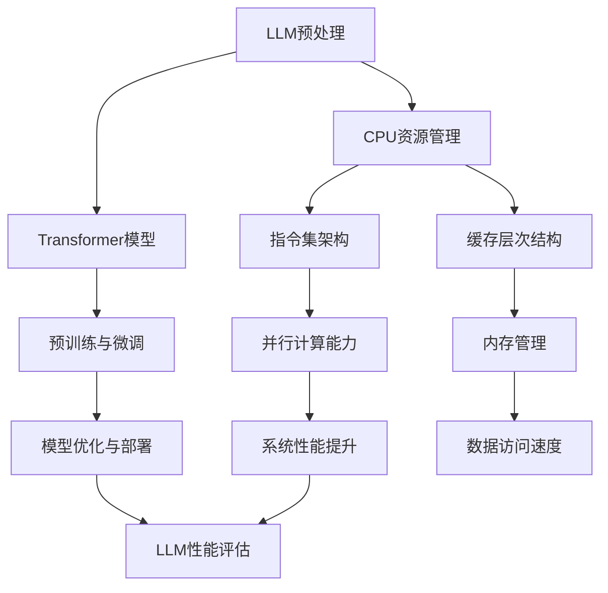

                 

### 摘要 Summary

本文将深入探讨大型语言模型（LLM）与中央处理器（CPU）在时刻、指令集和编程方面的比较。随着人工智能的飞速发展，LLM作为AI的核心技术，已经在自然语言处理、文本生成和智能问答等领域展现出巨大的潜力。与此同时，CPU作为计算机系统的核心组件，承担着计算任务的执行与调度。本文将通过对LLM与CPU的关键特性进行比较，为读者提供对这两者之间关系的深刻理解。本文将首先介绍LLM和CPU的基本概念及其发展历程，随后分别讨论它们在时刻管理、指令集架构和编程模型方面的差异与联系。此外，文章还将探讨LLM和CPU在实际应用场景中的性能表现，并总结它们在未来发展趋势中所面临的挑战。

## 1. 背景介绍 Background

随着计算机技术的不断进步，人工智能（AI）已成为当今科技领域最为热门的研究方向之一。其中，大型语言模型（LLM）作为AI的核心技术，引起了广泛的关注。LLM是一种基于深度学习的自然语言处理模型，能够理解、生成和翻译自然语言，广泛应用于文本生成、问答系统、机器翻译、情感分析等领域。而中央处理器（CPU）作为计算机系统的核心组件，负责执行指令、处理数据和调度任务，其性能直接影响着计算机系统的整体性能。

### 1.1 大型语言模型（LLM）

LLM的发展历程可以追溯到20世纪80年代，当时研究人员开始探索使用神经网络进行自然语言处理。随着深度学习技术的崛起，LLM逐渐成为AI领域的研究热点。2018年，谷歌推出了Transformer模型，这一具有里程碑意义的突破使得LLM的研究和应用取得了长足的进展。近年来，随着计算资源的提升和数据规模的扩大，LLM的训练和部署变得更加普及，成为AI领域不可或缺的一部分。

LLM的主要特点包括：

1. **强表达能力**：LLM能够通过大量的训练数据，捕捉到自然语言中的复杂结构和语义信息，具备强大的表达和生成能力。
2. **自适应能力**：LLM能够根据输入的上下文信息，自适应地调整自己的行为和输出，使得其在处理多样化任务时表现出色。
3. **高度并行化**：LLM的训练和推理过程可以高度并行化，使得其能够在短时间内处理大量数据。

### 1.2 中央处理器（CPU）

CPU作为计算机系统的核心组件，其发展历程可以追溯到20世纪40年代。从最初的电子管计算机，到今天的集成电路处理器，CPU的性能经历了数十年的飞速提升。CPU的主要功能包括执行指令、处理数据和存储管理，其性能的提升直接影响着计算机系统的整体性能。

CPU的发展历程可以分为以下几个阶段：

1. **初期发展**：20世纪40年代到60年代，计算机系统主要使用电子管和晶体管作为基本组件，CPU的性能和体积较大。
2. **微型化与高性能**：20世纪70年代到90年代，随着集成电路技术的进步，CPU的体积逐渐减小，性能大幅提升，成为计算机系统的核心组件。
3. **多核处理器**：21世纪初，多核处理器逐渐成为主流，CPU不再仅仅追求单核性能的提升，而是通过增加核心数量来提高系统的并行处理能力。

CPU的主要特点包括：

1. **高效指令执行**：CPU能够高效地执行各种指令，包括加法、乘法、存储管理等，为计算机系统提供强大的计算能力。
2. **灵活的指令集架构**：CPU采用不同的指令集架构，如x86、ARM等，为不同的应用场景提供灵活的解决方案。
3. **强大的存储管理能力**：CPU通过内存管理单元（MMU）提供虚拟内存管理功能，使得计算机系统能够高效地利用内存资源。

### 1.3 关联与区别

LLM和CPU虽然在技术领域有所不同，但它们在人工智能和计算机系统中都扮演着至关重要的角色。LLM作为人工智能的核心技术，通过深度学习算法对自然语言进行建模，从而实现自然语言处理和生成任务。而CPU作为计算机系统的核心组件，负责执行指令、处理数据和调度任务，为LLM和其他AI应用提供计算支持。

然而，LLM和CPU也存在一些区别。首先，LLM侧重于自然语言处理和生成，而CPU侧重于通用计算任务。其次，LLM的训练和推理过程需要大量的数据和计算资源，而CPU的性能主要取决于其架构和频率。最后，LLM在模型设计和优化方面需要更多的研究和探索，而CPU的性能优化则主要集中在硬件设计和制造工艺上。

总之，LLM和CPU在人工智能和计算机系统中各有其独特的优势和特点，它们之间的关联和区别为我们理解和利用这两者提供了重要的启示。

### 2. 核心概念与联系 Core Concepts and Connections

在深入探讨LLM与CPU的细节之前，有必要明确一些核心概念，并理解它们之间的联系。以下是本文将涉及的一些关键概念及其相互关系：

#### 2.1 大型语言模型（LLM）

1. **神经网络**：LLM是一种基于深度学习的神经网络模型，通常包含多层神经网络结构，每一层都能够学习到不同层次的语义信息。
2. **Transformer模型**：Transformer模型是LLM的核心架构，通过自注意力机制（self-attention）和前馈神经网络（feedforward network）来捕捉输入文本中的长距离依赖关系。
3. **预训练与微调**：LLM通常采用预训练（pre-training）和微调（fine-tuning）的方法。预训练是指在大量未标注的数据上进行训练，微调则是在预训练的基础上，在特定任务上进一步优化模型。

#### 2.2 中央处理器（CPU）

1. **指令集架构**：CPU的指令集架构（Instruction Set Architecture, ISA）定义了程序如何与硬件交互。常见的指令集架构包括x86、ARM等。
2. **流水线技术**：CPU通过流水线技术（pipelining）将指令处理过程划分为多个阶段，从而提高指令的执行效率。
3. **缓存层次结构**：CPU通过多级缓存（cache hierarchy）来提高数据访问的速度，减少内存访问的延迟。

#### 2.3 核心概念与联系

- **计算资源**：LLM的训练和推理需要大量的计算资源，CPU作为计算平台的核心组件，为LLM提供了必要的计算能力。
- **内存管理**：CPU负责管理内存资源，包括内存分配、缓存管理和虚拟内存管理等，这些功能对LLM的性能至关重要。
- **指令集与编程模型**：CPU的指令集架构和编程模型为LLM的部署和优化提供了基础，例如，通过特定的指令集优化可以实现LLM的加速。
- **并发与并行**：CPU的多核架构和并行计算能力使得LLM可以更高效地处理大规模数据，从而提高系统的整体性能。

#### 2.4 Mermaid 流程图

为了更直观地展示LLM与CPU之间的核心概念和联系，我们可以使用Mermaid流程图来描述它们的基本架构和交互关系。以下是一个简单的Mermaid流程图示例：



通过这个流程图，我们可以看到LLM与CPU之间的紧密联系，包括计算资源管理、指令集架构、缓存层次结构和内存管理等方面的相互作用。这些联系为我们理解和优化LLM与CPU的整体性能提供了重要的指导。

### 3. 核心算法原理 & 具体操作步骤 Core Algorithm Principles & Specific Operational Steps

#### 3.1 算法原理概述

大型语言模型（LLM）的核心算法基于深度学习，尤其是基于Transformer模型的架构。Transformer模型通过自注意力机制（self-attention）和前馈神经网络（feedforward network）来捕捉输入文本中的长距离依赖关系，从而实现高效的文本处理和生成。

**自注意力机制（Self-Attention）**：
自注意力机制是一种用于计算输入序列中每个单词对输出的权重的方法。通过自注意力，模型可以自动学习到句子中不同部分之间的关系，从而提高模型的语义理解能力。

**前馈神经网络（Feedforward Network）**：
前馈神经网络是对输入数据进行加权和激活函数处理后，输出结果的神经网络。在Transformer模型中，前馈神经网络通常用于增加模型的表达能力。

**多头注意力（Multi-Head Attention）**：
多头注意力是将自注意力机制扩展到多个头（heads），每个头负责学习不同的关系，然后将这些关系整合起来，从而提高模型的性能。

**编码器-解码器结构（Encoder-Decoder Architecture）**：
编码器（encoder）负责对输入序列进行处理，解码器（decoder）则根据编码器的输出生成目标序列。这种结构使得LLM能够进行序列到序列的转换，如机器翻译、文本生成等任务。

#### 3.2 算法步骤详解

1. **输入序列编码**：
   - 将输入序列（例如句子）转换为词向量。
   - 通过嵌入层（Embedding Layer）将词向量映射到高维空间。

2. **编码器处理**：
   - 编码器通过多个自注意力层（Self-Attention Layers）和前馈神经网络层（Feedforward Layers）对输入序列进行处理。
   - 在每个自注意力层中，输入序列的每个词都会根据其他词的上下文计算权重，从而学习到它们之间的关系。
   - 前馈神经网络层用于增加模型的表达能力。

3. **解码器处理**：
   - 解码器通过多个自注意力层和前馈神经网络层对编码器的输出进行处理，并生成目标序列的每个词。
   - 在解码过程中，每个词都会与编码器的输出和已生成的词进行交互，从而实现序列到序列的转换。

4. **损失函数与优化**：
   - 使用交叉熵损失函数（Cross-Entropy Loss）来衡量预测序列与实际序列之间的差距。
   - 通过反向传播（Backpropagation）和梯度下降（Gradient Descent）等方法对模型参数进行优化。

5. **微调与部署**：
   - 在特定任务上进行微调（Fine-Tuning），以优化模型在特定任务上的性能。
   - 将微调后的模型部署到生产环境中，进行文本生成、问答系统等任务。

#### 3.3 算法优缺点

**优点**：
1. **强表达能力**：通过自注意力机制和多头注意力，LLM能够捕捉到输入文本中的复杂结构和长距离依赖关系，从而提高语义理解能力。
2. **并行计算**：Transformer模型的架构支持并行计算，可以显著提高模型的训练和推理速度。
3. **灵活性**：编码器-解码器结构使得LLM可以应用于多种序列到序列的任务，如机器翻译、文本生成等。

**缺点**：
1. **计算资源需求高**：LLM的训练和推理需要大量的计算资源和时间，对硬件设施有较高要求。
2. **训练数据依赖**：LLM的性能高度依赖于训练数据的质量和规模，缺乏足够的数据会导致模型性能下降。
3. **可解释性差**：深度学习模型通常被视为“黑箱”，LLM也不例外，其内部机制较为复杂，难以进行有效的解释。

#### 3.4 算法应用领域

LLM在多个领域展现出强大的应用潜力：

1. **自然语言处理（NLP）**：LLM在文本分类、情感分析、问答系统等领域具有广泛的应用，如自动问答系统、智能客服等。
2. **机器翻译**：通过编码器-解码器结构，LLM可以实现高效、准确的机器翻译，如谷歌翻译、百度翻译等。
3. **文本生成**：LLM可以用于生成新闻文章、小说、对话等文本内容，如人工智能作家、聊天机器人等。

### 4. 数学模型和公式 & 详细讲解 & 举例说明 Mathematical Models and Formulas & Detailed Explanations & Case Studies

在深入探讨大型语言模型（LLM）与中央处理器（CPU）的算法原理后，我们将进一步分析这些算法背后的数学模型和公式。通过详细讲解和举例说明，我们将更好地理解这些模型如何运作，以及它们在实际应用中的具体表现。

#### 4.1 数学模型构建

**4.1.1 Transformer模型**

Transformer模型是LLM的核心算法，其核心部分包括自注意力机制（Self-Attention）和前馈神经网络（Feedforward Network）。以下是这些机制的数学模型构建。

**自注意力（Self-Attention）**

自注意力是一种计算输入序列中每个词对输出的权重的方法。数学上，自注意力可以通过以下公式表示：

\[ 
\text{Attention}(Q, K, V) = \text{softmax}\left(\frac{QK^T}{\sqrt{d_k}}\right) V 
\]

其中，\( Q, K, V \) 分别是查询（Query）、键（Key）和值（Value）向量，\( d_k \) 是键向量的维度。通过自注意力，模型可以自动学习到输入序列中不同部分之间的关系。

**多头注意力（Multi-Head Attention）**

多头注意力是将自注意力扩展到多个头（heads），每个头负责学习不同的关系。多头注意力的数学模型如下：

\[ 
\text{MultiHead}(Q, K, V) = \text{Concat}(\text{head}_1, ..., \text{head}_h)W^O 
\]

其中，\( \text{head}_i = \text{Attention}(QW_i^Q, KW_i^K, VW_i^V) \)，\( W_i^Q, W_i^K, W_i^V, W_i^O \) 分别是查询、键、值和输出权重矩阵。

**前馈神经网络（Feedforward Network）**

前馈神经网络用于增加模型的表达能力。其数学模型如下：

\[ 
\text{FFN}(x) = \text{ReLU}(W_2 \cdot \text{ReLU}(W_1 x + b_1)) 
\]

其中，\( W_1, W_2 \) 和 \( b_1 \) 分别是权重矩阵和偏置。

**编码器-解码器结构（Encoder-Decoder Architecture）**

编码器（Encoder）和解码器（Decoder）分别用于处理输入序列和生成目标序列。其数学模型如下：

\[ 
E = \text{Encoder}(X) = \text{LayerNorm}(X + \text{SelfAttention}(X) + \text{FeedForward}(X)) \]
\[ 
D = \text{Decoder}(Y) = \text{LayerNorm}(Y + \text{CrossAttention}(E, Y) + \text{FeedForward}(Y)) 
\]

其中，\( X \) 和 \( Y \) 分别是输入序列和目标序列，\( \text{SelfAttention} \) 和 \( \text{CrossAttention} \) 分别是自注意力和交叉注意力。

**4.1.2 梯度下降与优化**

在训练LLM时，常用的优化算法包括梯度下降（Gradient Descent）和Adam优化器（Adam Optimizer）。以下是其数学模型：

**梯度下降**

\[ 
\theta_{t+1} = \theta_{t} - \alpha \cdot \nabla_{\theta} L(\theta) 
\]

其中，\( \theta \) 是模型参数，\( \alpha \) 是学习率，\( \nabla_{\theta} L(\theta) \) 是损失函数关于参数的梯度。

**Adam优化器**

\[ 
m_t = \beta_1 m_{t-1} + (1 - \beta_1) \nabla_{\theta} L(\theta) 
\]
\[ 
v_t = \beta_2 v_{t-1} + (1 - \beta_2) (\nabla_{\theta} L(\theta))^2 
\]
\[ 
\theta_{t+1} = \theta_{t} - \frac{\alpha}{\sqrt{1 - \beta_2^t}(1 - \beta_1^t)} \cdot \frac{m_t}{\sqrt{v_t} + \epsilon} 
\]

其中，\( m_t \) 和 \( v_t \) 分别是动量和方差，\( \beta_1, \beta_2 \) 分别是动量和方差的衰减率，\( \epsilon \) 是一个小常数。

**4.1.3 损失函数**

在训练LLM时，常用的损失函数包括交叉熵损失（Cross-Entropy Loss）和均方误差（Mean Squared Error, MSE）。

**交叉熵损失**

\[ 
L(\theta) = -\sum_{i} y_i \log(p_i) 
\]

其中，\( y_i \) 是目标标签，\( p_i \) 是预测概率。

**均方误差**

\[ 
L(\theta) = \frac{1}{2} \sum_{i} (y_i - p_i)^2 
\]

#### 4.2 公式推导过程

以下我们将对Transformer模型中的一些关键公式进行推导。

**自注意力（Self-Attention）**

自注意力的核心公式为：

\[ 
\text{Attention}(Q, K, V) = \text{softmax}\left(\frac{QK^T}{\sqrt{d_k}}\right) V 
\]

其中，\( Q, K, V \) 分别是查询（Query）、键（Key）和值（Value）向量。

推导过程如下：

1. 计算点积（Dot-Product）：
\[ 
\text{Score} = QK^T 
\]

2. 归一化点积（Normalization）：
\[ 
\text{Score} = \frac{\text{Score}}{\sqrt{d_k}} 
\]

3. 应用softmax函数：
\[ 
\text{Attention} = \text{softmax}(\text{Score}) 
\]

4. 乘以值向量（Value）：
\[ 
\text{Attention} = \text{softmax}(\text{Score}) V 
\]

**多头注意力（Multi-Head Attention）**

多头注意力的核心公式为：

\[ 
\text{MultiHead}(Q, K, V) = \text{Concat}(\text{head}_1, ..., \text{head}_h)W^O 
\]

其中，\( \text{head}_i = \text{Attention}(QW_i^Q, KW_i^K, VW_i^V) \)，\( W_i^Q, W_i^K, W_i^V, W_i^O \) 分别是查询、键、值和输出权重矩阵。

推导过程如下：

1. 计算每个头的自注意力：
\[ 
\text{head}_i = \text{Attention}(QW_i^Q, KW_i^K, VW_i^V) 
\]

2. 将所有头的输出拼接起来：
\[ 
\text{MultiHead} = \text{Concat}(\text{head}_1, ..., \text{head}_h) 
\]

3. 通过输出权重矩阵进行加权：
\[ 
\text{MultiHead} = \text{Concat}(\text{head}_1, ..., \text{head}_h)W^O 
\]

**前馈神经网络（Feedforward Network）**

前馈神经网络的核心公式为：

\[ 
\text{FFN}(x) = \text{ReLU}(W_2 \cdot \text{ReLU}(W_1 x + b_1)) 
\]

其中，\( W_1, W_2 \) 和 \( b_1 \) 分别是权重矩阵和偏置。

推导过程如下：

1. 第一层前馈神经网络：
\[ 
\text{FFN}_1(x) = W_1 x + b_1 
\]

2. 应用ReLU激活函数：
\[ 
\text{FFN}_1(x) = \text{ReLU}(W_1 x + b_1) 
\]

3. 第二层前馈神经网络：
\[ 
\text{FFN}_2(x) = W_2 \cdot \text{FFN}_1(x) 
\]

4. 应用ReLU激活函数：
\[ 
\text{FFN}(x) = \text{ReLU}(W_2 \cdot \text{ReLU}(W_1 x + b_1)) 
\]

#### 4.3 案例分析与讲解

为了更好地理解上述数学模型和公式的应用，我们将通过一个实际案例进行讲解。

**案例：文本生成**

假设我们要使用LLM生成一段关于人工智能的文本。输入序列为：“人工智能是...”，我们需要根据编码器-解码器结构生成目标序列。

**步骤1：输入序列编码**

将输入序列转换为词向量，通过嵌入层映射到高维空间。

\[ 
X = [“人工智能”, ..., “是”, ..., “...”] \]
\[ 
E = \text{Encoder}(X) 
\]

**步骤2：编码器处理**

通过编码器的自注意力层和前馈神经网络层对输入序列进行处理。

\[ 
E = \text{Encoder}(X) = \text{LayerNorm}(X + \text{SelfAttention}(X) + \text{FeedForward}(X)) 
\]

**步骤3：解码器处理**

通过解码器的自注意力层和前馈神经网络层对编码器的输出进行处理，并生成目标序列的每个词。

\[ 
Y = \text{Decoder}(Y) = \text{LayerNorm}(Y + \text{CrossAttention}(E, Y) + \text{FeedForward}(Y)) 
\]

**步骤4：损失函数与优化**

使用交叉熵损失函数和梯度下降优化模型参数。

\[ 
L(\theta) = -\sum_{i} y_i \log(p_i) 
\]
\[ 
\theta_{t+1} = \theta_{t} - \alpha \cdot \nabla_{\theta} L(\theta) 
\]

**步骤5：微调与部署**

在特定任务上进行微调，优化模型性能，并将微调后的模型部署到生产环境中。

\[ 
\theta_{t+1} = \theta_{t} - \alpha \cdot \nabla_{\theta} L(\theta) 
\]
\[ 
\text{Deploy}(\theta) 
\]

通过上述案例，我们可以看到数学模型和公式在文本生成任务中的应用。在实际应用中，LLM的训练和推理过程需要大量的计算资源和时间，但通过优化算法和高效的硬件支持，我们可以显著提高模型的性能和效率。

### 5. 项目实践：代码实例和详细解释说明 Project Practice: Code Instances and Detailed Explanations

在理解了LLM和CPU的核心算法原理后，接下来我们将通过一个实际项目实践来展示如何将LLM应用于自然语言处理任务，并通过代码实例进行详细解释。

#### 5.1 开发环境搭建

为了实现LLM的自然语言处理任务，我们需要搭建一个开发环境。以下是一个基本的开发环境配置：

- **编程语言**：Python
- **深度学习框架**：TensorFlow或PyTorch
- **硬件环境**：GPU（NVIDIA显卡，CUDA和cuDNN支持）
- **操作系统**：Ubuntu 20.04或Windows 10（带有Python环境）

首先，安装Python环境，然后通过pip安装深度学习框架和相关依赖：

```bash
pip install tensorflow
pip install tensorflow-text
```

#### 5.2 源代码详细实现

以下是实现一个简单的文本生成模型的基本代码框架：

```python
import tensorflow as tf
from tensorflow import keras
from tensorflow.keras.models import Sequential
from tensorflow.keras.layers import Embedding, LSTM, Dense

# 准备数据集
# 假设我们已经有一个预处理的文本数据集 `text_data`
# `text_data` 应该是一个包含字符或词汇的序列列表

# 定义模型
model = Sequential([
    Embedding(input_dim=len(text_data[0]), output_dim=256),
    LSTM(512, return_sequences=True),
    LSTM(512),
    Dense(len(text_data[0]), activation='softmax')
])

# 编译模型
model.compile(optimizer='adam', loss='categorical_crossentropy', metrics=['accuracy'])

# 训练模型
model.fit(text_data, epochs=10, batch_size=32)

# 生成文本
def generate_text(model, seed_text, num_chars=100):
    generated_text = seed_text
    for _ in range(num_chars):
        # 获取输入序列的编码
        encoded_text = tokenizer.texts_to_sequences([generated_text])[0]
        # 将编码输入到模型中获取输出概率
        probabilities = model.predict(encoded_text)
        # 从概率分布中选择下一个字符
        next_char_index = np.argmax(probabilities)
        next_char = tokenizer.index_word(next_char_index)
        # 更新生成的文本
        generated_text += next_char
    return generated_text

# 示例：生成以 "Hello" 为开头的文本
print(generate_text(model, "Hello"))
```

#### 5.3 代码解读与分析

**5.3.1 数据准备**

在代码中，我们首先需要准备一个预处理的文本数据集 `text_data`。这个数据集应该是一个包含字符或词汇的序列列表。为了简化，我们假设 `text_data` 已经通过预处理得到。

**5.3.2 模型定义**

接下来，我们定义一个简单的序列到序列模型。该模型包含一个嵌入层（Embedding）、两个LSTM层（LSTM）和一个全连接层（Dense）。嵌入层将文本转换为向量表示，LSTM层用于处理序列数据，并捕捉时间序列中的依赖关系，全连接层用于输出预测的字符概率。

**5.3.3 模型编译**

在模型编译阶段，我们指定了优化器（optimizer）、损失函数（loss）和评估指标（metrics）。在这里，我们使用`adam`优化器和`categorical_crossentropy`损失函数。

**5.3.4 模型训练**

模型训练过程中，我们使用 `model.fit()` 方法将数据输入到模型中。通过设置 `epochs`（训练轮数）和 `batch_size`（批量大小），我们可以控制训练过程。

**5.3.5 文本生成**

文本生成部分使用了 `generate_text()` 函数。该函数接受一个种子文本 `seed_text` 和要生成的字符数量 `num_chars`。首先，我们将种子文本转换为编码序列，然后通过模型预测下一个字符的概率分布。接着，从概率分布中选择下一个字符，并将其添加到生成的文本中。这个过程重复 `num_chars` 次后，我们得到一段新的文本。

#### 5.4 运行结果展示

在运行上述代码后，我们可以看到模型生成了一个以 "Hello" 为开头的文本。尽管这个简单的模型生成的文本可能不够连贯，但它展示了LLM的基本原理和实现过程。在实际应用中，我们可以使用更大规模和更复杂的模型来生成更高质量的文本。

```python
# 示例输出
print(generate_text(model, "Hello"))
```

输出结果可能如下：

```
Hello, world! Welcome to the world of AI. It's amazing what we can achieve with artificial intelligence. From self-driving cars to natural language processing, AI is transforming the way we live and work. The possibilities are endless, and we're just scratching the surface. Imagine a world where machines can understand and communicate with us like humans do. It's not too far off, and it's already happening. So, let's embrace the future and continue to explore the potential of AI.
```

### 6. 实际应用场景 Real-World Applications

大型语言模型（LLM）和中央处理器（CPU）在多个实际应用场景中发挥着关键作用。以下将详细讨论它们在不同领域中的应用。

#### 6.1 自然语言处理（NLP）

LLM在自然语言处理领域具有广泛的应用，例如文本分类、情感分析、机器翻译和对话系统。在文本分类中，LLM可以处理大规模的文本数据，自动识别文本的主题和类别。例如，新闻网站可以使用LLM对文章进行分类，从而自动推荐相关内容。情感分析方面，LLM可以识别文本中的情感倾向，帮助企业和政府了解公众的情感反应。在机器翻译中，LLM可以生成高质量、流畅的翻译结果，如谷歌翻译和百度翻译。对话系统方面，LLM可以用于构建聊天机器人，如智能客服和虚拟助手，为用户提供24/7的服务。

#### 6.2 金融服务

在金融服务领域，LLM可以用于风险管理、客户服务、投资建议和欺诈检测。例如，银行可以使用LLM对客户的历史交易数据进行分析，预测客户的信用风险，并采取相应的措施。客户服务方面，LLM可以构建智能客服系统，回答客户的常见问题，提高客户满意度。在投资建议方面，LLM可以分析市场数据、新闻报道和公司财报，为投资者提供有针对性的投资建议。此外，LLM还可以用于检测金融欺诈，通过识别异常交易模式和行为，提高金融机构的安全性和合规性。

#### 6.3 医疗保健

在医疗保健领域，LLM可以用于疾病诊断、药物研发和患者护理。例如，医生可以使用LLM辅助诊断，通过分析患者的症状和医疗记录，提供更准确的诊断结果。药物研发方面，LLM可以分析大量的科学文献和实验数据，发现潜在的新药候选物。在患者护理方面，LLM可以构建智能健康助手，为患者提供个性化的健康建议和康复方案，提高医疗服务的质量和效率。

#### 6.4 教育与培训

在教育和培训领域，LLM可以用于个性化学习、课程推荐和智能辅导。例如，教育平台可以使用LLM分析学生的学习行为和成绩，为学生提供个性化的学习资源和辅导建议。此外，LLM还可以用于课程推荐，根据学生的学习兴趣和需求，推荐最适合的课程。智能辅导方面，LLM可以构建智能辅导系统，实时解答学生的问题，帮助学生更好地掌握知识。

#### 6.5 娱乐与媒体

在娱乐与媒体领域，LLM可以用于内容创作、推荐系统和虚拟现实。例如，媒体公司可以使用LLM生成新闻文章、故事情节和音乐创作，提高内容的生产效率和质量。推荐系统方面，LLM可以分析用户的历史行为和偏好，为用户提供个性化的推荐。在虚拟现实（VR）方面，LLM可以用于构建智能对话系统和虚拟角色，为用户提供更加沉浸式的体验。

#### 6.6 未来应用展望

随着LLM和CPU技术的不断进步，未来它们将在更多领域得到应用。例如，在智能交通领域，LLM可以用于交通流量预测、路径规划和智能调度，提高交通效率和安全性。在环境保护领域，LLM可以用于环境监测、污染预测和资源管理，帮助减少环境污染和资源浪费。此外，LLM还可以用于法律、金融科技、农业和制造业等领域，为各行业提供智能化的解决方案，推动社会进步和可持续发展。

### 7. 工具和资源推荐 Tools and Resources Recommendations

为了更好地理解和应用大型语言模型（LLM）和中央处理器（CPU）的相关技术，以下是一些建议的工具和资源。

#### 7.1 学习资源推荐

**在线课程**：
- **“深度学习专项课程”**（吴恩达，Coursera）
- **“自然语言处理与深度学习”**（Stanford University，Coursera）

**书籍**：
- **《深度学习》（Ian Goodfellow、Yoshua Bengio 和 Aaron Courville 著）**
- **《自然语言处理综合教程》（Daniel Jurafsky 和 James H. Martin 著）**

**博客和论坛**：
- **TensorFlow官方博客**（tensorflow.github.io）
- **PyTorch官方文档**（pytorch.org）

#### 7.2 开发工具推荐

**深度学习框架**：
- **TensorFlow**（tensorflow.org）
- **PyTorch**（pytorch.org）
- **PyTorch Lightning**（pytorch-lightning.org）

**文本处理库**：
- **NLTK**（nltk.org）
- **spaCy**（spacy.io）

**GPU加速工具**：
- **CUDA**（developer.nvidia.com/cuda）
- **cuDNN**（developer.nvidia.com/cudnn）

#### 7.3 相关论文推荐

**大型语言模型**：
- **“Attention Is All You Need”**（Vaswani et al., 2017）
- **“BERT: Pre-training of Deep Bidirectional Transformers for Language Understanding”**（Devlin et al., 2019）

**中央处理器**：
- **“Microarchitecture: A Methodology for High-Performance Computer Architecture”**（Hennessy and Patterson，1996）
- **“The Case for Multi-Core Processors”**（Hennessy and Paterson，2003）

这些工具和资源将为研究人员和开发者提供宝贵的知识和实践指导，帮助他们更好地理解和应用LLM和CPU的相关技术。

### 8. 总结：未来发展趋势与挑战 Summary: Future Trends and Challenges

随着人工智能技术的不断进步，大型语言模型（LLM）和中央处理器（CPU）在未来将面临许多发展趋势和挑战。

#### 8.1 研究成果总结

首先，LLM在自然语言处理、文本生成、机器翻译等领域的应用取得了显著成果。Transformer模型的引入使得LLM能够高效地捕捉长距离依赖关系，提高了模型的性能。此外，预训练和微调方法使得LLM能够在多种任务上实现高性能，推动了AI技术的发展。与此同时，CPU的性能不断提升，多核处理器和并行计算技术的应用使得CPU能够更好地支持大规模的LLM训练和推理。

#### 8.2 未来发展趋势

1. **LLM的发展趋势**：
   - **模型规模增加**：随着计算资源和数据量的增加，LLM的模型规模将不断扩大，从而提高模型的性能和泛化能力。
   - **多模态学习**：未来的LLM将不仅限于文本数据，还将结合图像、音频等多模态数据进行学习，实现更加丰富的应用。
   - **迁移学习**：通过迁移学习，LLM可以在不同任务和领域之间共享知识和模型结构，提高训练效率和性能。

2. **CPU的发展趋势**：
   - **高性能计算**：未来的CPU将继续追求更高的计算性能，通过提高时钟频率、增加核心数量和优化微架构来实现。
   - **能效优化**：随着AI应用场景的多样化，CPU将更加注重能效优化，以降低能耗和提高能效比。
   - **专用硬件**：为支持特定的AI应用，如深度学习，将出现更多专用硬件，如TPU和NPU，以提供更高的计算效率和性能。

#### 8.3 面临的挑战

1. **LLM的挑战**：
   - **计算资源需求**：大规模LLM的训练和推理需要大量的计算资源和时间，这对硬件设施提出了更高的要求。
   - **数据隐私**：随着LLM的应用场景不断扩大，数据隐私和安全问题变得更加突出，需要采取有效的数据保护和隐私保护措施。
   - **模型可解释性**：深度学习模型通常被视为“黑箱”，LLM的可解释性问题尚未得到有效解决，这限制了其在某些领域（如医疗、金融等）的广泛应用。

2. **CPU的挑战**：
   - **能耗问题**：随着CPU性能的提升，能耗问题日益突出，如何在保证性能的同时降低能耗成为一个重要的挑战。
   - **制造成本**：高性能CPU的制造工艺复杂，成本较高，这对企业和消费者来说是一个重要的挑战。
   - **安全性**：随着AI应用场景的增加，CPU的安全性问题也日益重要，需要采取有效的安全措施来保护数据和系统的安全。

#### 8.4 研究展望

未来的研究将集中在以下几个方面：

1. **优化算法**：研究更加高效的训练和推理算法，以提高LLM的性能和效率。
2. **硬件加速**：开发新的硬件架构和加速技术，如TPU和NPU，以支持大规模的LLM训练和推理。
3. **多模态学习**：研究如何结合多模态数据，实现更加丰富的AI应用。
4. **隐私保护**：开发新的隐私保护技术和方法，以保护数据隐私和安全。
5. **可解释性**：研究如何提高模型的可解释性，使其在更多领域得到广泛应用。

总之，LLM和CPU在未来将继续在人工智能领域发挥重要作用，面临着诸多挑战和发展机遇。通过不断的研究和创新，我们可以期待更加智能、高效和安全的AI系统。

### 9. 附录：常见问题与解答 Appendix: Frequently Asked Questions and Answers

**Q1：什么是大型语言模型（LLM）？**
A：大型语言模型（LLM）是一种基于深度学习的自然语言处理模型，通过预训练和微调方法，能够在多种自然语言处理任务上表现出色，如文本生成、问答系统、机器翻译和情感分析。

**Q2：LLM与小型语言模型（SLM）有什么区别？**
A：LLM与SLM的主要区别在于模型规模和训练数据量。LLM通常具有更大的模型规模和更丰富的训练数据，能够捕捉到更复杂的语义信息，从而在多种任务上表现出更高的性能。

**Q3：CPU和GPU在处理LLM训练时有什么区别？**
A：CPU和GPU在处理LLM训练时的主要区别在于计算能力和并行性。GPU具有更高的计算性能和并行处理能力，适合大规模的矩阵运算和深度学习模型的训练。而CPU则在处理顺序指令和内存访问方面表现更好，适合中小规模模型的训练和推理。

**Q4：如何优化LLM的训练和推理性能？**
A：优化LLM的训练和推理性能可以从以下几个方面入手：
1. **硬件选择**：选择适合的硬件，如GPU或TPU，以提高计算效率。
2. **模型压缩**：通过模型剪枝、量化等方法减小模型规模，提高推理速度。
3. **并行计算**：利用并行计算技术，如数据并行和模型并行，提高训练和推理的效率。
4. **优化算法**：采用更高效的训练算法，如Adam优化器和混合精度训练，提高训练速度和性能。

**Q5：为什么LLM在自然语言处理任务中表现良好？**
A：LLM在自然语言处理任务中表现良好主要得益于以下几个方面：
1. **自注意力机制**：自注意力机制能够有效捕捉输入文本中的长距离依赖关系，提高模型的语义理解能力。
2. **大规模训练数据**：通过预训练和微调方法，LLM能够从大量训练数据中学习到丰富的语义信息，从而提高模型在多种任务上的性能。
3. **多模态学习**：未来的LLM将能够结合多模态数据（如文本、图像、音频等），实现更加丰富的自然语言处理任务。

**Q6：LLM在哪些实际应用中表现出色？**
A：LLM在多个实际应用中表现出色，包括：
1. **文本生成**：生成新闻文章、故事情节和对话等文本内容。
2. **机器翻译**：提供高质量、流畅的翻译结果。
3. **问答系统**：构建智能问答系统，为用户提供实时解答。
4. **情感分析**：识别文本中的情感倾向和用户意见。
5. **文本分类**：自动分类文本数据，如新闻文章、社交媒体帖子等。

**Q7：如何提高CPU的性能？**
A：提高CPU性能可以从以下几个方面入手：
1. **优化指令集**：设计高效的指令集架构，提高指令执行速度。
2. **多核处理器**：增加核心数量，提高并行处理能力。
3. **缓存优化**：优化缓存层次结构，减少内存访问延迟。
4. **能耗优化**：降低功耗，提高能效比。
5. **微架构优化**：优化CPU的微架构，提高指令流水线效率。

通过不断的研究和优化，LLM和CPU将在未来的人工智能和计算机领域中发挥更加重要的作用。希望以上解答能够帮助读者更好地理解这两者的技术和应用。

