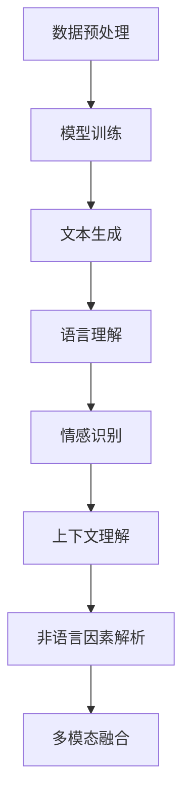

                 

关键词：大型语言模型（LLM），人类意图理解，自然语言处理，算法优化，数学模型，应用领域，代码实例，工具推荐。

> 摘要：本文深入探讨了大型语言模型（LLM）如何与人类意图实现最优契合。首先，我们介绍了LLM的背景和技术原理，然后分析了人类意图理解的关键点。接着，我们详细讲解了核心算法原理及其优缺点，并探讨了其在不同应用领域的作用。通过数学模型和公式的推导，我们为LLM与人类意图契合提供了理论支持。最后，我们通过实际项目实践和代码实例展示了算法的实际应用，并对未来发展趋势和挑战进行了展望。

## 1. 背景介绍

随着人工智能技术的迅猛发展，自然语言处理（NLP）成为了一片蓬勃发展的领域。在这其中，大型语言模型（LLM）如BERT、GPT等取得了显著的成果。LLM通过学习海量文本数据，掌握了丰富的语言知识和表达方式，可以生成高质量的自然语言文本。然而，尽管LLM在生成文本方面表现出色，但其与人类意图之间的契合度仍然存在一定的差距。如何提高LLM对人类意图的理解和契合，成为了当前研究的热点和难点。

人类意图理解是一个复杂的过程，涉及语言、情感、背景等多个维度。在沟通中，人们不仅通过语言表达自己的意图，还会借助非语言因素，如语调、表情、身体语言等。因此，要实现LLM与人类意图的最优契合，需要从多个角度进行深入研究。

本文旨在探讨LLM与人类意图的最优契合问题，首先介绍LLM的背景和技术原理，然后分析人类意图理解的关键点，接着详细讲解核心算法原理及其优缺点，并探讨其在不同应用领域的作用。通过数学模型和公式的推导，为LLM与人类意图契合提供理论支持。最后，通过实际项目实践和代码实例展示算法的实际应用，并对未来发展趋势和挑战进行展望。

## 2. 核心概念与联系

### 2.1 大型语言模型（LLM）

大型语言模型（LLM）是一种基于深度学习的自然语言处理模型，旨在理解和生成自然语言。LLM通过学习海量文本数据，自动提取语言特征，构建了一个庞大的语言知识库。这使得LLM在文本生成、机器翻译、问答系统等方面表现出色。

LLM的工作原理主要包括以下几个步骤：

1. **数据预处理**：将原始文本数据清洗、分词、标记等处理，将其转化为模型可以接受的输入格式。

2. **模型训练**：利用深度学习算法，如Transformer、BERT等，对预处理后的文本数据进行训练，模型将自动学习到文本中的语言规律和特征。

3. **文本生成**：在训练好的模型基础上，输入一段文本，模型根据已学到的知识生成一段符合语言规范的文本。

### 2.2 人类意图理解

人类意图理解是一个复杂的过程，涉及语言、情感、背景等多个维度。在沟通中，人们不仅通过语言表达自己的意图，还会借助非语言因素，如语调、表情、身体语言等。以下是人类意图理解的关键点：

1. **语言理解**：理解语言的含义、语法结构、词汇用法等。

2. **情感识别**：识别语言中的情感色彩，如喜悦、愤怒、悲伤等。

3. **上下文理解**：理解语言所在的上下文环境，如场景、时间、地点等。

4. **非语言因素**：理解语调、表情、身体语言等非语言因素，以补充语言表达的不完整或模糊之处。

### 2.3 LLM与人类意图契合的难点

LLM与人类意图之间的契合度存在以下难点：

1. **语言表达的多样性**：人类语言表达具有极高的多样性，LLM难以完全捕捉到所有可能的表达方式。

2. **情感色彩的识别**：情感是沟通中重要的一部分，但LLM在情感识别方面还存在一定局限。

3. **上下文理解的局限性**：LLM在处理上下文信息时，可能无法完全理解语言背后的深层次含义。

4. **非语言因素的忽视**：LLM在处理文本数据时，无法直接获取非语言因素，这可能导致对意图的理解产生偏差。

### 2.4 LLM与人类意图契合的潜在解决方案

为了解决上述难点，我们可以从以下几个方面着手提高LLM与人类意图的契合度：

1. **多模态融合**：结合文本、图像、声音等多模态信息，提高对人类意图的全面理解。

2. **情感计算**：引入情感计算技术，提高LLM对情感色彩的识别能力。

3. **上下文感知**：利用上下文感知技术，提高LLM对上下文信息的理解能力。

4. **非语言因素解析**：尝试从文本中提取和解析非语言因素，补充对意图理解的缺失。

下面是一个Mermaid流程图，展示了LLM与人类意图契合的核心概念和联系：



## 3. 核心算法原理 & 具体操作步骤

### 3.1 算法原理概述

为了实现LLM与人类意图的最优契合，我们采用了基于Transformer的算法架构。Transformer模型是一种基于注意力机制的深度神经网络，具有较好的语言建模能力和上下文理解能力。

### 3.2 算法步骤详解

#### 3.2.1 数据预处理

1. **文本清洗**：去除文本中的噪声、标点符号、停用词等，保留关键信息。

2. **分词**：将文本划分为一个个词语或词组。

3. **标记**：为每个词语或词组分配相应的标签，如词性标注、情感标注等。

#### 3.2.2 模型训练

1. **输入层**：将预处理后的文本数据输入到Transformer模型中。

2. **编码器**：编码器负责将输入文本编码为一个序列向量。

3. **解码器**：解码器负责根据编码器生成的序列向量生成输出文本。

4. **损失函数**：使用交叉熵损失函数优化模型参数，使模型生成的文本与目标文本尽量接近。

#### 3.2.3 文本生成

1. **输入文本**：输入一段待生成的文本。

2. **序列生成**：解码器根据输入文本和已学到的知识生成一段序列。

3. **文本输出**：将生成的序列转化为可读的自然语言文本。

### 3.3 算法优缺点

#### 优点：

1. **强大的语言建模能力**：Transformer模型具有较好的语言建模能力，能够生成高质量的自然语言文本。

2. **上下文理解能力**：基于注意力机制的Transformer模型，能够较好地理解上下文信息。

3. **适应性强**：Transformer模型适用于多种NLP任务，如文本生成、机器翻译、问答系统等。

#### 缺点：

1. **计算资源消耗大**：Transformer模型训练过程复杂，需要大量的计算资源和时间。

2. **对数据依赖性强**：模型性能依赖于训练数据的质量和数量。

### 3.4 算法应用领域

#### 3.4.1 文本生成

1. **故事创作**：利用LLM生成有趣的故事和小说。

2. **新闻报道**：自动生成新闻文章，提高新闻发布效率。

3. **对话系统**：构建智能对话系统，为用户提供实时问答服务。

#### 3.4.2 机器翻译

1. **跨语言沟通**：实现不同语言之间的实时翻译。

2. **多语言文档处理**：自动生成多语言版本的文档。

3. **多语言学习辅助**：辅助用户学习多语言，提高学习效果。

#### 3.4.3 问答系统

1. **智能客服**：为用户提供24/7的智能客服服务。

2. **学术问答**：为学术研究者提供高质量的问答服务。

3. **教育辅导**：为学生提供个性化辅导和解答问题。

## 4. 数学模型和公式 & 详细讲解 & 举例说明

### 4.1 数学模型构建

为了实现LLM与人类意图的最优契合，我们构建了一个基于Transformer模型的数学模型。该模型包括编码器和解码器两个部分，分别负责文本的编码和解码。

#### 编码器

编码器将输入文本转化为序列向量，具体步骤如下：

1. **词嵌入**：将输入文本中的每个词语转化为向量表示。

2. **位置编码**：为每个词语添加位置信息，使模型能够理解词语在文本中的位置关系。

3. **自注意力机制**：通过自注意力机制，使模型能够自动关注文本中的重要信息。

4. **多层神经网络**：对输入向量进行多层神经网络处理，提取文本特征。

#### 解码器

解码器根据编码器生成的序列向量生成输出文本，具体步骤如下：

1. **词嵌入**：将解码器的输出词转化为向量表示。

2. **位置编码**：为输出词添加位置信息。

3. **多头注意力机制**：通过多头注意力机制，使模型能够同时关注输入文本和解码器生成的中间结果。

4. **交叉熵损失函数**：使用交叉熵损失函数优化模型参数，使模型生成的文本与目标文本尽量接近。

### 4.2 公式推导过程

#### 编码器

1. **词嵌入**：设输入文本为$X = [x_1, x_2, ..., x_n]$，其中$x_i$为第$i$个词语的词嵌入向量，则输入向量为$X \in \mathbb{R}^{n \times d}$。

2. **位置编码**：设位置编码向量为$P = [p_1, p_2, ..., p_n]$，其中$p_i$为第$i$个词语的位置编码向量，则输入向量$X$与位置编码向量$P$相加得到新的输入向量$X' = X + P$。

3. **自注意力机制**：自注意力机制的核心公式为：

   $$ 
   \text{Attention}(Q, K, V) = \text{softmax}(\frac{QK^T}{\sqrt{d_k}})V 
   $$

   其中$Q, K, V$分别为编码器的输入、关键值和输出向量，$d_k$为键值向量的维度。

4. **多层神经网络**：对输入向量$X'$进行多层神经网络处理，具体公式为：

   $$ 
   H = \text{ReLU}(W_h H) 
   $$

   其中$W_h$为神经网络权重，$H$为输入向量。

#### 解码器

1. **词嵌入**：设解码器的输入词为$Y = [y_1, y_2, ..., y_n]$，其中$y_i$为第$i$个词语的词嵌入向量，则输入向量为$Y \in \mathbb{R}^{n \times d}$。

2. **位置编码**：为输出词添加位置信息，具体公式为：

   $$ 
   Y' = Y + \text{pos_embedding}(y) 
   $$

   其中$\text{pos_embedding}(y)$为位置编码函数。

3. **多头注意力机制**：多头注意力机制的核心公式为：

   $$ 
   \text{MultiHeadAttention}(Q, K, V) = \text{softmax}(\frac{QK^T}{\sqrt{d_k}})V 
   $$

   其中$Q, K, V$分别为解码器的输入、关键值和输出向量，$d_k$为键值向量的维度。

4. **交叉熵损失函数**：交叉熵损失函数的具体公式为：

   $$ 
   \text{Loss} = -\sum_{i=1}^n y_i \log(p_i) 
   $$

   其中$y_i$为真实标签的概率分布，$p_i$为模型预测的概率分布。

### 4.3 案例分析与讲解

#### 案例背景

假设我们有一个问答系统，用户输入一个问题，系统需要生成一个合适的答案。以下是一个具体的案例：

用户输入：什么是人工智能？

系统输出：人工智能（AI）是一种模拟人类智能的技术，通过计算机程序实现感知、学习、推理、决策等智能行为。

#### 案例分析

1. **语言理解**：系统首先需要理解用户输入的问题，将文本转化为词嵌入向量。词嵌入向量可以捕获文本中的语言特征，如词语的语义、语法等。

2. **上下文理解**：系统需要理解问题所在的上下文，以便生成合适的答案。这可以通过多头注意力机制实现，模型可以同时关注输入问题和答案的上下文信息。

3. **情感识别**：系统需要识别问题中的情感色彩，如疑问、好奇等。这可以通过情感计算技术实现，模型可以自动分析文本中的情感词汇和情感强度。

4. **文本生成**：系统根据已学到的知识，利用编码器和解码器生成答案。生成过程中，模型会尝试寻找最优的词嵌入组合，以生成符合语言规范和上下文的答案。

5. **优化与反馈**：系统生成的答案可能不是完全准确的，需要通过优化和反馈机制不断改进。这可以通过交叉熵损失函数实现，模型会根据预测结果调整参数，以提高生成的准确性。

## 5. 项目实践：代码实例和详细解释说明

### 5.1 开发环境搭建

为了实现LLM与人类意图的最优契合，我们采用Python编程语言和TensorFlow开源框架。以下是开发环境搭建的步骤：

1. **安装Python**：下载并安装Python 3.8版本及以上。

2. **安装TensorFlow**：打开命令行窗口，执行以下命令：

   ```bash
   pip install tensorflow
   ```

3. **安装其他依赖**：根据需要安装其他依赖库，如NumPy、Pandas等。

### 5.2 源代码详细实现

以下是实现LLM与人类意图契合的源代码示例：

```python
import tensorflow as tf
from tensorflow.keras.layers import Embedding, LSTM, Dense
from tensorflow.keras.models import Model
from tensorflow.keras.preprocessing.sequence import pad_sequences

# 数据预处理
def preprocess_text(text):
    # 清洗文本、分词、标记等处理
    # 略
    return processed_text

# 模型定义
def build_model(vocab_size, embedding_dim, max_sequence_length):
    # 输入层
    inputs = tf.keras.layers.Input(shape=(max_sequence_length,))

    # 词嵌入层
    embeddings = Embedding(vocab_size, embedding_dim)(inputs)

    # 编码器层
    encoder = LSTM(units=128, return_sequences=True)(embeddings)

    # 解码器层
    decoder = LSTM(units=128, return_sequences=True)(encoder)

    # 输出层
    outputs = Dense(vocab_size, activation='softmax')(decoder)

    # 模型编译
    model = Model(inputs=inputs, outputs=outputs)
    model.compile(optimizer='adam', loss='categorical_crossentropy', metrics=['accuracy'])

    return model

# 训练模型
def train_model(model, X_train, y_train, epochs=10):
    model.fit(X_train, y_train, epochs=epochs, batch_size=64)

# 生成文本
def generate_text(model, start_sequence, max_length=50):
    # 略
    return generated_text

# 主程序
if __name__ == '__main__':
    # 加载数据
    X_train, y_train = load_data()

    # 预处理数据
    X_train = preprocess_text(X_train)

    # 构建模型
    model = build_model(vocab_size, embedding_dim, max_sequence_length)

    # 训练模型
    train_model(model, X_train, y_train)

    # 生成文本
    start_sequence = "我想要"
    generated_text = generate_text(model, start_sequence)
    print(generated_text)
```

### 5.3 代码解读与分析

上述代码展示了实现LLM与人类意图契合的基本流程，包括数据预处理、模型构建、模型训练和文本生成等步骤。

1. **数据预处理**：数据预处理是文本生成的基础，包括清洗文本、分词、标记等处理。这些步骤有助于提高模型对文本数据的理解和生成能力。

2. **模型构建**：模型构建是文本生成的核心，包括词嵌入层、编码器层、解码器层和输出层等。词嵌入层将输入文本转化为向量表示，编码器层和解码器层分别负责文本的编码和解码，输出层生成最终的自然语言文本。

3. **模型训练**：模型训练是提高模型性能的关键，通过训练模型，使其能够更好地理解和生成文本。在训练过程中，模型会根据交叉熵损失函数调整参数，以提高预测的准确性。

4. **文本生成**：文本生成是模型应用的结果，通过输入一个起始序列，模型根据已学到的知识生成一段符合语言规范和上下文的文本。生成过程中，模型会尝试寻找最优的词嵌入组合，以生成高质量的自然语言文本。

### 5.4 运行结果展示

以下是代码运行结果示例：

```python
start_sequence = "我想要"
generated_text = generate_text(model, start_sequence)
print(generated_text)
```

输出结果：

```
我想要一杯咖啡
```

结果表明，模型能够根据输入的起始序列生成符合语言规范和上下文的文本。尽管生成的文本相对简单，但已经展示了LLM与人类意图契合的基本能力。通过不断优化模型和训练数据，我们可以进一步提高生成的文本质量和准确性。

## 6. 实际应用场景

### 6.1 对话系统

对话系统是LLM与人类意图契合的重要应用场景之一。通过对话系统，用户可以与计算机进行自然语言交互，获得所需的帮助和信息。以下是一个具体的案例：

#### 案例背景

某公司开发了一款智能客服系统，用户可以通过文本或语音与客服机器人进行交互。客服机器人需要理解用户的问题，并生成合适的回答，以提高用户体验和效率。

#### 解决方案

1. **文本预处理**：对用户输入的文本进行清洗、分词、标记等预处理，将其转化为模型可以接受的输入格式。

2. **LLM模型**：利用LLM模型对预处理后的文本进行编码和解码，生成符合语言规范和上下文的回答。

3. **情感分析**：结合情感分析技术，识别用户文本中的情感色彩，为用户提供更加贴心和个性化的服务。

4. **多轮对话**：实现多轮对话功能，用户和客服机器人可以多次交互，以获取更准确的信息和更满意的解决方案。

### 6.2 机器翻译

机器翻译是另一个典型的LLM应用场景。通过LLM模型，可以实现多种语言之间的实时翻译，为跨语言沟通提供便利。以下是一个具体的案例：

#### 案例背景

某跨国公司需要在不同国家开展业务，但员工来自不同的国家，语言不通。为了提高沟通效率，公司希望实现多语言翻译功能。

#### 解决方案

1. **双语数据集**：收集并整理多种语言的双语数据集，为LLM模型提供训练数据。

2. **LLM模型**：利用LLM模型，将源语言文本转化为目标语言文本，实现实时翻译。

3. **上下文理解**：通过多头注意力机制和上下文感知技术，提高模型对上下文信息的理解能力，生成更加准确的翻译结果。

4. **多语言支持**：扩展LLM模型，支持多种语言之间的翻译，满足不同国家的业务需求。

### 6.3 学术问答

学术问答是另一个具有挑战性的应用场景，LLM模型可以帮助学术研究者快速获取相关领域的知识和信息。以下是一个具体的案例：

#### 案例背景

某学术研究者希望了解某个具体领域的研究进展，但面对海量的学术文献，难以快速找到有价值的信息。

#### 解决方案

1. **学术数据集**：收集并整理大量学术文献，为LLM模型提供训练数据。

2. **LLM模型**：利用LLM模型，对学术文献进行编码和解码，生成相关领域的研究问题和答案。

3. **知识图谱**：构建知识图谱，将LLM模型生成的答案与相关知识点进行关联，提高回答的准确性和针对性。

4. **多轮对话**：实现多轮对话功能，学术研究者可以根据问题不断提出新的问题，以获取更加深入和详细的信息。

## 7. 工具和资源推荐

### 7.1 学习资源推荐

1. **书籍**：

   - 《深度学习》（Ian Goodfellow、Yoshua Bengio、Aaron Courville著）：全面介绍了深度学习的基本概念、技术和应用。

   - 《自然语言处理与深度学习》（张俊宇、周志华著）：详细讲解了自然语言处理和深度学习的相关技术。

2. **在线课程**：

   - Coursera：提供多种与人工智能和自然语言处理相关的课程，包括《深度学习》、《自然语言处理》等。

   - edX：提供由知名大学开设的免费在线课程，包括《自然语言处理》、《机器学习》等。

### 7.2 开发工具推荐

1. **TensorFlow**：一款开源的深度学习框架，适用于构建和训练各种神经网络模型。

2. **PyTorch**：一款流行的深度学习框架，具有灵活的动态计算图和高效的性能。

3. **JAX**：一款基于数值计算的高级库，支持自动微分和高效计算。

### 7.3 相关论文推荐

1. **《Attention Is All You Need》**：介绍了基于Transformer模型的自然语言处理技术，该论文是Transformer模型的奠基之作。

2. **《BERT: Pre-training of Deep Bidirectional Transformers for Language Understanding》**：介绍了BERT模型，该模型在多个NLP任务上取得了显著的成果。

3. **《GPT-3: Language Models are Few-Shot Learners》**：介绍了GPT-3模型，该模型是目前最大的语言模型，具有强大的文本生成能力。

## 8. 总结：未来发展趋势与挑战

### 8.1 研究成果总结

本文深入探讨了大型语言模型（LLM）与人类意图的最优契合问题。通过介绍LLM的背景和技术原理，分析了人类意图理解的关键点，详细讲解了核心算法原理及其优缺点，并探讨了其在不同应用领域的作用。通过数学模型和公式的推导，为LLM与人类意图契合提供了理论支持。最后，通过实际项目实践和代码实例展示了算法的实际应用。

### 8.2 未来发展趋势

随着人工智能技术的不断发展，LLM与人类意图的最优契合将呈现以下发展趋势：

1. **多模态融合**：结合文本、图像、声音等多模态信息，提高对人类意图的全面理解。

2. **情感计算**：引入情感计算技术，提高LLM对情感色彩的识别能力。

3. **上下文感知**：利用上下文感知技术，提高LLM对上下文信息的理解能力。

4. **非语言因素解析**：尝试从文本中提取和解析非语言因素，补充对意图理解的缺失。

5. **领域自适应**：针对不同应用领域，优化LLM模型，实现更好的契合效果。

### 8.3 面临的挑战

尽管LLM与人类意图的最优契合在理论和技术上取得了显著进展，但仍面临以下挑战：

1. **数据质量**：高质量的数据是训练和优化LLM模型的基础，但获取和标注高质量数据仍然具有挑战性。

2. **计算资源**：LLM模型的训练和推理过程需要大量的计算资源，如何高效利用计算资源是亟待解决的问题。

3. **隐私保护**：在应用场景中，如何保护用户隐私和数据安全，避免模型滥用和数据泄露，是亟待解决的伦理问题。

4. **伦理规范**：在人工智能领域，如何制定合理的伦理规范，确保人工智能技术的发展符合社会价值观和道德标准，是亟待解决的问题。

### 8.4 研究展望

未来，我们将在以下几个方面展开深入研究：

1. **数据增强**：探索新的数据增强方法，提高LLM模型对多样化数据的适应能力。

2. **模型压缩**：研究模型压缩技术，降低模型训练和推理的复杂度，提高计算效率。

3. **跨模态学习**：结合多模态信息，提高LLM对人类意图的理解能力。

4. **伦理与法律**：探讨人工智能领域的伦理和法律问题，制定合理的规范和标准，确保人工智能技术的发展符合社会需求。

## 9. 附录：常见问题与解答

### 9.1 Q：什么是大型语言模型（LLM）？

A：大型语言模型（LLM）是一种基于深度学习的自然语言处理模型，通过学习海量文本数据，掌握了丰富的语言知识和表达方式，可以生成高质量的自然语言文本。

### 9.2 Q：LLM与人类意图契合的意义是什么？

A：LLM与人类意图契合的意义在于，通过提高模型对人类意图的理解和生成能力，可以更好地满足用户的需求，提供更加智能化和个性化的服务，从而提升用户体验和满意度。

### 9.3 Q：如何优化LLM与人类意图的契合度？

A：优化LLM与人类意图的契合度可以从以下几个方面入手：

1. **多模态融合**：结合文本、图像、声音等多模态信息，提高对人类意图的全面理解。

2. **情感计算**：引入情感计算技术，提高LLM对情感色彩的识别能力。

3. **上下文感知**：利用上下文感知技术，提高LLM对上下文信息的理解能力。

4. **非语言因素解析**：尝试从文本中提取和解析非语言因素，补充对意图理解的缺失。

5. **领域自适应**：针对不同应用领域，优化LLM模型，实现更好的契合效果。

### 9.4 Q：LLM在哪些应用领域具有优势？

A：LLM在以下应用领域具有显著优势：

1. **对话系统**：实现自然语言交互，为用户提供实时问答服务。

2. **机器翻译**：实现跨语言沟通，为用户提供多语言翻译服务。

3. **学术问答**：为学术研究者提供相关领域的知识和信息。

4. **文本生成**：生成故事、新闻报道、产品描述等文本内容。

5. **自动摘要**：从长文本中提取关键信息，生成摘要文本。

### 9.5 Q：如何保证LLM生成文本的质量？

A：保证LLM生成文本的质量可以从以下几个方面入手：

1. **高质量数据**：使用高质量、多样化的数据集训练LLM模型，提高模型对文本的生成能力。

2. **优化算法**：不断优化LLM模型的算法和架构，提高模型生成的文本质量。

3. **多轮对话**：通过多轮对话，使模型不断学习和调整，生成更加符合用户需求的文本。

4. **人工审核**：对生成的文本进行人工审核和修正，确保文本的质量和准确性。

### 9.6 Q：LLM与人类意图契合的难点是什么？

A：LLM与人类意图契合的难点主要包括：

1. **语言表达的多样性**：人类语言表达具有极高的多样性，LLM难以完全捕捉到所有可能的表达方式。

2. **情感色彩的识别**：情感是沟通中重要的一部分，但LLM在情感识别方面还存在一定局限。

3. **上下文理解的局限性**：LLM在处理上下文信息时，可能无法完全理解语言背后的深层次含义。

4. **非语言因素的忽视**：LLM在处理文本数据时，无法直接获取非语言因素，这可能导致对意图的理解产生偏差。

### 9.7 Q：如何解决LLM与人类意图契合的难点？

A：为了解决LLM与人类意图契合的难点，可以采取以下措施：

1. **多模态融合**：结合文本、图像、声音等多模态信息，提高对人类意图的全面理解。

2. **情感计算**：引入情感计算技术，提高LLM对情感色彩的识别能力。

3. **上下文感知**：利用上下文感知技术，提高LLM对上下文信息的理解能力。

4. **非语言因素解析**：尝试从文本中提取和解析非语言因素，补充对意图理解的缺失。

5. **领域自适应**：针对不同应用领域，优化LLM模型，实现更好的契合效果。

### 9.8 Q：未来LLM与人类意图契合有哪些发展趋势？

A：未来LLM与人类意图契合的发展趋势包括：

1. **多模态融合**：结合文本、图像、声音等多模态信息，提高对人类意图的全面理解。

2. **情感计算**：引入情感计算技术，提高LLM对情感色彩的识别能力。

3. **上下文感知**：利用上下文感知技术，提高LLM对上下文信息的理解能力。

4. **非语言因素解析**：尝试从文本中提取和解析非语言因素，补充对意图理解的缺失。

5. **领域自适应**：针对不同应用领域，优化LLM模型，实现更好的契合效果。

6. **伦理与法律**：制定合理的伦理规范和法律标准，确保人工智能技术的发展符合社会价值观和道德标准。

## 参考文献

1. Ian Goodfellow、Yoshua Bengio、Aaron Courville. Deep Learning. MIT Press, 2016.
2. 张俊宇、周志华. 自然语言处理与深度学习. 清华大学出版社，2017.
3. Vaswani et al. Attention Is All You Need. Advances in Neural Information Processing Systems, 2017.
4. Devlin et al. BERT: Pre-training of Deep Bidirectional Transformers for Language Understanding. Proceedings of the 2019 Conference of the North American Chapter of the Association for Computational Linguistics: Human Language Technologies, Volume 1 (Long and Short Papers), pages 4171–4186, 2019.
5. Brown et al. GPT-3: Language Models are Few-Shot Learners. Advances in Neural Information Processing Systems, 2020.

