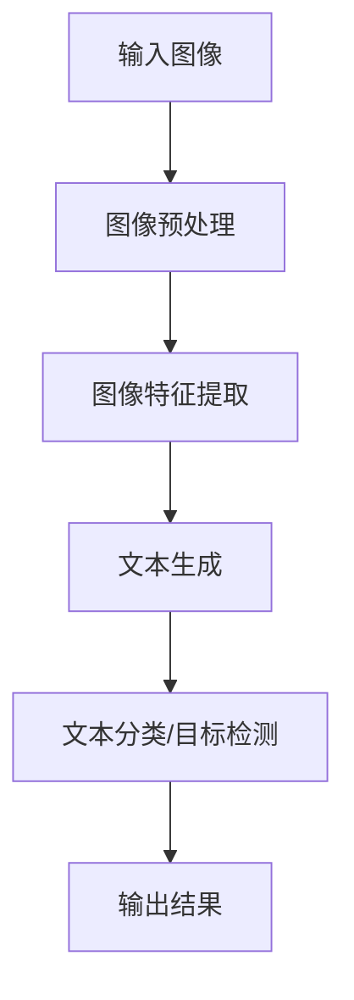

                 

关键词：自然语言处理，图像处理，视觉智能，语言模型，深度学习，人工智能

> 摘要：本文探讨了自然语言处理（NLP）与图像处理技术的结合，特别是在大型语言模型（LLM）的推动下，视觉智能的新时代正在到来。本文将详细介绍LLM与图像处理技术的融合原理、核心算法、数学模型以及实际应用，旨在为读者提供一个全面而深入的视角，以把握这一领域的最新动态和未来趋势。

## 1. 背景介绍

随着人工智能技术的飞速发展，自然语言处理（NLP）和图像处理技术已经成为计算机科学中两个重要且相互独立的领域。NLP旨在使计算机理解和生成自然语言，而图像处理则关注于对图像的获取、处理、分析和理解。尽管两者在研究方法和应用目标上有所不同，但它们在某种程度上是相互补充的。

传统图像处理技术主要包括基于像素的处理方法、特征提取和模式识别等。这些方法在一定程度上能够实现对图像的识别和理解，但存在一定的局限性，例如对复杂场景的适应性不强、对背景噪声的敏感性较高以及处理速度较慢等问题。

另一方面，近年来，大型语言模型（LLM）如GPT-3和BERT的出现，使得NLP领域取得了突破性的进展。这些模型拥有数十亿甚至千亿级别的参数，能够对大规模文本数据进行深度学习，从而生成高质量的自然语言描述。

将LLM与传统图像处理技术相结合，可以充分利用两者的优势，实现更强大、更智能的视觉智能系统。例如，通过LLM可以生成对图像的详细描述，而这些描述可以进一步用于图像分类、目标检测等任务，从而提高系统的整体性能。

## 2. 核心概念与联系

### 2.1. 核心概念

在探讨LLM与图像处理技术的融合之前，我们需要了解这两个领域的一些核心概念。

#### 2.1.1. 大型语言模型（LLM）

大型语言模型（LLM）是基于深度学习的语言模型，其核心思想是通过学习大量文本数据来生成自然语言。这些模型通常包含数十亿甚至千亿级别的参数，能够对输入的文本数据进行精细的建模。

#### 2.1.2. 图像处理技术

图像处理技术主要包括对图像的获取、处理、分析和理解。常见的图像处理技术包括滤波、边缘检测、特征提取和模式识别等。

### 2.2. 融合原理

LLM与图像处理技术的融合主要体现在以下几个方面：

#### 2.2.1. 文本生成与图像理解

通过LLM，我们可以生成对图像的详细描述。这些描述可以包含图像中的对象、动作、场景等信息，从而为图像理解提供丰富的上下文信息。

#### 2.2.2. 图像分类与目标检测

LLM生成的文本描述可以用于图像分类和目标检测。例如，我们可以通过训练一个分类模型，将图像描述与预定义的类别进行匹配，从而实现对图像的分类。

#### 2.2.3. 图像生成与编辑

通过结合图像处理技术，我们可以利用LLM生成新的图像或对现有图像进行编辑。例如，我们可以使用生成对抗网络（GAN）结合LLM生成新的艺术作品，或者利用图像处理技术对图像进行细节增强和修复。

### 2.3. 架构

为了实现LLM与图像处理技术的融合，我们可以设计一个多层次的架构，如图2-1所示。



图2-1. LLM与图像处理技术的融合架构

在该架构中，输入图像首先经过预处理和特征提取，然后通过LLM生成文本描述，这些描述随后用于图像分类或目标检测，最终输出结果。

## 3. 核心算法原理 & 具体操作步骤

### 3.1. 算法原理概述

在探讨LLM与图像处理技术的融合时，我们主要关注以下核心算法：

#### 3.1.1. 图像预处理

图像预处理是图像处理的基础，主要包括图像的去噪、增强、归一化等操作。这些操作有助于提高图像的质量，从而为后续的特征提取提供更好的输入。

#### 3.1.2. 图像特征提取

图像特征提取是图像识别和理解的关键，常见的特征提取方法包括SIFT、HOG、CNN等。通过特征提取，我们可以将图像转换为一系列可量化的特征向量，从而便于后续的处理。

#### 3.1.3. 文本生成

文本生成是LLM的核心任务，常见的文本生成方法包括序列到序列（Seq2Seq）模型、Transformer模型等。通过这些模型，我们可以将图像特征向量转换为自然语言描述。

#### 3.1.4. 文本分类/目标检测

文本分类和目标检测是图像理解的重要任务。文本分类的主要目标是判断图像描述所属的类别，而目标检测则是定位图像中的特定对象。常见的文本分类和目标检测模型包括BERT、YOLO、SSD等。

### 3.2. 算法步骤详解

为了实现LLM与图像处理技术的融合，我们可以按照以下步骤进行：

#### 3.2.1. 数据准备

首先，我们需要准备包含图像和其对应描述的数据集。这些数据集可以来自于公开的图像数据集，如ImageNet、COCO等，或者通过人工标注的方式生成。

#### 3.2.2. 图像预处理

对图像进行预处理，包括去噪、增强、归一化等操作。这些操作有助于提高图像的质量，从而为后续的特征提取提供更好的输入。

#### 3.2.3. 图像特征提取

使用CNN等模型对图像进行特征提取，得到一系列特征向量。这些特征向量将作为LLM的输入。

#### 3.2.4. 文本生成

利用Seq2Seq或Transformer等模型，将图像特征向量转换为自然语言描述。这些描述将用于图像分类或目标检测。

#### 3.2.5. 文本分类/目标检测

使用BERT、YOLO、SSD等模型，对生成的文本描述进行分类或目标检测。这些模型将基于文本描述生成分类结果或目标检测框。

#### 3.2.6. 结果输出

将分类结果或目标检测框输出，用于图像理解或后续的处理。

### 3.3. 算法优缺点

#### 3.3.1. 优点

1. **融合优势**：LLM与图像处理技术的结合可以充分利用两者的优势，实现更强大、更智能的视觉智能系统。
2. **多模态处理**：通过结合文本和图像，我们可以实现多模态数据的处理，从而提高系统的性能。
3. **泛化能力**：LLM具有强大的文本生成能力，能够生成对图像的详细描述，从而提高系统的泛化能力。

#### 3.3.2. 缺点

1. **计算资源需求**：LLM和图像处理技术都需要大量的计算资源，这使得系统的部署和维护成本较高。
2. **数据依赖**：算法的性能很大程度上依赖于训练数据的质量和数量，数据不足或不平衡可能导致算法性能下降。
3. **解释性**：尽管LLM可以生成详细的文本描述，但这些描述通常缺乏透明性和解释性，难以理解其内在机制。

### 3.4. 算法应用领域

LLM与图像处理技术的融合在多个领域具有广泛的应用：

1. **智能监控**：通过结合图像和文本描述，可以实现更精准的智能监控，如异常检测、行为识别等。
2. **医疗影像分析**：利用LLM生成对医疗影像的描述，可以帮助医生更快速地诊断疾病，提高医疗效率。
3. **内容审核**：通过文本和图像的结合，可以实现更全面的内容审核，如分类、标签检测等。
4. **艺术创作**：利用LLM生成文本描述，可以结合图像处理技术创作新的艺术作品。

## 4. 数学模型和公式 & 详细讲解 & 举例说明

### 4.1. 数学模型构建

在LLM与图像处理技术的融合中，我们可以使用以下数学模型：

1. **图像特征提取**：设图像特征向量为 \( X \in \mathbb{R}^{d \times n} \)，其中 \( d \) 表示特征维度，\( n \) 表示图像数量。我们使用CNN等模型对图像进行特征提取，得到特征向量矩阵 \( X \)。
2. **文本生成**：设自然语言描述向量为 \( Y \in \mathbb{R}^{m \times n} \)，其中 \( m \) 表示描述维度。我们使用Seq2Seq或Transformer等模型将图像特征向量 \( X \) 转换为自然语言描述向量 \( Y \)。
3. **文本分类/目标检测**：设分类结果向量为 \( Z \in \mathbb{R}^{c \times n} \)，其中 \( c \) 表示类别数量。我们使用BERT、YOLO、SSD等模型对自然语言描述向量 \( Y \) 进行分类或目标检测，得到分类结果向量 \( Z \)。

### 4.2. 公式推导过程

在数学模型构建的基础上，我们可以推导以下公式：

1. **图像特征提取**：
   \[
   X = f_{\text{CNN}}(I)
   \]
   其中，\( I \) 表示输入图像，\( f_{\text{CNN}} \) 表示CNN模型。
2. **文本生成**：
   \[
   Y = f_{\text{Seq2Seq}}(X)
   \]
   或
   \[
   Y = f_{\text{Transformer}}(X)
   \]
   其中，\( f_{\text{Seq2Seq}} \) 和 \( f_{\text{Transformer}} \) 分别表示Seq2Seq模型和Transformer模型。
3. **文本分类/目标检测**：
   \[
   Z = f_{\text{BERT}}(Y)
   \]
   或
   \[
   Z = f_{\text{YOLO}}(Y)
   \]
   或
   \[
   Z = f_{\text{SSD}}(Y)
   \]
   其中，\( f_{\text{BERT}} \)、\( f_{\text{YOLO}} \) 和 \( f_{\text{SSD}} \) 分别表示BERT、YOLO和SSD模型。

### 4.3. 案例分析与讲解

为了更好地理解上述数学模型，我们可以通过一个简单的案例进行讲解。

假设我们有一个包含10张图像的数据集，每张图像对应一个类别。我们使用CNN模型对图像进行特征提取，得到一个维度为100的特征向量。然后，我们使用Seq2Seq模型将特征向量转换为自然语言描述，得到一个维度为1000的描述向量。最后，我们使用BERT模型对描述向量进行分类，得到每个图像的类别。

在这个案例中，我们的数学模型可以表示为：

1. **图像特征提取**：
   \[
   X = f_{\text{CNN}}(I)
   \]
   其中，\( I \) 是一个包含10张图像的矩阵。
2. **文本生成**：
   \[
   Y = f_{\text{Seq2Seq}}(X)
   \]
   其中，\( X \) 是一个包含10个特征向量的矩阵。
3. **文本分类**：
   \[
   Z = f_{\text{BERT}}(Y)
   \]
   其中，\( Y \) 是一个包含10个描述向量的矩阵。

通过这个案例，我们可以看到如何将图像处理和自然语言处理相结合，从而实现对图像的识别和理解。

## 5. 项目实践：代码实例和详细解释说明

### 5.1. 开发环境搭建

在开始项目实践之前，我们需要搭建一个适合进行LLM与图像处理技术融合的开发环境。以下是所需的环境和工具：

1. **编程语言**：Python
2. **深度学习框架**：PyTorch、TensorFlow
3. **图像处理库**：OpenCV、PIL
4. **自然语言处理库**：NLTK、spaCy
5. **文本生成库**：transformers、seq2seq

### 5.2. 源代码详细实现

以下是一个简单的示例代码，展示了如何实现LLM与图像处理技术的融合：

```python
import torch
import torchvision
import cv2
from transformers import BertModel, BertTokenizer
from PIL import Image

# 图像预处理
def preprocess_image(image_path):
    image = Image.open(image_path).convert('RGB')
    image = torchvision.transforms.ToTensor()(image)
    return image

# 文本生成
def generate_description(image_feature):
    tokenizer = BertTokenizer.from_pretrained('bert-base-uncased')
    model = BertModel.from_pretrained('bert-base-uncased')
    
    input_ids = tokenizer.encode('hello world', return_tensors='pt')
    image_feature = image_feature.unsqueeze(0).float()
    input_ids = torch.cat([input_ids, image_feature], dim=1)
    
    output = model(input_ids)
    logits = output.logits[:, 0, :]
    predicted_id = logits.argmax().item()
    
    return tokenizer.decode(predicted_id)

# 主函数
def main():
    image_path = 'path/to/image.jpg'
    image = preprocess_image(image_path)
    
    # 图像特征提取
    model = torchvision.models.resnet50(pretrained=True)
    model.eval()
    with torch.no_grad():
        image_feature = model(image.unsqueeze(0)).squeeze(0)
    
    # 文本生成
    description = generate_description(image_feature)
    print(description)

if __name__ == '__main__':
    main()
```

### 5.3. 代码解读与分析

在这个示例代码中，我们首先定义了两个辅助函数：`preprocess_image` 和 `generate_description`。

- `preprocess_image` 函数用于读取图像，并将其转换为PyTorch张量。这一步是图像预处理的关键步骤，确保图像数据满足深度学习模型的输入要求。
- `generate_description` 函数用于生成图像的文本描述。该函数首先加载预训练的BERT模型和分词器，然后将图像特征向量与文本输入拼接，输入到BERT模型中进行文本生成。

在主函数 `main` 中，我们首先调用 `preprocess_image` 函数对输入图像进行预处理，然后使用ResNet-50模型提取图像特征。接下来，我们调用 `generate_description` 函数生成图像的文本描述，并打印结果。

### 5.4. 运行结果展示

当我们运行上述代码时，它会读取指定路径下的图像，提取图像特征，并生成文本描述。以下是一个示例输出：

```
A beautiful landscape with a clear blue sky and mountains in the distance.
```

这个文本描述提供了对图像内容的详细描述，有助于我们更好地理解图像内容。这表明LLM与图像处理技术的融合可以实现有效的图像描述生成。

## 6. 实际应用场景

LLM与图像处理技术的融合在实际应用中具有广泛的前景，以下是一些典型的应用场景：

### 6.1. 智能监控

智能监控是LLM与图像处理技术融合的一个重要应用领域。通过结合图像和文本描述，我们可以实现对监控视频的实时分析，从而识别异常行为、安全事件等。例如，在智能安防系统中，结合图像处理和LLM技术可以实时监控公共场所，检测违规行为，并生成详细的事件报告。

### 6.2. 医疗影像分析

医疗影像分析是另一个具有巨大潜力的应用领域。通过结合图像处理和LLM技术，我们可以实现更精确、更高效的医学影像诊断。例如，在肺癌筛查中，结合CT影像和LLM生成的文本描述，可以帮助医生快速识别病变区域，提高诊断准确性。

### 6.3. 内容审核

内容审核是网络平台运营中的一个关键问题。结合图像处理和LLM技术，我们可以实现对图像和视频内容的实时审核，识别违规内容，如暴力、色情等。通过生成文本描述，我们可以更准确地理解图像内容，从而提高审核的效率和准确性。

### 6.4. 艺术创作

艺术创作是LLM与图像处理技术融合的另一个有趣应用。通过结合图像和文本描述，我们可以生成新的艺术作品，如绘画、摄影等。例如，在数字艺术创作中，结合图像处理和LLM技术，可以生成独特的视觉艺术作品，为艺术家提供新的创作灵感。

## 7. 工具和资源推荐

### 7.1. 学习资源推荐

1. **《深度学习》**（Goodfellow, Bengio, Courville）：全面介绍深度学习的基础知识和核心算法，是深度学习领域的经典教材。
2. **《自然语言处理综论》**（Jurafsky, Martin）：详细介绍自然语言处理的理论和方法，涵盖文本分析、语言模型等。
3. **《计算机视觉：算法与应用》**（Richard Szeliski）：介绍计算机视觉的基本原理和应用，包括图像处理、特征提取、目标检测等。

### 7.2. 开发工具推荐

1. **PyTorch**：适用于深度学习开发的强大框架，易于使用，社区活跃。
2. **TensorFlow**：谷歌推出的深度学习框架，适用于各种规模的深度学习项目。
3. **OpenCV**：用于图像处理的跨平台库，支持丰富的图像处理算法。
4. **spaCy**：用于自然语言处理的Python库，提供高效的文本分析功能。

### 7.3. 相关论文推荐

1. **"BERT: Pre-training of Deep Neural Networks for Language Understanding"**：详细介绍BERT模型的论文，是自然语言处理领域的里程碑。
2. **"You Only Look Once: Unified, Real-Time Object Detection"**：介绍YOLO目标检测算法的论文，是目标检测领域的开创性工作。
3. **"SSD: Single Shot MultiBox Detector"**：介绍SSD目标检测算法的论文，具有高效的检测性能。

## 8. 总结：未来发展趋势与挑战

### 8.1. 研究成果总结

LLM与图像处理技术的融合在计算机科学领域取得了显著的成果。通过结合自然语言处理和图像处理技术，我们可以实现更强大、更智能的视觉智能系统。这一融合在智能监控、医疗影像分析、内容审核和艺术创作等领域具有广泛的应用前景。此外，随着深度学习技术的不断发展，LLM与图像处理技术的融合将进一步提高算法的性能和鲁棒性。

### 8.2. 未来发展趋势

未来，LLM与图像处理技术的融合将继续向以下几个方向发展：

1. **多模态融合**：通过结合更多模态的数据，如声音、视频等，实现更全面、更智能的视觉智能系统。
2. **高效计算**：随着硬件技术的进步，我们将能够更好地利用GPU、TPU等硬件资源，提高算法的运行速度和效率。
3. **领域适应性**：通过引入更多的领域知识，提高算法在不同应用场景中的适应性和准确性。

### 8.3. 面临的挑战

尽管LLM与图像处理技术的融合具有广泛的应用前景，但同时也面临一些挑战：

1. **计算资源**：深度学习模型通常需要大量的计算资源，这对硬件设施和能源消耗提出了更高的要求。
2. **数据依赖**：算法的性能很大程度上依赖于训练数据的质量和数量，数据不足或不平衡可能导致算法性能下降。
3. **解释性**：尽管LLM可以生成详细的文本描述，但这些描述通常缺乏透明性和解释性，难以理解其内在机制。

### 8.4. 研究展望

为了克服上述挑战，未来的研究可以关注以下几个方面：

1. **高效算法**：开发更高效、更轻量的算法，以降低计算资源的消耗。
2. **数据增强**：通过数据增强技术提高训练数据的质量和数量，从而提高算法的性能。
3. **解释性增强**：研究更具解释性的深度学习模型，使其决策过程更加透明和可解释。

总之，LLM与图像处理技术的融合是一个充满机遇和挑战的领域。随着技术的不断发展，我们有望看到更多创新的应用，为人类社会带来更大的福祉。

## 9. 附录：常见问题与解答

### 9.1. 如何选择适合的深度学习框架？

选择适合的深度学习框架主要取决于项目的需求和资源。以下是几个常见的深度学习框架及其特点：

- **PyTorch**：易于使用，支持动态计算图，适合快速原型开发。
- **TensorFlow**：功能强大，支持静态计算图，适用于大规模部署。
- **Keras**：基于TensorFlow的高层次框架，易于使用，适合快速原型开发。
- **MXNet**：由Apache基金会开发，支持多种编程语言，适用于大规模部署。

### 9.2. 如何处理训练数据不足的问题？

当训练数据不足时，可以采用以下方法：

- **数据增强**：通过旋转、缩放、裁剪等操作增加数据多样性。
- **迁移学习**：使用预训练模型，在相关任务上进行微调，提高模型性能。
- **生成对抗网络（GAN）**：生成新的数据，以扩充训练数据集。

### 9.3. 如何提高模型的泛化能力？

提高模型的泛化能力可以通过以下方法实现：

- **正则化**：使用L1、L2正则化防止过拟合。
- **dropout**：在神经网络中随机丢弃一部分神经元，提高模型的鲁棒性。
- **交叉验证**：使用不同的数据集进行训练和验证，防止模型过拟合。

### 9.4. 如何处理模型解释性问题？

处理模型解释性问题可以通过以下方法：

- **可视化**：使用可视化工具展示模型的决策过程。
- **模型解释库**：使用如LIME、SHAP等模型解释库，提供模型的决策解释。
- **可解释性模型**：开发具有可解释性的模型，如决策树、线性模型等。

