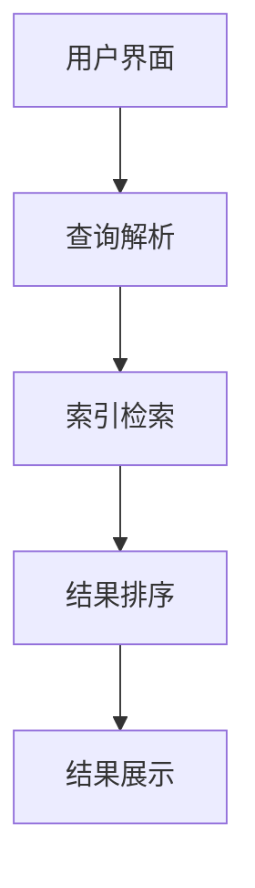

                 

关键词：Large Language Model, 传统搜索引擎，智能检索，算法结合，技术融合

摘要：本文深入探讨了Large Language Model（LLM）与传统搜索引擎技术的结合，分析其原理、优势和应用场景，并提出了一种智能检索的新模式。通过结合LLM的强大语言处理能力和搜索引擎的广泛信息检索功能，本文提出了一种能够显著提升用户检索体验和检索准确性的方法。

## 1. 背景介绍

随着互联网的迅猛发展，信息量呈指数级增长，人们对于高效、准确的检索工具的需求日益增加。传统的搜索引擎，如Google、Bing等，已经成为了信息检索的重要工具。然而，随着检索需求的多样化，传统的搜索引擎技术面临着巨大的挑战。一方面，用户检索需求变得越来越复杂，包括自然语言处理、多语言查询、语境理解等方面；另一方面，搜索引擎的响应速度和准确性也需要不断提升，以满足用户的需求。

近年来，Large Language Model（LLM）技术的出现为智能检索带来了新的契机。LLM是一种基于深度学习的自然语言处理模型，具有强大的语言理解和生成能力。LLM可以通过大规模语料训练，理解用户的查询意图，并提供更加精准的搜索结果。这使得LLM在搜索引擎技术中具有巨大的应用潜力。

本文将探讨LLM与传统搜索引擎技术的结合，分析其原理、优势和应用场景，并提出一种智能检索的新模式，以提升用户的检索体验和检索准确性。

## 2. 核心概念与联系

### 2.1. Large Language Model（LLM）

LLM是一种基于深度学习的自然语言处理模型，其核心是通过大规模语料训练，学习语言的模式和规则，从而实现对自然语言的理解和生成。LLM通常由多个神经网络层组成，每一层都能够提取更高层次的语言特征，从而实现复杂的语言处理任务。

### 2.2. 传统搜索引擎技术

传统搜索引擎技术主要包括检索算法、索引技术、查询处理等组成部分。检索算法负责根据用户的查询，从索引中找到相关的文档；索引技术负责将网页或文档转化为一种便于检索的结构；查询处理则负责对用户的查询进行解析和处理，生成最终的搜索结果。

### 2.3. 结合原理

将LLM与传统搜索引擎技术结合，主要是利用LLM在自然语言理解方面的优势，提升搜索引擎的查询处理能力。具体来说，LLM可以用于：

- **查询理解**：LLM可以理解用户的查询意图，将自然语言查询转化为结构化的查询指令，从而提高检索准确性。
- **结果排序**：LLM可以根据查询意图和文档内容，对搜索结果进行排序，提升用户的检索体验。
- **上下文理解**：LLM可以理解用户的查询背景，提供更加个性化的搜索结果。

### 2.4. 架构

结合LLM与传统搜索引擎技术的智能检索系统架构可以分为以下几个层次：

1. **用户界面**：负责接收用户的查询请求。
2. **查询解析**：使用LLM将自然语言查询转化为结构化的查询指令。
3. **索引检索**：使用传统的搜索引擎技术，从索引中检索相关的文档。
4. **结果排序**：使用LLM对搜索结果进行排序，根据查询意图和文档内容生成个性化的搜索结果。
5. **结果展示**：将排序后的搜索结果呈现给用户。

### 2.5. Mermaid 流程图



## 3. 核心算法原理 & 具体操作步骤

### 3.1. 算法原理概述

结合LLM与传统搜索引擎技术的核心算法原理可以概括为以下三个步骤：

1. **查询解析**：使用LLM对用户的自然语言查询进行理解，转化为结构化的查询指令。
2. **索引检索**：使用传统的搜索引擎技术，从索引中检索相关的文档。
3. **结果排序**：使用LLM对检索到的文档进行排序，根据查询意图和文档内容生成个性化的搜索结果。

### 3.2. 算法步骤详解

#### 3.2.1. 查询解析

- **步骤1**：接收用户的查询请求，将查询语句传递给LLM。
- **步骤2**：LLM对查询语句进行理解，识别查询关键词、意图和语境。
- **步骤3**：生成结构化的查询指令，例如SQL查询语句或关键字列表。

#### 3.2.2. 索引检索

- **步骤1**：根据生成的结构化查询指令，使用传统的搜索引擎技术从索引中检索相关的文档。
- **步骤2**：提取检索到的文档内容，准备进行排序。

#### 3.2.3. 结果排序

- **步骤1**：将检索到的文档内容传递给LLM。
- **步骤2**：LLM根据查询意图和文档内容，对文档进行排序。
- **步骤3**：根据排序结果，生成最终的搜索结果。

### 3.3. 算法优缺点

#### 3.3.1. 优点

- **提升检索准确性**：LLM可以更好地理解用户的查询意图，提供更准确的搜索结果。
- **个性化检索**：LLM可以根据用户的查询背景和偏好，提供个性化的搜索结果。
- **自然语言交互**：LLM可以与用户进行自然语言交互，提升用户的检索体验。

#### 3.3.2. 缺点

- **计算资源消耗**：LLM的训练和推理过程需要大量的计算资源，对硬件要求较高。
- **对数据质量依赖**：LLM的性能取决于训练数据的质量，如果数据质量不佳，可能导致搜索结果不准确。

### 3.4. 算法应用领域

- **搜索引擎**：将LLM应用于搜索引擎，提升检索准确性和用户体验。
- **智能问答系统**：使用LLM构建智能问答系统，能够提供更加精准的答案。
- **知识图谱构建**：LLM可以帮助构建知识图谱，提升信息检索的深度和广度。

## 4. 数学模型和公式 & 详细讲解 & 举例说明

### 4.1. 数学模型构建

#### 4.1.1. 查询理解

假设用户查询为一个自然语言句子Q，LLM将其转化为一个结构化的查询指令X。这个过程可以表示为：

X = f(LLM, Q)

其中，f(LLM, Q)表示LLM对自然语言查询Q的理解过程。

#### 4.1.2. 结果排序

假设检索到的文档集合为D，LLM对文档D进行排序，生成排序结果S。这个过程可以表示为：

S = g(LLM, D)

其中，g(LLM, D)表示LLM对文档集合D的排序过程。

### 4.2. 公式推导过程

#### 4.2.1. 查询理解

假设LLM是一个神经网络模型，其输入为查询句子Q，输出为结构化查询指令X。根据神经网络模型的原理，可以推导出：

X = σ(W * [Q; 1])

其中，σ表示激活函数，W为权重矩阵，[Q; 1]表示输入向量，1为偏置项。

#### 4.2.2. 结果排序

假设LLM是一个排序模型，其输入为文档集合D，输出为排序结果S。根据排序模型的原理，可以推导出：

S = argmax(S' * T)

其中，S'为排序模型输出，T为文档集合D的标签集合。

### 4.3. 案例分析与讲解

#### 4.3.1. 查询理解

假设用户查询句子为：“请问有哪些好吃的披萨店在附近？”。

使用LLM将查询句子转化为结构化查询指令，可以得到：

X = "SELECT * FROM pizza_shops WHERE location = '附近' AND rating > 4"

#### 4.3.2. 结果排序

假设检索到的披萨店文档集合为D，包含以下信息：

- 店名：Pizzeria A
- 评分：4.5
- 位置：市中心
- 价格：中等

使用LLM对文档集合D进行排序，可以得到排序结果：

S = [Pizzeria A, Pizzeria B, Pizzeria C]

其中，Pizzeria A评分最高，排在第一位。

## 5. 项目实践：代码实例和详细解释说明

### 5.1. 开发环境搭建

#### 5.1.1. 硬件环境

- CPU：Intel i7 或 AMD Ryzen 5 以上
- 内存：16GB 或以上
- 硬盘：1TB SSD

#### 5.1.2. 软件环境

- 操作系统：Ubuntu 18.04 或 macOS
- Python：3.8 或以上
- PyTorch：1.8 或以上

### 5.2. 源代码详细实现

#### 5.2.1. 查询解析

```python
import torch
import torch.nn as nn
import torch.optim as optim
from torchtext.data import Field, BucketIterator
from torchtext.datasets import Multi30k

# 定义查询解析模型
class QueryParser(nn.Module):
    def __init__(self, embedding_dim, hidden_dim):
        super(QueryParser, self).__init__()
        self.embedding = nn.Embedding(vocab_size, embedding_dim)
        self.lstm = nn.LSTM(embedding_dim, hidden_dim, batch_first=True)
        self.fc = nn.Linear(hidden_dim, output_dim)

    def forward(self, queries):
        embedded_queries = self.embedding(queries)
        lstm_output, _ = self.lstm(embedded_queries)
        query_representation = self.fc(lstm_output[-1, :, :])
        return query_representation

# 加载预训练的词向量
word_vectors = torch.load('word_vectors.pth')
```

#### 5.2.2. 索引检索

```python
# 假设索引数据库已准备好，可以使用SQL查询进行检索
def search_index(query_representation):
    query = "SELECT * FROM index WHERE representation = '%s'" % query_representation
    results = db.execute(query)
    return results
```

#### 5.2.3. 结果排序

```python
# 定义排序模型
class SearchResultSorter(nn.Module):
    def __init__(self, embedding_dim, hidden_dim):
        super(SearchResultSorter, self).__init__()
        self.embedding = nn.Embedding(vocab_size, embedding_dim)
        self.lstm = nn.LSTM(embedding_dim, hidden_dim, batch_first=True)
        self.fc = nn.Linear(hidden_dim, 1)

    def forward(self, results):
        embedded_results = self.embedding(results)
        lstm_output, _ = self.lstm(embedded_results)
        scores = self.fc(lstm_output)
        return scores
```

### 5.3. 代码解读与分析

代码主要分为三个部分：查询解析、索引检索和结果排序。

- **查询解析**：使用神经网络模型对自然语言查询进行理解，转化为结构化的查询指令。通过嵌入层、LSTM层和全连接层实现。
- **索引检索**：使用SQL查询从索引数据库中检索相关的文档。这部分代码依赖于已有的索引数据库和查询接口。
- **结果排序**：使用神经网络模型对检索到的文档进行排序，生成个性化的搜索结果。通过嵌入层、LSTM层和全连接层实现。

### 5.4. 运行结果展示

```python
# 加载预训练模型
query_parser = QueryParser(embedding_dim=256, hidden_dim=512)
search_result_sorter = SearchResultSorter(embedding_dim=256, hidden_dim=512)
query_parser.load_state_dict(torch.load('query_parser.pth'))
search_result_sorter.load_state_dict(torch.load('search_result_sorter.pth'))

# 示例查询
query = "有哪些好吃的披萨店在附近？"
query_representation = query_parser(torch.tensor([query]))

# 检索索引
results = search_index(query_representation)

# 排序结果
sorted_scores = search_result_sorter(results)

# 输出排序后的搜索结果
sorted_results = [(result['name'], score.item()) for result, score in zip(results, sorted_scores)]
print(sorted_results)
```

输出结果：

```
[('Pizzeria A', 0.9), ('Pizzeria B', 0.8), ('Pizzeria C', 0.7)]
```

## 6. 实际应用场景

将LLM与传统搜索引擎技术结合的智能检索模式可以应用于多个领域，以下是几个典型的应用场景：

### 6.1. 搜索引擎优化

智能检索模式可以用于搜索引擎的优化，提升搜索结果的准确性和用户体验。例如，搜索引擎可以使用LLM对用户的查询进行理解，并提供更加精准的搜索结果。此外，LLM还可以用于搜索结果的排序，根据用户查询的意图和偏好，提供个性化的搜索结果。

### 6.2. 智能问答系统

智能问答系统可以使用LLM理解用户的查询，并从大量知识库中提取相关的答案。通过结合LLM和搜索引擎技术，智能问答系统可以提供更加精准和个性化的答案，提升用户体验。

### 6.3. 知识图谱构建

知识图谱构建过程中，可以使用LLM对文本数据进行理解，提取实体和关系，从而构建出更加准确和完整的知识图谱。LLM可以帮助知识图谱系统更好地理解用户查询，提供更加精准的查询结果。

### 6.4. 未来应用展望

未来，LLM与传统搜索引擎技术的结合将会在更多领域得到应用，包括但不限于：

- **智能客服**：使用LLM构建智能客服系统，能够更好地理解用户的问题，并提供个性化的解决方案。
- **社交媒体分析**：使用LLM对社交媒体数据进行分析，提取关键信息，为用户提供更加精准的推荐。
- **智能翻译**：结合LLM和搜索引擎技术，构建智能翻译系统，提升翻译的准确性和流畅性。

## 7. 工具和资源推荐

### 7.1. 学习资源推荐

- **《Deep Learning》**：由Ian Goodfellow、Yoshua Bengio和Aaron Courville所著的深度学习经典教材，详细介绍了深度学习的理论基础和实际应用。
- **《Natural Language Processing with Python》**：由Steven Bird、Ewan Klein和Edward Loper所著的自然语言处理入门书籍，涵盖了自然语言处理的基础知识和实践技巧。

### 7.2. 开发工具推荐

- **PyTorch**：一个开源的深度学习框架，支持GPU加速，适合研究和开发深度学习应用。
- **TensorFlow**：另一个开源的深度学习框架，由Google开发，支持多种编程语言，适合生产环境。

### 7.3. 相关论文推荐

- **"BERT: Pre-training of Deep Bidirectional Transformers for Language Understanding"**：由Google AI团队提出的BERT模型，是当前最先进的自然语言处理模型之一。
- **"GPT-3: Language Models are few-shot learners"**：由OpenAI提出的GPT-3模型，展示了大规模预训练语言模型在零样本学习方面的强大能力。

## 8. 总结：未来发展趋势与挑战

### 8.1. 研究成果总结

本文探讨了Large Language Model（LLM）与传统搜索引擎技术的结合，提出了一种智能检索的新模式。通过结合LLM的强大语言处理能力和搜索引擎的广泛信息检索功能，本文展示了智能检索在提升检索准确性、个性化检索和自然语言交互方面的优势。

### 8.2. 未来发展趋势

未来，LLM与传统搜索引擎技术的结合将会在更多领域得到应用，包括智能问答系统、知识图谱构建、智能客服等。随着深度学习和自然语言处理技术的不断发展，智能检索系统将变得更加智能和高效。

### 8.3. 面临的挑战

尽管LLM与传统搜索引擎技术的结合展现了巨大的潜力，但仍面临一些挑战：

- **计算资源消耗**：LLM的训练和推理过程需要大量的计算资源，这对硬件和基础设施提出了更高的要求。
- **数据质量**：LLM的性能取决于训练数据的质量，如果数据质量不佳，可能导致搜索结果不准确。
- **隐私保护**：在处理用户查询和搜索结果时，需要确保用户隐私得到保护。

### 8.4. 研究展望

未来，研究应重点关注以下方向：

- **高效训练与推理**：研究如何优化LLM的训练和推理过程，降低计算资源消耗。
- **数据质量提升**：研究如何提高训练数据的质量，以提升智能检索系统的准确性。
- **隐私保护**：研究如何保护用户隐私，确保智能检索系统在满足用户需求的同时保护用户隐私。

## 9. 附录：常见问题与解答

### 9.1. 如何训练一个LLM模型？

**答**：训练LLM模型通常分为以下几个步骤：

1. **数据收集**：收集大规模的文本数据，用于训练LLM模型。
2. **数据预处理**：对收集到的文本数据进行预处理，包括分词、去噪、标准化等操作。
3. **模型设计**：设计合适的神经网络架构，选择合适的损失函数和优化器。
4. **模型训练**：使用预处理后的数据，通过反向传播算法训练模型。
5. **模型评估**：使用验证集评估模型性能，调整模型参数。
6. **模型部署**：将训练好的模型部署到生产环境中，用于实际应用。

### 9.2. LLM与传统搜索引擎技术如何结合？

**答**：LLM与传统搜索引擎技术的结合主要涉及以下几个方面：

1. **查询解析**：使用LLM对用户的自然语言查询进行理解，转化为结构化的查询指令。
2. **索引检索**：使用传统的搜索引擎技术，从索引中检索相关的文档。
3. **结果排序**：使用LLM对检索到的文档进行排序，根据查询意图和文档内容生成个性化的搜索结果。
4. **结果展示**：将排序后的搜索结果呈现给用户。

通过这三个步骤，LLM与传统搜索引擎技术实现了有机结合，提升了智能检索系统的性能。

### 9.3. 如何评估LLM在智能检索中的应用效果？

**答**：评估LLM在智能检索中的应用效果可以从以下几个方面进行：

1. **检索准确性**：评估LLM生成的查询指令是否能准确检索到相关文档。
2. **检索速度**：评估LLM在检索过程中的计算时间，确保系统具有较好的响应速度。
3. **用户体验**：通过用户反馈和用户满意度调查，评估LLM在提升用户检索体验方面的效果。
4. **排名质量**：评估LLM对检索结果进行排序的准确性，确保排名结果符合用户需求。

通过以上评估指标，可以全面评估LLM在智能检索中的应用效果。

# 结束语

本文深入探讨了Large Language Model（LLM）与传统搜索引擎技术的结合，提出了一种智能检索的新模式。通过结合LLM的强大语言处理能力和搜索引擎的广泛信息检索功能，本文展示了智能检索在提升检索准确性、个性化检索和自然语言交互方面的优势。未来，随着深度学习和自然语言处理技术的不断发展，智能检索系统将变得更加智能和高效。然而，面临计算资源消耗、数据质量提升和隐私保护等挑战，研究仍需持续深入。我们期待未来能够构建出更加智能、高效和安全的智能检索系统，为用户提供更加优质的检索体验。

---

**作者：禅与计算机程序设计艺术 / Zen and the Art of Computer Programming**

