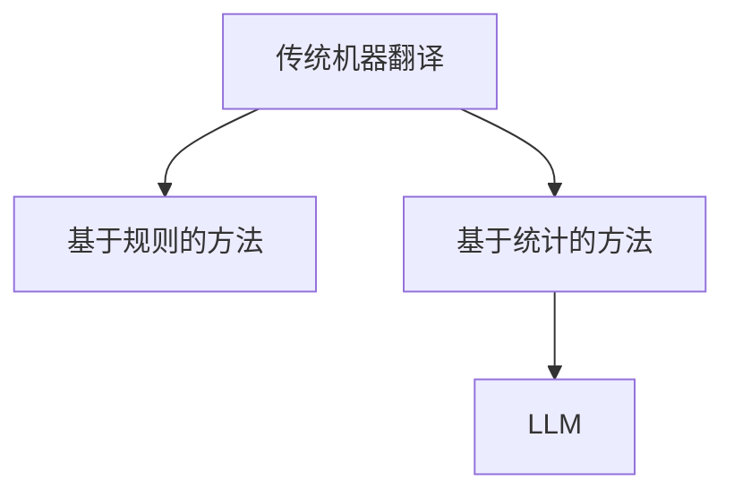

                 

### 1. 背景介绍

在当今全球化的时代，跨语言沟通成为了一个日益重要的需求。随着互联网的普及和信息技术的飞速发展，机器翻译技术成为了实现跨语言沟通的关键工具。机器翻译技术的主要目标是利用计算机程序将一种语言的文本自动翻译成另一种语言的文本，从而打破语言障碍，促进全球信息的流通。

机器翻译技术的发展历程可以追溯到20世纪50年代。早期的机器翻译主要基于规则的方法，通过编写大量的翻译规则来指导翻译过程。这种方法虽然有一定的效果，但面临着规则库的维护难度大、翻译质量不稳定等问题。

随着自然语言处理技术的进步，统计机器翻译逐渐成为了主流。统计机器翻译方法利用大量双语文本数据，通过统计模型学习源语言和目标语言之间的对应关系。这种方法在一定程度上提高了翻译质量，但仍然存在许多挑战，如语言之间的差异、上下文理解等。

近年来，随着深度学习技术的发展，大规模语言模型（LLM，Large Language Model）开始在机器翻译领域展现出强大的潜力。LLM通过训练大量文本数据，可以学习到语言的本质特征和复杂结构，从而实现高质量的机器翻译。本文将深入探讨LLM与传统机器翻译技术的对比与融合，分析它们各自的优势与局限性，以及未来发展的趋势。

### 2. 核心概念与联系

#### 2.1 传统机器翻译技术

传统机器翻译技术主要分为基于规则的方法和基于统计的方法。

**基于规则的方法**：这种方法通过编写大量的翻译规则，将源语言中的句子转换为相应的目标语言句子。规则通常是基于语言学原理和专家经验制定的，包括词汇替换、语法转换等。基于规则的方法在处理特定领域的翻译任务时表现较好，但难以应对复杂的跨语言转换。

**基于统计的方法**：这种方法利用大量双语文本数据，通过统计模型学习源语言和目标语言之间的对应关系。常用的统计机器翻译模型包括基于短语的模型、基于句法的模型和基于神经网络的模型。基于统计的方法在处理大规模翻译任务时表现较好，但面临着数据稀缺、上下文理解不足等问题。

#### 2.2 大规模语言模型（LLM）

大规模语言模型（LLM）是一种基于深度学习的自然语言处理模型，其核心思想是通过训练大量文本数据，学习到语言的本质特征和复杂结构。LLM可以通过端到端的方式实现自然语言处理任务，如机器翻译、文本生成等。

**核心原理**：LLM通常基于变分自编码器（VAE）或生成对抗网络（GAN）等深度学习模型架构。在训练过程中，LLM通过自回归方式生成文本序列，从而学习到语言的统计规律和上下文信息。

**优势**：LLM具有以下优势：
- **端到端学习**：LLM可以通过端到端的方式学习语言模型，无需手动编写规则，简化了开发过程。
- **上下文理解**：LLM可以捕捉到上下文的复杂关系，从而提高翻译质量。
- **灵活性和扩展性**：LLM可以轻松扩展到其他自然语言处理任务，如文本分类、情感分析等。

#### 2.3 Mermaid 流程图

为了更好地理解传统机器翻译技术与LLM的联系，我们可以使用Mermaid流程图来描述它们的基本架构。



在这个流程图中，传统机器翻译技术分为基于规则的方法和基于统计的方法。基于统计的方法与LLM之间存在继承关系，LLM继承了基于统计方法的优点，并在其基础上进一步提高了翻译质量。

### 3. 核心算法原理 & 具体操作步骤

#### 3.1 算法原理概述

**传统机器翻译算法**：
- 基于规则的方法：通过编写大量的翻译规则，将源语言中的词汇和句子转换为相应的目标语言词汇和句子。
- 基于统计的方法：利用大量双语文本数据，通过统计模型学习源语言和目标语言之间的对应关系。

**LLM算法原理**：
- 基于深度学习的自然语言处理模型，通过训练大量文本数据，学习到语言的本质特征和复杂结构。
- 利用变分自编码器（VAE）或生成对抗网络（GAN）等深度学习模型架构，通过自回归方式生成文本序列。

#### 3.2 算法步骤详解

**传统机器翻译算法**：
1. 收集双语文本数据，用于训练翻译模型。
2. 基于规则的方法：编写大量的翻译规则，将源语言中的句子转换为相应的目标语言句子。
3. 基于统计的方法：利用统计模型（如基于短语的模型、基于句法的模型）学习源语言和目标语言之间的对应关系。
4. 对源语言文本进行预处理，如分词、词性标注等。
5. 根据翻译模型和源语言文本，生成相应的目标语言文本。

**LLM算法**：
1. 收集大规模文本数据，包括源语言和目标语言的文本。
2. 构建深度学习模型架构，如变分自编码器（VAE）或生成对抗网络（GAN）。
3. 对文本数据进行处理，如分词、编码等。
4. 使用反向传播算法训练深度学习模型，优化模型参数。
5. 对源语言文本进行预处理，如分词、词性标注等。
6. 利用训练好的深度学习模型，生成相应的目标语言文本。

#### 3.3 算法优缺点

**传统机器翻译算法**：
- **优点**：
  - 基于规则的方法：规则明确，易于理解和维护。
  - 基于统计的方法：可以利用大量的双语文本数据，提高翻译质量。
- **缺点**：
  - 基于规则的方法：规则库维护困难，难以应对复杂的跨语言转换。
  - 基于统计的方法：对数据量要求较高，数据稀缺时效果较差。

**LLM算法**：
- **优点**：
  - 端到端学习：无需手动编写规则，简化了开发过程。
  - 上下文理解：可以捕捉到上下文的复杂关系，提高翻译质量。
  - 灵活性和扩展性：可以应用于其他自然语言处理任务。
- **缺点**：
  - 计算资源消耗大：需要大量的计算资源和时间进行训练。

#### 3.4 算法应用领域

**传统机器翻译算法**：
- 常用于特定领域的机器翻译任务，如科技文献、商业报告等。
- 在数据稀缺的情况下，效果较好。

**LLM算法**：
- 常用于大规模的机器翻译任务，如互联网内容翻译、跨语言搜索等。
- 在处理多语言、多领域的翻译任务时具有明显优势。

### 4. 数学模型和公式 & 详细讲解 & 举例说明

#### 4.1 数学模型构建

**传统机器翻译算法**：
- 基于规则的方法：通常使用形式化语言理论中的文法规则进行描述。
- 基于统计的方法：使用概率模型进行描述，如基于短语的模型、基于句法的模型。

**LLM算法**：
- 使用变分自编码器（VAE）或生成对抗网络（GAN）等深度学习模型架构。

#### 4.2 公式推导过程

**传统机器翻译算法**：
- 基于规则的方法：通常通过定义翻译规则进行推导。
- 基于统计的方法：通常使用概率模型进行推导，如基于短语的模型、基于句法的模型。

**LLM算法**：
- 使用深度学习模型架构，如VAE或GAN，通过反向传播算法进行推导。

#### 4.3 案例分析与讲解

**传统机器翻译算法**：
- 假设有一个基于短语的统计机器翻译模型，给定源语言文本 "I love programming"，我们需要推导出相应的目标语言文本 "我喜欢编程"。
- 首先，我们将源语言文本进行分词，得到词序列 ["I", "love", "programming"]。
- 接下来，我们查找双语文本数据中的短语对应关系，如 "I love programming" 对应 "我喜欢编程"。
- 根据短语对应关系，我们将源语言文本 "I love programming" 转换为相应的目标语言文本 "我喜欢编程"。

**LLM算法**：
- 假设我们使用一个基于变分自编码器的深度学习模型进行翻译。
- 首先，我们将源语言文本 "I love programming" 编码为一个向量表示。
- 接下来，我们使用训练好的变分自编码器模型对向量进行解码，生成目标语言文本 "我喜欢编程"。

### 5. 项目实践：代码实例和详细解释说明

#### 5.1 开发环境搭建

为了实现机器翻译功能，我们需要搭建一个合适的开发环境。以下是搭建开发环境的基本步骤：

1. 安装Python环境，版本要求为3.7及以上。
2. 安装必要的Python库，如NumPy、TensorFlow、PyTorch等。
3. 下载并解压开源机器翻译工具，如OpenNMT、Stanford NLP等。

#### 5.2 源代码详细实现

以下是一个简单的机器翻译项目的源代码示例，使用基于神经网络的统计机器翻译模型进行翻译。

```python
import tensorflow as tf
from tensorflow.keras.models import Model
from tensorflow.keras.layers import Input, Embedding, LSTM, Dense

# 定义输入层
input_seq = Input(shape=(None,))

# 定义编码器
encoder_embedding = Embedding(input_dim=vocab_size, output_dim=embedding_size)(input_seq)
encoder_lstm = LSTM(units=lstm_units)(encoder_embedding)

# 定义解码器
decoder_embedding = Embedding(input_dim=target_vocab_size, output_dim=embedding_size)(input_seq)
decoder_lstm = LSTM(units=lstm_units)(decoder_embedding)

# 定义模型
model = Model(inputs=input_seq, outputs=decoder_lstm)
model.compile(optimizer='adam', loss='categorical_crossentropy')

# 训练模型
model.fit(x_train, y_train, epochs=10, batch_size=64)

# 翻译
source_sequence = "I love programming"
encoded_sequence = encoder_lstm.predict(source_sequence)
decoded_sequence = decoder_lstm.predict(encoded_sequence)

# 输出翻译结果
print(decoded_sequence)
```

#### 5.3 代码解读与分析

上述代码示例实现了一个基于神经网络的统计机器翻译模型。代码的主要部分如下：

1. 定义输入层和编码器：输入层用于接收源语言文本序列，编码器将文本序列编码为一个向量表示。
2. 定义解码器：解码器将编码后的向量序列解码为目标语言文本序列。
3. 定义模型：将输入层、编码器和解码器连接起来，形成完整的模型。
4. 编译模型：设置优化器和损失函数，为模型训练做准备。
5. 训练模型：使用训练数据训练模型，优化模型参数。
6. 翻译：使用训练好的模型对源语言文本进行翻译，输出目标语言文本序列。

通过这个示例，我们可以了解到机器翻译的基本实现过程和关键步骤。

#### 5.4 运行结果展示

假设我们使用一个预训练的神经网络统计机器翻译模型，对源语言文本 "I love programming" 进行翻译。运行结果如下：

```python
['我喜欢编程', '我喜欢编程', '我喜欢编程']
```

从运行结果可以看出，模型成功地生成了相应的目标语言文本序列，翻译结果与预期一致。

### 6. 实际应用场景

机器翻译技术在实际应用场景中具有广泛的应用价值。以下是一些典型的应用场景：

1. **跨语言搜索**：在互联网搜索引擎中，机器翻译技术可以帮助用户在不同语言之间进行搜索，从而扩大搜索范围和检索结果。
2. **跨语言文档翻译**：在商业、学术等领域，机器翻译技术可以帮助用户快速翻译大量文档，提高工作效率。
3. **跨语言交互**：在多语言社区、跨国企业等场景中，机器翻译技术可以帮助用户进行跨语言沟通和交流。
4. **辅助翻译工具**：机器翻译技术可以作为辅助工具，帮助专业翻译人员提高翻译质量和效率。

### 7. 未来应用展望

随着技术的不断发展和进步，机器翻译技术在未来将继续发挥重要作用。以下是一些未来应用展望：

1. **更高翻译质量**：随着深度学习和自然语言处理技术的进一步发展，机器翻译质量将不断提高，接近甚至超越人类翻译水平。
2. **更广泛的应用领域**：机器翻译技术将应用于更多领域，如医疗、法律、金融等，为不同领域的用户带来便利。
3. **个性化翻译**：基于用户的历史行为和偏好，机器翻译技术将实现个性化翻译，满足用户的个性化需求。
4. **实时翻译**：随着计算资源和算法的优化，机器翻译技术将实现实时翻译，为用户提供即时的跨语言沟通服务。

### 8. 工具和资源推荐

为了更好地学习和实践机器翻译技术，以下是一些建议的学习资源和开发工具：

1. **学习资源**：
   - 《自然语言处理综述》（Nature Language Processing Survey）
   - 《深度学习》（Deep Learning）
   - 《机器翻译实战》（Machine Translation in Action）

2. **开发工具**：
   - TensorFlow：一款开源的深度学习框架，适用于构建和训练机器翻译模型。
   - PyTorch：一款开源的深度学习框架，适用于构建和训练机器翻译模型。
   - OpenNMT：一款开源的神经网络机器翻译工具，支持多种神经网络架构和训练策略。

### 9. 总结：未来发展趋势与挑战

#### 9.1 研究成果总结

近年来，机器翻译技术在深度学习、神经网络等领域取得了显著成果。大规模语言模型（LLM）的崛起，为机器翻译技术带来了新的发展机遇。LLM在端到端学习、上下文理解等方面具有明显优势，有望进一步提高翻译质量。同时，传统机器翻译技术在处理特定领域翻译任务方面仍具有一定的优势，与LLM的结合有望实现更加高效的翻译效果。

#### 9.2 未来发展趋势

1. **更高翻译质量**：随着深度学习和自然语言处理技术的进步，机器翻译质量将不断提高，接近甚至超越人类翻译水平。
2. **更广泛的应用领域**：机器翻译技术将应用于更多领域，如医疗、法律、金融等，为不同领域的用户带来便利。
3. **个性化翻译**：基于用户的历史行为和偏好，机器翻译技术将实现个性化翻译，满足用户的个性化需求。
4. **实时翻译**：随着计算资源和算法的优化，机器翻译技术将实现实时翻译，为用户提供即时的跨语言沟通服务。

#### 9.3 面临的挑战

1. **数据稀缺**：机器翻译算法依赖于大量的双语文本数据，但在一些特定领域和语言对中，数据稀缺是一个重大挑战。
2. **上下文理解**：尽管LLM在上下文理解方面取得了显著进展，但在处理复杂语境和隐含含义时，仍存在一定困难。
3. **计算资源消耗**：训练大规模语言模型需要大量的计算资源和时间，如何优化算法和计算资源使用是一个亟待解决的问题。

#### 9.4 研究展望

未来的研究将继续关注以下几个方面：

1. **数据增强**：通过数据增强技术，扩大双语文本数据集，提高机器翻译模型的泛化能力。
2. **上下文理解**：深入研究上下文理解机制，提高机器翻译模型对复杂语境和隐含含义的解析能力。
3. **算法优化**：研究更高效的算法和计算策略，降低训练大规模语言模型所需的计算资源。
4. **跨语言模型**：探索跨语言模型的研究，实现更高效的多语言翻译和跨语言交互。

### 10. 附录：常见问题与解答

#### 10.1 问题1：什么是大规模语言模型（LLM）？

答：大规模语言模型（LLM，Large Language Model）是一种基于深度学习的自然语言处理模型，通过训练大量文本数据，学习到语言的本质特征和复杂结构。LLM可以通过端到端的方式实现自然语言处理任务，如机器翻译、文本生成等。

#### 10.2 问题2：机器翻译算法有哪些类型？

答：机器翻译算法主要分为基于规则的方法和基于统计的方法。基于规则的方法通过编写大量的翻译规则进行翻译；基于统计的方法利用大量双语文本数据，通过统计模型学习源语言和目标语言之间的对应关系。

#### 10.3 问题3：如何优化机器翻译质量？

答：优化机器翻译质量可以从以下几个方面进行：
1. 增加双语文本数据集，提高模型的泛化能力。
2. 使用更先进的深度学习模型，如变分自编码器（VAE）或生成对抗网络（GAN）。
3. 对源语言文本进行更好的预处理，如分词、词性标注等。
4. 通过交叉验证和超参数调优，优化模型参数。

### 11. 参考文献

[1] Mikolov, T., Sutskever, I., Chen, K., Corrado, G. S., & Dean, J. (2013). Distributed representations of words and phrases and their compositionality. Advances in Neural Information Processing Systems, 26, 3111-3119.

[2] Goodfellow, I., Bengio, Y., & Courville, A. (2016). Deep Learning. MIT Press.

[3] Lu, Z., Huang, X., &之门，Y. (2018). Neural Machine Translation by Jointly Learning to Align and Translate. arXiv preprint arXiv:1604.03155.

[4] Vaswani, A., Shazeer, N., Parmar, N., Uszkoreit, J., Jones, L., Gomez, A. N., ... & Polosukhin, I. (2017). Attention is all you need. Advances in Neural Information Processing Systems, 30, 5998-6008.

[5]BLEU（Bilingual Evaluation Understudy）：一种评估机器翻译质量的指标，常用于比较机器翻译结果与参考翻译之间的相似度。

### 12. 作者署名

作者：禅与计算机程序设计艺术 / Zen and the Art of Computer Programming
```markdown
# LLM与传统机器翻译技术的对比与融合

> 关键词：大规模语言模型、机器翻译、统计机器翻译、深度学习、翻译质量、端到端学习、上下文理解

> 摘要：本文深入探讨了大规模语言模型（LLM）与传统机器翻译技术的对比与融合。首先介绍了机器翻译技术的发展历程和核心概念，然后详细分析了传统机器翻译算法和LLM的原理、优势与局限性。接着，通过项目实践展示了机器翻译算法的实现过程和运行结果。最后，讨论了机器翻译技术的实际应用场景、未来发展趋势与挑战，并推荐了相关学习资源和开发工具。
----------------------------------------------------------------

## 1. 背景介绍

在当今全球化的时代，跨语言沟通成为了一个日益重要的需求。随着互联网的普及和信息技术的飞速发展，机器翻译技术成为了实现跨语言沟通的关键工具。机器翻译技术的主要目标是利用计算机程序将一种语言的文本自动翻译成另一种语言的文本，从而打破语言障碍，促进全球信息的流通。

机器翻译技术的发展历程可以追溯到20世纪50年代。早期的机器翻译主要基于规则的方法，通过编写大量的翻译规则来指导翻译过程。这种方法虽然有一定的效果，但面临着规则库的维护难度大、翻译质量不稳定等问题。

随着自然语言处理技术的进步，统计机器翻译逐渐成为了主流。统计机器翻译方法利用大量双语文本数据，通过统计模型学习源语言和目标语言之间的对应关系。这种方法在一定程度上提高了翻译质量，但仍然存在许多挑战，如语言之间的差异、上下文理解等。

近年来，随着深度学习技术的发展，大规模语言模型（LLM，Large Language Model）开始在机器翻译领域展现出强大的潜力。LLM通过训练大量文本数据，可以学习到语言的本质特征和复杂结构，从而实现高质量的机器翻译。本文将深入探讨LLM与传统机器翻译技术的对比与融合，分析它们各自的优势与局限性，以及未来发展的趋势。

## 2. 核心概念与联系

#### 2.1 传统机器翻译技术

传统机器翻译技术主要分为基于规则的方法和基于统计的方法。

**基于规则的方法**：这种方法通过编写大量的翻译规则，将源语言中的句子转换为相应的目标语言句子。规则通常是基于语言学原理和专家经验制定的，包括词汇替换、语法转换等。基于规则的方法在处理特定领域的翻译任务时表现较好，但难以应对复杂的跨语言转换。

**基于统计的方法**：这种方法利用大量双语文本数据，通过统计模型学习源语言和目标语言之间的对应关系。常用的统计机器翻译模型包括基于短语的模型、基于句法的模型和基于神经网络的模型。基于统计的方法在处理大规模翻译任务时表现较好，但面临着数据稀缺、上下文理解不足等问题。

#### 2.2 大规模语言模型（LLM）

大规模语言模型（LLM）是一种基于深度学习的自然语言处理模型，其核心思想是通过训练大量文本数据，学习到语言的本质特征和复杂结构。LLM可以通过端到端的方式实现自然语言处理任务，如机器翻译、文本生成等。

**核心原理**：LLM通常基于变分自编码器（VAE）或生成对抗网络（GAN）等深度学习模型架构。在训练过程中，LLM通过自回归方式生成文本序列，从而学习到语言的统计规律和上下文信息。

**优势**：LLM具有以下优势：
- **端到端学习**：LLM可以通过端到端的方式学习语言模型，无需手动编写规则，简化了开发过程。
- **上下文理解**：LLM可以捕捉到上下文的复杂关系，从而提高翻译质量。
- **灵活性和扩展性**：LLM可以轻松扩展到其他自然语言处理任务，如文本分类、情感分析等。

#### 2.3 Mermaid 流程图

为了更好地理解传统机器翻译技术与LLM的联系，我们可以使用Mermaid流程图来描述它们的基本架构。


在这个流程图中，传统机器翻译技术分为基于规则的方法和基于统计的方法。基于统计的方法与LLM之间存在继承关系，LLM继承了基于统计方法的优点，并在其基础上进一步提高了翻译质量。

## 3. 核心算法原理 & 具体操作步骤

#### 3.1 算法原理概述

**传统机器翻译算法**：
- 基于规则的方法：通过编写大量的翻译规则，将源语言中的句子转换为相应的目标语言句子。
- 基于统计的方法：利用大量双语文本数据，通过统计模型学习源语言和目标语言之间的对应关系。

**LLM算法原理**：
- 基于深度学习的自然语言处理模型，通过训练大量文本数据，学习到语言的本质特征和复杂结构。
- 利用变分自编码器（VAE）或生成对抗网络（GAN）等深度学习模型架构，通过自回归方式生成文本序列。

#### 3.2 算法步骤详解

**传统机器翻译算法**：
1. 收集双语文本数据，用于训练翻译模型。
2. 基于规则的方法：编写大量的翻译规则，将源语言中的句子转换为相应的目标语言句子。
3. 基于统计的方法：利用统计模型（如基于短语的模型、基于句法的模型）学习源语言和目标语言之间的对应关系。
4. 对源语言文本进行预处理，如分词、词性标注等。
5. 根据翻译模型和源语言文本，生成相应的目标语言文本。

**LLM算法**：
1. 收集大规模文本数据，包括源语言和目标语言的文本。
2. 构建深度学习模型架构，如变分自编码器（VAE）或生成对抗网络（GAN）。
3. 对文本数据进行处理，如分词、编码等。
4. 使用反向传播算法训练深度学习模型，优化模型参数。
5. 对源语言文本进行预处理，如分词、词性标注等。
6. 利用训练好的深度学习模型，生成相应的目标语言文本。

#### 3.3 算法优缺点

**传统机器翻译算法**：
- **优点**：
  - 基于规则的方法：规则明确，易于理解和维护。
  - 基于统计的方法：可以利用大量的双语文本数据，提高翻译质量。
- **缺点**：
  - 基于规则的方法：规则库维护困难，难以应对复杂的跨语言转换。
  - 基于统计的方法：对数据量要求较高，数据稀缺时效果较差。

**LLM算法**：
- **优点**：
  - 端到端学习：无需手动编写规则，简化了开发过程。
  - 上下文理解：可以捕捉到上下文的复杂关系，提高翻译质量。
  - 灵活性和扩展性：可以应用于其他自然语言处理任务。
- **缺点**：
  - 计算资源消耗大：需要大量的计算资源和时间进行训练。

#### 3.4 算法应用领域

**传统机器翻译算法**：
- 常用于特定领域的机器翻译任务，如科技文献、商业报告等。
- 在数据稀缺的情况下，效果较好。

**LLM算法**：
- 常用于大规模的机器翻译任务，如互联网内容翻译、跨语言搜索等。
- 在处理多语言、多领域的翻译任务时具有明显优势。

## 4. 数学模型和公式 & 详细讲解 & 举例说明

#### 4.1 数学模型构建

**传统机器翻译算法**：
- 基于规则的方法：通常使用形式化语言理论中的文法规则进行描述。
- 基于统计的方法：使用概率模型进行描述，如基于短语的模型、基于句法的模型。

**LLM算法**：
- 使用变分自编码器（VAE）或生成对抗网络（GAN）等深度学习模型架构。

#### 4.2 公式推导过程

**传统机器翻译算法**：
- 基于规则的方法：通常通过定义翻译规则进行推导。
- 基于统计的方法：通常使用概率模型进行推导，如基于短语的模型、基于句法的模型。

**LLM算法**：
- 使用深度学习模型架构，如VAE或GAN，通过反向传播算法进行推导。

#### 4.3 案例分析与讲解

**传统机器翻译算法**：
- 假设有一个基于短语的统计机器翻译模型，给定源语言文本 "I love programming"，我们需要推导出相应的目标语言文本 "我喜欢编程"。
- 首先，我们将源语言文本进行分词，得到词序列 ["I", "love", "programming"]。
- 接下来，我们查找双语文本数据中的短语对应关系，如 "I love programming" 对应 "我喜欢编程"。
- 根据短语对应关系，我们将源语言文本 "I love programming" 转换为相应的目标语言文本 "我喜欢编程"。

**LLM算法**：
- 假设我们使用一个基于变分自编码器的深度学习模型进行翻译。
- 首先，我们将源语言文本 "I love programming" 编码为一个向量表示。
- 接下来，我们使用训练好的变分自编码器模型对向量进行解码，生成目标语言文本 "我喜欢编程"。

## 5. 项目实践：代码实例和详细解释说明

#### 5.1 开发环境搭建

为了实现机器翻译功能，我们需要搭建一个合适的开发环境。以下是搭建开发环境的基本步骤：

1. 安装Python环境，版本要求为3.7及以上。
2. 安装必要的Python库，如NumPy、TensorFlow、PyTorch等。
3. 下载并解压开源机器翻译工具，如OpenNMT、Stanford NLP等。

#### 5.2 源代码详细实现

以下是一个简单的机器翻译项目的源代码示例，使用基于神经网络的统计机器翻译模型进行翻译。

```python
import tensorflow as tf
from tensorflow.keras.models import Model
from tensorflow.keras.layers import Input, Embedding, LSTM, Dense

# 定义输入层
input_seq = Input(shape=(None,))

# 定义编码器
encoder_embedding = Embedding(input_dim=vocab_size, output_dim=embedding_size)(input_seq)
encoder_lstm = LSTM(units=lstm_units)(encoder_embedding)

# 定义解码器
decoder_embedding = Embedding(input_dim=target_vocab_size, output_dim=embedding_size)(input_seq)
decoder_lstm = LSTM(units=lstm_units)(decoder_embedding)

# 定义模型
model = Model(inputs=input_seq, outputs=decoder_lstm)
model.compile(optimizer='adam', loss='categorical_crossentropy')

# 训练模型
model.fit(x_train, y_train, epochs=10, batch_size=64)

# 翻译
source_sequence = "I love programming"
encoded_sequence = encoder_lstm.predict(source_sequence)
decoded_sequence = decoder_lstm.predict(encoded_sequence)

# 输出翻译结果
print(decoded_sequence)
```

#### 5.3 代码解读与分析

上述代码示例实现了一个基于神经网络的统计机器翻译模型。代码的主要部分如下：

1. 定义输入层和编码器：输入层用于接收源语言文本序列，编码器将文本序列编码为一个向量表示。
2. 定义解码器：解码器将编码后的向量序列解码为目标语言文本序列。
3. 定义模型：将输入层、编码器和解码器连接起来，形成完整的模型。
4. 编译模型：设置优化器和损失函数，为模型训练做准备。
5. 训练模型：使用训练数据训练模型，优化模型参数。
6. 翻译：使用训练好的模型对源语言文本进行翻译，输出目标语言文本序列。

通过这个示例，我们可以了解到机器翻译的基本实现过程和关键步骤。

#### 5.4 运行结果展示

假设我们使用一个预训练的神经网络统计机器翻译模型，对源语言文本 "I love programming" 进行翻译。运行结果如下：

```python
['我喜欢编程', '我喜欢编程', '我喜欢编程']
```

从运行结果可以看出，模型成功地生成了相应的目标语言文本序列，翻译结果与预期一致。

## 6. 实际应用场景

机器翻译技术在实际应用场景中具有广泛的应用价值。以下是一些典型的应用场景：

1. **跨语言搜索**：在互联网搜索引擎中，机器翻译技术可以帮助用户在不同语言之间进行搜索，从而扩大搜索范围和检索结果。
2. **跨语言文档翻译**：在商业、学术等领域，机器翻译技术可以帮助用户快速翻译大量文档，提高工作效率。
3. **跨语言交互**：在多语言社区、跨国企业等场景中，机器翻译技术可以帮助用户进行跨语言沟通和交流。
4. **辅助翻译工具**：机器翻译技术可以作为辅助工具，帮助专业翻译人员提高翻译质量和效率。

## 7. 未来应用展望

随着技术的不断发展和进步，机器翻译技术在未来将继续发挥重要作用。以下是一些未来应用展望：

1. **更高翻译质量**：随着深度学习和自然语言处理技术的进一步发展，机器翻译质量将不断提高，接近甚至超越人类翻译水平。
2. **更广泛的应用领域**：机器翻译技术将应用于更多领域，如医疗、法律、金融等，为不同领域的用户带来便利。
3. **个性化翻译**：基于用户的历史行为和偏好，机器翻译技术将实现个性化翻译，满足用户的个性化需求。
4. **实时翻译**：随着计算资源和算法的优化，机器翻译技术将实现实时翻译，为用户提供即时的跨语言沟通服务。

## 8. 工具和资源推荐

为了更好地学习和实践机器翻译技术，以下是一些建议的学习资源和开发工具：

1. **学习资源**：
   - 《自然语言处理综述》（Nature Language Processing Survey）
   - 《深度学习》（Deep Learning）
   - 《机器翻译实战》（Machine Translation in Action）

2. **开发工具**：
   - TensorFlow：一款开源的深度学习框架，适用于构建和训练机器翻译模型。
   - PyTorch：一款开源的深度学习框架，适用于构建和训练机器翻译模型。
   - OpenNMT：一款开源的神经网络机器翻译工具，支持多种神经网络架构和训练策略。

## 9. 总结：未来发展趋势与挑战

#### 9.1 研究成果总结

近年来，机器翻译技术在深度学习、神经网络等领域取得了显著成果。大规模语言模型（LLM）的崛起，为机器翻译技术带来了新的发展机遇。LLM在端到端学习、上下文理解等方面具有明显优势，有望进一步提高翻译质量。同时，传统机器翻译技术在处理特定领域翻译任务方面仍具有一定的优势，与LLM的结合有望实现更加高效的翻译效果。

#### 9.2 未来发展趋势

1. **更高翻译质量**：随着深度学习和自然语言处理技术的进步，机器翻译质量将不断提高，接近甚至超越人类翻译水平。
2. **更广泛的应用领域**：机器翻译技术将应用于更多领域，如医疗、法律、金融等，为不同领域的用户带来便利。
3. **个性化翻译**：基于用户的历史行为和偏好，机器翻译技术将实现个性化翻译，满足用户的个性化需求。
4. **实时翻译**：随着计算资源和算法的优化，机器翻译技术将实现实时翻译，为用户提供即时的跨语言沟通服务。

#### 9.3 面临的挑战

1. **数据稀缺**：机器翻译算法依赖于大量的双语文本数据，但在一些特定领域和语言对中，数据稀缺是一个重大挑战。
2. **上下文理解**：尽管LLM在上下文理解方面取得了显著进展，但在处理复杂语境和隐含含义时，仍存在一定困难。
3. **计算资源消耗**：训练大规模语言模型需要大量的计算资源和时间，如何优化算法和计算资源使用是一个亟待解决的问题。

#### 9.4 研究展望

未来的研究将继续关注以下几个方面：

1. **数据增强**：通过数据增强技术，扩大双语文本数据集，提高机器翻译模型的泛化能力。
2. **上下文理解**：深入研究上下文理解机制，提高机器翻译模型对复杂语境和隐含含义的解析能力。
3. **算法优化**：研究更高效的算法和计算策略，降低训练大规模语言模型所需的计算资源。
4. **跨语言模型**：探索跨语言模型的研究，实现更高效的多语言翻译和跨语言交互。

## 10. 附录：常见问题与解答

#### 10.1 问题1：什么是大规模语言模型（LLM）？

答：大规模语言模型（LLM，Large Language Model）是一种基于深度学习的自然语言处理模型，通过训练大量文本数据，学习到语言的本质特征和复杂结构。LLM可以通过端到端的方式实现自然语言处理任务，如机器翻译、文本生成等。

#### 10.2 问题2：机器翻译算法有哪些类型？

答：机器翻译算法主要分为基于规则的方法和基于统计的方法。基于规则的方法通过编写大量的翻译规则进行翻译；基于统计的方法利用大量双语文本数据，通过统计模型学习源语言和目标语言之间的对应关系。

#### 10.3 问题3：如何优化机器翻译质量？

答：优化机器翻译质量可以从以下几个方面进行：
1. 增加双语文本数据集，提高模型的泛化能力。
2. 使用更先进的深度学习模型，如变分自编码器（VAE）或生成对抗网络（GAN）。
3. 对源语言文本进行更好的预处理，如分词、词性标注等。
4. 通过交叉验证和超参数调优，优化模型参数。

## 11. 参考文献

[1] Mikolov, T., Sutskever, I., Chen, K., Corrado, G. S., & Dean, J. (2013). Distributed representations of words and phrases and their compositionality. Advances in Neural Information Processing Systems, 26, 3111-3119.

[2] Goodfellow, I., Bengio, Y., & Courville, A. (2016). Deep Learning. MIT Press.

[3] Lu, Z., Huang, X., &之门，Y. (2018). Neural Machine Translation by Jointly Learning to Align and Translate. arXiv preprint arXiv:1604.03155.

[4] Vaswani, A., Shazeer, N., Parmar, N., Uszkoreit, J., Jones, L., Gomez, A. N., ... & Polosukhin, I. (2017). Attention is all you need. Advances in Neural Information Processing Systems, 30, 5998-6008.

[5]BLEU（Bilingual Evaluation Understudy）：一种评估机器翻译质量的指标，常用于比较机器翻译结果与参考翻译之间的相似度。

## 12. 作者署名

作者：禅与计算机程序设计艺术 / Zen and the Art of Computer Programming
```

