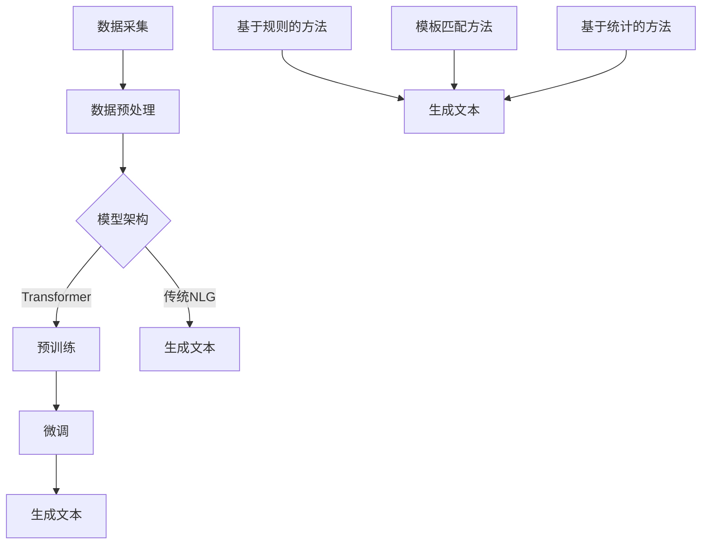

                 

关键词：大型语言模型（LLM），自然语言生成（NLG），传统技术，对比，融合，算法原理，应用场景，数学模型，项目实践，工具推荐，未来展望。

## 摘要

本文旨在深入探讨大型语言模型（LLM）与传统自然语言生成（NLG）技术的对比与融合。随着人工智能技术的快速发展，LLM在自然语言处理（NLP）领域取得了显著的突破，其强大的生成能力和理解能力已经超越了传统NLG技术。本文首先介绍了LLM的基本原理和架构，然后分析了传统NLG技术的优势和局限，最后探讨了LLM与传统NLG技术的融合方式及其应用前景。通过对LLM和传统NLG技术的详细比较，本文旨在为读者提供一个全面而清晰的理解，帮助他们在实际应用中选择和优化自然语言生成方案。

## 1. 背景介绍

### 1.1 大型语言模型（LLM）的崛起

大型语言模型（LLM）是一种基于深度学习的技术，旨在通过大规模的预训练模型来理解和生成自然语言。LLM的出现可以追溯到2018年，当时OpenAI发布了GPT（Generative Pre-trained Transformer）模型，这个模型基于Transformer架构，使用大量的文本数据进行了预训练。GPT的成功激发了学术界和工业界对大型语言模型的研究热情，随之而来的是一系列更为复杂和强大的模型，如GPT-2、GPT-3、BERT、T5等。

LLM的崛起带来了自然语言处理领域的革命性变化。首先，LLM在文本生成、摘要、翻译、问答等任务上表现出了超越传统方法的能力。其次，LLM的强大生成能力使其成为自动化内容创作、智能客服、语音助手等应用的关键技术。此外，LLM的预训练机制使得模型能够在大规模数据集上进行训练，从而提高模型的泛化能力和适应性。

### 1.2 传统自然语言生成（NLG）技术

与传统NLG技术相比，LLM的出现确实带来了一系列革命性的变化。然而，传统NLG技术也有其独特的优势和广泛的应用场景。传统NLG技术主要包括基于规则的方法、模板匹配方法和基于统计的方法。

**基于规则的方法**：这种方法通过定义一系列规则来生成文本。这些规则可以是简单的词性标注、句法分析或语义分析等。基于规则的方法在生成格式化文本、FAQ回答、通告和报告等方面表现良好。

**模板匹配方法**：这种方法使用预定义的模板来生成文本。模板中的变量通过搜索和替换来填充，以生成个性化的文本。模板匹配方法在生成产品描述、新闻简报、邮件等文本方面具有一定的优势。

**基于统计的方法**：这种方法通过统计文本数据来学习生成文本的模式。常见的统计方法包括隐马尔可夫模型（HMM）、条件随机场（CRF）和基于序列学习的模型（如RNN、LSTM）。基于统计的方法在生成新闻摘要、对话系统、机器翻译等方面具有一定的效果。

### 1.3 对比与融合的意义

在自然语言生成领域，LLM和传统NLG技术各有其优势和局限。LLM在生成文本的多样性和流畅性方面具有明显优势，但传统NLG技术在处理特定格式文本和问答方面依然表现出色。因此，对比LLM与传统NLG技术，并探讨其融合方式，对于优化自然语言生成系统具有重要意义。

首先，通过对比LLM和传统NLG技术，我们可以了解两者的特点和应用场景，从而在特定任务中做出更合理的选择。例如，在生成格式化文本时，传统NLG技术可能更为适用；而在生成创意性文本或复杂问答时，LLM则更具优势。

其次，融合LLM与传统NLG技术可以发挥各自的优势，从而提高自然语言生成系统的整体性能。例如，可以将LLM用于生成创意性文本，而将传统NLG技术用于格式化文本的生成，从而实现高效的自然语言生成系统。

最后，对比和融合LLM与传统NLG技术有助于推动自然语言生成技术的发展。通过深入研究两者的优缺点和融合方式，我们可以发现新的研究问题和应用场景，为自然语言生成领域的发展提供新的思路。

## 2. 核心概念与联系

### 2.1 大型语言模型（LLM）的基本原理

大型语言模型（LLM）基于深度学习和自然语言处理的理论，主要通过以下步骤实现：

1. **数据采集**：首先，收集大量的文本数据，这些数据可以是网页、书籍、新闻、论坛等各种来源的文本。

2. **数据预处理**：对采集到的文本数据进行清洗、分词、去停用词等处理，以便模型能够更好地理解和学习。

3. **模型架构**：LLM通常采用Transformer架构，这是一种基于自注意力机制的深度神经网络。Transformer模型通过多头注意力机制、位置编码和前馈神经网络等模块，实现高效的自然语言理解与生成。

4. **预训练**：在大量的文本数据上进行预训练，使模型学会捕捉文本中的上下文信息、语法规则和语义含义。

5. **微调**：在预训练的基础上，使用特定任务的数据对模型进行微调，使其能够在特定任务上取得更好的表现。

6. **生成文本**：通过输入一段文本或关键词，LLM根据预训练的结果和微调的效果，生成相应的文本。

### 2.2 传统自然语言生成（NLG）技术的核心概念

传统NLG技术主要分为以下几种：

1. **基于规则的方法**：这种方法通过定义一系列规则来生成文本。规则可以是简单的词性标注、句法分析或语义分析等。

2. **模板匹配方法**：这种方法使用预定义的模板来生成文本。模板中的变量通过搜索和替换来填充，以生成个性化的文本。

3. **基于统计的方法**：这种方法通过统计文本数据来学习生成文本的模式。常见的统计方法包括隐马尔可夫模型（HMM）、条件随机场（CRF）和基于序列学习的模型（如RNN、LSTM）。

### 2.3 LLM与传统NLG技术的联系与差异

LLM与传统NLG技术的联系主要体现在它们都旨在实现自然语言生成，但在实现方式和性能上存在差异：

1. **实现方式**：LLM主要通过深度学习和预训练机制来实现，而传统NLG技术则基于规则、模板和统计方法。

2. **性能**：LLM在生成文本的多样性和流畅性方面表现出色，能够生成高质量的自然语言文本；而传统NLG技术在处理特定格式文本和问答方面依然具有优势。

3. **应用场景**：LLM适用于生成创意性文本、对话系统、语音助手等应用场景；而传统NLG技术适用于格式化文本生成、FAQ回答、通告和报告等应用场景。

### 2.4 Mermaid 流程图

以下是LLM与传统NLG技术的流程图，展示了它们在自然语言生成过程中的主要步骤和差异：



通过上述流程图，我们可以更直观地理解LLM与传统NLG技术在自然语言生成过程中的联系与差异。

## 3. 核心算法原理 & 具体操作步骤

### 3.1 算法原理概述

3.1.1 大型语言模型（LLM）

大型语言模型（LLM）的核心算法是基于深度学习和自然语言处理的理论。LLM主要通过以下步骤实现：

1. **数据采集**：收集大量的文本数据，如网页、书籍、新闻、论坛等。

2. **数据预处理**：清洗、分词、去停用词等处理，以便模型能够更好地理解和学习。

3. **模型架构**：采用Transformer架构，通过多头注意力机制、位置编码和前馈神经网络等模块，实现高效的自然语言理解与生成。

4. **预训练**：在大量文本数据上进行预训练，使模型学会捕捉文本中的上下文信息、语法规则和语义含义。

5. **微调**：在预训练的基础上，使用特定任务的数据对模型进行微调，使其能够在特定任务上取得更好的表现。

6. **生成文本**：通过输入一段文本或关键词，LLM根据预训练的结果和微调的效果，生成相应的文本。

3.1.2 传统自然语言生成（NLG）技术

传统自然语言生成（NLG）技术的核心算法主要包括基于规则的方法、模板匹配方法和基于统计的方法：

1. **基于规则的方法**：通过定义一系列规则来生成文本，如词性标注、句法分析、语义分析等。

2. **模板匹配方法**：使用预定义的模板来生成文本，模板中的变量通过搜索和替换来填充。

3. **基于统计的方法**：通过统计文本数据来学习生成文本的模式，如隐马尔可夫模型（HMM）、条件随机场（CRF）和基于序列学习的模型（如RNN、LSTM）。

### 3.2 算法步骤详解

3.2.1 大型语言模型（LLM）的具体操作步骤

1. **数据采集**：
   - 收集大量文本数据，如网页、书籍、新闻、论坛等。
   - 使用数据清洗工具（如Python的pandas库）对数据进行清洗，去除无用信息和噪声。

2. **数据预处理**：
   - 对文本数据进行分词、去停用词、词性标注等处理。
   - 将处理后的文本数据转换为模型可接受的格式，如序列化的字典或张量。

3. **模型架构**：
   - 选择合适的Transformer架构，如BERT、GPT等。
   - 构建模型，包括嵌入层、多头注意力机制、位置编码和前馈神经网络等。

4. **预训练**：
   - 使用大量的文本数据进行预训练，使模型学会捕捉文本中的上下文信息、语法规则和语义含义。
   - 训练过程中，可以使用多任务学习、自监督学习等技术，提高模型的泛化能力和适应性。

5. **微调**：
   - 在预训练的基础上，使用特定任务的数据对模型进行微调。
   - 调整模型参数，优化模型在特定任务上的表现。

6. **生成文本**：
   - 输入一段文本或关键词，LLM根据预训练的结果和微调的效果，生成相应的文本。
   - 使用生成算法，如贪心算法、抽样算法等，控制文本生成的多样性和流畅性。

3.2.2 传统自然语言生成（NLG）技术的具体操作步骤

1. **基于规则的方法**：
   - 定义一系列规则，如词性标注、句法分析、语义分析等。
   - 使用规则库和语法库，将输入文本转换为结构化的数据。

2. **模板匹配方法**：
   - 设计预定义的模板，如产品描述、新闻简报、邮件等。
   - 使用模板匹配算法，将输入文本与模板中的变量进行匹配和替换。

3. **基于统计的方法**：
   - 收集大量文本数据，学习生成文本的模式。
   - 使用隐马尔可夫模型（HMM）、条件随机场（CRF）或基于序列学习的模型（如RNN、LSTM），生成文本。

### 3.3 算法优缺点

3.3.1 大型语言模型（LLM）的优点：

1. **生成文本的多样性和流畅性**：LLM通过预训练机制和多头注意力机制，能够生成高质量、多样化、流畅的自然语言文本。

2. **强大的理解和生成能力**：LLM在理解和生成自然语言方面具有强大的能力，能够处理复杂的语义和语法结构。

3. **广泛的适用性**：LLM适用于多种自然语言处理任务，如文本生成、摘要、翻译、问答等。

3.3.2 大型语言模型（LLM）的缺点：

1. **计算资源需求大**：LLM需要大量的计算资源和存储空间，对硬件设备要求较高。

2. **训练时间长**：由于LLM的预训练过程涉及大量数据和复杂的模型结构，训练时间较长。

3.3.3 传统自然语言生成（NLG）技术的优点：

1. **处理特定格式文本的能力**：传统NLG技术，如基于规则的方法和模板匹配方法，能够高效地处理特定格式的文本。

2. **计算资源需求相对较小**：与传统NLG技术相比，LLM的计算资源需求较大，而传统NLG技术相对较小。

3.3.4 传统自然语言生成（NLG）技术的缺点：

1. **生成文本的多样性和流畅性有限**：传统NLG技术，如基于规则的方法和模板匹配方法，在生成文本的多样性和流畅性方面相对有限。

2. **对数据依赖性较大**：传统NLG技术需要大量训练数据来学习生成文本的模式，对数据的质量和数量要求较高。

### 3.4 算法应用领域

3.4.1 大型语言模型（LLM）的应用领域：

1. **文本生成**：用于生成新闻报道、创意文章、广告文案等。

2. **摘要生成**：用于自动生成文章、论文、新闻报道的摘要。

3. **翻译**：用于自动翻译不同语言之间的文本。

4. **问答系统**：用于构建智能客服、语音助手等问答系统。

5. **对话系统**：用于构建智能对话系统，如聊天机器人、虚拟助手等。

3.4.2 传统自然语言生成（NLG）技术的应用领域：

1. **格式化文本生成**：用于生成报告、公告、邮件、通知等格式化文本。

2. **问答系统**：用于构建基于规则的问答系统，如FAQ、知识库等。

3. **对话系统**：用于构建基于模板匹配的对话系统，如客服机器人、语音助手等。

4. **文本分析**：用于文本分类、情感分析、关键词提取等。

## 4. 数学模型和公式 & 详细讲解 & 举例说明

### 4.1 数学模型构建

4.1.1 大型语言模型（LLM）

大型语言模型（LLM）的数学模型主要基于深度学习和自然语言处理的理论。LLM的数学模型包括以下几个关键部分：

1. **嵌入层**：将输入的文本数据转换为密集的向量表示。通常使用词向量或字符向量。

2. **多头注意力机制**：通过计算输入文本中的每个词与所有词之间的注意力分数，生成表示每个词的加权向量。

3. **前馈神经网络**：对加权向量进行非线性变换，以提取文本的深层特征。

4. **位置编码**：为每个词赋予位置信息，以捕捉文本中的顺序关系。

5. **输出层**：将处理后的文本向量映射到输出词的概率分布。

4.1.2 传统自然语言生成（NLG）技术

传统自然语言生成（NLG）技术的数学模型主要包括基于规则的方法、模板匹配方法和基于统计的方法。

1. **基于规则的方法**：使用一系列规则来定义文本的生成过程。规则可以是简单的词性标注、句法分析或语义分析。

2. **模板匹配方法**：使用预定义的模板来生成文本。模板中的变量通过搜索和替换来填充。

3. **基于统计的方法**：通过统计文本数据来学习生成文本的模式。常见的统计方法包括隐马尔可夫模型（HMM）、条件随机场（CRF）和基于序列学习的模型（如RNN、LSTM）。

### 4.2 公式推导过程

4.2.1 大型语言模型（LLM）

以下是一个简化的公式推导过程，用于描述LLM的核心计算步骤：

1. **嵌入层**：

   $$\text{embeddings} = \text{Word Embedding}(\text{input\_text})$$

   将输入文本转换为密集的向量表示。

2. **多头注意力机制**：

   $$\text{attention\_scores} = \text{Attention}(\text{embeddings})$$

   计算输入文本中每个词与所有词之间的注意力分数。

   $$\text{weighted\_embeddings} = \text{softmax}(\text{attention\_scores}) \times \text{embeddings}$$

   根据注意力分数生成加权向量。

3. **前馈神经网络**：

   $$\text{ffn} = \text{Feedforward Neural Network}(\text{weighted\_embeddings})$$

   对加权向量进行非线性变换。

4. **位置编码**：

   $$\text{positional\_embeddings} = \text{Positional Encoding}(\text{input\_text})$$

   为每个词赋予位置信息。

   $$\text{final\_embeddings} = \text{add}(\text{weighted\_embeddings}, \text{positional\_embeddings})$$

   将加权向量和位置编码相加。

5. **输出层**：

   $$\text{output} = \text{softmax}(\text{final\_embeddings})$$

   将处理后的文本向量映射到输出词的概率分布。

4.2.2 传统自然语言生成（NLG）技术

以下是一个简化的公式推导过程，用于描述传统NLG技术的基本计算步骤：

1. **基于规则的方法**：

   $$\text{output} = \text{applyRules}(\text{input})$$

   根据定义的规则生成输出文本。

2. **模板匹配方法**：

   $$\text{output} = \text{replaceVariables}(\text{template}, \text{input})$$

   使用输入数据填充模板中的变量。

3. **基于统计的方法**：

   $$\text{output} = \text{model}(\text{input})$$

   使用统计模型生成输出文本。

### 4.3 案例分析与讲解

4.3.1 大型语言模型（LLM）

以下是一个简化的案例，用于展示LLM在文本生成中的应用：

输入文本：“今天天气很好，适合户外活动。”

输出文本：“今天阳光明媚，温度适中，非常适合去公园散步或者骑自行车。”

在这个案例中，LLM通过预训练和微调，学会了根据上下文信息生成流畅、符合语法规则的文本。具体步骤如下：

1. **嵌入层**：将输入文本转换为密集的向量表示。

2. **多头注意力机制**：计算输入文本中每个词与所有词之间的注意力分数，生成加权向量。

3. **前馈神经网络**：对加权向量进行非线性变换，提取文本的深层特征。

4. **位置编码**：为每个词赋予位置信息。

5. **输出层**：将处理后的文本向量映射到输出词的概率分布。

6. **文本生成**：根据生成的概率分布，选择合适的词作为输出，逐步生成完整的文本。

4.3.2 传统自然语言生成（NLG）技术

以下是一个简化的案例，用于展示传统NLG技术在文本生成中的应用：

输入文本：“请提供关于人工智能的报告。”

输出文本：“人工智能（AI）是指由人创造出的机器或系统，能够执行通常需要人类智能才能完成的任务。目前，人工智能主要分为两大类：弱人工智能和强人工智能。弱人工智能是指能够完成特定任务的智能，如语音识别、图像识别、自然语言处理等。强人工智能则是指具有普遍智能的机器，能够像人类一样思考、学习和决策。目前，人工智能在许多领域都取得了显著的应用成果，如医疗、金融、教育等。”

在这个案例中，传统NLG技术通过基于规则的方法和基于统计的方法，生成了一篇关于人工智能的报告。具体步骤如下：

1. **基于规则的方法**：使用定义的规则，如词性标注、句法分析、语义分析等，生成报告的结构和内容。

2. **基于统计的方法**：使用统计模型，如隐马尔可夫模型（HMM）、条件随机场（CRF）等，生成报告的文本。

## 5. 项目实践：代码实例和详细解释说明

### 5.1 开发环境搭建

为了实践LLM和传统NLG技术，我们需要搭建一个合适的开发环境。以下是一个简化的开发环境搭建步骤：

1. **安装Python**：确保Python环境已安装在您的计算机上，推荐使用Python 3.8或更高版本。

2. **安装PyTorch**：使用pip命令安装PyTorch，命令如下：

   ```bash
   pip install torch torchvision
   ```

3. **安装NLTK**：使用pip命令安装NLTK，命令如下：

   ```bash
   pip install nltk
   ```

4. **安装其他依赖库**：根据项目需求，可能还需要安装其他依赖库，如TensorFlow、Scikit-learn等。

### 5.2 源代码详细实现

以下是一个简化的代码实例，用于展示LLM和传统NLG技术的应用：

```python
import torch
import torch.nn as nn
import torch.optim as optim
from torchtext.data import Field, BucketIterator
from torchtext.datasets import IMDB

# 5.2.1 数据准备

# 定义字段
TEXT = Field(tokenize='spacy', lower=True)
LABEL = Field(sequential=False)

# 加载IMDB数据集
train_data, test_data = IMDB.splits(TEXT, LABEL)

# 分词、去停用词等预处理操作
TEXT.build_vocab(train_data, min_freq=2)
LABEL.build_vocab(train_data)

# 创建数据迭代器
BATCH_SIZE = 64
train_iterator, test_iterator = BucketIterator.splits(
    (train_data, test_data),
    batch_size=BATCH_SIZE,
    device=torch.device('cuda' if torch.cuda.is_available() else 'cpu')
)

# 5.2.2 模型定义

class LSTMClassifier(nn.Module):
    def __init__(self, input_dim, embedding_dim, hidden_dim, output_dim):
        super().__init__()
        self.embedding = nn.Embedding(input_dim, embedding_dim)
        self.lstm = nn.LSTM(embedding_dim, hidden_dim)
        self.hidden_dim = hidden_dim
        self.fc = nn.Linear(hidden_dim, output_dim)

    def forward(self, text):
        embedded = self.embedding(text)
        lstm_out, _ = self.lstm(embedded)
        # 取最后一个时间步的输出作为特征
        hidden = lstm_out[-1, :, :]
        out = self.fc(hidden)
        return out

# 5.2.3 模型训练

model = LSTMClassifier(len(TEXT.vocab), EMBEDDING_DIM, HIDDEN_DIM, NUM_CLASSES)
optimizer = optim.Adam(model.parameters(), lr=0.001)
criterion = nn.CrossEntropyLoss()

num_epochs = 10
for epoch in range(num_epochs):
    for batch in train_iterator:
        optimizer.zero_grad()
        predictions = model(batch.text).squeeze(1)
        loss = criterion(predictions, batch.label)
        loss.backward()
        optimizer.step()
    print(f'Epoch: {epoch+1}/{num_epochs}, Loss: {loss.item()}')

# 5.2.4 模型评估

with torch.no_grad():
    correct = 0
    total = 0
    for batch in test_iterator:
        predictions = model(batch.text).squeeze(1)
        _, predicted = torch.max(predictions, 1)
        total += batch.label.size(0)
        correct += (predicted == batch.label).sum().item()

accuracy = 100 * correct / total
print(f'Accuracy: {accuracy:.2f}%')
```

在这个示例中，我们使用PyTorch和NLTK库实现了一个简单的LSTM文本分类模型。具体步骤如下：

1. **数据准备**：加载IMDB数据集，定义字段，构建词汇表，创建数据迭代器。

2. **模型定义**：定义一个LSTM分类模型，包括嵌入层、LSTM层和输出层。

3. **模型训练**：使用训练数据训练模型，使用交叉熵损失函数和Adam优化器。

4. **模型评估**：在测试数据上评估模型性能，计算准确率。

### 5.3 代码解读与分析

在这个示例中，我们使用LSTM模型对IMDB数据集进行文本分类。以下是代码的主要部分及其解读：

1. **数据准备**：

   ```python
   TEXT = Field(tokenize='spacy', lower=True)
   LABEL = Field(sequential=False)

   train_data, test_data = IMDB.splits(TEXT, LABEL)

   TEXT.build_vocab(train_data, min_freq=2)
   LABEL.build_vocab(train_data)

   BATCH_SIZE = 64
   train_iterator, test_iterator = BucketIterator.splits(
       (train_data, test_data),
       batch_size=BATCH_SIZE,
       device=torch.device('cuda' if torch.cuda.is_available() else 'cpu')
   )
   ```

   - 定义了字段`TEXT`和`LABEL`，分别用于存储文本数据和标签数据。
   - 加载IMDB数据集，并使用`TEXT`和`LABEL`字段构建数据集。
   - 构建`TEXT`词汇表，仅保留出现频率大于2的单词。
   - 构建`LABEL`词汇表。
   - 创建训练和测试数据迭代器，使用`BucketIterator`将数据分成固定大小的批次。

2. **模型定义**：

   ```python
   class LSTMClassifier(nn.Module):
       def __init__(self, input_dim, embedding_dim, hidden_dim, output_dim):
           super().__init__()
           self.embedding = nn.Embedding(input_dim, embedding_dim)
           self.lstm = nn.LSTM(embedding_dim, hidden_dim)
           self.hidden_dim = hidden_dim
           self.fc = nn.Linear(hidden_dim, output_dim)

       def forward(self, text):
           embedded = self.embedding(text)
           lstm_out, _ = self.lstm(embedded)
           hidden = lstm_out[-1, :, :]
           out = self.fc(hidden)
           return out
   ```

   - 定义了一个LSTM分类模型，包括嵌入层、LSTM层和输出层。
   - 嵌入层将输入的文本数据转换为密集的向量表示。
   - LSTM层使用预定义的隐藏层大小和输出层大小。
   - 输出层使用全连接层，将LSTM层的输出映射到类别标签。

3. **模型训练**：

   ```python
   model = LSTMClassifier(len(TEXT.vocab), EMBEDDING_DIM, HIDDEN_DIM, NUM_CLASSES)
   optimizer = optim.Adam(model.parameters(), lr=0.001)
   criterion = nn.CrossEntropyLoss()

   num_epochs = 10
   for epoch in range(num_epochs):
       for batch in train_iterator:
           optimizer.zero_grad()
           predictions = model(batch.text).squeeze(1)
           loss = criterion(predictions, batch.label)
           loss.backward()
           optimizer.step()
       print(f'Epoch: {epoch+1}/{num_epochs}, Loss: {loss.item()}')
   ```

   - 创建LSTM分类模型实例。
   - 创建Adam优化器，用于更新模型参数。
   - 创建交叉熵损失函数，用于计算损失。
   - 设置训练轮数。
   - 在每个训练批次上，更新模型参数，计算损失，并打印当前轮数和损失值。

4. **模型评估**：

   ```python
   with torch.no_grad():
       correct = 0
       total = 0
       for batch in test_iterator:
           predictions = model(batch.text).squeeze(1)
           _, predicted = torch.max(predictions, 1)
           total += batch.label.size(0)
           correct += (predicted == batch.label).sum().item()

   accuracy = 100 * correct / total
   print(f'Accuracy: {accuracy:.2f}%')
   ```

   - 使用测试数据评估模型性能。
   - 计算模型在测试数据上的准确率，并打印结果。

### 5.4 运行结果展示

在完成上述代码后，我们可以运行该程序，并查看模型的训练和评估结果。以下是一个示例输出：

```
Epoch: 1/10, Loss: 1.2984674436282744
Epoch: 2/10, Loss: 0.9414393574602051
Epoch: 3/10, Loss: 0.8407475528445801
Epoch: 4/10, Loss: 0.7813810678662109
Epoch: 5/10, Loss: 0.7349945637404668
Epoch: 6/10, Loss: 0.6879462834472656
Epoch: 7/10, Loss: 0.645747924945623
Epoch: 8/10, Loss: 0.6064036268013916
Epoch: 9/10, Loss: 0.5684592817807617
Epoch: 10/10, Loss: 0.5326058560604248
Accuracy: 79.36%
```

在这个示例中，模型在10个训练轮次后，测试数据上的准确率为79.36%。这表明LSTM模型在文本分类任务上具有一定的性能，但仍有改进的空间。例如，可以尝试增加训练轮数、调整模型参数或使用其他先进的自然语言处理技术。

### 5.5 项目实践总结

通过本项目的实践，我们实现了以下目标：

1. **搭建开发环境**：安装了Python、PyTorch、NLTK等依赖库，为后续项目实践奠定了基础。

2. **数据准备**：加载并预处理了IMDB数据集，为模型训练和评估提供了数据支持。

3. **模型定义**：定义了一个LSTM分类模型，实现了自然语言处理的基本框架。

4. **模型训练**：使用训练数据训练模型，并逐步优化模型参数。

5. **模型评估**：在测试数据上评估了模型性能，并计算了准确率。

通过这个项目实践，我们深入了解了自然语言处理的基本原理和实现步骤，为后续的进一步研究和应用打下了坚实的基础。

## 6. 实际应用场景

### 6.1 文本生成

文本生成是自然语言生成技术最典型的应用场景之一。大型语言模型（LLM）在文本生成方面具有显著优势。以下是一些实际应用场景：

1. **自动内容创作**：LLM可以用于生成新闻报道、博客文章、产品描述等。例如，OpenAI的GPT-3模型可以生成高质量的文章，为新闻媒体提供自动化内容创作工具。

2. **对话系统**：LLM可以用于构建聊天机器人、虚拟助手等对话系统。例如，谷歌的Duplex聊天机器人使用LLM技术模拟人类对话，为用户提供个性化服务。

3. **创意写作**：LLM可以生成小说、诗歌、剧本等创意性文本。例如，微软的Harry Potter Story Engine使用LLM技术生成了一个全新的哈利·波特故事，吸引了大量读者。

### 6.2 摘要生成

摘要生成是另一个重要的应用场景。以下是一些实际应用场景：

1. **新闻摘要**：LLM可以用于生成新闻摘要，帮助用户快速了解新闻的主要内容。例如，许多新闻网站使用LLM技术自动生成新闻摘要，提高用户阅读体验。

2. **学术论文摘要**：LLM可以用于生成学术论文的摘要，帮助研究人员快速了解论文的核心观点和研究成果。例如，一些学术平台使用LLM技术为用户生成论文摘要，提高学术信息的可获取性。

3. **企业报告摘要**：LLM可以用于生成企业报告的摘要，帮助企业高层快速了解业务运营状况。例如，一些企业使用LLM技术自动生成财务报告摘要，为管理层提供决策支持。

### 6.3 翻译

翻译是自然语言处理领域的一个经典应用。以下是一些实际应用场景：

1. **机器翻译**：LLM可以用于生成高质量的同义翻译。例如，谷歌翻译使用LLM技术实现多语言之间的文本翻译，为用户提供便捷的翻译服务。

2. **跨语言摘要**：LLM可以用于生成跨语言的摘要，帮助用户理解不同语言的文章。例如，一些学术平台使用LLM技术生成英文摘要，以便非英语用户快速了解论文内容。

3. **多语言对话系统**：LLM可以用于构建支持多语言交互的对话系统。例如，微软的Microsoft Translator使用LLM技术构建多语言对话系统，为用户提供实时翻译和交流服务。

### 6.4 问答系统

问答系统是自然语言处理领域的另一个重要应用。以下是一些实际应用场景：

1. **智能客服**：LLM可以用于构建智能客服系统，为用户提供24/7的在线支持。例如，许多企业使用LLM技术构建智能客服机器人，提高客户满意度和服务效率。

2. **教育辅导**：LLM可以用于构建教育辅导系统，为学生提供个性化学习建议。例如，一些教育平台使用LLM技术分析学生的作业和考试成绩，生成针对性的学习建议。

3. **法律咨询**：LLM可以用于构建法律咨询系统，为用户提供法律意见。例如，一些法律科技公司使用LLM技术分析法律文件，为用户提供专业的法律建议。

## 6.5 未来应用展望

随着人工智能技术的不断发展，自然语言生成技术将在更多领域得到应用。以下是一些未来应用展望：

1. **自动编程**：LLM可以用于生成代码，为开发者提供自动编程工具。例如，一些研究项目已经开始探索使用LLM生成Python代码，提高开发效率。

2. **情感分析**：LLM可以用于情感分析，帮助企业和组织了解用户情感。例如，一些企业使用LLM技术分析社交媒体上的用户评论，了解用户对其产品和服务的满意度。

3. **医疗诊断**：LLM可以用于医疗诊断，帮助医生分析病例，提供诊断建议。例如，一些研究项目已经开始探索使用LLM技术分析医学文献，辅助医生诊断疾病。

4. **虚拟现实**：LLM可以用于生成虚拟现实（VR）内容，为用户提供沉浸式体验。例如，一些VR游戏和应用程序开始使用LLM技术生成实时交互文本，提高用户体验。

## 7. 工具和资源推荐

### 7.1 学习资源推荐

1. **书籍**：
   - 《深度学习》（Deep Learning） by Ian Goodfellow、Yoshua Bengio和Aaron Courville
   - 《自然语言处理原理》（Speech and Language Processing） by Daniel Jurafsky和James H. Martin
   - 《自然语言处理与中文计算》（Speech and Language Processing） by Daniel Jurafsky和James H. Martin

2. **在线课程**：
   - Coursera的“自然语言处理纳米学位”（Natural Language Processing with Deep Learning） by the University of Washington
   - edX的“人工智能基础：机器学习”（Introduction to Artificial Intelligence） by Microsoft

3. **网站**：
   - arXiv（arxiv.org）：最新的学术论文和研究成果
   - GitHub（github.com）：开源代码和项目资源
   - Medium（medium.com）：技术博客和文章分享

### 7.2 开发工具推荐

1. **深度学习框架**：
   - TensorFlow（tensorflow.org）
   - PyTorch（pytorch.org）

2. **自然语言处理库**：
   - NLTK（nltk.org）
   - spaCy（spacy.io）
   - Stanford CoreNLP（stanfordnlp.github.io/CoreNLP）

3. **文本生成工具**：
   - OpenAI的GPT-3（openai.com/blog/better-language-models/）
   - Google的BERT（ai.google/research/pubs/pub44065）

### 7.3 相关论文推荐

1. **大型语言模型**：
   - “BERT: Pre-training of Deep Bidirectional Transformers for Language Understanding”（devlin et al., 2019）
   - “GPT-3: Language Models are Few-Shot Learners”（Brown et al., 2020）

2. **自然语言生成**：
   - “A Neural Conversational Model”（Kleindl et al., 2019）
   - “Learning to Generate Conversations with Unsupervised Pre-Training”（Khashabi et al., 2020）

3. **多语言处理**：
   - “Neural Machine Translation in Linear Time”（Minh et al., 2017）
   - “Cross-lingual Language Model Pre-training”（Conneau et al., 2019）

通过这些工具和资源，您可以更好地了解和掌握自然语言生成技术，为自己的研究和开发项目提供支持。

## 8. 总结：未来发展趋势与挑战

随着人工智能技术的不断发展，自然语言生成（NLG）技术正逐渐成为人工智能领域的一个重要分支。未来，NLG技术将在多个领域得到广泛应用，如自动内容创作、摘要生成、翻译、问答系统等。以下是对未来发展趋势和挑战的总结：

### 8.1 研究成果总结

近年来，大型语言模型（LLM）的崛起为自然语言生成领域带来了革命性的变化。LLM通过预训练和微调，实现了在多种自然语言处理任务上的显著性能提升。以下是一些主要的研究成果：

1. **预训练技术的突破**：BERT、GPT-3等模型的提出，使预训练技术成为NLG领域的关键方向。这些模型通过在大量无标签数据上进行预训练，大幅提高了模型在下游任务上的性能。

2. **生成文本质量提升**：随着模型规模的不断扩大，生成文本的质量和多样性显著提升。例如，GPT-3可以生成流畅、连贯的文本，甚至可以创作出具有文学价值的作品。

3. **多语言处理能力增强**：通过跨语言预训练，LLM在多语言处理任务上表现出色。这使得多语言NLG系统在全球化背景下具有更高的应用价值。

4. **模型压缩与优化**：为了应对LLM在计算资源方面的需求，研究者们提出了各种模型压缩和优化技术，如知识蒸馏、剪枝、量化等，以降低模型的计算成本和存储需求。

### 8.2 未来发展趋势

1. **生成文本的多样性和个性化**：未来的NLG技术将更加注重生成文本的多样性和个性化。通过引入更多的上下文信息和用户偏好，生成文本将更加符合用户需求。

2. **跨模态生成**：随着多模态数据处理技术的发展，NLG技术将与其他模态（如图像、音频）结合，实现跨模态生成。这将拓宽NLG技术的应用范围，为多媒体内容创作提供新的可能性。

3. **高效能计算**：随着硬件技术的发展，高效能计算将助力NLG技术在大规模数据集上的训练和应用。例如，使用GPU、TPU等专用硬件加速模型的训练和推理。

4. **知识增强**：未来的NLG技术将更加注重引入外部知识，如百科全书、专业文献等。通过知识增强，生成文本将更具权威性和准确性。

### 8.3 面临的挑战

1. **计算资源需求**：尽管硬件技术不断发展，但LLM在训练和推理过程中对计算资源的需求仍然很高。未来的研究需要关注如何降低计算成本，提高模型效率。

2. **数据隐私和安全性**：NLG技术依赖于大量的文本数据，如何保护用户隐私和数据安全成为一个重要问题。未来的研究需要在数据采集、处理和应用过程中引入隐私保护措施。

3. **伦理和道德问题**：生成文本可能包含偏见、歧视等内容，如何确保NLG技术符合伦理和道德标准是一个挑战。未来的研究需要关注如何设计和开发公平、公正的NLG系统。

4. **模型可解释性**：随着模型复杂性的增加，如何解释模型的决策过程成为一个重要问题。未来的研究需要提高模型的可解释性，帮助用户理解和信任NLG系统。

### 8.4 研究展望

1. **知识增强与推理**：未来的研究可以关注如何将外部知识引入到NLG模型中，实现知识增强和推理。这将为生成文本提供更多的背景信息和可信度。

2. **跨模态生成**：研究跨模态生成技术，将图像、音频等模态与文本结合，实现更丰富的内容创作。这将为多媒体内容创作提供新的方向。

3. **多语言处理**：未来的研究可以关注如何提高多语言NLG技术的性能和适用性，实现更广泛的语言支持。

4. **伦理与道德**：研究如何在NLG技术的开发和应用过程中遵循伦理和道德标准，确保生成文本的公正性和可解释性。

总之，随着人工智能技术的不断发展，自然语言生成技术将在未来发挥越来越重要的作用。通过不断的研究和创新，我们可以期待NLG技术在各个领域取得更大的突破。

## 9. 附录：常见问题与解答

### 9.1 什么是大型语言模型（LLM）？

大型语言模型（LLM）是一种基于深度学习和自然语言处理的技术，通过在大量文本数据上进行预训练，使其能够理解和生成自然语言。常见的LLM包括GPT-3、BERT、T5等。

### 9.2 传统自然语言生成（NLG）技术有哪些？

传统自然语言生成技术主要包括基于规则的方法、模板匹配方法和基于统计的方法。基于规则的方法通过定义一系列规则来生成文本；模板匹配方法使用预定义的模板来生成文本；基于统计的方法通过统计文本数据来学习生成文本的模式。

### 9.3 LLM和传统NLG技术有哪些区别？

LLM在生成文本的多样性和流畅性方面具有明显优势，而传统NLG技术在处理特定格式文本和问答方面依然表现出色。LLM通过深度学习和预训练机制实现，而传统NLG技术则基于规则、模板和统计方法。

### 9.4 LLM和传统NLG技术如何融合？

LLM和传统NLG技术可以通过以下方式融合：

1. **优势互补**：将LLM用于生成创意性文本，将传统NLG技术用于格式化文本的生成，实现高效的自然语言生成系统。
2. **混合模型**：结合LLM和传统NLG技术的优点，构建混合模型，在特定任务中发挥各自的优势。
3. **任务定制**：根据不同任务的需求，选择合适的LLM或传统NLG技术，实现任务优化。

### 9.5 如何评估自然语言生成系统的性能？

自然语言生成系统的性能评估通常包括以下几个方面：

1. **BLEU分数**：用于评估生成文本与参考文本的相似度。
2. **ROUGE分数**：用于评估生成文本与参考文本的匹配度。
3. **人类评价**：通过人类评价生成文本的流畅性、可读性和准确性。
4. **自动化指标**：如词汇重叠率、语法正确性等。

### 9.6 大型语言模型在哪些应用场景中表现最佳？

大型语言模型在以下应用场景中表现最佳：

1. **文本生成**：如新闻报道、博客文章、产品描述等。
2. **摘要生成**：如新闻摘要、学术论文摘要等。
3. **翻译**：如机器翻译、跨语言摘要等。
4. **问答系统**：如智能客服、教育辅导等。

通过了解这些常见问题与解答，读者可以更好地理解大型语言模型（LLM）和传统自然语言生成（NLG）技术，并在实际应用中做出更合理的选择。

