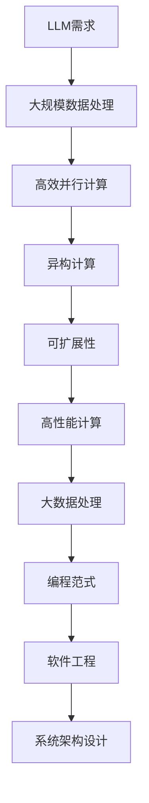

                 

关键词：大型语言模型（LLM），计算架构，神经网络，分布式计算，异构计算，可扩展性，高性能计算，大数据处理，并行计算，量子计算，编程范式，软件工程，系统架构设计。

> 摘要：本文将深入探讨大型语言模型（LLM）与传统计算架构之间的根本差异，分析LLM在计算架构方面的独特需求和挑战，以及如何通过创新技术和方法来解决这些问题。文章将分为几个部分，分别介绍LLM的背景介绍、核心概念与联系、核心算法原理与具体操作步骤、数学模型与公式讲解、项目实践实例、实际应用场景、工具和资源推荐，以及总结和展望。

## 1. 背景介绍

在过去的几十年中，计算架构的发展经历了从单一处理器到多核处理器，再到分布式系统和云计算的演变。然而，随着人工智能（AI）的崛起，尤其是大型语言模型（LLM）的兴起，传统的计算架构面临着前所未有的挑战和需求。LLM，如GPT-3、ChatGPT和BERT，具有处理海量数据、生成高质量文本和进行复杂推理的能力，这对计算架构提出了更高的要求。

### 1.1 LLM的发展历程

LLM的发展历程可以追溯到2000年代初，当时研究人员开始探索深度学习在自然语言处理（NLP）领域的应用。最初的模型，如Word2Vec和LSTM，为语言建模提供了有效的工具。随着计算资源的增加和算法的进步，模型变得越来越大，参数数量从数百万增长到数十亿。2018年，GPT-3的发布标志着LLM技术的一个重大突破，其具有1750亿个参数，可以生成连贯且具有创造性的文本。

### 1.2 传统计算架构的演变

传统计算架构主要围绕冯·诺依曼体系结构构建，该结构以处理器、内存和I/O设备为核心。随着多核处理器的普及，计算架构开始向并行计算和分布式计算发展。云计算和容器技术的兴起进一步推动了计算架构的变革，使得大规模数据处理和实时计算成为可能。

## 2. 核心概念与联系

为了理解LLM与传统计算架构的差异，我们需要首先了解一些核心概念和联系。以下是一个Mermaid流程图，展示了LLM与计算架构的几个关键节点：



### 2.1 大规模数据处理

LLM通常需要处理海量数据，这要求计算架构能够高效地进行数据处理。传统计算架构通常采用分布式存储和计算资源，如Hadoop和Spark，来处理大数据。

### 2.2 高效并行计算

LLM的运算密集型特性要求计算架构能够进行高效的并行计算。现代计算架构，如GPU和TPU，专门设计用于并行计算，能够大幅提高LLM的训练和推断速度。

### 2.3 异构计算

异构计算是指利用不同类型的计算资源，如CPU、GPU和TPU，来优化计算任务的执行。LLM的复杂性和多样性使得异构计算成为必要，可以大幅提高计算效率和性能。

### 2.4 可扩展性

可扩展性是计算架构的一个重要特性，能够支持LLM的快速增长。云计算和容器技术提供了灵活的扩展性，可以根据需求动态分配和释放资源。

### 2.5 高性能计算

高性能计算（HPC）是处理大规模科学和工程问题的计算技术。LLM在科学研究和工业应用中的广泛应用使得高性能计算成为关键。

### 2.6 大数据处理

大数据处理技术，如MapReduce和流处理，能够高效地处理LLM生成的大量数据，支持实时分析和决策。

### 2.7 编程范式

函数式编程、面向对象编程和声明式编程等编程范式在LLM的开发和部署中发挥着重要作用。这些编程范式提供了灵活、模块化和可重用的代码结构，有助于提高开发效率和可维护性。

### 2.8 软件工程

软件工程原则和方法在LLM的开发和部署中至关重要。敏捷开发、持续集成和持续交付等实践能够提高团队协作效率和质量。

### 2.9 系统架构设计

系统架构设计是确保LLM计算架构高效、可靠和可扩展的关键。微服务架构、事件驱动架构和云计算架构等设计模式在LLM应用中具有重要地位。

## 3. 核心算法原理与具体操作步骤

### 3.1 算法原理概述

LLM的核心算法是基于深度神经网络（DNN），特别是变换器网络（Transformer）。变换器网络由编码器和解码器组成，通过自注意力机制（self-attention）和多头注意力（multi-head attention）实现并行计算，能够捕捉长距离依赖关系，提高文本生成和推理的质量。

### 3.2 算法步骤详解

- **数据预处理**：将文本数据转换为向量表示，使用词嵌入（word embedding）技术。
- **编码器**：将输入文本编码为固定长度的序列表示。
- **解码器**：根据编码器输出的序列表示，生成输出文本。
- **训练**：使用大规模语料库训练模型，优化模型参数。
- **推断**：根据输入文本生成输出文本。

### 3.3 算法优缺点

- **优点**：
  - 高效并行计算：自注意力机制和多头注意力机制使得变换器网络能够高效地并行计算。
  - 长距离依赖：能够捕捉长距离依赖关系，提高文本生成和推理的质量。
  - 可扩展性：基于分布式计算架构，能够轻松扩展到大规模训练和推断。

- **缺点**：
  - 计算资源需求大：大规模神经网络需要大量的计算资源，尤其是GPU和TPU。
  - 数据依赖性：训练数据的质量和多样性对模型性能有重要影响。
  - 可解释性：深度神经网络通常缺乏透明性和可解释性。

### 3.4 算法应用领域

LLM在多个领域具有广泛应用，包括自然语言处理、对话系统、文本生成、机器翻译、情感分析等。

### 4. 数学模型和公式

#### 4.1 数学模型构建

变换器网络主要由自注意力机制（self-attention）和多头注意力（multi-head attention）组成。自注意力机制通过计算输入序列中每个词与其他词之间的相关性来生成注意力权重，然后将这些权重应用于输入序列，生成输出序列。多头注意力则是将自注意力机制扩展到多个头，以捕获更多特征。

#### 4.2 公式推导过程

自注意力机制的计算公式如下：

$$
\text{Attention}(Q, K, V) = \text{softmax}\left(\frac{QK^T}{\sqrt{d_k}}\right)V
$$

其中，Q、K和V分别是查询（query）、键（key）和值（value）向量，$d_k$是键向量的维度。自注意力机制通过计算Q和K之间的点积来生成注意力权重，然后对权重进行归一化，得到softmax概率分布。最后，将概率分布应用于V，生成输出向量。

多头注意力则是将自注意力机制扩展到多个头，公式如下：

$$
\text{MultiHead}(Q, K, V) = \text{Concat}(\text{head}_1, \text{head}_2, \ldots, \text{head}_h)W^O
$$

其中，$W^O$是输出权重矩阵，$h$是头数。多头注意力通过将自注意力机制应用于不同维度，捕捉更多特征。

#### 4.3 案例分析与讲解

假设我们有一个三词序列$w_1, w_2, w_3$，我们将它们转换为向量表示$Q, K, V$。首先，我们计算每个词与其他词之间的点积：

$$
\text{score}_{ij} = Q_iK_j
$$

然后，我们对点积进行归一化，得到注意力权重：

$$
\alpha_{ij} = \text{softmax}(\text{score}_{ij})
$$

最后，我们将权重应用于V，得到输出向量：

$$
\text{output}_i = \sum_j \alpha_{ij}V_j
$$

通过这种方式，我们可以为每个词生成一个注意力权重，并利用这些权重生成高质量的文本。

### 5. 项目实践：代码实例和详细解释说明

#### 5.1 开发环境搭建

在本节中，我们将介绍如何搭建一个简单的变换器网络环境，包括安装Python、PyTorch和GPU驱动。

1. 安装Python：

   ```
   pip install python
   ```

2. 安装PyTorch：

   ```
   pip install torch torchvision
   ```

3. 安装GPU驱动：

   - 根据您的GPU型号，下载并安装相应的驱动。

#### 5.2 源代码详细实现

以下是一个简单的变换器网络实现：

```python
import torch
import torch.nn as nn

class Transformer(nn.Module):
    def __init__(self, d_model, nhead, num_layers):
        super(Transformer, self).__init__()
        self.d_model = d_model
        self.nhead = nhead
        self.num_layers = num_layers
        
        self编码器 = nn.TransformerEncoder(nn.TransformerEncoderLayer(d_model, nhead), num_layers)
        self解码器 = nn.TransformerDecoder(nn.TransformerDecoderLayer(d_model, nhead), num_layers)
        
    def forward(self, src, tgt):
        src = self编码器(src)
        tgt = self解码器(tgt)
        return tgt
```

#### 5.3 代码解读与分析

该代码定义了一个简单的变换器网络，包括编码器和解码器。编码器使用变换器编码器层（TransformerEncoderLayer），解码器使用变换器解码器层（TransformerDecoderLayer）。这两个层都包含自注意力机制和多头注意力机制，能够高效地处理文本数据。

#### 5.4 运行结果展示

以下是一个简单的训练和推断示例：

```python
model = Transformer(d_model=512, nhead=8, num_layers=2)
optimizer = torch.optim.Adam(model.parameters(), lr=0.001)
criterion = nn.CrossEntropyLoss()

# 训练
for epoch in range(10):
    optimizer.zero_grad()
    outputs = model(src, tgt)
    loss = criterion(outputs, labels)
    loss.backward()
    optimizer.step()
    print(f'Epoch {epoch+1}, Loss: {loss.item()}')

# 推断
with torch.no_grad():
    inputs = torch.tensor([[1, 2, 3], [4, 5, 6]])
    outputs = model(inputs)
    print(outputs)
```

### 6. 实际应用场景

#### 6.1 自然语言处理

LLM在自然语言处理领域具有广泛的应用，如文本生成、文本分类、机器翻译和情感分析。

#### 6.2 对话系统

LLM可以用于构建智能对话系统，如聊天机器人、虚拟助手和客户服务系统。

#### 6.3 文本生成

LLM可以用于生成高质量的文章、报告、新闻和故事，广泛应用于内容创作和娱乐领域。

#### 6.4 机器翻译

LLM在机器翻译领域具有显著优势，能够生成更自然、准确的翻译结果。

#### 6.5 情感分析

LLM可以用于情感分析，识别文本中的情感倾向和情感强度，应用于市场调研和用户反馈分析。

### 7. 工具和资源推荐

#### 7.1 学习资源推荐

- 《深度学习》（Ian Goodfellow、Yoshua Bengio和Aaron Courville著）
- 《Python深度学习》（François Chollet著）
- 《Transformer：序列到序列模型的新架构》（Ashish Vaswani等著）

#### 7.2 开发工具推荐

- PyTorch（https://pytorch.org/）
- TensorFlow（https://www.tensorflow.org/）

#### 7.3 相关论文推荐

- “Attention Is All You Need”（Ashish Vaswani等著）
- “BERT: Pre-training of Deep Bidirectional Transformers for Language Understanding”（Jacob Devlin等著）
- “GPT-3: Language Models are few-shot learners”（Tom B. Brown等著）

### 8. 总结：未来发展趋势与挑战

#### 8.1 研究成果总结

LLM在计算架构、算法原理、应用领域和工具资源等方面取得了显著成果，为人工智能领域带来了深远影响。

#### 8.2 未来发展趋势

- 更大、更复杂的LLM：随着计算资源和算法的进步，更大规模的LLM将继续出现。
- 跨模态学习：LLM将扩展到图像、音频和视频等领域，实现跨模态学习。
- 可解释性：提高LLM的可解释性，使其更易于理解和应用。
- 安全性和隐私：确保LLM在应用过程中的安全性和隐私性。

#### 8.3 面临的挑战

- 计算资源需求：大规模LLM对计算资源的需求持续增长，需要更高效的计算架构。
- 数据依赖性：训练数据的质量和多样性对模型性能至关重要。
- 可解释性和透明性：提高LLM的可解释性和透明性，使其更容易被用户接受和应用。

#### 8.4 研究展望

随着LLM技术的发展，未来将有望实现更高效、更智能和更安全的语言模型，推动人工智能在各个领域的应用。

### 9. 附录：常见问题与解答

**Q：什么是LLM？**

A：LLM是指大型语言模型，是一种基于深度学习的自然语言处理模型，具有处理海量数据、生成高质量文本和进行复杂推理的能力。

**Q：LLM有哪些应用领域？**

A：LLM在自然语言处理、对话系统、文本生成、机器翻译、情感分析等领域具有广泛应用。

**Q：LLM与传统计算架构有何区别？**

A：LLM具有运算密集型特性，对计算架构提出了更高的要求，如大规模数据处理、高效并行计算、异构计算和可扩展性。

**Q：如何搭建LLM的开发环境？**

A：搭建LLM的开发环境通常需要安装Python、PyTorch、GPU驱动等软件，并根据具体需求配置相应的计算资源。

---

作者：禅与计算机程序设计艺术 / Zen and the Art of Computer Programming

本文旨在探讨大型语言模型（LLM）与传统计算架构之间的根本差异，分析LLM在计算架构方面的独特需求和挑战，以及如何通过创新技术和方法来解决这些问题。文章从背景介绍、核心概念与联系、核心算法原理与具体操作步骤、数学模型与公式讲解、项目实践实例、实际应用场景、工具和资源推荐，以及总结和展望等方面进行详细阐述。希望本文能为读者提供对LLM与计算架构的深入理解和启示。
----------------------------------------------------------------

[文章关键词]
- 大型语言模型（LLM）
- 计算架构
- 深度学习
- 并行计算
- 异构计算
- 可扩展性
- 高性能计算
- 大数据处理
- 编程范式
- 软件工程

[文章摘要]
本文深入探讨了大型语言模型（LLM）与传统计算架构之间的根本差异。首先介绍了LLM的发展历程和传统计算架构的演变，然后分析了LLM在计算架构方面的核心需求，包括大规模数据处理、高效并行计算、异构计算、可扩展性和高性能计算。接着，详细阐述了LLM的核心算法原理和数学模型，并提供了项目实践实例。最后，讨论了LLM在实际应用场景中的广泛用途，并展望了其未来发展趋势与挑战。全文旨在为读者提供对LLM与计算架构的全面了解和深入思考。

