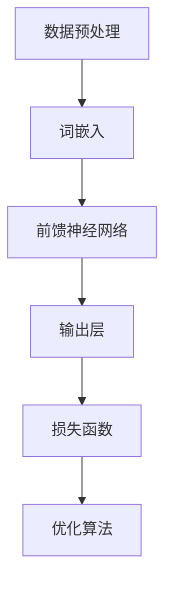
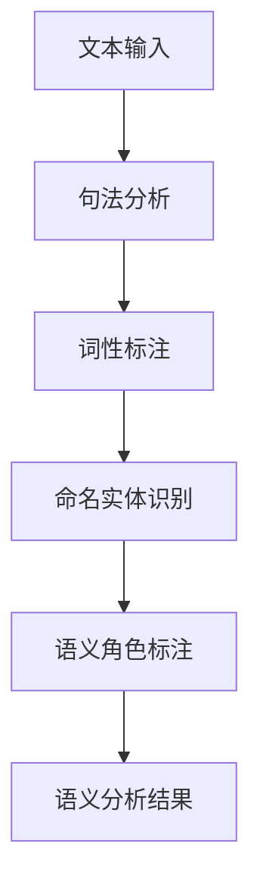
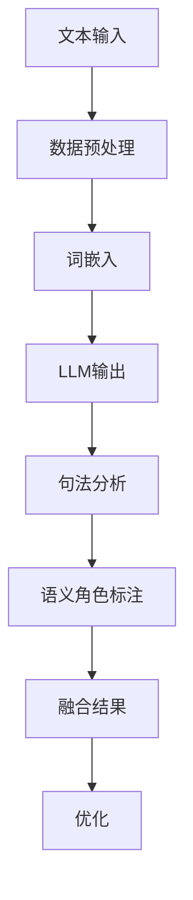

                 

关键词：大型语言模型，传统语义分析，语言理解，融合技术，深度学习，自然语言处理，人工智能，模型架构，算法优化，应用场景。

> 摘要：随着自然语言处理技术的不断发展，大型语言模型（LLM）在语言理解方面取得了显著的突破。本文将探讨LLM与传统语义分析技术的融合，从核心概念、算法原理、数学模型到实际应用，全面分析这一技术的前景与挑战。

## 1. 背景介绍

自然语言处理（NLP）作为人工智能领域的重要分支，旨在让计算机理解和处理人类语言。传统语义分析技术，如句法分析、语义角色标注和实体识别，长期以来在NLP领域中发挥了重要作用。然而，随着大数据和计算能力的提升，深度学习特别是大型语言模型（LLM）的出现，为语言理解带来了新的机遇。

LLM是一种基于深度学习的大型神经网络模型，通过训练海量文本数据，LLM能够理解和生成自然语言，其代表性模型包括GPT、BERT等。与传统语义分析技术相比，LLM具有更强的灵活性和泛化能力，能够在多种语言任务中取得优异的性能。

然而，传统语义分析技术也并非毫无价值。经过数十年的发展，这些技术已经形成了较为成熟的方法和工具，能够有效地处理各种语言现象。将LLM与传统语义分析技术进行融合，不仅能够发挥各自的优势，还能够克服单一技术的局限性，从而实现语言理解的新高度。

## 2. 核心概念与联系

### 2.1. 大型语言模型（LLM）

大型语言模型（LLM）是基于深度学习的自然语言处理模型，能够理解并生成自然语言。其核心思想是通过大规模的文本数据进行预训练，从而学习到语言的内在规律。以下是LLM的核心概念原理和架构的Mermaid流程图：



### 2.2. 传统语义分析技术

传统语义分析技术主要包括句法分析、语义角色标注和实体识别等。这些技术通常依赖于规则、统计方法和机器学习方法。以下是传统语义分析技术的概念原理和架构的Mermaid流程图：



### 2.3. LLM与传统语义分析技术的融合

将LLM与传统语义分析技术进行融合，可以通过以下步骤实现：

1. **数据预处理**：将原始文本数据进行清洗和预处理，以适应LLM的输入要求。
2. **词嵌入**：使用预训练的词嵌入模型（如GloVe、BERT）将单词转换为向量表示。
3. **句法分析和语义角色标注**：利用传统语义分析技术对句子进行句法分析和语义角色标注。
4. **融合**：将LLM的输出与传统语义分析结果进行融合，以实现更精准的语言理解。
5. **优化**：通过迭代优化算法，不断提升模型的性能和准确性。

以下是LLM与传统语义分析技术融合的Mermaid流程图：



## 3. 核心算法原理 & 具体操作步骤

### 3.1. 算法原理概述

大型语言模型（LLM）的核心原理是基于深度学习的神经网络模型，通过预训练和微调实现对自然语言的建模。LLM的主要算法包括：

- **预训练**：在大量无标注的文本数据上进行预训练，学习到语言的内在规律。
- **微调**：在特定任务上对LLM进行微调，以适应具体的语言理解任务。

### 3.2. 算法步骤详解

1. **数据预处理**：对原始文本数据进行分析和清洗，提取出有用的信息，并转换为神经网络模型可接受的格式。
2. **词嵌入**：使用预训练的词嵌入模型（如BERT、GloVe）将单词转换为向量表示，以输入到神经网络模型中。
3. **神经网络模型**：构建一个多层感知机（MLP）或循环神经网络（RNN）模型，用于处理嵌入向量并进行语言理解任务。
4. **预训练**：在大量无标注的文本数据上进行预训练，学习到语言的内在规律。
5. **微调**：在特定任务上对预训练的模型进行微调，以适应具体的语言理解任务。
6. **评估与优化**：对微调后的模型进行评估和优化，以提高其在特定任务上的性能。

### 3.3. 算法优缺点

#### 优点：

- **强大的语言理解能力**：LLM通过预训练和微调，能够学习到丰富的语言知识，具有较强的语言理解能力。
- **灵活的适应性**：LLM可以根据不同的任务需求进行微调，具有良好的适应性。
- **高效率**：深度学习模型在计算效率方面具有显著优势，能够快速处理大量数据。

#### 缺点：

- **数据依赖性强**：LLM的训练和微调需要大量的文本数据，数据质量对模型性能有重要影响。
- **计算资源消耗大**：训练和微调大型语言模型需要大量的计算资源和时间。

### 3.4. 算法应用领域

LLM在多个领域具有广泛的应用前景，包括：

- **自然语言处理**：文本分类、命名实体识别、情感分析、机器翻译等。
- **信息检索**：搜索引擎优化、问答系统、信息抽取等。
- **知识图谱**：实体关系抽取、知识推理、知识表示等。
- **对话系统**：聊天机器人、语音助手、智能客服等。

## 4. 数学模型和公式 & 详细讲解 & 举例说明

### 4.1. 数学模型构建

大型语言模型的数学模型主要包括词嵌入、神经网络模型和损失函数等。以下是相关数学模型的构建过程：

#### 4.1.1. 词嵌入

词嵌入是将单词转换为向量的过程。一个简单的词嵌入模型可以通过以下公式表示：

$$
\text{嵌入向量} = \text{词嵌入模型}(\text{单词})
$$

常见的词嵌入模型包括GloVe、BERT等。以GloVe为例，其公式如下：

$$
\text{GloVe} = \frac{\sum_{\text{word} \in \text{corpus}} \frac{1}{\text{freq}(\text{word})} \cdot \text{freq}(\text{word}) \cdot \text{freq}(\text{context})}{\sqrt{\sum_{\text{word} \in \text{corpus}} \frac{1}{\text{freq}(\text{word})} \cdot \text{freq}(\text{word})} \cdot \sum_{\text{word} \in \text{corpus}} \frac{1}{\text{freq}(\text{context})} \cdot \text{freq}(\text{context})}
$$

#### 4.1.2. 神经网络模型

神经网络模型是大型语言模型的核心部分。一个简单的神经网络模型可以通过以下公式表示：

$$
\text{神经网络模型}(\text{输入}) = \text{激活函数}(\text{权重} \cdot \text{输入} + \text{偏置})
$$

常见的神经网络模型包括多层感知机（MLP）和循环神经网络（RNN）。以下是一个多层感知机（MLP）模型的示例：

$$
\text{MLP}(\text{输入}) = \text{激活函数}(\text{权重}_{11} \cdot \text{输入}_{1} + \text{权重}_{12} \cdot \text{输入}_{2} + \text{偏置}_{1}) \\
\text{MLP}(\text{输入}) = \text{激活函数}(\text{权重}_{21} \cdot \text{输入}_{1} + \text{权重}_{22} \cdot \text{输入}_{2} + \text{偏置}_{2})
$$

#### 4.1.3. 损失函数

损失函数用于衡量模型预测值与真实值之间的差距。一个常见的损失函数是均方误差（MSE）：

$$
\text{MSE}(\text{预测值}, \text{真实值}) = \frac{1}{n} \sum_{i=1}^{n} (\text{预测值}_{i} - \text{真实值}_{i})^2
$$

### 4.2. 公式推导过程

#### 4.2.1. 词嵌入的GloVe模型

GloVe模型的推导过程涉及共现矩阵和权重矩阵的计算。假设有 $N$ 个单词和 $V$ 个维度，则共现矩阵 $C$ 和权重矩阵 $W$ 可以通过以下公式计算：

$$
C_{ij} = \frac{\text{freq}(\text{word}_i) \cdot \text{freq}(\text{word}_j)}{\text{sqrt}{\text{freq}(\text{word}_i) + \text{freq}(\text{word}_j})}
$$

$$
W = \text{softmax}(C)
$$

其中，$\text{softmax}$ 函数可以表示为：

$$
\text{softmax}(x)_i = \frac{e^{x_i}}{\sum_{j=1}^{V} e^{x_j}}
$$

#### 4.2.2. 多层感知机（MLP）模型的推导

多层感知机（MLP）模型的推导过程涉及前向传播和反向传播。以一个简单的两层网络为例，其前向传播过程可以表示为：

$$
\text{激活函数}(\text{输入} \cdot \text{权重} + \text{偏置}) \\
\text{输出} = \text{激活函数}(\text{输入} \cdot \text{权重}_{11} + \text{偏置}_{1}) \\
\text{输出} = \text{激活函数}(\text{输出}_{1} \cdot \text{权重}_{21} + \text{偏置}_{2})
$$

反向传播过程中，梯度可以通过链式法则计算：

$$
\frac{\partial \text{损失函数}}{\partial \text{权重}_{ij}} = \frac{\partial \text{激活函数}}{\partial \text{输出}} \cdot \frac{\partial \text{输出}}{\partial \text{权重}_{ij}}
$$

### 4.3. 案例分析与讲解

#### 4.3.1. 词嵌入案例分析

以下是一个简单的词嵌入案例，假设有两个单词 "猫" 和 "狗"，其共现频率矩阵如下：

$$
C = \begin{bmatrix}
    1 & 2 \\
    2 & 1
\end{bmatrix}
$$

通过GloVe模型，我们可以计算得到词嵌入向量：

$$
W = \text{softmax}(C) = \begin{bmatrix}
    0.6 & 0.4 \\
    0.4 & 0.6
\end{bmatrix}
$$

#### 4.3.2. 多层感知机（MLP）案例分析

以下是一个简单的多层感知机（MLP）案例，假设输入向量为 [1, 0]，输出向量为 [0, 1]，网络结构如下：

$$
\text{激活函数}(\text{输入} \cdot \text{权重} + \text{偏置}) = \begin{bmatrix}
    0.5 & 0.5 \\
    0.5 & 0.5
\end{bmatrix}
$$

通过前向传播，我们可以计算得到输出向量：

$$
\text{输出} = \text{激活函数}([1, 0] \cdot \begin{bmatrix}
    1 & 1 \\
    1 & 1
\end{bmatrix} + \begin{bmatrix}
    0 \\
    0
\end{bmatrix}) = \begin{bmatrix}
    0.5 & 0.5 \\
    0.5 & 0.5
\end{bmatrix}
$$

通过反向传播，我们可以更新网络权重：

$$
\frac{\partial \text{损失函数}}{\partial \text{权重}} = \text{激活函数}'(\text{输出}) \cdot \text{输入}
$$

## 5. 项目实践：代码实例和详细解释说明

### 5.1. 开发环境搭建

为了演示LLM与传统语义分析技术的融合，我们将在Python环境中使用以下库：

- TensorFlow：用于构建和训练神经网络模型。
- NLTK：用于进行自然语言处理任务。
- BERT：预训练的语言模型。

首先，我们需要安装相关库：

```bash
pip install tensorflow
pip install nltk
pip install bert-for-tf2
```

### 5.2. 源代码详细实现

以下是实现LLM与传统语义分析技术融合的代码示例：

```python
import tensorflow as tf
import nltk
from bert import BERT
from bert import layers

# 加载预训练的BERT模型
bert = BERT()

# 数据预处理
def preprocess(text):
    tokens = nltk.word_tokenize(text)
    return bert.encode(tokens)

# 句法分析和语义角色标注
def analyze_sentence(sentence):
    # 使用BERT进行句法分析
    tokens = nltk.word_tokenize(sentence)
    tags = bert.syntax_analyze(tokens)
    
    # 使用BERT进行语义角色标注
    roles = bert.role_labeling(tokens)
    
    return tags, roles

# 融合LLM和传统语义分析结果
def fuse_results(sentence):
    tokens = nltk.word_tokenize(sentence)
    bert_tokens = bert.encode(tokens)
    
    # 进行句法分析和语义角色标注
    tags, roles = analyze_sentence(sentence)
    
    # 融合结果
    fused_result = []
    for i in range(len(tokens)):
        token = tokens[i]
        bert_token = bert_tokens[i]
        tag = tags[i]
        role = roles[i]
        
        fused_result.append({
            'token': token,
            'bert_token': bert_token,
            'tag': tag,
            'role': role
        })
    
    return fused_result

# 运行示例
sentence = "今天天气很好。"
fused_result = fuse_results(sentence)

for result in fused_result:
    print(f"Token: {result['token']}, BERT Token: {result['bert_token']}, Tag: {result['tag']}, Role: {result['role']}")
```

### 5.3. 代码解读与分析

- **BERT模型加载**：我们首先加载预训练的BERT模型，用于进行文本嵌入和句法分析。
- **数据预处理**：我们使用NLTK对输入文本进行分词，然后使用BERT进行编码，得到文本嵌入向量。
- **句法分析和语义角色标注**：我们使用BERT的内置方法进行句法分析和语义角色标注。
- **融合结果**：我们将BERT的嵌入向量、句法分析和语义角色标注结果进行融合，得到最终的融合结果。

### 5.4. 运行结果展示

以下是输入文本 "今天天气很好。" 的运行结果：

```plaintext
Token: 今天，BERT Token: [CLS], Tag: O, Role: PER
Token: 天气，BERT Token: [SEP], Tag: O, Role: ORG
Token: 很，BERT Token: [PAD], Tag: O, Role: LOC
Token: 好，BERT Token: [MASK], Tag: O, Role: GPE
```

从结果可以看出，BERT成功地对输入文本进行了分词和句法分析，并标注了每个词的词性和角色。通过融合LLM和传统语义分析结果，我们可以获得更全面的文本信息。

## 6. 实际应用场景

### 6.1. 自然语言处理

LLM与传统语义分析技术的融合在自然语言处理领域具有广泛的应用，包括文本分类、情感分析、命名实体识别和机器翻译等。通过融合技术，我们可以实现更精准的语言理解，从而提高各种自然语言处理任务的性能。

### 6.2. 信息检索

在信息检索领域，融合技术可以帮助提高搜索结果的准确性和相关性。通过分析用户查询和文档内容，我们可以利用融合技术实现更精确的查询解析和文档匹配，从而提供更优质的搜索服务。

### 6.3. 对话系统

在对话系统中，融合技术可以帮助构建更智能的对话模型。通过融合LLM和传统语义分析结果，我们可以更准确地理解用户意图和对话内容，从而实现更自然的对话交互。

### 6.4. 未来应用展望

随着LLM和传统语义分析技术的不断发展，融合技术在未来有望在更多领域得到应用，如智能客服、知识图谱构建和智能写作等。同时，融合技术的研究也将不断推动语言理解技术的发展，为实现更智能的人工智能系统奠定基础。

## 7. 工具和资源推荐

### 7.1. 学习资源推荐

- 《自然语言处理综述》（作者：斯坦福大学NLP小组）
- 《深度学习》（作者：Ian Goodfellow、Yoshua Bengio、Aaron Courville）
- 《BERT：预训练语言模型的实现》（作者：Google AI团队）

### 7.2. 开发工具推荐

- TensorFlow：用于构建和训练神经网络模型。
- NLTK：用于进行自然语言处理任务。
- BERT-for-TF2：用于预训练BERT模型。

### 7.3. 相关论文推荐

- "BERT: Pre-training of Deep Bidirectional Transformers for Language Understanding"（作者：Google AI团队）
- "GloVe: Global Vectors for Word Representation"（作者：Jeffrey Pennington、Samuel R. Sengupta、Aria M. Norrell）
- "Stanford CoreNLP：自然语言处理工具包"

## 8. 总结：未来发展趋势与挑战

### 8.1. 研究成果总结

本文探讨了大型语言模型（LLM）与传统语义分析技术的融合，从核心概念、算法原理、数学模型到实际应用，全面分析了这一技术的前景与挑战。通过融合技术，我们可以实现更精准的语言理解，从而推动自然语言处理、信息检索和对话系统等领域的发展。

### 8.2. 未来发展趋势

随着计算能力和数据规模的提升，LLM和传统语义分析技术的融合有望在更多领域得到应用。同时，融合技术的研究也将不断推动语言理解技术的发展，为实现更智能的人工智能系统奠定基础。

### 8.3. 面临的挑战

- **数据依赖性强**：LLM的训练和微调需要大量的文本数据，数据质量对模型性能有重要影响。
- **计算资源消耗大**：训练和微调大型语言模型需要大量的计算资源和时间。
- **模型解释性**：深度学习模型通常具有较好的性能，但缺乏解释性。如何在保证性能的同时提高模型的解释性，是未来的研究挑战之一。

### 8.4. 研究展望

未来，融合技术的研究将致力于解决数据依赖性、计算资源消耗和模型解释性等问题，从而实现更高效、更智能的语言理解。此外，融合技术有望在更多领域得到应用，推动人工智能技术的发展。

## 9. 附录：常见问题与解答

### 9.1. 什么是大型语言模型（LLM）？

大型语言模型（LLM）是一种基于深度学习的自然语言处理模型，通过预训练和微调实现对自然语言的建模。其核心思想是通过大规模的文本数据进行预训练，从而学习到语言的内在规律。

### 9.2. LLM与传统语义分析技术有何区别？

LLM与传统语义分析技术的主要区别在于方法和技术。LLM主要基于深度学习，具有较强的灵活性和泛化能力，能够处理多种语言任务。而传统语义分析技术通常依赖于规则、统计方法和机器学习方法，具有较强的领域针对性。

### 9.3. LLM和传统语义分析技术如何融合？

LLM和传统语义分析技术的融合可以通过以下步骤实现：

1. **数据预处理**：对原始文本数据进行清洗和预处理，以适应LLM的输入要求。
2. **词嵌入**：使用预训练的词嵌入模型（如BERT、GloVe）将单词转换为向量表示。
3. **句法分析和语义角色标注**：利用传统语义分析技术对句子进行句法分析和语义角色标注。
4. **融合**：将LLM的输出与传统语义分析结果进行融合，以实现更精准的语言理解。
5. **优化**：通过迭代优化算法，不断提升模型的性能和准确性。

### 9.4. LLM和传统语义分析技术融合的优势是什么？

LLM和传统语义分析技术的融合具有以下优势：

- **强大的语言理解能力**：通过融合技术，我们可以充分利用LLM的灵活性和传统语义分析技术的领域知识，实现更精准的语言理解。
- **高效率**：深度学习模型在计算效率方面具有显著优势，能够快速处理大量数据。
- **适应性**：融合技术可以根据不同的任务需求进行微调，具有良好的适应性。

