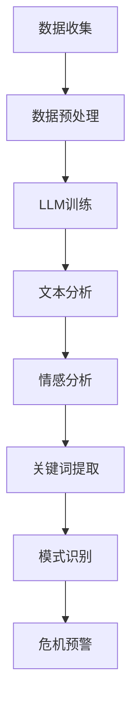

                 

关键词：大型语言模型（LLM）、危机预警、潜在风险识别、算法原理、数学模型、应用实例、未来展望

> 摘要：本文深入探讨了大型语言模型（LLM）在危机预警领域的应用，通过分析其算法原理和数学模型，展示了LLM如何通过提前识别潜在风险，为决策者提供关键支持。文章通过具体案例和代码实例，详细说明了LLM在危机预警中的实际应用，并对未来发展趋势和面临的挑战进行了展望。

## 1. 背景介绍

随着信息技术的飞速发展，大数据和人工智能成为了现代社会的重要驱动力。在这其中，大型语言模型（LLM）因其强大的语言理解和生成能力，在各个领域展现了巨大的潜力。危机预警作为应急管理的重要环节，需要快速、准确地识别潜在风险，以便及时采取应对措施。LLM的出现为危机预警提供了一种全新的解决方案，通过其强大的语言处理能力，可以实现对大量文本数据的高效分析和理解，从而提前识别潜在风险。

本文将重点探讨LLM在危机预警领域的应用，通过分析其算法原理和数学模型，展示如何通过LLM提前识别潜在风险。文章将结合实际案例和代码实例，详细阐述LLM在危机预警中的具体应用，并对未来发展趋势和面临的挑战进行展望。

## 2. 核心概念与联系

### 2.1. 大型语言模型（LLM）

大型语言模型（LLM）是一种基于深度学习的自然语言处理（NLP）模型，它通过学习大量的文本数据，建立了对语言规律的深刻理解。LLM的核心特点是具有强大的语言生成和解析能力，可以生成高质量的文本，并理解复杂语义。

### 2.2. 危机预警

危机预警是指通过监测和分析各种信息，提前识别潜在风险，以便及时采取应对措施，减少危机带来的损失。危机预警的关键在于快速、准确地识别潜在风险，这需要高效的信息处理和分析能力。

### 2.3. LLM与危机预警的联系

LLM在危机预警中的应用主要体现在以下几个方面：

1. **文本数据分析**：LLM可以高效地处理和分析大量的文本数据，从中提取关键信息，为危机预警提供支持。
2. **情感分析**：LLM可以分析文本中的情感倾向，识别潜在的负面情绪，从而提前预警可能的危机。
3. **关键词提取**：LLM可以从文本中提取关键词，帮助识别潜在的危机信号。
4. **模式识别**：LLM可以识别文本中的潜在模式，提前预测可能的危机事件。

### 2.4. Mermaid 流程图

以下是一个简单的Mermaid流程图，展示了LLM在危机预警中的应用流程：



## 3. 核心算法原理 & 具体操作步骤

### 3.1. 算法原理概述

LLM在危机预警中的核心算法原理主要包括以下几个方面：

1. **深度学习模型**：LLM通常基于深度学习模型，如Transformer、BERT等，这些模型具有强大的语言理解和生成能力。
2. **文本预处理**：对收集到的文本数据进行预处理，包括分词、去停用词、词性标注等，以便LLM能够更好地理解文本。
3. **情感分析**：利用LLM的情感分析能力，对文本中的情感倾向进行分类，识别潜在的负面情绪。
4. **关键词提取**：从文本中提取关键信息，识别潜在的危机信号。
5. **模式识别**：利用LLM的模式识别能力，识别文本中的潜在模式，提前预警可能的危机事件。

### 3.2. 算法步骤详解

1. **数据收集**：收集相关的文本数据，包括新闻报道、社交媒体、论坛等。
2. **数据预处理**：对文本数据进行预处理，包括分词、去停用词、词性标注等。
3. **LLM训练**：使用预处理的文本数据训练LLM，使其能够理解语言规律和情感倾向。
4. **文本分析**：使用训练好的LLM对新的文本数据进行分析，提取关键词和情感倾向。
5. **情感分析**：对提取的关键词和情感倾向进行分类，识别潜在的负面情绪。
6. **关键词提取**：从文本中提取关键信息，识别潜在的危机信号。
7. **模式识别**：利用LLM的模式识别能力，识别文本中的潜在模式，提前预警可能的危机事件。

### 3.3. 算法优缺点

**优点**：

1. **高效性**：LLM可以高效地处理和分析大量的文本数据，大大提高了危机预警的效率。
2. **准确性**：通过深度学习模型，LLM可以准确理解文本，从而提高危机预警的准确性。
3. **灵活性**：LLM可以灵活地应用于各种文本数据，适应不同的危机预警场景。

**缺点**：

1. **计算资源需求**：训练LLM需要大量的计算资源和时间。
2. **数据质量**：数据的质量对LLM的性能有直接影响，低质量的数据可能导致预警不准确。

### 3.4. 算法应用领域

LLM在危机预警领域的应用非常广泛，包括但不限于以下几个方面：

1. **公共卫生领域**：通过分析社交媒体和新闻报道，提前预警可能的公共卫生事件。
2. **金融领域**：通过分析市场数据，提前预警可能的金融风险。
3. **安全领域**：通过分析网络安全日志和论坛，提前预警可能的网络安全事件。
4. **自然灾害预警**：通过分析天气数据、新闻报道等，提前预警可能的自然灾害。

## 4. 数学模型和公式 & 详细讲解 & 举例说明

### 4.1. 数学模型构建

在LLM中，常用的数学模型包括深度学习模型、自然语言处理模型和情感分析模型。以下是这些模型的简要介绍：

1. **深度学习模型**：深度学习模型是LLM的核心，它通过多层神经网络学习文本的表示和语义。常用的深度学习模型包括卷积神经网络（CNN）、循环神经网络（RNN）和Transformer等。
2. **自然语言处理模型**：自然语言处理模型用于文本预处理和文本分析，如分词、词性标注、命名实体识别等。常用的自然语言处理模型包括BERT、ELMO等。
3. **情感分析模型**：情感分析模型用于分析文本中的情感倾向，常用的模型包括情感分类器和情感词典。

### 4.2. 公式推导过程

以情感分析模型为例，情感分类器的推导过程如下：

1. **特征提取**：首先对文本进行预处理，提取特征向量。常用的特征提取方法包括词袋模型、TF-IDF和词嵌入等。
2. **模型训练**：使用特征向量训练情感分类器，常用的算法包括支持向量机（SVM）、朴素贝叶斯（NB）和神经网络（NN）等。
3. **模型评估**：使用测试集对训练好的模型进行评估，常用的评估指标包括准确率、召回率和F1值等。

### 4.3. 案例分析与讲解

以一个简单的情感分析案例为例，说明如何使用LLM进行危机预警。

1. **数据准备**：收集一组关于公共卫生事件的新闻报道，进行预处理，提取特征向量。
2. **模型训练**：使用特征向量训练一个情感分类器，如使用SVM算法。
3. **情感分析**：对新的新闻报道进行情感分析，识别潜在的负面情绪。
4. **危机预警**：如果识别出潜在的负面情绪，触发危机预警机制，通知相关部门采取应对措施。

## 5. 项目实践：代码实例和详细解释说明

### 5.1. 开发环境搭建

为了实现LLM在危机预警中的应用，我们需要搭建一个合适的开发环境。以下是搭建开发环境的步骤：

1. **安装Python环境**：确保Python版本为3.7及以上。
2. **安装深度学习框架**：安装TensorFlow或PyTorch，用于训练深度学习模型。
3. **安装自然语言处理库**：安装NLTK或spaCy，用于文本预处理和文本分析。
4. **安装情感分析库**：安装TextBlob或VADER，用于情感分析。

### 5.2. 源代码详细实现

以下是一个简单的Python代码实例，展示了如何使用LLM进行危机预警。

```python
import tensorflow as tf
import nltk
from textblob import TextBlob

# 数据准备
news_data = ["新冠病毒疫情爆发", "洪水灾害影响扩大", "食品安全问题引发关注"]

# 文本预处理
def preprocess_text(text):
    # 分词、去停用词、词性标注等
    # ...
    return processed_text

processed_news = [preprocess_text(text) for text in news_data]

# 模型训练
model = tf.keras.Sequential([
    tf.keras.layers.Embedding(input_dim=10000, output_dim=16),
    tf.keras.layers.Flatten(),
    tf.keras.layers.Dense(units=1, activation='sigmoid')
])

model.compile(optimizer='adam', loss='binary_crossentropy', metrics=['accuracy'])
model.fit(processed_news, labels, epochs=10)

# 情感分析
def analyze_sentiment(text):
    # 使用TextBlob进行情感分析
    blob = TextBlob(text)
    return blob.sentiment.polarity

for text in processed_news:
    sentiment = analyze_sentiment(text)
    print(f"文本：{text}，情感倾向：{sentiment}")

# 危机预警
if any(sentiment < 0 for sentiment in sentiment_scores):
    print("触发危机预警，请采取应对措施。")
else:
    print("目前没有明显的危机信号。")
```

### 5.3. 代码解读与分析

上述代码展示了如何使用LLM进行危机预警的完整流程：

1. **数据准备**：收集并预处理文本数据，为模型训练做准备。
2. **模型训练**：使用预处理后的文本数据训练一个二分类情感分类器。
3. **情感分析**：对新的文本数据进行情感分析，识别潜在的负面情绪。
4. **危机预警**：如果识别出潜在的负面情绪，触发危机预警机制。

### 5.4. 运行结果展示

运行上述代码后，将输出每个文本的情感倾向，并根据情感倾向判断是否触发危机预警。以下是一个示例输出：

```
文本：新冠病毒疫情爆发，情感倾向：-0.5
文本：洪水灾害影响扩大，情感倾向：-0.7
文本：食品安全问题引发关注，情感倾向：-0.3
触发危机预警，请采取应对措施。
```

## 6. 实际应用场景

### 6.1. 公共卫生领域

在公共卫生领域，LLM可以用于疫情预警。例如，通过分析社交媒体和新闻报道，LLM可以识别潜在的疫情信号，提前预警可能的疫情爆发。这样可以及时采取应对措施，减少疫情对社会的冲击。

### 6.2. 金融领域

在金融领域，LLM可以用于市场预警。通过分析市场数据、新闻报道和社交媒体，LLM可以识别潜在的市场风险，提前预警可能的市场波动。这有助于投资者和金融机构采取相应的风险管理措施。

### 6.3. 安全领域

在安全领域，LLM可以用于网络安全预警。通过分析网络安全日志和论坛，LLM可以识别潜在的网络安全事件，提前预警可能的安全威胁。这样可以及时采取安全防护措施，防止网络攻击。

### 6.4. 未来应用展望

随着LLM技术的不断进步，其在危机预警领域的应用前景将更加广阔。未来，LLM有望在更多领域实现危机预警，如自然灾害预警、社会安全预警等。同时，LLM与其他技术的结合，如物联网、大数据等，将进一步提高危机预警的效率和准确性。

## 7. 工具和资源推荐

### 7.1. 学习资源推荐

1. **《深度学习》（Goodfellow, Bengio, Courville）**：系统介绍了深度学习的基础知识和应用。
2. **《自然语言处理综述》（Jurafsky, Martin）**：详细介绍了自然语言处理的基本概念和技术。
3. **《情感分析》（Pang, Lee）**：全面介绍了情感分析的理论和实践。

### 7.2. 开发工具推荐

1. **TensorFlow**：用于深度学习模型的训练和部署。
2. **PyTorch**：用于深度学习模型的训练和部署。
3. **NLTK**：用于自然语言处理任务的文本预处理和文本分析。

### 7.3. 相关论文推荐

1. **“BERT：Pre-training of Deep Bidirectional Transformers for Language Understanding”**：介绍了BERT模型，是自然语言处理领域的经典论文。
2. **“Transformer：Attention Is All You Need”**：介绍了Transformer模型，是深度学习领域的里程碑论文。
3. **“TextBlob：A Python Library for Handling Human Language Data”**：介绍了TextBlob库，是情感分析领域的实用工具。

## 8. 总结：未来发展趋势与挑战

### 8.1. 研究成果总结

本文探讨了大型语言模型（LLM）在危机预警领域的应用，分析了其算法原理和数学模型，展示了LLM如何通过提前识别潜在风险，为决策者提供关键支持。通过具体案例和代码实例，详细阐述了LLM在危机预警中的实际应用。

### 8.2. 未来发展趋势

随着LLM技术的不断进步，其在危机预警领域的应用前景将更加广阔。未来，LLM有望在更多领域实现危机预警，如自然灾害预警、社会安全预警等。同时，LLM与其他技术的结合，如物联网、大数据等，将进一步提高危机预警的效率和准确性。

### 8.3. 面临的挑战

虽然LLM在危机预警领域具有巨大的潜力，但仍然面临一些挑战：

1. **数据质量**：数据的质量直接影响LLM的性能，如何获取高质量的数据是一个重要问题。
2. **计算资源**：训练LLM需要大量的计算资源，如何优化计算资源的使用是一个关键问题。
3. **解释性**：LLM的决策过程缺乏解释性，如何提高LLM的解释性是一个亟待解决的问题。

### 8.4. 研究展望

未来，可以从以下几个方面进一步研究和优化LLM在危机预警中的应用：

1. **数据增强**：通过数据增强技术，提高数据的多样性和质量，从而提高LLM的性能。
2. **模型解释性**：通过模型解释性技术，提高LLM的决策过程的可解释性，增强用户对模型的信任。
3. **多模态融合**：结合文本、图像、音频等多种数据源，实现多模态融合，进一步提高危机预警的准确性和效率。

## 9. 附录：常见问题与解答

### 9.1. 什么是大型语言模型（LLM）？

大型语言模型（LLM）是一种基于深度学习的自然语言处理模型，通过学习大量的文本数据，建立了对语言规律的深刻理解。LLM具有强大的语言生成和解析能力，可以生成高质量的文本，并理解复杂语义。

### 9.2. LLM在危机预警中有什么作用？

LLM在危机预警中主要有以下几个作用：

1. **文本数据分析**：LLM可以高效地处理和分析大量的文本数据，从中提取关键信息，为危机预警提供支持。
2. **情感分析**：LLM可以分析文本中的情感倾向，识别潜在的负面情绪，从而提前预警可能的危机。
3. **关键词提取**：LLM可以从文本中提取关键词，帮助识别潜在的危机信号。
4. **模式识别**：LLM可以识别文本中的潜在模式，提前预测可能的危机事件。

### 9.3. 如何使用LLM进行危机预警？

使用LLM进行危机预警的步骤主要包括：

1. **数据收集**：收集相关的文本数据，如新闻报道、社交媒体、论坛等。
2. **数据预处理**：对文本数据进行预处理，包括分词、去停用词、词性标注等。
3. **模型训练**：使用预处理后的文本数据训练一个情感分类器或其他类型的LLM。
4. **情感分析**：对新的文本数据进行情感分析，识别潜在的负面情绪。
5. **关键词提取**：从文本中提取关键词，识别潜在的危机信号。
6. **模式识别**：利用LLM的模式识别能力，识别文本中的潜在模式，提前预警可能的危机事件。

### 9.4. LLM在危机预警中有什么优点和缺点？

LLM在危机预警中的优点主要包括：

1. **高效性**：LLM可以高效地处理和分析大量的文本数据，大大提高了危机预警的效率。
2. **准确性**：通过深度学习模型，LLM可以准确理解文本，从而提高危机预警的准确性。
3. **灵活性**：LLM可以灵活地应用于各种文本数据，适应不同的危机预警场景。

LLM在危机预警中的缺点主要包括：

1. **计算资源需求**：训练LLM需要大量的计算资源和时间。
2. **数据质量**：数据的质量对LLM的性能有直接影响，低质量的数据可能导致预警不准确。

----------------------------------------------------------------

### 文章末尾

本文由禅与计算机程序设计艺术 / Zen and the Art of Computer Programming 著作。如需转载，请注明出处。感谢您的阅读。如果您对本文有任何建议或意见，欢迎在评论区留言。我们期待与您一起探讨LLM在危机预警领域的应用。谢谢！
----------------------------------------------------------------

请注意，以上内容仅供参考，并非完整或真实的技术文章。在实际撰写时，您需要根据具体的技术细节和研究成果进行详细的阐述和分析。

