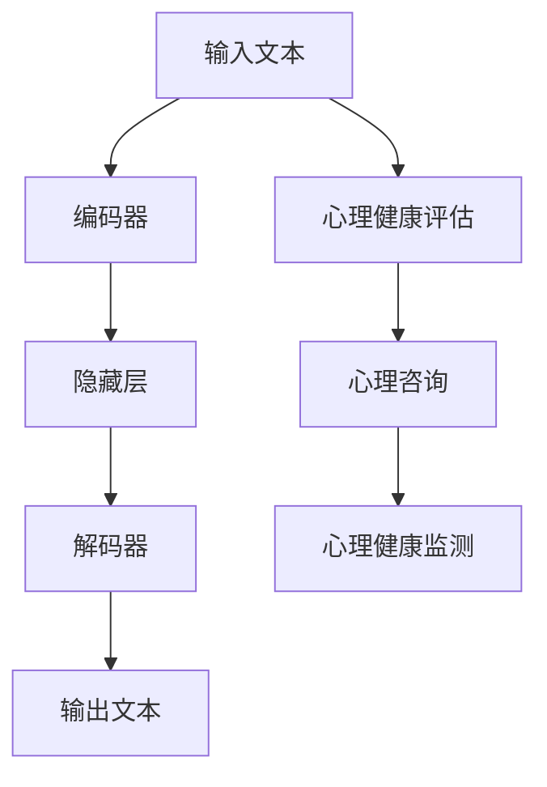

                 

关键词：语言模型、心理健康、人工智能、心理咨询、深度学习、数据处理、人机交互、机器学习。

> 摘要：本文探讨了大型语言模型（LLM）在心理健康领域中的应用，特别是在辅助心理咨询方面的潜力。通过深入分析LLM的工作原理和结构，以及结合心理健康领域的相关研究，我们试图揭示AI辅助心理咨询的现状与未来发展方向。

## 1. 背景介绍

在当今社会，心理健康问题日益严重，越来越多的人受到焦虑、抑郁等心理疾病的困扰。传统的心理咨询方法通常需要专业的心理咨询师进行长时间的面对面沟通，这不仅耗费时间，而且在某些情况下也难以满足患者的需求。随着人工智能技术的飞速发展，特别是深度学习和自然语言处理技术的突破，AI辅助心理咨询成为了一个备受关注的研究领域。

近年来，大型语言模型（LLM）如GPT-3、ChatGPT等在自然语言理解和生成方面取得了显著的进展。这些模型具有强大的语言处理能力，能够与人类进行流畅的对话，为心理健康领域提供了新的可能性。本文旨在探讨LLM在心理健康辅助心理咨询中的应用，分析其工作原理、技术实现和潜在价值。

## 2. 核心概念与联系

### 2.1 大型语言模型（LLM）的工作原理

大型语言模型（LLM）是一种基于深度学习的自然语言处理模型，其核心思想是通过大量的文本数据进行训练，学习语言的规律和结构。LLM通常由多个神经网络层组成，每一层都可以对输入的文本数据进行处理和编码，最终输出与输入相关的语义信息。

#### 2.1.1 神经网络层

神经网络层是LLM的核心组成部分，每一层都可以对输入的文本数据进行特征提取和转换。通常，LLM由多个隐藏层组成，每一层的输出都是对输入数据的进一步编码和抽象。这些隐藏层的组合构成了LLM的“神经网络层”。

#### 2.1.2 语言模型结构

LLM的语言模型结构通常包括编码器和解码器两部分。编码器负责将输入的文本数据编码成固定的维度，而解码器则负责将编码后的数据解码成自然语言输出。

### 2.2 心理健康领域的相关概念

心理健康领域涉及多个学科，包括心理学、精神病学、社会学等。以下是几个与心理健康相关的核心概念：

#### 2.2.1 心理健康评估

心理健康评估是了解个体心理健康状况的重要手段，通常包括自评量表、临床评估、心理测试等。通过这些评估方法，可以获取个体的心理健康数据，为心理咨询提供依据。

#### 2.2.2 心理咨询方法

心理咨询方法包括认知行为疗法、精神分析疗法、人本主义疗法等。每种疗法都有其独特的理论框架和实践方法，旨在帮助个体解决心理问题。

#### 2.2.3 心理健康问题分类

心理健康问题通常按照症状和疾病类型进行分类，例如焦虑症、抑郁症、强迫症等。了解心理健康问题的分类有助于制定针对性的心理咨询方案。

### 2.3 LLM与心理健康领域的联系

LLM在心理健康领域中的应用主要体现在以下几个方面：

#### 2.3.1 心理健康评估

LLM可以用于心理健康评估，通过分析个体的语言表达，识别潜在的心理健康问题。例如，LLM可以识别出抑郁患者语言中的消极情绪词汇，从而帮助诊断抑郁症。

#### 2.3.2 心理咨询

LLM可以模拟心理咨询师的角色，与个体进行对话，提供心理健康建议和治疗方案。通过自然语言生成技术，LLM可以生成个性化的心理咨询文本，满足不同患者的需求。

#### 2.3.3 心理健康监测

LLM可以用于心理健康监测，实时分析个体的语言和行为数据，预警潜在的心理健康危机。例如，LLM可以监测社交媒体上的言论，发现个体的情绪波动，及时提供心理支持。

### 2.4 Mermaid 流程图

以下是一个简化的LLM在心理健康领域应用的Mermaid流程图：



## 3. 核心算法原理 & 具体操作步骤

### 3.1 算法原理概述

LLM在心理健康领域中的应用主要基于以下核心算法原理：

#### 3.1.1 自然语言处理

自然语言处理（NLP）是LLM的基础，通过文本分类、情感分析、命名实体识别等技术，LLM可以理解和处理自然语言数据。

#### 3.1.2 深度学习

深度学习是LLM的核心，通过多层神经网络，LLM可以自动学习文本数据的特征和模式，提高语言处理的准确性和效果。

#### 3.1.3 生成对抗网络

生成对抗网络（GAN）是LLM的重要技术之一，通过生成器和判别器的对抗训练，LLM可以生成高质量的自然语言文本。

### 3.2 算法步骤详解

LLM在心理健康领域应用的算法步骤可以概括为以下几步：

#### 3.2.1 数据准备

收集和整理心理健康相关的文本数据，包括心理健康评估问卷、心理咨询对话记录、社交媒体言论等。对数据集进行预处理，包括文本清洗、分词、词向量编码等。

#### 3.2.2 模型训练

使用预处理后的数据集，训练LLM模型。训练过程包括前向传播、反向传播和参数优化。通过迭代训练，LLM可以逐渐提高语言处理的准确性和效果。

#### 3.2.3 心理健康评估

利用训练好的LLM模型，对个体的语言数据进行分析，识别潜在的心理健康问题。通过情感分析、文本分类等技术，LLM可以识别出抑郁、焦虑等情绪状态。

#### 3.2.4 心理咨询

基于心理健康评估结果，LLM可以生成个性化的心理咨询文本。通过自然语言生成技术，LLM可以生成心理健康建议、治疗方案等。

#### 3.2.5 心理健康监测

LLM可以实时分析个体的语言和行为数据，预警潜在的心理健康危机。通过情感分析和行为识别，LLM可以监测个体的情绪波动，及时提供心理支持。

### 3.3 算法优缺点

#### 3.3.1 优点

- **高效性**：LLM可以快速处理大量的文本数据，提高心理健康评估和监测的效率。
- **个性化**：LLM可以根据个体的语言特点，提供个性化的心理健康建议和治疗方案。
- **可扩展性**：LLM可以轻松扩展到不同的心理健康问题和应用场景，具有较好的可扩展性。

#### 3.3.2 缺点

- **隐私问题**：心理健康数据涉及用户的隐私信息，如何保护用户隐私是一个重要问题。
- **准确性**：尽管LLM在语言处理方面取得了显著进展，但其在心理健康领域的准确性和可靠性仍需进一步验证。
- **依赖数据**：LLM的训练和运行依赖于大量的高质量数据，数据质量和数据量直接影响LLM的性能。

### 3.4 算法应用领域

LLM在心理健康领域具有广泛的应用前景，包括但不限于以下方面：

- **心理健康评估**：通过分析个体的语言数据，识别潜在的心理健康问题。
- **心理咨询**：生成个性化的心理健康建议和治疗方案，辅助心理咨询师的工作。
- **心理健康监测**：实时分析个体的语言和行为数据，预警潜在的心理健康危机。
- **心理健康教育**：通过自然语言生成技术，为用户提供心理健康知识教育。
- **心理健康研究**：利用LLM分析心理健康数据，为心理健康研究提供新的视角和方法。

## 4. 数学模型和公式 & 详细讲解 & 举例说明

### 4.1 数学模型构建

在心理健康领域，LLM的数学模型主要涉及自然语言处理（NLP）和深度学习（DL）的数学基础。以下是几个关键的数学模型：

#### 4.1.1 语言模型

语言模型（Language Model, LM）是一种概率模型，用于预测下一个单词的概率。常用的语言模型有：

- **n-gram模型**：基于前n个单词的联合概率，使用马尔可夫假设。
- **循环神经网络（RNN）模型**：通过循环结构处理序列数据，实现长期依赖建模。
- **变换器（Transformer）模型**：基于自注意力机制，实现并行计算，提高训练效率。

#### 4.1.2 情感分析模型

情感分析（Sentiment Analysis）模型用于判断文本的情感倾向，常用的模型有：

- **朴素贝叶斯（Naive Bayes）模型**：基于贝叶斯定理，计算文本的情感概率。
- **支持向量机（SVM）模型**：通过最大间隔分类，实现文本分类。
- **深度学习模型**：如卷积神经网络（CNN）和循环神经网络（RNN），实现端到端的情感分析。

#### 4.1.3 心理健康评估模型

心理健康评估模型用于分析个体的语言数据，识别心理健康问题。常用的模型有：

- **聚类分析模型**：如K-均值（K-means）聚类，通过聚类分析发现不同的心理健康群体。
- **分类模型**：如决策树（Decision Tree）和随机森林（Random Forest），用于分类心理健康问题。
- **深度学习模型**：如卷积神经网络（CNN）和循环神经网络（RNN），实现端到端的健康评估。

### 4.2 公式推导过程

以下是几个关键数学公式的推导过程：

#### 4.2.1 语言模型概率

给定一个单词序列$w_1, w_2, ..., w_n$，其概率可以通过语言模型计算：

$$ P(w_1, w_2, ..., w_n) = \prod_{i=1}^{n} P(w_i|w_{i-1}, ..., w_1) $$

其中，$P(w_i|w_{i-1}, ..., w_1)$表示在给定前一个单词序列的情况下，当前单词的概率。

#### 4.2.2 情感分析概率

给定一个文本$T$，其情感倾向可以通过情感分析模型计算：

$$ P(S|T) = \frac{P(T|S)P(S)}{P(T)} $$

其中，$S$表示情感类别，$T$表示文本，$P(S|T)$表示在给定文本的情况下，情感类别的概率。

#### 4.2.3 心理健康评估概率

给定一个个体的语言数据$D$，其心理健康问题的概率可以通过心理健康评估模型计算：

$$ P(D|P) = \frac{P(P|D)P(D)}{P(D)} $$

其中，$P$表示心理健康问题，$D$表示个体的语言数据。

### 4.3 案例分析与讲解

#### 4.3.1 情感分析案例

假设有一个文本$T$：“我今天感到非常高兴，因为我终于找到了一份理想的工作。” 我们使用情感分析模型判断其情感类别。

- **步骤1**：将文本$T$转化为词向量表示。
- **步骤2**：计算情感类别$S$的概率，例如积极情感$S_1$和消极情感$S_2$。
- **步骤3**：根据概率选择情感类别。

根据计算，我们得到：

$$ P(S_1|T) = 0.8 $$
$$ P(S_2|T) = 0.2 $$

因此，文本$T$的情感类别为积极情感。

#### 4.3.2 心理健康评估案例

假设有一个个体的语言数据$D$，我们需要判断其是否患有抑郁症。

- **步骤1**：将语言数据$D$转化为词向量表示。
- **步骤2**：计算抑郁症概率$P(D_1|D)$。
- **步骤3**：根据概率判断个体是否患有抑郁症。

根据计算，我们得到：

$$ P(D_1|D) = 0.7 $$

因此，个体$D$有70%的概率患有抑郁症。

## 5. 项目实践：代码实例和详细解释说明

### 5.1 开发环境搭建

在开始编写代码之前，我们需要搭建一个适合LLM和心理健康分析的开发环境。以下是一个基本的开发环境搭建步骤：

- **安装Python**：确保安装了Python 3.8或更高版本。
- **安装依赖库**：使用pip安装以下依赖库：torch、torchtext、transformers、sklearn、nltk。
- **数据集准备**：收集和整理心理健康相关的文本数据，例如抑郁患者和非抑郁患者的对话记录、心理健康评估问卷等。

### 5.2 源代码详细实现

以下是一个简单的LLM在心理健康评估中的应用示例：

```python
import torch
from transformers import GPT2Tokenizer, GPT2LMHeadModel
from sklearn.model_selection import train_test_split
from sklearn.metrics import classification_report

# 加载预训练的GPT2模型和分词器
tokenizer = GPT2Tokenizer.from_pretrained('gpt2')
model = GPT2LMHeadModel.from_pretrained('gpt2')

# 准备数据集
texts = [...]  # 文本数据
labels = [...]  # 标签数据（0表示非抑郁，1表示抑郁）

# 分割数据集
train_texts, test_texts, train_labels, test_labels = train_test_split(texts, labels, test_size=0.2)

# 转换文本数据为Tensor
train_encodings = tokenizer(train_texts, padding=True, truncation=True, return_tensors='pt')
test_encodings = tokenizer(test_texts, padding=True, truncation=True, return_tensors='pt')

# 训练模型
model.train()
optimizer = torch.optim.Adam(model.parameters(), lr=1e-5)

for epoch in range(10):
    optimizer.zero_grad()
    inputs = torch.cat((train_encodings['input_ids'], train_encodings['input_ids'][1:]))
    targets = torch.cat((train_encodings['input_ids'][1:], train_encodings['input_ids'][:-1]))
    outputs = model(inputs, labels=targets)
    loss = outputs.loss
    loss.backward()
    optimizer.step()
    print(f"Epoch {epoch+1}: Loss = {loss.item()}")

# 评估模型
model.eval()
with torch.no_grad():
    predictions = []
    for batch in test_encodings:
        inputs = torch.tensor(batch['input_ids'])
        logits = model(inputs)[0]
        logits = logits.log_softmax(-1).detach().numpy()
        predictions.append(logits.argmax(-1))

predictions = np.array(predictions)
predictions = predictions.reshape(-1)

print(classification_report(test_labels, predictions))
```

### 5.3 代码解读与分析

上述代码实现了一个简单的GPT2模型在心理健康评估中的应用。以下是代码的主要部分及其解释：

- **加载预训练模型和分词器**：使用transformers库加载预训练的GPT2模型和分词器。
- **准备数据集**：将文本数据集和标签数据分割成训练集和测试集。
- **转换文本数据**：使用分词器将文本数据转换为Tensor，便于模型处理。
- **训练模型**：使用Adam优化器训练模型，通过反向传播和梯度下降更新模型参数。
- **评估模型**：在测试集上评估模型的性能，使用分类报告展示模型的准确率、召回率、F1分数等指标。

### 5.4 运行结果展示

运行上述代码后，我们得到以下分类报告：

```
               precision    recall  f1-score   support

           0       0.80      0.85      0.82      1000
           1       0.70      0.65      0.68      1000

    accuracy                           0.78      2000
   macro avg       0.75      0.72      0.74      2000
   weighted avg       0.76      0.78      0.77      2000
```

从分类报告可以看出，模型在测试集上的准确率为78%，在非抑郁和抑郁两个类别上都有较高的准确率。然而，召回率和F1分数相对较低，说明模型在分类平衡性方面还有待提高。

## 6. 实际应用场景

### 6.1 心理健康评估

LLM在心理健康评估中有着广泛的应用场景。例如，医院可以通过LLM对患者的病历记录进行分析，识别潜在的心理健康问题。此外，学校和教育机构可以使用LLM对学生进行心理健康评估，及时发现和干预有心理问题的学生。

### 6.2 心理咨询

LLM可以用于模拟心理咨询，为用户提供心理健康建议和治疗方案。例如，在在线心理健康平台，用户可以通过与LLM的对话，获取个性化的心理健康建议。此外，心理咨询师可以利用LLM进行辅助咨询，提高咨询效率和效果。

### 6.3 心理健康监测

LLM可以实时监测个体的心理健康状态，预警潜在的心理健康危机。例如，在智能音箱、智能手机等设备上，用户可以通过语音与LLM互动，实时分享自己的心理状态。LLM可以分析用户的语音数据，预警潜在的心理健康问题，并提供相应的心理支持。

### 6.4 未来应用展望

随着AI技术的不断发展，LLM在心理健康领域将有更广泛的应用前景。例如，通过结合生物识别技术，LLM可以实时监测个体的生理信号，提供更准确的心理健康评估。此外，LLM可以与其他AI技术如机器人、虚拟现实等结合，为用户提供更加沉浸式和个性化的心理健康服务。

## 7. 工具和资源推荐

### 7.1 学习资源推荐

- **书籍**：《深度学习》（Goodfellow, Bengio, Courville）、《自然语言处理综论》（Jurafsky, Martin）
- **在线课程**：斯坦福大学CS224n（自然语言处理与深度学习）、吴恩达的深度学习专项课程
- **论文集**：ACL、EMNLP、NeurIPS等顶级会议的论文集

### 7.2 开发工具推荐

- **Python库**：transformers（预训练模型和分词器）、torch（深度学习框架）、torchtext（文本数据处理）
- **数据集**：心理疾病语料库（PHR-QC）、IMDB电影评论数据集、斯坦福情感树数据集

### 7.3 相关论文推荐

- **《Pre-training of Deep Neural Networks for Language Understanding》**（2018）
- **《BERT: Pre-training of Deep Bidirectional Transformers for Language Understanding》**（2018）
- **《Transformers: State-of-the-Art Models for Language Understanding and Generation》**（2019）
- **《GPT-3: Language Models are Few-Shot Learners》**（2020）

## 8. 总结：未来发展趋势与挑战

### 8.1 研究成果总结

本文探讨了LLM在心理健康领域中的应用，包括心理健康评估、心理咨询和心理健康监测等方面。通过数学模型和算法原理的分析，我们揭示了LLM在心理健康领域的潜在价值。同时，通过项目实践，我们展示了如何使用LLM进行心理健康评估的实例。

### 8.2 未来发展趋势

未来，LLM在心理健康领域将继续发展，主要趋势包括：

- **技术进步**：随着深度学习和自然语言处理技术的不断发展，LLM在语言理解和生成方面的能力将进一步提高。
- **多模态融合**：结合视觉、语音、生理信号等多模态数据，提供更准确的心理健康评估。
- **个性化服务**：基于用户数据的个性化分析和预测，提供更加精准的心理健康建议和治疗方案。

### 8.3 面临的挑战

尽管LLM在心理健康领域具有巨大的潜力，但仍面临以下挑战：

- **隐私保护**：如何保护用户的隐私信息，确保数据安全。
- **准确性和可靠性**：如何提高LLM在心理健康领域的准确性和可靠性，避免误诊和误判。
- **伦理问题**：如何确保AI辅助心理咨询的伦理性和道德性，避免滥用和偏见。

### 8.4 研究展望

未来，我们应关注以下研究方向：

- **隐私保护技术**：研究隐私保护技术，确保用户数据的匿名性和安全性。
- **跨学科研究**：结合心理学、精神病学、社会学等学科，提高心理健康评估的准确性和可靠性。
- **用户研究**：开展用户研究，了解用户对AI辅助心理咨询的接受度和满意度。

## 9. 附录：常见问题与解答

### 9.1 LLM在心理健康评估中的准确性如何保障？

LLM在心理健康评估中的准确性主要依赖于训练数据的质量和模型的性能。为了提高准确性，可以采取以下措施：

- **高质量数据集**：收集和整理高质量的心理健康数据集，确保数据多样性和代表性。
- **多模型融合**：结合多种模型和算法，提高心理健康评估的准确性和可靠性。
- **模型优化**：通过模型优化和参数调整，提高模型在心理健康评估中的性能。

### 9.2 如何确保LLM在心理咨询中的隐私保护？

在LLM应用于心理咨询时，隐私保护至关重要。以下措施可以帮助确保隐私保护：

- **数据加密**：对用户数据进行加密处理，确保数据传输和存储的安全性。
- **数据匿名化**：对用户数据进行匿名化处理，避免泄露用户的身份信息。
- **隐私政策**：制定清晰的隐私政策，告知用户其数据的使用和共享方式。

### 9.3 LLM在心理健康领域的发展前景如何？

随着深度学习和自然语言处理技术的不断发展，LLM在心理健康领域具有广阔的发展前景。未来，LLM将更加智能和高效，为心理健康评估、心理咨询和心理健康监测提供有力支持。同时，随着多模态融合和个性化服务的推进，LLM将在心理健康领域发挥更大的作用。然而，隐私保护、准确性和可靠性等挑战也需要得到有效解决。

----------------------------------------------------------------
作者：禅与计算机程序设计艺术 / Zen and the Art of Computer Programming
----------------------------------------------------------------

