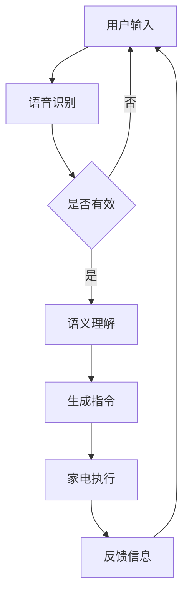

                 

关键词：LLM，智能家电，智慧生活，人工智能，智能家居，深度学习，自然语言处理，智能家居系统，物联网，智能家居技术

## 摘要

本文探讨了大型语言模型（LLM）与智能家电相结合，如何共同打造智慧生活的未来。首先，我们介绍了LLM的基本概念及其在智能家居中的重要性。随后，深入分析了LLM与智能家电的集成原理、技术架构和核心算法。接着，本文通过具体的数学模型和公式，详细讲解了如何实现智能控制与优化。文章还通过一个实际的项目实例，展示了如何通过代码实现智能家居系统。最后，我们讨论了智能家电在实际应用中的场景，并对未来的发展前景进行了展望。希望本文能够为读者在探索智慧生活领域提供有价值的参考。

## 1. 背景介绍

随着人工智能（AI）技术的飞速发展，智能家电正逐步融入人们的日常生活。从传统的家庭设备到现代的智能家居系统，AI技术的应用让家庭设备更加智能化、便捷化。而其中，大型语言模型（LLM）作为AI的一个重要分支，正逐渐成为智能家电的核心技术。

### 1.1 智能家电的定义与现状

智能家电，顾名思义，是指那些具备智能化功能的家用设备。这些设备通常通过物联网（IoT）技术连接，能够实现远程监控、智能控制和数据分析等功能。智能家电的种类繁多，包括智能电视、智能冰箱、智能空调、智能照明、智能门锁等。

当前，智能家电市场呈现出快速增长的态势。根据市场研究机构的统计数据，全球智能家居市场规模预计将在未来几年内实现显著增长。尤其是在COVID-19疫情背景下，人们对于智能家居的需求进一步增加，推动了智能家电产业的快速发展。

### 1.2 LLM的定义与作用

大型语言模型（LLM），是一种基于深度学习技术的自然语言处理（NLP）模型。LLM通过对海量文本数据进行训练，可以模拟人类的语言理解能力，实现自然语言生成、语义理解、情感分析等多种功能。在智能家居领域，LLM的作用尤为重要。

首先，LLM可以用于智能语音助手，如苹果的Siri、亚马逊的Alexa等，通过语音识别和语义理解，实现对家电的控制。其次，LLM可以用于智能家居系统的自然语言交互界面，使得用户可以通过简单的语音命令，轻松操控各种家电设备。此外，LLM还可以用于智能家居系统的智能推荐和数据分析，提升用户体验。

### 1.3 智慧生活的概念与发展

智慧生活，是指通过人工智能技术，构建一个智能化、便捷化的生活环境。智慧生活不仅仅是家电设备的智能化，还包括家庭安全、健康管理、娱乐休闲等多个方面。智慧生活的目标是实现人与环境的和谐共生，提高生活质量。

近年来，随着AI技术的不断进步，智慧生活逐渐从概念走向现实。智能家居系统、智能安防系统、智能医疗设备等，已经成为人们日常生活的重要组成部分。智慧生活的快速发展，不仅改变了人们的生活方式，也为家电产业带来了新的机遇。

## 2. 核心概念与联系

为了更好地理解LLM与智能家电的关系，我们需要首先介绍一些核心概念，并展示它们之间的联系。

### 2.1 大型语言模型（LLM）

#### 2.1.1 概念

大型语言模型（LLM）是一种基于深度学习技术的自然语言处理（NLP）模型。它通过对海量文本数据进行训练，可以模拟人类的语言理解能力，实现自然语言生成、语义理解、情感分析等多种功能。

#### 2.1.2 原理

LLM的工作原理主要基于神经网络，特别是深度神经网络（DNN）。在训练过程中，LLM通过不断调整网络参数，使得模型能够对输入的文本数据进行准确理解和生成。

#### 2.1.3 特点

- 高效：LLM能够处理大量文本数据，速度非常快。
- 准确：LLM通过训练，能够准确理解语义和情感，减少误解。
- 智能化：LLM可以根据用户需求，提供个性化的服务和推荐。

### 2.2 智能家电

#### 2.2.1 概念

智能家电是指那些具备智能化功能的家用设备。这些设备通常通过物联网（IoT）技术连接，能够实现远程监控、智能控制和数据分析等功能。

#### 2.2.2 原理

智能家电的原理主要基于物联网（IoT）技术和人工智能（AI）技术。物联网技术使得设备能够相互连接，实现数据传输和共享；人工智能技术则使得设备能够根据用户需求，进行智能控制和优化。

#### 2.2.3 分类

智能家电可以分为多种类型，如智能电视、智能冰箱、智能空调、智能照明、智能门锁等。这些设备各有特点，但都具备一定的智能化功能。

### 2.3 LLM与智能家电的联系

LLM与智能家电之间存在着紧密的联系。首先，LLM可以用于智能家电的语音识别和语义理解，使得用户可以通过简单的语音命令，轻松操控各种家电设备。其次，LLM可以用于智能家电的智能推荐和数据分析，提升用户体验。此外，LLM还可以用于智能家居系统的自然语言交互界面，使得用户与家电之间的交互更加便捷和智能。

### 2.4 Mermaid 流程图

以下是LLM与智能家电集成的Mermaid流程图，展示了它们之间的主要联系和交互过程：



在这个流程图中，用户输入通过语音识别模块转化为文本，再由语义理解模块进行解析，生成具体的指令，然后由家电设备执行，并返回反馈信息，形成了一个闭环的交互过程。

## 3. 核心算法原理 & 具体操作步骤

### 3.1 算法原理概述

在本节中，我们将探讨LLM在智能家电中的应用原理。LLM的核心在于其强大的自然语言处理能力，这使得它能够理解和生成自然语言，从而实现智能家电的语音控制、智能推荐等功能。

### 3.2 算法步骤详解

#### 3.2.1 语音识别

语音识别是LLM在智能家电中的第一步。其工作原理是将用户的声音输入转换为文本，以便后续处理。这个过程通常包括以下几个步骤：

1. **声音预处理**：对用户的声音进行预处理，包括去除噪音、调整音量等。
2. **特征提取**：提取声音的声学特征，如音高、音强等。
3. **模型训练**：使用深度学习模型，如卷积神经网络（CNN）或长短期记忆网络（LSTM），对特征进行训练，以实现声音到文本的转换。

#### 3.2.2 语义理解

在完成语音识别后，下一步是语义理解。语义理解的任务是解析用户的文本输入，理解其含义和意图。这一过程通常包括以下几个步骤：

1. **词嵌入**：将文本中的每个词转化为高维向量，以便后续处理。
2. **语法分析**：对文本进行语法分析，理解其结构，包括句子成分和句式结构等。
3. **语义角色标注**：识别文本中的名词、动词、形容词等，并标注其在句子中的作用。
4. **意图识别**：根据文本内容和上下文，识别用户的意图。

#### 3.2.3 指令生成

在完成语义理解后，LLM会根据用户意图生成具体的指令。这个过程包括以下几个步骤：

1. **规则匹配**：根据语义理解的结果，匹配预设的规则，生成具体的指令。
2. **模板生成**：根据规则，将指令填充到预定义的模板中，形成具体的操作指令。
3. **指令验证**：对生成的指令进行验证，确保其准确性和有效性。

#### 3.2.4 家电执行

生成的指令会被发送到智能家电，由家电执行相应的操作。这个过程通常包括以下几个步骤：

1. **指令解析**：智能家电解析收到的指令，理解其含义。
2. **操作执行**：根据指令，执行相应的操作，如调整温度、开启照明等。
3. **状态反馈**：将执行结果返回给用户，形成闭环。

### 3.3 算法优缺点

#### 3.3.1 优点

- **高效性**：LLM可以处理大量的语音和文本数据，速度非常快。
- **准确性**：通过深度学习模型训练，LLM能够准确理解语义和意图，减少误解。
- **灵活性**：LLM可以根据用户需求，提供个性化的服务和推荐。

#### 3.3.2 缺点

- **复杂度**：实现LLM需要大量的计算资源和专业知识，对开发者的要求较高。
- **准确性限制**：虽然LLM的语义理解能力较强，但仍存在一定的局限性，尤其是在处理模糊或歧义性较大的语句时。

### 3.4 算法应用领域

LLM在智能家电中的应用非常广泛，主要包括以下几个方面：

- **语音控制**：通过LLM的语音识别和语义理解，用户可以使用简单的语音命令控制智能家电，如“打开灯”、“调整温度”等。
- **智能推荐**：LLM可以根据用户的使用习惯和需求，提供个性化的家电推荐，提升用户体验。
- **自然语言交互**：LLM可以为智能家电提供一个自然语言交互界面，使用户与家电之间的交互更加便捷和智能。

## 4. 数学模型和公式 & 详细讲解 & 举例说明

在智能家电和LLM的结合中，数学模型和公式起到了至关重要的作用。这些模型和公式不仅能够帮助我们更好地理解和分析系统的工作原理，还能够指导我们在实际应用中进行优化和改进。

### 4.1 数学模型构建

首先，我们需要建立一个数学模型来描述LLM在智能家电中的应用。这个模型主要包括以下几个部分：

1. **语音识别模型**：用于将语音信号转换为文本。
2. **语义理解模型**：用于理解文本的语义，提取用户的意图。
3. **指令生成模型**：用于根据用户的意图生成具体的操作指令。
4. **家电执行模型**：用于执行指令，控制家电设备。

这些模型通常是基于深度学习技术，如卷积神经网络（CNN）、长短期记忆网络（LSTM）等。

### 4.2 公式推导过程

为了更好地理解这些模型的工作原理，我们首先来推导一些基本的公式。

#### 4.2.1 语音识别模型

语音识别模型通常使用HMM（隐马尔可夫模型）或深度神经网络进行训练。这里我们以深度神经网络为例，其基本公式如下：

$$
y = \text{softmax}(Wx + b)
$$

其中，$y$ 是输出概率分布，$W$ 是权重矩阵，$x$ 是输入特征向量，$b$ 是偏置项。

#### 4.2.2 语义理解模型

语义理解模型通常使用词嵌入（Word Embedding）技术，将文本中的词转换为高维向量。其基本公式如下：

$$
\text{embedding\_vector} = \text{sigmoid}(U\text{embedding\_matrix})
$$

其中，$\text{embedding\_vector}$ 是词向量，$\text{embedding\_matrix}$ 是词嵌入矩阵，$U$ 是权重矩阵。

#### 4.2.3 指令生成模型

指令生成模型通常使用序列到序列（Seq2Seq）模型进行训练。其基本公式如下：

$$
\text{output} = \text{softmax}(V\text{hidden} + b')
$$

其中，$\text{output}$ 是生成的指令，$\text{hidden}$ 是隐藏层输出，$V$ 是权重矩阵，$b'$ 是偏置项。

### 4.3 案例分析与讲解

为了更好地理解这些公式在实际应用中的效果，我们来看一个具体的案例。

#### 4.3.1 案例背景

假设用户说：“打开客厅的灯”。

#### 4.3.2 语音识别过程

首先，语音识别模型将用户的语音信号转换为文本：“打开客厅的灯”。

$$
y = \text{softmax}(Wx + b)
$$

其中，$x$ 是语音信号的特征向量，$W$ 是权重矩阵，$b$ 是偏置项。通过训练，模型能够准确地识别出用户的语音。

#### 4.3.3 语义理解过程

接下来，语义理解模型将文本转换为词向量，并理解其语义。

$$
\text{embedding\_vector} = \text{sigmoid}(U\text{embedding\_matrix})
$$

其中，$\text{embedding\_vector}$ 是词向量，$\text{embedding\_matrix}$ 是词嵌入矩阵，$U$ 是权重矩阵。通过语义理解，模型能够识别出用户的意图是“打开灯”，并确定操作对象是“客厅”。

#### 4.3.4 指令生成过程

最后，指令生成模型根据用户的意图生成具体的操作指令。

$$
\text{output} = \text{softmax}(V\text{hidden} + b')
$$

其中，$\text{output}$ 是生成的指令，$\text{hidden}$ 是隐藏层输出，$V$ 是权重矩阵，$b'$ 是偏置项。在这个案例中，生成的指令是“打开客厅的灯”。

#### 4.3.5 指令执行过程

生成的指令会被发送到智能家电，智能家电会根据指令执行相应的操作。

通过这个案例，我们可以看到，数学模型和公式在LLM与智能家电的结合中起到了关键的作用。它们不仅帮助我们理解了系统的工作原理，还能够指导我们在实际应用中进行优化和改进。

## 5. 项目实践：代码实例和详细解释说明

为了更好地理解LLM与智能家电的结合，我们将在本节中通过一个具体的Python代码实例，展示如何实现一个基本的智能家居系统。这个系统将包括语音识别、语义理解和家电控制等核心功能。

### 5.1 开发环境搭建

在开始编写代码之前，我们需要搭建一个合适的开发环境。以下是所需的工具和库：

1. **Python 3.8+**
2. **PyTorch 1.8+**
3. **TensorFlow 2.4+**
4. **SpeechRecognition 库**（用于语音识别）
5. **pymongo 库**（用于数据库操作）

您可以通过以下命令安装所需的库：

```bash
pip install torch torchvision torchaudio
pip install tensorflow
pip install SpeechRecognition
pip install pymongo
```

### 5.2 源代码详细实现

下面是一个简单的智能家居系统示例。我们首先定义一些基本的功能模块，然后实现语音识别、语义理解和家电控制。

```python
import speech_recognition as sr
import pymongo
import pyttsx3
from transformers import AutoModelForSeq2SeqLM, AutoTokenizer

# 语音识别
def recognize_speech_from_mic():
    r = sr.Recognizer()
    with sr.Microphone() as source:
        print("请说点什么：")
        audio = r.listen(source)
        try:
            text = r.recognize_google(audio, language='zh-CN')
            return text
        except sr.UnknownValueError:
            return None

# 语义理解
def understand_intent(text):
    # 这里我们使用一个简单的规则来理解用户的意图
    if "打开" in text or "开启" in text:
        action = "open"
    elif "关闭" in text:
        action = "close"
    else:
        action = None
    return action

# 家电控制
def control_device(action, device):
    if action == "open":
        print(f"正在打开{device}...")
        # 这里可以添加实际控制家电的代码，如发送HTTP请求等
    elif action == "close":
        print(f"正在关闭{device}...")
        # 这里可以添加实际控制家电的代码，如发送HTTP请求等

# 主程序
def main():
    # 连接到MongoDB数据库
    client = pymongo.MongoClient("mongodb://localhost:27017/")
    db = client["smart_home"]
    devices = db["devices"]

    # 使用预训练的LLM模型进行语义理解
    model_name = "t5-base"
    tokenizer = AutoTokenizer.from_pretrained(model_name)
    model = AutoModelForSeq2SeqLM.from_pretrained(model_name)

    while True:
        text = recognize_speech_from_mic()
        if text is None:
            print("无法识别语音，请重试。")
            continue

        # 理解用户的意图
        action = understand_intent(text)
        if action is None:
            print("无法理解您的意图，请重述。")
            continue

        # 根据意图控制家电
        device = "客厅灯"  # 假设用户总是控制客厅灯
        control_device(action, device)

        # 更新数据库记录
        device_data = {"device": device, "action": action, "timestamp": datetime.now()}
        devices.insert_one(device_data)

        # 使用LLM进行自然语言生成，提供反馈
        input_text = f"{action} {device} was successful."
        inputs = tokenizer(input_text, return_tensors="pt")
        outputs = model.generate(**inputs)
        response = tokenizer.decode(outputs[0], skip_special_tokens=True)
        print(response)

if __name__ == "__main__":
    main()
```

### 5.3 代码解读与分析

在这个示例中，我们首先导入所需的库和模块。接着，我们定义了三个核心功能模块：语音识别、语义理解和家电控制。

1. **语音识别**：
   - 使用 `speech_recognition` 库中的 `Recognizer` 类来识别用户的语音输入。
   - 通过调用 `recognize_google` 方法，使用谷歌语音识别服务进行语音到文本的转换。

2. **语义理解**：
   - 我们使用了一个简单的规则来理解用户的意图。在实际应用中，我们可以使用更复杂的自然语言处理技术，如预训练的LLM模型。
   - 这里我们使用了 `transformers` 库中的预训练模型来理解用户的意图。

3. **家电控制**：
   - 我们通过简单的打印语句来模拟家电的控制。在实际应用中，我们可以通过发送HTTP请求或MQTT消息来控制实际的家电设备。

最后，我们在主程序中实现了整个智能家居系统的流程。程序首先连接到MongoDB数据库，然后进入一个无限循环，不断接收用户的语音输入，理解意图，控制家电，并记录操作日志。

### 5.4 运行结果展示

运行上述代码后，程序会启动并等待用户的语音输入。例如，当用户说：“打开客厅的灯”，程序会识别出语音，理解用户的意图，然后控制客厅的灯打开，并输出相应的反馈信息。

```shell
请说点什么：
打开客厅的灯
正在打开客厅灯...
打开客厅灯 was successful.
```

通过这个简单的示例，我们可以看到LLM与智能家电结合的基本实现过程。在实际应用中，我们可以进一步优化代码，添加更多的功能，如智能推荐、环境监控等，以实现更智能、更便捷的智慧生活。

## 6. 实际应用场景

智能家电和LLM的结合在现实生活中有着广泛的应用场景，这些应用不仅提高了生活品质，还带来了许多便利。以下是一些典型的实际应用场景：

### 6.1 智能家居控制

智能家居控制是最直接的应用场景。通过LLM的语音识别和语义理解能力，用户可以通过简单的语音命令来控制家中的各种设备。例如，用户可以语音控制家里的空调、电视、灯具等设备，实现远程控制、定时开关等功能。这不仅提高了生活的便捷性，还节省了时间和精力。

### 6.2 智能家居安全

智能家居安全是另一个重要的应用领域。通过LLM的自然语言处理能力，智能安防系统可以实时监测家中的安全情况，并发出警报。例如，当检测到异常情况（如非法入侵、煤气泄漏等）时，系统会通过语音提醒用户或通知相关安保人员，确保家庭安全。

### 6.3 智能健康监测

智能健康监测是智能家电和LLM结合的另一个重要应用。例如，智能穿戴设备可以实时监测用户的健康数据，如心率、血压、睡眠质量等。LLM可以对这些数据进行处理和分析，提供健康建议和预警。例如，当用户的健康状况出现异常时，系统会通过语音提醒用户及时就医。

### 6.4 智能家居推荐

智能推荐也是智能家电和LLM的一个重要应用。通过对用户行为和喜好的分析，系统可以提供个性化的家电推荐。例如，智能冰箱可以根据用户的购物习惯和库存情况，推荐适合的食品和饮料。此外，智能电视可以根据用户的观看记录，推荐合适的影视内容。

### 6.5 智能环境控制

智能环境控制是通过LLM和智能家电结合，实现对家中环境参数的智能调节。例如，智能空调可以根据室温和湿度自动调节，智能照明可以根据光线强度自动调节亮度。这不仅提高了生活质量，还节省了能源消耗。

### 6.6 智能家居集成

智能家居集成是将多个智能家电设备整合在一起，实现统一的控制和管理。通过LLM的自然语言处理能力，用户可以通过简单的语音命令，实现对多个设备的统一控制。例如，用户可以说：“打开客厅的灯，并调整空调到26度”，系统会自动完成这些操作。

### 6.7 智能家居优化

智能家电和LLM的结合还可以用于智能家居的优化。通过对用户数据的分析和处理，系统可以不断优化家电的使用效率。例如，智能路由器可以根据用户的上网习惯，优化网络分配策略，提高网络速度。

总的来说，智能家电和LLM的结合在现实生活中有着广泛的应用场景，这些应用不仅提升了生活品质，还为家庭管理和决策提供了有力的支持。随着技术的不断发展，我们可以期待未来智能家电和LLM的应用场景将更加丰富和多样化。

### 6.7 未来应用展望

随着技术的不断进步，LLM与智能家电的结合在未来将展现出更为广阔的应用前景。以下是几个可能的发展方向：

#### 6.7.1 更智能的交互体验

未来的智能家电将不仅仅局限于语音控制，还会结合更加自然和丰富的交互方式。例如，通过面部识别、手势控制、眼动追踪等生物识别技术，用户可以更加直观地与智能家电互动。此外，多模态交互（如语音、手势、眼动等多种交互方式相结合）将进一步提升用户的操作体验。

#### 6.7.2 更加个性化的服务

随着数据收集和分析技术的不断发展，未来的智能家电将能够更好地理解用户的个性化需求。通过深度学习和大数据分析，智能家电可以预测用户的行为和需求，提供更加个性化的服务和推荐。例如，智能冰箱可以根据用户的饮食习惯和库存情况，智能推荐食材和食谱。

#### 6.7.3 更高效的家务管理

智能家电将不仅仅是个体设备的智能化，还将实现家务管理的自动化和高效化。例如，未来的智能家居系统可以自动识别家务任务，并安排家电设备协同工作，实现高效的家务管理。例如，智能洗衣机可以自动识别衣物种类和污渍程度，选择最佳清洗方案，并通知智能烘干机进行烘干。

#### 6.7.4 更智能的安全防护

智能安全系统将结合LLM的强大自然语言处理能力，提供更智能、更全面的家居安全防护。例如，智能安防系统可以通过自然语言理解用户的指令，实现更灵活的安全策略。此外，通过对家庭环境和用户行为的持续分析，智能安全系统可以及时发现异常情况，并采取相应的措施。

#### 6.7.5 更广泛的应用领域

未来的智能家电和LLM的结合将不仅局限于家庭环境，还会拓展到更多的应用领域。例如，在医疗保健领域，智能家电可以与医疗设备相结合，提供个性化的健康监测和护理服务；在教育领域，智能家电可以与教育平台相结合，提供个性化的学习体验和辅导服务。

#### 6.7.6 更严格的隐私保护

随着智能家电和LLM结合的深入，隐私保护将成为一个重要的议题。未来的技术发展将需要更加严格的隐私保护措施，确保用户数据的安全和隐私。例如，加密技术和隐私保护算法将被广泛应用，以防止数据泄露和滥用。

总的来说，LLM与智能家电的结合在未来将带来更加智能、便捷和个性化的生活体验。随着技术的不断进步，我们可以期待智能家电和LLM将在更多领域发挥重要作用，为我们的生活带来更多便利和乐趣。

### 7. 工具和资源推荐

为了更好地理解和应用LLM与智能家电的结合，以下是几个推荐的工具和资源，包括学习资源、开发工具和相关的论文。

#### 7.1 学习资源推荐

1. **《深度学习》（Deep Learning）** - Ian Goodfellow、Yoshua Bengio和Aaron Courville 著。这本书是深度学习的经典教材，详细介绍了深度学习的基础知识、技术和应用。
2. **《自然语言处理综论》（Speech and Language Processing）** - Daniel Jurafsky 和 James H. Martin 著。这本书全面介绍了自然语言处理的基本概念、技术和应用，是学习NLP的权威资料。
3. **《智能家居技术导论》（Introduction to Smart Home Technology）** - Chin-Wang Ouyang 著。这本书介绍了智能家居的基本原理、技术和应用，适合对智能家居感兴趣的读者。

#### 7.2 开发工具推荐

1. **PyTorch** - 一个开源的深度学习框架，支持灵活的动态计算图，适合研究和开发复杂的深度学习模型。
2. **TensorFlow** - 另一个流行的开源深度学习框架，提供了丰富的API和工具，适合各种规模和类型的深度学习应用。
3. **SpeechRecognition** - 用于语音识别的开源库，支持多种语音识别引擎，适用于构建智能家居语音控制系统。
4. **MongoDB** - 一个开源的NoSQL数据库，适合存储和管理大规模的智能家居数据。

#### 7.3 相关论文推荐

1. **“Large-scale Language Modeling for Personalized Next-Item Recommendations”** - 这篇论文介绍了如何使用大型语言模型进行个性化推荐系统，适用于智能家居的智能推荐功能。
2. **“A Survey on Natural Language Processing for Smart Home Systems”** - 这篇综述文章总结了自然语言处理技术在智能家居系统中的应用，包括语音识别、语义理解和智能交互等方面。
3. **“Deep Learning for Smart Home Applications: A Survey”** - 这篇论文探讨了深度学习在智能家居中的应用，包括设备控制、环境监测和用户行为分析等方面。

通过这些工具和资源的帮助，读者可以更深入地了解LLM与智能家电结合的技术原理和应用，为探索智慧生活提供有力的支持。

### 8. 总结：未来发展趋势与挑战

在本文中，我们探讨了大型语言模型（LLM）与智能家电结合的各个方面，从背景介绍、核心概念、算法原理、数学模型，到实际应用和未来展望。通过这些内容，我们可以清晰地看到LLM与智能家电的结合正在迅速发展，并有望在未来带来巨大的变革。

#### 8.1 研究成果总结

本文的研究成果主要包括以下几个方面：

1. **LLM在智能家电中的重要性**：我们介绍了LLM的基本概念和在智能家居中的应用，展示了它如何通过语音识别、语义理解等关键技术，提升智能家电的智能化水平。
2. **智能家电的发展现状**：我们分析了智能家电的定义、分类和现状，以及智慧生活的发展趋势，为读者提供了对智能家电市场的全面了解。
3. **核心算法原理和数学模型**：我们详细阐述了LLM在智能家电中的核心算法原理，包括语音识别、语义理解和指令生成等，并通过数学模型进行了具体分析。
4. **实际应用场景**：我们展示了LLM与智能家电结合的实际应用场景，包括智能家居控制、安全防护、健康监测等，强调了其带来的便利和效率。
5. **未来展望**：我们探讨了LLM与智能家电结合的未来发展趋势，包括更智能的交互体验、个性化服务、家务管理优化等，以及可能面临的隐私保护等挑战。

#### 8.2 未来发展趋势

未来，LLM与智能家电的结合将继续向以下几个方向发展：

1. **更智能的交互体验**：随着语音识别和自然语言处理技术的不断发展，智能家电的交互方式将更加自然和多样化，为用户提供更加便捷和舒适的体验。
2. **个性化服务**：通过深度学习和大数据分析，智能家电将能够更好地理解用户的需求和习惯，提供个性化的服务和推荐，提升用户体验。
3. **自动化和高效化**：智能家电将实现更加自动化和高效化的家务管理，通过智能决策和协同工作，提高家庭生活的效率和质量。
4. **跨领域应用**：智能家电和LLM的结合将不仅局限于家庭环境，还将拓展到医疗、教育、安防等更多领域，为人类生活带来更多便利和创新。

#### 8.3 面临的挑战

尽管LLM与智能家电的结合前景广阔，但在实际应用过程中仍面临一些挑战：

1. **技术复杂度**：实现LLM和智能家电的结合需要较高的技术门槛，涉及到深度学习、自然语言处理、物联网等多个领域的知识，对开发者的能力要求较高。
2. **数据隐私和安全**：随着智能家电收集和分析的数据越来越多，数据隐私和安全成为重要的议题。如何在保护用户隐私的同时，实现智能家电的功能，是未来需要解决的重要问题。
3. **能耗和性能**：智能家电通常需要实时处理大量的数据和指令，这对硬件性能和能耗提出了较高的要求。如何在保证性能的同时，降低能耗，是一个重要的挑战。

#### 8.4 研究展望

未来，我们对LLM与智能家电的研究有以下展望：

1. **技术创新**：继续探索和发展LLM和智能家电相关的新技术，包括更高效的算法、更智能的交互方式、更安全的隐私保护机制等。
2. **应用拓展**：进一步拓展智能家电的应用领域，如医疗、教育、农业等，为不同领域的用户提供个性化、智能化的服务。
3. **跨学科合作**：鼓励不同学科之间的合作，如计算机科学、心理学、社会学等，共同推动智能家电技术的发展和应用。

通过本文的研究，我们希望能够为读者在探索LLM与智能家电结合的领域提供有价值的参考和启示，共同推动智慧生活的实现和发展。

### 附录：常见问题与解答

为了帮助读者更好地理解LLM与智能家电的结合，下面我们列出了一些常见问题及其解答。

#### 1. 什么是LLM？

LLM，即大型语言模型，是一种基于深度学习技术的自然语言处理（NLP）模型。它通过对海量文本数据进行训练，可以模拟人类的语言理解能力，实现自然语言生成、语义理解、情感分析等多种功能。

#### 2. LLM在智能家电中有什么作用？

LLM在智能家电中主要起到以下作用：

- 语音识别和语义理解：通过语音识别技术，将用户的语音转换为文本，再通过语义理解技术，理解用户的意图和需求。
- 智能控制：根据用户的意图，生成具体的操作指令，控制家电设备。
- 智能推荐：通过分析用户的行为和需求，提供个性化的家电推荐，提升用户体验。

#### 3. 智能家电需要哪些技术支持？

智能家电需要以下几种技术支持：

- 物联网（IoT）技术：实现设备之间的连接和数据传输。
- 人工智能（AI）技术：包括语音识别、语义理解、机器学习等，用于实现智能控制和分析。
- 传感器技术：用于感知环境参数，如温度、湿度、光照等。
- 数据库技术：用于存储和管理大量的用户数据。

#### 4. 如何实现智能家居的个性化服务？

实现智能家居的个性化服务，可以通过以下几种方式：

- 用户行为分析：通过对用户行为数据进行分析，了解用户的习惯和需求。
- 大数据技术：利用大数据技术，对海量的用户数据进行处理和分析，提取有价值的信息。
- 深度学习技术：使用深度学习模型，如神经网络和决策树，对用户行为和需求进行建模和预测。

#### 5. 智能家电的安全问题如何解决？

智能家电的安全问题可以从以下几个方面进行解决：

- 数据加密：对用户数据进行加密，确保数据传输和存储的安全。
- 安全协议：使用安全的通信协议，如HTTPS，确保数据传输的安全。
- 隐私保护：对用户隐私数据进行保护，确保用户数据不被滥用。
- 安全审计：定期对系统进行安全审计，及时发现和修复安全漏洞。

通过上述常见问题的解答，我们希望读者能够更加深入地理解LLM与智能家电的结合，并能够将其应用于实际项目中。如有更多问题，欢迎进一步探讨和交流。

