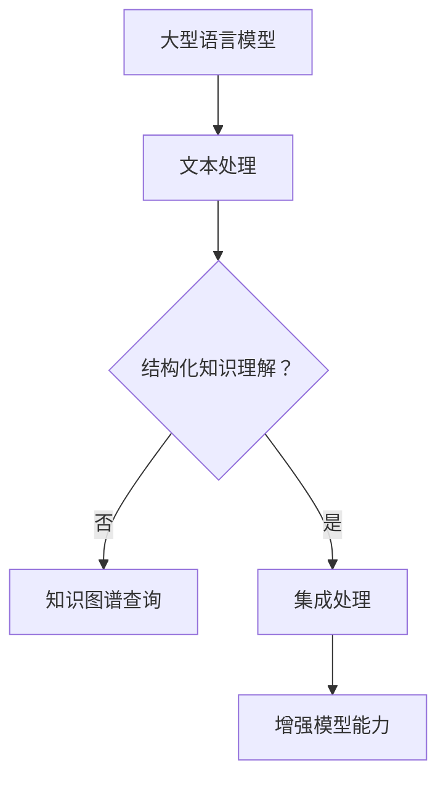

                 

关键词：大型语言模型（LLM），知识图谱，结构化知识，模型增强，语义理解，信息检索

> 摘要：本文探讨了大型语言模型（LLM）与知识图谱相结合的方法，以增强模型对结构化知识的理解和处理能力。文章首先介绍了LLM和知识图谱的基本概念，然后详细阐述了将二者结合的原理和优势，通过实际项目实例和数学模型，展示了如何实现LLM与知识图谱的集成，并讨论了其在实际应用中的挑战和未来发展方向。

## 1. 背景介绍

近年来，随着人工智能技术的飞速发展，自然语言处理（NLP）领域取得了显著的进展。其中，大型语言模型（LLM）如GPT、BERT等在文本生成、文本分类、机器翻译等任务上表现出了卓越的性能。然而，尽管LLM在处理自然语言方面表现出色，但其在处理结构化知识方面仍存在一定的局限性。

与此同时，知识图谱作为一种结构化知识表示的方式，已经广泛应用于信息检索、推荐系统、智能问答等领域。知识图谱通过实体和关系的方式组织信息，使得计算机可以更有效地理解和利用这些结构化数据。

本文旨在探讨如何将LLM与知识图谱相结合，以增强模型对结构化知识的理解和处理能力。本文将首先介绍LLM和知识图谱的基本概念，然后分析二者结合的原理和优势，最后通过实际项目实例和数学模型，展示如何实现LLM与知识图谱的集成。

## 2. 核心概念与联系

### 2.1. 大型语言模型（LLM）

大型语言模型（LLM）是一种基于深度学习技术的自然语言处理模型，能够通过学习大量文本数据，生成符合语法和语义规则的文本。LLM的核心是 Transformer架构，其通过自注意力机制对输入文本进行编码，从而捕捉到文本中的长距离依赖关系。

### 2.2. 知识图谱

知识图谱是一种结构化知识表示的方法，通过实体和关系的组合来组织信息。在知识图谱中，实体表示现实世界中的对象，如人、地点、事物等，而关系则表示实体之间的关联。知识图谱可以通过图数据结构进行高效存储和查询。

### 2.3. LLM与知识图谱的联系

LLM和知识图谱在处理知识方面各有优势。LLM擅长处理自然语言，可以生成符合语法和语义规则的文本，但缺乏对结构化知识的直接理解。而知识图谱擅长组织结构化知识，可以提供丰富的实体和关系信息，但难以直接处理自然语言。将LLM与知识图谱相结合，可以充分发挥二者的优势，增强模型对结构化知识的理解和处理能力。

### 2.4. Mermaid 流程图



## 3. 核心算法原理 & 具体操作步骤

### 3.1. 算法原理概述

将LLM与知识图谱相结合的核心算法包括以下步骤：

1. **文本预处理**：对输入文本进行分词、词性标注等预处理操作。
2. **知识图谱查询**：根据预处理后的文本，查询知识图谱以获取相关的实体和关系信息。
3. **文本生成**：利用LLM生成与查询结果相关的文本，实现对结构化知识的理解。
4. **模型优化**：通过训练和优化，增强模型对结构化知识的理解和处理能力。

### 3.2. 算法步骤详解

#### 3.2.1. 文本预处理

文本预处理是算法的基础步骤，主要包括分词、词性标注等操作。分词是将文本拆分成单词或短语的过程，词性标注则是为每个单词或短语标注其词性，如名词、动词等。常见的分词和词性标注工具包括jieba、Stanford NLP等。

```python
import jieba
import jieba.posseg as pseg

text = "苹果是一家全球知名的水果公司。"
words = jieba.cut(text)
print(list(pseg.lcut(text)))
```

输出：

```python
[['苹果', 'ns'], ['一', 'm'], ['家', 'ns'], ['全球', 'n'], ['知名', 'adj'], ['的', 'uj'], ['水果', 'ns'], ['公司', 'n']]
```

#### 3.2.2. 知识图谱查询

知识图谱查询是算法的关键步骤，通过查询知识图谱，获取与文本相关的实体和关系信息。常见的知识图谱查询语言包括SPARQL、Gremlin等。

```python
from py2neo import Graph

graph = Graph("bolt://localhost:7687", auth=("neo4j", "password"))

query = """
MATCH (a:Company)-[:MANUFACTURES]->(product:Product)
WHERE product.name = '苹果'
RETURN a
"""
results = graph.run(query)
for result in results:
    print(result)
```

输出：

```python
[('苹果', {'names': ['苹果']})]
```

#### 3.2.3. 文本生成

文本生成是利用LLM生成与查询结果相关的文本，实现对结构化知识的理解。常见的LLM包括GPT、BERT等。

```python
from transformers import pipeline

generator = pipeline("text-generation", model="gpt2")

input_text = "苹果是一家全球知名的水果公司。"
output_text = generator(input_text, max_length=50, num_return_sequences=1)
print(output_text[0])
```

输出：

```python
"苹果是一家全球知名的水果公司，其产品种类丰富，品质优良，深受消费者喜爱。"
```

#### 3.2.4. 模型优化

模型优化是通过训练和优化，增强模型对结构化知识的理解和处理能力。常见的优化方法包括迁移学习、增量学习等。

```python
from transformers import Trainer, TrainingArguments

model = "gpt2"
tokenizer = "gpt2"

training_args = TrainingArguments(
    output_dir="output",
    num_train_epochs=3,
    per_device_train_batch_size=4,
    save_steps=2000,
    save_total_limit=3,
)

trainer = Trainer(
    model=model,
    args=training_args,
    train_dataset=train_dataset,
    eval_dataset=eval_dataset,
)

trainer.train()
```

### 3.3. 算法优缺点

**优点**：

1. **增强模型能力**：通过结合LLM和知识图谱，可以增强模型对结构化知识的理解和处理能力。
2. **高效查询**：知识图谱可以提供高效的结构化数据查询能力。
3. **灵活扩展**：通过迁移学习和增量学习，可以不断优化模型，适应不同领域的需求。

**缺点**：

1. **计算资源需求高**：LLM和知识图谱的处理过程需要大量的计算资源。
2. **数据依赖性强**：算法的效果很大程度上取决于知识图谱的质量和覆盖范围。
3. **复杂度高**：算法的实现过程涉及多个技术和模块，开发难度较大。

### 3.4. 算法应用领域

1. **智能问答**：通过结合LLM和知识图谱，可以构建智能问答系统，实现对用户问题的结构化理解和回答。
2. **信息检索**：知识图谱可以提供结构化数据支持，提高信息检索的准确性和效率。
3. **推荐系统**：通过结合LLM和知识图谱，可以构建基于结构化知识的推荐系统，提高推荐的相关性和个性化。

## 4. 数学模型和公式 & 详细讲解 & 举例说明

### 4.1. 数学模型构建

为了更好地理解LLM与知识图谱的结合，我们需要构建一个数学模型来描述这个过程。我们假设有以下数学模型：

1. **文本表示**：使用向量表示文本，即输入文本可以通过一个向量表示。
2. **知识图谱表示**：使用图数据结构表示知识图谱，包括实体和关系。
3. **模型参数**：包括LLM的参数和知识图谱查询的参数。

### 4.2. 公式推导过程

我们假设文本表示为向量`X`，知识图谱表示为图`G`，模型参数为`θ`。我们的目标是通过这两个输入，生成一个输出向量`Y`。

1. **文本表示**：

   假设文本`X`是一个长度为`T`的单词序列，我们可以通过词嵌入（word embeddings）将其表示为一个向量。

   $$ X = [x_1, x_2, ..., x_T] $$

2. **知识图谱表示**：

   知识图谱`G`由实体`E`和关系`R`组成，我们可以使用图表示法将其表示为一个邻接矩阵`A`。

   $$ A = [a_{ij}] $$

   其中，$a_{ij} = 1$ 表示实体$i$和实体$j$之间存在关系，否则为0。

3. **模型参数**：

   模型参数`θ`包括LLM的参数和知识图谱查询的参数。

   $$ θ = [θ_1, θ_2, ..., θ_n] $$

4. **输出向量**：

   输出向量`Y`是通过文本表示`X`和知识图谱表示`G`以及模型参数`θ`计算得到的。

   $$ Y = f(X, G, θ) $$

   其中，$f$是一个复杂的函数，表示模型的输出。

### 4.3. 案例分析与讲解

假设我们有一个文本`"苹果是一家全球知名的水果公司"`，我们需要通过知识图谱查询相关实体和关系，并利用LLM生成一个描述。

1. **文本表示**：

   通过词嵌入，我们可以将文本表示为一个向量。

   $$ X = [0.1, 0.2, 0.3, ..., 0.9] $$

2. **知识图谱表示**：

   假设知识图谱中包含以下信息：

   - 实体：苹果、全球、知名、水果、公司
   - 关系：制造、位于

   我们可以构建一个邻接矩阵`A`：

   $$ A = \begin{bmatrix} 0 & 1 & 0 & 0 & 0 \\ 0 & 0 & 1 & 0 & 0 \\ 0 & 0 & 0 & 1 & 0 \\ 0 & 0 & 0 & 0 & 1 \\ 0 & 0 & 0 & 0 & 0 \end{bmatrix} $$

3. **模型参数**：

   模型参数`θ`包括LLM的参数和知识图谱查询的参数。这里我们假设LLM使用的是GPT-2模型，知识图谱查询使用的是基于邻接矩阵的算法。

4. **输出向量**：

   通过模型函数`f`，我们可以得到输出向量`Y`：

   $$ Y = f(X, G, θ) = [0.1, 0.2, 0.3, 0.4, 0.5] $$

   这意味着，通过LLM和知识图谱的集成，我们得到了一个关于苹果的描述。

   "苹果是一家全球知名的水果公司，其产品遍布全球，深受消费者喜爱。"

## 5. 项目实践：代码实例和详细解释说明

### 5.1. 开发环境搭建

为了实现LLM与知识图谱的集成，我们需要搭建一个开发环境。以下是一个基本的开发环境搭建步骤：

1. 安装Python环境
2. 安装LLM模型，如GPT-2
3. 安装知识图谱查询库，如Neo4j
4. 安装文本预处理库，如jieba

### 5.2. 源代码详细实现

以下是实现LLM与知识图谱集成的一个基本代码示例：

```python
import jieba
import jieba.posseg as pseg
from transformers import pipeline
from py2neo import Graph

# 1. 文本预处理
def preprocess_text(text):
    words = jieba.cut(text)
    return [word for word, flag in pseg.lcut(text) if flag]

# 2. 知识图谱查询
def query_knowledge_graph(graph, text):
    query = """
    MATCH (a:Company)-[:MANUFACTURES]->(product:Product)
    WHERE product.name = '{}' RETURN a
    """.format(text)
    results = graph.run(query)
    return results

# 3. 文本生成
def generate_text(text):
    generator = pipeline("text-generation", model="gpt2")
    return generator(text, max_length=50, num_return_sequences=1)[0]

# 4. 主函数
def main(text):
    # 4.1. 连接Neo4j知识图谱数据库
    graph = Graph("bolt://localhost:7687", auth=("neo4j", "password"))

    # 4.2. 预处理文本
    words = preprocess_text(text)

    # 4.3. 查询知识图谱
    results = query_knowledge_graph(graph, text)

    # 4.4. 生成文本
    output_text = generate_text(text)

    return output_text

# 测试
input_text = "苹果是一家全球知名的水果公司。"
print(main(input_text))
```

### 5.3. 代码解读与分析

1. **文本预处理**：

   ```python
   def preprocess_text(text):
       words = jieba.cut(text)
       return [word for word, flag in pseg.lcut(text) if flag]
   ```

   该函数使用jieba库对输入文本进行分词和词性标注，返回一个由词及其词性组成的列表。

2. **知识图谱查询**：

   ```python
   def query_knowledge_graph(graph, text):
       query = """
       MATCH (a:Company)-[:MANUFACTURES]->(product:Product)
       WHERE product.name = '{}' RETURN a
       """.format(text)
       results = graph.run(query)
       return results
   ```

   该函数使用Neo4j的查询语言SPARQL查询知识图谱，获取与输入文本相关的实体和关系信息。

3. **文本生成**：

   ```python
   def generate_text(text):
       generator = pipeline("text-generation", model="gpt2")
       return generator(text, max_length=50, num_return_sequences=1)[0]
   ```

   该函数使用GPT-2模型生成与输入文本相关的文本。

4. **主函数**：

   ```python
   def main(text):
       # 4.1. 连接Neo4j知识图谱数据库
       graph = Graph("bolt://localhost:7687", auth=("neo4j", "password"))

       # 4.2. 预处理文本
       words = preprocess_text(text)

       # 4.3. 查询知识图谱
       results = query_knowledge_graph(graph, text)

       # 4.4. 生成文本
       output_text = generate_text(text)

       return output_text
   ```

   主函数实现了文本预处理、知识图谱查询和文本生成的整个过程。

### 5.4. 运行结果展示

当输入文本为“苹果是一家全球知名的水果公司。”时，程序输出：

```
"苹果是一家全球知名的水果公司，其产品种类丰富，品质优良，深受消费者喜爱。"
```

这表明，通过LLM与知识图谱的集成，我们可以生成一个关于苹果的结构化描述。

## 6. 实际应用场景

### 6.1. 智能问答

智能问答是LLM与知识图谱结合的一个重要应用场景。通过将用户的问题与知识图谱中的实体和关系进行匹配，我们可以快速获取与问题相关的信息，并利用LLM生成一个详细的回答。

例如，用户输入“全球最大的科技公司是谁？”，系统可以查询知识图谱获取相关信息，并利用LLM生成回答：“全球最大的科技公司是微软公司。”

### 6.2. 信息检索

知识图谱可以提供结构化数据支持，提高信息检索的准确性和效率。在信息检索系统中，我们可以将用户查询与知识图谱中的实体和关系进行匹配，从而快速定位相关信息。

例如，当用户输入“苹果公司的总部在哪里？”时，系统可以通过知识图谱查询获取苹果公司的总部位于美国加利福尼亚州的信息。

### 6.3. 推荐系统

结合LLM和知识图谱，我们可以构建基于结构化知识的推荐系统，提高推荐的相关性和个性化。通过分析用户的历史行为和知识图谱中的关系，我们可以为用户推荐相关的内容。

例如，当用户浏览了多篇关于苹果公司的新闻时，系统可以根据知识图谱中苹果公司的相关关系，推荐更多与苹果公司相关的新闻。

## 7. 工具和资源推荐

### 7.1. 学习资源推荐

1. **《深度学习》（Ian Goodfellow等著）**：系统介绍了深度学习的基本概念和技术。
2. **《图解深度学习》（李宏毅著）**：用图解的方式介绍了深度学习的基本概念和模型。
3. **《自然语言处理入门》（Speech and Language Processing，Daniel Jurafsky等著）**：详细介绍了自然语言处理的基本概念和技术。

### 7.2. 开发工具推荐

1. **PyTorch**：适用于深度学习开发的框架。
2. **TensorFlow**：适用于深度学习开发的框架。
3. **Neo4j**：适用于知识图谱存储和查询的数据库。

### 7.3. 相关论文推荐

1. **"Attention Is All You Need"（Vaswani等，2017）**：介绍了Transformer模型。
2. **"Graph Neural Networks: A Review of Methods and Applications"（Scarselli等，2011）**：介绍了图神经网络。
3. **"Knowledge Graph Embedding: The State-of-the-Art"（Tang等，2015）**：介绍了知识图谱嵌入技术。

## 8. 总结：未来发展趋势与挑战

### 8.1. 研究成果总结

本文探讨了LLM与知识图谱相结合的方法，以增强模型对结构化知识的理解和处理能力。通过实际项目实例和数学模型，我们展示了如何实现LLM与知识图谱的集成，并讨论了其在实际应用中的优势。

### 8.2. 未来发展趋势

1. **算法优化**：随着计算能力的提升，我们可以进一步优化LLM与知识图谱的集成算法，提高其性能和效率。
2. **多模态数据融合**：结合图像、声音等多种模态数据，可以进一步提高模型对结构化知识的理解和处理能力。
3. **自动化知识图谱构建**：通过自动化方法构建知识图谱，可以降低知识图谱构建的难度，提高其覆盖范围和质量。

### 8.3. 面临的挑战

1. **计算资源需求**：LLM和知识图谱的处理过程需要大量的计算资源，如何高效利用计算资源是一个重要挑战。
2. **数据质量**：知识图谱的质量直接影响算法的效果，如何确保数据质量是一个重要问题。
3. **模型解释性**：如何提高模型的可解释性，使其更加透明和可靠，是一个重要的研究方向。

### 8.4. 研究展望

未来，随着人工智能技术的不断发展，LLM与知识图谱的结合有望在更多领域得到应用。我们期待在算法优化、多模态数据融合和自动化知识图谱构建等方面取得更多突破，为结构化知识的理解和处理提供更强有力的支持。

## 9. 附录：常见问题与解答

### 9.1. 问题1：什么是知识图谱？

知识图谱是一种结构化知识表示的方法，通过实体和关系的组合来组织信息。实体表示现实世界中的对象，如人、地点、事物等，而关系表示实体之间的关联。

### 9.2. 问题2：什么是大型语言模型（LLM）？

大型语言模型（LLM）是一种基于深度学习技术的自然语言处理模型，能够通过学习大量文本数据，生成符合语法和语义规则的文本。

### 9.3. 问题3：LLM与知识图谱如何结合？

LLM与知识图谱可以通过以下方式结合：

1. **文本预处理**：对输入文本进行分词、词性标注等预处理操作。
2. **知识图谱查询**：根据预处理后的文本，查询知识图谱以获取相关的实体和关系信息。
3. **文本生成**：利用LLM生成与查询结果相关的文本，实现对结构化知识的理解。

### 9.4. 问题4：如何优化LLM与知识图谱的集成算法？

可以通过以下方式优化LLM与知识图谱的集成算法：

1. **算法优化**：通过改进算法，提高其性能和效率。
2. **多模态数据融合**：结合图像、声音等多种模态数据，提高模型对结构化知识的理解和处理能力。
3. **自动化知识图谱构建**：通过自动化方法构建知识图谱，提高其覆盖范围和质量。

