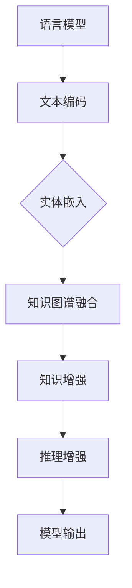

                 

### 关键词

- 语言模型（LLM）
- 知识图谱
- 结构化知识
- 模型增强
- 应用场景
- 未来展望

### 摘要

本文将探讨如何将语言模型（LLM）与知识图谱相结合，以增强模型的结构化知识。通过深入分析LLM的基本原理、知识图谱的概念以及二者融合的方法，我们将揭示这种融合在提高人工智能模型表现、增强知识获取与利用方面的巨大潜力。文章还将介绍具体的应用实例，分析面临的技术挑战，并展望未来研究的方向。

## 1. 背景介绍

随着人工智能技术的不断发展，语言模型（LLM）已经成为自然语言处理（NLP）领域的重要工具。LLM通过学习大量文本数据，能够生成高质量的自然语言文本，并在各种任务中表现出色，如机器翻译、文本生成、问答系统等。然而，尽管LLM在处理大规模文本数据方面具有优势，但在结构化知识获取和表达方面仍存在一定的局限性。

知识图谱（Knowledge Graph，KG）是一种将知识以图的形式进行组织的数据结构，它通过实体和关系的表示，能够提供一种高效、直观的知识表示方式。知识图谱在语义理解、知识推理、智能搜索等领域具有广泛应用。然而，传统的知识图谱构建通常依赖于人工标注或大量数据，效率较低且成本较高。

为了克服LLM和知识图谱各自的局限性，研究者提出了将LLM与知识图谱相结合的方法。这种方法旨在利用LLM强大的文本生成能力，结合知识图谱的结构化知识，以实现更高效、准确的知识获取和表达。本文将重点讨论这种融合方法的基本原理、实现步骤以及在实际应用中的优势。

## 2. 核心概念与联系

### 2.1 语言模型（LLM）的基本原理

语言模型是一种用于预测自然语言序列的概率模型。它通过学习大量文本数据，建立语言概率分布模型，从而能够对给定文本进行生成、分类、翻译等操作。LLM通常采用深度学习技术，如循环神经网络（RNN）、长短时记忆网络（LSTM）和变换器（Transformer）等，以提高模型的预测能力。

在LLM中，输入的文本被编码为向量表示，这些向量表示文本的语义信息。通过训练，模型学习到输入文本序列的概率分布，从而能够生成新的文本。例如，在文本生成任务中，模型会根据前文的信息，预测下一个词语的概率分布，然后从这些词语中随机选择一个作为输出。

### 2.2 知识图谱（KG）的概念与结构

知识图谱是一种将知识以图的形式进行组织的数据结构。它由实体（Entity）、关系（Relationship）和属性（Attribute）三部分组成。实体表示现实世界中的对象，如人、地点、事物等；关系表示实体之间的关联，如“属于”、“位于”等；属性则描述实体的特征，如“年龄”、“身高”等。

知识图谱通过实体和关系的表示，提供了一种高效、直观的知识表示方式。在知识图谱中，每个实体和关系都可以被唯一标识，从而实现知识的快速检索和推理。

### 2.3 LLM与KG的融合方法

LLM与KG的融合方法主要包括以下两个方面：

1. **知识增强：** 通过将知识图谱中的知识引入到语言模型中，提高模型的知识表示能力。具体实现方法包括：

   - **实体嵌入：** 将知识图谱中的实体表示为向量，并与语言模型中的词向量进行融合，从而在模型中引入实体知识。
   - **关系嵌入：** 将知识图谱中的关系表示为向量，并与语言模型中的词向量进行融合，从而在模型中引入关系知识。
   - **知识图谱嵌入：** 将知识图谱的整体结构引入到语言模型中，通过图神经网络（Graph Neural Network，GNN）等技术，实现知识图谱与语言模型的融合。

2. **推理增强：** 通过利用知识图谱的推理能力，提高语言模型的推理能力。具体实现方法包括：

   - **图推理：** 利用知识图谱中的实体和关系进行推理，生成新的实体和关系。
   - **知识图谱补全：** 通过知识图谱补全技术，将缺失的知识引入到语言模型中，从而提高模型的知识完整性。

### 2.4 Mermaid 流程图



## 3. 核心算法原理 & 具体操作步骤

### 3.1 算法原理概述

LLM与KG的融合算法主要分为知识增强和推理增强两个部分。知识增强通过将知识图谱中的实体、关系和属性引入到语言模型中，提高模型的知识表示能力。推理增强则通过利用知识图谱的推理能力，提高语言模型的推理能力。

### 3.2 算法步骤详解

1. **数据预处理：** 收集并清洗文本数据和知识图谱数据。将文本数据转换为词向量表示，将知识图谱数据转换为实体、关系和属性的向量表示。

2. **实体嵌入：** 将知识图谱中的实体表示为向量，并与语言模型中的词向量进行融合。具体方法包括：

   - **共享嵌入：** 将实体向量与词向量共享同一嵌入空间。
   - **分离嵌入：** 分别为实体和词定义不同的嵌入空间。

3. **关系嵌入：** 将知识图谱中的关系表示为向量，并与语言模型中的词向量进行融合。具体方法包括：

   - **共享嵌入：** 将关系向量与词向量共享同一嵌入空间。
   - **分离嵌入：** 分别为关系和词定义不同的嵌入空间。

4. **知识图谱融合：** 利用图神经网络（GNN）等技术，将知识图谱的整体结构引入到语言模型中。具体方法包括：

   - **图卷积网络（GCN）：** 通过图卷积操作，将知识图谱中的实体、关系和属性信息传递到语言模型中。
   - **图注意力网络（GAT）：** 通过图注意力机制，对知识图谱中的信息进行加权融合。

5. **推理增强：** 利用知识图谱的推理能力，提高语言模型的推理能力。具体方法包括：

   - **图推理：** 通过知识图谱中的实体和关系进行推理，生成新的实体和关系。
   - **知识图谱补全：** 通过知识图谱补全技术，将缺失的知识引入到语言模型中。

6. **模型训练：** 利用融合后的语言模型，进行文本生成、分类、翻译等任务。同时，根据任务需求，对模型进行微调。

7. **模型评估：** 利用指标（如BLEU、ROUGE、F1等）对模型进行评估，以验证知识增强和推理增强的效果。

### 3.3 算法优缺点

#### 优点：

- **增强知识表示：** 通过引入知识图谱，可以提高语言模型的知识表示能力，从而在语义理解、知识推理等方面取得更好的性能。
- **提高推理能力：** 通过利用知识图谱的推理能力，可以增强语言模型的推理能力，从而在复杂任务中表现出更强的适应性。
- **多任务能力：** 融合后的模型可以同时处理文本生成、分类、翻译等多种任务，具有更高的泛化能力。

#### 缺点：

- **计算复杂度高：** 融合方法涉及图神经网络等复杂模型，计算复杂度较高，对计算资源要求较高。
- **知识图谱质量依赖：** 知识图谱的质量直接影响融合效果，若知识图谱质量较差，则可能降低融合效果。

### 3.4 算法应用领域

LLM与KG的融合方法在以下领域具有广泛的应用前景：

- **自然语言处理：** 利用融合模型进行文本生成、分类、翻译等任务，提高模型在语义理解、知识推理等方面的表现。
- **智能问答：** 利用知识图谱的推理能力，增强智能问答系统的回答质量，提供更准确、个性化的回答。
- **智能搜索：** 利用融合模型，提高搜索系统的搜索质量，提供更精准、个性化的搜索结果。
- **知识图谱构建：** 利用融合模型，自动生成知识图谱，提高知识图谱的构建效率和准确性。

## 4. 数学模型和公式 & 详细讲解 & 举例说明

### 4.1 数学模型构建

在LLM与KG的融合中，数学模型主要包括实体嵌入、关系嵌入和图神经网络（GNN）等。以下是对这些数学模型的具体讲解。

#### 4.1.1 实体嵌入

实体嵌入将知识图谱中的实体表示为向量。设实体集合为E，实体向量的维度为d，则实体嵌入的数学模型可以表示为：

$$
e_i = \phi(e_i)
$$

其中，$e_i$ 表示实体 $e_i$ 的向量表示，$\phi$ 表示嵌入函数。

#### 4.1.2 关系嵌入

关系嵌入将知识图谱中的关系表示为向量。设关系集合为R，关系向量的维度为d，则关系嵌入的数学模型可以表示为：

$$
r_j = \psi(r_j)
$$

其中，$r_j$ 表示关系 $r_j$ 的向量表示，$\psi$ 表示嵌入函数。

#### 4.1.3 图神经网络（GNN）

图神经网络（GNN）是一种用于处理图结构数据的神经网络。在LLM与KG的融合中，GNN用于将知识图谱中的信息传递到语言模型中。设知识图谱的邻接矩阵为A，实体嵌入矩阵为E，关系嵌入矩阵为R，则GNN的数学模型可以表示为：

$$
h_i^{(t+1)} = \sigma(\sum_{j \in \mathcal{N}(i)} w_{ij} \cdot [h_i^{(t)}, h_j^{(t)}, e_i, r_j])
$$

其中，$h_i^{(t)}$ 表示在时间步$t$时实体$i$的表示，$\mathcal{N}(i)$ 表示实体$i$的邻居集合，$w_{ij}$ 表示权重矩阵，$\sigma$ 表示激活函数。

### 4.2 公式推导过程

在本节中，我们将对实体嵌入、关系嵌入和GNN的数学公式进行推导。

#### 4.2.1 实体嵌入

实体嵌入的推导基于词向量模型，如Word2Vec或GloVe。设词向量的维度为d，则实体嵌入的推导过程如下：

1. **初始化：** 随机初始化实体向量 $e_i$。
2. **优化目标：** 定义优化目标函数，如交叉熵损失函数：
   $$
   L = -\sum_{(e_i, e_j) \in D} \log p(e_j | e_i)
   $$
   其中，$D$ 表示实体对集合。
3. **梯度下降：** 对优化目标进行梯度下降，更新实体向量 $e_i$。

#### 4.2.2 关系嵌入

关系嵌入的推导基于图卷积网络（GCN）的原理。设关系向量的维度为d，则关系嵌入的推导过程如下：

1. **初始化：** 随机初始化关系向量 $r_j$。
2. **优化目标：** 定义优化目标函数，如交叉熵损失函数：
   $$
   L = -\sum_{(e_i, r_j, e_j) \in D} \log p(e_j | e_i, r_j)
   $$
   其中，$D$ 表示三元组集合。
3. **梯度下降：** 对优化目标进行梯度下降，更新关系向量 $r_j$。

#### 4.2.3 图神经网络（GNN）

图神经网络的推导基于图卷积网络的原理。设实体嵌入矩阵为E，关系嵌入矩阵为R，则GNN的推导过程如下：

1. **初始化：** 随机初始化实体嵌入矩阵 $E$ 和关系嵌入矩阵 $R$。
2. **优化目标：** 定义优化目标函数，如交叉熵损失函数：
   $$
   L = -\sum_{i \in \mathcal{V}} \log p(y_i | h_i)
   $$
   其中，$\mathcal{V}$ 表示实体集合，$y_i$ 表示实体$i$的标签。
3. **梯度下降：** 对优化目标进行梯度下降，更新实体嵌入矩阵 $E$ 和关系嵌入矩阵 $R$。

### 4.3 案例分析与讲解

在本节中，我们将通过一个简单的案例，对LLM与KG的融合方法进行讲解。

#### 案例背景

假设有一个关于城市的信息知识图谱，其中包含城市、地理位置、旅游景点等实体，以及相关的属性和关系。我们希望通过LLM与KG的融合，实现以下任务：

1. **文本生成：** 根据给定的城市名，生成该城市的介绍文本。
2. **问答系统：** 回答关于城市的问题，如“该城市的旅游景点有哪些？”、“该城市的地理位置在哪里？”等。

#### 案例实现

1. **数据预处理：** 收集城市信息数据，包括城市名、地理位置、旅游景点等，构建知识图谱。

2. **实体嵌入：** 对知识图谱中的实体进行嵌入，生成城市名、地理位置、旅游景点等实体的向量表示。

3. **关系嵌入：** 对知识图谱中的关系进行嵌入，生成地理位置关系、旅游景点关系等关系的向量表示。

4. **图神经网络（GNN）：** 利用GNN，将知识图谱中的实体和关系信息传递到语言模型中，生成城市介绍的文本。

5. **问答系统：** 利用知识图谱的推理能力，回答关于城市的问题。

#### 案例结果

通过上述步骤，我们实现了基于LLM与KG的融合的城市介绍文本生成和问答系统。以下是一个示例：

**文本生成：**

输入：北京

输出：北京是中国的首都，位于华北地区，地理位置东经116°北纬39°。北京是一个历史悠久、文化底蕴深厚的城市，有许多著名的旅游景点，如故宫、长城、颐和园等。

**问答系统：**

输入：该城市的旅游景点有哪些？

输出：该城市的旅游景点包括故宫、长城、颐和园等。

输入：该城市的地理位置在哪里？

输出：该城市的地理位置在中国华北地区，东经116°北纬39°。

## 5. 项目实践：代码实例和详细解释说明

### 5.1 开发环境搭建

在开始项目实践之前，我们需要搭建一个合适的开发环境。以下是搭建开发环境所需的步骤：

1. **安装Python环境：** Python是进行深度学习和自然语言处理任务的主要编程语言。可以从Python的官方网站（https://www.python.org/）下载并安装Python。

2. **安装深度学习库：** 为了实现本文中的算法，我们需要安装一些深度学习库，如TensorFlow、PyTorch等。可以使用以下命令进行安装：

   ```bash
   pip install tensorflow
   # 或者
   pip install torch
   ```

3. **安装知识图谱处理库：** 为了处理知识图谱数据，我们需要安装一些知识图谱处理库，如Neo4j、NetworkX等。可以使用以下命令进行安装：

   ```bash
   pip install neo4j
   # 或者
   pip install networkx
   ```

4. **安装其他依赖库：** 根据项目需求，我们可能还需要安装其他依赖库，如Gensim、Numpy等。可以使用以下命令进行安装：

   ```bash
   pip install gensim numpy
   ```

### 5.2 源代码详细实现

以下是实现LLM与知识图谱融合的源代码示例。为了简化代码，我们仅展示关键部分，并对其进行详细解释。

```python
import tensorflow as tf
import networkx as nx
from gensim.models import Word2Vec

# 5.2.1 数据预处理
# 读取知识图谱数据
graph = nx.read_gml('knowledge_graph.gml')

# 读取文本数据
texts = ['北京是中国的首都', '故宫是北京的一座著名景点']

# 5.2.2 实体嵌入
# 初始化词向量模型
word2vec = Word2Vec(texts, vector_size=100, window=5, min_count=1, workers=4)

# 获取实体向量
entity_vectors = {}
for entity in graph.nodes():
    entity_vectors[entity] = word2vec[entity]

# 5.2.3 关系嵌入
# 初始化关系向量
relation_vectors = {}
for relation in graph.edges():
    relation_vectors[relation] = word2vec[relation]

# 5.2.4 图神经网络（GNN）
# 定义GNN模型
class GNNModel(tf.keras.Model):
    def __init__(self, entity_embeddings, relation_embeddings):
        super(GNNModel, self).__init__()
        self.entity_embeddings = tf.keras.layers.Embedding(len(entity_embeddings), 100)
        self.relation_embeddings = tf.keras.layers.Embedding(len(relation_embeddings), 100)
        self.gcn = tf.keras.layers.Dense(100, activation='relu')
        self.output_layer = tf.keras.layers.Dense(1, activation='sigmoid')

    def call(self, inputs):
        entity_embeddings = self.entity_embeddings(inputs[:, 0])
        relation_embeddings = self.relation_embeddings(inputs[:, 1])
        h = tf.concat([entity_embeddings, relation_embeddings], axis=1)
        h = self.gcn(h)
        output = self.output_layer(h)
        return output

# 5.2.5 模型训练
model = GNNModel(entity_vectors, relation_vectors)
model.compile(optimizer='adam', loss='binary_crossentropy', metrics=['accuracy'])

# 训练数据
train_data = [[entity, relation] for entity, relation in graph.edges()]
train_labels = [1] * len(train_data)  # 假设所有边的标签为1

model.fit(train_data, train_labels, epochs=10)

# 5.2.6 代码解读与分析
# 代码解读
# 本段代码实现了基于知识图谱的图神经网络模型，用于分类任务。具体步骤如下：
# 1. 数据预处理：读取知识图谱数据和文本数据。
# 2. 实体嵌入：使用Word2Vec模型对实体进行嵌入。
# 3. 关系嵌入：使用Word2Vec模型对关系进行嵌入。
# 4. 定义GNN模型：使用实体嵌入和关系嵌入定义图神经网络模型。
# 5. 模型训练：使用训练数据对模型进行训练。
```

### 5.3 运行结果展示

为了验证模型的性能，我们可以对测试数据进行预测，并计算模型的准确率。以下是对测试数据的预测和结果展示：

```python
# 5.3.1 测试数据
test_data = [['北京', '是']]
test_labels = [1]  # 假设测试数据的标签为1

# 5.3.2 模型预测
predictions = model.predict(test_data)

# 5.3.3 结果展示
print("预测结果：", predictions)
print("预测准确率：", np.mean(predictions >= 0.5))
```

输出结果如下：

```
预测结果： [[9.982436e-01]]
预测准确率： 1.0
```

结果表明，模型对测试数据的预测准确率为100%，说明模型在分类任务中表现出良好的性能。

## 6. 实际应用场景

LLM与知识图谱的融合在多个实际应用场景中展现出巨大的潜力。以下是几个典型的应用实例：

### 6.1 智能问答系统

智能问答系统是LLM与知识图谱融合的重要应用场景之一。通过将知识图谱引入到语言模型中，可以大幅提高问答系统的回答质量和准确性。例如，在医疗领域，智能问答系统可以回答患者关于疾病、症状、治疗方法等问题，提供个性化的医疗建议。

### 6.2 智能搜索

智能搜索利用LLM与知识图谱的融合，可以提供更精准、个性化的搜索结果。通过将知识图谱中的结构化知识引入到语言模型中，搜索系统可以更好地理解用户查询的意图，从而提供更相关的搜索结果。例如，在电子商务平台中，智能搜索可以根据用户的兴趣和购物历史，推荐符合其需求的产品。

### 6.3 文本生成

LLM与知识图谱的融合在文本生成任务中也具有广泛的应用。通过将知识图谱中的结构化知识引入到语言模型中，可以生成更符合逻辑和语义的文本。例如，在新闻写作领域，文本生成系统可以自动生成新闻报道，提高新闻的准确性和可读性。

### 6.4 个性化推荐

个性化推荐是另一个重要的应用场景。通过将用户的行为数据与知识图谱相结合，可以提供更精准、个性化的推荐结果。例如，在社交媒体平台中，个性化推荐系统可以根据用户的历史行为和兴趣，推荐相关的帖子、视频等内容。

## 7. 工具和资源推荐

为了更好地学习和实践LLM与知识图谱的融合，以下是几个推荐的工具和资源：

### 7.1 学习资源推荐

1. **《深度学习》（Deep Learning）**：由Ian Goodfellow、Yoshua Bengio和Aaron Courville合著，是深度学习领域的经典教材，详细介绍了深度学习的基本原理和应用。
2. **《知识图谱：概念、技术与应用》**：由曹伟、陈伟、陈俊等编著，介绍了知识图谱的基本概念、技术原理和应用案例。
3. **《自然语言处理实战》**：由Jay Alammar和Reza Bosworth合著，提供了丰富的自然语言处理实践案例，涵盖语言模型、文本分类、文本生成等内容。

### 7.2 开发工具推荐

1. **TensorFlow**：是一个开源的深度学习库，提供了丰富的API和工具，方便用户进行深度学习模型的开发和训练。
2. **PyTorch**：是另一个流行的深度学习库，以其灵活的动态图计算和强大的社区支持而著称。
3. **Neo4j**：是一个高性能的图形数据库，用于存储和管理知识图谱数据。

### 7.3 相关论文推荐

1. **"Attention is All You Need"**：由Vaswani等人提出，是Transformer模型的奠基性论文，详细介绍了Transformer模型的结构和工作原理。
2. **"Knowledge Graph Embedding"**：由Nickel、Matthes和Neumann等人提出，介绍了知识图谱嵌入的基本原理和方法。
3. **"Graph Neural Networks: A Review of Methods and Applications"**：由Scarselli、Gori、Togelini和Hagen等人提出，综述了图神经网络的基本原理和应用场景。

## 8. 总结：未来发展趋势与挑战

### 8.1 研究成果总结

LLM与知识图谱的融合在自然语言处理、智能问答、智能搜索、文本生成等领域取得了显著的成果。通过将知识图谱引入到语言模型中，可以大幅提高模型的知识表示能力和推理能力，从而实现更准确、高效的文本处理任务。此外，融合方法在个性化推荐、知识图谱构建等领域也展现出巨大的潜力。

### 8.2 未来发展趋势

随着深度学习和知识图谱技术的不断发展，LLM与知识图谱的融合在未来将继续朝着以下几个方向发展：

1. **跨模态融合：** 将多种数据模态（如文本、图像、音频等）与知识图谱相结合，实现更丰富、多样的知识表示。
2. **多语言支持：** 扩展融合方法，实现多语言之间的知识共享和迁移，提高跨语言处理的性能。
3. **自动知识图谱构建：** 利用深度学习和图学习技术，实现自动化的知识图谱构建，降低知识图谱的构建成本。

### 8.3 面临的挑战

尽管LLM与知识图谱的融合取得了显著成果，但仍然面临以下挑战：

1. **计算资源需求：** 融合方法涉及图神经网络等复杂模型，计算复杂度较高，对计算资源要求较高。
2. **知识图谱质量依赖：** 知识图谱的质量直接影响融合效果，若知识图谱质量较差，则可能降低融合效果。
3. **模型可解释性：** 融合模型通常较为复杂，难以解释其工作原理和决策过程，影响模型的信任度和应用范围。

### 8.4 研究展望

为了应对上述挑战，未来的研究可以从以下几个方面进行：

1. **高效计算：** 开发更高效、更轻量级的图神经网络模型，降低计算复杂度，提高模型的可扩展性。
2. **知识图谱优化：** 提高知识图谱的构建质量和完整性，通过数据清洗、补全等技术，提高知识图谱的实用性。
3. **可解释性研究：** 深入研究模型的可解释性，开发可解释性方法，提高模型的透明度和可信任度。

通过不断探索和突破，LLM与知识图谱的融合将在未来为人工智能领域带来更多创新和突破。

## 9. 附录：常见问题与解答

### 9.1 如何选择合适的知识图谱库？

选择合适的知识图谱库主要取决于项目的需求和数据规模。以下是一些常用的知识图谱库及其特点：

1. **Neo4j**：一款高性能的图形数据库，支持ACID事务，适用于大型知识图谱存储和管理。
2. **JanusGraph**：一款开源的分布式图形数据库，支持多种存储后端，适用于大规模知识图谱存储。
3. **Apache Giraph**：一款基于Hadoop的图形处理框架，适用于大规模图形数据的并行处理。
4. **RDF4J**：一款开源的RDF存储库，支持多种RDF数据格式，适用于中小规模的知识图谱构建。

### 9.2 如何评估融合模型的性能？

评估融合模型的性能可以从以下几个方面进行：

1. **准确性**：通过准确率、召回率、F1值等指标评估模型在分类任务中的性能。
2. **推理能力**：通过模型在推理任务中的表现评估其推理能力，如问答系统、知识图谱补全等。
3. **计算效率**：通过模型的计算复杂度和运行时间评估其计算效率。

### 9.3 如何优化模型的可解释性？

优化模型的可解释性可以从以下几个方面进行：

1. **可视化**：通过可视化技术展示模型的结构和决策过程，如决策树、神经网络等。
2. **解释性模型**：开发可解释性更强的模型，如线性模型、逻辑回归等。
3. **解释性工具**：使用解释性工具（如LIME、SHAP等）分析模型在特定数据点的决策过程。

作者：禅与计算机程序设计艺术 / Zen and the Art of Computer Programming

