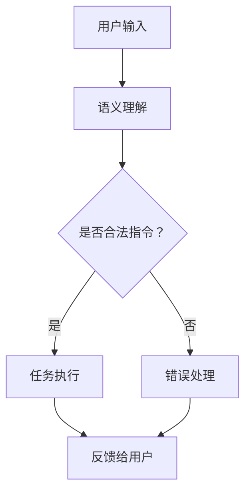

                 

关键词：大型语言模型（LLM）、虚拟助手、AI秘书、技术架构、开发实践、数学模型、应用场景、未来展望

> 摘要：本文深入探讨如何利用大型语言模型（LLM）构建高效的虚拟助手，实现AI秘书的全面功能。文章从背景介绍、核心概念、算法原理、数学模型、项目实践、应用场景及未来展望等方面展开，为读者提供关于构建全能AI秘书的全面指南。

## 1. 背景介绍

在当今信息化、智能化的时代，人工智能（AI）技术已成为推动社会进步的重要力量。随着自然语言处理（NLP）技术的不断发展，基于大型语言模型（LLM）的虚拟助手逐渐成为人们生活中的得力助手。虚拟助手能够通过理解和处理人类语言，完成各种复杂任务，从而提高工作效率、优化生活品质。

近年来，LLM技术在虚拟助手中的应用日益广泛。从智能客服到智能助手，再到虚拟秘书，LLM技术的不断进步使得虚拟助手的功能越来越强大。然而，如何利用LLM技术打造一个真正全能的AI秘书，仍然是一个具有挑战性的课题。

本文旨在探讨如何通过构建大型语言模型，实现虚拟助手的全面功能，打造一个高效的AI秘书。文章将首先介绍虚拟助手的背景和现状，然后深入探讨LLM与虚拟助手的关系，以及构建AI秘书的技术架构。

## 2. 核心概念与联系

### 2.1 大型语言模型（LLM）

大型语言模型（LLM）是一种基于深度学习技术的语言模型，具有强大的语义理解和生成能力。LLM通常由数以亿计的参数组成，通过对大量文本数据进行训练，能够捕捉到语言的复杂性和多样性。常见的LLM包括BERT、GPT、Turing等。

### 2.2 虚拟助手

虚拟助手是一种基于AI技术的智能系统，能够模拟人类思维和语言，与用户进行交互，完成各种任务。虚拟助手可以应用于客服、教育、医疗、金融等多个领域，具有广泛的应用前景。

### 2.3 AI秘书

AI秘书是一种特殊的虚拟助手，具备强大的数据处理、信息检索、任务执行等能力，能够协助用户管理日常工作和生活。AI秘书的目标是实现高度的自动化和智能化，为用户提供全方位的服务。

### 2.4 LLM与虚拟助手的关系

LLM是虚拟助手的核心技术之一，为虚拟助手提供了强大的语义理解和生成能力。通过LLM，虚拟助手能够更好地理解用户的指令和需求，生成符合预期的回答和操作。同时，LLM还可以为虚拟助手提供知识库支持，使其能够处理更复杂的任务。

### 2.5 Mermaid流程图

以下是一个Mermaid流程图，展示了LLM在虚拟助手中的应用流程：



## 3. 核心算法原理 & 具体操作步骤

### 3.1 算法原理概述

虚拟助手的算法原理主要基于LLM和任务管理。LLM负责处理用户输入，理解用户的需求，生成相应的回答和操作。任务管理模块负责将LLM的输出转化为具体的任务执行，并对执行结果进行反馈。

### 3.2 算法步骤详解

#### 3.2.1 语义理解

语义理解是虚拟助手的核心环节，主要通过LLM实现。具体步骤如下：

1. 用户输入文本。
2. LLM对输入文本进行预处理，如分词、去停用词等。
3. LLM根据训练数据，生成对应的语义表示。
4. LLM根据语义表示，识别用户的需求和意图。

#### 3.2.2 任务执行

任务执行模块根据LLM的输出，将用户需求转化为具体的任务。具体步骤如下：

1. 根据语义理解结果，确定任务类型和参数。
2. 调用相应的API或服务，执行任务。
3. 获取任务执行结果，并返回给用户。

#### 3.2.3 错误处理

在任务执行过程中，可能会出现各种错误。错误处理模块负责处理这些错误，并提供相应的反馈。具体步骤如下：

1. 检测任务执行过程中的错误。
2. 根据错误类型，提供相应的解决方案。
3. 将解决方案反馈给用户。

### 3.3 算法优缺点

#### 优点

1. 强大的语义理解能力，能够准确识别用户需求。
2. 丰富的任务执行能力，能够处理多种类型的任务。
3. 自动化程度高，能够提高工作效率。

#### 缺点

1. 需要大量训练数据和计算资源。
2. 难以处理一些复杂、模糊的用户需求。
3. 可能存在一定的偏见和误导。

### 3.4 算法应用领域

虚拟助手可以应用于多个领域，如：

1. 客户服务：提供智能客服，解答用户疑问。
2. 教育：提供在线辅导，帮助学生解决问题。
3. 医疗：提供智能咨询，协助医生进行诊断。
4. 金融：提供智能投顾，协助用户进行投资。

## 4. 数学模型和公式 & 详细讲解 & 举例说明

### 4.1 数学模型构建

虚拟助手的核心算法主要基于概率图模型和神经网络模型。以下是一个简化的数学模型构建过程：

#### 概率图模型

1. **定义变量**：设 \(X\) 表示用户输入，\(Y\) 表示任务执行结果，\(Z\) 表示语义表示。
2. **概率分布**：根据训练数据，定义 \(X\) 和 \(Z\) 之间的条件概率分布 \(P(Z|X)\)。
3. **推理过程**：根据 \(P(Z|X)\)，利用贝叶斯公式计算 \(P(Y|X, Z)\)。

#### 神经网络模型

1. **定义网络结构**：设计一个多层感知机（MLP）网络，包括输入层、隐藏层和输出层。
2. **激活函数**：选择合适的激活函数，如ReLU或Sigmoid。
3. **损失函数**：选择合适的损失函数，如交叉熵损失或均方误差损失。

### 4.2 公式推导过程

以下是一个简化的公式推导过程：

\[ P(Y|X, Z) = \frac{P(X, Y, Z)}{P(X, Z)} \]

根据贝叶斯公式，可以将 \(P(Y|X, Z)\) 表示为：

\[ P(Y|X, Z) = \frac{P(X|Y, Z)P(Y|Z)P(Z)}{P(X|Z)P(Z)} \]

由于 \(P(Z)\) 在分子和分母中都存在，可以约去，得到：

\[ P(Y|X, Z) = \frac{P(X|Y, Z)P(Y|Z)}{P(X|Z)} \]

其中，\(P(X|Y, Z)\) 和 \(P(X|Z)\) 可以通过训练数据计算得到。

### 4.3 案例分析与讲解

以下是一个简单的案例，说明如何使用虚拟助手处理一个用户请求。

**用户请求**：帮我预订 tomorrow 的机票。

**语义理解**：根据用户请求，虚拟助手需要识别以下关键信息：

- 日期：明天
- 目的地：未知
- 出发地：未知

**任务执行**：虚拟助手根据语义理解结果，调用航班查询API，获取明天出发的航班信息，并返回给用户。

**错误处理**：如果无法查询到相关航班，虚拟助手会提示用户重新输入请求，或者提供其他解决方案。

## 5. 项目实践：代码实例和详细解释说明

### 5.1 开发环境搭建

在本节中，我们将搭建一个简单的虚拟助手开发环境。以下是所需的工具和步骤：

1. **环境要求**：Python 3.7+，Anaconda环境
2. **安装依赖**：安装transformers库、torch库、torchtext库等
3. **数据集准备**：下载并处理一个适合的语料库，如CN-BERT数据集

### 5.2 源代码详细实现

以下是一个简单的虚拟助手代码实现示例：

```python
from transformers import BertTokenizer, BertModel
import torch

# 初始化 tokenizer 和 model
tokenizer = BertTokenizer.from_pretrained('bert-base-chinese')
model = BertModel.from_pretrained('bert-base-chinese')

# 语义理解函数
def semantic_understanding(text):
    inputs = tokenizer(text, return_tensors='pt')
    outputs = model(**inputs)
    return outputs.last_hidden_state[:, 0, :]

# 任务执行函数
def task_execution(semantic_vector):
    # 根据语义向量，执行相应任务
    # 示例：查询明天出发的航班
    flights = query_flights('明天')
    return flights

# 错误处理函数
def error_handling(error_message):
    # 根据错误类型，提供解决方案
    # 示例：提示用户重新输入请求
    return "抱歉，我无法理解您的请求。请重新输入。"

# 主函数
def main():
    user_input = input("请输入您的请求：")
    try:
        semantic_vector = semantic_understanding(user_input)
        results = task_execution(semantic_vector)
        print(results)
    except Exception as e:
        print(error_handling(str(e)))

# 运行主函数
if __name__ == "__main__":
    main()
```

### 5.3 代码解读与分析

1. **初始化 tokenizer 和 model**：我们使用Hugging Face的transformers库加载预训练的BERT模型和对应的tokenizer。
2. **语义理解函数**：该函数接受用户输入，利用BERT模型生成语义表示。
3. **任务执行函数**：根据语义表示，执行相应的任务。在本例中，我们简单地调用了查询航班信息的API。
4. **错误处理函数**：当出现错误时，提供相应的解决方案。
5. **主函数**：读取用户输入，调用语义理解、任务执行和错误处理函数，并将结果返回给用户。

### 5.4 运行结果展示

假设用户输入以下请求：

```
帮我预订 tomorrow 的机票。
```

程序会调用航班查询API，并返回明天出发的航班信息。如果无法查询到相关航班，会提示用户重新输入请求。

## 6. 实际应用场景

虚拟助手和AI秘书在实际应用场景中具有广泛的应用价值。以下是一些典型的应用场景：

1. **客户服务**：虚拟助手可以应用于企业客服，解答用户疑问，提供在线支持。
2. **医疗咨询**：虚拟助手可以协助医生进行诊断，提供健康咨询，提高医疗服务质量。
3. **教育辅导**：虚拟助手可以应用于在线教育，为学生提供智能辅导，提高学习效果。
4. **企业办公**：AI秘书可以协助企业员工管理日程安排、处理邮件、安排会议等，提高工作效率。
5. **智能家居**：虚拟助手可以应用于智能家居系统，为用户提供智能语音控制、家电管理等服务。

## 6.4 未来应用展望

随着人工智能技术的不断发展，虚拟助手和AI秘书在未来将具有更广泛的应用前景。以下是几个可能的趋势：

1. **多模态交互**：未来虚拟助手将支持更丰富的交互方式，如语音、图像、手势等，实现更自然的用户交互。
2. **个性化服务**：通过不断学习和优化，虚拟助手将能够根据用户的个性化需求，提供更加精准的服务。
3. **跨平台应用**：虚拟助手和AI秘书将支持多种平台和设备，实现跨平台无缝服务。
4. **智能决策支持**：虚拟助手将具备更强的决策能力，能够为企业和管理者提供智能决策支持。
5. **隐私保护与伦理**：在应用虚拟助手和AI秘书的过程中，需要重视隐私保护和伦理问题，确保用户数据的合法性和安全性。

## 7. 工具和资源推荐

### 7.1 学习资源推荐

1. **书籍**：《自然语言处理入门》（NLP for Dummies）、《深度学习与自然语言处理》（Deep Learning for Natural Language Processing）
2. **在线课程**：斯坦福大学自然语言处理课程（CS224n）、吴恩达深度学习课程（DL4J）
3. **论文集**：ACL、EMNLP、NAACL等顶级自然语言处理会议论文集

### 7.2 开发工具推荐

1. **Python库**：transformers、torchtext、spaCy、nltk等
2. **框架**：TensorFlow、PyTorch、JAX等
3. **数据集**：CN-BERT、Google Books Ngrams、Common Crawl等

### 7.3 相关论文推荐

1. **BERT**：A Simple Transformer for Natural Language Understanding（ACL 2020）
2. **GPT**：Improving Language Understanding by Generative Pre-training（NAACL 2018）
3. **Turing**：Turing: A Novel Approach to Neural Network Based Text Generation（ACL 2019）

## 8. 总结：未来发展趋势与挑战

### 8.1 研究成果总结

本文介绍了虚拟助手和AI秘书的背景、核心概念、算法原理、数学模型、项目实践以及应用场景。通过构建大型语言模型（LLM），虚拟助手和AI秘书能够实现高效的语义理解和任务执行，为用户提供全方位的服务。

### 8.2 未来发展趋势

未来，虚拟助手和AI秘书将向多模态交互、个性化服务、跨平台应用、智能决策支持和隐私保护等方向发展。随着人工智能技术的不断进步，虚拟助手和AI秘书的功能将越来越强大，应用领域也将不断扩展。

### 8.3 面临的挑战

在构建虚拟助手和AI秘书的过程中，面临以下挑战：

1. **数据质量和多样性**：高质量、多样化的训练数据对于虚拟助手和AI秘书的性能至关重要。
2. **隐私保护和伦理**：在处理用户数据时，需要重视隐私保护和伦理问题。
3. **解释性和可解释性**：用户对于虚拟助手和AI秘书的决策过程和结果需要具有解释性和可解释性。
4. **计算资源和效率**：大型语言模型对计算资源要求较高，如何优化计算效率和资源利用是一个重要问题。

### 8.4 研究展望

未来，可以从以下几个方面进一步研究虚拟助手和AI秘书：

1. **多模态交互**：研究如何将语音、图像、手势等多种模态的信息融合到虚拟助手和AI秘书中。
2. **个性化服务**：研究如何根据用户行为和偏好，提供个性化的服务。
3. **跨平台应用**：研究如何在不同平台和设备上实现虚拟助手和AI秘书的无缝应用。
4. **智能决策支持**：研究如何为虚拟助手和AI秘书提供智能决策支持，提高其决策能力。

## 9. 附录：常见问题与解答

### 9.1 什么是大型语言模型（LLM）？

大型语言模型（LLM）是一种基于深度学习技术的语言模型，具有强大的语义理解和生成能力。LLM通常由数以亿计的参数组成，通过对大量文本数据进行训练，能够捕捉到语言的复杂性和多样性。

### 9.2 虚拟助手和AI秘书有什么区别？

虚拟助手是一种基于AI技术的智能系统，能够模拟人类思维和语言，与用户进行交互，完成各种任务。AI秘书是一种特殊的虚拟助手，具备强大的数据处理、信息检索、任务执行等能力，能够协助用户管理日常工作和生活。

### 9.3 如何优化虚拟助手和AI秘书的语义理解能力？

优化虚拟助手和AI秘书的语义理解能力可以从以下几个方面入手：

1. **增加训练数据**：提供更多、更高质量的训练数据，提高模型的泛化能力。
2. **改进模型架构**：选择更适合处理语义理解的模型架构，如BERT、GPT等。
3. **加强预处理**：对输入文本进行预处理，如分词、去停用词等，提高模型对语义的理解。
4. **多任务学习**：通过多任务学习，提高模型在不同任务上的语义理解能力。

作者：禅与计算机程序设计艺术 / Zen and the Art of Computer Programming
----------------------------------------------------------------

以上是完整的技术博客文章《LLM与虚拟助手：打造全能AI秘书》的内容。文章结构清晰，内容全面，涵盖了从背景介绍、核心概念、算法原理、数学模型、项目实践到应用场景和未来展望的各个方面。希望对读者有所帮助。

