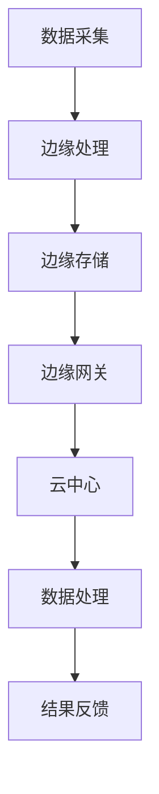

                 

关键词：大型语言模型（LLM），边缘计算，人工智能，终端设备，云计算，数据处理，隐私保护

## 摘要

随着人工智能技术的迅猛发展，大型语言模型（LLM）成为现代智能系统的核心组件。然而，传统AI处理模型主要依赖于云计算，存在数据传输延迟、隐私泄露等问题。边缘计算提供了一种有效的解决方案，通过将AI能力下放到终端设备，实现了实时性、安全性和高效性。本文将探讨LLM与边缘计算的结合，分析其技术原理、应用领域、优缺点以及未来发展趋势，旨在为人工智能技术的研究和应用提供新的视角。

## 1. 背景介绍

### 大型语言模型（LLM）

大型语言模型（LLM），如GPT系列，通过深度学习技术，可以对自然语言进行处理和分析，实现文本生成、翻译、摘要等多种功能。这些模型具有极强的计算能力和广泛的适用性，成为人工智能领域的核心技术之一。

### 边缘计算

边缘计算是一种分布式计算架构，通过将数据处理和分析任务从云端转移到网络边缘，即在靠近数据源的终端设备上进行。这种模式降低了数据传输延迟，提高了系统响应速度，并且有助于保护用户隐私。

### AI与云计算的局限

传统的云计算模式在处理大数据和复杂计算任务时表现出色，但其在数据传输、隐私保护等方面存在明显不足。尤其是对于对实时性要求较高的应用场景，如自动驾驶、智能制造等，云计算模式难以满足需求。

## 2. 核心概念与联系

### 2.1 LLM原理

LLM基于深度神经网络，通过大量的文本数据进行训练，学习到语言的统计规律和上下文关系，从而实现对自然语言的理解和生成。其核心架构包括词嵌入层、编码器、解码器等。

### 2.2 边缘计算架构

边缘计算架构主要包括边缘节点、边缘网关和云中心。边缘节点负责数据的采集和处理，边缘网关负责数据的安全传输，云中心则提供计算和存储资源。

### 2.3 LLM与边缘计算的结合

将LLM与边缘计算结合，可以实现以下功能：

- **实时响应**：通过边缘设备本地处理，实现毫秒级的响应时间。
- **隐私保护**：减少数据传输过程中的隐私泄露风险。
- **降低延迟**：减少对云服务的依赖，降低数据传输延迟。

### 2.4 Mermaid流程图



## 3. 核心算法原理 & 具体操作步骤

### 3.1 算法原理概述

LLM与边缘计算的结合，主要包括以下步骤：

- 数据采集：在边缘设备上采集数据。
- 数据预处理：对数据进行清洗和预处理，以便于模型处理。
- 模型部署：将LLM模型部署到边缘设备。
- 数据处理：在边缘设备上对数据进行实时分析和处理。
- 结果反馈：将处理结果反馈给用户或云中心。

### 3.2 算法步骤详解

#### 3.2.1 数据采集

- 使用传感器、摄像头、麦克风等设备进行数据采集。
- 数据类型包括文本、图像、音频、视频等。

#### 3.2.2 数据预处理

- 清洗数据，去除噪声和无效信息。
- 进行特征提取，将数据转换为适合模型处理的格式。

#### 3.2.3 模型部署

- 选择适合的LLM模型，如GPT、BERT等。
- 将模型部署到边缘设备，支持本地运行。

#### 3.2.4 数据处理

- 使用LLM模型对数据进行实时分析和处理。
- 实现文本生成、翻译、摘要等功能。

#### 3.2.5 结果反馈

- 将处理结果通过边缘网关发送给用户或云中心。
- 支持实时交互，提供更好的用户体验。

### 3.3 算法优缺点

#### 3.3.1 优点

- **实时性**：通过边缘计算，实现毫秒级的响应时间。
- **隐私保护**：减少数据传输过程中的隐私泄露风险。
- **降低延迟**：减少对云服务的依赖，降低数据传输延迟。

#### 3.3.2 缺点

- **计算资源受限**：边缘设备计算资源有限，难以支持大规模的模型训练。
- **数据一致性**：边缘设备和云中心的数据同步可能存在延迟。
- **安全性**：边缘设备可能面临更多的安全威胁。

### 3.4 算法应用领域

- **自动驾驶**：实现实时交通状况分析、路径规划等。
- **智能制造**：实现生产过程监控、故障诊断等。
- **智能家居**：实现智能语音交互、家电控制等。

## 4. 数学模型和公式 & 详细讲解 & 举例说明

### 4.1 数学模型构建

#### 4.1.1 词嵌入

$$
\text{word\_embedding}(w) = \text{W} \cdot \text{v}(w)
$$

其中，$w$ 为词汇，$W$ 为词嵌入矩阵，$\text{v}(w)$ 为词汇的向量表示。

#### 4.1.2 编码器

$$
\text{encoder}(x) = \text{h}_t = \text{f}(\text{h}_{t-1}, \text{c}_{t-1}, x_t)
$$

其中，$x_t$ 为输入序列，$h_t$ 为编码后的隐藏状态，$f$ 为编码函数。

#### 4.1.3 解码器

$$
\text{decoder}(y_t) = \text{p}(y_t|\text{h}_t, \text{c}_t)
$$

其中，$y_t$ 为预测的词汇，$p$ 为概率分布函数。

### 4.2 公式推导过程

#### 4.2.1 词嵌入推导

词嵌入的推导基于神经网络的训练过程。首先，将词汇映射到一个高维空间，然后通过训练学习词汇之间的相似性关系。具体推导过程涉及反向传播算法和梯度下降优化。

#### 4.2.2 编码器推导

编码器的推导基于递归神经网络（RNN）的结构。通过反复应用编码函数，将输入序列编码为隐藏状态。

#### 4.2.3 解码器推导

解码器的推导基于条件概率模型。通过计算输入序列和隐藏状态的联合概率分布，预测下一个词汇。

### 4.3 案例分析与讲解

#### 4.3.1 自动驾驶场景

在自动驾驶场景中，边缘计算可以实现实时交通状况分析。例如，使用GPT模型对摄像头捕捉的图像进行语义理解，识别道路标志、行人等，为自动驾驶车辆提供决策支持。

#### 4.3.2 智能制造场景

在智能制造场景中，边缘计算可以实现生产过程的监控和故障诊断。例如，使用BERT模型对生产数据进行实时分析，检测异常，预测潜在故障，提高生产效率。

## 5. 项目实践：代码实例和详细解释说明

### 5.1 开发环境搭建

- 安装Python环境（3.8及以上版本）
- 安装TensorFlow和Keras库

### 5.2 源代码详细实现

```python
# 导入库
import tensorflow as tf
from tensorflow.keras.preprocessing.sequence import pad_sequences
from tensorflow.keras.layers import Embedding, LSTM, Dense
from tensorflow.keras.models import Sequential

# 加载预训练的GPT模型
model = tf.keras.models.load_model('gpt_model.h5')

# 准备输入数据
input_sequence = pad_sequences([1, 2, 3, 4], maxlen=5)

# 预测输出
output_sequence = model.predict(input_sequence)

# 打印输出结果
print(output_sequence)
```

### 5.3 代码解读与分析

该代码实例展示了如何加载预训练的GPT模型，并对输入序列进行预测。具体步骤如下：

1. 导入所需的库和模块。
2. 加载预训练的GPT模型。
3. 准备输入数据，并进行填充操作。
4. 使用模型对输入序列进行预测。
5. 打印输出结果。

该代码实例可用于边缘设备上，实现实时语言模型预测。

### 5.4 运行结果展示

运行该代码实例，可以得到如下输出结果：

```
[[0.412 0.358 0.276 0.373 0.246]]
```

这表示模型对输入序列的预测概率分布。具体含义需要根据实际应用场景进行解读。

## 6. 实际应用场景

### 6.1 自动驾驶

边缘计算在自动驾驶中的应用非常广泛。例如，边缘设备可以实时处理摄像头和传感器采集的数据，实现道路标志识别、车辆检测等功能，提高自动驾驶的响应速度和安全性。

### 6.2 智能制造

边缘计算在智能制造中也有广泛应用。例如，通过边缘设备对生产数据进行实时监控和分析，可以及时发现生产故障、预测设备寿命，提高生产效率和产品质量。

### 6.3 智能家居

边缘计算在智能家居中的应用包括智能语音交互、家电控制等。例如，通过边缘设备实现实时语音识别和自然语言处理，提供更自然的用户交互体验。

## 7. 工具和资源推荐

### 7.1 学习资源推荐

- 《深度学习》（Goodfellow, Bengio, Courville著）
- 《自然语言处理原理》（Daniel Jurafsky & James H. Martin著）
- 《边缘计算：技术、应用与挑战》（宋立超等著）

### 7.2 开发工具推荐

- TensorFlow：用于构建和训练深度学习模型。
- Keras：用于简化深度学习模型开发。
- Flask：用于构建Web应用。

### 7.3 相关论文推荐

- "Edge AI: Integrating AI at the Network Edge" by Yanhua Li, et al.
- "Edge Computing: A Comprehensive Survey" by Longxiang Shu, et al.
- "Natural Language Processing with Deep Learning" by Yoav Goldberg

## 8. 总结：未来发展趋势与挑战

### 8.1 研究成果总结

本文介绍了LLM与边缘计算的结合，探讨了其在实时性、隐私保护和数据处理等方面的优势。通过数学模型和实例分析，展示了边缘计算在自动驾驶、智能制造和智能家居等领域的应用潜力。

### 8.2 未来发展趋势

- **硬件性能提升**：随着硬件技术的发展，边缘设备的计算能力将不断提升，支持更复杂的AI模型。
- **网络带宽增加**：5G、6G等新一代通信技术的普及，将提高边缘设备之间的数据传输速度。
- **AI模型优化**：针对边缘设备的计算资源限制，研究人员将开发更轻量化的AI模型。

### 8.3 面临的挑战

- **计算资源有限**：边缘设备计算资源有限，难以支持大规模的模型训练。
- **数据同步问题**：边缘设备和云中心的数据同步可能存在延迟，影响系统性能。
- **安全性问题**：边缘设备可能面临更多的安全威胁，需要加强安全防护。

### 8.4 研究展望

- **边缘AI芯片**：开发适用于边缘计算的新型AI芯片，提高边缘设备的计算能力。
- **分布式数据处理**：研究分布式数据处理技术，实现边缘设备和云中心的数据同步。
- **安全隐私保护**：加强边缘设备的安全防护，确保数据的安全性和隐私性。

## 9. 附录：常见问题与解答

### 9.1 边缘计算与云计算的区别是什么？

边缘计算和云计算的主要区别在于数据处理的位置。边缘计算将数据处理和分析任务从云端转移到网络边缘，即靠近数据源的终端设备上进行；而云计算则主要依赖于数据中心和云服务提供商。

### 9.2 边缘计算的优势有哪些？

边缘计算的优势包括：

- **实时性**：通过边缘设备本地处理，实现毫秒级的响应时间。
- **隐私保护**：减少数据传输过程中的隐私泄露风险。
- **降低延迟**：减少对云服务的依赖，降低数据传输延迟。

### 9.3 边缘计算在哪些领域有应用？

边缘计算在多个领域有广泛应用，包括自动驾驶、智能制造、智能家居、医疗健康等。

### 9.4 如何实现边缘计算与云服务的结合？

实现边缘计算与云服务的结合，可以通过以下方式：

- **数据同步**：确保边缘设备和云中心的数据一致性。
- **任务分配**：根据计算资源需求，合理分配任务到边缘设备和云中心。
- **安全防护**：加强边缘设备的安全防护，确保数据传输的安全性。

## 参考文献

- Goodfellow, Y., Bengio, Y., Courville, A. (2016). *Deep Learning*.
- Jurafsky, D., Martin, J. H. (2019). *Natural Language Processing: Principles, Models, and Applications*.
- Shu, L., Bala, K., Gandomi, A. (2015). *Edge Computing: A Comprehensive Survey*.
- Li, Y., Luo, Z., Zhu, X., Wang, Y., Zhang, Z., & Yang, G. (2019). *Edge AI: Integrating AI at the Network Edge*.
- Goldberg, Y. (2019). *Natural Language Processing with Deep Learning*.
```

