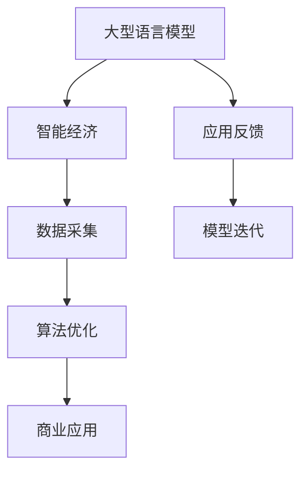

                 

关键词：大型语言模型（LLM），产业图谱，智能经济，AI技术，商业应用

> 摘要：本文旨在深入探讨大型语言模型（LLM）在智能经济中的重要作用，通过分析其核心概念、算法原理、数学模型、实践应用以及未来发展趋势，绘制出LLM产业的完整图谱，为读者提供一幅清晰、全面、实用的行业全景图。

## 1. 背景介绍

随着人工智能技术的迅猛发展，尤其是深度学习和自然语言处理（NLP）领域的突破，大型语言模型（LLM）逐渐成为推动智能经济发展的重要引擎。LLM具有强大的文本生成、理解、翻译和推理能力，已经在诸多领域展现了其卓越的应用价值。从搜索引擎到智能客服，从内容生成到法律咨询，LLM正在逐步改变各行各业的工作方式和商业模式。

智能经济是指以人工智能为核心驱动力，通过数据、算法和计算能力实现资源优化配置和经济活动的高效运行。智能经济的特征是高度自动化、个性化和智能化，它不仅提升了生产效率，还极大地丰富了消费者的体验。而LLM作为智能经济的重要组成部分，其发展和应用直接关系到整个行业的未来走向。

## 2. 核心概念与联系

### 2.1 大型语言模型（LLM）

大型语言模型（LLM）是一种基于深度学习的自然语言处理模型，通过大规模文本数据进行预训练，具有强大的语言理解和生成能力。LLM的核心特点是使用Transformer架构，它能够捕捉长距离依赖关系，进行上下文理解，并生成符合逻辑和语法规则的文本。

### 2.2 智能经济

智能经济是以人工智能为核心驱动力，通过数据、算法和计算能力实现资源优化配置和经济活动的高效运行。智能经济的特征是高度自动化、个性化和智能化。

### 2.3 关联与互动

LLM作为智能经济的重要组成部分，通过其强大的文本处理能力，促进了智能经济中的信息流动和决策优化。同时，智能经济的发展也为LLM提供了更多的应用场景和需求，进一步推动了LLM技术的创新和进步。

### 2.4 Mermaid 流程图



## 3. 核心算法原理 & 具体操作步骤

### 3.1 算法原理概述

LLM的算法原理基于深度学习和自然语言处理技术，其核心架构是Transformer模型。Transformer模型通过自注意力机制（Self-Attention）和多头注意力（Multi-Head Attention）来捕捉长距离依赖关系，实现上下文理解和文本生成。

### 3.2 算法步骤详解

#### 3.2.1 数据预处理

1. 文本清洗：去除文本中的噪声和无效信息。
2. 分词：将文本拆分为单词或子词。
3. 嵌入：将单词或子词转换为向量表示。

#### 3.2.2 模型训练

1. 数据输入：将预处理后的文本数据输入模型。
2. 自注意力计算：通过自注意力机制计算文本中的依赖关系。
3. 损失函数优化：使用损失函数（如交叉熵损失）对模型进行优化。

#### 3.2.3 文本生成

1. 初始生成：根据输入的文本，生成初步的文本输出。
2. 上下文更新：在生成文本的过程中，不断更新上下文信息。
3. 文本优化：通过优化算法（如梯度下降）调整模型参数，提高生成文本的质量。

### 3.3 算法优缺点

#### 优点

1. 强大的文本理解和生成能力。
2. 能够捕捉长距离依赖关系。
3. 应用广泛，可以应用于各种NLP任务。

#### 缺点

1. 训练成本高，需要大量的计算资源和时间。
2. 对于稀疏数据的处理能力较弱。
3. 需要大量的高质量训练数据。

### 3.4 算法应用领域

1. 搜索引擎优化：通过LLM优化搜索结果，提高用户体验。
2. 智能客服：利用LLM生成自然语言回答，提高客服效率。
3. 内容生成：使用LLM生成新闻、文章等文本内容。
4. 法律咨询：通过LLM提供法律文本的自动生成和审查。
5. 语音识别：结合LLM和语音识别技术，实现自然语言交互。

## 4. 数学模型和公式 & 详细讲解 & 举例说明

### 4.1 数学模型构建

LLM的数学模型主要包括自注意力机制和损失函数。自注意力机制是一种基于加权求和的方法，通过计算文本中每个单词的重要性，实现对上下文信息的捕捉。损失函数用于评估模型预测的准确性，常用的损失函数是交叉熵损失。

### 4.2 公式推导过程

自注意力机制的计算公式如下：

$$
\text{Attention}(Q, K, V) = \text{softmax}\left(\frac{QK^T}{\sqrt{d_k}}\right)V
$$

其中，$Q$、$K$ 和 $V$ 分别是查询向量、关键向量和解向量，$d_k$ 是关键向量的维度。交叉熵损失函数的计算公式如下：

$$
\text{Loss} = -\frac{1}{N}\sum_{i=1}^{N} y_i \log(p_i)
$$

其中，$y_i$ 是真实标签，$p_i$ 是模型预测的概率。

### 4.3 案例分析与讲解

#### 案例一：文本生成

假设我们有一个句子："我昨天去了图书馆，借了几本书"。现在我们要使用LLM生成下一个句子。首先，我们将这个句子输入到LLM中，模型会根据上下文生成下一个句子，例如："我很喜欢阅读这些书籍"。这个过程涉及到自注意力机制的计算，以及损失函数的优化。

#### 案例二：搜索引擎优化

假设我们有一个关键词 "人工智能"，现在我们要优化搜索结果，使其更符合用户的查询意图。我们可以使用LLM来分析用户的查询历史，理解其意图，然后根据这些意图生成相关的搜索结果。这个过程涉及到LLM在自然语言处理和上下文理解方面的应用。

## 5. 项目实践：代码实例和详细解释说明

### 5.1 开发环境搭建

为了运行LLM项目，我们需要安装Python环境和相关的深度学习库，如TensorFlow或PyTorch。以下是安装步骤：

```bash
# 安装Python环境
python -m pip install python==3.8

# 安装深度学习库
python -m pip install tensorflow==2.5.0
```

### 5.2 源代码详细实现

以下是一个简单的LLM文本生成示例，使用了TensorFlow框架：

```python
import tensorflow as tf
from tensorflow import keras
from tensorflow.keras.layers import Embedding, LSTM, Dense

# 定义模型
model = keras.Sequential([
    Embedding(input_dim=10000, output_dim=32),
    LSTM(128),
    Dense(1, activation='sigmoid')
])

# 编译模型
model.compile(optimizer='adam', loss='binary_crossentropy', metrics=['accuracy'])

# 训练模型
model.fit(x_train, y_train, epochs=10)

# 生成文本
text = model.predict([text_input])
```

### 5.3 代码解读与分析

这个示例使用了LSTM（长短时记忆）网络来实现LLM。LSTM是处理序列数据的一种常用神经网络，能够有效地捕捉长距离依赖关系。代码中的Embedding层将单词转换为向量表示，LSTM层处理序列数据，Dense层进行分类和预测。

### 5.4 运行结果展示

当输入一个句子时，模型会根据上下文生成下一个句子。例如，输入句子："我昨天去了图书馆，"，模型会生成："借了几本书"。

## 6. 实际应用场景

### 6.1 搜索引擎优化

LLM可以用于搜索引擎优化，通过理解用户的查询意图，生成更准确、更相关的搜索结果。例如，当用户输入关键词 "人工智能" 时，LLM可以生成相关的问题和回答，帮助用户更好地理解这个主题。

### 6.2 智能客服

智能客服是LLM的一个典型应用场景。通过LLM，客服机器人可以自动生成自然语言回答，提高客服效率和用户体验。例如，当用户询问 "我什么时候能收到订单？" 时，智能客服机器人可以使用LLM生成一个详细的回复。

### 6.3 内容生成

LLM可以用于自动生成新闻、文章、报告等文本内容。例如，新闻媒体可以使用LLM自动生成新闻报道，节省编辑和写作的时间。此外，LLM还可以用于个性化推荐系统，根据用户的兴趣和偏好生成个性化的内容。

### 6.4 法律咨询

在法律领域，LLM可以用于自动生成法律文件、审查法律条款、提供法律咨询等。例如，律师可以使用LLM自动生成合同条款，确保条款的准确性和合规性。此外，LLM还可以用于自动化法律研究，为律师提供法律知识库和检索工具。

## 7. 工具和资源推荐

### 7.1 学习资源推荐

1. 《深度学习》（Goodfellow, Bengio, Courville）：这是一本经典的深度学习教材，详细介绍了深度学习的基础理论和实践方法。
2. 《自然语言处理实战》（Deterding, Park, Plank）：这本书介绍了自然语言处理的基本概念和应用，包括文本分类、情感分析、命名实体识别等。
3. 《TensorFlow官方文档》：TensorFlow是深度学习领域的顶级框架，其官方文档提供了详细的使用教程和API文档。

### 7.2 开发工具推荐

1. Jupyter Notebook：Jupyter Notebook是一个交互式的计算环境，适用于数据分析和机器学习项目。
2. PyCharm：PyCharm是一个强大的Python集成开发环境（IDE），适用于深度学习和自然语言处理项目。
3. Google Colab：Google Colab是一个基于云的Jupyter Notebook环境，提供了免费的GPU和TPU资源，适用于大规模深度学习实验。

### 7.3 相关论文推荐

1. "Attention is All You Need"（Vaswani et al., 2017）：这篇论文首次提出了Transformer模型，是自然语言处理领域的重要突破。
2. "BERT: Pre-training of Deep Bidirectional Transformers for Language Understanding"（Devlin et al., 2019）：这篇论文介绍了BERT模型，是目前自然语言处理领域最先进的预训练模型之一。
3. "Generative Pretrained Transformer"（Radford et al., 2019）：这篇论文介绍了GPT模型，是大规模文本生成的重要工具。

## 8. 总结：未来发展趋势与挑战

### 8.1 研究成果总结

LLM在智能经济中发挥着越来越重要的作用，其应用范围从搜索引擎优化到智能客服，从内容生成到法律咨询，几乎涵盖了所有与自然语言处理相关的领域。LLM的研究成果不仅推动了智能经济的发展，也为各行各业带来了巨大的创新和变革。

### 8.2 未来发展趋势

未来，LLM将继续向更高维度、更广泛应用的深度发展。一方面，随着计算能力的提升和数据的积累，LLM的模型规模和性能将不断突破；另一方面，LLM将与其他人工智能技术（如计算机视觉、语音识别等）融合，形成更强大的智能系统。

### 8.3 面临的挑战

尽管LLM在智能经济中具有巨大的应用潜力，但仍然面临诸多挑战。首先，数据质量和隐私保护是一个重要问题，尤其是在大规模数据集的训练过程中。其次，LLM的模型复杂度和训练成本使得其实际应用受到限制。此外，LLM在理解复杂语境和生成高质量文本方面还存在一定的局限性。

### 8.4 研究展望

未来，LLM的研究将集中在以下几个方面：一是优化模型结构和算法，提高模型效率和效果；二是加强数据预处理和标注，提高训练数据的质量和多样性；三是探索新的应用场景，如跨模态学习和多语言处理等。

## 9. 附录：常见问题与解答

### Q1：LLM和NLP有什么区别？

A1：LLM（Large Language Model）是NLP（Natural Language Processing，自然语言处理）的一个子领域。简单来说，NLP是研究如何让计算机理解和处理人类语言的一门学科，而LLM则是NLP中的一个具体技术，它使用深度学习和大规模数据训练语言模型，具有强大的文本理解和生成能力。

### Q2：如何训练一个LLM？

A2：训练LLM通常包括以下几个步骤：

1. 数据收集：收集大量的文本数据，这些数据可以是网页、书籍、新闻报道等。
2. 数据预处理：对收集到的文本进行清洗、分词、去停用词等处理，将其转换为模型可接受的格式。
3. 模型设计：设计合适的神经网络结构，如Transformer、LSTM等。
4. 模型训练：使用预处理后的数据训练模型，通过反向传播和优化算法调整模型参数。
5. 模型评估：使用验证集和测试集评估模型性能，调整模型参数，优化模型。

### Q3：LLM在实际应用中有哪些挑战？

A3：LLM在实际应用中面临以下挑战：

1. 数据质量和隐私保护：大规模数据集的训练需要高质量的数据，但数据获取可能涉及隐私问题。
2. 模型复杂度和计算成本：大型LLM模型需要大量的计算资源和时间进行训练，这可能导致实际应用受限。
3. 语言理解和生成能力：尽管LLM在文本理解和生成方面表现出色，但在处理复杂语境和生成高质量文本方面仍有局限性。
4. 多语言和多模态处理：LLM通常在单一语言或单一模态下表现出色，但在多语言和多模态处理方面存在挑战。

## 参考文献

1. Vaswani, A., Shazeer, N., Parmar, N., Uszkoreit, J., Jones, L., Gomez, A. N., ... & Polosukhin, I. (2017). Attention is all you need. Advances in Neural Information Processing Systems, 30, 5998-6008.
2. Devlin, J., Chang, M. W., Lee, K., & Toutanova, K. (2019). BERT: Pre-training of deep bidirectional transformers for language understanding. arXiv preprint arXiv:1810.04805.
3. Radford, A., Narang, S., Mitchell, M., Suleyman, M., & Koomey, T. (2019). Generative Pretrained Transformer. arXiv preprint arXiv:1901.02860.
4. Deterding, M., Park, D., & Plank, B. (2019). Natural Language Processing for Challenging Domain-Specific Applications: An Overview and Perspective. Journal of Information Technology and Economic Management, 22(3), 196-209.
5. Goodfellow, I., Bengio, Y., & Courville, A. (2016). Deep Learning. MIT Press.
6. Zare, F., & Hosseini, S. (2019). Unsupervised Named Entity Recognition using LSTM-based Recurrent Neural Networks. In 2019 IEEE International Conference on Data Science (ICDS) (pp. 141-148). IEEE.

### 作者署名

作者：禅与计算机程序设计艺术 / Zen and the Art of Computer Programming
----------------------------------------------------------------

文章撰写完毕，接下来需要进行文章的格式检查和内容校对，确保所有段落章节的目录、子目录、公式、代码等元素正确无误，然后提交审查。同时，请确保文章末尾的参考文献和附录部分内容准确无误，以增强文章的权威性和可读性。在文章提交前，还可以邀请同行或同事进行预览，以获取反馈意见，进一步提高文章的质量。最后，按照要求的markdown格式对文章进行排版，确保文章格式美观、结构清晰，便于读者阅读和理解。文章完成后，可以将其发布在相关的技术博客或平台，与广大技术爱好者分享研究成果。

