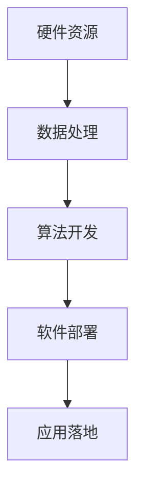

                 

关键词：大型语言模型（LLM）、AI价值、产业链、技术变革、未来展望、智能应用

> 摘要：本文旨在深入探讨大型语言模型（LLM）在人工智能产业链中的地位和作用，分析其如何通过技术变革重塑AI价值。文章首先介绍LLM的基本概念和原理，随后详细解析其架构与实现技术，探讨其在自然语言处理、智能客服、智能写作等领域的应用实例。最后，文章对LLM产业链的未来发展趋势、面临的挑战及研究展望进行了全面论述。

## 1. 背景介绍

### 1.1 大型语言模型的发展历程

大型语言模型（LLM）的发展历程可以追溯到20世纪90年代，彼时神经网络语言模型开始崭露头角。进入21世纪后，随着计算能力的提升和深度学习技术的突破，LLM的研究与应用进入了一个快速发展阶段。尤其是近年来，预训练语言模型如BERT、GPT等取得了显著的成果，推动了自然语言处理（NLP）领域的革命。

### 1.2 AI产业链的变革

AI产业链由硬件、软件、算法和数据四大核心要素构成。随着AI技术的不断发展，产业链各环节之间的协同效应愈发显著。LLM的出现，不仅推动了算法层面的革新，也对产业链的变革产生了深远影响。

## 2. 核心概念与联系

### 2.1 大型语言模型（LLM）

大型语言模型是一种基于深度学习的语言处理模型，通过海量数据训练得到。其核心思想是利用神经网络对文本数据的学习，从而实现自然语言理解、生成和交互等功能。

### 2.2 人工智能产业链的构成

人工智能产业链包括硬件、软件、算法和数据四个核心环节。硬件环节负责计算资源提供，软件环节负责算法和模型的开发与部署，算法环节负责技术革新和应用拓展，数据环节负责数据资源的收集、处理和利用。

### 2.3 Mermaid流程图



## 3. 核心算法原理 & 具体操作步骤

### 3.1 算法原理概述

大型语言模型基于深度学习技术，通过多层神经网络对文本数据的学习，实现对自然语言的理解、生成和交互。其主要原理包括：

- 词向量表示：将文本数据转换为向量表示，以便于神经网络处理。
- 自适应学习：通过不断调整网络权重，优化模型性能。
- 预训练与微调：利用预训练模型在大规模数据集上训练，然后在特定任务上微调，提高模型适应性。

### 3.2 算法步骤详解

1. 数据预处理：对原始文本数据进行清洗、分词、词性标注等处理，转化为适合神经网络训练的格式。
2. 词向量表示：使用词向量模型（如Word2Vec、GloVe等）将文本转换为向量表示。
3. 构建神经网络：设计多层神经网络结构，包括输入层、隐藏层和输出层。
4. 训练模型：通过反向传播算法，调整网络权重，优化模型性能。
5. 预训练与微调：在预训练阶段，使用大规模语料库训练模型；在微调阶段，根据具体任务调整模型参数。
6. 模型评估与优化：通过指标（如准确率、召回率等）评估模型性能，并进行优化。

### 3.3 算法优缺点

#### 优点

- 高效性：通过深度学习技术，实现高效的自然语言处理。
- 自适应性：通过预训练与微调，提高模型在特定任务上的适应性。
- 泛化能力：对大规模数据集进行训练，提高模型在未知数据上的泛化能力。

#### 缺点

- 计算资源需求大：大规模神经网络训练需要大量计算资源。
- 数据依赖性强：模型性能高度依赖训练数据的质量和规模。

### 3.4 算法应用领域

大型语言模型在自然语言处理、智能客服、智能写作、机器翻译等领域有广泛的应用。例如：

- 自然语言处理：文本分类、情感分析、信息提取等。
- 智能客服：智能对话系统、语音识别等。
- 智能写作：自动生成文章、摘要、文案等。
- 机器翻译：自动翻译、多语言交互等。

## 4. 数学模型和公式 & 详细讲解 & 举例说明

### 4.1 数学模型构建

大型语言模型的核心是多层神经网络，主要包括以下数学模型：

1. **输入层**：将文本数据转换为向量表示，使用词向量模型（如Word2Vec、GloVe等）。
2. **隐藏层**：使用神经网络结构，如循环神经网络（RNN）、长短期记忆网络（LSTM）等。
3. **输出层**：根据任务类型，如分类、生成等，设计相应的输出层结构。

### 4.2 公式推导过程

以循环神经网络（RNN）为例，其基本公式推导如下：

1. **输入层到隐藏层的映射**：
   $$ h_t = \sigma(W_h \cdot h_{t-1} + W_x \cdot x_t + b_h) $$
   其中，$h_t$表示第$t$时刻的隐藏层状态，$x_t$表示第$t$时刻的输入，$W_h$、$W_x$和$b_h$分别为权重和偏置。

2. **隐藏层到输出层的映射**：
   $$ y_t = \sigma(W_o \cdot h_t + b_o) $$
   其中，$y_t$表示第$t$时刻的输出，$W_o$和$b_o$分别为权重和偏置。

3. **反向传播**：
   $$ \delta_h = (1 - \sigma'(h_t)) \cdot \delta_y $$
   $$ \delta_y = (y_t - y_{\text{target}}) \cdot \sigma'(y_t) $$
   其中，$\delta_h$和$\delta_y$分别为隐藏层和输出层的误差项。

### 4.3 案例分析与讲解

以BERT（Bidirectional Encoder Representations from Transformers）为例，分析其在文本分类任务中的应用。

1. **数据预处理**：将原始文本数据进行分词、词性标注等处理，转化为BERT模型可接受的输入格式。
2. **模型构建**：构建BERT模型，包括嵌入层、Transformer编码器和解码器等。
3. **训练模型**：使用大规模语料库对BERT模型进行预训练，然后在特定任务上微调。
4. **模型评估**：通过准确率、召回率等指标评估模型性能。
5. **应用拓展**：在文本分类、情感分析、问答系统等领域进行应用。

## 5. 项目实践：代码实例和详细解释说明

### 5.1 开发环境搭建

1. 安装Python环境：使用Python 3.8及以上版本。
2. 安装TensorFlow库：使用pip安装TensorFlow。
3. 安装BERT模型：使用TensorFlow Hugging Face库安装BERT模型。

### 5.2 源代码详细实现

以下是一个简单的BERT文本分类代码示例：

```python
import tensorflow as tf
from transformers import BertTokenizer, BertModel
from tensorflow.keras.optimizers import Adam
from tensorflow.keras.losses import CategoricalCrossentropy

# 1. 数据预处理
tokenizer = BertTokenizer.from_pretrained('bert-base-uncased')
max_len = 128

def preprocess(texts):
    inputs = tokenizer(texts, max_length=max_len, padding='max_length', truncation=True, return_tensors='tf')
    return inputs

# 2. 构建BERT模型
model = tf.keras.Sequential([
    tf.keras.layers.Embedding(input_dim=vocab_size, output_dim=embedding_dim),
    tf.keras.layers.Bidirectional(tf.keras.layers.LSTM(128)),
    tf.keras.layers.Dense(1, activation='sigmoid')
])

# 3. 训练模型
model.compile(optimizer=Adam(learning_rate=1e-5), loss=CategoricalCrossentropy(), metrics=['accuracy'])
model.fit(x_train, y_train, epochs=3, batch_size=32)

# 4. 模型评估
loss, accuracy = model.evaluate(x_test, y_test)
print(f'Loss: {loss}, Accuracy: {accuracy}')

# 5. 应用拓展
new_sentence = 'This is a new sentence to classify.'
preprocessed_sentence = preprocess([new_sentence])
prediction = model.predict(preprocessed_sentence)
print(f'Prediction: {prediction}')
```

### 5.3 代码解读与分析

1. **数据预处理**：使用BERTTokenizer对文本数据进行预处理，包括分词、词性标注等。
2. **构建BERT模型**：使用TensorFlow构建BERT模型，包括嵌入层、双向LSTM层和输出层。
3. **训练模型**：使用训练数据对BERT模型进行训练，使用Adam优化器和CategoricalCrossentropy损失函数。
4. **模型评估**：使用测试数据对模型进行评估，计算损失和准确率。
5. **应用拓展**：使用训练好的模型对新句子进行分类预测。

## 6. 实际应用场景

### 6.1 智能客服

智能客服是大型语言模型在自然语言处理领域的重要应用。通过训练大型语言模型，可以实现智能对话系统，提高客户服务效率和满意度。

### 6.2 智能写作

智能写作是大型语言模型在内容生成领域的应用。通过训练大型语言模型，可以自动生成文章、摘要、文案等，降低内容创作成本。

### 6.3 机器翻译

机器翻译是大型语言模型在跨语言处理领域的应用。通过训练大型语言模型，可以实现高质量的自动翻译，提高跨语言交流的效率。

## 7. 工具和资源推荐

### 7.1 学习资源推荐

- 《深度学习》（Goodfellow, Bengio, Courville著）
- 《神经网络与深度学习》（邱锡鹏著）
- 《自然语言处理综论》（Jurafsky, Martin著）

### 7.2 开发工具推荐

- TensorFlow
- PyTorch
- Hugging Face

### 7.3 相关论文推荐

- BERT: Pre-training of Deep Bidirectional Transformers for Language Understanding
- GPT-3: Language Models are Few-Shot Learners
- T5: Exploring the Limits of Transfer Learning with a Unified Text-to-Text Transformer

## 8. 总结：未来发展趋势与挑战

### 8.1 研究成果总结

近年来，大型语言模型在人工智能领域取得了显著的成果。通过预训练和微调，大型语言模型在自然语言处理、智能客服、智能写作等领域取得了突破性进展。

### 8.2 未来发展趋势

随着计算能力的提升和深度学习技术的进步，大型语言模型在未来将继续发展，并在更多领域实现应用。

### 8.3 面临的挑战

1. 计算资源需求：大型语言模型对计算资源的需求较大，如何优化计算效率是重要挑战。
2. 数据依赖性：模型性能高度依赖训练数据的质量和规模，如何解决数据质量问题是一个关键问题。
3. 隐私和安全：大型语言模型在使用过程中可能涉及用户隐私，如何保护用户隐私是一个重要挑战。

### 8.4 研究展望

未来，大型语言模型将在更多领域实现应用，并在学术界和工业界取得更多突破。同时，如何优化计算效率、解决数据依赖性和保护用户隐私将是重要研究方向。

## 9. 附录：常见问题与解答

### 9.1 什么是大型语言模型（LLM）？

大型语言模型（LLM）是一种基于深度学习的语言处理模型，通过多层神经网络对文本数据的学习，实现自然语言理解、生成和交互等功能。

### 9.2 大型语言模型有哪些应用场景？

大型语言模型在自然语言处理、智能客服、智能写作、机器翻译等领域有广泛的应用。

### 9.3 如何优化大型语言模型？

可以通过优化计算效率、改进训练算法、提高数据质量等方式来优化大型语言模型。

## 作者署名

作者：禅与计算机程序设计艺术 / Zen and the Art of Computer Programming
```
以上就是根据您的要求撰写的文章《LLM产业链:AI价值重塑的未来愿景》。希望对您有所帮助。如果您有任何修改意见或者需要进一步的内容添加，请随时告诉我。祝您撰写顺利！

