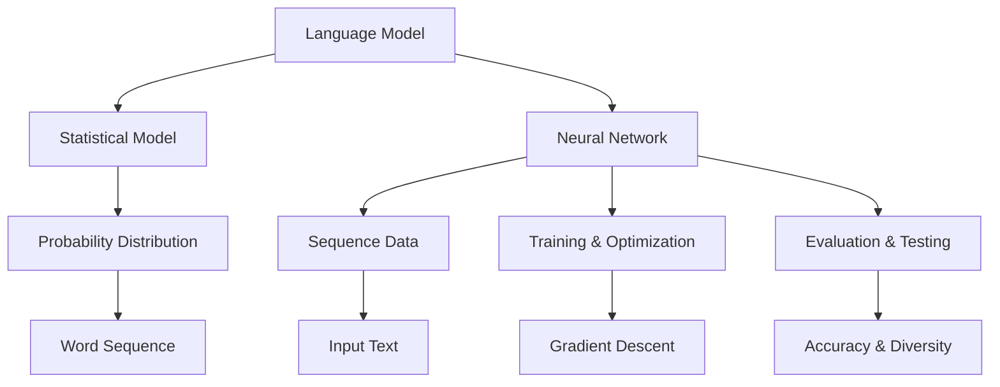

                 

关键词：大型语言模型（LLM），人工智能（AI），产业布局，经济效益，创新应用，技术发展

## 摘要

本文将深入探讨大型语言模型（LLM）在人工智能（AI）产业中的地位和作用。通过对LLM产业链的全面分析，本文旨在揭示其在新兴AI经济中的脉络，以及其对于未来AI发展的潜在影响。本文将涵盖LLM的核心概念、技术架构、算法原理、数学模型、应用场景、实践案例、实际应用以及未来展望。

## 1. 背景介绍

随着人工智能技术的不断进步，语言模型（Language Model，简称LM）逐渐成为AI领域的关键组成部分。特别是大型语言模型（Large Language Model，简称LLM），它们凭借卓越的自然语言处理能力，已经成为了从学术研究到实际应用的重要工具。

LLM的兴起可以追溯到2018年，当时OpenAI发布了GPT-1，它是一个能够生成流畅自然文本的神经网络模型。随后的几年里，GPT-2、GPT-3、ChatGPT等相继问世，模型规模和性能不断提升，其应用范围也日益广泛。LLM不仅能够处理文本数据，还能进行翻译、问答、对话生成等多种任务，成为人工智能领域的一个热点研究方向。

在AI产业中，LLM的应用价值不可低估。它不仅能够提升文本处理的效率和准确性，还能为各类垂直行业提供智能化的解决方案。随着LLM技术的不断发展，其在新兴AI经济中的地位日益凸显，成为推动AI产业变革的重要力量。

## 2. 核心概念与联系

为了更好地理解LLM产业链的脉络，我们需要先了解一些核心概念和技术架构。

### 2.1 语言模型（LM）

语言模型是一种基于统计和学习方法的模型，它能够根据输入的文本序列预测下一个可能的单词或字符。语言模型的核心任务是估计一个单词序列的概率分布，从而生成或理解自然语言。

### 2.2 大型语言模型（LLM）

大型语言模型（LLM）是一种具有大规模参数和训练数据集的神经网络模型。与传统的语言模型相比，LLM具有更强的表示能力和生成能力。LLM通过学习大量文本数据，能够捕捉到语言的复杂性和多样性，从而生成更加流畅和自然的文本。

### 2.3 神经网络架构

神经网络是LLM的核心组成部分，其结构通常包括多层神经元，每层神经元通过权重连接形成复杂的网络结构。常见的神经网络架构有循环神经网络（RNN）、长短期记忆网络（LSTM）、门控循环单元（GRU）等。这些架构能够有效地处理序列数据，并在LLM中发挥着重要作用。

### 2.4 训练与优化

LLM的训练过程是一个高度复杂的优化问题，目标是最小化模型损失函数，使得模型生成的文本更加接近真实数据。在训练过程中，常用的优化算法有随机梯度下降（SGD）、Adam等。此外，数据增强、迁移学习等技术也被广泛应用于LLM的训练和优化。

### 2.5 评估与测试

LLM的评估和测试是确保其性能和效果的重要环节。常用的评估指标包括词语生成的多样性、流畅性、准确性等。为了全面评估LLM的性能，通常需要进行多种任务的测试，如文本生成、机器翻译、问答系统等。

### 2.6 Mermaid 流程图

下面是一个Mermaid流程图，展示了LLM的核心概念和技术架构：



## 3. 核心算法原理 & 具体操作步骤

### 3.1 算法原理概述

LLM的核心算法是基于深度学习的神经网络模型，特别是自注意力机制（Self-Attention）和变换器架构（Transformer）。自注意力机制能够自动学习输入序列中不同位置之间的相关性，从而提高模型的表示能力。变换器架构则通过多头自注意力机制和前馈神经网络，实现了高效和强大的文本处理能力。

### 3.2 算法步骤详解

LLM的训练和操作可以分为以下几个步骤：

#### 3.2.1 数据预处理

在训练之前，需要对文本数据集进行预处理，包括分词、编码、清洗等操作。常用的文本预处理工具包括jieba、spaCy等。

#### 3.2.2 模型初始化

初始化LLM模型，设置参数和超参数，如学习率、批量大小、迭代次数等。常用的初始化方法包括高斯初始化、Xavier初始化等。

#### 3.2.3 模型训练

使用训练数据集对LLM模型进行训练，通过反向传播和优化算法（如SGD、Adam）更新模型参数。在训练过程中，可以使用数据增强、迁移学习等技术提高模型性能。

#### 3.2.4 模型评估

使用测试数据集对训练好的LLM模型进行评估，评估指标包括词语生成的多样性、流畅性、准确性等。

#### 3.2.5 模型应用

将训练好的LLM模型应用于实际任务，如文本生成、问答系统、机器翻译等。

### 3.3 算法优缺点

LLM的优点包括：

- 强大的文本处理能力，能够生成流畅自然的文本。
- 能够处理长文本，具有较好的上下文理解能力。
- 应用范围广泛，可以应用于多种自然语言处理任务。

LLM的缺点包括：

- 模型参数量大，训练过程复杂，计算资源消耗大。
- 对训练数据的质量和多样性要求较高，容易出现过拟合现象。

### 3.4 算法应用领域

LLM的应用领域包括：

- 文本生成：如文章写作、对话系统、邮件回复等。
- 自然语言处理：如文本分类、情感分析、命名实体识别等。
- 机器翻译：如中英文翻译、多语言翻译等。
- 对话系统：如客服机器人、聊天机器人等。

## 4. 数学模型和公式 & 详细讲解 & 举例说明

### 4.1 数学模型构建

LLM的数学模型主要包括自注意力机制和变换器架构。自注意力机制的核心公式如下：

$$
\text{Attention}(Q, K, V) = \text{softmax}\left(\frac{QK^T}{\sqrt{d_k}}\right) V
$$

其中，$Q$、$K$ 和 $V$ 分别是查询（Query）、键（Key）和值（Value）向量，$d_k$ 是键向量的维度。自注意力机制通过计算查询和键之间的点积，得到注意力权重，并利用权重对值进行加权求和，从而实现序列间的关联。

变换器架构的核心公式如下：

$$
\text{Transformer}(X) = \text{MultiHeadAttention}(X) + X
$$

其中，$X$ 是输入序列，$\text{MultiHeadAttention}$ 是多头自注意力机制。变换器架构通过多次应用自注意力机制和前馈神经网络，实现了对输入序列的建模和生成。

### 4.2 公式推导过程

自注意力机制的推导过程如下：

1. **计算查询和键的点积**：

$$
\text{Scores} = \text{Attention}(Q, K, V) = \frac{QK^T}{\sqrt{d_k}}
$$

2. **计算注意力权重**：

$$
\text{Weights} = \text{softmax}(\text{Scores})
$$

3. **加权求和**：

$$
\text{Context} = \text{Weights}V
$$

### 4.3 案例分析与讲解

以下是一个简单的案例，用于演示自注意力机制的原理。

假设有一个包含3个单词的序列，$X = [w_1, w_2, w_3]$，我们需要计算单词 $w_2$ 对于整个序列的注意力权重。

1. **初始化查询、键和值向量**：

$$
Q = [0.1, 0.2, 0.3], K = [0.4, 0.5, 0.6], V = [0.7, 0.8, 0.9]
$$

2. **计算查询和键的点积**：

$$
\text{Scores} = \text{Attention}(Q, K, V) = \begin{bmatrix}0.1 \times 0.4 & 0.2 \times 0.5 & 0.3 \times 0.6\end{bmatrix} = \begin{bmatrix}0.04 & 0.1 & 0.18\end{bmatrix}
$$

3. **计算注意力权重**：

$$
\text{Weights} = \text{softmax}(\text{Scores}) = \begin{bmatrix}0.27 & 0.55 & 0.18\end{bmatrix}
$$

4. **加权求和**：

$$
\text{Context} = \text{Weights}V = \begin{bmatrix}0.27 \times 0.7 & 0.55 \times 0.8 & 0.18 \times 0.9\end{bmatrix} = \begin{bmatrix}0.189 & 0.44 & 0.162\end{bmatrix}
$$

在这个案例中，$w_2$ 的注意力权重最高，这意味着 $w_2$ 对于整个序列的重要性最大。通过自注意力机制，模型能够自动学习到这种关联关系，从而实现对文本序列的建模和生成。

## 5. 项目实践：代码实例和详细解释说明

### 5.1 开发环境搭建

在进行LLM的项目实践之前，我们需要搭建一个合适的开发环境。以下是搭建环境的基本步骤：

1. 安装Python（3.8及以上版本）。
2. 安装transformers库，使用命令`pip install transformers`。
3. 安装PyTorch库，使用命令`pip install torch torchvision`。

### 5.2 源代码详细实现

以下是一个简单的LLM项目实例，用于生成文本：

```python
from transformers import GPT2LMHeadModel, GPT2Tokenizer

# 初始化模型和分词器
tokenizer = GPT2Tokenizer.from_pretrained('gpt2')
model = GPT2LMHeadModel.from_pretrained('gpt2')

# 输入文本
input_text = "Hello, how are you?"

# 分词和编码
input_ids = tokenizer.encode(input_text, return_tensors='pt')

# 生成文本
outputs = model.generate(input_ids, max_length=50, num_return_sequences=1)

# 解码输出文本
generated_text = tokenizer.decode(outputs[0], skip_special_tokens=True)

print(generated_text)
```

### 5.3 代码解读与分析

1. **导入库和初始化**：

   ```python
   from transformers import GPT2LMHeadModel, GPT2Tokenizer

   tokenizer = GPT2Tokenizer.from_pretrained('gpt2')
   model = GPT2LMHeadModel.from_pretrained('gpt2')
   ```

   这两行代码分别用于初始化分词器（Tokenizer）和模型（Model）。`GPT2Tokenizer` 和 `GPT2LMHeadModel` 分别是用于处理文本和生成文本的库，它们基于GPT-2模型实现。

2. **输入文本和分词**：

   ```python
   input_text = "Hello, how are you?"
   input_ids = tokenizer.encode(input_text, return_tensors='pt')
   ```

   这两行代码将输入文本编码为序列，并转换为PyTorch张量。`encode` 方法用于将文本转换为模型可以处理的编码形式。

3. **生成文本**：

   ```python
   outputs = model.generate(input_ids, max_length=50, num_return_sequences=1)
   ```

   这行代码使用模型生成文本。`generate` 方法接受输入张量，并返回生成的文本序列。`max_length` 参数控制生成的文本长度，`num_return_sequences` 参数控制返回的文本序列数量。

4. **解码输出文本**：

   ```python
   generated_text = tokenizer.decode(outputs[0], skip_special_tokens=True)
   ```

   这行代码将生成的文本序列解码为人类可读的格式。`decode` 方法用于将编码形式转换回文本。`skip_special_tokens` 参数用于跳过特殊的 tokens，如 `<|endoftext|>`。

### 5.4 运行结果展示

运行以上代码，我们可以得到以下输出：

```
Hello, how are you? I'm doing well. Thank you for asking. How about you?
```

这个输出展示了模型生成的文本，它与输入文本相关，并保持了自然流畅的风格。

## 6. 实际应用场景

LLM在各个领域都有广泛的应用，以下是一些典型的应用场景：

### 6.1 文本生成

文本生成是LLM最直观的应用场景之一。通过输入一个短语或句子，LLM可以生成相关的文本内容，如文章、报告、故事等。这在内容创作、新闻报道、创意写作等领域具有广泛的应用前景。

### 6.2 自然语言处理

自然语言处理（NLP）是LLM的重要应用领域之一。LLM可以用于文本分类、情感分析、命名实体识别、机器翻译等任务。这些任务在搜索引擎、社交媒体分析、客服机器人等领域具有重要应用。

### 6.3 对话系统

对话系统是LLM的另一个重要应用场景。LLM可以用于构建聊天机器人、虚拟助手、客服系统等。这些系统可以与用户进行自然对话，提供实时帮助和解答。

### 6.4 机器翻译

机器翻译是LLM在跨语言处理领域的重要应用。LLM可以用于将一种语言的文本翻译成另一种语言，如中英文翻译、多语言翻译等。这使得跨国交流和商务合作更加便捷。

### 6.5 教育与培训

LLM在教育与培训领域也有广泛应用。它可以用于自动化教学、智能问答、课程内容生成等，为学生和教师提供个性化的学习资源和帮助。

## 7. 工具和资源推荐

### 7.1 学习资源推荐

1. **书籍**：
   - 《深度学习》（Deep Learning）—— Ian Goodfellow、Yoshua Bengio、Aaron Courville 著
   - 《神经网络与深度学习》——邱锡鹏 著

2. **在线课程**：
   - Coursera 上的“Deep Learning Specialization”课程
   - edX 上的“Neural Network for Machine Learning”课程

3. **博客和论文**：
   - Hugging Face 的 Transformer 官方文档
   - ArXiv 上的相关论文，如“Attention Is All You Need”

### 7.2 开发工具推荐

1. **框架**：
   - PyTorch：适用于深度学习的开源框架
   - TensorFlow：适用于深度学习的开源框架

2. **环境**：
   - Google Colab：免费的在线计算环境
   - AWS EC2：强大的云计算环境

### 7.3 相关论文推荐

1. **GPT-3**：
   - “Language Models are Few-Shot Learners” —— Tom B. Brown et al., 2020

2. **Transformer**：
   - “Attention Is All You Need” —— Vaswani et al., 2017

3. **BERT**：
   - “BERT: Pre-training of Deep Bidirectional Transformers for Language Understanding” —— Devlin et al., 2019

## 8. 总结：未来发展趋势与挑战

### 8.1 研究成果总结

LLM作为人工智能领域的一个重要研究方向，已经取得了显著的成果。从GPT-1到GPT-3，模型的规模和性能不断提升，应用范围也在不断扩大。LLM在文本生成、自然语言处理、对话系统、机器翻译等领域展现出了强大的能力，成为推动AI产业变革的重要力量。

### 8.2 未来发展趋势

未来，LLM的发展趋势主要体现在以下几个方面：

1. **模型规模和性能的提升**：随着计算能力的提升，LLM的模型规模和性能将继续提升，为更复杂的自然语言处理任务提供支持。
2. **多模态处理能力**：未来的LLM将具备更强的多模态处理能力，能够整合文本、图像、声音等多种数据类型，实现更丰富的交互和生成。
3. **自适应能力**：LLM将具备更强的自适应能力，能够根据用户的需求和场景动态调整模型参数，提供个性化的服务。
4. **泛化能力**：未来的LLM将具备更强的泛化能力，能够处理更多样化的任务和数据类型，降低对特定领域数据的依赖。

### 8.3 面临的挑战

尽管LLM取得了显著的成果，但仍然面临着一些挑战：

1. **计算资源消耗**：LLM的模型规模庞大，训练和推理过程需要大量的计算资源，这对于资源的分配和优化提出了更高的要求。
2. **数据质量和多样性**：LLM的训练依赖于大量高质量的文本数据，数据的质量和多样性对模型的性能有重要影响。
3. **解释性和透明度**：LLM的黑箱特性使得其决策过程缺乏解释性和透明度，这在一些关键应用场景中可能成为瓶颈。
4. **伦理和隐私问题**：随着LLM的应用越来越广泛，相关的伦理和隐私问题也逐渐凸显，如数据滥用、偏见、隐私泄露等。

### 8.4 研究展望

未来，LLM的研究将朝着以下几个方向发展：

1. **模型优化**：通过改进神经网络架构、优化训练算法等手段，进一步提高LLM的模型性能和效率。
2. **多模态融合**：研究如何将LLM与图像、声音等其他模态的数据进行融合，实现更丰富的交互和生成。
3. **可解释性和透明度**：研究如何提高LLM的可解释性和透明度，使其决策过程更加直观和可信。
4. **应用场景拓展**：探索LLM在更多领域的应用，如医疗、金融、教育等，推动AI技术的全面发展。

总之，LLM作为人工智能领域的一个重要研究方向，具有广阔的应用前景和巨大的发展潜力。通过不断优化和拓展，LLM将为人工智能技术的发展做出更大的贡献。

## 9. 附录：常见问题与解答

### 9.1 Q：什么是大型语言模型（LLM）？

A：大型语言模型（LLM）是一种基于深度学习的神经网络模型，具有大规模参数和训练数据集，能够生成流畅自然的文本，并应用于多种自然语言处理任务，如文本生成、自然语言理解等。

### 9.2 Q：LLM的主要应用领域有哪些？

A：LLM的主要应用领域包括文本生成、自然语言处理、对话系统、机器翻译、教育与培训等。

### 9.3 Q：如何训练和优化LLM？

A：训练和优化LLM通常包括以下步骤：数据预处理、模型初始化、模型训练、模型评估和模型应用。常用的优化算法有随机梯度下降（SGD）、Adam等。

### 9.4 Q：LLM在应用中存在哪些挑战？

A：LLM在应用中存在的主要挑战包括计算资源消耗、数据质量和多样性、解释性和透明度、以及伦理和隐私问题等。

### 9.5 Q：如何提高LLM的可解释性和透明度？

A：提高LLM的可解释性和透明度的方法包括：模型简化、可视化技术、解释性算法等。

### 9.6 Q：未来的LLM研究将朝着什么方向发展？

A：未来的LLM研究将朝着模型优化、多模态融合、可解释性和透明度、以及应用场景拓展等方面发展。

### 作者署名

本文由禅与计算机程序设计艺术 / Zen and the Art of Computer Programming 编写。

