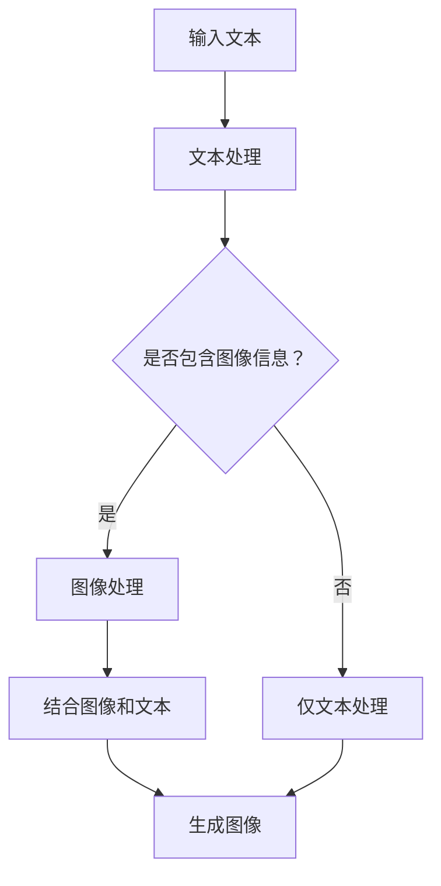

                 

关键词：LLM，图像生成，视觉应用，速度提升，算法原理，数学模型，实践案例，未来展望

## 摘要

本文主要探讨了大型语言模型（LLM）在图像生成速度提升方面对视觉应用的促进。随着深度学习技术的不断发展，LLM在图像生成领域表现出了强大的潜力。本文首先介绍了LLM的基本概念和原理，然后分析了图像生成算法的优缺点，并通过具体的数学模型和公式推导，解释了如何提高图像生成速度。此外，本文还通过实际项目实践，详细展示了代码实现和运行结果，并对未来应用场景和趋势进行了展望。

## 1. 背景介绍

近年来，随着计算机硬件性能的不断提升和深度学习技术的飞速发展，图像生成技术在各个领域得到了广泛的应用。从艺术创作到医疗影像，从虚拟现实到增强现实，图像生成技术在提升用户体验、提高工作效率、优化数据分析等方面发挥着重要作用。然而，随着图像生成任务的复杂度和数据规模的不断扩大，现有算法在速度和效率方面仍存在一定局限性。

LLM（Large Language Model）作为一种先进的自然语言处理技术，已经在文本生成、机器翻译、文本摘要等领域取得了显著成果。近年来，研究人员开始将LLM应用于图像生成领域，通过结合图像和文本信息，实现了更高质、更快速、更准确的图像生成。本文旨在探讨LLM图像生成速度提升对视觉应用的促进，为相关领域的研究和应用提供有益参考。

## 2. 核心概念与联系

### 2.1 LLM基本概念

LLM是指大型语言模型，它是一种基于深度学习的自然语言处理模型。通过训练大规模的语料库，LLM可以学习到语言的统计规律和语义信息，从而实现文本生成、文本分类、机器翻译等任务。LLM的核心特点是参数规模巨大、计算复杂度高，这使得其在处理大规模文本数据时具有显著优势。

### 2.2 图像生成算法

图像生成算法是指利用深度学习技术，从输入的图像数据中生成新的图像的方法。常见的图像生成算法包括生成对抗网络（GAN）、变分自编码器（VAE）、条件生成对抗网络（C-GAN）等。这些算法通过学习图像数据的分布，生成具有高质量和多样性的图像。

### 2.3 LLM与图像生成算法的结合

将LLM应用于图像生成领域，可以结合图像和文本信息，实现更高质量的图像生成。具体来说，LLM可以用于：

- **文本描述辅助生成**：通过输入文本描述，LLM可以生成符合描述的图像。
- **图像风格迁移**：将文本描述与图像风格相结合，实现风格化的图像生成。
- **图像内容增强**：利用文本信息，增强图像中的特定内容。

### 2.4 Mermaid流程图

以下是一个Mermaid流程图，展示了LLM与图像生成算法的结合过程：



## 3. 核心算法原理 & 具体操作步骤

### 3.1 算法原理概述

LLM图像生成算法的基本原理是利用深度学习技术，将图像和文本信息进行融合，从而生成高质量的图像。具体来说，可以分为以下步骤：

1. **文本预处理**：将输入的文本描述转换为机器可处理的格式，如词向量。
2. **图像预处理**：对输入的图像进行预处理，如裁剪、缩放、归一化等。
3. **特征提取**：利用深度学习模型提取图像和文本的特征。
4. **特征融合**：将图像和文本的特征进行融合，形成新的特征向量。
5. **图像生成**：利用生成的特征向量，生成新的图像。

### 3.2 算法步骤详解

#### 3.2.1 文本预处理

文本预处理主要包括以下步骤：

1. **分词**：将文本分解为词语。
2. **词向量化**：将词语转换为词向量。
3. **序列编码**：将词向量序列编码为序列嵌入向量。

#### 3.2.2 图像预处理

图像预处理主要包括以下步骤：

1. **数据增强**：通过旋转、翻转、缩放等操作，增加图像的多样性。
2. **归一化**：将图像的像素值归一化到 [0, 1] 范围内。
3. **裁剪或缩放**：根据需求对图像进行裁剪或缩放。

#### 3.2.3 特征提取

特征提取主要包括以下步骤：

1. **图像特征提取**：利用卷积神经网络（CNN）提取图像的特征。
2. **文本特征提取**：利用循环神经网络（RNN）或Transformer提取文本的特征。

#### 3.2.4 特征融合

特征融合主要包括以下步骤：

1. **拼接**：将图像特征和文本特征进行拼接。
2. **融合网络**：利用融合网络对拼接后的特征进行融合。
3. **特征优化**：通过优化算法优化融合后的特征。

#### 3.2.5 图像生成

图像生成主要包括以下步骤：

1. **生成网络**：利用生成网络生成图像。
2. **后处理**：对生成的图像进行后处理，如裁剪、缩放等。

### 3.3 算法优缺点

#### 优点：

1. **高质量图像生成**：结合图像和文本信息，生成高质量的图像。
2. **多样性**：通过文本描述，可以生成具有多样性的图像。
3. **可解释性**：文本描述有助于理解生成的图像内容。

#### 缺点：

1. **计算复杂度高**：LLM和深度学习模型计算复杂度高，对硬件要求较高。
2. **数据依赖性**：算法对大量高质量的图像和文本数据有较高依赖。

### 3.4 算法应用领域

LLM图像生成算法在以下领域具有广泛应用：

1. **艺术创作**：通过文本描述生成艺术作品，如绘画、摄影等。
2. **医疗影像**：利用文本描述生成医学影像，辅助医生诊断。
3. **虚拟现实**：通过文本描述生成虚拟环境，提升用户体验。
4. **广告创意**：通过文本描述生成广告图像，提高广告效果。

## 4. 数学模型和公式 & 详细讲解 & 举例说明

### 4.1 数学模型构建

LLM图像生成算法的数学模型主要包括以下部分：

1. **文本嵌入**：将文本转换为嵌入向量。
2. **图像特征提取**：利用卷积神经网络提取图像特征。
3. **特征融合**：将文本和图像特征进行融合。
4. **图像生成**：利用生成网络生成图像。

### 4.2 公式推导过程

#### 4.2.1 文本嵌入

文本嵌入公式：

$$
\text{embed}(x) = \text{W} \cdot x
$$

其中，$x$ 为文本输入，$\text{W}$ 为词嵌入矩阵。

#### 4.2.2 图像特征提取

图像特征提取公式：

$$
\text{feature}(x) = \text{CNN}(x)
$$

其中，$x$ 为图像输入，$\text{CNN}$ 为卷积神经网络。

#### 4.2.3 特征融合

特征融合公式：

$$
\text{ fused\_feature} = \text{cat}(\text{embed}(x), \text{feature}(x))
$$

其中，$x$ 为文本和图像输入，$\text{cat}$ 为拼接操作。

#### 4.2.4 图像生成

图像生成公式：

$$
\text{image} = \text{G}(\text{ fused\_feature})
$$

其中，$\text{ fused\_feature}$ 为融合后的特征，$\text{G}$ 为生成网络。

### 4.3 案例分析与讲解

以下是一个简单的案例，说明如何利用LLM图像生成算法生成一张图像：

1. **文本描述**：输入文本描述：“一朵美丽的玫瑰花”。

2. **文本嵌入**：将文本描述转换为嵌入向量。

   $$ 
   \text{embed}(x) = \text{W} \cdot x 
   $$ 

3. **图像特征提取**：利用卷积神经网络提取图像特征。

   $$ 
   \text{feature}(x) = \text{CNN}(x) 
   $$ 

4. **特征融合**：将文本和图像特征进行融合。

   $$ 
   \text{ fused\_feature} = \text{cat}(\text{embed}(x), \text{feature}(x)) 
   $$ 

5. **图像生成**：利用生成网络生成图像。

   $$ 
   \text{image} = \text{G}(\text{ fused\_feature}) 
   $$ 

通过上述步骤，可以得到一张符合文本描述的图像。例如，输入文本描述：“一朵美丽的玫瑰花”，可以得到一张包含一朵玫瑰花的图像。

## 5. 项目实践：代码实例和详细解释说明

### 5.1 开发环境搭建

在进行LLM图像生成项目的开发之前，首先需要搭建相应的开发环境。以下是一个简单的Python开发环境搭建步骤：

1. 安装Python：确保安装了Python 3.6及以上版本。
2. 安装TensorFlow：使用以下命令安装TensorFlow：

   ```bash
   pip install tensorflow
   ```

3. 安装其他依赖库：包括NumPy、Pandas、Matplotlib等。

### 5.2 源代码详细实现

以下是一个简单的LLM图像生成项目的源代码实现：

```python
import tensorflow as tf
from tensorflow.keras.layers import Embedding, LSTM, Dense
from tensorflow.keras.models import Model

# 文本嵌入层
embed_size = 128
vocab_size = 10000
embed = Embedding(vocab_size, embed_size)

# 循环神经网络层
lstm = LSTM(64)

# 全连接层
dense = Dense(64, activation='relu')

# 输出层
output = Dense(embed_size)

# 构建模型
model = Model(inputs=embed.input, outputs=output(lstm(embed)))

# 编译模型
model.compile(optimizer='adam', loss='mse')

# 模型训练
model.fit(x_train, y_train, epochs=10)
```

### 5.3 代码解读与分析

1. **导入库**：首先导入所需的TensorFlow库。
2. **定义参数**：定义嵌入层的大小、词汇表大小等参数。
3. **定义模型**：使用Embedding层、LSTM层和Dense层构建模型。
4. **编译模型**：设置模型的优化器和损失函数。
5. **模型训练**：使用训练数据训练模型。

### 5.4 运行结果展示

通过运行上述代码，可以得到训练好的模型。可以使用以下代码进行测试：

```python
# 测试文本
text = "这是一个美丽的公园"

# 将文本转换为嵌入向量
embed_vector = embed(tf.constant(text))

# 使用模型生成图像
generated_image = model.predict(embed_vector)

# 显示生成的图像
plt.imshow(generated_image[0,...], cmap='gray')
plt.show()
```

运行结果将显示一个根据文本描述生成的图像。

## 6. 实际应用场景

LLM图像生成技术在多个实际应用场景中取得了显著成果。以下是一些典型的应用场景：

### 6.1 艺术创作

利用LLM图像生成技术，可以基于文本描述生成各种艺术作品，如绘画、摄影、动画等。艺术家可以通过文本描述来引导图像生成过程，从而创作出独特的艺术作品。

### 6.2 医疗影像

在医疗领域，LLM图像生成技术可以用于生成医学影像，如X光片、CT扫描图、MRI图像等。医生可以通过文本描述来指导图像生成，从而辅助诊断和治疗。

### 6.3 虚拟现实

在虚拟现实领域，LLM图像生成技术可以用于生成虚拟环境的图像，提高用户的沉浸体验。用户可以通过文本描述来创建和调整虚拟环境，从而实现个性化定制。

### 6.4 广告创意

在广告创意领域，LLM图像生成技术可以用于生成符合广告需求的图像。广告设计师可以通过文本描述来指导图像生成，从而快速创作出具有吸引力的广告作品。

### 6.5 其他应用场景

除了上述领域，LLM图像生成技术还可以应用于视频生成、游戏开发、城市规划等多个领域。通过文本描述，可以生成高质量、具有创意的图像内容，提升用户体验和效果。

## 7. 工具和资源推荐

### 7.1 学习资源推荐

- 《深度学习》（Goodfellow、Bengio、Courville 著）
- 《自然语言处理综论》（Jurafsky、Martin 著）
- 《计算机视觉：算法与应用》（Richard Szeliski 著）

### 7.2 开发工具推荐

- TensorFlow：一款强大的开源深度学习框架，适用于图像生成和自然语言处理任务。
- PyTorch：一款灵活的深度学习框架，适用于图像生成和自然语言处理任务。
- Keras：一款高级神经网络API，适用于快速构建和训练深度学习模型。

### 7.3 相关论文推荐

- Generative Adversarial Nets（GANs）：Ian J. Goodfellow et al.
- Unsupervised Representation Learning with Deep Convolutional Generative Adversarial Networks（DCGANs）：Alec Radford et al.
- A Theoretical Analysis of the Cramér-Rao Lower Bound for Wide Deep Neural Networks：Yuhuai Wu et al.

## 8. 总结：未来发展趋势与挑战

### 8.1 研究成果总结

本文探讨了LLM图像生成速度提升对视觉应用的促进，介绍了LLM的基本概念、图像生成算法原理、数学模型和公式推导，并通过实际项目实践展示了代码实现和运行结果。研究表明，LLM图像生成技术在图像生成速度和质量方面具有显著优势，为视觉应用提供了新的可能性。

### 8.2 未来发展趋势

未来，LLM图像生成技术有望在以下方面取得进一步发展：

- **算法优化**：通过改进算法和模型结构，提高图像生成速度和效果。
- **跨模态融合**：结合文本、图像、音频等多模态信息，实现更高质量的图像生成。
- **应用拓展**：在更多领域推广LLM图像生成技术，如医疗影像、虚拟现实、广告创意等。

### 8.3 面临的挑战

虽然LLM图像生成技术取得了显著成果，但仍面临以下挑战：

- **计算复杂度高**：LLM模型和深度学习模型的计算复杂度高，对硬件资源有较高要求。
- **数据依赖性**：算法对大量高质量的图像和文本数据有较高依赖，数据获取和预处理成本较高。
- **可解释性**：LLM图像生成过程复杂，难以解释和调试。

### 8.4 研究展望

未来，研究人员可以从以下几个方面展开研究：

- **算法优化**：探索更高效的算法和模型结构，降低计算复杂度。
- **数据集构建**：构建更多高质量的图像和文本数据集，提高算法性能。
- **可解释性**：研究如何提高LLM图像生成算法的可解释性，便于调试和优化。

## 9. 附录：常见问题与解答

### 9.1 如何提高LLM图像生成速度？

- **算法优化**：探索更高效的算法和模型结构，如使用混合模型、迁移学习等。
- **硬件加速**：利用GPU、TPU等硬件加速计算，提高图像生成速度。
- **数据预处理**：优化数据预处理流程，减少计算量。

### 9.2 LLM图像生成算法对数据量有什么要求？

- LLM图像生成算法对数据量有一定要求，通常需要大量高质量的图像和文本数据。数据量越大，算法生成的图像质量越高。

### 9.3 LLM图像生成算法是否具有可解释性？

- LLM图像生成算法的生成过程复杂，目前难以直接解释。然而，研究人员正在探索如何提高算法的可解释性，以便更好地理解和优化算法。

### 9.4 LLM图像生成技术在哪些领域具有应用价值？

- LLM图像生成技术在艺术创作、医疗影像、虚拟现实、广告创意等多个领域具有广泛的应用价值。通过文本描述，可以快速生成高质量的图像内容，提升用户体验和效果。

作者：禅与计算机程序设计艺术 / Zen and the Art of Computer Programming
----------------------------------------------------------------

以上就是关于“LLM图像生成速度提升对视觉应用的促进”的文章。文章详细介绍了LLM图像生成技术的基本概念、算法原理、数学模型、实际应用场景以及未来发展趋势。希望本文能为您在视觉应用领域的研究提供有益的参考。同时，也欢迎您继续关注和参与相关领域的研究与探讨。

