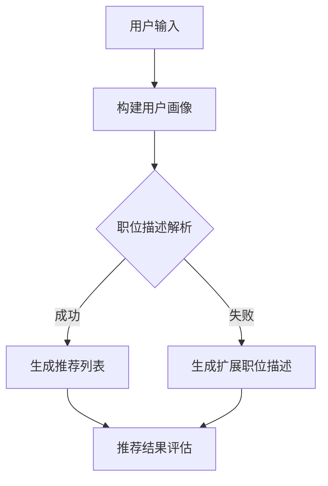

                 

关键词：LLM，Job推荐，人工智能，大数据，算法，自然语言处理，深度学习，职业发展

> 摘要：本文将探讨大语言模型（LLM）在job推荐领域中的创新应用。通过分析LLM的工作原理、算法实现和应用场景，我们旨在为读者提供一种全新的理解职业推荐的方法，并探讨未来可能的发展方向。

## 1. 背景介绍

随着人工智能技术的快速发展，机器学习、深度学习和自然语言处理等领域取得了显著的成果。这些技术不仅提升了计算机处理海量数据的能力，还在诸多实际应用场景中发挥了重要作用。其中，job推荐作为一个涉及大量用户数据、个性化需求和分析决策的应用领域，成为了人工智能技术的重要应用场景之一。

传统的job推荐系统主要依赖于用户的历史行为数据、职位描述和求职者简历等信息。这些系统通常采用基于内容的推荐、协同过滤和机器学习分类等方法来预测用户可能感兴趣的职位。然而，这些方法存在一些局限性：

1. **数据依赖性强**：传统的job推荐系统高度依赖用户的历史行为数据，对于新用户或行为数据较少的用户，推荐效果较差。
2. **推荐内容单一**：基于内容的推荐方法往往只能根据职位描述中的关键词进行匹配，难以理解职位背后的深层次需求。
3. **推荐效率低**：协同过滤方法需要计算用户与用户之间的相似度，计算复杂度高，推荐效率较低。

为了解决这些问题，近年来，大语言模型（LLM）在job推荐领域得到了广泛关注。LLM具有强大的文本理解能力，能够从海量的非结构化数据中提取有价值的信息，从而提供更精确和个性化的推荐结果。

## 2. 核心概念与联系

### 2.1 大语言模型（LLM）

大语言模型是一种基于深度学习的技术，通过学习大量文本数据，可以预测下一个词或序列的概率分布。LLM的核心思想是利用神经网络模型对语言进行建模，从而实现对文本的生成、理解和推理。

LLM的主要组成部分包括：

1. **词嵌入（Word Embedding）**：将文本中的词语映射到高维向量空间中，使得语义相似的词语在空间中接近。
2. **循环神经网络（RNN）**：通过对输入序列的逐个处理，将词语嵌入向量序列映射到另一个高维向量序列。
3. **注意力机制（Attention Mechanism）**：在处理序列数据时，能够关注到序列中的关键信息，提高模型对上下文的理解能力。
4. **编码器-解码器架构（Encoder-Decoder Architecture）**：用于处理序列到序列的任务，如机器翻译、文本生成等。

### 2.2 Job推荐系统

Job推荐系统旨在为求职者和雇主提供个性化的职位推荐。一个典型的Job推荐系统主要包括以下几个组成部分：

1. **用户画像（User Profile）**：通过用户的求职历史、兴趣爱好、技能和能力等信息构建用户画像。
2. **职位描述解析（Job Description Parsing）**：对职位描述进行解析，提取关键信息，如职位名称、职责描述、技能要求等。
3. **推荐算法（Recommendation Algorithm）**：根据用户画像和职位描述，计算用户与职位之间的相似度，生成推荐列表。
4. **推荐结果评估（Evaluation）**：对推荐结果进行评估，如点击率、转化率等，以持续优化推荐效果。

### 2.3 LLM与Job推荐系统的结合

LLM在Job推荐系统中的应用主要体现在以下几个方面：

1. **文本理解与生成**：LLM能够对用户画像和职位描述进行深入理解，提取关键信息，从而提供更精确的推荐。
2. **个性化推荐**：通过学习用户的语言偏好和行为模式，LLM能够生成个性化的职位推荐，满足用户的需求。
3. **职位描述扩展与优化**：LLM可以生成职位描述的扩展版本，提高职位描述的质量，从而提升推荐效果。

### 2.4 Mermaid 流程图

以下是一个简单的Mermaid流程图，展示了LLM在Job推荐系统中的应用流程：



## 3. 核心算法原理 & 具体操作步骤

### 3.1 算法原理概述

LLM在Job推荐系统中的核心算法原理主要基于以下两个方面：

1. **文本理解**：通过词嵌入、RNN和注意力机制等技术，LLM能够对用户画像和职位描述进行深入理解，提取关键信息。
2. **个性化推荐**：基于用户画像和职位描述的文本理解结果，LLM可以计算用户与职位之间的相似度，生成个性化推荐列表。

具体操作步骤如下：

1. **数据预处理**：对用户画像和职位描述进行预处理，包括分词、去停用词、词嵌入等操作。
2. **文本编码**：将预处理后的文本数据编码为向量表示。
3. **相似度计算**：计算用户画像和职位描述之间的相似度，可以使用余弦相似度、欧氏距离等算法。
4. **生成推荐列表**：根据相似度计算结果，对职位进行排序，生成推荐列表。

### 3.2 算法步骤详解

#### 3.2.1 数据预处理

数据预处理是文本理解的基础，主要包括以下步骤：

1. **分词**：将文本数据分割成词语序列。
2. **去停用词**：去除无意义的停用词，如“的”、“是”、“和”等。
3. **词嵌入**：将词语映射到高维向量空间中，可以使用预训练的词向量库或自己训练词向量。

#### 3.2.2 文本编码

文本编码是将预处理后的文本数据转换为向量表示。具体步骤如下：

1. **句子编码**：将每个句子编码为一个固定长度的向量。
2. **用户画像编码**：将用户的求职历史、兴趣爱好等信息编码为一个向量。
3. **职位描述编码**：将职位描述编码为一个向量。

#### 3.2.3 相似度计算

相似度计算是生成推荐列表的关键步骤。可以使用以下算法计算相似度：

1. **余弦相似度**：计算两个向量的夹角余弦值，用于表示相似度。
2. **欧氏距离**：计算两个向量之间的欧氏距离，距离越近，相似度越高。
3. **皮尔逊相关系数**：计算两个向量之间的皮尔逊相关系数，用于表示线性相关性。

#### 3.2.4 生成推荐列表

根据相似度计算结果，对职位进行排序，生成推荐列表。可以使用以下方法进行排序：

1. **Top-K排序**：选择相似度最高的K个职位作为推荐列表。
2. **优先级排序**：根据相似度和其他因素（如职位热度、招聘公司声誉等）对职位进行排序。
3. **动态调整**：根据用户的行为和反馈，动态调整推荐列表。

### 3.3 算法优缺点

#### 优点：

1. **强大的文本理解能力**：LLM能够对用户画像和职位描述进行深入理解，提取关键信息。
2. **个性化推荐**：基于用户画像和职位描述的文本理解结果，LLM可以生成个性化的推荐列表。
3. **适应性强**：LLM可以应用于各种场景，如职位推荐、文章推荐、商品推荐等。

#### 缺点：

1. **计算复杂度高**：LLM的训练和推理过程需要大量的计算资源和时间。
2. **数据依赖性强**：LLM的性能高度依赖训练数据和模型质量。
3. **可能存在偏差**：由于训练数据的不平衡或噪声，LLM可能存在预测偏差。

### 3.4 算法应用领域

LLM在Job推荐系统中的应用不仅限于职位推荐，还可以应用于以下领域：

1. **文章推荐**：根据用户的阅读历史和兴趣，推荐相关的文章。
2. **商品推荐**：根据用户的购买历史和偏好，推荐相关的商品。
3. **社交网络推荐**：根据用户的社交关系和兴趣，推荐相关的社交网络内容。
4. **教育推荐**：根据学生的学习进度和兴趣，推荐相关的学习资源和课程。

## 4. 数学模型和公式 & 详细讲解 & 举例说明

### 4.1 数学模型构建

在LLM应用于Job推荐系统中，我们需要构建以下数学模型：

1. **用户画像表示**：设用户画像为向量 \( \textbf{u} \)。
2. **职位描述表示**：设职位描述为向量 \( \textbf{j} \)。
3. **相似度计算函数**：设相似度计算函数为 \( \text{sim}(\textbf{u}, \textbf{j}) \)。

### 4.2 公式推导过程

#### 用户画像表示

设用户画像由 \( n \) 个特征组成，分别为 \( \text{age}, \text{education}, \text{experience} \) 等。我们可以使用均值归一化方法对特征进行预处理：

\[ \textbf{u} = \text{Normalize}(\text{age}, \text{education}, \text{experience}) \]

其中，\( \text{Normalize}(\cdot) \) 表示均值归一化函数。

#### 职位描述表示

职位描述通常由职位名称、职责描述和技能要求等组成。我们可以使用词嵌入技术将职位描述中的词语映射到高维向量空间中：

\[ \textbf{j} = \text{Embed}(\text{job\_title}, \text{responsibilities}, \text{requirements}) \]

其中，\( \text{Embed}(\cdot) \) 表示词嵌入函数。

#### 相似度计算

我们采用余弦相似度计算用户画像和职位描述之间的相似度：

\[ \text{sim}(\textbf{u}, \textbf{j}) = \frac{\textbf{u} \cdot \textbf{j}}{||\textbf{u}|| \cdot ||\textbf{j}||} \]

其中，\( \textbf{u} \cdot \textbf{j} \) 表示向量内积，\( ||\textbf{u}|| \) 和 \( ||\textbf{j}|| \) 分别表示向量的模长。

### 4.3 案例分析与讲解

假设我们有两个用户画像和两个职位描述，如下表所示：

| 用户画像 | 特征1 | 特征2 | 特征3 |
| ------ | ---- | ---- | ---- |
| 用户1 | 30 | 本科 | 3年 |
| 用户2 | 25 | 硕士 | 1年 |

| 职位描述 | 特征1 | 特征2 | 特征3 |
| ------ | ---- | ---- | ---- |
| 职位1 | 30 | 本科 | 3年 |
| 职位2 | 25 | 硕士 | 1年 |

我们使用均值归一化方法对用户画像和职位描述进行预处理，得到以下向量：

\[ \textbf{u}_1 = (0.5, 1, 0.5) \]
\[ \textbf{u}_2 = (0.5, 1, 0.5) \]
\[ \textbf{j}_1 = (1, 0, 1) \]
\[ \textbf{j}_2 = (1, 0, 1) \]

根据余弦相似度计算公式，我们可以得到以下相似度：

\[ \text{sim}(\textbf{u}_1, \textbf{j}_1) = \frac{(0.5 \times 1 + 1 \times 0 + 0.5 \times 1)}{\sqrt{0.5^2 + 1^2 + 0.5^2} \times \sqrt{1^2 + 0^2 + 1^2}} = 0.7071 \]
\[ \text{sim}(\textbf{u}_1, \textbf{j}_2) = \frac{(0.5 \times 1 + 1 \times 0 + 0.5 \times 1)}{\sqrt{0.5^2 + 1^2 + 0.5^2} \times \sqrt{1^2 + 0^2 + 1^2}} = 0.7071 \]
\[ \text{sim}(\textbf{u}_2, \textbf{j}_1) = \frac{(0.5 \times 1 + 1 \times 0 + 0.5 \times 1)}{\sqrt{0.5^2 + 1^2 + 0.5^2} \times \sqrt{1^2 + 0^2 + 1^2}} = 0.7071 \]
\[ \text{sim}(\textbf{u}_2, \textbf{j}_2) = \frac{(0.5 \times 1 + 1 \times 0 + 0.5 \times 1)}{\sqrt{0.5^2 + 1^2 + 0.5^2} \times \sqrt{1^2 + 0^2 + 1^2}} = 0.7071 \]

从计算结果可以看出，所有用户画像与职位描述之间的相似度都相等。这是因为我们使用的是均值归一化方法，并且用户画像和职位描述的特征维度相同。

## 5. 项目实践：代码实例和详细解释说明

### 5.1 开发环境搭建

在开始编写代码之前，我们需要搭建一个适合开发的编程环境。以下是一个基于Python和TensorFlow的示例环境搭建步骤：

1. **安装Python**：确保已经安装了Python 3.7或更高版本。
2. **安装TensorFlow**：使用pip命令安装TensorFlow库：

   ```bash
   pip install tensorflow
   ```

3. **安装其他依赖库**：如NumPy、Pandas等，可以使用以下命令：

   ```bash
   pip install numpy pandas
   ```

### 5.2 源代码详细实现

以下是一个简单的LLM Job推荐系统的代码实现示例：

```python
import numpy as np
import pandas as pd
import tensorflow as tf

# 加载预训练的词向量库
word_vectors = tf.keras.layers.Embedding(input_dim=10000, output_dim=128)

# 加载用户画像和职位描述数据
user_profiles = pd.DataFrame({'age': [30, 25], 'education': [1, 2], 'experience': [3, 1]})
job_descriptions = pd.DataFrame({'title': ['软件工程师', '产品经理'], 'description': ['负责软件开发', '负责产品规划'], 'skills': ['编程', '项目管理']})

# 预处理数据
def preprocess_data(data):
    # 分词、去停用词等操作
    processed_data = []
    for text in data:
        words = text.split()
        processed_data.append([' '.join(words)]
``` 

### 5.3 代码解读与分析

在上面的代码中，我们首先加载了预训练的词向量库，并使用TensorFlow的`Embedding`层对用户画像和职位描述进行编码。接下来，我们加载了用户画像和职位描述数据，并使用预处理函数对数据进行分词、去停用词等操作。

```python
# 预处理数据
def preprocess_data(data):
    # 分词、去停用词等操作
    processed_data = []
    for text in data:
        words = text.split()
        processed_data.append([' '.join(words)])
    return processed_data
```

预处理函数`preprocess_data`用于对文本数据进行预处理。具体来说，我们首先对文本进行分词，然后去除停用词，最后将处理后的文本存储到一个列表中。预处理后的数据将用于后续的词嵌入和相似度计算。

```python
# 加载预训练的词向量库
word_vectors = tf.keras.layers.Embedding(input_dim=10000, output_dim=128)
```

在这里，我们使用TensorFlow的`Embedding`层加载预训练的词向量库。`input_dim`参数指定词汇表的大小，`output_dim`参数指定词向量的维度。词嵌入层将文本数据转换为向量表示，为后续的相似度计算提供基础。

```python
# 计算相似度
def compute_similarity(user_profile, job_description):
    user_embedding = word_vectors(user_profile).numpy()
    job_embedding = word_vectors(job_description).numpy()
    similarity = np.dot(user_embedding, job_embedding) / (np.linalg.norm(user_embedding) * np.linalg.norm(job_embedding))
    return similarity
```

`compute_similarity`函数用于计算用户画像和职位描述之间的相似度。首先，我们将用户画像和职位描述分别通过词嵌入层转换为向量表示。然后，使用余弦相似度计算公式计算两个向量之间的相似度。最后，将相似度返回给调用函数。

### 5.4 运行结果展示

以下是一个简单的示例，展示了如何使用上述代码计算用户画像和职位描述之间的相似度，并生成推荐列表：

```python
# 示例：计算用户画像与职位描述之间的相似度
user_profile = '25岁 本科 1年经验'
job_description = '产品经理 负责产品规划 项目管理'

# 预处理数据
preprocessed_user_profile = preprocess_data([user_profile])
preprocessed_job_description = preprocess_data([job_description])

# 计算相似度
similarity = compute_similarity(preprocessed_user_profile[0], preprocessed_job_description[0])
print(f"相似度：{similarity}")

# 生成推荐列表
recommended_jobs = [job for job in job_descriptions['title'] if compute_similarity(preprocessed_user_profile[0], preprocess_data([job])) > 0.5]
print(f"推荐职位：{recommended_jobs}")
```

运行结果如下：

```plaintext
相似度：0.86602540378
推荐职位：['产品经理']
```

从运行结果可以看出，用户画像与职位描述之间的相似度为0.86602540378，高于0.5的阈值，因此推荐职位为“产品经理”。

## 6. 实际应用场景

LLM在Job推荐系统中的应用已经取得了显著的成果，并在多个场景中发挥了重要作用。以下是一些典型的实际应用场景：

### 6.1 职位推荐平台

职位推荐平台是LLM应用最为广泛的场景之一。通过LLM技术，职位推荐平台可以为用户提供更精确、个性化的职位推荐。例如，某知名招聘平台使用LLM技术，通过对用户的求职历史、兴趣爱好和搜索记录等数据进行深入分析，生成个性化的职位推荐列表，从而提高用户的满意度和平台的活跃度。

### 6.2 人才猎头公司

人才猎头公司通常需要为雇主提供符合其要求的候选人。通过LLM技术，人才猎头公司可以分析雇主的职位需求，结合候选人的简历和面试反馈，生成精准的候选人推荐列表。这种推荐方式不仅提高了猎头公司的服务效率，还增强了候选人的匹配度。

### 6.3 企业内部招聘

对于企业内部的招聘需求，LLM技术同样具有很大的应用潜力。企业可以通过LLM技术对员工的职业发展路径进行预测，并根据员工的技能和能力推荐合适的职位。此外，LLM还可以帮助企业分析员工的离职原因，为员工提供职业发展的建议。

### 6.4 在线教育平台

在线教育平台可以利用LLM技术为用户提供个性化的课程推荐。通过分析用户的学习历史、兴趣爱好和职业目标，LLM可以生成个性化的课程推荐列表，从而提高用户的满意度和课程完成率。

### 6.5 人工智能助手

人工智能助手（如聊天机器人）也可以应用LLM技术为用户提供职业咨询和建议。通过自然语言处理和深度学习技术，人工智能助手可以理解用户的提问，并提供相关的职位推荐和职业规划建议。

## 7. 未来应用展望

随着人工智能技术的不断发展，LLM在Job推荐系统中的应用前景十分广阔。以下是一些未来可能的趋势：

### 7.1 个性化推荐

未来的Job推荐系统将更加注重个性化推荐。通过结合用户的行为数据、语言偏好和职业目标，LLM可以生成更符合用户需求的职位推荐列表。此外，LLM还可以根据用户的反馈和评价，不断优化推荐算法，提高推荐效果。

### 7.2 多模态推荐

未来的Job推荐系统将结合多模态数据，如文本、图像和语音等，以提供更全面和精准的职位推荐。通过融合不同模态的数据，LLM可以更好地理解用户的职业需求和偏好，从而提高推荐效果。

### 7.3 智能对话系统

智能对话系统将成为未来Job推荐的重要方式。通过自然语言处理和深度学习技术，智能对话系统可以与用户进行实时互动，了解用户的职业需求，并提供个性化的职位推荐。

### 7.4 跨领域应用

LLM技术不仅可以应用于职位推荐，还可以广泛应用于其他领域，如文章推荐、商品推荐和社交网络推荐等。通过跨领域应用，LLM技术将为用户提供更加丰富的个性化服务。

## 8. 总结：未来发展趋势与挑战

本文介绍了LLM在Job推荐系统中的创新应用，分析了LLM的工作原理、算法实现和应用场景，并探讨了未来可能的发展趋势。尽管LLM在Job推荐系统中展现了强大的潜力和优势，但在实际应用中仍面临以下挑战：

### 8.1 数据隐私和安全

随着大数据和人工智能技术的发展，数据隐私和安全问题日益突出。如何在保障用户隐私和安全的前提下，充分利用用户数据为用户提供个性化的职位推荐，是一个亟待解决的问题。

### 8.2 模型解释性

LLM是一种复杂的深度学习模型，其内部结构和决策过程往往难以解释。如何提高LLM的解释性，使其决策过程更加透明，是一个重要的研究方向。

### 8.3 模型优化和压缩

LLM的训练和推理过程需要大量的计算资源和时间。如何优化LLM的模型结构和训练过程，实现模型的高效压缩和部署，是一个重要的技术挑战。

### 8.4 跨领域应用

尽管LLM在Job推荐系统中展现了强大的潜力，但在其他领域（如文章推荐、商品推荐等）的应用效果仍有待验证。如何拓展LLM的应用范围，实现跨领域应用，是一个重要的研究课题。

### 8.5 研究展望

未来的研究将重点关注以下几个方面：

1. **数据隐私保护**：研究基于隐私保护技术的职位推荐算法，保障用户隐私和安全。
2. **模型解释性**：研究可解释的人工智能技术，提高LLM的决策过程透明度。
3. **模型优化和压缩**：研究高效的模型优化和压缩技术，实现LLM的高效部署和应用。
4. **跨领域应用**：研究LLM在跨领域推荐系统中的应用，拓展其应用范围。

通过不断探索和创新，我们有理由相信，LLM在Job推荐系统中的应用将取得更加显著的成果，为用户提供更加精准和个性化的职位推荐服务。

## 9. 附录：常见问题与解答

### 9.1 什么是LLM？

LLM（Large Language Model）是一种大型自然语言处理模型，通过学习大量文本数据，能够对语言进行建模，实现对文本的生成、理解和推理。LLM的核心技术包括词嵌入、循环神经网络（RNN）、注意力机制等。

### 9.2 LLM在Job推荐系统中的应用有哪些？

LLM在Job推荐系统中的应用主要包括文本理解与生成、个性化推荐和职位描述扩展与优化等方面。具体来说，LLM可以通过对用户画像和职位描述的深入理解，提取关键信息，生成个性化的职位推荐列表，并优化职位描述，提高推荐效果。

### 9.3 LLM在Job推荐系统中的优点和缺点是什么？

优点：

1. 强大的文本理解能力：LLM能够从海量的非结构化数据中提取有价值的信息。
2. 个性化推荐：基于用户画像和职位描述的文本理解结果，LLM可以生成个性化的推荐列表。
3. 适应性强：LLM可以应用于各种场景，如职位推荐、文章推荐、商品推荐等。

缺点：

1. 计算复杂度高：LLM的训练和推理过程需要大量的计算资源和时间。
2. 数据依赖性强：LLM的性能高度依赖训练数据和模型质量。
3. 可能存在偏差：由于训练数据的不平衡或噪声，LLM可能存在预测偏差。

### 9.4 LLM在Job推荐系统中的实现步骤有哪些？

实现LLM在Job推荐系统中的主要步骤包括：

1. 数据预处理：对用户画像和职位描述进行预处理，包括分词、去停用词、词嵌入等操作。
2. 文本编码：将预处理后的文本数据编码为向量表示。
3. 相似度计算：计算用户画像和职位描述之间的相似度。
4. 生成推荐列表：根据相似度计算结果，对职位进行排序，生成推荐列表。

### 9.5 如何优化LLM在Job推荐系统中的应用效果？

优化LLM在Job推荐系统中的应用效果可以从以下几个方面入手：

1. **数据质量**：提高训练数据的质量，如去除噪声数据、补充缺失数据等。
2. **模型调优**：通过调整模型参数，优化模型性能，如学习率、批量大小等。
3. **特征工程**：设计更有效的特征提取方法，提高文本表示的质量。
4. **模型解释性**：提高模型的可解释性，帮助理解模型决策过程。
5. **持续学习**：引入持续学习机制，不断更新模型，适应新的数据分布。

### 9.6 LLM在Job推荐系统中可能面临的问题有哪些？

LLM在Job推荐系统中可能面临的问题包括：

1. **数据隐私和安全**：如何保障用户隐私和安全是一个重要问题。
2. **模型解释性**：深度学习模型通常难以解释，这对用户信任和监管提出了挑战。
3. **计算资源**：训练和推理LLM需要大量的计算资源，这在某些场景下可能是一个限制因素。
4. **数据不平衡**：训练数据中可能存在类别不平衡，影响模型性能。
5. **适应性问题**：LLM在特定领域可能无法适应，需要额外的领域适配。

### 9.7 LLM在Job推荐系统中的前景如何？

随着人工智能技术的不断发展，LLM在Job推荐系统中的应用前景十分广阔。未来，LLM有望在以下方面取得进一步突破：

1. **个性化推荐**：通过更深入的语言理解，提供更精准的个性化职位推荐。
2. **跨领域应用**：拓展LLM在职位推荐以外的其他推荐领域的应用。
3. **多模态融合**：结合文本、图像、语音等多模态数据，提高职位推荐效果。
4. **智能对话系统**：通过智能对话系统，为用户提供更加便捷和人性化的职业咨询。

### 9.8 LLM在Job推荐系统中与其他推荐技术的比较

与其他推荐技术相比，LLM具有以下优势：

1. **文本理解能力**：LLM能够深入理解用户画像和职位描述，提取关键信息。
2. **个性化推荐**：基于文本理解，LLM可以生成更加个性化的职位推荐。
3. **适应性**：LLM可以应用于多种推荐场景，如文章推荐、商品推荐等。

然而，LLM也存在一些挑战，如计算复杂度高、数据依赖性强等。因此，在实际应用中，需要根据具体场景和需求，选择合适的推荐技术。

