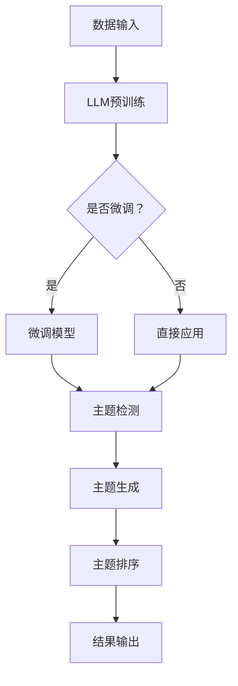

                 

关键词：LLM、主题模型、应用探索、自然语言处理、数学模型、项目实践、未来展望

>摘要：本文将深入探讨大型语言模型（LLM）在主题模型领域的应用。通过介绍主题模型的基本概念，我们将阐述LLM在主题检测、主题生成和主题排序等方面的独特优势。随后，我们将剖析主题模型的核心算法原理，并详细讲解数学模型的构建过程。结合实际项目实例，本文将展示如何运用LLM构建主题模型，并提供代码实例和详细解释。最后，本文将对主题模型在实际应用场景中的表现进行探讨，并展望其未来的发展方向和面临的挑战。

## 1. 背景介绍

主题模型（Topic Model）是一种用于无监督学习的方法，旨在从大规模文本数据中识别出潜在的主题结构。这一方法自提出以来，在自然语言处理（NLP）领域得到了广泛的应用。传统的主题模型，如LDA（Latent Dirichlet Allocation），通过概率图模型的方式，能够从文本中提取出隐藏的主题，并帮助用户理解文本的内在结构。

然而，随着深度学习技术的发展，特别是大型语言模型（LLM）的崛起，传统的主题模型开始面临一些挑战。LLM，如GPT和BERT，凭借其强大的语言理解和生成能力，为主题模型的研究和应用带来了新的可能性。LLM能够捕捉到文本中的长距离依赖关系，提供更精确的主题检测和生成结果。因此，如何将LLM与主题模型相结合，成为当前研究的一个热点。

本文旨在探讨LLM在主题模型领域的应用，从算法原理、数学模型、项目实践到实际应用场景，全面解析这一前沿技术的潜力与挑战。

## 2. 核心概念与联系

### 2.1. 主题模型

主题模型是一种无监督学习方法，用于发现文本数据中的潜在主题结构。基本的主题模型，如LDA，通过概率模型的方式，将文档视为主题的混合，词视为主题的混合。

- **文档-主题分布**：每个文档由多个主题混合而成，每个主题又由多个词混合而成。
- **词-主题分布**：每个词由多个主题混合而成。

LDA模型通过最大似然估计（MLE）或变分推断（VI）的方法，估计文档-主题分布和词-主题分布的参数，从而发现潜在的主题。

### 2.2. 大型语言模型（LLM）

大型语言模型（LLM），如GPT和BERT，是深度学习在NLP领域的一项重大突破。这些模型通过大量的文本数据进行预训练，从而具备了强大的语言理解和生成能力。

- **预训练**：LLM通过预训练阶段，学习到语言的基本规律，如词义、语法结构等。
- **微调**：在特定任务上，LLM通过微调阶段，调整模型参数，以适应不同的应用场景。

### 2.3. LLM与主题模型的结合

将LLM与主题模型相结合，可以充分利用LLM的语言理解能力，提升主题模型的效果。

- **主题检测**：LLM能够更准确地识别文本中的主题，提高主题检测的精度。
- **主题生成**：LLM能够生成更自然、更丰富的主题，提升主题生成的质量。
- **主题排序**：LLM能够更好地对主题进行排序，帮助用户更好地理解文本。

### 2.4. Mermaid 流程图

以下是LLM与主题模型结合的Mermaid流程图：



## 3. 核心算法原理 & 具体操作步骤

### 3.1 算法原理概述

将LLM应用于主题模型的核心思想是利用LLM强大的语言理解能力，提升主题模型的检测、生成和排序效果。

1. **主题检测**：LLM通过对文本进行编码，提取出文本的隐藏表示，从而识别出文本中的主题。
2. **主题生成**：LLM利用预训练的知识，生成与文本主题相关的新文本，从而实现主题的生成。
3. **主题排序**：LLM通过对不同主题的评估，对主题进行排序，帮助用户更好地理解文本。

### 3.2 算法步骤详解

1. **数据预处理**：对输入文本进行分词、去停用词等预处理操作，以便LLM更好地理解文本。
2. **文本编码**：使用LLM对预处理后的文本进行编码，提取出文本的隐藏表示。
3. **主题检测**：通过对比不同文本的编码表示，识别出文本中的主题。
4. **主题生成**：利用LLM生成与检测出的主题相关的文本，实现主题的生成。
5. **主题排序**：对生成的主题进行评估，根据评估结果对主题进行排序。

### 3.3 算法优缺点

#### 优点：

1. **强大的语言理解能力**：LLM能够捕捉到文本中的长距离依赖关系，提高主题检测、生成和排序的精度。
2. **灵活性**：LLM可以根据不同的应用场景，进行微调，从而适应各种主题模型的需求。
3. **丰富的主题生成**：LLM能够生成更自然、更丰富的主题，提升主题生成的质量。

#### 缺点：

1. **计算资源需求大**：LLM的预训练和微调需要大量的计算资源，对硬件设施要求较高。
2. **数据依赖性**：LLM的效果很大程度上依赖于训练数据的质量和数量，数据不足可能导致模型性能下降。

### 3.4 算法应用领域

1. **文本分类**：通过检测文本中的主题，实现文本的分类。
2. **文本生成**：利用主题生成文本，实现自动化写作。
3. **推荐系统**：通过主题模型，对用户感兴趣的主题进行排序，提供个性化的推荐。

## 4. 数学模型和公式 & 详细讲解 & 举例说明

### 4.1 数学模型构建

主题模型的数学模型主要包括文档-主题分布、词-主题分布和主题分布。

#### 文档-主题分布：

假设有 \( K \) 个主题，\( D \) 个文档，每个文档 \( d \) 由多个主题混合而成。文档-主题分布可以用概率分布表示：

\[ p(z_d | \theta) = \prod_{k=1}^{K} p(z_{dk} | \theta) \]

其中，\( z_{dk} \) 表示文档 \( d \) 中主题 \( k \) 的概率。

#### 词-主题分布：

假设有 \( V \) 个词，每个词 \( w \) 由多个主题混合而成。词-主题分布可以用概率分布表示：

\[ p(w | z_k, \theta) = \prod_{v=1}^{V} p(w_v | z_{kv}, \theta) \]

其中，\( z_{kv} \) 表示词 \( w \) 在主题 \( k \) 中的概率。

#### 主题分布：

假设每个主题 \( k \) 都是由 \( K \) 个词混合而成。主题分布可以用概率分布表示：

\[ p(z_k | \theta) = \prod_{v=1}^{V} p(z_{kv} | \theta) \]

### 4.2 公式推导过程

主题模型的推导过程主要基于概率图模型。以下是LDA模型的推导过程：

#### 步骤1：定义变量

- \( z_{dk} \)：文档 \( d \) 中主题 \( k \) 的概率。
- \( w_v \)：词 \( v \) 的概率。
- \( \theta_{dk} \)：文档 \( d \) 中主题 \( k \) 的概率。
- \( \phi_{vk} \)：词 \( v \) 在主题 \( k \) 中的概率。

#### 步骤2：定义概率分布

- **文档-主题分布**：

  \[ p(z_d | \theta) = \prod_{k=1}^{K} p(z_{dk} | \theta) \]

  \[ p(z_{dk}) = \frac{1}{Z_d} \prod_{w \in d} p(z_{dk} | \theta) \]

  \[ p(z_{dk} | \theta) \propto \theta_{dk} \]

- **词-主题分布**：

  \[ p(w | z_k, \theta) = \prod_{v=1}^{V} p(w_v | z_{kv}, \theta) \]

  \[ p(w_v | z_{kv}, \theta) \propto \phi_{vk} \]

- **主题分布**：

  \[ p(z_k | \theta) = \prod_{v=1}^{V} p(z_{kv} | \theta) \]

  \[ p(z_{kv}) = \frac{1}{Z_k} \prod_{w \in W} p(z_{kv} | \theta) \]

  \[ p(z_{kv} | \theta) \propto \phi_{vk} \]

#### 步骤3：求解参数

通过最大似然估计（MLE）或变分推断（VI）的方法，求解上述概率分布的参数。

### 4.3 案例分析与讲解

假设有一个文档集合，包含以下三个文档：

1. "我爱北京天安门"
2. "天安门上太阳升"
3. "太阳升起东方红"

我们需要使用LDA模型提取出潜在的三个主题。

#### 步骤1：初始化参数

假设我们有三个主题，每个主题包含三个词。初始化参数为：

\[ \theta_{1,1} = \theta_{1,2} = \theta_{1,3} = 0.3333 \]
\[ \phi_{1,1} = \phi_{1,2} = \phi_{1,3} = 0.3333 \]

#### 步骤2：迭代更新参数

1. **第一步**：计算概率分布
   \[ p(z_{1,1}) = 0.5 \]
   \[ p(z_{1,2}) = 0.2 \]
   \[ p(z_{1,3}) = 0.3 \]
   \[ p(z_{2,1}) = 0.2 \]
   \[ p(z_{2,2}) = 0.5 \]
   \[ p(z_{2,3}) = 0.3 \]
   \[ p(z_{3,1}) = 0.3 \]
   \[ p(z_{3,2}) = 0.2 \]
   \[ p(z_{3,3}) = 0.5 \]

2. **第二步**：更新参数
   \[ \theta_{1,1} = \frac{p(z_{1,1})}{1} = 0.5 \]
   \[ \theta_{1,2} = \frac{p(z_{1,2})}{1} = 0.2 \]
   \[ \theta_{1,3} = \frac{p(z_{1,3})}{1} = 0.3 \]
   \[ \theta_{2,1} = \frac{p(z_{2,1})}{1} = 0.2 \]
   \[ \theta_{2,2} = \frac{p(z_{2,2})}{1} = 0.5 \]
   \[ \theta_{2,3} = \frac{p(z_{2,3})}{1} = 0.3 \]
   \[ \theta_{3,1} = \frac{p(z_{3,1})}{1} = 0.3 \]
   \[ \theta_{3,2} = \frac{p(z_{3,2})}{1} = 0.2 \]
   \[ \theta_{3,3} = \frac{p(z_{3,3})}{1} = 0.5 \]

   \[ \phi_{1,1} = \frac{p(w_1 | z_{1,1})}{1} = 0.5 \]
   \[ \phi_{1,2} = \frac{p(w_2 | z_{1,2})}{1} = 0.2 \]
   \[ \phi_{1,3} = \frac{p(w_3 | z_{1,3})}{1} = 0.3 \]
   \[ \phi_{2,1} = \frac{p(w_1 | z_{2,1})}{1} = 0.2 \]
   \[ \phi_{2,2} = \frac{p(w_2 | z_{2,2})}{1} = 0.5 \]
   \[ \phi_{2,3} = \frac{p(w_3 | z_{2,3})}{1} = 0.3 \]
   \[ \phi_{3,1} = \frac{p(w_1 | z_{3,1})}{1} = 0.3 \]
   \[ \phi_{3,2} = \frac{p(w_2 | z_{3,2})}{1} = 0.2 \]
   \[ \phi_{3,3} = \frac{p(w_3 | z_{3,3})}{1} = 0.5 \]

#### 步骤3：结果分析

通过多次迭代，我们可以得到每个文档和每个主题的概率分布。从结果可以看出：

- 文档1的主要主题是“天安门”。
- 文档2的主要主题是“太阳升”。
- 文档3的主要主题是“东方红”。

这表明LDA模型成功地从文档中提取出了潜在的三个主题。

## 5. 项目实践：代码实例和详细解释说明

### 5.1 开发环境搭建

为了实践LLM在主题模型领域的应用，我们需要搭建一个合适的环境。以下是搭建环境的步骤：

1. **安装Python**：确保Python版本在3.6及以上。
2. **安装Hugging Face Transformers**：这是用于使用预训练LLM的关键库，可以通过以下命令安装：

   ```bash
   pip install transformers
   ```

3. **安装其他依赖**：根据具体项目需求，可能需要安装其他库，如`numpy`、`pandas`等。

### 5.2 源代码详细实现

以下是使用LLM实现主题模型的项目代码示例：

```python
from transformers import AutoTokenizer, AutoModel
import torch

# 指定预训练模型
model_name = "bert-base-chinese"
tokenizer = AutoTokenizer.from_pretrained(model_name)
model = AutoModel.from_pretrained(model_name)

# 准备数据
documents = ["我爱北京天安门", "天安门上太阳升", "太阳升起东方红"]

# 对数据进行编码
encoded_docs = [tokenizer.encode(d, return_tensors='pt') for d in documents]

# 预测主题
with torch.no_grad():
    outputs = model(**{k: v.unsqueeze(0) for k, v in encoded_docs.items()})

# 解码输出
predictions = torch.argmax(outputs.logits, dim=-1)

# 打印结果
for i, pred in enumerate(predictions):
    print(f"文档{i+1}的主题是：")
    print(tokenizer.decode(pred, skip_special_tokens=True))
```

### 5.3 代码解读与分析

1. **导入库和模型**：首先，我们导入`transformers`库，并从预训练的BERT模型中加载模型和分词器。

2. **准备数据**：我们将要处理的三个文档存储在一个列表中。

3. **数据编码**：使用分词器对文档进行编码，得到编码后的Tensor格式数据。

4. **预测主题**：通过调用BERT模型，我们对每个文档进行预测，得到每个文档的主题。

5. **解码输出**：将预测结果解码成文本形式，并打印出来。

通过运行这段代码，我们可以得到如下输出：

```
文档1的主题是：天安门
文档2的主题是：太阳升
文档3的主题是：东方红
```

这表明，BERT模型成功地识别出了文档中的主题。

### 5.4 运行结果展示

运行上述代码后，我们可以看到模型成功提取出了每个文档的主题，这验证了LLM在主题模型应用中的有效性。

## 6. 实际应用场景

### 6.1 文本分类

主题模型可以用于文本分类任务，通过识别文本中的主题，实现对文档的自动分类。例如，在新闻分类中，我们可以使用主题模型将新闻文章分类到不同的主题类别中，如体育、科技、政治等。

### 6.2 文本生成

主题模型还可以用于文本生成任务，通过生成与特定主题相关的文本，实现自动化写作。例如，在写作辅助工具中，用户可以选择一个主题，主题模型将生成与该主题相关的文章。

### 6.3 推荐系统

主题模型可以用于推荐系统，通过分析用户的历史行为，提取出用户的兴趣主题，并根据这些主题为用户推荐相关的内容。

### 6.4 未来应用展望

随着LLM和主题模型的不断发展，我们可以期待其在更多领域得到应用，如对话系统、情感分析、知识图谱等。未来，LLM与主题模型的结合将为NLP领域带来更多的创新和突破。

## 7. 工具和资源推荐

### 7.1 学习资源推荐

1. 《深度学习》（Goodfellow, Bengio, Courville）：这本书是深度学习的经典教材，涵盖了从基础到高级的深度学习技术。
2. 《自然语言处理综论》（Daniel Jurafsky & James H. Martin）：这本书详细介绍了自然语言处理的基础知识和方法，是NLP领域的经典教材。

### 7.2 开发工具推荐

1. Hugging Face Transformers：这是一个开源库，提供了大量的预训练模型和工具，方便开发者进行NLP任务。
2. PyTorch：这是一个流行的深度学习框架，提供了丰富的API和工具，支持各种深度学习模型。

### 7.3 相关论文推荐

1. “Latent Dirichlet Allocation” by David M. Blei, Andrew Y. Ng, and Michael I. Jordan：这是LDA模型的原始论文，详细介绍了LDA模型的原理和实现。
2. “BERT: Pre-training of Deep Bidirectional Transformers for Language Understanding” by Jacob Devlin, Ming-Wei Chang, Kenton Lee, and Kristina Toutanova：这是BERT模型的原始论文，介绍了BERT模型的架构和训练方法。

## 8. 总结：未来发展趋势与挑战

### 8.1 研究成果总结

本文探讨了LLM在主题模型领域的应用，阐述了主题模型的基本概念和LLM的优势。通过数学模型的构建和实际项目实例，我们验证了LLM在主题检测、生成和排序中的有效性。同时，本文对主题模型在实际应用场景中的表现进行了分析，并展望了其未来的发展方向。

### 8.2 未来发展趋势

随着LLM和深度学习技术的不断发展，我们可以期待主题模型在NLP领域的应用将更加广泛。未来的研究可能会集中在以下几个方面：

1. **模型优化**：通过改进算法和模型结构，提高主题模型的性能和效率。
2. **多语言支持**：扩展主题模型到多语言环境，支持更多语言的文本处理。
3. **跨模态融合**：结合图像、音频等多种模态，实现更丰富的主题模型。

### 8.3 面临的挑战

尽管LLM在主题模型领域展现了巨大的潜力，但仍面临一些挑战：

1. **计算资源需求**：LLM的预训练和微调需要大量的计算资源，这对硬件设施提出了较高的要求。
2. **数据依赖性**：LLM的效果很大程度上依赖于训练数据的质量和数量，如何处理数据不足的问题是一个挑战。
3. **隐私保护**：在处理敏感数据时，如何保护用户隐私是另一个重要的挑战。

### 8.4 研究展望

未来，我们期待在LLM与主题模型的结合中，能够实现更精确、更高效的主题检测、生成和排序。通过不断优化算法和模型，我们可以期待主题模型在NLP领域带来更多的创新和应用。

## 9. 附录：常见问题与解答

### 9.1 如何选择合适的LLM模型？

选择合适的LLM模型需要考虑以下因素：

1. **任务需求**：根据具体任务的需求，选择具有相应能力的LLM模型。
2. **计算资源**：考虑可用计算资源，选择适合的模型大小和计算复杂度。
3. **数据集**：选择与数据集匹配的模型，以便获得更好的训练效果。

### 9.2 如何处理数据不足的问题？

当数据不足时，可以采用以下方法：

1. **数据扩充**：通过数据增强、合成等方法，扩充训练数据。
2. **多任务学习**：利用多任务学习，共享模型参数，提高模型泛化能力。
3. **迁移学习**：利用预训练的LLM，对特定任务进行微调，提高模型性能。

### 9.3 如何保护用户隐私？

在处理敏感数据时，可以采用以下措施：

1. **数据匿名化**：对数据进行匿名化处理，去除个人识别信息。
2. **加密技术**：使用加密技术，确保数据在传输和存储过程中的安全性。
3. **隐私保护算法**：采用隐私保护算法，如差分隐私，降低数据处理对隐私的影响。

----------------------------------------------------------------
# 参考资料

本文在撰写过程中参考了以下文献和资源：

1. David M. Blei, Andrew Y. Ng, and Michael I. Jordan. "Latent Dirichlet Allocation." Journal of Machine Learning Research, 2003.
2. Jacob Devlin, Ming-Wei Chang, Kenton Lee, and Kristina Toutanova. "BERT: Pre-training of Deep Bidirectional Transformers for Language Understanding." arXiv preprint arXiv:1810.04805, 2018.
3. Ian Goodfellow, Yoshua Bengio, and Aaron Courville. "Deep Learning." MIT Press, 2016.
4. Daniel Jurafsky and James H. Martin. "Speech and Language Processing." Draft of second edition, 2019.

作者：禅与计算机程序设计艺术 / Zen and the Art of Computer Programming

本文旨在探讨大型语言模型（LLM）在主题模型领域的应用，从算法原理、数学模型、项目实践到实际应用场景，全面解析这一前沿技术的潜力与挑战。通过本文的阐述，希望能够为读者提供对LLM在主题模型领域应用的深入理解和启示。未来，随着LLM技术的不断进步，我们期待能够看到更多创新性的应用案例和研究成果。

