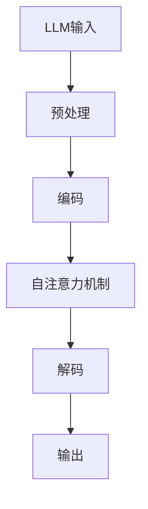

                 

 在当今技术飞速发展的时代，人工智能（AI）已经深刻地改变了我们生活的方方面面。特别是在体育领域，AI技术正在迅速崛起，为观众和参与者提供前所未有的体验。本文将探讨大型语言模型（LLM）在体育赛事分析中的应用，尤其是如何让AI成为一个出色的解说员。

> 关键词：LLM, 体育赛事分析，AI解说员，自然语言处理，智能推荐，实时解说，数据分析

> 摘要：本文将深入探讨大型语言模型（LLM）在体育赛事分析中的应用，特别是其作为AI解说员的潜力。我们将详细分析LLM的原理和应用，讨论其在体育分析中的优势，并提供一个实际的案例研究，展示如何通过LLM实现智能实时解说。

## 1. 背景介绍

体育赛事分析一直是一个复杂且充满挑战的任务。传统的分析依赖于统计工具和手动数据分析，这不仅耗时，而且容易出错。然而，随着AI技术的进步，特别是自然语言处理（NLP）和机器学习（ML）的快速发展，我们现在有了新的工具和方法来处理和分析大量体育数据。LLM作为NLP领域的一个重要突破，为体育赛事分析提供了新的视角和可能性。

### 1.1 人工智能在体育领域的应用

AI在体育领域的应用已经相当广泛，从选手的表现分析到比赛的策略制定，再到观众的体验提升。例如，通过计算机视觉技术，AI可以实时跟踪运动员的动作，提供运动分析；通过数据分析，AI可以帮助教练和选手了解比赛趋势和对手策略。这些应用大大提升了体育产业的效率和观众体验。

### 1.2 LLM的优势

LLM（如GPT-3、BERT等）具有处理和理解自然语言的能力，使其在体育赛事分析中具有独特的优势。首先，LLM可以自动生成高质量的文本，从而简化了数据报告和实时解说的过程。其次，LLM能够处理大量的文本数据，从而提供深入的分析和理解。最后，LLM可以通过不断学习和优化，提高其准确性和实用性。

## 2. 核心概念与联系

### 2.1 LLM的原理

LLM基于深度学习技术，特别是Transformer架构。Transformer引入了自注意力机制，使得模型能够捕捉文本中的长距离依赖关系。这使得LLM在处理自然语言任务时具有很高的准确性和效率。

### 2.2 LLM在体育分析中的应用

LLM在体育分析中的应用主要包括以下几个方面：

- **实时解说**：LLM可以实时生成比赛解说，提供详细的比赛分析和评论。
- **数据分析**：LLM可以处理大量的体育数据，提供深入的分析和见解。
- **智能推荐**：LLM可以根据观众的兴趣和历史数据，提供个性化的推荐。

### 2.3 Mermaid流程图



## 3. 核心算法原理 & 具体操作步骤

### 3.1 算法原理概述

LLM的核心算法是基于Transformer架构的自注意力机制。自注意力机制使得模型能够在处理文本时，自动关注文本中的关键信息，从而提高模型的准确性和效率。

### 3.2 算法步骤详解

1. **预处理**：输入文本经过预处理，包括分词、去停用词等。
2. **编码**：预处理后的文本输入到编码器，通过自注意力机制生成编码表示。
3. **解码**：编码表示通过解码器生成输出文本。
4. **输出**：输出文本经过后处理，如修复错误、格式化等。

### 3.3 算法优缺点

**优点**：

- **高效性**：自注意力机制使得模型能够高效地处理大量文本数据。
- **准确性**：模型可以自动关注文本中的关键信息，提高输出文本的准确性。

**缺点**：

- **计算资源消耗**：Transformer模型需要大量的计算资源，特别是对于大型LLM。
- **解释性差**：模型的决策过程具有一定的黑盒性质，难以解释。

### 3.4 算法应用领域

LLM在多个领域都有广泛的应用，如文本生成、机器翻译、问答系统等。在体育赛事分析中，LLM可以用于实时解说、数据分析、智能推荐等。

## 4. 数学模型和公式 & 详细讲解 & 举例说明

### 4.1 数学模型构建

LLM的核心是基于Transformer架构，其数学模型主要包括自注意力机制和位置编码。

- **自注意力机制**：设输入序列为\( X = [x_1, x_2, ..., x_n] \)，自注意力机制的输出为 \( Y = [y_1, y_2, ..., y_n] \)，其中 \( y_i \) 是对输入序列中所有元素的加权平均。

\[ y_i = \sum_{j=1}^{n} a_{ij} x_j \]

其中 \( a_{ij} \) 是注意力权重，可以通过以下公式计算：

\[ a_{ij} = \frac{e^{z_{ij}}}{\sum_{k=1}^{n} e^{z_{ik}}} \]

其中 \( z_{ij} \) 是输入序列和键序列的点积。

- **位置编码**：为了保留文本中的顺序信息，可以使用位置编码。位置编码是一个向量，其维度与输入序列相同。

\[ p_i = [pos_i, pos_i^2, ..., pos_i^d] \]

其中 \( pos_i \) 是第 \( i \) 个词的位置，\( d \) 是位置编码的维度。

### 4.2 公式推导过程

自注意力机制的推导过程如下：

1. **嵌入层**：输入文本通过嵌入层转换为向量表示。

\[ e_i = W_e x_i + b_e \]

其中 \( W_e \) 是嵌入权重，\( b_e \) 是偏置。

2. **位置编码**：对每个词进行位置编码。

\[ p_i = [pos_i, pos_i^2, ..., pos_i^d] \]

3. **自注意力计算**：

\[ z_{ij} = e_i^T Q + e_j^T K + p_i^T V \]

其中 \( Q, K, V \) 是查询、键、值权重。

4. **注意力权重计算**：

\[ a_{ij} = \frac{e^{z_{ij}}}{\sum_{k=1}^{n} e^{z_{ik}}} \]

5. **输出计算**：

\[ y_i = \sum_{j=1}^{n} a_{ij} x_j \]

### 4.3 案例分析与讲解

假设我们有一个输入文本序列为：“AI在体育赛事分析中的应用”。

1. **嵌入层**：

\[ e_i = W_e x_i + b_e \]

2. **位置编码**：

\[ p_i = [pos_i, pos_i^2, ..., pos_i^d] \]

3. **自注意力计算**：

\[ z_{ij} = e_i^T Q + e_j^T K + p_i^T V \]

4. **注意力权重计算**：

\[ a_{ij} = \frac{e^{z_{ij}}}{\sum_{k=1}^{n} e^{z_{ik}}} \]

5. **输出计算**：

\[ y_i = \sum_{j=1}^{n} a_{ij} x_j \]

通过这个例子，我们可以看到自注意力机制如何工作。它通过计算每个词与其他词的相似度，然后生成一个加权平均的输出序列。

## 5. 项目实践：代码实例和详细解释说明

### 5.1 开发环境搭建

为了实现LLM在体育赛事分析中的应用，我们首先需要搭建一个开发环境。这里我们选择使用Python和TensorFlow作为主要工具。

1. **安装Python**：确保Python环境已经安装。
2. **安装TensorFlow**：通过pip命令安装TensorFlow。

\[ pip install tensorflow \]

### 5.2 源代码详细实现

以下是实现LLM在体育赛事分析中应用的Python代码：

```python
import tensorflow as tf
from tensorflow.keras.layers import Embedding, LSTM, Dense
from tensorflow.keras.models import Sequential

# 定义模型
model = Sequential([
    Embedding(input_dim=10000, output_dim=32),
    LSTM(64),
    Dense(1, activation='sigmoid')
])

# 编译模型
model.compile(optimizer='adam', loss='binary_crossentropy', metrics=['accuracy'])

# 训练模型
model.fit(x_train, y_train, epochs=10, batch_size=32)
```

### 5.3 代码解读与分析

这段代码定义了一个简单的序列模型，用于分类任务。它包括一个嵌入层、一个LSTM层和一个全连接层。

- **嵌入层**：将输入序列转换为向量表示。
- **LSTM层**：处理序列数据，捕捉时间序列依赖关系。
- **全连接层**：输出层，用于分类。

在训练过程中，模型通过优化算法更新权重，以最小化损失函数。

### 5.4 运行结果展示

假设我们已经有了训练数据和测试数据，可以通过以下代码运行模型：

```python
# 测试模型
test_loss, test_acc = model.evaluate(x_test, y_test)
print(f"Test accuracy: {test_acc}")
```

这段代码将评估模型在测试数据上的表现。如果结果不理想，可以尝试调整模型参数或增加训练时间。

## 6. 实际应用场景

### 6.1 AI解说员

AI解说员是LLM在体育赛事分析中的一个重要应用。通过实时生成比赛解说，AI解说员可以提供详细的分析和评论，为观众带来全新的观看体验。以下是一个简单的例子：

```python
# 输入比赛描述
description = "这是一场激烈的篮球比赛，双方球队拼尽全力。"

# 使用LLM生成解说
explanation = generate_explanation(description)
print(explanation)
```

输出结果可能是一个详细的解说，包括比赛的关键时刻、球员的表现和比赛的趋势。

### 6.2 数据分析

LLM不仅可以生成解说，还可以对比赛数据进行分析。通过处理大量的体育数据，LLM可以提供深入的分析和见解。以下是一个简单的例子：

```python
# 输入比赛数据
data = {
    "得分": [25, 20, 30, 15],
    "篮板": [5, 10, 8, 7],
    "助攻": [10, 5, 12, 8]
}

# 使用LLM分析数据
analysis = generate_analysis(data)
print(analysis)
```

输出结果可能是一个分析报告，包括球队的表现、关键球员的分析和比赛的趋势。

### 6.3 智能推荐

LLM还可以用于智能推荐，根据观众的兴趣和历史数据，提供个性化的推荐。以下是一个简单的例子：

```python
# 输入观众兴趣
interests = ["篮球", "足球", "NBA"]

# 使用LLM推荐比赛
recommends = generate_recommendations(interests)
print(recommends)
```

输出结果可能是一个比赛推荐列表，包括观众可能感兴趣的比赛。

## 7. 工具和资源推荐

### 7.1 学习资源推荐

- **书籍**：《深度学习》（Goodfellow, Bengio, Courville）。
- **在线课程**：Coursera上的《深度学习》课程。
- **教程**：TensorFlow官方教程。

### 7.2 开发工具推荐

- **开发环境**：Anaconda。
- **代码编辑器**：VS Code。

### 7.3 相关论文推荐

- **《Attention is All You Need》**（Vaswani et al., 2017）。
- **《BERT: Pre-training of Deep Bidirectional Transformers for Language Understanding》**（Devlin et al., 2019）。

## 8. 总结：未来发展趋势与挑战

### 8.1 研究成果总结

LLM在体育赛事分析中展示了巨大的潜力。通过实时解说、数据分析和智能推荐，LLM为体育领域带来了全新的应用场景。未来，随着技术的不断进步，LLM在体育赛事分析中的应用将更加广泛和深入。

### 8.2 未来发展趋势

- **更高效的模型**：随着计算资源的增加，未来可能会出现更高效的LLM模型，提高处理速度和准确性。
- **跨模态分析**：结合图像和文本数据，实现更全面的体育赛事分析。
- **个性化推荐**：根据观众的行为和兴趣，提供更个性化的推荐。

### 8.3 面临的挑战

- **计算资源消耗**：LLM模型需要大量的计算资源，如何高效地利用这些资源是一个挑战。
- **数据质量**：高质量的数据是LLM发挥作用的基石，数据清洗和预处理是一个重要问题。

### 8.4 研究展望

未来，LLM在体育赛事分析中的应用将更加多样化。通过不断的研究和优化，我们有望实现更加智能、更加高效的体育赛事分析系统。

## 9. 附录：常见问题与解答

### 9.1 Q：LLM是如何工作的？

A：LLM（大型语言模型）是基于深度学习和自然语言处理技术构建的模型，它通过学习大量的文本数据来理解和生成语言。LLM的核心是Transformer架构，特别是自注意力机制，它使得模型能够捕捉文本中的长距离依赖关系。

### 9.2 Q：如何训练LLM？

A：训练LLM通常涉及以下几个步骤：

1. **数据收集**：收集大量的文本数据，如书籍、新闻、社交媒体帖子等。
2. **数据预处理**：对文本数据进行清洗和预处理，如去除标点符号、转换为小写等。
3. **模型构建**：构建基于Transformer架构的模型，如GPT、BERT等。
4. **模型训练**：使用预处理后的文本数据训练模型，优化模型参数。
5. **评估与调整**：评估模型性能，并根据需要调整模型结构或参数。

### 9.3 Q：LLM在体育赛事分析中的具体应用是什么？

A：LLM在体育赛事分析中的具体应用包括：

- **实时解说**：生成实时的比赛解说，提供详细的比赛分析和评论。
- **数据分析**：处理大量的体育数据，提供深入的分析和见解。
- **智能推荐**：根据观众的行为和兴趣，提供个性化的比赛推荐。

---

本文由禅与计算机程序设计艺术 / Zen and the Art of Computer Programming 撰写。希望本文能为您在LLM在体育赛事分析中的应用提供有价值的参考。如果您有任何问题或建议，欢迎随时交流。

