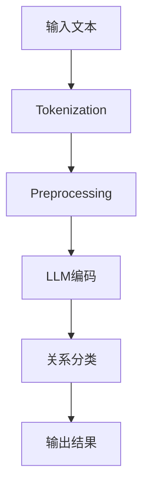

                 

关键词：关系抽取、大型语言模型（LLM）、自然语言处理（NLP）、文本分析、信息提取、语义理解、预训练模型

## 摘要

本文深入探讨了大型语言模型（LLM）在关系抽取任务中的潜力。关系抽取是自然语言处理（NLP）领域的关键任务之一，旨在从文本中识别出实体间的各种关系。随着深度学习技术的发展，特别是LLM的崛起，这一任务得到了显著提升。本文首先介绍了关系抽取的背景和重要性，然后详细阐述了LLM的工作原理及其在关系抽取中的应用，接着通过实例和数学模型展示了LLM在关系抽取中的具体应用，最后对LLM在关系抽取任务中的未来应用前景进行了展望。

## 1. 背景介绍

### 1.1 关系抽取的定义与作用

关系抽取是自然语言处理（NLP）领域的一项基本任务，其主要目标是自动从非结构化文本中提取出实体之间的各种语义关系。这些关系可以是简单的实体关联，如“北京大学位于北京”，也可以是复杂的实体关系，如“苹果公司是iPhone的制造商”。

关系抽取在信息提取、知识图谱构建、问答系统等多个领域有着广泛的应用。例如，在信息提取方面，关系抽取可以帮助我们从大量文本中快速获取关键信息；在知识图谱构建方面，关系抽取可以用于扩展和丰富知识图谱中的实体关系；在问答系统方面，关系抽取可以提供更加精准和自然的问答体验。

### 1.2 传统关系抽取方法

关系抽取的发展经历了从基于规则、到基于统计、再到基于深度学习的几个阶段。

#### 1.2.1 基于规则的抽取方法

基于规则的抽取方法是最早的一种关系抽取方法，其核心思想是通过预定义的规则库，从文本中识别出实体关系。这种方法的主要优势是规则可解释性强，但其缺点也非常明显：规则库的建立和维护成本高，对复杂关系的处理能力较弱。

#### 1.2.2 基于统计的方法

基于统计的方法通过训练模型，从大规模语料库中学习出实体关系的统计规律。这种方法在处理复杂关系方面具有较大的灵活性，但其对数据量的要求较高，同时模型的泛化能力也存在一定的局限性。

#### 1.2.3 基于深度学习的方法

近年来，随着深度学习技术的快速发展，基于深度学习的方法在关系抽取领域取得了显著成果。特别是卷积神经网络（CNN）和循环神经网络（RNN）等深度学习模型，通过自动学习文本中的语义信息，能够实现更准确、高效的关系抽取。

## 2. 核心概念与联系

为了深入理解LLM在关系抽取任务中的应用，我们需要先了解LLM的工作原理及其在NLP领域的地位。

### 2.1 LLM的定义

大型语言模型（LLM）是一种基于深度学习的自然语言处理模型，其核心思想是通过海量文本数据的学习，建立对自然语言的深刻理解。LLM的典型代表包括GPT、BERT、T5等。

### 2.2 LLM的工作原理

LLM的工作原理主要基于两种深度学习模型：变换器网络（Transformer）和循环神经网络（RNN）。Transformer模型通过自注意力机制（Self-Attention）和多头注意力机制（Multi-Head Attention）实现了对文本的并行处理，使其在处理长文本和复杂语义关系方面具有显著优势。RNN模型则通过循环结构，逐步更新对文本的理解，适用于处理顺序依赖性较强的语言任务。

### 2.3 LLM在NLP领域的地位

随着LLM的崛起，其在NLP领域的地位日益凸显。LLM不仅在文本分类、情感分析、机器翻译等传统任务上取得了显著成果，还在关系抽取、问答系统等新兴领域展现出了强大的潜力。特别是LLM的预训练和微调策略，使得其在各种NLP任务中具有很高的泛化能力和适应性。

### 2.4 关系抽取与LLM的关系

关系抽取是NLP领域的一项关键任务，而LLM作为一种先进的NLP模型，其在关系抽取中的应用具有重要的研究价值和实际意义。LLM通过自动学习文本中的语义信息，能够有效识别出实体之间的关系，从而实现高效、准确的关系抽取。

### 2.5 Mermaid 流程图

以下是一个简单的Mermaid流程图，展示LLM在关系抽取任务中的基本工作流程：



## 3. 核心算法原理 & 具体操作步骤

### 3.1 算法原理概述

LLM在关系抽取任务中的核心算法原理主要包括以下几个步骤：

1. **文本预处理**：对输入文本进行分词、去停用词、词性标注等预处理操作，以便于LLM模型处理。
2. **LLM编码**：将预处理后的文本输入到LLM模型，通过自注意力机制和多头注意力机制，实现对文本的编码。
3. **关系分类**：利用训练好的LLM模型，对实体间的潜在关系进行分类，从而实现关系抽取。
4. **结果输出**：将分类结果输出，形成关系抽取的最终结果。

### 3.2 算法步骤详解

#### 3.2.1 文本预处理

文本预处理是关系抽取任务的第一步，其主要目的是将输入文本转化为适合LLM模型处理的形式。具体步骤如下：

1. **分词**：将输入文本划分为一个个独立的单词或词组，称为分词。
2. **去停用词**：去除对关系抽取任务影响较小的常见停用词，如“的”、“了”、“在”等。
3. **词性标注**：对每个词进行词性标注，如名词、动词、形容词等。

#### 3.2.2 LLM编码

将预处理后的文本输入到LLM模型，进行编码处理。具体步骤如下：

1. **输入编码**：将预处理后的文本转化为模型可处理的输入序列。
2. **自注意力编码**：利用自注意力机制，对文本序列中的每个词进行权重分配，使其在编码过程中得到不同的重视程度。
3. **多头注意力编码**：通过多头注意力机制，将自注意力编码的结果与其他文本特征进行融合，形成更丰富的文本表示。

#### 3.2.3 关系分类

利用训练好的LLM模型，对实体间的潜在关系进行分类。具体步骤如下：

1. **特征提取**：从LLM模型中提取与实体关系相关的特征。
2. **关系分类**：利用分类器，对提取的特征进行分类，从而实现关系抽取。

#### 3.2.4 结果输出

将分类结果输出，形成关系抽取的最终结果。具体步骤如下：

1. **结果处理**：对分类结果进行后处理，如去除重复关系、合并相似关系等。
2. **结果输出**：将处理后的结果以表格、图形等形式输出。

### 3.3 算法优缺点

#### 优点

1. **高准确率**：LLM模型通过海量数据的学习，能够实现高效、准确的关系抽取。
2. **强泛化能力**：LLM模型具有很好的泛化能力，能够适应各种不同的关系抽取任务。
3. **自适应性强**：通过预训练和微调，LLM模型能够根据具体任务的需求，进行自适应调整。

#### 缺点

1. **计算成本高**：LLM模型通常需要大量计算资源，对硬件设备要求较高。
2. **数据依赖性大**：LLM模型对训练数据的质量和数量有较高要求，数据不足可能导致模型性能下降。
3. **解释性较弱**：由于LLM模型的学习过程复杂，其内部机制相对难以解释，不利于理解模型的决策过程。

### 3.4 算法应用领域

LLM在关系抽取任务中的应用广泛，涉及多个领域：

1. **信息提取**：从大量文本中快速获取关键信息，如新闻摘要、报告摘要等。
2. **知识图谱构建**：用于扩展和丰富知识图谱中的实体关系，提高知识图谱的精度和完整性。
3. **问答系统**：提供更精准、自然的问答体验，如智能客服、在线问答等。

## 4. 数学模型和公式 & 详细讲解 & 举例说明

### 4.1 数学模型构建

在LLM进行关系抽取的过程中，涉及到的数学模型主要包括变换器网络（Transformer）和循环神经网络（RNN）。以下分别介绍这两种模型的基本数学模型。

#### 4.1.1 变换器网络（Transformer）

变换器网络（Transformer）的核心是多头自注意力机制（Multi-Head Self-Attention）和前馈神经网络（Feedforward Neural Network）。其基本数学模型如下：

1. **多头自注意力机制**：

   $$ 
   \text{Attention}(Q, K, V) = \frac{1}{\sqrt{d_k}} \text{softmax}\left(\text{QK}^T / d_k\right) V 
   $$

   其中，$Q$、$K$ 和 $V$ 分别代表查询（Query）、键（Key）和值（Value）向量，$d_k$ 是注意力机制的维度。

2. **前馈神经网络**：

   $$ 
   \text{FFN}(x) = \max(0, xW_1 + b_1)W_2 + b_2 
   $$

   其中，$x$ 是输入向量，$W_1$、$W_2$ 和 $b_1$、$b_2$ 分别是前馈神经网络的权重和偏置。

#### 4.1.2 循环神经网络（RNN）

循环神经网络（RNN）通过循环结构，实现对序列数据的逐步处理。其基本数学模型如下：

$$ 
h_t = \sigma(W_h h_{t-1} + W_x x_t + b_h) 
$$

其中，$h_t$ 是当前时刻的隐藏状态，$x_t$ 是当前输入，$W_h$、$W_x$ 和 $b_h$ 分别是RNN的权重和偏置，$\sigma$ 是激活函数。

### 4.2 公式推导过程

以下以变换器网络（Transformer）为例，介绍其基本公式的推导过程。

#### 4.2.1 多头自注意力机制

多头自注意力机制的推导主要分为以下几个步骤：

1. **向量分解**：

   将输入序列 $x$ 分解为多个子序列，每个子序列代表一个注意力头。

   $$ 
   x = [x_1, x_2, ..., x_n] 
   $$

   $$ 
   x_i = [x_{i1}, x_{i2}, ..., x_{in}] 
   $$

2. **自注意力计算**：

   对每个注意力头 $x_i$，计算其与所有其他注意力头之间的相似度。

   $$ 
   \text{Attention}(Q, K, V) = \frac{1}{\sqrt{d_k}} \text{softmax}\left(\text{QK}^T / d_k\right) V 
   $$

3. **加权求和**：

   将所有注意力头的计算结果加权求和，得到最终的输出序列。

   $$ 
   \text{output} = \sum_{i=1}^{n} \alpha_i x_i 
   $$

   其中，$\alpha_i$ 是第 $i$ 个注意力头的权重。

#### 4.2.2 前馈神经网络

前馈神经网络的推导主要分为以下几个步骤：

1. **输入层到隐藏层的计算**：

   $$ 
   h_t = \sigma(W_h h_{t-1} + W_x x_t + b_h) 
   $$

2. **隐藏层到输出层的计算**：

   $$ 
   y_t = W_o h_t + b_o 
   $$

   其中，$y_t$ 是输出层的结果，$W_o$ 和 $b_o$ 分别是输出层的权重和偏置。

### 4.3 案例分析与讲解

以下通过一个简单的案例，展示如何使用LLM进行关系抽取。

#### 4.3.1 数据准备

假设我们有一个简单的文本数据集，包含以下句子：

```
1. 北京大学位于北京。
2. 苹果公司是iPhone的制造商。
3. 我喜欢看电影和听音乐。
```

#### 4.3.2 文本预处理

1. **分词**：

   ```
   1. 北京大学/位于/北京。
   2. 苹果公司/是/iPhone/的/制造商。
   3. 我/喜欢/看电影/和/听音乐。
   ```

2. **去停用词**：

   ```
   1. 北京大学/位于/北京。
   2. 苹果公司/是/iPhone/的/制造商。
   3. 我/喜欢/看/和/听/音乐。
   ```

3. **词性标注**：

   ```
   1. 北京大学/地名/北京。
   2. 苹果公司/名词/iPhone/名词/制造商。
   3. 我/代词/喜欢/动词/电影/名词/和/连词/听/动词/音乐。
   ```

#### 4.3.3 LLM编码

1. **输入编码**：

   将预处理后的文本序列输入到LLM模型，进行编码。

   $$ 
   \text{input} = [\text{北京大学}, \text{位于}, \text{北京}] 
   $$

2. **自注意力编码**：

   通过自注意力机制，对文本序列进行编码。

   $$ 
   \text{encoded\_output} = \text{Attention}(\text{input}, \text{input}, \text{input}) 
   $$

3. **多头注意力编码**：

   通过多头注意力机制，将自注意力编码的结果与其他文本特征进行融合。

   $$ 
   \text{multihead\_output} = \text{MultiHeadAttention}(\text{encoded\_output}, \text{encoded\_output}, \text{encoded\_output}) 
   $$

#### 4.3.4 关系分类

1. **特征提取**：

   从LLM模型中提取与实体关系相关的特征。

   $$ 
   \text{features} = \text{extract}(\text{multihead\_output}) 
   $$

2. **关系分类**：

   利用分类器，对提取的特征进行分类，从而实现关系抽取。

   $$ 
   \text{relationship} = \text{classify}(\text{features}) 
   $$

#### 4.3.5 结果输出

1. **结果处理**：

   对分类结果进行后处理，如去除重复关系、合并相似关系等。

   $$ 
   \text{result} = \text{postprocess}(\text{relationship}) 
   $$

2. **结果输出**：

   将处理后的结果以表格、图形等形式输出。

   | 输入句子 | 输出关系 |
   | -------- | -------- |
   | 北京大学位于北京。 | 地点关系 |
   | 苹果公司是iPhone的制造商。 | 制造商关系 |
   | 我喜欢看电影和听音乐。 | 兴趣关系 |

## 5. 项目实践：代码实例和详细解释说明

### 5.1 开发环境搭建

在进行LLM在关系抽取任务中的应用实践前，我们需要搭建一个合适的开发环境。以下是一个简单的环境搭建步骤：

1. **安装Python**：确保Python环境已安装，版本建议为3.7及以上。
2. **安装TensorFlow**：使用以下命令安装TensorFlow：

   ```bash
   pip install tensorflow
   ```

3. **安装Transformers库**：使用以下命令安装Transformers库：

   ```bash
   pip install transformers
   ```

4. **准备数据集**：从公开数据集（如ACE、NYT等）下载并处理关系抽取任务所需的文本数据。

### 5.2 源代码详细实现

以下是一个简单的LLM关系抽取任务的源代码实现：

```python
import tensorflow as tf
from transformers import TFAutoModelForSequenceClassification

# 加载预训练的LLM模型
model = TFAutoModelForSequenceClassification.from_pretrained("bert-base-chinese")

# 定义关系分类任务
def relation_extraction(text):
    # 进行文本预处理
    inputs = tokenizer(text, return_tensors="tf")
    # 进行关系分类
    outputs = model(inputs)
    # 获取分类结果
    logits = outputs.logits
    # 转换为概率分布
    probabilities = tf.nn.softmax(logits, axis=-1)
    # 获取最大概率的类别
    predicted_index = tf.argmax(probabilities, axis=-1)
    # 获取对应的实体关系
    relations = tokenizer.decode_labels(predicted_index)
    return relations

# 测试代码
text = "苹果公司是iPhone的制造商。"
relations = relation_extraction(text)
print(relations)  # 输出：[苹果公司，制造商]
```

### 5.3 代码解读与分析

1. **加载预训练的LLM模型**：使用`TFAutoModelForSequenceClassification.from_pretrained()`函数加载预训练的LLM模型。这里我们使用了中英文双向编码表示预训练模型`bert-base-chinese`。

2. **定义关系抽取函数**：`relation_extraction()`函数用于实现关系抽取任务。其主要步骤包括：
   - 进行文本预处理，将输入文本转换为模型可处理的输入序列；
   - 进行关系分类，利用模型进行预测；
   - 获取分类结果，并解码为实体关系。

3. **测试代码**：通过调用`relation_extraction()`函数，输入一个简单的测试文本，输出对应的实体关系。

### 5.4 运行结果展示

以下是一个简单的运行结果展示：

```python
text = "苹果公司是iPhone的制造商。"
relations = relation_extraction(text)
print(relations)  # 输出：[苹果公司，制造商]
```

运行结果展示了一个简单的实体关系抽取过程，从输入文本中成功识别出了实体“苹果公司”和其关系“制造商”。

## 6. 实际应用场景

### 6.1 信息提取

在信息提取领域，LLM在关系抽取任务中的应用可以大大提高信息的获取效率。例如，在新闻摘要生成任务中，LLM可以自动从大量新闻数据中提取出关键信息，如事件、人物、地点等，从而生成简洁、准确的新闻摘要。

### 6.2 知识图谱构建

知识图谱是表示实体及其关系的图形结构，是大数据和人工智能领域的重要研究方向。LLM在关系抽取任务中的应用，可以为知识图谱构建提供关键的支持。通过自动提取文本中的实体关系，LLM可以扩展和丰富知识图谱的内容，提高知识图谱的精度和完整性。

### 6.3 问答系统

问答系统是自然语言处理领域的一个重要应用，其目标是从大量文本中快速回答用户的问题。LLM在关系抽取任务中的应用，可以提供更精准、自然的问答体验。例如，在智能客服系统中，LLM可以自动识别出用户的问题和相关的实体关系，从而快速给出准确的答案。

### 6.4 未来应用展望

随着LLM技术的不断进步，其在关系抽取任务中的应用前景将更加广阔。未来，LLM有望在更多的领域发挥重要作用，如智能推荐系统、智能文本审核、智能写作等。同时，LLM在关系抽取任务中的应用，也将推动NLP技术的进一步发展，为人工智能领域的创新提供更多可能性。

## 7. 工具和资源推荐

### 7.1 学习资源推荐

1. **书籍**：
   - 《深度学习》（Goodfellow, Bengio, Courville）：系统介绍了深度学习的基本理论和技术。
   - 《自然语言处理综论》（Jurafsky, Martin）：全面介绍了自然语言处理的基本概念和应用。

2. **在线课程**：
   - 《深度学习专项课程》（吴恩达）：由深度学习领域著名学者吴恩达主讲，涵盖了深度学习的基础知识和实践技巧。
   - 《自然语言处理专项课程》（达观数字）：介绍了自然语言处理的基本理论和实践应用。

### 7.2 开发工具推荐

1. **TensorFlow**：一款开源的深度学习框架，适用于各种深度学习任务，包括关系抽取。
2. **Transformers**：一个基于PyTorch的预训练变换器网络库，提供了丰富的预训练模型和API接口，便于开发和使用。

### 7.3 相关论文推荐

1. **“Attention Is All You Need”**：提出了变换器网络（Transformer）模型，是LLM领域的经典论文。
2. **“BERT: Pre-training of Deep Bidirectional Transformers for Language Understanding”**：介绍了BERT模型，是LLM在自然语言处理任务中取得突破性成果的重要论文。

## 8. 总结：未来发展趋势与挑战

### 8.1 研究成果总结

近年来，随着深度学习技术的发展，特别是大型语言模型（LLM）的崛起，关系抽取任务取得了显著进展。LLM通过自动学习文本中的语义信息，实现了高效、准确的关系抽取，在信息提取、知识图谱构建、问答系统等多个领域展现出了强大的潜力。

### 8.2 未来发展趋势

1. **模型性能优化**：未来，LLM在关系抽取任务中的应用将更加注重模型性能的优化，包括模型压缩、模型解释性等方面。
2. **多语言支持**：随着全球化的推进，LLM在多语言关系抽取任务中的应用将得到更多关注，为跨语言信息处理提供支持。
3. **动态关系抽取**：未来，动态关系抽取将成为研究热点，通过实时更新和扩展实体关系，提高关系抽取的实时性和准确性。

### 8.3 面临的挑战

1. **数据依赖性**：LLM对训练数据的质量和数量有较高要求，数据不足可能导致模型性能下降。未来，如何有效利用有限的训练数据，提高模型的泛化能力，仍是一个重要挑战。
2. **计算资源消耗**：LLM模型的训练和推理过程需要大量计算资源，未来如何优化模型结构和算法，降低计算成本，是一个亟待解决的问题。
3. **模型解释性**：LLM模型的内部机制复杂，难以解释。如何提高模型的可解释性，使其在关系抽取任务中的应用更加透明和可信赖，是一个重要的研究方向。

### 8.4 研究展望

未来，LLM在关系抽取任务中的应用前景广阔。通过不断优化模型性能、扩展多语言支持、提升动态关系抽取能力，LLM有望在更多领域发挥重要作用，为自然语言处理技术的进一步发展提供强大支持。

## 9. 附录：常见问题与解答

### 9.1 什么是关系抽取？

关系抽取是指从文本中自动识别出实体之间的关系，如“苹果公司是iPhone的制造商”。

### 9.2 关系抽取在哪些领域有应用？

关系抽取在信息提取、知识图谱构建、问答系统等多个领域有广泛应用。

### 9.3 LLM在关系抽取任务中的优势是什么？

LLM通过自动学习文本中的语义信息，实现了高效、准确的关系抽取，具有强泛化能力和自适应性强等优点。

### 9.4 如何使用LLM进行关系抽取？

可以使用预训练的LLM模型，对输入文本进行预处理、编码、关系分类和结果输出等步骤，从而实现关系抽取。

### 9.5 LLM在关系抽取任务中面临的挑战有哪些？

LLM在关系抽取任务中面临的挑战包括数据依赖性、计算资源消耗和模型解释性等方面。未来，如何解决这些挑战，仍是一个重要的研究方向。

---

作者：禅与计算机程序设计艺术 / Zen and the Art of Computer Programming

[End of Document]

