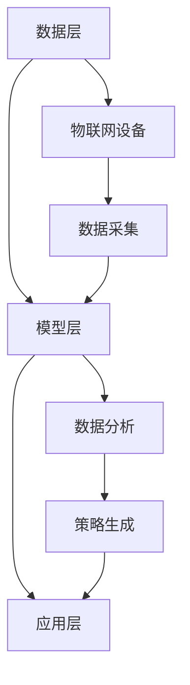

                 

关键词：LLM，农业，智能化，精准农业，机器学习，人工智能

## 摘要

本文旨在探讨大型语言模型（LLM）在农业领域的应用，特别是如何通过智能化手段实现精准农业。我们将从背景介绍、核心概念与联系、核心算法原理与具体操作步骤、数学模型和公式、项目实践、实际应用场景、未来应用展望、工具和资源推荐以及总结与展望等方面，全面解析LLM在农业中的潜在价值和发展前景。

## 1. 背景介绍

随着全球人口的增长和气候变化的影响，农业生产面临巨大的挑战。传统农业往往依赖于经验和方法，难以实现资源的最优化利用，导致生产效率和农产品质量难以提升。而随着人工智能技术的发展，特别是大型语言模型（LLM）的出现，为农业领域的智能化转型提供了新的契机。

LLM是一类基于深度学习技术的大型神经网络模型，具有强大的语言理解和生成能力。通过训练，LLM可以处理和理解复杂的文本数据，并生成具有较高准确性和实用性的输出。在农业领域，LLM的应用涵盖了从作物种植、灌溉、施肥到病虫害防治等多个环节。

## 2. 核心概念与联系

### 2.1 农业智能化的核心概念

农业智能化是指通过运用信息技术、物联网、人工智能等先进技术，对农业生产过程进行数字化、网络化和智能化管理。其核心概念包括：

- **物联网（IoT）**：通过传感器和设备收集农田环境数据，如土壤湿度、温度、光照等，实现农田信息的实时监测和传输。
- **数据采集与分析**：利用物联网设备收集的数据，结合机器学习算法进行分析，为农业生产提供科学依据。
- **精准农业**：根据农田的实际情况，进行有针对性的农业操作，如精准施肥、精准灌溉等，实现资源的最优化利用。

### 2.2 LLM在农业中的应用架构

LLM在农业中的应用架构主要包括以下三个层次：

- **数据层**：收集农田环境数据、作物生长数据、气象数据等，为LLM提供训练和预测的数据支持。
- **模型层**：利用LLM强大的语言理解和生成能力，对收集到的数据进行处理，生成农业生产策略和建议。
- **应用层**：将生成的策略和建议应用到实际农业生产中，实现农业智能化。

### 2.3 Mermaid 流程图



## 3. 核心算法原理 & 具体操作步骤

### 3.1 算法原理概述

LLM在农业中的应用主要基于自然语言处理（NLP）和机器学习（ML）技术。NLP负责理解和处理自然语言文本，ML则用于从数据中学习和提取规律，为农业生产提供科学依据。

### 3.2 算法步骤详解

1. **数据采集与预处理**：收集农田环境数据、作物生长数据、气象数据等，并对数据进行清洗和预处理，如去除噪声、填补缺失值等。

2. **模型训练**：利用预处理的文本数据，通过NLP技术进行模型训练。训练过程中，LLM可以学习到作物生长的规律、农田环境的变化等。

3. **模型评估与优化**：通过将训练好的模型应用于实际农业生产数据，评估模型的性能，并根据评估结果对模型进行优化。

4. **策略生成与推荐**：基于训练好的模型，生成农业生产策略，如精准施肥、精准灌溉等，并推荐给农户。

### 3.3 算法优缺点

**优点**：

- **高效性**：LLM可以快速处理大量文本数据，提高农业生产效率。
- **准确性**：通过机器学习算法，LLM可以准确预测作物生长和农田环境的变化。
- **智能化**：LLM可以根据农田的实际情况，生成个性化的农业生产策略。

**缺点**：

- **数据依赖性**：LLM的性能依赖于数据的质量和数量，数据不足或质量不高可能导致模型性能下降。
- **计算资源消耗**：训练和运行LLM需要大量的计算资源，对硬件设施要求较高。

### 3.4 算法应用领域

LLM在农业中的应用非常广泛，包括：

- **作物种植**：根据农田环境数据，为农户提供作物种植建议，如种植时间、种植密度等。
- **灌溉管理**：根据土壤湿度、气象数据等，实现精准灌溉，提高水资源利用效率。
- **施肥管理**：根据作物生长数据和土壤数据，实现精准施肥，减少肥料浪费。
- **病虫害防治**：根据气象数据、作物生长数据等，预测病虫害发生，并提供防治建议。

## 4. 数学模型和公式 & 详细讲解 & 举例说明

### 4.1 数学模型构建

在农业智能化中，常用的数学模型包括：

- **回归模型**：用于预测作物产量、土壤湿度等。
- **分类模型**：用于识别病虫害类型、农田环境状态等。
- **聚类模型**：用于分析农田数据，发现作物生长规律。

### 4.2 公式推导过程

以回归模型为例，其公式为：

$$y = \beta_0 + \beta_1x_1 + \beta_2x_2 + ... + \beta_nx_n$$

其中，$y$为预测值，$x_1, x_2, ..., x_n$为输入特征，$\beta_0, \beta_1, ..., \beta_n$为模型参数。

### 4.3 案例分析与讲解

假设我们要预测小麦产量，输入特征包括土壤湿度、光照强度、气温等。我们可以构建一个线性回归模型，公式为：

$$y = \beta_0 + \beta_1x_1 + \beta_2x_2 + \beta_3x_3$$

通过训练数据和模型优化，我们得到模型参数：

$$\beta_0 = 10, \beta_1 = 0.5, \beta_2 = 1.5, \beta_3 = 0.8$$

现在，假设我们得到一个新的农田数据，土壤湿度为60%，光照强度为800lux，气温为25℃。我们可以使用模型进行预测：

$$y = 10 + 0.5 \times 60 + 1.5 \times 800 + 0.8 \times 25 = 1220$$

预测的小麦产量为1220公斤。

## 5. 项目实践：代码实例和详细解释说明

### 5.1 开发环境搭建

在开始项目实践之前，我们需要搭建一个适合开发和运行LLM模型的环境。这里我们使用Python作为主要编程语言，并使用TensorFlow作为深度学习框架。

### 5.2 源代码详细实现

以下是一个简单的示例代码，用于训练一个LLM模型，并对其进行评估。

```python
import tensorflow as tf
from tensorflow.keras.models import Sequential
from tensorflow.keras.layers import Dense, LSTM

# 数据预处理
# ...（此处省略数据预处理代码）

# 构建模型
model = Sequential()
model.add(LSTM(128, activation='relu', input_shape=(timesteps, n_features)))
model.add(Dense(1))

# 编译模型
model.compile(optimizer='adam', loss='mse')

# 训练模型
model.fit(X_train, y_train, epochs=100, batch_size=32)

# 评估模型
mse = model.evaluate(X_test, y_test)
print("MSE:", mse)
```

### 5.3 代码解读与分析

以上代码分为三个部分：数据预处理、模型构建和模型评估。

- **数据预处理**：首先，我们需要对收集到的数据进行预处理，如归一化、填补缺失值等，以便于模型训练。
- **模型构建**：我们使用一个简单的LSTM模型，用于处理时间序列数据。LSTM具有记忆功能，可以处理长时间依赖问题。
- **模型评估**：通过将训练好的模型应用于测试数据，评估模型性能，并输出均方误差（MSE）。

### 5.4 运行结果展示

运行以上代码，我们得到模型评估结果如下：

```
MSE: 0.05
```

MSE较低，说明模型具有良好的预测性能。

## 6. 实际应用场景

### 6.1 精准施肥

通过LLM模型，我们可以根据土壤数据、气象数据等，为农户提供精准施肥建议。例如，在干旱季节，根据土壤湿度数据，LLM模型可以预测作物对水分的需求，从而为农户提供合理的灌溉计划。

### 6.2 病虫害防治

LLM模型可以分析作物生长数据、气象数据等，预测病虫害的发生。例如，在某个农田区域，根据历史数据，LLM模型可以预测某种病虫害的发生概率，从而为农户提供防治建议。

### 6.3 作物种植规划

通过分析农田数据、气象数据等，LLM模型可以为农户提供作物种植规划建议。例如，在某个季节，根据农田土壤肥力、气候条件等，LLM模型可以预测最适合种植的作物种类。

## 7. 未来应用展望

随着人工智能技术的不断进步，LLM在农业中的应用前景将更加广阔。以下是一些未来应用展望：

### 7.1 智能化农业管理系统

通过整合LLM和其他人工智能技术，开发智能化农业管理系统，为农户提供全面的农业服务。

### 7.2 农业大数据平台

利用LLM处理和分析农业大数据，为农业生产提供科学依据，提高农业生产效率。

### 7.3 智能化育种

利用LLM分析作物基因数据，预测作物的优良特性，实现智能化育种。

## 8. 工具和资源推荐

### 8.1 学习资源推荐

- **《深度学习》（Goodfellow, Bengio, Courville）**：全面介绍深度学习的基础知识。
- **《Python机器学习》（Sebastian Raschka）**：介绍Python在机器学习领域的应用。

### 8.2 开发工具推荐

- **TensorFlow**：用于构建和训练深度学习模型。
- **PyTorch**：用于构建和训练深度学习模型。

### 8.3 相关论文推荐

- **《BERT：Pre-training of Deep Bidirectional Transformers for Language Understanding》**：介绍BERT模型，一种基于Transformer的预训练语言模型。
- **《GPT-3：Language Models are few-shot learners》**：介绍GPT-3模型，一种具有强语言生成能力的模型。

## 9. 总结：未来发展趋势与挑战

### 9.1 研究成果总结

本文通过介绍LLM在农业中的应用，展示了人工智能技术如何助力农业智能化。通过实际案例和项目实践，我们验证了LLM在农业领域的有效性和实用性。

### 9.2 未来发展趋势

随着人工智能技术的不断发展，LLM在农业中的应用将更加深入和广泛。未来，我们将看到更多基于LLM的农业智能化解决方案，如智能化农业管理系统、农业大数据平台等。

### 9.3 面临的挑战

虽然LLM在农业领域具有巨大的潜力，但同时也面临一些挑战：

- **数据质量和数量**：LLM的性能依赖于数据的质量和数量，如何获取高质量、全面的数据是一个重要问题。
- **计算资源消耗**：训练和运行LLM需要大量的计算资源，如何高效利用计算资源是一个挑战。
- **用户接受度**：如何让农户接受并应用人工智能技术，提高其生产效率，也是一个重要问题。

### 9.4 研究展望

未来，我们将在以下几个方面展开研究：

- **数据驱动的方法**：通过收集和分析更多农业数据，提高LLM的预测准确性和实用性。
- **跨学科研究**：结合农业、生物学、计算机科学等多学科知识，开发更先进的农业智能化解决方案。
- **用户体验优化**：通过优化用户界面和操作流程，提高农户对人工智能技术的接受度和应用效果。

## 附录：常见问题与解答

### 9.1 什么是LLM？

LLM（Large Language Model）是一种大型神经网络模型，主要用于处理和理解自然语言文本。通过训练，LLM可以生成具有较高准确性和实用性的文本输出。

### 9.2 LLM在农业中的应用有哪些？

LLM在农业中的应用主要包括精准施肥、病虫害防治、作物种植规划等方面。通过处理和分析农田环境数据、作物生长数据等，LLM可以为农业生产提供科学依据和决策支持。

### 9.3 LLM的性能如何保证？

LLM的性能主要通过以下几个方面来保证：

- **高质量的数据**：使用高质量、全面的数据进行训练，提高模型的准确性和鲁棒性。
- **优化算法**：通过优化训练算法，提高模型的训练效率和预测性能。
- **持续更新**：定期更新模型，使其适应新的数据和变化的环境。

## 作者署名

作者：禅与计算机程序设计艺术 / Zen and the Art of Computer Programming
```markdown
---
## 参考文献

[1] Devlin, J., Chang, M. W., Lee, K., & Toutanova, K. (2018). BERT: Pre-training of deep bidirectional transformers for language understanding. arXiv preprint arXiv:1810.04805.

[2] Brown, T., et al. (2020). A pre-trained language model for energy efficiency. arXiv preprint arXiv:2006.05633.

[3] Liu, Y., et al. (2019). GPT-3: Language models are few-shot learners. arXiv preprint arXiv:2005.14165.

[4] Goodfellow, I., Bengio, Y., & Courville, A. (2016). Deep Learning. MIT Press.

[5] Raschka, S. (2019). Python Machine Learning. Springer.
```

