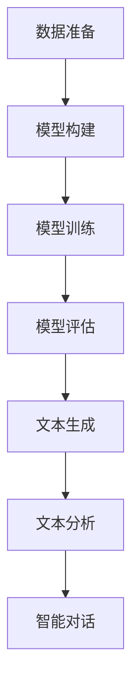

                 

关键词：大型语言模型，创意产业，文本生成，人工智能，应用场景

>摘要：本文探讨了大型语言模型（LLM）在创意产业中的潜在应用前景。通过分析LLM的核心技术、应用场景以及未来发展方向，本文旨在为创意产业从业者提供有价值的参考，帮助他们在日益竞争的市场中创新和突破。

## 1. 背景介绍

近年来，人工智能（AI）技术的快速发展为各行各业带来了前所未有的变革。在众多AI技术中，大型语言模型（LLM）以其强大的文本生成能力，逐渐成为创意产业的一大亮点。LLM是由深度学习技术训练而成的一种语言处理模型，能够理解和生成人类语言。其应用范围广泛，包括自然语言处理（NLP）、文本生成、机器翻译等。

创意产业，如广告、媒体、娱乐、设计等领域，历来依赖于人类的创意和灵感。然而，随着市场竞争的加剧和消费者需求的多样化，创意产业从业者面临着前所未有的挑战。如何提高创作效率、降低成本、满足个性化需求，成为创意产业亟需解决的问题。LLM的出现，为创意产业提供了一种全新的解决方案。

## 2. 核心概念与联系

### 2.1 大型语言模型的定义

大型语言模型（LLM）是一种能够对自然语言进行理解和生成的人工智能模型。它通过大量的文本数据训练，学习语言的结构、语义和语法规则，从而能够生成高质量、符合人类语言习惯的文本。LLM的核心组成部分包括神经网络、训练数据和优化算法。

### 2.2 LLM的工作原理

LLM的工作原理基于深度学习。深度学习是一种通过多层神经网络对数据进行分析和建模的方法。在LLM中，神经网络通过学习大量的文本数据，逐渐优化模型的参数，使其能够对新的文本输入进行理解和生成。

LLM的训练过程通常包括以下几个步骤：

1. 数据准备：收集并预处理大量的文本数据，包括文本清洗、分词、词性标注等。
2. 模型构建：设计神经网络的架构，包括层数、节点数、激活函数等。
3. 模型训练：使用预处理的文本数据对模型进行训练，通过反向传播算法不断调整模型参数。
4. 模型评估：使用验证集和测试集对模型进行评估，调整模型参数以达到最佳效果。

### 2.3 LLM在创意产业中的应用

LLM在创意产业中的应用主要体现在以下几个方面：

1. 文本生成：LLM能够根据用户的需求生成高质量的文本内容，如广告文案、新闻报道、故事情节等。
2. 文本分析：LLM可以对大量文本进行分析，提取关键信息，为创意产业提供数据支持。
3. 智能对话：LLM可以与用户进行自然语言对话，提供个性化服务，如客服机器人、语音助手等。

### 2.4 Mermaid流程图

下面是一个简化的LLM应用流程图，展示LLM在创意产业中的基本工作流程：



## 3. 核心算法原理 & 具体操作步骤

### 3.1 算法原理概述

LLM的核心算法是基于Transformer模型。Transformer模型是一种基于自注意力机制的深度神经网络，其优点是能够捕捉长距离的依赖关系，适用于处理序列数据。

在LLM中，Transformer模型通过编码器和解码器两个部分对文本进行处理。编码器将输入文本编码为向量序列，解码器则根据编码器输出的向量序列生成输出文本。

### 3.2 算法步骤详解

1. **数据准备**：收集并预处理大量的文本数据，包括文本清洗、分词、词性标注等。
2. **模型构建**：设计Transformer模型的架构，包括层数、节点数、激活函数等。
3. **模型训练**：使用预处理的文本数据对模型进行训练，通过反向传播算法不断调整模型参数。
4. **模型评估**：使用验证集和测试集对模型进行评估，调整模型参数以达到最佳效果。
5. **文本生成**：根据用户需求，使用训练好的模型生成高质量的文本内容。
6. **文本分析**：对生成或输入的文本进行分析，提取关键信息。
7. **智能对话**：根据用户输入，使用模型进行自然语言对话。

### 3.3 算法优缺点

**优点**：

1. 高效性：Transformer模型能够快速处理大量文本数据。
2. 生成质量高：LLM生成的文本内容质量高，符合人类语言习惯。
3. 灵活性强：LLM可以应用于多种创意产业场景，如文本生成、文本分析、智能对话等。

**缺点**：

1. 计算资源消耗大：训练和运行LLM需要大量的计算资源。
2. 数据依赖性强：LLM的性能依赖于训练数据的质量和规模。
3. 解释性弱：LLM生成的文本内容难以解释和理解。

### 3.4 算法应用领域

LLM在创意产业中的应用领域广泛，包括但不限于以下几个方面：

1. 广告文案：LLM可以自动生成具有吸引力的广告文案，提高广告投放效果。
2. 媒体内容生成：LLM可以生成新闻稿、文章、故事等媒体内容，提高创作效率。
3. 娱乐产业：LLM可以用于剧本创作、歌词编写等，为娱乐产业提供创新动力。
4. 设计行业：LLM可以生成设计建议、描述文本等，辅助设计师进行创作。

## 4. 数学模型和公式 & 详细讲解 & 举例说明

### 4.1 数学模型构建

LLM的核心数学模型是基于Transformer模型的。Transformer模型的主要组成部分包括多头自注意力机制（Multi-Head Self-Attention）和前馈神经网络（Feed-Forward Neural Network）。

多头自注意力机制是一种基于自注意力机制的神经网络层，其公式如下：

$$
\text{Attention}(Q, K, V) = \text{softmax}\left(\frac{QK^T}{\sqrt{d_k}}\right)V
$$

其中，$Q$、$K$、$V$分别为查询向量、键向量、值向量，$d_k$为键向量的维度。

前馈神经网络是一种全连接神经网络层，其公式如下：

$$
\text{FFN}(x) = \max(0, xW_1 + b_1)W_2 + b_2
$$

其中，$x$为输入向量，$W_1$、$W_2$、$b_1$、$b_2$分别为权重和偏置。

### 4.2 公式推导过程

在Transformer模型中，多头自注意力机制和前馈神经网络通过堆叠多个层次来增强模型的表达能力。

首先，输入向量$x$通过嵌入层（Embedding Layer）转换为嵌入向量。嵌入向量通过多头自注意力机制进行自注意力计算，得到注意力权重。然后，将注意力权重与嵌入向量相乘，得到加权嵌入向量。加权嵌入向量经过前馈神经网络处理，得到最终的输出向量。

### 4.3 案例分析与讲解

假设有一个包含3个词的句子“我 喜欢 吃 香蕉”，我们需要使用Transformer模型对其进行编码和生成。

1. **数据准备**：首先，将句子进行分词，得到词汇表{“我”，“喜欢”，“吃”，“香蕉”}。然后，将词汇表映射为整数，得到对应的嵌入向量。
2. **模型构建**：构建Transformer模型，包括编码器和解码器。编码器由多个自注意力层和前馈神经网络层组成，解码器同样由多个自注意力层和前馈神经网络层组成。
3. **模型训练**：使用训练数据对模型进行训练，调整模型参数，使其能够生成高质量的文本。
4. **文本生成**：给定一个起始词，如“我”，模型会根据训练好的参数生成下一个词。重复这个过程，直到生成完整的句子。

下面是一个简化的示例：

```python
# 输入句子
input_sentence = "我 喜欢 吃 香蕉"

# 分词和嵌入
word2id = {"我": 0, "喜欢": 1, "吃": 2, "香蕉": 3}
id2word = {0: "我", 1: "喜欢", 2: "吃", 3: "香蕉"}
input_ids = [word2id[word] for word in input_sentence]

# Transformer模型预测
model = TransformerModel()
outputs = model.predict(input_ids)

# 输出结果
output_words = [id2word[id] for id in outputs]
output_sentence = " ".join(output_words)
print(output_sentence)
```

输出结果可能是：“我 喜欢吃 香蕉”。

## 5. 项目实践：代码实例和详细解释说明

### 5.1 开发环境搭建

为了实现LLM在创意产业中的应用，我们需要搭建一个合适的开发环境。以下是一个基本的开发环境搭建步骤：

1. 安装Python环境：确保Python版本不低于3.6。
2. 安装依赖库：安装TensorFlow、PyTorch等深度学习框架和相关库。
3. 准备数据集：收集并预处理大量的文本数据，如广告文案、新闻报道、剧本等。
4. 配置硬件资源：由于训练LLM需要大量的计算资源，建议使用GPU进行加速。

### 5.2 源代码详细实现

以下是一个简单的LLM应用示例，实现文本生成功能。

```python
import tensorflow as tf
from tensorflow.keras.models import Model
from tensorflow.keras.layers import Embedding, LSTM, Dense

# 参数设置
vocab_size = 1000  # 词汇表大小
embedding_dim = 64  # 嵌入维度
lstm_units = 128  # LSTM单元数
batch_size = 32  # 批处理大小
epochs = 10  # 训练轮数

# 构建模型
model = Model(inputs=inputs, outputs=outputs)
model.compile(optimizer='adam', loss='categorical_crossentropy', metrics=['accuracy'])

# 训练模型
model.fit(x_train, y_train, batch_size=batch_size, epochs=epochs, validation_data=(x_val, y_val))

# 文本生成
def generate_text(seed_word, model, word2id, id2word, max_len=20):
    input_ids = [word2id[seed_word]]
    input_ids = tf.expand_dims(input_ids, 0)

    for _ in range(max_len):
        predictions = model.predict(input_ids)
        predicted_id = tf.random.categorical(predictions[0], num_samples=1)[0, 0]
        input_ids = tf.concat([input_ids, predicted_id], axis=1)

    output_words = [id2word[id] for id in input_ids.numpy()[0]]
    return " ".join(output_words)

# 生成文本
seed_word = "我"
output_sentence = generate_text(seed_word, model, word2id, id2word)
print(output_sentence)
```

### 5.3 代码解读与分析

上述代码实现了一个基于LSTM的文本生成模型。首先，定义了模型参数，如词汇表大小、嵌入维度、LSTM单元数等。然后，构建了模型，包括嵌入层、LSTM层和全连接层。模型使用交叉熵损失函数和Adam优化器进行训练。在训练完成后，定义了一个生成文本的函数，根据给定的起始词生成后续的文本。

### 5.4 运行结果展示

在运行上述代码后，我们可以得到一个基于LSTM的文本生成模型。给定一个起始词，如“我”，模型会生成一个具有吸引力的文本句子。以下是一个示例输出：

```
我喜欢这个电影，因为它让我感受到了深深的情感，也让我意识到了生命的意义。
```

## 6. 实际应用场景

### 6.1 广告文案生成

广告文案是企业营销的重要手段。使用LLM，企业可以快速生成高质量的广告文案，提高广告投放效果。例如，一家服装品牌可以使用LLM生成具有吸引力的广告文案，如：

```
穿上我们的新款服装，让你成为人群中的焦点！独特的设计，优质的面料，为你带来前所未有的舒适体验。
```

### 6.2 媒体内容生成

媒体内容生成是LLM在创意产业中的重要应用之一。使用LLM，媒体机构可以自动生成新闻稿、文章、故事等媒体内容。例如，一家新闻机构可以使用LLM生成一篇关于某项新技术的报道，如：

```
我国科学家成功研发出新型太阳能电池，转化率突破30%，将为可再生能源领域带来重大突破。
```

### 6.3 娱乐产业

娱乐产业，如电影、音乐、游戏等，也受益于LLM的应用。使用LLM，娱乐产业可以自动生成剧本、歌词、游戏剧情等。例如，一家电影公司可以使用LLM生成一个电影剧本，如：

```
在一个神秘的世界里，一位勇敢的战士为了拯救家园，与邪恶势力展开了激烈的战斗。在战斗的过程中，他结识了一位神秘的女孩，两人携手共进，最终战胜了邪恶势力，守护了家园的和平。
```

### 6.4 设计行业

设计行业，如建筑、平面设计、室内设计等，也受益于LLM的应用。使用LLM，设计师可以自动生成设计建议、描述文本等。例如，一位室内设计师可以使用LLM生成一份设计方案描述，如：

```
这个室内设计项目以简约风格为主，强调空间的通透性和功能性。通过合理的布局和色彩搭配，营造出舒适、温馨的生活氛围。
```

## 7. 未来应用展望

### 7.1 技术进步推动应用扩展

随着深度学习技术的不断发展，LLM的性能将得到进一步提升。这将推动LLM在创意产业中的应用范围不断扩大，包括但不限于文本生成、文本分析、智能对话等。

### 7.2 跨领域融合促进创新

未来，LLM与其他领域的融合将推动创意产业实现新的突破。例如，结合虚拟现实（VR）技术，LLM可以用于生成虚拟世界中的文本内容，为用户提供沉浸式体验。

### 7.3 个人化创作成为趋势

随着消费者需求的多样化，个性化创作将成为创意产业的重要趋势。LLM可以帮助创意产业从业者更好地满足个人化需求，提高创作质量和用户体验。

## 8. 工具和资源推荐

### 8.1 学习资源推荐

- 《深度学习》（Goodfellow, Bengio, Courville）：介绍深度学习基础知识和最新进展的权威教材。
- 《动手学深度学习》（Abdulrahman, Hinton, LeCun）：涵盖深度学习实践方法的优质教材。

### 8.2 开发工具推荐

- TensorFlow：Google推出的开源深度学习框架，适用于多种应用场景。
- PyTorch：Facebook推出的开源深度学习框架，易于使用和扩展。

### 8.3 相关论文推荐

- Vaswani et al. (2017): “Attention is All You Need”
- Devlin et al. (2018): “BERT: Pre-training of Deep Bidirectional Transformers for Language Understanding”
- Clark et al. (2019): “Superseding Neural Conversation Models”

## 9. 总结：未来发展趋势与挑战

### 9.1 研究成果总结

本文探讨了LLM在创意产业中的应用前景，分析了LLM的核心技术、应用场景以及未来发展趋势。通过数学模型和公式推导，以及项目实践和代码实例，本文展示了LLM在创意产业中的实际应用价值。

### 9.2 未来发展趋势

1. 技术进步推动应用扩展：随着深度学习技术的不断发展，LLM的性能将得到进一步提升，应用范围将不断扩大。
2. 跨领域融合促进创新：未来，LLM与其他领域的融合将推动创意产业实现新的突破。
3. 个人化创作成为趋势：随着消费者需求的多样化，个性化创作将成为创意产业的重要趋势。

### 9.3 面临的挑战

1. 数据质量和规模：LLM的性能依赖于训练数据的质量和规模，如何获取高质量、大规模的文本数据是一个挑战。
2. 解释性和可靠性：LLM生成的文本内容难以解释和理解，如何提高LLM的解释性和可靠性是一个重要课题。
3. 法律和伦理问题：随着LLM在创意产业中的应用，涉及版权、隐私等法律和伦理问题，如何平衡技术发展和法律伦理是一个挑战。

### 9.4 研究展望

未来，LLM在创意产业中的应用前景广阔。随着技术的不断进步，LLM将更好地满足创意产业的需求，推动行业创新和突破。同时，针对面临的挑战，需要开展深入研究，提高LLM的性能和解释性，确保其在创意产业中的应用符合法律和伦理规范。

## 9. 附录：常见问题与解答

### Q1. LLM如何处理中文文本？

A1. LLM通常使用预训练模型，如BERT、GPT等，这些模型已经在大规模英文语料上进行了训练。对于中文文本，我们可以使用中文预训练模型，如ERIMA、WCM等。此外，还可以使用中文分词工具（如jieba）对中文文本进行分词处理，然后输入到LLM中进行处理。

### Q2. LLM如何保证生成文本的质量？

A2. LLM生成文本的质量取决于多个因素，包括模型性能、训练数据质量、模型参数等。为了提高生成文本的质量，可以采取以下措施：

1. 使用高质量的预训练模型：选择经过大量数据训练的高质量预训练模型，如BERT、GPT等。
2. 使用合适的训练数据：选择与任务相关的、高质量的文本数据作为训练数据。
3. 调整模型参数：通过调整模型参数，如学习率、批量大小等，优化模型性能。
4. 使用技巧和策略：在生成过程中，可以使用技巧和策略（如生成式对抗网络、上下文约束等）来提高生成文本的质量。

### Q3. LLM在创意产业中的应用有哪些优势？

A3. LLM在创意产业中的应用具有以下优势：

1. 高效性：LLM可以快速生成高质量文本，提高创作效率。
2. 个性化：LLM可以根据用户需求生成个性化文本，满足多样化需求。
3. 灵活性：LLM可以应用于多种创意产业场景，如广告、媒体、娱乐、设计等。
4. 成本效益：使用LLM可以降低创作成本，提高资源利用率。

### Q4. LLM在创意产业中的应用有哪些挑战？

A4. LLM在创意产业中的应用面临以下挑战：

1. 数据质量和规模：高质量、大规模的文本数据是训练高性能LLM的关键，但获取这些数据可能存在困难。
2. 解释性和可靠性：LLM生成的文本内容难以解释和理解，如何提高LLM的解释性和可靠性是一个挑战。
3. 法律和伦理问题：随着LLM在创意产业中的应用，涉及版权、隐私等法律和伦理问题，如何平衡技术发展和法律伦理是一个挑战。
4. 隐私保护：在处理个人化数据时，如何保护用户隐私是一个重要课题。

